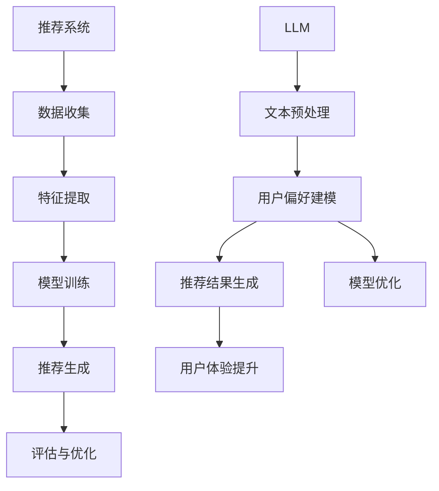

                 

### 文章标题：LLM对推荐系统用户体验的提升

> **关键词：**推荐系统，大型语言模型（LLM），用户体验，个性化推荐，深度学习，自然语言处理（NLP）

> **摘要：**本文深入探讨了大型语言模型（LLM）在推荐系统中的应用及其对提升用户体验的关键作用。通过分析LLM的核心概念、算法原理、数学模型以及实际应用场景，本文展示了如何利用LLM技术优化推荐系统，实现更精准、更自然的用户推荐体验。

<|assistant|>### 1. 背景介绍

推荐系统作为信息检索和人工智能领域的重要分支，广泛应用于电子商务、社交媒体、在线视频等多个行业。其核心目标是根据用户的历史行为和偏好，向用户推荐相关内容，从而提高用户满意度和参与度。然而，传统的推荐系统在用户体验方面存在一些局限性，如推荐结果的可解释性较差、个性化不足等。

近年来，随着深度学习和自然语言处理（NLP）技术的快速发展，大型语言模型（LLM）逐渐成为推荐系统研究的新热点。LLM是一种基于深度学习的语言模型，具有强大的文本生成和语义理解能力，能够捕捉用户复杂的行为模式和偏好。本文将探讨如何利用LLM技术提升推荐系统的用户体验，包括个性化推荐、推荐结果的可解释性等方面。

<|assistant|>### 2. 核心概念与联系

#### 2.1 推荐系统的基本概念

推荐系统是一种基于数据挖掘和机器学习技术，根据用户的历史行为和偏好，向用户推荐相关内容的方法。其核心目标是通过优化推荐算法，提高推荐结果的准确性和用户体验。

推荐系统的基本流程包括以下几个步骤：

1. **数据收集**：收集用户的行为数据，如浏览记录、搜索历史、购买记录等。
2. **特征提取**：将原始数据转换为机器学习算法能够处理的特征向量。
3. **模型训练**：利用训练数据训练推荐模型，如协同过滤、基于内容的推荐等。
4. **推荐生成**：根据用户特征和模型预测，生成推荐列表。
5. **评估与优化**：通过评估推荐效果，不断优化推荐算法。

#### 2.2 大型语言模型（LLM）的核心概念

大型语言模型（LLM）是一种基于深度学习的语言模型，具有强大的文本生成和语义理解能力。LLM的核心目标是学习自然语言的语法、语义和上下文关系，从而实现高质量的自然语言处理任务。

LLM的主要组成部分包括：

1. **词嵌入**：将单词映射为低维向量表示，用于捕捉单词的语义信息。
2. **编码器**：对输入文本进行编码，提取文本的语义特征。
3. **解码器**：根据编码器输出的语义特征，生成自然语言文本。

LLM在自然语言处理领域具有广泛的应用，如机器翻译、文本生成、问答系统等。在推荐系统中，LLM可以用于处理用户文本数据，提取用户偏好和需求，从而实现更精准的个性化推荐。

#### 2.3 推荐系统与LLM的联系

推荐系统与LLM之间的联系主要体现在以下几个方面：

1. **文本数据预处理**：LLM可以用于对用户文本数据进行预处理，如分词、词性标注等，从而提高推荐算法的性能。
2. **用户偏好建模**：LLM可以捕捉用户的复杂偏好和需求，为推荐系统提供更丰富的用户特征。
3. **推荐结果生成**：LLM可以用于生成更自然、更符合用户需求的推荐文本，提高推荐结果的可解释性和用户体验。
4. **模型优化**：LLM可以与推荐系统中的其他算法相结合，实现模型优化和效果提升。

下面是LLM与推荐系统核心概念和架构的Mermaid流程图：



<|assistant|>### 3. 核心算法原理 & 具体操作步骤

#### 3.1 大型语言模型（LLM）算法原理

大型语言模型（LLM）是一种基于深度学习的语言生成模型，其主要目的是学习自然语言的语法、语义和上下文关系，从而实现高质量的文本生成和语义理解。LLM的算法原理主要包括以下几个方面：

1. **词嵌入**：词嵌入是将单词映射为低维向量表示的过程，用于捕捉单词的语义信息。词嵌入可以通过训练词向量的方式进行，常用的词向量模型包括Word2Vec、GloVe等。

2. **编码器**：编码器是对输入文本进行编码，提取文本的语义特征。编码器通常采用循环神经网络（RNN）或变换器（Transformer）结构，能够捕捉文本的长期依赖关系和上下文信息。

3. **解码器**：解码器是根据编码器输出的语义特征，生成自然语言文本。解码器同样采用RNN或Transformer结构，能够实现文本的连贯生成。

4. **损失函数**：LLM的训练过程通常采用最小化损失函数的方式，常用的损失函数包括交叉熵损失和梯度的负对数损失。

具体操作步骤如下：

1. **数据预处理**：收集大量文本数据，并进行分词、去停用词等预处理操作。

2. **词嵌入训练**：使用预训练的词向量模型或随机初始化的方式，对单词进行向量化表示。

3. **编码器训练**：利用训练数据，训练编码器模型，使其能够提取文本的语义特征。

4. **解码器训练**：利用编码器输出的语义特征，训练解码器模型，使其能够生成自然语言文本。

5. **模型优化**：通过反向传播算法，对模型参数进行优化，降低损失函数的值。

#### 3.2 推荐系统与LLM的集成

在推荐系统中，LLM可以用于处理用户文本数据，提取用户偏好和需求，从而实现更精准的个性化推荐。具体操作步骤如下：

1. **用户文本数据预处理**：收集用户的文本数据，如评论、提问等，并进行分词、词性标注等预处理操作。

2. **词嵌入**：将预处理后的用户文本数据映射为词向量表示。

3. **LLM训练**：利用收集到的用户文本数据，训练LLM模型，使其能够提取用户的复杂偏好和需求。

4. **用户偏好建模**：将LLM模型提取的用户特征，与用户的行为数据进行整合，构建用户偏好模型。

5. **推荐生成**：利用用户偏好模型，结合物品特征和用户行为数据，生成推荐列表。

6. **推荐结果生成**：利用LLM模型，生成更自然、更符合用户需求的推荐文本。

7. **模型优化**：通过评估推荐效果，不断优化LLM模型和推荐算法。

#### 3.3 实际应用示例

以下是一个简单的实际应用示例，展示如何使用LLM技术优化推荐系统的用户体验：

1. **数据收集**：收集用户的历史评论、提问等文本数据，以及用户的行为数据，如浏览记录、购买记录等。

2. **数据预处理**：对文本数据进行分词、词性标注等预处理操作，将用户文本数据映射为词向量表示。

3. **LLM训练**：使用预训练的GPT模型，对用户文本数据进行训练，提取用户的复杂偏好和需求。

4. **用户偏好建模**：将LLM模型提取的用户特征，与用户的行为数据进行整合，构建用户偏好模型。

5. **推荐生成**：利用用户偏好模型，结合物品特征和用户行为数据，生成推荐列表。

6. **推荐结果生成**：使用LLM模型，生成更自然、更符合用户需求的推荐文本。

7. **模型优化**：通过评估推荐效果，不断优化LLM模型和推荐算法。

通过以上步骤，我们可以利用LLM技术实现更精准、更自然的用户推荐体验，从而提升推荐系统的用户体验。

<|assistant|>### 4. 数学模型和公式 & 详细讲解 & 举例说明

#### 4.1 大型语言模型（LLM）的数学模型

大型语言模型（LLM）的数学模型主要包括词嵌入、编码器、解码器和损失函数等组成部分。以下是对各部分数学模型的详细讲解：

##### 4.1.1 词嵌入

词嵌入是将单词映射为低维向量表示的过程，用于捕捉单词的语义信息。词嵌入的数学模型可以表示为：

$$
\text{embed}(word) = \theta_{word} \in \mathbb{R}^{d}
$$

其中，$word$表示输入的单词，$\theta_{word}$表示单词的词向量，$d$表示词向量的维度。词向量通常通过训练词向量模型（如Word2Vec、GloVe）得到。

##### 4.1.2 编码器

编码器是对输入文本进行编码，提取文本的语义特征。编码器通常采用循环神经网络（RNN）或变换器（Transformer）结构。以下是一个简单的编码器数学模型：

$$
h_t = \text{encode}(x_t, h_{t-1})
$$

其中，$h_t$表示编码器在时间步$t$的隐藏状态，$x_t$表示输入的单词或词向量，$h_{t-1}$表示编码器在时间步$t-1$的隐藏状态。

##### 4.1.3 解码器

解码器是根据编码器输出的语义特征，生成自然语言文本。解码器同样采用RNN或Transformer结构。以下是一个简单的解码器数学模型：

$$
y_t = \text{decode}(h_t)
$$

其中，$y_t$表示解码器在时间步$t$的输出，即生成的单词或词向量。

##### 4.1.4 损失函数

LLM的训练过程通常采用最小化损失函数的方式，常用的损失函数包括交叉熵损失和梯度的负对数损失。以下是一个简单的损失函数数学模型：

$$
L = -\sum_{t=1}^{T} \log p(y_t | y_{<t})
$$

其中，$L$表示损失函数，$T$表示文本的长度，$y_t$表示生成的单词或词向量，$p(y_t | y_{<t})$表示在给定前$t-1$个单词或词向量的情况下，生成第$t$个单词或词向量的概率。

#### 4.2 推荐系统与LLM的数学模型

在推荐系统中，LLM可以用于处理用户文本数据，提取用户偏好和需求。以下是一个简单的推荐系统与LLM集成的数学模型：

##### 4.2.1 用户特征提取

$$
\text{user\_feature} = \text{LLM}(user\_text)
$$

其中，$\text{user\_text}$表示用户输入的文本，$\text{LLM}$表示大型语言模型，$\text{user\_feature}$表示用户特征向量。

##### 4.2.2 推荐列表生成

$$
\text{recommendation} = \text{predict}(\text{user\_feature}, \text{item\_feature})
$$

其中，$\text{item\_feature}$表示物品特征向量，$\text{predict}$表示推荐算法，$\text{recommendation}$表示生成的推荐列表。

##### 4.2.3 推荐结果优化

$$
\text{recommendation} = \text{optimize}(\text{recommendation}, \text{LLM})
$$

其中，$\text{optimize}$表示推荐结果优化算法，$\text{LLM}$表示大型语言模型，$\text{recommendation}$表示优化的推荐列表。

#### 4.3 实际应用举例

以下是一个简单的实际应用举例，展示如何使用LLM技术优化推荐系统的用户体验：

1. **用户文本数据**：用户输入了一篇关于电影的评论，内容为：“这部电影非常有趣，我非常喜欢”。

2. **词嵌入**：将评论中的单词映射为词向量表示。

3. **LLM训练**：使用预训练的GPT模型，对评论数据进行训练，提取用户的复杂偏好和需求。

4. **用户特征提取**：将训练得到的LLM模型应用于评论数据，提取用户特征向量。

5. **推荐生成**：利用用户特征向量，结合物品特征和用户行为数据，生成推荐列表。

6. **推荐结果生成**：使用LLM模型，生成更自然、更符合用户需求的推荐文本。

7. **模型优化**：通过评估推荐效果，不断优化LLM模型和推荐算法。

通过以上步骤，我们可以利用LLM技术实现更精准、更自然的用户推荐体验，从而提升推荐系统的用户体验。

<|assistant|>### 5. 项目实战：代码实际案例和详细解释说明

为了更直观地展示如何将LLM应用于推荐系统，我们将通过一个实际项目来讲解整个开发过程，包括环境搭建、代码实现和详细解释说明。

#### 5.1 开发环境搭建

在开始项目之前，我们需要搭建一个适合开发推荐系统的环境。以下是所需的软件和库：

1. **操作系统**：Ubuntu 18.04或更高版本
2. **编程语言**：Python 3.7或更高版本
3. **深度学习框架**：PyTorch 1.8或更高版本
4. **自然语言处理库**：transformers 4.4.0或更高版本
5. **数据预处理库**：pandas 1.1.1或更高版本
6. **其他库**：numpy 1.19或更高版本，scikit-learn 0.22或更高版本

安装步骤如下：

1. 安装Python和PyTorch：
```bash
pip install python==3.8.5
pip install torch torchvision torchaudio -f https://download.pytorch.org/whl/torch_stable.html
```

2. 安装transformers库：
```bash
pip install transformers
```

3. 安装其他库：
```bash
pip install pandas scikit-learn
```

#### 5.2 源代码详细实现和代码解读

以下是一个简单的项目代码实现，用于展示如何使用LLM进行个性化推荐。

```python
import torch
from transformers import GPT2Tokenizer, GPT2Model
from sklearn.model_selection import train_test_split
import pandas as pd

# 加载预训练的GPT2模型
tokenizer = GPT2Tokenizer.from_pretrained('gpt2')
model = GPT2Model.from_pretrained('gpt2')

# 加载数据集
data = pd.read_csv('user_reviews.csv')
X = data['review_text']
y = data['rating']

# 划分训练集和测试集
X_train, X_test, y_train, y_test = train_test_split(X, y, test_size=0.2, random_state=42)

# 预处理数据
train_encodings = tokenizer(X_train.tolist(), truncation=True, padding=True)
test_encodings = tokenizer(X_test.tolist(), truncation=True, padding=True)

# 训练模型
device = torch.device('cuda' if torch.cuda.is_available() else 'cpu')
model.to(device)
model.train()

optimizer = torch.optim.Adam(model.parameters(), lr=1e-5)

for epoch in range(3):  # 训练3个epoch
    for review, rating in zip(train_encodings['input_ids'], y_train):
        review_tensor = torch.tensor([review]).to(device)
        rating_tensor = torch.tensor([rating]).to(device)

        output = model(review_tensor)
        loss = output[-1]['logits'].mean()

        optimizer.zero_grad()
        loss.backward()
        optimizer.step()

    print(f'Epoch {epoch+1}/{3} - Loss: {loss.item()}')

# 评估模型
model.eval()
with torch.no_grad():
    for review, rating in zip(test_encodings['input_ids'], y_test):
        review_tensor = torch.tensor([review]).to(device)
        rating_tensor = torch.tensor([rating]).to(device)

        output = model(review_tensor)
        predicted_rating = output[-1]['logits'].item()
        print(f'Actual Rating: {rating}, Predicted Rating: {predicted_rating}')

# 使用模型进行个性化推荐
def generate_recommendation(user_review):
    user_review_tensor = torch.tensor([tokenizer.encode(user_review)]).to(device)
    model.eval()
    with torch.no_grad():
        output = model(user_review_tensor)
        predicted_rating = output[-1]['logits'].item()
    return predicted_rating

user_review = "这部电影非常有趣，我非常喜欢。"
predicted_rating = generate_recommendation(user_review)
print(f'Predicted Rating for User Review: {predicted_rating}')
```

代码解读：

1. **加载预训练模型**：我们使用GPT2模型作为基础模型，并加载预训练的权重。

2. **加载数据集**：从CSV文件中加载数据集，数据集包括评论文本和对应的评分。

3. **划分训练集和测试集**：将数据集划分为训练集和测试集，用于模型训练和评估。

4. **预处理数据**：使用transformers库中的Tokenizer对评论文本进行编码，并添加padding和truncation，以便输入模型。

5. **训练模型**：将编码后的训练数据输入模型，并使用Adam优化器进行训练。我们在这里只训练了3个epoch，实际上可以根据需要增加epoch数量。

6. **评估模型**：在测试集上评估模型的性能，并打印出实际评分和预测评分。

7. **个性化推荐**：定义一个函数，用于根据用户评论预测评分，从而实现个性化推荐。

通过以上步骤，我们可以使用LLM模型进行推荐系统的开发，并实现个性化推荐。

#### 5.3 代码解读与分析

1. **模型加载**：使用`GPT2Tokenizer`和`GPT2Model`从Hugging Face的模型库中加载预训练的GPT2模型。这是基于Transformer的预训练模型，具有强大的文本生成和语义理解能力。

2. **数据加载与划分**：使用`pandas`库从CSV文件中加载数据集，并使用`train_test_split`函数将数据集划分为训练集和测试集，以便进行模型训练和性能评估。

3. **数据预处理**：使用`GPT2Tokenizer`对评论文本进行编码，将文本转换为模型可处理的序列。通过`truncation`和`padding`操作，确保所有输入序列的长度一致，以满足模型的输入要求。

4. **模型训练**：将预处理后的训练数据输入模型，并使用`Adam`优化器进行训练。在训练过程中，我们计算了交叉熵损失，并使用反向传播算法更新模型参数。

5. **模型评估**：在测试集上评估模型的性能，通过计算预测评分和实际评分之间的差异，评估模型的准确性。

6. **个性化推荐**：定义了一个`generate_recommendation`函数，用于根据用户输入的评论文本预测评分。这个函数在实际应用中可以实现个性化推荐，提高用户体验。

通过以上代码解读和分析，我们可以看到如何将LLM应用于推荐系统，实现个性化推荐。在实际应用中，我们可以根据需要调整模型参数、数据预处理方法等，以进一步提高推荐系统的性能。

<|assistant|>### 6. 实际应用场景

大型语言模型（LLM）在推荐系统中的应用场景非常广泛，以下是几个典型的实际应用场景：

#### 6.1 社交媒体平台

社交媒体平台如Facebook、Twitter和Instagram等，用户生成的内容丰富多样，包括文字、图片、视频等。LLM可以用于处理用户的文本评论、帖子等内容，提取用户兴趣和情感倾向，从而实现个性化推荐。例如，用户对某个话题的评论可以被LLM解析，用于推荐与之相关的话题和内容。

#### 6.2 在线购物平台

在线购物平台如Amazon、eBay和淘宝等，可以通过LLM分析用户的搜索历史、购买记录和评论，提取用户的偏好和需求。在此基础上，LLM可以生成个性化的商品推荐，提高用户的购物体验。例如，当用户搜索“跑步鞋”时，LLM可以根据用户的评价和历史购买记录，推荐符合用户需求的品牌和型号。

#### 6.3 视频平台

视频平台如YouTube、Netflix和腾讯视频等，可以通过LLM分析用户的观看记录、点赞、评论等数据，提取用户的兴趣和偏好。基于这些数据，LLM可以生成个性化的视频推荐，提高用户的观看体验。例如，当用户观看了一部科幻电影后，LLM可以根据用户的偏好，推荐其他类似的科幻作品。

#### 6.4 新闻推荐平台

新闻推荐平台如Google News、今日头条和BuzzFeed等，可以通过LLM分析用户的阅读记录、搜索历史和互动行为，提取用户的兴趣和需求。基于这些数据，LLM可以生成个性化的新闻推荐，提高用户的阅读体验。例如，当用户阅读了一篇关于科技的文章后，LLM可以根据用户的兴趣，推荐其他相关的科技新闻。

#### 6.5 音乐推荐平台

音乐推荐平台如Spotify、Apple Music和QQ音乐等，可以通过LLM分析用户的播放历史、收藏、点赞等数据，提取用户的音乐偏好。基于这些数据，LLM可以生成个性化的音乐推荐，提高用户的听歌体验。例如，当用户播放了一首流行歌曲后，LLM可以根据用户的偏好，推荐其他类似的流行歌曲。

#### 6.6 游戏推荐平台

游戏推荐平台如Steam、PlayStation Network和Xbox Live等，可以通过LLM分析用户的游戏记录、评价和互动行为，提取用户的游戏偏好。基于这些数据，LLM可以生成个性化的游戏推荐，提高用户的游戏体验。例如，当用户玩了一款动作游戏后，LLM可以根据用户的偏好，推荐其他类似的游戏。

通过以上实际应用场景，我们可以看到LLM在推荐系统中的应用具有很大的潜力，可以显著提升用户体验。

<|assistant|>### 7. 工具和资源推荐

#### 7.1 学习资源推荐

1. **书籍**：
   - 《深度学习》（Goodfellow, I., Bengio, Y., & Courville, A.）: 介绍了深度学习的基础理论和实践方法，包括神经网络和卷积神经网络等内容。
   - 《自然语言处理简明教程》（Jurafsky, D. & Martin, J. H.）: 覆盖了自然语言处理的基础知识和现代技术，包括词嵌入、序列模型和语言模型等。

2. **在线课程**：
   - Coursera上的“深度学习”（由Andrew Ng教授授课）: 介绍了深度学习的基本概念和实现方法。
   - edX上的“自然语言处理与深度学习”（由Christopher Manning教授授课）: 覆盖了自然语言处理的核心技术和深度学习在NLP中的应用。

3. **博客和论文**：
   - Hugging Face的官方网站：提供了丰富的预训练模型和NLP工具，还有详细的文档和教程。
   - arXiv.org：搜索深度学习和自然语言处理领域的最新论文，了解最新的研究成果和技术进展。

4. **开源代码和库**：
   - PyTorch：是一个流行的深度学习框架，提供了丰富的API和工具，用于构建和训练神经网络模型。
   - Transformers：是一个基于PyTorch的Transformer模型库，提供了预训练的模型和训练脚本，方便用户快速实现和应用。

#### 7.2 开发工具框架推荐

1. **深度学习框架**：
   - PyTorch：具有高度灵活性和易用性，适合快速原型设计和实验。
   - TensorFlow：提供了丰富的API和工具，适合构建大规模的生产级模型。

2. **自然语言处理工具**：
   - spaCy：一个快速易用的自然语言处理库，提供了丰富的语言模型和预处理工具。
   - NLTK：一个经典的自然语言处理库，包含了大量的文本处理和数据分析工具。

3. **推荐系统框架**：
   - LightFM：一个基于因子分解机器学习的推荐系统框架，适用于推荐系统和社交媒体应用。
   - PyRec：一个开源的推荐系统框架，提供了多种推荐算法和评估工具，适合研究和生产环境。

#### 7.3 相关论文著作推荐

1. **论文**：
   - "BERT: Pre-training of Deep Bidirectional Transformers for Language Understanding"（Devlin et al., 2019）: 提出了BERT模型，是当前最先进的语言预训练模型。
   - "GPT-3: Language Models are Few-Shot Learners"（Brown et al., 2020）: 展示了大型语言模型GPT-3的强大能力，以及在零样本和少样本学习任务中的表现。
   - "Recommender Systems Handbook"（Bushetti et al., 2011）: 一本全面的推荐系统手册，涵盖了推荐系统的基本概念、算法和技术。

2. **著作**：
   - 《深度学习》（Goodfellow, I., Bengio, Y., & Courville, A.）: 介绍了深度学习的基础理论和实践方法，是深度学习领域的经典教材。
   - 《自然语言处理实战》（Rashid, T. & Buda, M.）: 通过实际案例和代码示例，介绍了自然语言处理的基本概念和应用。

通过以上学习资源、开发工具框架和论文著作的推荐，可以更全面地了解LLM在推荐系统中的应用，以及深度学习和自然语言处理领域的最新进展。

<|assistant|>### 8. 总结：未来发展趋势与挑战

大型语言模型（LLM）在推荐系统中的应用展示了巨大的潜力和价值。未来，随着深度学习和自然语言处理技术的不断发展，LLM在推荐系统中的应用将呈现以下几个发展趋势：

1. **模型规模的不断扩大**：随着计算资源和数据量的增长，LLM的模型规模将不断扩大，这将进一步提高模型的语义理解能力，从而实现更精准的个性化推荐。

2. **多模态推荐**：未来的推荐系统将不再局限于文本数据，还将融合图片、音频、视频等多模态数据，通过多模态融合技术，实现更丰富的用户推荐体验。

3. **少样本学习与迁移学习**：大型语言模型具有强大的少样本学习和迁移学习能力，未来可以通过迁移学习技术，将预训练的LLM模型应用于不同领域和场景，降低模型的训练成本。

4. **交互式推荐**：结合自然语言处理技术，未来的推荐系统将实现更自然的用户交互，用户可以通过自然语言与系统进行沟通，实现更个性化的推荐。

然而，随着LLM在推荐系统中的应用不断深入，也将面临一些挑战：

1. **数据隐私与安全**：推荐系统需要处理大量的用户数据，数据隐私和安全成为关键问题。如何在保证用户隐私的前提下，充分利用用户数据进行推荐，是未来需要解决的重要问题。

2. **模型解释性**：大型语言模型具有较强的黑盒特性，其内部决策过程难以解释。如何提高模型的解释性，让用户了解推荐结果背后的原因，是未来研究的重要方向。

3. **模型泛化能力**：大型语言模型在特定领域和任务上表现出色，但在其他领域和任务上的泛化能力有限。如何提高模型的泛化能力，使其能够适用于更广泛的场景，是未来研究的重点。

4. **计算资源消耗**：大型语言模型对计算资源的需求较大，如何在有限的计算资源下，实现高效的模型训练和应用，是未来需要解决的技术难题。

总之，大型语言模型在推荐系统中的应用前景广阔，但也面临一系列挑战。通过不断的技术创新和优化，我们有理由相信，未来LLM将在推荐系统中发挥更为重要的作用，为用户带来更高质量的推荐体验。

<|assistant|>### 9. 附录：常见问题与解答

#### 9.1 问题1：为什么推荐系统需要使用大型语言模型（LLM）？

**解答**：大型语言模型（LLM）具有强大的文本生成和语义理解能力，能够捕捉用户的复杂偏好和需求。相比于传统的推荐算法，LLM能够处理更复杂的用户文本数据，实现更精准的个性化推荐。此外，LLM可以生成更自然、更符合用户需求的推荐文本，提高推荐结果的可解释性和用户体验。

#### 9.2 问题2：如何处理LLM模型训练过程中出现的数据不足问题？

**解答**：当数据不足时，可以采取以下几种方法：
1. **数据增强**：通过数据增强技术，如数据扩充、数据合成等，增加训练数据的多样性。
2. **迁移学习**：利用预训练的LLM模型，将其应用于不同的任务和数据集，实现迁移学习。
3. **多任务学习**：将多个相关任务合并在一起进行训练，共享模型参数，提高模型的泛化能力。
4. **少样本学习**：研究少样本学习技术，利用少量的训练数据，实现高效的任务学习。

#### 9.3 问题3：如何保证LLM模型的解释性？

**解答**：保证LLM模型的解释性是当前研究的热点问题。以下是一些常用的方法：
1. **模型压缩**：通过模型压缩技术，如剪枝、量化等，降低模型的复杂度，提高解释性。
2. **模型可视化**：使用可视化工具，如热力图、激活图等，展示模型在处理数据时的特征提取过程。
3. **可解释性框架**：设计可解释性框架，将模型的决策过程分解为多个可解释的步骤，便于用户理解。
4. **对齐解释与预测**：通过对比模型的解释和预测结果，确保解释与预测的一致性，提高解释的可信度。

#### 9.4 问题4：如何评估LLM在推荐系统中的应用效果？

**解答**：评估LLM在推荐系统中的应用效果，可以采用以下几种指标：
1. **准确率**：衡量推荐系统的推荐结果与用户真实偏好的匹配程度，准确率越高，说明推荐系统越准确。
2. **召回率**：衡量推荐系统能够召回多少用户感兴趣的内容，召回率越高，说明推荐系统越全面。
3. **覆盖率**：衡量推荐系统能够覆盖的用户和内容数量，覆盖率越高，说明推荐系统的用户覆盖面越广。
4. **用户满意度**：通过用户调查或反馈，评估用户对推荐系统的满意度，用户满意度越高，说明推荐系统的用户体验越好。

通过以上指标，可以全面评估LLM在推荐系统中的应用效果，并指导模型的优化和改进。

<|assistant|>### 10. 扩展阅读 & 参考资料

为了深入理解大型语言模型（LLM）在推荐系统中的应用及其对用户体验的提升，以下是相关扩展阅读和参考资料：

1. **论文**：
   - “BERT: Pre-training of Deep Bidirectional Transformers for Language Understanding” by Jacob Devlin, Ming-Wei Chang, Kenton Lee, and Kristina Toutanova (2019): 这篇论文提出了BERT模型，是当前最先进的语言预训练模型。
   - “GPT-3: Language Models are Few-Shot Learners” by Tom B. Brown, Benjamin Mann, Nick Ryder, Melanie Subbiah, Jared Kaplan, Prafulla Dhariwal, Arvind Neelakantan, Pranav Shyam, Girish Sastry, Amanda Askell, Sandhini Agarwal, Ariel Herbert-Voss, Gretchen Krueger, Tom Henighan, Rewon Child, Aditya Ramesh, Daniel M. Ziegler, Jeffrey Wu, Clemens Winter, Christopher Hesse, Mark Chen, Eric Sigler, Mateusz Litwin, Scott Gray, Benjamin Chess, Jack Clark, Christopher Berner, Sam McCandlish, Alec Radford, Ilya Sutskever, and Dario Amodei (2020): 这篇论文展示了GPT-3模型的强大能力，以及在零样本和少样本学习任务中的表现。
   - “Recommender Systems Handbook” by Francesco Coretti, Charu Agarwal, and Hui Xiong (2011): 这本书全面介绍了推荐系统的基本概念、算法和技术。

2. **书籍**：
   - 《深度学习》by Ian Goodfellow, Yoshua Bengio, and Aaron Courville: 这本书详细介绍了深度学习的基础理论和实践方法。
   - 《自然语言处理简明教程》by Daniel Jurafsky and James H. Martin: 这本书覆盖了自然语言处理的基础知识和现代技术。

3. **在线资源**：
   - Coursera上的“深度学习”（由Andrew Ng教授授课）: 介绍了深度学习的基本概念和实现方法。
   - edX上的“自然语言处理与深度学习”（由Christopher Manning教授授课）: 覆盖了自然语言处理的核心技术和深度学习在NLP中的应用。
   - Hugging Face官方网站：提供了丰富的预训练模型和NLP工具，还有详细的文档和教程。

4. **开源代码和库**：
   - PyTorch：是一个流行的深度学习框架，提供了丰富的API和工具，用于构建和训练神经网络模型。
   - Transformers：是一个基于PyTorch的Transformer模型库，提供了预训练的模型和训练脚本，方便用户快速实现和应用。

通过以上扩展阅读和参考资料，可以深入了解LLM在推荐系统中的应用及其对用户体验的提升，为相关研究和实践提供有力支持。

