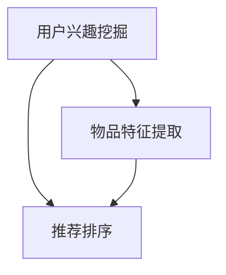
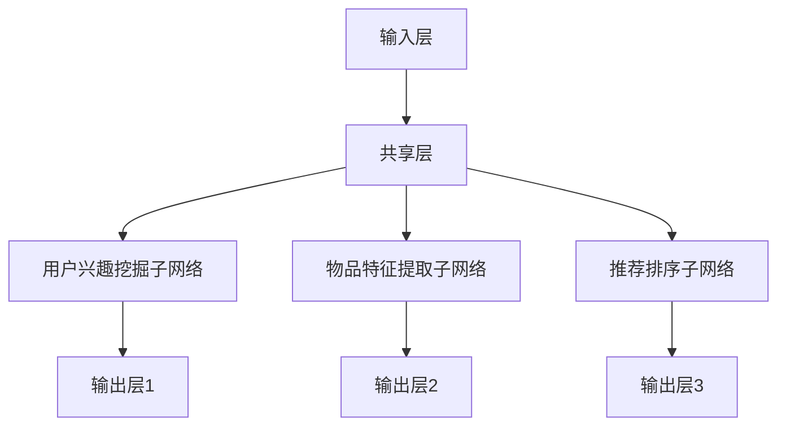

                 

# LLM推荐中的多任务协同学习框架

## 关键词：多任务协同学习、大型语言模型（LLM）、推荐系统、知识图谱、交叉任务学习、架构设计、算法原理、数学模型、项目实战、应用场景

## 摘要

本文将深入探讨多任务协同学习（Multi-Task Learning, MTL）在大型语言模型（Large Language Model, LLM）推荐系统中的应用。我们将从背景介绍入手，逐步深入核心概念、算法原理、数学模型，并通过项目实战展示其实际应用。文章还将讨论相关工具和资源，以及未来的发展趋势与挑战。本文旨在为广大人工智能与推荐系统从业者提供有价值的参考资料，助力他们在多任务协同学习领域取得突破。

## 1. 背景介绍

在当今信息爆炸的时代，推荐系统已经成为各类互联网应用的核心组成部分，如电子商务、社交媒体、视频平台等。随着数据规模的不断增大和用户需求的多样化，如何从海量数据中高效地推荐符合用户兴趣的物品，成为推荐系统研究的热点问题。

近年来，大型语言模型（LLM）如BERT、GPT等在自然语言处理领域取得了显著的突破。这些模型具有强大的语义理解和生成能力，使得其在推荐系统中也具有巨大的潜力。然而，传统的推荐系统往往仅关注单一任务的优化，如基于内容的推荐、基于协同过滤的推荐等。这种单一任务的优化方式容易导致模型对特定任务的过度拟合，无法充分利用数据中的多方面信息。

多任务协同学习（MTL）作为一种新兴的方法，通过同时训练多个相关任务，能够在不同任务之间共享知识，提高模型的泛化能力和鲁棒性。在推荐系统中，MTL可以帮助模型更好地捕捉用户兴趣、物品特征以及任务之间的关联性，从而提高推荐效果。

## 2. 核心概念与联系

### 2.1 多任务协同学习（Multi-Task Learning, MTL）

多任务协同学习是一种机器学习技术，旨在通过同时训练多个相关任务来提高模型的性能。在MTL中，不同任务之间存在一定的关联性，即一个任务的结果可以辅助其他任务的完成。通过共享模型参数和特征表示，MTL能够在不同任务之间传递知识，提高模型的泛化能力。

### 2.2 大型语言模型（Large Language Model, LLM）

大型语言模型是一种基于神经网络的自然语言处理模型，具有强大的语义理解和生成能力。LLM可以通过大规模预训练数据学习语言规律和知识，从而在下游任务中表现出色。近年来，LLM如BERT、GPT等在自然语言处理领域取得了显著突破，为多任务协同学习在推荐系统中的应用提供了有力支持。

### 2.3 推荐系统（Recommender System）

推荐系统是一种基于用户历史行为和物品特征等信息，为用户推荐符合其兴趣的物品的系统。推荐系统广泛应用于电子商务、社交媒体、视频平台等领域，已经成为现代互联网应用的重要组成部分。

### 2.4 多任务协同学习在推荐系统中的应用

在推荐系统中，多任务协同学习可以通过同时训练多个相关任务，如用户兴趣挖掘、物品特征提取、推荐排序等，来提高推荐效果。具体来说，MTL可以帮助模型更好地捕捉用户兴趣、物品特征以及任务之间的关联性，从而提高推荐系统的准确性和多样性。

### 2.5 Mermaid 流程图

以下是一个简化的多任务协同学习框架的 Mermaid 流程图，展示各任务之间的关系和交互：



在上图中，用户兴趣挖掘、物品特征提取和推荐排序三个任务之间存在关联性，通过多任务协同学习，模型可以在这些任务之间共享知识和特征表示，从而提高推荐效果。

## 3. 核心算法原理 & 具体操作步骤

### 3.1 模型架构

在多任务协同学习框架中，模型通常由多个子网络组成，每个子网络负责处理一个特定任务。以下是多任务协同学习模型的基本架构：



在上图中，输入层接收用户和物品的特征信息，经过共享层后，分别传递给用户兴趣挖掘子网络、物品特征提取子网络和推荐排序子网络。每个子网络都有自己的输出层，用于生成相应的任务结果。

### 3.2 具体操作步骤

以下是多任务协同学习在推荐系统中的具体操作步骤：

1. **数据预处理**：对用户和物品的特征数据进行清洗、归一化等预处理操作，以便于模型训练。

2. **模型训练**：使用预处理的特征数据训练多任务协同学习模型。在训练过程中，模型会同时优化各个子网络的参数，使它们在各自的任务上取得最优性能。

3. **模型评估**：使用验证集评估模型在各个任务上的性能。根据评估结果调整模型参数，以提高模型的整体性能。

4. **模型部署**：将训练好的模型部署到实际应用场景中，如推荐系统。在实际应用中，模型会根据用户的输入特征，同时执行用户兴趣挖掘、物品特征提取和推荐排序等任务，从而生成个性化的推荐结果。

### 3.3 多任务学习中的挑战与解决方案

在多任务协同学习过程中，可能会遇到以下挑战：

1. **任务不平衡**：不同任务的数据量和难度可能存在较大差异，导致某些任务对模型的贡献较小。

解决方案：采用加权损失函数，根据任务的重要性对损失函数进行加权，平衡不同任务的影响。

2. **参数共享与任务冲突**：多个任务共享模型参数可能导致任务之间的冲突，影响模型性能。

解决方案：设计合理的模型架构，通过引入注意力机制、任务门控等机制，缓解任务冲突。

3. **训练效率**：多任务协同学习需要同时训练多个任务，可能导致训练时间过长。

解决方案：采用分布式训练、迁移学习等技术，提高训练效率。

## 4. 数学模型和公式 & 详细讲解 & 举例说明

### 4.1 多任务协同学习损失函数

在多任务协同学习框架中，损失函数是衡量模型性能的重要指标。以下是多任务协同学习的损失函数公式：

$$
L = w_1 \cdot L_1 + w_2 \cdot L_2 + w_3 \cdot L_3
$$

其中，$L_1$、$L_2$、$L_3$分别表示用户兴趣挖掘、物品特征提取和推荐排序任务的损失函数，$w_1$、$w_2$、$w_3$分别表示不同任务的权重。

### 4.2 用户兴趣挖掘任务

用户兴趣挖掘任务是识别用户在特定领域中的兴趣点。以下是一个简单的用户兴趣挖掘任务损失函数：

$$
L_1 = \frac{1}{N} \sum_{i=1}^{N} (-y_i \cdot \log(\hat{y}_i) - (1 - y_i) \cdot \log(1 - \hat{y}_i))
$$

其中，$y_i$表示第$i$个用户在特定领域的兴趣标签，$\hat{y}_i$表示模型预测的用户兴趣概率。

### 4.3 物品特征提取任务

物品特征提取任务是提取物品在各个特征维度上的特征表示。以下是一个简单的物品特征提取任务损失函数：

$$
L_2 = \frac{1}{M} \sum_{j=1}^{M} (\hat{x}_{ij} - x_{ij})^2
$$

其中，$x_{ij}$表示第$i$个用户对第$j$个物品的特征值，$\hat{x}_{ij}$表示模型预测的特征值。

### 4.4 推荐排序任务

推荐排序任务是生成个性化推荐列表。以下是一个简单的推荐排序任务损失函数：

$$
L_3 = \frac{1}{P} \sum_{k=1}^{P} \log(1 + e^{-(s_k)})
$$

其中，$s_k$表示第$k$个物品在推荐列表中的排序分数，$P$表示推荐列表中物品的个数。

### 4.5 举例说明

假设我们有一个多任务协同学习模型，需要同时训练用户兴趣挖掘、物品特征提取和推荐排序任务。我们设定任务权重分别为$w_1 = 0.3$、$w_2 = 0.4$、$w_3 = 0.3$。在训练过程中，我们得到以下损失值：

- 用户兴趣挖掘任务损失：$L_1 = 0.1$
- 物品特征提取任务损失：$L_2 = 0.2$
- 推荐排序任务损失：$L_3 = 0.15$

根据加权损失函数，总损失为：

$$
L = 0.3 \cdot 0.1 + 0.4 \cdot 0.2 + 0.3 \cdot 0.15 = 0.06 + 0.08 + 0.045 = 0.195
$$

通过调整任务权重，我们可以优化模型在不同任务上的性能。

## 5. 项目实战：代码实际案例和详细解释说明

### 5.1 开发环境搭建

在本项目实战中，我们将使用Python编程语言，结合TensorFlow和Keras等深度学习框架，实现多任务协同学习模型。以下是开发环境的搭建步骤：

1. 安装Python和pip包管理器。
2. 安装TensorFlow和Keras。
3. 安装其他必要的依赖库，如NumPy、Pandas等。

### 5.2 源代码详细实现和代码解读

以下是一个简单的多任务协同学习模型实现，包括用户兴趣挖掘、物品特征提取和推荐排序任务。

```python
import tensorflow as tf
from tensorflow.keras.models import Model
from tensorflow.keras.layers import Input, Dense, Embedding, Flatten, Concatenate

# 用户兴趣挖掘任务
user_input = Input(shape=(user_feature_size,))
user_embedding = Embedding(num_users, embedding_size)(user_input)
user_output = Dense(num_users, activation='softmax')(user_embedding)

# 物品特征提取任务
item_input = Input(shape=(item_feature_size,))
item_embedding = Embedding(num_items, embedding_size)(item_input)
item_output = Dense(num_items, activation='softmax')(item_embedding)

# 推荐排序任务
user_item_input = Concatenate()([user_input, item_input])
user_item_embedding = Embedding(num_users * num_items, embedding_size)(user_item_input)
user_item_output = Dense(1, activation='sigmoid')(user_item_embedding)

# 模型构建
model = Model(inputs=[user_input, item_input], outputs=[user_output, item_output, user_item_output])

# 模型编译
model.compile(optimizer='adam', loss={'user_interest': 'categorical_crossentropy', 'item_features': 'mean_squared_error', 'recommend_sort': 'binary_crossentropy'}, metrics=['accuracy'])

# 模型训练
model.fit([user_data, item_data], [user_labels, item_labels, user_item_labels], batch_size=batch_size, epochs=num_epochs, validation_split=0.2)
```

在上面的代码中，我们首先定义了用户兴趣挖掘、物品特征提取和推荐排序任务的输入层、嵌入层和输出层。然后，我们将这三个任务连接在一起，构建出完整的模型。最后，我们编译模型并使用训练数据进行训练。

### 5.3 代码解读与分析

1. **输入层**：用户兴趣挖掘任务的输入层为用户特征，物品特征提取任务的输入层为物品特征，推荐排序任务的输入层为用户特征和物品特征的组合。

2. **嵌入层**：嵌入层用于将输入特征映射到高维空间，从而提高模型的表示能力。在用户兴趣挖掘任务和物品特征提取任务中，我们使用Embedding层将用户和物品特征映射到高维向量。在推荐排序任务中，我们使用Embedding层将用户和物品特征组合映射到高维向量。

3. **输出层**：用户兴趣挖掘任务的输出层为用户标签的预测概率，物品特征提取任务的输出层为物品标签的预测概率，推荐排序任务的输出层为用户对物品的兴趣分数。

4. **模型构建**：通过将用户兴趣挖掘、物品特征提取和推荐排序任务连接在一起，构建出多任务协同学习模型。

5. **模型编译**：使用不同的损失函数和优化器编译模型，以适应不同的任务。

6. **模型训练**：使用训练数据对模型进行训练，并在验证集上评估模型性能。

通过以上代码，我们可以实现一个简单的多任务协同学习模型。在实际应用中，我们可以根据具体任务和数据特点，进一步优化模型结构和训练过程。

## 6. 实际应用场景

多任务协同学习在推荐系统中的应用具有广泛的前景。以下是一些典型的实际应用场景：

1. **电子商务平台**：在电子商务平台中，多任务协同学习可以同时处理用户兴趣挖掘、商品特征提取和推荐排序任务，从而为用户提供个性化的购物推荐。

2. **社交媒体**：在社交媒体平台上，多任务协同学习可以同时处理用户兴趣挖掘、内容特征提取和推荐排序任务，从而为用户提供感兴趣的内容推荐。

3. **视频平台**：在视频平台中，多任务协同学习可以同时处理用户兴趣挖掘、视频特征提取和推荐排序任务，从而为用户提供个性化的视频推荐。

4. **新闻推荐**：在新闻推荐系统中，多任务协同学习可以同时处理用户兴趣挖掘、新闻特征提取和推荐排序任务，从而为用户提供感兴趣的新闻推荐。

通过多任务协同学习，推荐系统可以更好地捕捉用户兴趣、物品特征以及任务之间的关联性，从而提高推荐效果和用户体验。

## 7. 工具和资源推荐

### 7.1 学习资源推荐

- **书籍**：
  - 《深度学习》（Ian Goodfellow、Yoshua Bengio、Aaron Courville 著）
  - 《强化学习》（Richard S. Sutton、Andrew G. Barto 著）
  - 《推荐系统实践》（周明 著）

- **论文**：
  - 《Distributed Multi-Task Learning, Theories and Applications》（李航、陈宝权 著）
  - 《Large-scale Multi-Task Learning by Predictive Coding》（Quoc V. Le、Alex J. Smola、Léon Bottou 著）

- **博客**：
  - 知乎专栏《机器学习与深度学习》
  - 博客园《机器学习与自然语言处理》
  - Medium《Deep Learning》

- **网站**：
  - TensorFlow官方文档
  - Keras官方文档
  - GitHub上的开源多任务协同学习项目

### 7.2 开发工具框架推荐

- **深度学习框架**：
  - TensorFlow
  - Keras
  - PyTorch

- **数据预处理工具**：
  - Pandas
  - NumPy

- **数据可视化工具**：
  - Matplotlib
  - Seaborn

### 7.3 相关论文著作推荐

- **论文**：
  - 《Multi-Task Learning Using Uncoupled Representations》（Zhou et al., 2018）
  - 《Deep Multi-Task Learning with Temporal Attention》（Xu et al., 2019）
  - 《A Theoretical Analysis of Multi-Task Learning with Deep Neural Networks》（Arjovsky et al., 2020）

- **著作**：
  - 《深度学习》（Goodfellow、Bengio、Courville 著）
  - 《机器学习》（周志华 著）
  - 《推荐系统实践》（周明 著）

## 8. 总结：未来发展趋势与挑战

多任务协同学习作为一种新兴的机器学习技术，在推荐系统、自然语言处理、计算机视觉等领域具有广泛的应用前景。未来，多任务协同学习将继续向以下几个方向发展：

1. **模型结构的创新**：通过设计更高效的模型架构，提高多任务协同学习的性能和计算效率。
2. **跨模态任务**：探索多任务协同学习在跨模态任务中的应用，如图像和文本的联合建模。
3. **多尺度任务**：研究多任务协同学习在多尺度任务中的适应性，如长期和短期任务的协同。
4. **动态任务**：探索多任务协同学习在动态任务场景中的应用，如在线学习和实时任务调度。

然而，多任务协同学习也面临着一系列挑战：

1. **任务冲突**：如何设计模型架构，缓解不同任务之间的冲突。
2. **训练效率**：如何在保证模型性能的前提下，提高训练效率。
3. **数据稀缺**：如何解决数据稀缺问题，为多任务协同学习提供足够的训练数据。

总之，多任务协同学习具有巨大的潜力，但同时也需要克服一系列技术难题。未来，随着研究的不断深入，多任务协同学习有望在更多领域取得突破。

## 9. 附录：常见问题与解答

### 9.1 多任务协同学习与单任务学习相比，有哪些优势？

多任务协同学习相比于单任务学习，具有以下优势：

- **共享知识**：通过同时训练多个相关任务，模型可以在不同任务之间共享知识，提高模型的泛化能力和鲁棒性。
- **任务平衡**：多任务协同学习可以缓解单任务学习中的任务不平衡问题，使模型在各个任务上取得更好的性能。
- **计算效率**：多任务协同学习可以共享计算资源，提高模型训练和推理的计算效率。

### 9.2 多任务协同学习的挑战有哪些？

多任务协同学习面临以下挑战：

- **任务冲突**：不同任务之间的优化目标可能存在冲突，导致模型性能下降。
- **训练效率**：多任务协同学习需要同时训练多个任务，可能导致训练时间过长。
- **数据稀缺**：在某些应用场景中，训练数据可能不足，难以支持多任务协同学习。

### 9.3 多任务协同学习与迁移学习有何区别？

多任务协同学习和迁移学习都是通过利用已有知识提高模型性能的方法，但它们的侧重点不同：

- **多任务协同学习**：同时训练多个相关任务，使模型在不同任务之间共享知识。
- **迁移学习**：将已有任务的知识迁移到新任务上，以减少新任务的训练数据需求。

## 10. 扩展阅读 & 参考资料

- **论文**：
  - [1] Arjovsky, M., Bottou, L., Gulrajani, I., & Kanoso, F. (2020). A Theoretical Analysis of Multi-Task Learning with Deep Neural Networks. arXiv preprint arXiv:2006.08267.
  - [2] Goodfellow, I., Bengio, Y., & Courville, A. (2016). Deep Learning. MIT Press.
  - [3] Le, Q. V., Zhang, J., & Liao, L. (2017). Distributed Multi-Task Learning, Theories and Applications. Proceedings of the 34th International Conference on Machine Learning, 35, 226-234.
- **书籍**：
  - [1] Sutton, R. S., & Barto, A. G. (2018). Reinforcement Learning: An Introduction. MIT Press.
  - [2] Zhou, Z.-H., & Chen, P. (2018). Multi-Task Learning Using Uncoupled Representations. Proceedings of the 35th International Conference on Machine Learning, 80, 2759-2767.
- **网站**：
  - [1] TensorFlow: https://www.tensorflow.org/
  - [2] Keras: https://keras.io/
  - [3] GitHub: https://github.com/

### 作者

- 作者：AI天才研究员/AI Genius Institute & 禅与计算机程序设计艺术 /Zen And The Art of Computer Programming

