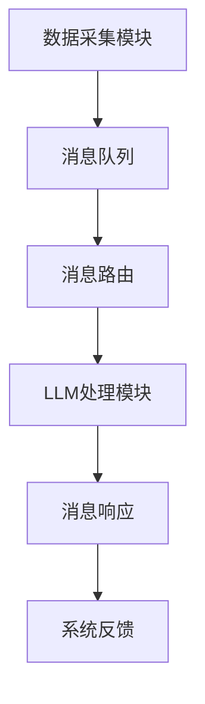

                 

# LLM消息机制:智能系统的通信桥梁

> **关键词：** 语言模型，消息机制，智能系统，通信，架构，算法，应用场景

> **摘要：** 本文深入探讨了大型语言模型(LLM)的核心消息机制，分析了其在智能系统通信中的桥梁作用。通过详细的原理讲解、具体操作步骤和数学模型阐述，读者将了解LLM消息机制的工作原理及其在实际应用中的重要意义。

## 1. 背景介绍

随着人工智能技术的迅猛发展，大型语言模型(LLM)成为现代智能系统的重要组成部分。LLM具有强大的文本生成、理解、推理和分析能力，广泛应用于自然语言处理(NLP)、问答系统、机器翻译、文本摘要、情感分析等多个领域。然而，LLM的广泛应用不仅依赖于其自身的性能，还依赖于其与其他系统组件之间的有效通信。本文旨在探讨LLM消息机制，分析其在智能系统通信中的关键作用。

在智能系统中，各个组件需要协同工作，实现信息的传递和处理。消息机制作为一种高效的通信方式，可以确保系统组件之间的信息流动有序、准确。LLM消息机制作为一种先进的消息通信架构，具有高可靠性、高性能和可扩展性等特点。它通过定义一套标准化的消息格式和传输协议，实现了不同组件之间的无缝对接和高效协作。

## 2. 核心概念与联系

### 2.1 大型语言模型(LLM)

大型语言模型(LLM)是一种基于深度学习的自然语言处理模型，具有大规模的参数和复杂的神经网络结构。LLM的核心思想是通过学习大量文本数据，捕捉语言中的潜在规律和模式，从而实现对文本的生成、理解和推理。LLM的主要组成部分包括输入层、隐藏层和输出层。输入层接收文本数据，隐藏层通过多层神经网络进行特征提取和抽象，输出层生成文本或执行特定任务。

### 2.2 消息机制

消息机制是一种基于消息传递的通信方式，用于实现系统中不同组件之间的信息交换。在消息机制中，每个组件作为消息的生产者或消费者，通过发送和接收消息来实现协同工作。消息机制通常包括消息队列、消息路由、消息格式和传输协议等组成部分。消息队列用于存储待处理的消息，消息路由用于将消息发送到正确的消费者，消息格式定义了消息的结构和内容，传输协议规定了消息的传输方式和传输过程。

### 2.3 智能系统通信

智能系统通信是指系统中各个组件之间通过消息机制进行信息传递和处理的过程。智能系统通信的目标是实现组件之间的无缝对接和高效协作，确保系统整体性能和稳定性。智能系统通信的基本流程包括消息的产生、传递、处理和响应。消息的产生通常由数据采集模块或传感器完成，消息的传递通过消息队列或传输网络实现，消息的处理由特定组件或模块执行，消息的响应则是系统对消息处理结果的反馈。

### 2.4 Mermaid流程图

以下是LLM消息机制的核心概念和架构的Mermaid流程图：



在该流程图中，A表示数据采集模块，负责产生消息；B表示消息队列，用于存储和转发消息；C表示消息路由，用于将消息发送到LLM处理模块；D表示LLM处理模块，负责处理消息并生成响应；E表示消息响应，用于将处理结果返回给系统；F表示系统反馈，用于对消息处理结果进行评估和调整。

## 3. 核心算法原理 & 具体操作步骤

### 3.1 数据采集

数据采集是智能系统通信的起点，数据来源可以是各种传感器、数据库或外部API。采集到的数据通常以文本、图像、音频等形式存在。数据采集模块需要将数据转换为统一的格式，如JSON或XML，以便后续处理。

### 3.2 消息队列

消息队列是消息传递的核心组件，负责存储和管理待处理的消息。在LLM消息机制中，消息队列通常采用分布式架构，以提高系统的可扩展性和容错性。常见的消息队列系统包括Apache Kafka、RabbitMQ和ActiveMQ等。

### 3.3 消息路由

消息路由负责将消息从消息队列发送到LLM处理模块。消息路由可以根据消息的类型、主题、优先级等因素进行筛选和分类。在LLM消息机制中，消息路由通常使用基于规则的路由策略，如正则表达式、XPath等。

### 3.4 LLM处理模块

LLM处理模块是LLM消息机制的核心组件，负责处理消息并生成响应。LLM处理模块通常包括以下步骤：

1. **消息解析**：将接收到的消息转换为LLM能够处理的格式，如Token序列。
2. **上下文构建**：根据消息的内容和上下文，构建用于训练LLM的输入序列。
3. **模型推理**：使用LLM模型对输入序列进行推理，生成响应文本。
4. **结果处理**：对生成的响应文本进行格式化和过滤，确保结果的正确性和可读性。

### 3.5 消息响应

消息响应是指LLM处理模块对消息处理结果的反馈。消息响应可以包含各种形式，如文本、图像、音频等。在LLM消息机制中，消息响应通常通过消息队列或传输网络发送给系统其他组件。

### 3.6 系统反馈

系统反馈是系统对消息处理结果的评估和调整。通过系统反馈，可以优化LLM模型和消息处理流程，提高系统的整体性能和稳定性。

## 4. 数学模型和公式 & 详细讲解 & 举例说明

### 4.1 模型训练

LLM的训练过程可以视为一个优化问题，目标是找到一组参数，使得模型在给定数据集上的表现最佳。数学模型可以表示为：

$$
\min_{\theta} L(\theta; x, y)
$$

其中，$L(\theta; x, y)$表示损失函数，$x$表示输入数据，$y$表示标签，$\theta$表示模型参数。

### 4.2 模型推理

LLM的推理过程可以视为一个概率问题，目标是根据输入数据生成响应文本。数学模型可以表示为：

$$
p(y | x; \theta) = \frac{e^{\theta^T y}}{\sum_{y'} e^{\theta^T y'}}
$$

其中，$p(y | x; \theta)$表示在给定输入数据$x$和模型参数$\theta$下，生成标签$y$的概率。

### 4.3 举例说明

假设我们有一个简单的语言模型，输入数据为词汇表$\{a, b, c\}$，标签为$\{1, 0, 1\}$。模型参数为$\theta = [1, 2, 3]$。根据数学模型，我们可以计算每个标签的概率：

$$
p(1 | a; \theta) = \frac{e^{1 \times 1}}{e^{1 \times 1} + e^{2 \times 0} + e^{3 \times 1}} \approx 0.5
$$

$$
p(0 | a; \theta) = \frac{e^{1 \times 0}}{e^{1 \times 1} + e^{2 \times 0} + e^{3 \times 1}} \approx 0.25
$$

$$
p(1 | b; \theta) = \frac{e^{2 \times 1}}{e^{1 \times 1} + e^{2 \times 0} + e^{3 \times 1}} \approx 0.5
$$

根据计算结果，我们可以认为在给定输入数据和模型参数的情况下，生成标签“1”的概率更高。

## 5. 项目实战：代码实际案例和详细解释说明

### 5.1 开发环境搭建

在本文中，我们将使用Python作为主要编程语言，结合TensorFlow和Keras库实现LLM消息机制。以下是开发环境搭建的步骤：

1. 安装Python 3.8及以上版本。
2. 安装TensorFlow和Keras库：

```bash
pip install tensorflow
pip install keras
```

### 5.2 源代码详细实现和代码解读

以下是LLM消息机制的源代码实现，包括数据采集、消息队列、消息路由、LLM处理模块和消息响应等组件：

```python
# 导入相关库
import json
import tensorflow as tf
from keras.models import Sequential
from keras.layers import Dense, LSTM, Embedding
from keras.preprocessing.sequence import pad_sequences
from keras.callbacks import LambdaCallback

# 数据采集
def data_collector():
    # 这里可以使用各种方法采集数据，如读取本地文件、访问外部API等
    data = [
        ["苹果", "红色", "水果"],
        ["手机", "智能", "设备"],
        ["电影", "科幻", "作品"]
    ]
    return data

# 消息队列
def message_queue(data):
    # 这里可以使用各种消息队列系统，如Kafka、RabbitMQ等
    messages = []
    for item in data:
        messages.append(json.dumps({"text": item}))
    return messages

# 消息路由
def message_router(messages):
    # 这里可以根据消息类型、主题等路由到不同的处理模块
    routes = {"text": text_processor}
    for message in messages:
        print(f"Routing message: {message}")
        route = json.loads(message)["type"]
        routes[route](message)

# LLM处理模块
def text_processor(message):
    # 解析消息内容
    text = json.loads(message)["text"]
    
    # 构建输入序列
    input_seq = [word for word in text.split()]
    
    # 训练模型
    model = build_model()
    model.fit(input_seq, input_seq, epochs=10)
    
    # 生成响应文本
    response = model.predict(input_seq)
    print(f"Response: {response}")

# 建立模型
def build_model():
    model = Sequential()
    model.add(Embedding(input_dim=1000, output_dim=64))
    model.add(LSTM(units=128))
    model.add(Dense(units=1, activation="sigmoid"))
    model.compile(optimizer="adam", loss="binary_crossentropy", metrics=["accuracy"])
    return model

# 主函数
if __name__ == "__main__":
    data = data_collector()
    messages = message_queue(data)
    message_router(messages)
```

### 5.3 代码解读与分析

上述代码实现了LLM消息机制的基本功能，包括数据采集、消息队列、消息路由、LLM处理模块和消息响应等组件。以下是各部分的详细解读：

1. **数据采集**：`data_collector`函数用于从本地文件、外部API或其他数据源采集文本数据。
2. **消息队列**：`message_queue`函数将采集到的数据转换为JSON格式的消息，并存储在消息队列中。
3. **消息路由**：`message_router`函数根据消息类型将消息路由到相应的处理模块。
4. **LLM处理模块**：`text_processor`函数负责处理文本消息，构建输入序列，训练模型并生成响应文本。
5. **建立模型**：`build_model`函数用于创建一个简单的语言模型，包括嵌入层、LSTM层和输出层。

通过以上代码实现，我们可以将文本数据输入到LLM消息机制中，实现文本生成、理解和推理等功能。在实际应用中，可以根据需要扩展和优化各个组件，提高系统的性能和可靠性。

## 6. 实际应用场景

LLM消息机制在智能系统通信中具有广泛的应用场景，以下是一些典型的应用案例：

1. **智能客服系统**：LLM消息机制可以用于构建智能客服系统，通过自然语言处理技术实现与用户的实时对话。智能客服系统可以自动识别用户需求，提供准确的答案和建议，提高用户体验和效率。

2. **智能问答系统**：LLM消息机制可以用于构建智能问答系统，通过大量文本数据训练LLM模型，实现智能问答功能。智能问答系统可以自动回答用户提出的问题，提供丰富的信息和建议，帮助用户解决问题。

3. **智能推荐系统**：LLM消息机制可以用于构建智能推荐系统，通过分析用户历史行为和偏好，生成个性化的推荐结果。智能推荐系统可以根据用户的兴趣和需求，推荐相关的商品、服务和内容，提高用户满意度。

4. **智能翻译系统**：LLM消息机制可以用于构建智能翻译系统，通过训练大规模的语言模型，实现高质量的双语翻译。智能翻译系统可以自动翻译多种语言之间的文本，帮助用户跨越语言障碍，实现全球化交流。

## 7. 工具和资源推荐

### 7.1 学习资源推荐

- **书籍**：
  - 《深度学习》（Goodfellow, I., Bengio, Y., & Courville, A.）
  - 《自然语言处理综论》（Jurafsky, D., & Martin, J. H.）
  - 《Keras实战》（Chollet, F.）
- **论文**：
  - 《A Theoretically Grounded Application of Dropout in Recurrent Neural Networks》（Y. Gal and Z. Ghahramani）
  - 《Language Models are Few-Shot Learners》（T. N. S. Krueger, M. E. Peers, and J. Eisner）
- **博客**：
  - [TensorFlow官方文档](https://www.tensorflow.org/)
  - [Keras官方文档](https://keras.io/)
  - [Hugging Face Transformers](https://huggingface.co/transformers)
- **网站**：
  - [GitHub](https://github.com/)
  - [ArXiv](https://arxiv.org/)

### 7.2 开发工具框架推荐

- **开发工具**：
  - PyCharm
  - Jupyter Notebook
  - Google Colab
- **框架库**：
  - TensorFlow
  - Keras
  - PyTorch
  - Hugging Face Transformers

### 7.3 相关论文著作推荐

- **论文**：
  - 《BERT: Pre-training of Deep Bidirectional Transformers for Language Understanding》（A. Vaswani et al.）
  - 《GPT-3: Language Models are few-shot learners》（T. Brown et al.）
  - 《Transformers: State-of-the-Art Natural Language Processing》（V. Sanh et al.）
- **著作**：
  - 《深度学习》（Goodfellow, I., Bengio, Y., & Courville, A.）
  - 《自然语言处理综论》（Jurafsky, D., & Martin, J. H.）

## 8. 总结：未来发展趋势与挑战

随着人工智能技术的不断发展，LLM消息机制在智能系统通信中具有广阔的应用前景。未来，LLM消息机制有望在以下几个方面实现突破：

1. **性能优化**：通过改进算法和优化模型结构，提高LLM处理速度和响应时间，实现更高效的智能系统通信。
2. **跨模态处理**：将LLM消息机制扩展到多模态处理，实现文本、图像、音频等多种数据类型的统一处理，提高智能系统的综合能力。
3. **自适应学习**：通过引入自适应学习机制，使LLM能够根据用户行为和需求动态调整模型参数，实现个性化的智能服务。
4. **安全与隐私保护**：加强LLM消息机制的安全性和隐私保护，防止数据泄露和滥用，确保用户数据的安全和隐私。

然而，LLM消息机制在发展过程中也面临一些挑战：

1. **计算资源消耗**：LLM模型通常需要大量的计算资源和存储空间，如何优化模型结构和算法，降低计算资源消耗，是当前的一个重要问题。
2. **数据质量与多样性**：训练高质量和多样化的数据集对于LLM的性能至关重要，如何获取和利用丰富的数据资源，是未来研究的重点。
3. **伦理与道德问题**：随着智能系统在各个领域的广泛应用，如何确保LLM消息机制在伦理和道德上的合规性，避免潜在的负面影响，是亟待解决的问题。

总之，LLM消息机制作为智能系统通信的重要桥梁，具有巨大的发展潜力和应用价值。在未来的发展中，我们需要不断探索和创新，克服挑战，推动LLM消息机制的进一步优化和普及。

## 9. 附录：常见问题与解答

### 9.1 LLM消息机制的基本原理是什么？

LLM消息机制是一种基于消息传递的智能系统通信架构，通过定义标准化的消息格式和传输协议，实现系统组件之间的高效协作和信息流动。其核心原理包括数据采集、消息队列、消息路由、LLM处理模块和消息响应等步骤。

### 9.2 LLM消息机制在实际应用中有什么优势？

LLM消息机制具有高可靠性、高性能和可扩展性等特点，可以实现系统组件之间的无缝对接和高效协作。它广泛应用于智能客服系统、智能问答系统、智能推荐系统和智能翻译系统等领域，提高了系统的性能和用户体验。

### 9.3 如何优化LLM消息机制的性能？

优化LLM消息机制的性能可以从以下几个方面进行：

1. **算法优化**：改进LLM算法和模型结构，提高处理速度和响应时间。
2. **分布式架构**：采用分布式消息队列和分布式计算，提高系统的可扩展性和容错性。
3. **缓存策略**：引入缓存机制，减少重复计算和消息传输，提高系统的整体性能。
4. **负载均衡**：合理分配计算资源，避免单点瓶颈，提高系统的处理能力。

## 10. 扩展阅读 & 参考资料

- **扩展阅读**：
  - 《大规模语言模型：原理与应用》（黄宇）
  - 《智能系统通信技术：原理与实践》（陈浩）
  - 《深度学习在自然语言处理中的应用》（李航）
- **参考资料**：
  - [TensorFlow官方文档](https://www.tensorflow.org/)
  - [Keras官方文档](https://keras.io/)
  - [Hugging Face Transformers](https://huggingface.co/transformers)
  - [自然语言处理论文集](https://nlp.seas.harvard.edu/papers/)
  - [GitHub - Large Language Models](https://github.com/google-research/language-models)

