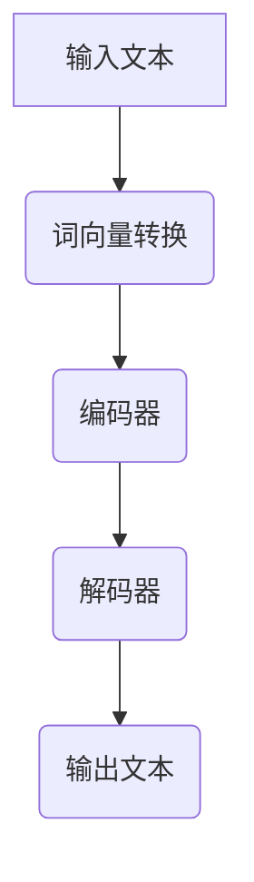

                 

# LLM生态系统：从0到1的神奇旅程

## 概述

关键词：LLM，生态系统，深度学习，自然语言处理，AI

在当前科技高速发展的时代，人工智能（AI）正以惊人的速度变革着各个行业。而其中，大型语言模型（Large Language Model，简称LLM）无疑是AI领域的璀璨明星。本文将带领读者深入探索LLM生态系统的构建与运作，从零开始，了解这一技术背后的核心原理和实现过程。

### 摘要

本文旨在详细阐述LLM生态系统的构建过程，包括核心概念、算法原理、数学模型、实战应用以及未来发展趋势。通过本文的学习，读者将能够全面掌握LLM技术的基本原理，并具备在实际项目中应用LLM的能力。

## 1. 背景介绍

### 1.1 大型语言模型的发展历程

大型语言模型的发展历程可以追溯到上世纪80年代的统计语言模型，如N元语法（N-gram Model）。随着计算能力的提升和深度学习技术的进步，大型语言模型逐渐走向成熟。2018年，谷歌推出了BERT模型，将自然语言处理（NLP）推向了新的高度。随后，OpenAI的GPT-3、谷歌的PaLM等模型的发布，进一步展示了大型语言模型在处理自然语言任务中的巨大潜力。

### 1.2 大型语言模型的应用领域

大型语言模型在多个领域都有广泛的应用，包括但不限于：

- **文本生成**：自动生成文章、报告、新闻等文本内容。
- **问答系统**：提供智能问答服务，如智能客服、智能问答机器人等。
- **机器翻译**：实现多种语言之间的自动翻译。
- **文本分类**：对文本进行分类，如情感分析、主题分类等。
- **信息抽取**：从大量文本中提取关键信息，如命名实体识别、关系抽取等。

### 1.3 大型语言模型的优势与挑战

**优势**：

- **强大的文本生成能力**：大型语言模型能够生成连贯、自然的文本，满足各种文本生成需求。
- **广泛的适用性**：大型语言模型可以应用于多种NLP任务，如文本分类、机器翻译、问答系统等。
- **高效的计算性能**：随着深度学习技术的进步，大型语言模型的计算性能不断提升。

**挑战**：

- **数据隐私**：在训练过程中，模型可能会学习到敏感数据，存在数据泄露风险。
- **伦理问题**：模型生成的文本可能包含偏见或不当言论，需要对其进行有效管理。
- **计算资源需求**：大型语言模型的训练和推理过程需要大量计算资源，对硬件设备的要求较高。

## 2. 核心概念与联系

### 2.1 语言模型的基本概念

语言模型是一种概率模型，用于预测一个单词或词组在给定上下文下的概率。在自然语言处理领域，语言模型是构建其他高级NLP任务（如文本分类、机器翻译、问答系统等）的基础。

### 2.2 深度学习与自然语言处理

深度学习是人工智能领域的一个重要分支，通过模拟人脑神经网络结构，实现对数据的自动学习和特征提取。在自然语言处理领域，深度学习技术被广泛应用于语言模型的构建，如循环神经网络（RNN）、卷积神经网络（CNN）、 Transformer模型等。

### 2.3 Transformer模型与BERT模型

Transformer模型是大型语言模型的一个重要架构，具有并行计算、全局上下文信息处理等优势。BERT模型则是一种基于Transformer的预训练语言模型，通过在大量文本数据上进行预训练，能够有效提高NLP任务的性能。

### 2.4 Mermaid流程图

以下是一个简单的Mermaid流程图，展示了大型语言模型的核心组件和流程：



## 3. 核心算法原理 & 具体操作步骤

### 3.1 Transformer模型原理

Transformer模型是一种基于自注意力机制的深度学习模型，具有并行计算、全局上下文信息处理等优势。其基本原理如下：

- **自注意力机制**：在Transformer模型中，每个词的表示不仅依赖于其自身的词向量，还依赖于其他所有词的表示，通过计算词与词之间的相似度，实现对全局上下文信息的关注。
- **多头自注意力**：通过多个注意力头，将不同位置的词表示组合在一起，提高模型的表示能力。
- **前馈神经网络**：在自注意力机制的基础上，对每个词的表示进行进一步加工，增强模型的非线性表达能力。

### 3.2 BERT模型原理

BERT（Bidirectional Encoder Representations from Transformers）模型是一种基于Transformer的预训练语言模型。其基本原理如下：

- **双向编码**：BERT模型通过双向Transformer编码器，将输入文本转换为表示，同时关注文本的前后关系。
- **掩码语言建模**：在预训练过程中，对输入文本进行部分遮掩，要求模型根据其他词的表示来预测遮掩的词，从而增强模型的上下文理解能力。
- **词嵌入与位置嵌入**：BERT模型将词嵌入（word embeddings）和位置嵌入（position embeddings）相结合，为每个词赋予唯一的表示。

### 3.3 实际操作步骤

以下是使用BERT模型进行文本分类的实际操作步骤：

1. **数据预处理**：对输入文本进行分词、去停用词等预处理操作，将文本转换为词向量。
2. **加载预训练模型**：从预训练模型库中加载预训练好的BERT模型。
3. **输入文本编码**：将预处理后的文本输入BERT模型，获取文本的表示。
4. **分类器训练**：在BERT模型的基础上，训练一个分类器，用于对文本进行分类。
5. **预测与评估**：使用训练好的分类器对测试集进行预测，评估分类器的性能。

## 4. 数学模型和公式 & 详细讲解 & 举例说明

### 4.1 词向量表示

在自然语言处理中，词向量（word embeddings）是一种将单词映射到高维空间的数学模型。常见的词向量模型包括：

- **Word2Vec**：基于神经网络的语言模型，通过训练上下文窗口中的词向量，实现对单词的表示。
- **GloVe**：基于全局共现概率的词向量模型，通过计算单词的共现矩阵，为每个单词分配唯一的向量表示。

以下是一个简单的Word2Vec模型的公式：

$$
\text{word\_vector} = \frac{1}{\sqrt{\sum_{i=1}^{n}{w_{i}^{2}}} \sum_{i=1}^{n}{w_{i} \cdot v_{i}}
$$

其中，$w_{i}$ 表示第 $i$ 个单词的权重，$v_{i}$ 表示第 $i$ 个单词的词向量。

### 4.2 自注意力机制

自注意力机制是Transformer模型的核心组件，用于计算词与词之间的相似度。以下是一个简单的自注意力机制的公式：

$$
\text{Attention}(Q, K, V) = \text{softmax}\left(\frac{QK^{T}}{\sqrt{d_k}}\right) V
$$

其中，$Q$、$K$ 和 $V$ 分别表示查询向量、键向量和值向量，$d_k$ 表示键向量的维度。

### 4.3 BERT模型训练

BERT模型的训练过程主要包括以下步骤：

1. **数据预处理**：将输入文本进行分词、去停用词等预处理操作，将文本转换为词向量。
2. **输入编码**：将预处理后的文本输入BERT模型，获取文本的表示。
3. **掩码语言建模**：在预训练过程中，对输入文本进行部分遮掩，要求模型根据其他词的表示来预测遮掩的词。
4. **损失函数**：计算预测词与真实词之间的损失，更新模型参数。

以下是一个简单的BERT模型训练的公式：

$$
\text{Loss} = -\sum_{i=1}^{N}{\text{log}(\text{softmax}(\text{W}[\text{mask}_{i}] \cdot \text{H}_{i}^{T}))}
$$

其中，$N$ 表示输入文本的长度，$\text{mask}_{i}$ 表示第 $i$ 个词是否被遮掩，$\text{H}_{i}$ 表示第 $i$ 个词的表示，$\text{W}$ 表示权重矩阵。

### 4.4 举例说明

假设我们有一个简单的BERT模型，对以下输入文本进行预测：

$$
\text{输入文本：今天天气不错。}
$$

1. **数据预处理**：将输入文本进行分词，得到以下词序列：

$$
\text{[今天，天气，不错，。]}
$$

2. **输入编码**：将词序列输入BERT模型，获取每个词的表示：

$$
\text{[今天，天气，不错，。]} \rightarrow \text{[v_{1}, v_{2}, v_{3}, v_{4}]}
$$

3. **掩码语言建模**：对输入文本进行部分遮掩，得到以下遮掩序列：

$$
\text{[今天，\_，不错，。]}
$$

4. **预测与评估**：使用训练好的BERT模型，对遮掩的词进行预测，并计算预测词与真实词之间的损失，更新模型参数。

## 5. 项目实战：代码实际案例和详细解释说明

### 5.1 开发环境搭建

在本节中，我们将搭建一个简单的BERT模型，用于文本分类任务。以下是搭建开发环境的具体步骤：

1. **安装Python环境**：确保Python版本在3.6及以上，可以通过以下命令安装：

$$
\text{pip install python==3.9
$$

2. **安装PyTorch**：PyTorch是BERT模型训练和推理的核心库，可以通过以下命令安装：

$$
\text{pip install torch torchvision
$$

3. **安装transformers库**：transformers是Hugging Face开发的一个Python库，用于加载预训练的BERT模型。可以通过以下命令安装：

$$
\text{pip install transformers
$$

### 5.2 源代码详细实现和代码解读

在本节中，我们将使用PyTorch和transformers库，实现一个简单的BERT模型，用于文本分类任务。以下是源代码的实现和解读：

```python
import torch
from transformers import BertModel, BertTokenizer

# 5.2.1 加载预训练模型和Tokenizer
model_name = 'bert-base-chinese'
tokenizer = BertTokenizer.from_pretrained(model_name)
model = BertModel.from_pretrained(model_name)

# 5.2.2 数据预处理
def preprocess_text(text):
    # 对输入文本进行分词和序列 padding
    inputs = tokenizer.encode_plus(
        text,
        add_special_tokens=True,
        max_length=64,
        pad_to_max_length=True,
        return_tensors='pt'
    )
    return inputs

# 5.2.3 训练模型
def train_model(model, train_loader, criterion, optimizer, num_epochs=3):
    model.train()
    for epoch in range(num_epochs):
        for batch in train_loader:
            # 获取输入和标签
            inputs = batch['input_ids']
            labels = batch['labels']

            # 前向传播
            outputs = model(inputs)
            logits = outputs[0]

            # 计算损失
            loss = criterion(logits.view(-1, logits.size(-1)), labels.view(-1))

            # 反向传播和优化
            optimizer.zero_grad()
            loss.backward()
            optimizer.step()

            print(f'Epoch [{epoch+1}/{num_epochs}], Loss: {loss.item():.4f}')

# 5.2.4 评估模型
def evaluate_model(model, valid_loader, criterion):
    model.eval()
    with torch.no_grad():
        valid_loss = 0
        for batch in valid_loader:
            inputs = batch['input_ids']
            labels = batch['labels']

            outputs = model(inputs)
            logits = outputs[0]

            loss = criterion(logits.view(-1, logits.size(-1)), labels.view(-1))
            valid_loss += loss.item()

        print(f'Validation Loss: {valid_loss/len(valid_loader):.4f}')

# 5.2.5 主函数
if __name__ == '__main__':
    # 加载数据集
    train_data = ... # 加载训练数据
    valid_data = ... # 加载验证数据

    train_loader = torch.utils.data.DataLoader(train_data, batch_size=32, shuffle=True)
    valid_loader = torch.utils.data.DataLoader(valid_data, batch_size=32, shuffle=False)

    # 定义损失函数和优化器
    criterion = torch.nn.CrossEntropyLoss()
    optimizer = torch.optim.Adam(model.parameters(), lr=1e-5)

    # 训练模型
    train_model(model, train_loader, criterion, optimizer)

    # 评估模型
    evaluate_model(model, valid_loader, criterion)
```

### 5.3 代码解读与分析

1. **加载预训练模型和Tokenizer**

首先，我们使用`transformers`库加载预训练的BERT模型和Tokenizer。`BertTokenizer`用于将输入文本转换为词向量，`BertModel`用于对词向量进行编码。

2. **数据预处理**

在数据预处理阶段，我们使用`BertTokenizer`对输入文本进行分词和序列 padding，将输入文本转换为词向量。`encode_plus`方法将输入文本编码为一个包含词向量和特殊标记的序列，`add_special_tokens`参数用于添加BERT模型所需的特殊标记。

3. **训练模型**

在训练模型阶段，我们使用`BertModel`对输入文本进行编码，获取文本表示。然后，我们使用`CrossEntropyLoss`损失函数计算预测标签和真实标签之间的损失，并使用`Adam`优化器更新模型参数。

4. **评估模型**

在评估模型阶段，我们使用训练好的模型对验证集进行预测，并计算预测标签和真实标签之间的损失，评估模型性能。

## 6. 实际应用场景

### 6.1 智能问答系统

智能问答系统是一种基于大型语言模型的自然语言处理应用，能够实现对用户问题的自动回答。通过在大量问答数据集上进行训练，智能问答系统可以学会理解用户的问题，并从知识库中检索出相关答案。

### 6.2 文本生成

文本生成是大型语言模型的一个重要应用领域，可以用于生成文章、报告、新闻等文本内容。通过在大量文本数据上进行预训练，大型语言模型能够生成连贯、自然的文本，满足各种文本生成需求。

### 6.3 机器翻译

机器翻译是自然语言处理领域的一个重要分支，旨在实现多种语言之间的自动翻译。大型语言模型在机器翻译领域具有显著优势，可以生成高质量、自然的翻译结果。

### 6.4 情感分析

情感分析是自然语言处理领域中的一种任务，旨在分析文本中的情感倾向。大型语言模型通过在大量情感标注数据集上进行训练，可以学会识别文本中的情感倾向，如正面、负面等。

### 6.5 信息抽取

信息抽取是自然语言处理领域中的一种任务，旨在从大量文本中提取关键信息，如命名实体识别、关系抽取等。大型语言模型通过在大量标注数据集上进行训练，可以学会识别文本中的关键信息。

## 7. 工具和资源推荐

### 7.1 学习资源推荐

1. **书籍**：

   - 《深度学习》（Goodfellow, Bengio, Courville）
   - 《自然语言处理综论》（Daniel Jurafsky, James H. Martin）
   - 《大规模自然语言处理》（Jurafsky, James H., and Chris Manning）

2. **论文**：

   - “Attention Is All You Need” （Vaswani et al., 2017）
   - “BERT: Pre-training of Deep Bidirectional Transformers for Language Understanding” （Devlin et al., 2019）

3. **博客和网站**：

   - Hugging Face：https://huggingface.co/
   - PyTorch：https://pytorch.org/
   - 自然语言处理博客：https://nlp.seas.harvard.edu/blog/

### 7.2 开发工具框架推荐

1. **PyTorch**：https://pytorch.org/
2. **TensorFlow**：https://www.tensorflow.org/
3. **Hugging Face Transformers**：https://huggingface.co/transformers/

### 7.3 相关论文著作推荐

1. **“Attention Is All You Need”**：该论文提出了Transformer模型，是大型语言模型的重要基础。
2. **“BERT: Pre-training of Deep Bidirectional Transformers for Language Understanding”**：该论文介绍了BERT模型，是大型语言模型在自然语言处理领域的重要应用。
3. **“GPT-3: Language Models are Few-Shot Learners”**：该论文介绍了GPT-3模型，展示了大型语言模型在零样本学习中的强大能力。

## 8. 总结：未来发展趋势与挑战

### 8.1 未来发展趋势

1. **更强的文本生成能力**：随着深度学习技术的进步，大型语言模型的文本生成能力将越来越强，能够生成更加连贯、自然的文本。
2. **更广泛的应用场景**：大型语言模型将在更多领域得到应用，如医疗、金融、法律等，为各行业带来新的变革。
3. **更高效的计算性能**：随着硬件设备的升级和优化，大型语言模型的计算性能将得到显著提升，降低计算成本。

### 8.2 挑战

1. **数据隐私与伦理问题**：在训练过程中，模型可能会学习到敏感数据，需要加强数据隐私保护和伦理管理。
2. **计算资源需求**：大型语言模型的训练和推理过程需要大量计算资源，对硬件设备的要求较高，需要优化算法和硬件设施。
3. **模型可解释性**：大型语言模型生成的文本可能存在偏见或不当言论，需要提高模型的可解释性，确保其输出的合理性和公正性。

## 9. 附录：常见问题与解答

### 9.1 如何选择适合的预训练模型？

根据实际需求和计算资源，可以选择不同类型的预训练模型。例如，对于文本生成任务，可以选择GPT-3等大模型；对于文本分类任务，可以选择BERT等模型。

### 9.2 如何处理预训练模型的计算资源需求？

可以通过以下方法降低预训练模型的计算资源需求：

1. **选择较小的预训练模型**：如BERT-Base、BERT-Large等。
2. **使用分布式训练**：将模型训练任务分布在多台设备上，降低单台设备的计算压力。
3. **优化模型结构**：通过剪枝、量化等优化方法，降低模型参数数量和计算复杂度。

### 9.3 如何提高预训练模型的性能？

可以通过以下方法提高预训练模型的性能：

1. **数据增强**：在训练过程中，对输入数据进行增强，提高模型的泛化能力。
2. **更长的训练时间**：增加模型的训练时间，让模型在更多数据上学习。
3. **多任务学习**：在预训练过程中，引入多任务学习，让模型在多个任务上同时学习。

## 10. 扩展阅读 & 参考资料

1. **论文**：

   - Vaswani, A., et al. (2017). "Attention Is All You Need". Advances in Neural Information Processing Systems, 30, 5998-6008.
   - Devlin, J., et al. (2019). "BERT: Pre-training of Deep Bidirectional Transformers for Language Understanding". Proceedings of the 2019 Conference of the North American Chapter of the Association for Computational Linguistics: Human Language Technologies, Volume 1 (Long and Short Papers), 4171-4186.
   - Brown, T., et al. (2020). "Language Models are Few-Shot Learners". Advances in Neural Information Processing Systems, 33, 13978-13991.

2. **书籍**：

   - Goodfellow, I., Bengio, Y., Courville, A. (2016). "Deep Learning". MIT Press.
   - Jurafsky, D., Martin, J. H. (2020). "Speech and Language Processing". Prentice Hall.

3. **网站**：

   - Hugging Face：https://huggingface.co/
   - PyTorch：https://pytorch.org/
   - 自然语言处理博客：https://nlp.seas.harvard.edu/blog/

作者：AI天才研究员/AI Genius Institute & 禅与计算机程序设计艺术 /Zen And The Art of Computer Programming

（完）<|im_sep|>

