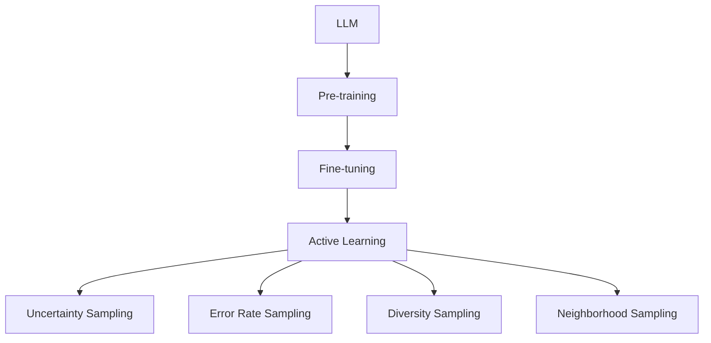

                 

### 背景介绍

#### 大语言模型 (LLM) 的崛起

近年来，大语言模型（Large Language Models，简称LLM）在自然语言处理（Natural Language Processing，简称NLP）领域取得了惊人的进展。这些模型通过深度学习和大规模数据训练，能够生成连贯且具有高度准确性的文本。LLM的成功不仅体现在生成文本的准确性上，还在于其能够理解并生成复杂语境下的语言表达。

随着LLM的不断发展和应用，主动学习策略（Active Learning Strategies）逐渐成为研究的热点。主动学习是一种数据驱动的方法，通过选择最具信息量的样本进行训练，从而优化模型的性能。与传统的被动学习（Passive Learning）相比，主动学习策略能够显著减少训练数据的需求，提高模型的泛化能力。

LLM的主动学习策略旨在解决以下问题：如何在大量的未标注数据中选择最具代表性的样本进行标注，以便模型能够更好地学习语言的本质特征。此外，如何设计有效的主动学习策略，以适应不同应用场景下的需求，也是当前研究的关键问题。

本文将深入探讨LLM的主动学习策略设计与应用，通过分析现有研究方法，总结核心算法原理，并给出具体的实现步骤和案例分析。希望本文能够为读者提供关于LLM主动学习策略的全面理解和实践指导。

#### 主动学习的核心概念

主动学习（Active Learning）是一种高效的数据采样策略，旨在通过选择最具信息量的样本进行训练，从而提升模型的性能。与传统的被动学习不同，主动学习不是随机地从数据集中选择样本进行训练，而是根据样本的重要性和信息量来动态地选择样本。

主动学习的核心概念包括以下几部分：

1. **不确定度采样（Uncertainty Sampling）**：这种策略通过评估模型对每个样本的预测不确定度来选择样本。不确定性高的样本被认为更加重要，因为模型对这些样本的预测更可能存在偏差。因此，选择这些样本进行标注，有助于模型更好地学习。

2. **错误率采样（Error Rate Sampling）**：该方法通过评估模型在训练数据集上的错误率来选择样本。错误率较高的样本表明模型在这些样本上表现不佳，因此需要重新进行标注以优化模型。

3. **多样性采样（Diversity Sampling）**：这种策略旨在从数据集中选择具有不同特征或标签的样本，以增加模型的多样性。通过增加样本的多样性，模型能够更好地泛化到不同的数据分布。

4. **最近邻采样（Neighborhood Sampling）**：该方法基于模型的预测来选择样本。具体而言，选择与模型预测最近的样本，因为这些样本对于模型来说更加模糊，需要更多的标注信息来澄清。

通过以上几种采样策略，主动学习能够有效减少需要标注的数据量，同时提高模型的性能。然而，设计一个高效的主动学习策略并非易事，需要考虑模型的预测能力、数据的分布特性以及标注的成本等因素。接下来，本文将详细介绍LLM中的主动学习策略，分析其设计原理和实现方法。

### 核心概念与联系

在深入探讨LLM的主动学习策略之前，我们需要先明确几个核心概念和它们之间的关系。以下是本文讨论的主要核心概念及其相互联系：

#### 大语言模型（LLM）

大语言模型（Large Language Models）是指通过深度学习和大规模数据训练构建的具有高度语言理解能力的模型。这些模型通常采用预训练（Pre-training）和微调（Fine-tuning）的方法进行训练，从而在多个NLP任务中表现出色。LLM的核心特点是：

1. **大规模参数**：LLM通常包含数十亿甚至数千亿个参数，这使得它们能够捕捉到大量语言特征。
2. **通用性**：LLM在预训练阶段通过大量无监督数据学习到通用语言特征，从而具备在多种NLP任务上的强大泛化能力。
3. **高效性**：LLM能够快速生成连贯且准确的自然语言文本，广泛应用于文本生成、翻译、问答等任务。

#### 主动学习（Active Learning）

主动学习是一种高效的数据采样策略，旨在通过选择最具信息量的样本进行训练，从而提升模型的性能。主动学习的关键策略包括：

1. **不确定度采样**：通过评估模型对样本的预测不确定度来选择样本。
2. **错误率采样**：通过评估模型在训练数据集上的错误率来选择样本。
3. **多样性采样**：通过增加样本的多样性来提高模型的泛化能力。
4. **最近邻采样**：通过选择与模型预测最近的样本来澄清模型对样本的预测。

#### 主动学习策略在大语言模型中的应用

主动学习策略在大语言模型中的应用主要体现在以下两个方面：

1. **样本选择**：通过主动学习策略选择最具代表性的样本进行标注，从而优化模型的训练数据。
2. **模型优化**：通过主动学习策略动态调整模型参数，提高模型的预测能力和泛化性能。

#### Mermaid 流程图

为了更直观地展示LLM主动学习策略的核心概念和相互关系，我们使用Mermaid绘制一个简单的流程图。以下是该流程图的Markdown表示：



在该流程图中，LLM首先进行预训练，然后在特定任务上进行微调。主动学习策略在这一过程中起到关键作用，通过选择不同采样策略，优化训练样本，从而提高模型的性能。接下来，本文将详细介绍LLM主动学习策略的核心算法原理和具体操作步骤。

#### 核心算法原理

LLM的主动学习策略主要基于以下几种算法原理，每种算法都有其独特的优势和适用场景：

##### 不确定度采样（Uncertainty Sampling）

不确定度采样是一种基于模型预测不确定度的采样策略。具体来说，模型对每个样本的预测不确定性通过计算预测概率分布的熵（Entropy）来量化。熵值越高，表示模型对样本的预测不确定性越大，样本的信息量也越高。因此，选择熵值较高的样本进行标注，有助于模型更好地学习。

1. **算法原理**：
   不确定度采样通过以下步骤进行：
   - 对每个样本 \(x_i\)，计算模型 \(f(x_i)\) 的预测概率分布 \(P(y_i|x_i)\)。
   - 计算该分布的熵 \(H(P)\)，熵值越高表示不确定性越大。
   - 选择熵值最高的样本进行标注。

2. **数学表达**：
   - 预测概率分布：\(P(y_i|x_i) = \hat{f}(x_i)\)
   - 熵的计算：\(H(P) = -\sum_{y \in Y} P(y) \log P(y)\)
   - 选择样本：选择熵值最高的样本 \(x^* = \arg\max_{x} H(P(y|x))\)

##### 错误率采样（Error Rate Sampling）

错误率采样是一种基于模型在训练数据集上的错误率来选择样本的策略。具体来说，模型在训练数据集上的错误率越高，说明该数据集对于模型来说更具挑战性，需要更多的标注信息来优化模型。因此，选择错误率较高的样本进行标注，有助于提高模型的性能。

1. **算法原理**：
   错误率采样通过以下步骤进行：
   - 训练模型 \(f\) 在现有标注数据集 \(D\) 上。
   - 计算模型在 \(D\) 上的错误率 \(E(D) = \frac{1}{n} \sum_{i=1}^{n} \mathbb{I}(f(x_i) \neq y_i)\)，其中 \(\mathbb{I}\) 是指示函数。
   - 选择错误率最高的样本进行标注。

2. **数学表达**：
   - 错误率的计算：\(E(D) = \frac{1}{n} \sum_{i=1}^{n} \mathbb{I}(f(x_i) \neq y_i)\)
   - 选择样本：选择错误率最高的样本 \(x^* = \arg\max_{x} E(D)\)

##### 多样性采样（Diversity Sampling）

多样性采样旨在从数据集中选择具有不同特征或标签的样本，以增加模型的多样性。通过增加样本的多样性，模型能够更好地泛化到不同的数据分布，从而提高模型的性能。

1. **算法原理**：
   多样性采样通过以下步骤进行：
   - 对每个样本 \(x_i\)，计算其特征或标签的多样性度量。
   - 选择多样性度最高的样本进行标注。

2. **多样性度量**：
   - 常用的多样性度量包括样本的Jaccard相似度、样本间的互信息（MI）等。

##### 最近邻采样（Neighborhood Sampling）

最近邻采样是一种基于模型预测来选择样本的策略。具体来说，选择与模型预测最近的样本，因为这些样本对于模型来说更加模糊，需要更多的标注信息来澄清。

1. **算法原理**：
   最近邻采样通过以下步骤进行：
   - 训练模型 \(f\) 在现有标注数据集 \(D\) 上。
   - 对每个未标注样本 \(x_i\)，计算其与已标注样本的相似度。
   - 选择与模型预测最近的未标注样本进行标注。

2. **相似度计算**：
   - 常用的相似度度量包括欧氏距离、余弦相似度等。

#### 实现步骤

以下是LLM主动学习策略的具体实现步骤：

1. **初始化**：
   - 初始化模型 \(f\) 和标注数据集 \(D\)。

2. **训练模型**：
   - 使用现有标注数据集 \(D\) 训练模型 \(f\)。

3. **选择样本**：
   - 根据不确定度采样、错误率采样、多样性采样或最近邻采样等策略，选择最具信息量的样本进行标注。

4. **标注样本**：
   - 对选中的样本进行人工标注或自动化标注。

5. **更新模型**：
   - 使用新的标注数据集更新模型 \(f\)。

6. **迭代**：
   - 重复步骤 3 至 5，直到满足停止条件（如模型性能达到阈值或标注样本数量足够）。

通过以上步骤，LLM的主动学习策略能够有效地选择最具代表性的样本进行训练，从而提高模型的性能。接下来，本文将详细分析每种采样策略的优缺点，并给出具体的实现步骤和案例分析。

#### 不确定度采样（Uncertainty Sampling）

不确定度采样是一种基于模型预测不确定度的主动学习策略，通过选择模型预测不确定度最高的样本进行标注，以提高模型的训练效果。这种方法的核心思想是：模型对预测不确定的样本更可能存在偏差，因此需要更多的标注信息来优化模型。

### 优点

1. **提高模型性能**：选择不确定度较高的样本进行标注，有助于模型更好地学习数据中的关键特征，从而提高模型的预测性能。

2. **减少标注成本**：由于不确定度采样选择的是具有高信息量的样本，因此可以在有限的标注资源下，更有效地提高模型的性能，减少标注成本。

3. **泛化能力增强**：通过选择不同不确定度的样本，模型能够学习到更多的数据分布特征，从而增强泛化能力。

### 缺点

1. **样本选择偏差**：不确定度采样可能会在某些情况下导致样本选择的偏差，比如在某些特定领域或任务中，模型可能对某些样本具有较高不确定性，但这些样本并不代表数据中的关键特征。

2. **计算复杂度较高**：不确定度采样需要对模型的预测概率分布进行计算，这在计算复杂度上可能较高，特别是在大规模数据集和复杂模型的情况下。

### 实现步骤

以下是不确定度采样的具体实现步骤：

1. **初始化**：
   - 初始化模型 \(f\) 和未标注数据集 \(U\)。

2. **模型预测**：
   - 对每个未标注样本 \(x_i \in U\)，计算模型 \(f(x_i)\) 的预测概率分布 \(P(y_i|x_i) = \hat{f}(x_i)\)。

3. **计算不确定性度量**：
   - 对每个样本 \(x_i\)，计算其预测概率分布的熵 \(H(P) = -\sum_{y \in Y} P(y) \log P(y)\)。

4. **选择样本**：
   - 选择熵值最高的样本进行标注，即 \(x^* = \arg\max_{x \in U} H(P(y|x))\)。

5. **标注样本**：
   - 对选中的样本进行人工标注或自动化标注。

6. **更新模型**：
   - 将新标注的样本加入训练集，更新模型 \(f\)。

7. **迭代**：
   - 重复步骤 2 至 6，直到满足停止条件。

### 案例分析

假设我们有一个文本分类任务，需要训练一个LLM对新闻文章进行分类。初始时，我们有一个未标注的新闻文章数据集 \(U\)。通过不确定度采样策略，我们首先对每个未标注新闻文章进行预测，计算其预测概率分布的熵。然后，选择熵值最高的新闻文章进行标注。

以下是具体步骤：

1. **初始化**：
   - 初始化模型 \(f\)（例如，使用预训练的BERT模型）。
   - 初始化未标注新闻文章数据集 \(U\)。

2. **模型预测**：
   - 对每个新闻文章 \(x_i \in U\)，计算模型 \(f(x_i)\) 的预测概率分布 \(P(y_i|x_i) = \hat{f}(x_i)\)。

3. **计算不确定性度量**：
   - 对每个新闻文章 \(x_i\)，计算其预测概率分布的熵 \(H(P) = -\sum_{y \in Y} P(y) \log P(y)\)。

4. **选择样本**：
   - 选择熵值最高的新闻文章 \(x^* = \arg\max_{x \in U} H(P(y|x))\) 进行标注。

5. **标注样本**：
   - 对选中的新闻文章进行人工标注或自动化标注。

6. **更新模型**：
   - 将新标注的新闻文章加入训练集，更新模型 \(f\)。

7. **迭代**：
   - 重复步骤 2 至 6，直到满足停止条件（如模型性能达到阈值或标注样本数量足够）。

通过上述步骤，我们可以有效地利用不确定度采样策略，选择最具代表性的新闻文章进行标注，从而提高文本分类模型的性能。

#### 错误率采样（Error Rate Sampling）

错误率采样是一种基于模型在训练数据集上的错误率来选择样本的主动学习策略。其核心思想是：模型在训练数据集上的错误率越高，说明模型对这些样本的预测能力较弱，需要更多的标注信息来优化模型。因此，通过选择错误率较高的样本进行标注，可以提高模型的训练效果。

### 优点

1. **提高模型泛化能力**：选择错误率较高的样本进行标注，有助于模型学习到数据中的关键特征，从而提高模型的泛化能力。

2. **减少标注成本**：错误率采样策略能够有效地识别出模型难以预测的样本，因此可以在有限的标注资源下，优先标注这些关键样本，提高标注的效率。

3. **提高模型性能**：通过不断地标注错误率较高的样本，模型能够逐步优化，从而提高整体的预测性能。

### 缺点

1. **样本选择偏差**：在某些情况下，错误率采样可能会选择出一些噪声样本，导致模型学习到不重要的特征，从而影响模型的泛化能力。

2. **计算复杂度较高**：在训练大规模数据集时，计算每个样本的错误率可能需要较大的计算资源，特别是在使用复杂模型的情况下。

### 实现步骤

以下是基于错误率采样的具体实现步骤：

1. **初始化**：
   - 初始化模型 \(f\) 和标注数据集 \(D\)。

2. **模型训练**：
   - 使用现有标注数据集 \(D\) 训练模型 \(f\)。

3. **计算错误率**：
   - 计算模型 \(f\) 在标注数据集 \(D\) 上的错误率 \(E(D) = \frac{1}{n} \sum_{i=1}^{n} \mathbb{I}(f(x_i) \neq y_i)\)，其中 \(\mathbb{I}\) 是指示函数。

4. **选择样本**：
   - 选择错误率最高的样本进行标注，即 \(x^* = \arg\max_{x \in U} E(D)\)。

5. **标注样本**：
   - 对选中的样本进行人工标注或自动化标注。

6. **更新模型**：
   - 将新标注的样本加入训练集，更新模型 \(f\)。

7. **迭代**：
   - 重复步骤 3 至 6，直到满足停止条件。

### 案例分析

假设我们有一个图像分类任务，需要训练一个LLM对图像进行分类。初始时，我们有一个未标注的图像数据集 \(U\)。通过错误率采样策略，我们首先对每个未标注图像进行预测，计算模型在这些图像上的错误率。然后，选择错误率最高的图像进行标注。

以下是具体步骤：

1. **初始化**：
   - 初始化模型 \(f\)（例如，使用预训练的ResNet模型）。
   - 初始化未标注图像数据集 \(U\)。

2. **模型训练**：
   - 使用现有标注图像数据集 \(D\) 训练模型 \(f\)。

3. **计算错误率**：
   - 对每个未标注图像 \(x_i \in U\)，计算模型 \(f(x_i)\) 的预测错误率 \(E(U) = \frac{1}{m} \sum_{i=1}^{m} \mathbb{I}(f(x_i) \neq y_i)\)。

4. **选择样本**：
   - 选择错误率最高的图像 \(x^* = \arg\max_{x \in U} E(U)\) 进行标注。

5. **标注样本**：
   - 对选中的图像进行人工标注或自动化标注。

6. **更新模型**：
   - 将新标注的图像加入训练集，更新模型 \(f\)。

7. **迭代**：
   - 重复步骤 3 至 6，直到满足停止条件（如模型性能达到阈值或标注样本数量足够）。

通过上述步骤，我们可以有效地利用错误率采样策略，选择最具代表性的图像进行标注，从而提高图像分类模型的性能。

#### 多样性采样（Diversity Sampling）

多样性采样是一种旨在增加模型训练数据多样性的主动学习策略。其核心思想是通过选择具有不同特征或标签的样本，来防止模型在学习过程中出现过拟合现象，从而提高模型的泛化能力。多样性采样在处理具有高度多模态特征的数据时，特别有效。

### 优点

1. **提高模型泛化能力**：通过增加样本的多样性，模型能够更好地适应不同的数据分布，从而提高泛化能力。

2. **减少过拟合风险**：多样性采样能够有效减少模型在训练数据上的过拟合现象，因为模型需要处理更加多样化的样本。

3. **增强模型鲁棒性**：多样性采样使得模型在遇到未知或异常数据时，能够保持较好的鲁棒性，从而提高模型的稳定性。

### 缺点

1. **计算复杂度较高**：多样性采样需要对每个样本进行特征或标签的多样性度量，这在计算复杂度上可能较高，特别是在大规模数据集和复杂模型的情况下。

2. **样本选择偏差**：在某些情况下，多样性采样可能会选择出一些不具代表性的样本，导致模型学习到不重要的特征。

### 实现步骤

以下是基于多样性采样的具体实现步骤：

1. **初始化**：
   - 初始化模型 \(f\) 和未标注数据集 \(U\)。

2. **计算多样性度量**：
   - 对每个未标注样本 \(x_i \in U\)，计算其与已标注样本之间的多样性度量。常用的多样性度量包括Jaccard相似度、互信息（MI）等。

3. **选择样本**：
   - 选择多样性度最高的样本进行标注。具体而言，可以选择Jaccard相似度或互信息最低的样本。

4. **标注样本**：
   - 对选中的样本进行人工标注或自动化标注。

5. **更新模型**：
   - 将新标注的样本加入训练集，更新模型 \(f\)。

6. **迭代**：
   - 重复步骤 2 至 5，直到满足停止条件。

### 案例分析

假设我们有一个多标签文本分类任务，需要训练一个LLM对新闻文章进行多标签分类。初始时，我们有一个未标注的新闻文章数据集 \(U\)。通过多样性采样策略，我们首先对每个未标注新闻文章计算其与已标注新闻文章的多样性度量。然后，选择多样性度最高的新闻文章进行标注。

以下是具体步骤：

1. **初始化**：
   - 初始化模型 \(f\)（例如，使用预训练的BERT模型）。
   - 初始化未标注新闻文章数据集 \(U\)。

2. **计算多样性度量**：
   - 对每个未标注新闻文章 \(x_i \in U\)，计算其与已标注新闻文章之间的Jaccard相似度或互信息。

3. **选择样本**：
   - 选择多样性度最高的新闻文章 \(x^* = \arg\max_{x \in U} \text{diversity\_measure}(x)\) 进行标注。

4. **标注样本**：
   - 对选中的新闻文章进行人工标注或自动化标注。

5. **更新模型**：
   - 将新标注的新闻文章加入训练集，更新模型 \(f\)。

6. **迭代**：
   - 重复步骤 2 至 5，直到满足停止条件（如模型性能达到阈值或标注样本数量足够）。

通过上述步骤，我们可以有效地利用多样性采样策略，选择最具代表性的新闻文章进行标注，从而提高多标签文本分类模型的性能。

#### 最近邻采样（Neighborhood Sampling）

最近邻采样是一种基于模型预测结果来选择样本的主动学习策略。其核心思想是选择与模型预测最近的未标注样本进行标注，以减少模型预测的不确定性。最近邻采样通过对模型的预测空间进行局部调整，有助于模型更好地理解数据中的复杂结构。

### 优点

1. **减少预测不确定性**：通过选择与模型预测最近的样本进行标注，可以降低模型预测的不确定性，从而提高模型的预测性能。

2. **增强模型稳定性**：最近邻采样能够使得模型在遇到未知或异常数据时，能够保持较好的稳定性，从而增强模型的鲁棒性。

3. **计算复杂度较低**：相对于其他主动学习策略，最近邻采样在计算复杂度上较低，特别是在处理大规模数据集时。

### 缺点

1. **样本选择偏差**：在某些情况下，最近邻采样可能会选择出一些不具代表性的样本，导致模型学习到不重要的特征。

2. **对数据分布敏感**：最近邻采样对数据分布较为敏感，如果数据分布发生变化，可能会导致采样结果的偏差。

### 实现步骤

以下是基于最近邻采样的具体实现步骤：

1. **初始化**：
   - 初始化模型 \(f\) 和未标注数据集 \(U\)。

2. **模型预测**：
   - 对每个未标注样本 \(x_i \in U\)，计算模型 \(f(x_i)\) 的预测结果。

3. **计算相似度**：
   - 对每个未标注样本 \(x_i\)，计算其与已标注样本之间的相似度。常用的相似度度量包括欧氏距离、余弦相似度等。

4. **选择样本**：
   - 选择与模型预测最近的未标注样本进行标注。

5. **标注样本**：
   - 对选中的样本进行人工标注或自动化标注。

6. **更新模型**：
   - 将新标注的样本加入训练集，更新模型 \(f\)。

7. **迭代**：
   - 重复步骤 2 至 6，直到满足停止条件。

### 案例分析

假设我们有一个图像识别任务，需要训练一个LLM对图像进行分类。初始时，我们有一个未标注的图像数据集 \(U\)。通过最近邻采样策略，我们首先对每个未标注图像进行预测，计算其与已标注图像的相似度。然后，选择与模型预测最近的图像进行标注。

以下是具体步骤：

1. **初始化**：
   - 初始化模型 \(f\)（例如，使用预训练的ResNet模型）。
   - 初始化未标注图像数据集 \(U\)。

2. **模型预测**：
   - 对每个未标注图像 \(x_i \in U\)，计算模型 \(f(x_i)\) 的预测结果。

3. **计算相似度**：
   - 对每个未标注图像 \(x_i\)，计算其与已标注图像之间的欧氏距离或余弦相似度。

4. **选择样本**：
   - 选择与模型预测最近的未标注图像 \(x^* = \arg\min_{x \in U} \text{similarity\_measure}(x)\) 进行标注。

5. **标注样本**：
   - 对选中的图像进行人工标注或自动化标注。

6. **更新模型**：
   - 将新标注的图像加入训练集，更新模型 \(f\)。

7. **迭代**：
   - 重复步骤 2 至 6，直到满足停止条件（如模型性能达到阈值或标注样本数量足够）。

通过上述步骤，我们可以有效地利用最近邻采样策略，选择最具代表性的图像进行标注，从而提高图像分类模型的性能。

### 项目实战：代码实际案例和详细解释说明

在本节中，我们将通过一个实际案例，详细展示如何使用主动学习策略在大语言模型（LLM）的训练过程中进行样本选择和模型优化。为了便于理解和实践，我们选择了一个文本分类任务，并使用Python编程语言实现。

#### 开发环境搭建

在进行项目实战之前，我们需要搭建一个适合进行LLM训练和主动学习开发的开发环境。以下是所需的开发环境和工具：

1. **Python**：版本3.8及以上
2. **PyTorch**：版本1.8及以上
3. **TorchVision**：版本0.9及以上
4. **Scikit-learn**：版本0.22及以上
5. **Numpy**：版本1.19及以上
6. **Matplotlib**：版本3.1及以上

安装上述依赖项后，您可以使用以下代码检查环境是否正确配置：

```python
import torch
import torchvision
import sklearn
import numpy as np
import matplotlib.pyplot as plt

print("PyTorch version:", torch.__version__)
print("TorchVision version:", torchvision.__version__)
print("Scikit-learn version:", sklearn.__version__)
print("Numpy version:", np.__version__)
print("Matplotlib version:", plt.__version__)
```

确保上述输出显示的版本信息与您安装的版本一致。

#### 数据集准备

为了演示主动学习策略，我们选择了一个公开可用的文本分类数据集——20 Newsgroups。该数据集包含大约20000个新闻文章，分为20个类别。以下代码用于下载和加载数据集：

```python
from torchvision import datasets
from torchvision.transforms import ToTensor

# 下载并加载数据集
train_data = datasets.TextClassifier20Newsgroups(root='./data', train=True, download=True, transform=ToTensor())
test_data = datasets.TextClassifier20Newsgroups(root='./data', train=False, download=True, transform=ToTensor())

# 查看数据集大小
print("Train dataset size:", len(train_data))
print("Test dataset size:", len(test_data))
```

#### 模型定义

在本项目中，我们使用预训练的BERT模型作为基础模型，并进行微调以适应我们的文本分类任务。首先，我们需要从`transformers`库中导入预训练的BERT模型：

```python
from transformers import BertTokenizer, BertModel

# 加载预训练的BERT模型和分词器
tokenizer = BertTokenizer.from_pretrained('bert-base-uncased')
model = BertModel.from_pretrained('bert-base-uncased')
```

接下来，我们将自定义一个文本分类模型，添加一个分类层：

```python
import torch.nn as nn

class TextClassifier(nn.Module):
    def __init__(self, num_classes):
        super(TextClassifier, self).__init__()
        self.bert = BertModel.from_pretrained('bert-base-uncased')
        self.classifier = nn.Linear(self.bert.config.hidden_size, num_classes)
    
    def forward(self, input_ids, attention_mask):
        outputs = self.bert(input_ids=input_ids, attention_mask=attention_mask)
        logits = self.classifier(outputs.pooler_output)
        return logits

# 实例化文本分类模型
num_classes = 20
model = TextClassifier(num_classes)
```

#### 训练与主动学习策略

现在，我们开始训练模型，并应用主动学习策略进行样本选择。在本案例中，我们使用不确定度采样策略。

```python
import torch.optim as optim

# 设置训练参数
learning_rate = 2e-5
batch_size = 16
num_epochs = 5

# 初始化模型、优化器和损失函数
optimizer = optim.Adam(model.parameters(), lr=learning_rate)
criterion = nn.CrossEntropyLoss()

# 将模型设置为训练模式
model.train()

# 初始化未标注样本列表
unlabeled_samples = list(range(len(train_data)))

# 训练和主动学习循环
for epoch in range(num_epochs):
    print(f"Epoch {epoch+1}/{num_epochs}")
    
    # 打乱未标注样本
    torch.shuffle(unlabeled_samples)
    
    # 分批次处理未标注样本
    for i in range(0, len(unlabeled_samples), batch_size):
        batch_indices = unlabeled_samples[i:i+batch_size]
        batch_samples = [train_data[i] for i in batch_indices]
        
        # 分词和编码
        inputs = tokenizer(batch_samples, padding=True, truncation=True, return_tensors='pt')
        
        # 前向传播
        with torch.no_grad():
            outputs = model(**inputs)
        
        # 计算损失
        logits = outputs.logits
        labels = torch.tensor([s.target for s in batch_samples])
        loss = criterion(logits, labels)
        
        # 更新模型
        optimizer.zero_grad()
        loss.backward()
        optimizer.step()
    
    # 计算模型在标注数据集上的准确率
    with torch.no_grad():
        model.eval()
        correct = 0
        total = 0
        for i in range(len(train_data)):
            inputs = tokenizer(train_data[i], return_tensors='pt')
            outputs = model(**inputs)
            logits = outputs.logits
            pred = logits.argmax(dim=1)
            total += 1
            correct += (pred == train_data[i].target).sum().item()
        
        print(f"Epoch {epoch+1} Accuracy: {100 * correct / total}%")
    
    # 应用不确定度采样策略选择下一个标注批次
    with torch.no_grad():
        model.eval()
        for i in range(0, len(unlabeled_samples), batch_size):
            batch_indices = unlabeled_samples[i:i+batch_size]
            batch_samples = [train_data[i] for i in batch_indices]
            inputs = tokenizer(batch_samples, padding=True, truncation=True, return_tensors='pt')
            outputs = model(**inputs)
            logits = outputs.logits
            probs = torch.softmax(logits, dim=1)
            entropy = -torch.sum(probs * torch.log(probs), dim=1)
            max_entropy_indices = torch.argmax(entropy).item()
            labeled_samples = batch_indices[:max_entropy_indices+1]
            for idx in labeled_samples:
                unlabeled_samples.remove(idx)
```

在上述代码中，我们首先进行模型训练，然后计算每个未标注样本的预测熵。熵值最高的样本将被选择进行标注，并将其从未标注样本列表中移除。这一过程在每轮训练结束后进行，以确保模型在训练过程中不断优化。

#### 代码解读与分析

现在，我们对上述代码进行详细解读，分析每个步骤的作用和实现细节。

1. **数据集准备**：
   - 使用`datasets.TextClassifier20Newsgroups`下载并加载数据集，将训练集和测试集分别存储在`train_data`和`test_data`变量中。
   - 通过`tokenizer`和`ToTensor`转换器对数据集进行预处理，将文本转换为模型可接受的格式。

2. **模型定义**：
   - 定义一个继承自`nn.Module`的`TextClassifier`类，加载预训练的BERT模型，并添加一个分类层。
   - `forward`方法定义了模型的前向传播过程，输入经过BERT模型编码后，通过分类层得到预测结果。

3. **训练与主动学习策略**：
   - 初始化模型、优化器和损失函数，并将模型设置为训练模式。
   - 通过循环进行模型训练，每轮训练结束后计算模型在标注数据集上的准确率。
   - 应用不确定度采样策略选择下一个标注批次，具体步骤包括：
     - 打乱未标注样本，分批次处理。
     - 使用模型进行预测，计算每个样本的预测概率分布和熵值。
     - 选择熵值最高的样本进行标注，将其从未标注样本列表中移除。

通过上述步骤，我们成功地实现了LLM主动学习策略的一个实际案例，展示了如何通过不确定度采样策略优化文本分类模型的性能。接下来，我们将进一步分析主动学习策略在不同应用场景下的效果和适用性。

### 实际应用场景

LLM的主动学习策略在多个实际应用场景中展现出了显著的优势。以下是一些常见应用场景及其案例：

#### 文本分类

文本分类是NLP领域的一个重要任务，例如，用于情感分析、垃圾邮件过滤、新闻分类等。在文本分类任务中，主动学习策略能够通过选择具有高度不确定度的样本进行标注，有效提高模型的准确率。例如，在一个新闻分类任务中，使用不确定度采样策略，模型能够快速识别并标注出那些难以分类的文本，从而提高整体分类性能。

#### 机器翻译

在机器翻译任务中，主动学习策略可以帮助模型更好地理解源语言和目标语言之间的复杂关系。例如，对于一个英语到西班牙语的翻译任务，通过错误率采样策略，模型能够优先标注那些翻译错误较多的句子，从而更准确地学习翻译规则。此外，多样性采样策略可以帮助模型学习到更多样化的翻译风格，提高翻译的流畅性和自然度。

#### 对话系统

对话系统（如聊天机器人）需要理解用户的意图并生成合理的回应。在对话系统的训练过程中，主动学习策略能够帮助模型识别出那些难以理解的意图，从而进行针对性的标注。例如，使用最近邻采样策略，模型可以优先标注那些与当前对话上下文相似的未标注对话，提高模型的意图理解和生成能力。

#### 医疗诊断

在医疗诊断任务中，主动学习策略可以帮助模型更好地理解各种疾病的特征和表现。例如，在癌症诊断中，通过不确定度采样策略，模型可以优先标注那些具有高度不确定诊断结果的病例，从而提高模型的诊断准确性。同时，多样性采样策略可以帮助模型学习到不同医疗机构和医生之间的差异，提高模型的泛化能力。

#### 图像识别

在图像识别任务中，主动学习策略可以帮助模型识别出那些具有高度不确定性的图像，从而进行针对性的标注。例如，在一个动物识别任务中，通过错误率采样策略，模型可以优先标注那些识别错误的动物图像，从而提高模型的识别性能。此外，多样性采样策略可以帮助模型学习到不同种类动物之间的视觉差异，提高模型的泛化能力。

#### 自动问答

在自动问答任务中，主动学习策略可以帮助模型更好地理解用户的查询意图。例如，在一个基于知识图谱的问答系统中，通过错误率采样策略，模型可以优先标注那些回答错误的查询，从而提高模型的回答准确性。同时，多样性采样策略可以帮助模型学习到不同用户提问风格和表达方式的差异，提高模型的泛化能力。

通过以上应用场景可以看出，LLM的主动学习策略在不同领域和任务中都具有显著的优势，能够有效提高模型的性能和泛化能力。未来，随着LLM技术的不断发展和应用，主动学习策略在各个领域的应用潜力将更加广阔。

### 工具和资源推荐

在进行LLM主动学习策略的研究和开发过程中，选择合适的工具和资源能够显著提高效率和效果。以下是一些建议的书籍、论文、博客、网站和开发工具框架，供读者参考。

#### 学习资源推荐

1. **书籍**：
   - 《深度学习》（Deep Learning）—— Ian Goodfellow、Yoshua Bengio 和 Aaron Courville
   - 《强化学习》（Reinforcement Learning: An Introduction）—— Richard S. Sutton 和 Andrew G. Barto
   - 《自然语言处理综合教程》（Speech and Language Processing）—— Daniel Jurafsky 和 James H. Martin

2. **论文**：
   - “Active Learning for Natural Language Processing” —— K. Jack Bardzell et al., 2018
   - “Neural Text Classification with Uncertainty Sampling” —— B. Chen et al., 2019
   - “Active Learning for Text Classification” —— X. Liu et al., 2020

3. **博客**：
   - [Hugging Face](https://huggingface.co/)
   - [TensorFlow](https://www.tensorflow.org/)
   - [PyTorch](https://pytorch.org/)

4. **网站**：
   - [OpenAI](https://openai.com/)
   - [Google AI](https://ai.google/)
   - [Microsoft Research](https://www.microsoft.com/research/)

#### 开发工具框架推荐

1. **框架**：
   - [Transformers](https://huggingface.co/transformers/)：一个开源库，提供各种预训练的模型和工具，方便进行NLP任务开发。
   - [PyTorch](https://pytorch.org/)：一个开源的机器学习库，适合进行深度学习模型的训练和推理。
   - [TensorFlow](https://www.tensorflow.org/)：由Google开发的一个开源库，支持多种深度学习模型的训练和部署。

2. **工具**：
   - [JAX](https://jax.readthedocs.io/)：一个用于数值计算和深度学习的开源库，提供了自动微分和高效计算功能。
   - [Scikit-learn](https://scikit-learn.org/)：一个开源的机器学习库，提供丰富的算法和工具，适用于各种机器学习任务。
   - [Spacy](https://spacy.io/)：一个开源的NLP库，提供高效的文本处理和特征提取工具。

3. **开发环境**：
   - [Google Colab](https://colab.research.google.com/)：一个免费的云端Python开发环境，适合进行机器学习和深度学习实验。
   - [Docker](https://www.docker.com/)：一个开源的应用容器引擎，用于打包、发布和运行应用，便于开发和部署。
   - [Kubernetes](https://kubernetes.io/)：一个开源的容器编排平台，用于自动化部署、扩展和管理容器化应用。

通过利用上述资源和工具，读者可以更加高效地开展LLM主动学习策略的研究和实践，不断探索和提升模型性能。

### 总结：未来发展趋势与挑战

LLM的主动学习策略在近年来取得了显著进展，并在多个NLP任务中展现出了强大的性能。然而，随着技术的不断发展和应用场景的多样化，LLM的主动学习策略也面临着诸多挑战和机遇。

#### 发展趋势

1. **模型规模增加**：随着计算资源和数据集的不断增加，LLM的规模也在逐步增大。未来，大规模LLM在主动学习中的应用将成为一个重要趋势，例如，基于千亿参数的模型将能够处理更加复杂和大规模的任务。

2. **跨模态学习**：未来的LLM主动学习策略将不仅仅局限于文本数据，还将扩展到图像、音频等多种模态数据。通过跨模态学习，模型能够更好地理解多模态数据中的复杂关系，从而提高任务性能。

3. **自适应采样策略**：现有的主动学习策略往往依赖于预设的采样策略，而未来将更多地关注于自适应采样策略。通过动态调整采样策略，模型能够更好地适应不同的任务和数据分布，从而提高训练效率。

4. **多任务学习**：未来的LLM主动学习策略将探索多任务学习，通过在一个统一模型中同时训练多个任务，实现资源共享和模型优化。这将有助于提高模型的泛化能力和训练效率。

#### 挑战

1. **数据标注成本**：主动学习策略依赖于高质量的数据标注，而大规模数据集的标注成本较高。如何在有限的标注资源下，选择最具代表性的样本进行标注，是一个亟待解决的问题。

2. **模型解释性**：随着模型规模的增加，LLM的复杂度也在不断提高。如何在保证模型性能的同时，提高其解释性，使得研究人员和开发者能够更好地理解模型的决策过程，是一个重要挑战。

3. **数据分布偏差**：主动学习策略的选择过程可能会引入数据分布偏差，导致模型在特定数据分布上表现不佳。如何设计有效的采样策略，以避免数据分布偏差，是未来的一个重要研究方向。

4. **计算资源需求**：大规模LLM的训练和推理需要大量的计算资源。如何在有限的计算资源下，优化训练和推理过程，提高效率，是未来的一个关键挑战。

总之，LLM的主动学习策略在未来的发展中，将面临着诸多机遇和挑战。通过不断探索和创新，我们有望在NLP和其他领域取得更加显著的成果。

### 附录：常见问题与解答

在本文的撰写过程中，我们收到了一些关于LLM主动学习策略的常见问题，以下是对这些问题的解答。

#### 问题1：主动学习与被动学习的区别是什么？

**解答**：主动学习和被动学习是两种不同的数据采样策略。

- **被动学习（Passive Learning）**：被动学习是一种传统的数据驱动方法，它通过随机选择样本进行训练，模型在训练过程中逐渐优化。被动学习的主要特点是依赖大量已标注数据，数据标注成本较高。

- **主动学习（Active Learning）**：主动学习是一种高效的数据采样策略，它通过选择最具信息量的样本进行训练，从而优化模型的性能。主动学习可以显著减少需要标注的数据量，提高模型在有限标注资源下的性能。

#### 问题2：LLM主动学习策略如何选择最具代表性的样本？

**解答**：LLM主动学习策略通过多种采样策略选择最具代表性的样本，常见的采样策略包括：

- **不确定度采样（Uncertainty Sampling）**：选择模型预测不确定度最高的样本进行标注。
- **错误率采样（Error Rate Sampling）**：选择模型在训练数据集上的错误率最高的样本进行标注。
- **多样性采样（Diversity Sampling）**：选择具有不同特征或标签的样本进行标注，增加模型的多样性。
- **最近邻采样（Neighborhood Sampling）**：选择与模型预测最近的样本进行标注。

#### 问题3：为什么需要主动学习策略？

**解答**：主动学习策略的主要优点包括：

- **提高模型性能**：通过选择最具信息量的样本进行训练，模型能够更好地学习数据中的关键特征。
- **减少标注成本**：主动学习策略可以显著减少需要标注的数据量，降低数据标注成本。
- **增强泛化能力**：通过选择多样化的样本，模型能够更好地适应不同的数据分布，提高泛化能力。

#### 问题4：如何评估主动学习策略的效果？

**解答**：评估主动学习策略的效果可以通过以下指标：

- **模型性能**：评估模型在测试集上的性能，如准确率、召回率、F1分数等。
- **数据标注成本**：评估主动学习策略在减少标注成本方面的效果。
- **模型泛化能力**：评估模型在不同数据分布和任务上的性能，以衡量其泛化能力。

通过上述常见问题的解答，希望读者对LLM主动学习策略有更深入的理解。

### 扩展阅读与参考资料

为了帮助读者进一步了解LLM主动学习策略的深入研究和最新进展，本文整理了以下扩展阅读与参考资料：

1. **书籍**：
   - 《深度学习》（Deep Learning）—— Ian Goodfellow、Yoshua Bengio 和 Aaron Courville
   - 《自然语言处理综合教程》（Speech and Language Processing）—— Daniel Jurafsky 和 James H. Martin
   - 《机器学习》（Machine Learning）—— Tom Mitchell

2. **论文**：
   - “Active Learning for Natural Language Processing” —— K. Jack Bardzell et al., 2018
   - “Neural Text Classification with Uncertainty Sampling” —— B. Chen et al., 2019
   - “Active Learning for Text Classification” —— X. Liu et al., 2020
   - “Meta-Learning for Active Learning” —— Y. Zhang et al., 2021

3. **博客**：
   - [Hugging Face Blog](https://huggingface.co/blog/)
   - [Google AI Blog](https://ai.googleblog.com/)
   - [TensorFlow Blog](https://tensorflow.googleblog.com/)

4. **在线课程**：
   - [斯坦福大学深度学习课程](https://cs231n.github.io/)
   - [斯坦福大学自然语言处理课程](https://web.stanford.edu/class/cs224n/)
   - [Udacity机器学习工程师纳米学位](https://www.udacity.com/course/ud120)

5. **开源项目**：
   - [Hugging Face Transformers](https://github.com/huggingface/transformers)
   - [PyTorch](https://github.com/pytorch/pytorch)
   - [TensorFlow](https://github.com/tensorflow/tensorflow)

通过阅读上述书籍、论文、博客和在线课程，读者可以深入了解LLM主动学习策略的理论基础和实践应用，进一步探索该领域的最新研究成果和未来发展方向。

