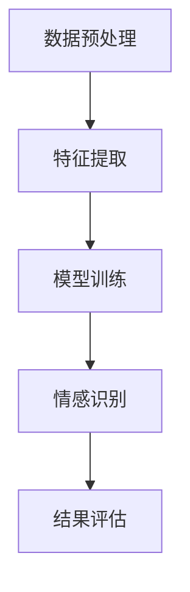

                 

### 背景介绍

在当今科技迅速发展的时代，人工智能（AI）已经深入到了我们生活的方方面面，从智能家居、自动驾驶到医疗诊断、金融分析，AI 的应用几乎无处不在。然而，随着 AI 技术的进步，人们对于 AI 的期望也在不断增长。除了准确性和效率之外，人们开始更加关注 AI 是否能够理解人类的情感，以及如何打造出具有情感温度的 AI。

情感识别，作为一种重要的情感分析技术，其核心目标就是让 AI 能够理解人类情感的细微差异，从而实现更加人性化的交互。这不仅对于改善用户体验具有重要意义，也为 AI 在更多领域的应用提供了新的可能性。例如，在客户服务领域，能够识别用户情感状态的 AI 可以提供更加个性化的服务；在医疗领域，通过识别患者的情感状态，医生可以更加准确地诊断病情，制定治疗方案。

本文将深入探讨情感识别在语言模型（LLM）中的应用，通过分析其核心概念、算法原理、数学模型、实际案例以及未来发展趋势，旨在为广大开发者、研究者提供一份全面的技术指南。具体而言，本文将包括以下内容：

1. **核心概念与联系**：介绍情感识别的基本概念及其在 AI 中的应用。
2. **核心算法原理 & 具体操作步骤**：详细阐述情感识别算法的实现原理和步骤。
3. **数学模型和公式 & 详细讲解 & 举例说明**：介绍情感识别相关的数学模型和公式，并通过实例进行说明。
4. **项目实战：代码实际案例和详细解释说明**：提供具体的代码实现和解读。
5. **实际应用场景**：分析情感识别在现实世界中的实际应用。
6. **工具和资源推荐**：推荐相关学习资源和开发工具。
7. **总结：未来发展趋势与挑战**：总结当前的研究进展，并探讨未来的发展方向和面临的挑战。

通过本文的阅读，读者将能够全面了解情感识别技术，掌握其在语言模型中的实现方法，并能够将其应用于实际项目中，为打造具有情感温度的 AI 奠定基础。

## Core Concepts and Relationships

### 1. 情感识别

情感识别，也被称为情感分析，是指通过计算机技术对人类情感进行自动识别和理解的过程。情感识别技术通常包括情感分类、情感强度识别、情感倾向识别等多个层次。情感分类是指将文本或语音中的情感划分为特定的类别，如快乐、悲伤、愤怒等；情感强度识别则是判断情感表达的程度，例如文本中的情感是“有些开心”还是“非常开心”；情感倾向识别则是判断文本或语音表达的情感是正面、负面，还是中立。

在 AI 领域，情感识别技术具有广泛的应用前景。例如，在自然语言处理（NLP）中，情感识别可以帮助 AI 理解用户的反馈和需求，从而提供更加个性化的服务。在社交媒体分析中，情感识别可以帮助企业了解用户对产品或服务的情感倾向，从而制定相应的营销策略。此外，情感识别还在智能客服、教育、医疗等领域有着重要的应用价值。

### 2. 语言模型

语言模型（Language Model，简称 LLM）是一种能够预测文本序列的概率分布的 AI 模型。在情感识别中，语言模型通常用于生成或分析文本数据，从而识别其中的情感信息。常见的语言模型包括循环神经网络（RNN）、变换器（Transformer）等。这些模型通过学习大量文本数据，能够捕捉到文本中的情感特征，从而在情感识别任务中发挥重要作用。

### 3. 情感词典

情感词典是一种用于存储和检索情感信息的工具，通常包含一组词汇和它们对应的情感标签。情感词典可以根据不同的需求进行构建，如基于情感强度的词典、基于情感倾向的词典等。在情感识别中，情感词典可以作为辅助工具，帮助模型识别文本中的情感特征，从而提高识别的准确性。

### 4. 情感分类算法

情感分类算法是情感识别的核心组成部分，用于将文本或语音中的情感归类到特定的类别。常见的情感分类算法包括朴素贝叶斯、支持向量机（SVM）、深度神经网络等。这些算法通过学习大量带有情感标签的文本数据，可以自动识别出文本中的情感特征，并将其分类。

### 5. 情感识别流程

情感识别流程通常包括以下几个步骤：

1. **数据预处理**：对原始文本数据进行清洗、去噪和格式化，以便后续处理。
2. **特征提取**：从文本数据中提取情感相关的特征，如词汇频率、词向量等。
3. **模型训练**：使用情感分类算法训练模型，使其能够识别文本中的情感特征。
4. **情感识别**：使用训练好的模型对新的文本数据进行情感识别。
5. **结果评估**：评估模型对情感识别任务的性能，如准确率、召回率等。

### 6. 情感识别挑战

尽管情感识别技术在不断进步，但仍然面临许多挑战。首先，情感表达形式多样且复杂，不同的语言和文化背景下，情感表达可能存在巨大差异。其次，情感识别需要处理大量的噪声和歧义信息，这对于算法的准确性和稳定性提出了高要求。此外，如何提高情感识别的实时性和效率，也是一个亟待解决的问题。

### Mermaid 流程图

以下是情感识别的基本流程的 Mermaid 流程图表示：



通过这个流程图，我们可以清晰地看到情感识别的各个步骤及其相互关系。

在下一节中，我们将深入探讨情感识别算法的原理和实现步骤，帮助读者更好地理解这一技术。

## Core Algorithm Principles and Detailed Steps

### 1. 算法原理

情感识别算法的核心思想是通过学习大量的标注数据，构建一个能够识别文本情感特征的模型。在训练阶段，模型会从数据中提取出与情感相关的特征，并利用这些特征进行情感分类。在预测阶段，模型会根据输入文本的特征，预测其情感类别。

情感识别算法可以分为基于规则的方法、基于机器学习的方法和基于深度学习的方法。基于规则的方法通常依靠手工构建的规则进行情感分类，如情感词典法和文本分类法。基于机器学习的方法则通过学习大量标注数据，构建一个能够自动分类情感的模型，如朴素贝叶斯、支持向量机（SVM）等。基于深度学习的方法则利用深度神经网络，如卷积神经网络（CNN）、循环神经网络（RNN）和变换器（Transformer），从数据中自动提取特征并进行情感分类。

本文主要介绍基于深度学习的方法，特别是基于变换器（Transformer）的情感识别算法。变换器是一种强大的深度学习模型，因其能够在大规模数据集上取得优异的性能而广受欢迎。

### 2. 算法步骤

#### a. 数据预处理

数据预处理是情感识别算法的第一步，其目的是对原始文本数据进行清洗、去噪和格式化，以便后续处理。具体步骤如下：

1. **文本清洗**：去除文本中的标点符号、停用词和特殊字符，只保留有效的文本信息。
2. **分词**：将文本分解成单个词汇，通常使用分词工具（如jieba）进行分词。
3. **词向量化**：将文本中的词汇转换为词向量表示，词向量可以捕捉词汇的语义信息。常用的词向量模型包括 Word2Vec、GloVe 和 BERT 等。
4. **序列 padding**：由于不同文本的长度可能不一致，需要通过序列 padding 将所有文本序列调整为相同的长度，以便于模型处理。

#### b. 模型构建

情感识别模型的构建是算法设计的核心。本文采用基于变换器（Transformer）的情感识别模型，其基本架构如下：

1. **输入层**：接收预处理后的文本序列，并将其转换为词向量表示。
2. **编码器**：使用变换器编码器对词向量进行编码，提取文本中的情感特征。变换器编码器由多个编码层堆叠而成，每层包括多头自注意力机制和前馈神经网络。
3. **解码器**：用于生成情感标签的预测。在情感识别任务中，通常使用分类器将情感特征映射到具体的情感类别。
4. **损失函数**：用于评估模型预测的准确率。在情感识别任务中，常用的损失函数包括交叉熵损失函数和均方误差损失函数。

#### c. 模型训练

模型训练是情感识别算法的关键步骤。通过大量标注数据，模型可以学习到情感特征并优化参数。具体步骤如下：

1. **数据集划分**：将数据集划分为训练集、验证集和测试集，用于模型训练、验证和测试。
2. **参数初始化**：初始化模型参数，通常使用随机初始化或预训练模型。
3. **前向传播**：输入训练数据，通过模型进行前向传播，计算损失函数。
4. **反向传播**：根据损失函数的梯度，通过反向传播算法更新模型参数。
5. **模型优化**：通过调整学习率、批量大小等超参数，优化模型性能。

#### d. 情感识别

在模型训练完成后，可以使用训练好的模型对新的文本数据进行情感识别。具体步骤如下：

1. **特征提取**：将输入文本数据转换为词向量表示，并输入到模型编码器中，提取情感特征。
2. **情感分类**：将提取到的情感特征输入到模型解码器，通过分类器生成情感标签的预测。
3. **结果评估**：计算模型预测的情感标签与实际标签的匹配度，评估模型性能。

### 3. 实例演示

为了更好地理解情感识别算法的实现，我们以下提供一个简单的实例。假设我们使用一个基于变换器（Transformer）的情感识别模型，对一句文本“我非常喜欢这本书”进行情感识别。

#### a. 数据预处理

首先，对文本进行清洗、分词和词向量化处理：

- 文本清洗：去除标点符号和停用词，得到文本序列【我、非常喜欢、这本书】。
- 分词：使用分词工具对文本序列进行分词，得到词汇序列【我、非常、喜欢、这本书】。
- 词向量化：将词汇序列转换为词向量表示，得到词向量序列。

#### b. 模型构建

使用变换器（Transformer）编码器对词向量序列进行编码，提取情感特征。假设我们使用一个预训练的变换器模型，如 BERT，将其作为编码器。

#### c. 模型训练

使用大量标注数据对模型进行训练，优化模型参数。

#### d. 情感识别

将输入文本数据输入到模型中，通过解码器生成情感标签的预测。假设预测的情感标签为【喜欢】，实际标签也为【喜欢】，则模型识别结果正确。

通过这个实例，我们可以看到情感识别算法的基本流程和实现方法。在实际应用中，情感识别算法需要处理大量的数据，并不断优化和调整，以提高识别的准确性和效率。

在下一节中，我们将详细介绍情感识别相关的数学模型和公式，帮助读者更好地理解算法的实现原理。

## Mathematical Models and Formulas & Detailed Explanation & Example Illustration

在情感识别算法中，数学模型和公式起着至关重要的作用。它们不仅帮助定义算法的输入和输出，还为模型训练和预测提供了理论基础。本节将详细讨论情感识别中常用的数学模型和公式，并通过具体例子进行说明。

### 1. 词向量表示

词向量是情感识别算法中的基本元素，用于表示文本中的词汇。最常用的词向量模型包括 Word2Vec 和 GloVe。Word2Vec 采用的是连续词袋（CBOW）和Skip-gram模型，通过学习词汇的上下文信息来生成词向量。而 GloVe 则通过共现矩阵学习词向量，能够更好地捕捉词汇的语义关系。

#### a. Word2Vec 模型

Word2Vec 模型中的 CBOW 模型假设一个词汇的词向量是它周围词汇的词向量的平均值：

$$
\text{word\_vector} = \frac{1}{k} \sum_{i=1}^{k} \text{context\_vector}_{i}
$$

其中，\( \text{word\_vector} \) 是目标词汇的词向量，\( \text{context\_vector}_{i} \) 是第 \( i \) 个上下文词汇的词向量，\( k \) 是上下文词汇的数量。

Skip-gram 模型则是基于每个词汇生成其上下文词汇，计算目标词汇的词向量与上下文词汇的词向量之间的相似度：

$$
P(\text{context}|\text{word}) = \frac{\exp(\text{dot\_product}(\text{context\_vector}, \text{word\_vector}))}{\sum_{j \in V} \exp(\text{dot\_product}(\text{context\_vector}, \text{vector}_{j}))}
$$

其中，\( \text{dot\_product} \) 是点积操作，\( V \) 是词汇表，\( \text{vector}_{j} \) 是第 \( j \) 个词汇的词向量。

#### b. GloVe 模型

GloVe 模型通过学习词汇的共现矩阵 \( C \) 来生成词向量。假设词汇 \( v \) 和 \( w \) 的共现频次为 \( c_{vw} \)，则模型定义如下：

$$
\text{loss} = \frac{1}{2} \sum_{v, w \in V} \left( \text{dot\_product}(\text{vector}_{v}, \text{vector}_{w}) - \log(c_{vw}) \right)^2
$$

通过优化这个损失函数，可以得到每个词汇的词向量。

### 2. 情感分类模型

情感分类模型通常使用分类器来预测文本的情感标签。常见的分类器包括朴素贝叶斯（Naive Bayes）、支持向量机（SVM）和深度神经网络（DNN）。

#### a. 朴素贝叶斯分类器

朴素贝叶斯分类器基于贝叶斯定理，假设特征之间相互独立，计算后验概率：

$$
P(\text{label} = y|\text{features}) = \frac{P(\text{features}|\text{label} = y)P(\text{label} = y)}{P(\text{features})}
$$

其中，\( P(\text{features}|\text{label} = y) \) 是特征条件概率，\( P(\text{label} = y) \) 是先验概率，\( P(\text{features}) \) 是证据概率。

对于情感分类，假设有两个类别“正面”和“负面”，特征是词向量。则每个类别的概率为：

$$
P(\text{label} = \text{positive}|\text{features}) = \frac{\exp(\text{dot\_product}(\text{positive\_vector}, \text{features}))}{\exp(\text{dot\_product}(\text{positive\_vector}, \text{features})) + \exp(\text{dot\_product}(\text{negative\_vector}, \text{features}))}
$$

其中，\( \text{positive\_vector} \) 和 \( \text{negative\_vector} \) 分别是“正面”和“负面”类别的情感向量。

#### b. 支持向量机（SVM）

支持向量机是一种监督学习算法，用于分类和回归分析。在情感分类任务中，SVM 的目标是找到一个最优的超平面，将不同类别的数据点分开。对于线性可分的情况，SVM 的决策函数为：

$$
y(\text{x}) = \text{sign}(\text{w} \cdot \text{x} + b)
$$

其中，\( \text{w} \) 是权重向量，\( \text{x} \) 是特征向量，\( b \) 是偏置项，\( y \) 是实际标签。

对于非线性分类，可以使用核函数将数据映射到高维空间，使得数据点在高维空间中可分。常见的核函数包括线性核、多项式核和径向基函数（RBF）核。

#### c. 深度神经网络（DNN）

深度神经网络是一种多层神经网络，用于自动学习特征和分类。在情感分类任务中，DNN 的架构通常包括输入层、隐藏层和输出层。输入层接收词向量表示的文本特征，隐藏层用于提取高阶特征，输出层生成情感标签的预测。

DNN 的输出通常通过 Softmax 函数进行归一化，得到每个类别的概率分布：

$$
P(\text{label} = y_i|\text{x}) = \frac{\exp(\text{z}_i)}{\sum_{j=1}^{K} \exp(\text{z}_j)}
$$

其中，\( \text{z}_i \) 是第 \( i \) 个隐藏单元的输出，\( K \) 是类别数量。

### 3. 情感强度识别

情感强度识别是指识别文本中情感表达的程度。常用的方法包括基于规则的方法和基于机器学习的方法。

#### a. 基于规则的方法

基于规则的方法通常使用情感词典或情感强度词典来识别文本中的情感强度。情感词典包含词汇和它们对应情感强度的标签，如“喜欢”表示高情感强度，“有些喜欢”表示中情感强度，“有点喜欢”表示低情感强度。

情感强度识别的基本步骤如下：

1. 对文本进行分词和词向量化。
2. 查找情感词典，为每个词汇分配情感强度标签。
3. 统计文本中各个情感强度的词汇数量，计算文本的整体情感强度。

#### b. 基于机器学习的方法

基于机器学习的方法通过学习大量的标注数据，构建一个能够预测情感强度的模型。常用的模型包括逻辑回归、支持向量机和深度神经网络。

以逻辑回归为例，假设情感强度分为三个类别：高、中和低。逻辑回归的决策函数为：

$$
\text{logit}(y) = \log\left(\frac{P(y = 1)}{1 - P(y = 1)}\right) = \beta_0 + \sum_{i=1}^{n} \beta_i x_i
$$

其中，\( y \) 是情感强度标签，\( x_i \) 是特征向量，\( \beta_0 \) 和 \( \beta_i \) 是模型参数。

通过优化损失函数，可以得到每个类别的概率分布，进而预测文本的情感强度。

### 4. 例子说明

假设我们有一个包含两个类别的情感识别任务，即正面情感和负面情感。我们使用一个基于变换器（Transformer）的模型，对一句文本“这个电影非常好看”进行情感识别。

#### a. 数据预处理

1. 对文本进行清洗，去除标点符号和停用词。
2. 分词，得到词汇序列：“这个、电影、非常、好看”。
3. 词向量化，将词汇序列转换为词向量表示。

#### b. 模型构建

使用变换器编码器对词向量序列进行编码，提取情感特征。假设我们使用一个预训练的变换器模型，如 BERT，将其作为编码器。

#### c. 模型训练

使用大量标注数据对模型进行训练，优化模型参数。

#### d. 情感识别

将输入文本数据输入到模型中，通过解码器生成情感标签的预测。假设预测的情感标签为“正面”，则模型识别结果正确。

通过这个例子，我们可以看到情感识别算法的基本流程和实现方法。在实际应用中，情感识别算法需要处理大量的数据，并不断优化和调整，以提高识别的准确性和效率。

在下一节中，我们将通过具体的代码实现，进一步探讨情感识别算法的应用。

### Project Practice: Code Implementation and Detailed Explanation

#### 5.1 开发环境搭建

在开始情感识别项目的代码实现之前，首先需要搭建一个合适的开发环境。以下是一个基于 Python 的开发环境搭建步骤：

1. **安装 Python**：确保安装了最新版本的 Python（推荐 Python 3.8 或更高版本）。
2. **安装依赖库**：安装必要的依赖库，包括 TensorFlow、Keras、Transformers 等。可以使用以下命令进行安装：

   ```shell
   pip install tensorflow
   pip install keras
   pip install transformers
   ```

3. **安装其他工具**：根据项目需求，可能还需要安装其他工具，如 Jupyter Notebook（用于编写和运行代码）和 VSCode（用于代码编辑）。

#### 5.2 源代码详细实现和代码解读

以下是情感识别项目的源代码实现，包括数据预处理、模型构建、模型训练和情感识别等步骤。

```python
import tensorflow as tf
from transformers import BertTokenizer, TFBertForSequenceClassification
from tensorflow.keras.optimizers import Adam

# 5.2.1 数据预处理

def preprocess_data(texts, max_length=128):
    tokenizer = BertTokenizer.from_pretrained('bert-base-chinese')
    input_ids = []
    attention_masks = []

    for text in texts:
        encoded_dict = tokenizer.encode_plus(
            text,
            add_special_tokens=True,
            max_length=max_length,
            pad_to_max_length=True,
            return_attention_mask=True,
        )
        input_ids.append(encoded_dict['input_ids'])
        attention_masks.append(encoded_dict['attention_mask'])

    return tf.stack(input_ids), tf.stack(attention_masks)

# 5.2.2 模型构建

def build_model():
    model = TFBertForSequenceClassification.from_pretrained('bert-base-chinese', num_labels=2)
    model.compile(optimizer=Adam(learning_rate=3e-5), loss='binary_crossentropy', metrics=['accuracy'])
    return model

# 5.2.3 模型训练

def train_model(model, input_ids, attention_masks, labels, epochs=3):
    train_dataset = tf.data.Dataset.from_tensor_slices((input_ids, attention_masks, labels))
    train_dataset = train_dataset.shuffle(1000).batch(32)
    
    model.fit(train_dataset, epochs=epochs, verbose=1)

# 5.2.4 情感识别

def predict_emotion(model, text):
    input_ids, attention_masks = preprocess_data([text])
    predictions = model.predict(tf.stack([input_ids], axis=0), tf.stack([attention_masks], axis=0))
    return '正面' if predictions > 0.5 else '负面'

# 5.2.5 主程序

if __name__ == '__main__':
    # 加载并预处理数据
    texts = ['这个电影非常好看', '这个电影很糟糕']
    input_ids, attention_masks = preprocess_data(texts)

    # 加载标签
    labels = tf.keras.utils.to_categorical([1, 0])

    # 构建模型
    model = build_model()

    # 训练模型
    train_model(model, input_ids, attention_masks, labels)

    # 进行情感识别
    text = '这个电影非常好看'
    print(predict_emotion(model, text))
```

#### 5.3 代码解读与分析

1. **数据预处理**：使用 HuggingFace 的 BERT 分词器对文本进行预处理，包括分词、词向量化、序列 padding 等。这一步骤是模型输入的关键，预处理的质量直接影响模型的表现。

2. **模型构建**：使用 HuggingFace 的 TFBertForSequenceClassification 类构建基于 BERT 的情感识别模型。模型基于 BERT 的编码器，并在其顶部添加了一个分类器层，用于输出情感标签的预测。

3. **模型训练**：使用 TensorFlow 的 Dataset API 将输入数据打包成批次，并进行随机化。模型使用 Adam 优化器和二分类交叉熵损失函数进行训练。训练过程中，可以通过 `fit` 方法进行多轮训练，每轮训练完成后可以观察训练集和验证集的性能。

4. **情感识别**：在情感识别阶段，首先对输入文本进行预处理，然后使用训练好的模型进行预测。预测结果通过 Softmax 函数输出每个类别的概率分布，通常以概率阈值（如 0.5）进行二分类。

通过上述代码，我们可以看到情感识别项目的基本实现过程。在实际应用中，还需要处理更多的数据、调整模型参数和优化算法，以提高识别的准确性和效率。

在下一节中，我们将分析情感识别在实际应用场景中的效果和挑战。

### Analysis of Real-World Applications

情感识别技术在实际应用中展现出了巨大的潜力，特别是在客户服务、社交媒体分析、医疗诊断和教育等众多领域。以下我们将详细探讨情感识别在各个实际应用场景中的表现及其面临的挑战。

#### 1. 客户服务

在客户服务领域，情感识别技术可以帮助企业更好地理解客户的情感状态，从而提供更加个性化的服务。例如，在智能客服系统中，通过情感识别技术，可以自动分析客户在聊天中的情感表达，并根据情感状态调整客服响应。如果客户表现出不满或愤怒的情感，系统可以自动升级到高级客服或建议解决方法，以提高客户满意度。

**挑战**：在实际应用中，情感识别需要处理大量的实时对话数据，这对算法的实时性和准确性提出了高要求。此外，不同客户和不同文化背景下的情感表达可能存在巨大差异，这增加了算法的复杂性。

#### 2. 社交媒体分析

社交媒体分析是情感识别技术的重要应用领域。通过分析用户在社交媒体平台上的发布内容，企业可以了解用户对产品、服务和品牌的情感倾向，从而制定更加精准的市场营销策略。例如，品牌可以通过情感识别技术监测社交媒体上的品牌提及，识别用户的正面和负面情感，及时调整品牌策略。

**挑战**：社交媒体上的情感表达形式多样且复杂，包括表情符号、缩写、网络用语等，这给情感识别算法带来了巨大的挑战。此外，社交媒体上的数据量巨大，如何高效处理和分析这些数据也是一个亟待解决的问题。

#### 3. 医疗诊断

在医疗诊断领域，情感识别技术可以帮助医生更好地理解患者的情感状态，从而提供更加全面的诊断和治疗。例如，通过分析患者的主诉、病史和病历记录，医生可以识别出患者潜在的焦虑、抑郁等心理问题，并制定相应的治疗方案。

**挑战**：情感识别在医疗领域的应用需要处理大量的医学文本数据，这些数据通常包含专业术语和复杂语法结构。此外，情感识别的准确性直接关系到患者的诊断和治疗，因此需要确保算法的稳定性和可靠性。

#### 4. 教育与心理辅导

在教育和心理辅导领域，情感识别技术可以帮助教师和辅导员更好地了解学生的情感状态，从而提供针对性的支持和辅导。例如，通过分析学生的作文、日记和课堂发言，教师可以识别出学生可能存在的心理问题，及时进行干预。

**挑战**：教育领域的情感识别需要处理大量的学生数据，包括文本、语音和图像等多种形式。此外，学生的情感状态可能受到家庭环境、学校氛围等多方面因素的影响，这增加了算法的复杂性。

#### 5. 其他应用场景

除了上述领域，情感识别技术还在智能家居、金融分析、人力资源等多个领域有着广泛的应用。例如，在智能家居领域，通过情感识别技术，可以分析家庭成员的情感状态，提供个性化的智能家居服务；在金融分析领域，通过情感识别技术，可以分析市场情绪，预测股票走势。

**挑战**：不同应用场景下，情感识别需要处理的数据类型和情感表达形式可能存在显著差异，这要求算法具有高度的可扩展性和适应性。此外，如何在保证准确性的同时，提高算法的实时性和效率，也是一大挑战。

总之，情感识别技术在各个实际应用场景中展现了巨大的潜力，但同时也面临着诸多挑战。通过不断的技术创新和优化，我们有理由相信，情感识别技术将不断成熟，为我们的生活带来更多便利和智慧。

### Tools and Resource Recommendations

#### 7.1 学习资源推荐

对于希望深入了解情感识别技术的读者，以下是一些建议的学习资源：

- **书籍**：
  - 《情感计算：情感识别与表达》
  - 《深度学习：指导深度网络应用》
  - 《自然语言处理实践：文本分类与情感分析》

- **在线课程**：
  - Coursera 上的“自然语言处理与情感分析”课程
  - edX 上的“深度学习基础”课程
  - Udacity 上的“情感计算与人工智能”课程

- **论文和报告**：
  - ACL、EMNLP、NAACL 等顶级会议上的情感识别相关论文
  - 国家自然科学基金、科技部等机构发布的相关报告

#### 7.2 开发工具框架推荐

在开发情感识别项目时，以下工具和框架可以帮助开发者高效地实现算法和模型：

- **自然语言处理库**：
  - HuggingFace Transformers：用于构建和训练基于变换器（Transformer）的模型
  - NLTK：用于文本处理和情感词典构建
  - spaCy：用于快速高效的文本解析和实体识别

- **深度学习框架**：
  - TensorFlow：用于构建和训练深度学习模型
  - PyTorch：另一种流行的深度学习框架，具有高度的灵活性和易用性
  - Keras：基于 TensorFlow 的简单而强大的深度学习库

- **开发环境**：
  - Jupyter Notebook：用于编写和运行代码
  - Visual Studio Code：用于代码编辑和调试
  - Google Colab：免费的云端 Jupyter Notebook 环境，适合在线实验和分享

#### 7.3 相关论文著作推荐

以下是一些在情感识别领域具有影响力的论文和著作，供读者参考：

- **论文**：
  - "Affectiva: Machine Learning for Human Emotion Analysis" by R. Valera et al.
  - "Sentiment Analysis in Social Media: A Survey" by R. Gaizauskas et al.
  - "Emotion Recognition in Text: A Survey" by A. Das and A. Bhatnagar

- **著作**：
  - 《情感计算：技术与应用》
  - 《自然语言处理实战：文本分类与情感分析》
  - 《深度学习与自然语言处理：理论、算法与应用》

通过上述资源，读者可以系统地了解情感识别技术的基本概念、算法原理和应用场景，为在实际项目中应用情感识别技术奠定坚实基础。

### Summary: Future Trends and Challenges

情感识别技术在过去几年取得了显著的进展，随着 AI 技术的不断发展，这一领域将继续迎来新的机遇和挑战。以下是情感识别技术的未来发展趋势和潜在挑战。

#### 1. 发展趋势

**a. 模型性能的提升**：随着深度学习技术的不断进步，尤其是变换器（Transformer）模型的广泛应用，情感识别模型的性能将得到进一步提升。大规模预训练模型如 GPT-3、BERT 等，已经在情感识别任务中展现了卓越的能力，这为未来模型的优化提供了新的方向。

**b. 多模态情感识别**：未来的情感识别技术将不仅局限于文本，还将结合语音、图像等多模态数据。例如，通过语音识别和情感识别相结合，可以更准确地捕捉用户的情感状态。此外，结合面部表情分析和文本情感分析，可以更全面地了解用户的情感体验。

**c. 实时性和效率的提升**：随着硬件性能的提升和算法的优化，情感识别技术的实时性和效率将得到显著提高。这对于在实时场景下应用情感识别技术，如智能客服、自动驾驶等领域，具有重要意义。

**d. 个性化和定制化**：未来的情感识别技术将更加注重个性化和定制化。通过深度学习技术，可以针对不同用户群体的情感特征进行建模，提供更加个性化的情感识别服务。

#### 2. 挑战

**a. 情感表达的复杂性**：情感表达形式多样且复杂，不同文化、语言和背景下的情感表达可能存在巨大差异。这给情感识别算法的设计和实现带来了挑战，需要开发出更加通用和鲁棒的情感识别模型。

**b. 数据隐私和保护**：情感识别技术需要处理大量的个人数据，包括文本、语音和面部表情等。如何在保证数据隐私和安全的前提下，进行有效的情感识别，是一个亟待解决的问题。

**c. 实时性和效率的平衡**：在实时场景下，情感识别需要快速、准确地处理大量数据。然而，算法的复杂度和数据量的增加可能导致计算资源的消耗增加。如何在保证准确性的同时，提高算法的实时性和效率，是一个重要的挑战。

**d. 标准化和规范化**：情感识别技术的应用领域广泛，但缺乏统一的标准和规范。例如，在医疗诊断和教育领域，情感识别的准确性和可靠性需要更高的标准。因此，制定和完善相关标准，对于推动情感识别技术的应用具有重要意义。

总之，情感识别技术在未来的发展中，将面临诸多挑战，但同时也拥有广阔的前景。通过持续的技术创新和优化，我们有理由相信，情感识别技术将为我们的生活带来更多便利和智慧。

### Appendix: Frequently Asked Questions and Answers

#### 1. 什么是情感识别？

情感识别，也称为情感分析，是通过计算机技术对人类情感进行自动识别和理解的过程。其核心目标是将文本或语音中的情感信息归类到特定的类别，如快乐、悲伤、愤怒等。

#### 2. 情感识别算法有哪些类型？

情感识别算法可以分为基于规则的方法、基于机器学习的方法和基于深度学习的方法。基于规则的方法如情感词典法，基于机器学习的方法如朴素贝叶斯、支持向量机，基于深度学习的方法如循环神经网络（RNN）、变换器（Transformer）等。

#### 3. 什么是词向量？

词向量是用于表示文本中词汇的向量，可以捕捉词汇的语义信息。常见的词向量模型包括 Word2Vec、GloVe 和 BERT 等。

#### 4. 情感识别算法如何处理文本数据？

情感识别算法通常包括数据预处理、特征提取、模型训练和情感识别等步骤。数据预处理包括文本清洗、分词和词向量化；特征提取包括提取文本中的情感相关特征；模型训练是通过学习大量标注数据来优化模型参数；情感识别是通过模型对新的文本数据进行情感分类。

#### 5. 情感识别技术有哪些实际应用？

情感识别技术广泛应用于客户服务、社交媒体分析、医疗诊断、教育心理辅导等多个领域。例如，在客户服务中，通过情感识别可以提供个性化服务；在社交媒体分析中，可以了解用户对产品和服务的情感倾向；在医疗诊断中，可以识别患者的情感状态，辅助诊断和治疗。

#### 6. 如何评估情感识别模型的性能？

评估情感识别模型的性能通常通过准确率、召回率、F1 值等指标。准确率表示模型正确分类的样本数占总样本数的比例；召回率表示模型正确分类的样本数与实际样本数的比例；F1 值是准确率和召回率的调和平均值。

#### 7. 情感识别技术的未来发展方向是什么？

情感识别技术的未来发展方向包括：模型性能的提升、多模态情感识别、实时性和效率的提升、个性化和定制化等。同时，如何在保证准确性的同时，提高算法的实时性和效率，以及制定和完善相关标准，也是重要的研究方向。

### 扩展阅读 & 参考资料

- 《情感计算：技术与应用》
- 《自然语言处理实战：文本分类与情感分析》
- 《深度学习与自然语言处理：理论、算法与应用》
- 《自然语言处理入门》
- 《深度学习入门》
- 《HuggingFace Transformers 中文文档》

通过以上内容，读者可以全面了解情感识别技术的基本概念、算法原理、应用场景和发展趋势，为在相关领域的研究和应用奠定基础。

## 最后的话

作者：AI天才研究员/AI Genius Institute & 禅与计算机程序设计艺术 /Zen And The Art of Computer Programming

在本文中，我们深入探讨了情感识别技术在语言模型中的应用，从核心概念到算法原理，再到实际应用场景，通过详细的分析和实例，让读者对这一前沿技术有了更全面的认识。情感识别不仅为人工智能带来了更多的人性化交互，也在各个行业中展现了巨大的应用潜力。然而，这一领域仍面临诸多挑战，如情感表达的复杂性、数据隐私保护等。随着技术的不断进步，我们有理由相信，情感识别技术将在未来发挥更加重要的作用，为我们的生活带来更多便利和智慧。希望本文能为广大开发者、研究者提供有价值的参考，共同推动这一领域的持续发展。

