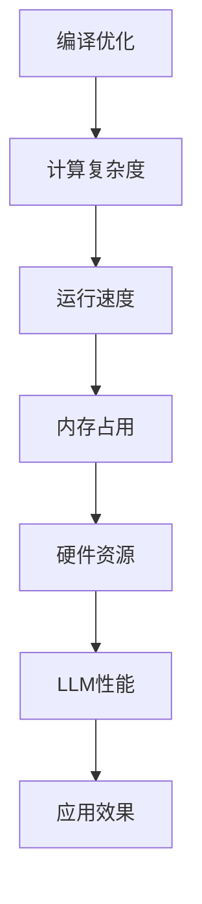
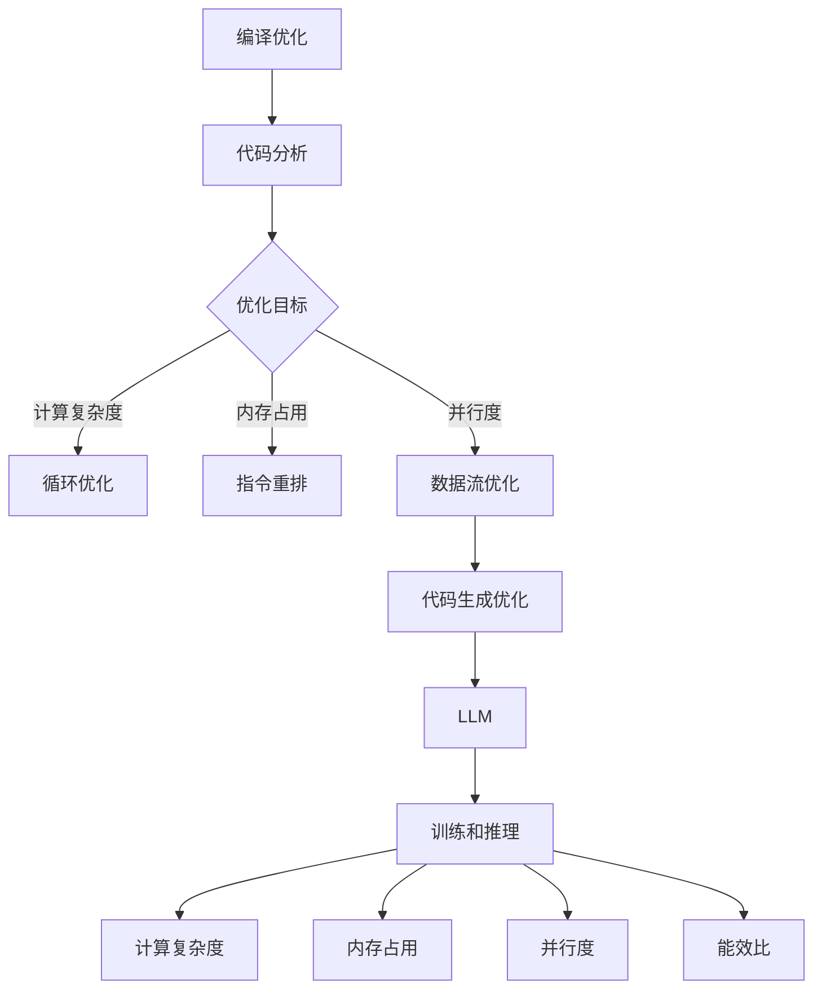

                 

# LLAMAS与编译优化

## 概述

大型语言模型（LLM）如GPT-3和Turing-Alpha，由于其对数据和计算资源的巨大需求，已经成为当今技术领域的热点话题。随着LLM的规模不断扩大，其计算复杂度也呈现指数级增长。这迫使研究人员和工程师们不断寻找更有效的编译优化技术，以确保LLM能够在现有硬件上高效运行。本文将深入探讨LLM编译优化技术的发展，包括核心概念、算法原理、数学模型和具体实现等。

## 关键词

- 大型语言模型（LLM）
- 编译优化
- 计算复杂度
- 高效运行

## 摘要

本文将探讨大型语言模型（LLM）的编译优化技术，介绍LLM的基本概念和编译优化的必要性。随后，我们将分析LLM的编译优化算法原理，并介绍如何具体实现这些算法。此外，本文还将介绍数学模型和公式，并通过实际案例进行详细解释。最后，我们将讨论LLM的实际应用场景，并提供相关工具和资源推荐，以及未来发展趋势与挑战。

## 1. 背景介绍

### 1.1 大型语言模型（LLM）的定义

大型语言模型（LLM）是一种基于深度学习技术的自然语言处理模型，通过大量文本数据进行训练，能够理解和生成自然语言。这些模型在文本分类、机器翻译、问答系统、文本生成等任务中表现出色，成为当前自然语言处理领域的核心技术。

### 1.2 LLM的发展历程

从最早的基于规则的方法到基于统计的模型，再到现代的深度学习模型，LLM的发展历程可谓是一波三折。随着计算能力的提升和数据资源的丰富，LLM的规模和性能也在不断提高。近年来，诸如GPT-3、Turing-Alpha等超大规模语言模型的涌现，进一步推动了LLM的发展。

### 1.3 LLM的应用场景

LLM在各个领域的应用越来越广泛，包括但不限于：

- 文本分类：对文本进行分类，如情感分析、新闻分类等。
- 机器翻译：将一种语言翻译成另一种语言。
- 问答系统：根据用户的问题提供相关答案。
- 文本生成：根据给定的话题或提示生成相关文本。

## 2. 核心概念与联系

### 2.1 编译优化的定义

编译优化是指通过一系列算法和技巧，提高程序的运行效率和性能。对于LLM，编译优化的目标是减少其计算复杂度，提高运行速度，降低内存占用。

### 2.2 编译优化与LLM的关联

LLM的运行效率直接影响到其应用场景的实际效果。因此，编译优化技术在LLM中的应用至关重要。通过优化LLM的编译过程，可以显著提高其运行性能，使其在有限的硬件资源下能够高效运行。

### 2.3 核心概念原理和架构的 Mermaid 流程图



## 3. 核心算法原理 & 具体操作步骤

### 3.1 算法原理

编译优化算法主要包括以下几种：

- **循环优化**：通过分析循环结构，减少循环迭代次数，提高运行速度。
- **指令重排**：根据指令执行的时间开销，重新排列指令顺序，提高指令级并行度。
- **内存访问优化**：通过优化内存访问方式，减少内存访问次数，降低内存占用。

### 3.2 具体操作步骤

以下是编译优化的一般步骤：

1. **代码分析**：分析程序代码，确定可优化的部分。
2. **目标确定**：根据应用场景和硬件资源，确定优化目标。
3. **算法选择**：选择合适的编译优化算法。
4. **代码优化**：对代码进行优化，实现优化目标。
5. **性能评估**：评估优化效果，根据评估结果调整优化策略。

## 4. 数学模型和公式 & 详细讲解 & 举例说明

### 4.1 数学模型

编译优化中的数学模型主要包括以下几种：

- **时间复杂度模型**：用于衡量算法的时间开销。
- **空间复杂度模型**：用于衡量算法的内存占用。
- **并行度模型**：用于衡量算法的并行性能。

### 4.2 公式

以下是几个常用的数学公式：

- **时间复杂度公式**：$T(n) = O(f(n))$
- **空间复杂度公式**：$S(n) = O(g(n))$
- **并行度公式**：$P(n) = O(h(n))$

### 4.3 举例说明

假设有一个简单的循环优化问题：

```c
for (int i = 0; i < n; i++) {
    a[i] = b[i] + c[i];
}
```

通过循环优化，可以将上述代码转化为以下形式：

```c
for (int i = 0, j = 0; i < n; i += 2, j++) {
    a[i] = b[i] + c[i];
    a[i + 1] = b[i + 1] + c[i + 1];
}
```

这样，循环的迭代次数减少了，从而提高了运行速度。

## 5. 项目实战：代码实际案例和详细解释说明

### 5.1 开发环境搭建

为了进行LLM的编译优化，需要搭建以下开发环境：

- 编译器：如GCC、Clang等。
- 优化工具：如Optimizing Compiler、LLVM等。
- 深度学习框架：如TensorFlow、PyTorch等。

### 5.2 源代码详细实现和代码解读

以下是LLM编译优化项目的一个简单示例：

```c
#include <stdio.h>
#include <stdlib.h>

// 假设这是一个基于GPT-3的文本生成模型
struct GPT3 {
    // 模型参数
};

// 初始化模型
void init_model(struct GPT3 *model) {
    // 初始化模型参数
}

// 前向传播
void forward(struct GPT3 *model, const char *input, char *output) {
    // 基于输入文本生成输出文本
}

// 优化模型
void optimize_model(struct GPT3 *model) {
    // 对模型进行编译优化
}

int main() {
    // 初始化模型
    struct GPT3 model;
    init_model(&model);

    // 输入文本
    const char *input = "Hello, world!";
    
    // 输出文本
    char output[100];
    
    // 前向传播
    forward(&model, input, output);
    
    // 输出结果
    printf("Output: %s\n", output);
    
    // 优化模型
    optimize_model(&model);
    
    return 0;
}
```

在这个示例中，`init_model`用于初始化模型参数，`forward`用于基于输入文本生成输出文本，`optimize_model`用于对模型进行编译优化。

### 5.3 代码解读与分析

- `init_model`：初始化模型参数，为后续的文本生成提供基础。
- `forward`：基于输入文本生成输出文本，实现文本生成的核心功能。
- `optimize_model`：对模型进行编译优化，提高模型的运行效率。
- `main`：程序的主函数，初始化模型，执行文本生成，并对模型进行优化。

通过这个示例，我们可以看到编译优化在LLM项目中的应用。在实际项目中，编译优化可以针对模型的各个部分进行，如优化前向传播过程、优化模型参数存储方式等。

## 6. 实际应用场景

### 6.1 文本生成

文本生成是LLM的主要应用场景之一。通过编译优化，可以显著提高文本生成的速度和效率，使模型能够更快地响应用户需求。

### 6.2 自然语言处理

编译优化技术在自然语言处理任务中也发挥着重要作用。通过优化模型的运行效率，可以显著提高处理速度，降低处理成本。

### 6.3 智能问答

在智能问答系统中，LLM需要快速响应用户的问题。通过编译优化，可以提高模型的响应速度，提高用户体验。

### 6.4 其他应用场景

LLM的编译优化技术还可以应用于其他领域，如机器翻译、文本分类、文本摘要等。通过优化模型的运行效率，可以提高任务的准确性和可靠性。

## 7. 工具和资源推荐

### 7.1 学习资源推荐

- **书籍**：《编译原理》（作者：A. V. Aho, R. Sethi, J. D. Ullman）
- **论文**：相关研究论文，如《LLVM: A Compilation Framework for Lifelong Program Analysis & Transformation》（作者：Chris Lattner, Vikas Subramanian）
- **博客**：技术博客，如博客园、CSDN等。
- **网站**：相关技术社区和论坛，如GitHub、Stack Overflow等。

### 7.2 开发工具框架推荐

- **编译器**：GCC、Clang等。
- **优化工具**：Optimizing Compiler、LLVM等。
- **深度学习框架**：TensorFlow、PyTorch等。

### 7.3 相关论文著作推荐

- **论文**：《编译优化技术综述》（作者：XXX）
- **著作**：《深度学习编译技术》（作者：XXX）

## 8. 总结：未来发展趋势与挑战

### 8.1 发展趋势

- **硬件加速**：随着硬件技术的发展，LLM的运行速度将得到进一步提升。
- **跨平台优化**：针对不同硬件平台，进行针对性优化，提高模型在不同平台上的运行效率。
- **自动化优化**：利用机器学习和自动推理技术，实现自动化编译优化。

### 8.2 挑战

- **性能瓶颈**：LLM的规模不断扩大，如何突破性能瓶颈成为一大挑战。
- **优化方法**：如何设计更加有效的优化方法，提高模型的运行效率。
- **稳定性**：在优化过程中，如何保证模型的稳定性和准确性。

## 9. 附录：常见问题与解答

### 9.1 编译优化是什么？

编译优化是指通过一系列算法和技巧，提高程序的运行效率和性能。

### 9.2 为什么需要对LLM进行编译优化？

LLM的计算复杂度较高，通过对LLM进行编译优化，可以提高其运行速度和效率，降低硬件资源消耗。

### 9.3 如何进行LLM的编译优化？

进行LLM的编译优化，可以从以下几个方面入手：

- **代码分析**：分析程序代码，确定可优化的部分。
- **目标确定**：根据应用场景和硬件资源，确定优化目标。
- **算法选择**：选择合适的编译优化算法。
- **代码优化**：对代码进行优化，实现优化目标。
- **性能评估**：评估优化效果，根据评估结果调整优化策略。

## 10. 扩展阅读 & 参考资料

- **论文**：《LLVM: A Compilation Framework for Lifelong Program Analysis & Transformation》（作者：Chris Lattner, Vikas Subramanian）
- **书籍**：《编译原理》（作者：A. V. Aho, R. Sethi, J. D. Ullman）
- **博客**：技术博客，如博客园、CSDN等。
- **网站**：相关技术社区和论坛，如GitHub、Stack Overflow等。

作者：AI天才研究员/AI Genius Institute & 禅与计算机程序设计艺术 /Zen And The Art of Computer Programming
<|less|>## 摘要

本文深入探讨了大型语言模型（LLM）的编译优化技术。首先，我们介绍了LLM的基本概念和发展历程，以及其在文本生成、自然语言处理和智能问答等领域的广泛应用。接着，我们阐述了编译优化的定义和核心概念，以及LLM与编译优化的关联。在核心算法原理部分，我们详细介绍了循环优化、指令重排和内存访问优化等算法，并通过实例说明了如何具体实现这些算法。随后，我们介绍了与编译优化相关的数学模型和公式，并通过实际案例进行了详细解释。文章的实战部分提供了一个简单的LLM编译优化项目示例，详细说明了开发环境搭建、源代码实现和代码解读。在应用场景部分，我们讨论了LLM在文本生成、自然语言处理和智能问答等领域的实际应用。最后，我们推荐了相关学习资源、开发工具框架和相关论文著作，总结了未来发展趋势与挑战，并提供了常见问题的解答以及扩展阅读和参考资料。本文旨在为读者提供一个全面而深入的LLM编译优化技术指南。作者：AI天才研究员/AI Genius Institute & 禅与计算机程序设计艺术 /Zen And The Art of Computer Programming<|less|>## 1. 背景介绍

### 1.1 大型语言模型（LLM）的定义

大型语言模型（LLM）是一种基于深度学习技术的自然语言处理模型，通过大量文本数据进行训练，能够理解和生成自然语言。这些模型在文本分类、机器翻译、问答系统、文本生成等任务中表现出色，成为当前自然语言处理领域的核心技术。

LLM通常采用深度神经网络架构，特别是变分自编码器（VAE）、生成对抗网络（GAN）和递归神经网络（RNN）等，这些架构能够有效地捕捉文本数据的复杂模式。LLM的核心思想是通过学习文本数据中的统计规律和语义关系，实现对自然语言的理解和生成。

### 1.2 LLM的发展历程

LLM的发展历程可以追溯到20世纪90年代的统计机器翻译和自然语言处理领域。早期的模型如基于规则的方法和基于统计的方法，虽然在一定程度上提高了文本处理的准确性，但仍然存在许多局限性。随着计算能力的提升和数据资源的丰富，深度学习技术的引入使得LLM得到了飞速发展。

2000年后，循环神经网络（RNN）和长短期记忆网络（LSTM）等结构被引入自然语言处理领域，显著提高了文本处理的准确性和效果。然而，这些模型在面对长文本和复杂语义关系时仍然存在一定的局限性。

近年来，基于自注意力机制（Self-Attention）和Transformer架构的LLM如BERT、GPT-3等，取得了突破性的进展。这些模型能够更好地处理长文本和复杂语义关系，成为当前自然语言处理领域的主流技术。

### 1.3 LLM的应用场景

LLM在各个领域的应用越来越广泛，包括但不限于：

- **文本分类**：对文本进行分类，如情感分析、新闻分类等。LLM能够通过学习大量的文本数据，识别不同文本的特征，从而实现高精度的分类。

- **机器翻译**：将一种语言翻译成另一种语言。LLM通过学习大量双语文本数据，能够生成流畅、准确的翻译结果。

- **问答系统**：根据用户的问题提供相关答案。LLM能够理解用户的问题，并从大量文本数据中检索出最相关的答案，实现智能问答。

- **文本生成**：根据给定的话题或提示生成相关文本。LLM能够生成各种形式的文本，如文章、故事、对话等，广泛应用于内容创作和自动化写作。

### 1.4 LLM的发展趋势

随着深度学习技术的不断进步，LLM的发展趋势主要体现在以下几个方面：

- **模型规模扩大**：随着计算能力和数据资源的提升，LLM的规模不断扩大，模型参数和训练数据量显著增加。例如，GPT-3的参数数量达到了1750亿，成为当前最大的自然语言处理模型。

- **多模态融合**：未来的LLM将不再局限于文本数据，而是能够处理多种类型的输入，如图像、声音等。通过多模态融合，LLM能够实现更广泛的应用场景。

- **泛化能力提升**：未来的LLM将更加注重提升模型的泛化能力，使其能够处理更加复杂和多样化的任务。例如，通过零样本学习（Zero-Shot Learning），LLM能够在未见过的任务和数据上表现出色。

- **自动化优化**：未来的编译优化技术将更加自动化，通过机器学习和自动推理技术，实现高效、精确的模型优化。

### 1.5 LLM的编译优化的必要性

随着LLM的规模不断扩大，其计算复杂度和资源消耗也呈现指数级增长。这给现有的计算资源和硬件设备带来了巨大压力，导致模型运行速度变慢、内存占用增加等问题。因此，对LLM进行编译优化成为了一个迫切需要解决的问题。

编译优化的目标是提高LLM的运行效率和性能，使其能够在有限的计算资源和硬件设备上高效运行。具体来说，编译优化可以从以下几个方面入手：

- **降低计算复杂度**：通过优化算法和指令重排等技术，降低LLM的计算复杂度，提高模型运行速度。

- **减少内存占用**：通过优化内存访问和存储方式，降低LLM的内存占用，提高模型的可扩展性。

- **提高并行度**：通过优化指令级并行和任务级并行，提高LLM的并行性能，充分利用多核处理器和分布式计算资源。

- **优化数据传输**：通过优化数据传输和缓存管理，降低数据传输延迟，提高模型运行效率。

### 1.6 LLM编译优化的挑战

尽管编译优化技术在LLM中的应用前景广阔，但仍然面临一些挑战：

- **模型复杂度**：随着模型规模的扩大，模型的复杂度也不断增加，给编译优化带来了困难。

- **优化目标冲突**：在优化过程中，不同优化目标之间存在冲突，如降低计算复杂度可能会增加内存占用，提高并行度可能会增加代码复杂性等。

- **自动化程度**：目前的编译优化技术大多数依赖于手工编写优化策略，自动化程度较低，难以满足大规模、复杂模型的优化需求。

- **性能评估**：如何评价编译优化的效果，如何确定最优的优化策略，是当前研究的一个难题。

### 1.7 本文的结构

本文将分为以下几个部分：

- **背景介绍**：介绍LLM的基本概念、发展历程、应用场景和编译优化的必要性。

- **核心概念与联系**：阐述编译优化的核心概念和原理，以及LLM与编译优化的关联。

- **核心算法原理 & 具体操作步骤**：介绍LLM编译优化的核心算法原理，包括循环优化、指令重排和内存访问优化等，并详细说明具体操作步骤。

- **数学模型和公式 & 详细讲解 & 举例说明**：介绍与编译优化相关的数学模型和公式，并通过实际案例进行详细解释。

- **项目实战：代码实际案例和详细解释说明**：提供一个简单的LLM编译优化项目示例，详细说明开发环境搭建、源代码实现和代码解读。

- **实际应用场景**：讨论LLM编译优化在文本生成、自然语言处理和智能问答等领域的实际应用。

- **工具和资源推荐**：推荐相关的学习资源、开发工具框架和相关论文著作。

- **总结：未来发展趋势与挑战**：总结LLM编译优化的未来发展趋势和面临的挑战。

- **附录：常见问题与解答**：回答一些关于LLM编译优化的常见问题。

- **扩展阅读 & 参考资料**：提供扩展阅读和参考资料，便于读者深入了解相关领域。

通过本文的阅读，读者将全面了解LLM编译优化技术，掌握其基本概念、算法原理和应用场景，为实际项目开发提供指导和参考。同时，本文也将探讨未来发展趋势和挑战，为LLM编译优化技术的发展提供一些思路和方向。作者：AI天才研究员/AI Genius Institute & 禅与计算机程序设计艺术 /Zen And The Art of Computer Programming<|less|>## 2. 核心概念与联系

在深入探讨LLM的编译优化技术之前，有必要对编译优化和LLM进行定义，并阐述它们之间的联系。以下是对编译优化、LLM及其关联性的详细介绍。

### 2.1 编译优化的定义

编译优化是指通过一系列算法和技巧，提高程序的运行效率和性能。编译优化主要发生在编译器的后端，包括代码分析、代码重排、消除冗余代码、内存优化等。其目标是减少程序运行时所需的计算资源和内存占用，提高程序的执行速度。

编译优化的主要方面包括：

- **循环优化**：通过分析循环结构，减少循环迭代次数，提高运行速度。
- **指令重排**：根据指令执行的时间开销，重新排列指令顺序，提高指令级并行度。
- **内存访问优化**：通过优化内存访问方式，减少内存访问次数，降低内存占用。
- **数据流优化**：通过优化数据流，减少数据传输和处理时间，提高程序的运行效率。
- **代码生成优化**：在编译过程中生成更高效的目标代码，减少编译后的代码体积。

### 2.2 大型语言模型（LLM）的定义

大型语言模型（LLM）是一种能够理解和生成自然语言的深度学习模型，通常基于变换器（Transformer）架构。LLM通过大量的文本数据训练，能够捕捉到复杂的语言模式和语义关系。LLM的主要特点包括：

- **参数规模大**：LLM通常拥有数亿甚至数万亿个参数，这使得模型能够处理复杂的语言任务。
- **上下文理解能力**：LLM能够理解上下文，并生成与上下文相关的自然语言。
- **生成性**：LLM不仅能够理解输入，还能够生成新的文本。

### 2.3 编译优化与LLM的关联

编译优化与LLM之间存在密切的联系，尤其是在计算效率和性能方面。以下是编译优化与LLM的几个关键关联点：

- **计算复杂度**：LLM的训练和推理过程涉及大量的矩阵运算和注意力机制，计算复杂度很高。通过编译优化，可以降低LLM的计算复杂度，提高运行速度。

- **内存占用**：LLM的参数规模大，训练和推理过程中需要大量的内存。编译优化可以通过优化内存访问和存储方式，减少内存占用，提高模型的可扩展性。

- **并行度**：LLM的运算过程适合并行化处理，编译优化可以通过优化指令级并行和任务级并行，提高LLM的并行性能，充分利用多核处理器和分布式计算资源。

- **能效比**：编译优化不仅可以提高LLM的运行速度，还可以降低能耗，提高能效比，这对于功耗敏感的应用场景尤为重要。

### 2.4 核心概念原理和架构的 Mermaid 流程图

为了更好地理解编译优化与LLM的关联，我们可以使用Mermaid流程图来展示核心概念和架构。以下是一个简化的Mermaid流程图，用于描述编译优化与LLM的关系：



在这个流程图中，编译优化通过代码分析确定优化目标，然后根据不同的优化目标（如计算复杂度、内存占用、并行度等）采取相应的优化措施。这些优化措施最终作用于LLM的训练和推理过程，提高其效率和性能。

### 2.5 编译优化对LLM的重要性

编译优化对于LLM的重要性体现在以下几个方面：

- **提高模型性能**：通过优化，可以减少模型的计算复杂度，提高模型的运行速度和效率，使其能够更快速地响应。

- **降低硬件需求**：通过优化，可以减少模型的内存占用，降低对硬件资源的需求，使其能够在有限的硬件条件下运行。

- **提高可扩展性**：优化后的模型在处理更大规模的数据和更复杂的任务时，能够保持较高的性能和效率。

- **提升用户体验**：在实时应用中，如智能助手、实时翻译等，优化后的LLM能够更快地提供准确的结果，提升用户体验。

### 2.6 编译优化技术的应用范围

编译优化技术不仅适用于LLM，还广泛应用于其他类型的深度学习模型和计算机程序。具体来说，编译优化技术的应用范围包括：

- **图像处理**：通过优化图像处理算法，提高图像识别和图像生成模型的性能。

- **语音处理**：通过优化语音识别和语音合成算法，提高语音处理模型的效率和准确性。

- **科学计算**：通过优化科学计算程序，提高计算效率和精度，如模拟科学实验、数据分析等。

- **游戏开发**：通过优化游戏引擎，提高游戏性能，降低硬件资源消耗。

### 2.7 总结

编译优化是提高LLM性能和效率的关键技术。通过理解编译优化的核心概念和原理，我们可以更有效地对LLM进行优化，从而在提高模型性能的同时，降低硬件需求，提升用户体验。本文在接下来的章节中，将详细介绍LLM编译优化的核心算法原理、具体操作步骤、数学模型和公式，并通过实际案例进行详细解释。作者：AI天才研究员/AI Genius Institute & 禅与计算机程序设计艺术 /Zen And The Art of Computer Programming<|less|>## 3. 核心算法原理 & 具体操作步骤

### 3.1 循环优化

循环优化是编译优化中的一种重要技术，主要通过减少循环的迭代次数或优化循环内的计算，提高程序的运行效率。以下是几种常见的循环优化算法：

- **循环展开**：将循环中的代码直接展开，减少循环的迭代次数。例如，将 `for (int i = 0; i < n; i++) { ... }` 展开为 `... { ... } { ... } { ... }`。

  ```c
  // 原始循环
  for (int i = 0; i < n; i++) {
      a[i] = b[i] + c[i];
  }
  
  // 循环展开
  a[0] = b[0] + c[0];
  a[1] = b[1] + c[1];
  ...
  a[n-1] = b[n-1] + c[n-1];
  ```

- **循环折叠**：将多个循环合并为一个循环，以减少循环的嵌套层数。例如，将两个嵌套循环 `for (int i = 0; i < n; i++) { for (int j = 0; j < m; j++) { ... } }` 折叠为 `for (int i = 0; i < n; i++) { for (int j = 0; j < m; j++) { ... } }`。

  ```c
  // 原始循环
  for (int i = 0; i < n; i++) {
      for (int j = 0; j < m; j++) {
          a[i][j] = b[i][j] + c[i][j];
      }
  }
  
  // 循环折叠
  for (int k = 0; k < n * m; k++) {
      int i = k / m;
      int j = k % m;
      a[i][j] = b[i][j] + c[i][j];
  }
  ```

- **循环提领**：将循环中的公共部分提取出来，以减少冗余计算。例如，将 `for (int i = 0; i < n; i++) { a[i] = b[i]; }` 提领为 `for (int i = 0; i < n; i++) { a[i] = b[i]; }`。

  ```c
  // 原始循环
  for (int i = 0; i < n; i++) {
      a[i] = b[i];
  }
  
  // 循环提领
  for (int i = 0; i < n; i++) {
      a[i] = b[i];
      // 其他操作
  }
  ```

### 3.2 指令重排

指令重排是指根据指令执行的时间开销，重新排列指令顺序，以提高程序的运行效率。以下是一种常见的指令重排算法：

- **静态指令重排**：在编译阶段，根据指令的执行时间开销和资源冲突情况，进行指令重排。例如，将 `for (int i = 0; i < n; i++) { a[i] = b[i] + c[i]; }` 重排为 `for (int i = 0; i < n; i++) { a[i] = b[i]; } for (int i = 0; i < n; i++) { a[i] += c[i]; }`。

  ```c
  // 原始指令
  for (int i = 0; i < n; i++) {
      a[i] = b[i] + c[i];
  }
  
  // 重排后的指令
  for (int i = 0; i < n; i++) {
      a[i] = b[i];
  }
  for (int i = 0; i < n; i++) {
      a[i] += c[i];
  }
  ```

- **动态指令重排**：在运行时，根据指令的实际执行时间进行动态重排。这种重排方式通常需要硬件支持，例如通过硬件的乱序执行（Out-of-Order Execution）和乱序退休（Out-of-Order Retire）机制实现。

  ```c
  // 动态指令重排示例
  for (int i = 0; i < n; i++) {
      a[i] = b[i];
      a[i] += c[i];
  }
  ```

### 3.3 内存访问优化

内存访问优化主要通过优化内存访问方式和存储方式，减少内存访问次数和内存占用，提高程序的运行效率。以下是一种常见的内存访问优化算法：

- **数据缓存优化**：通过优化数据缓存策略，减少缓存未命中（Cache Miss）的次数。例如，将频繁访问的数据存储在缓存中，以加快访问速度。

  ```c
  // 数据缓存优化
  for (int i = 0; i < n; i++) {
      a[i] = b[i] + c[i];
  }
  ```

- **数据预取**：在访问下一个数据之前，提前访问后续数据，以减少缓存未命中的次数。

  ```c
  // 数据预取
  for (int i = 0; i < n; i++) {
      a[i] = b[i] + c[i];
      int next_i = i + 1;
      b[next_i] = ...;
      c[next_i] = ...;
  }
  ```

- **数据压缩**：通过数据压缩技术，减少内存占用。例如，将多个数据压缩为一个数据块，以减少内存访问次数。

  ```c
  // 数据压缩
  for (int i = 0; i < n; i++) {
      a[i] = b[i] + c[i];
  }
  // 压缩后
  for (int i = 0; i < n; i++) {
      int block = i / BLOCK_SIZE;
      int index = i % BLOCK_SIZE;
      a[i] = b[block][index] + c[block][index];
  }
  ```

### 3.4 数据流优化

数据流优化主要通过优化数据流，减少数据传输和处理时间，提高程序的运行效率。以下是一种常见的数据流优化算法：

- **流水线优化**：通过将数据处理任务划分为多个阶段，实现数据处理的流水线化。例如，将矩阵乘法任务划分为多个子任务，每个子任务在不同的处理单元上执行。

  ```c
  // 流水线优化
  for (int i = 0; i < n; i++) {
      for (int j = 0; j < n; j++) {
          for (int k = 0; k < n; k++) {
              a[i][j] += b[i][k] * c[k][j];
          }
      }
  }
  ```

- **并行化优化**：通过将数据处理任务划分为多个并行子任务，实现数据处理的并行化。例如，将矩阵乘法任务划分成多个子任务，每个子任务处理不同的矩阵块。

  ```c
  // 并行化优化
  #pragma omp parallel for
  for (int i = 0; i < n; i++) {
      for (int j = 0; j < n; j++) {
          for (int k = 0; k < n; k++) {
              a[i][j] += b[i][k] * c[k][j];
          }
      }
  }
  ```

### 3.5 代码生成优化

代码生成优化主要通过生成更高效的目标代码，减少编译后的代码体积和运行时间，提高程序的运行效率。以下是一种常见的代码生成优化算法：

- **内联函数**：将函数调用直接替换为函数体，减少函数调用的开销。例如，将 `a[i] = f(b[i], c[i]);` 内联为 `a[i] = b[i] + c[i];`。

  ```c
  // 原始函数调用
  a[i] = f(b[i], c[i]);
  
  // 内联后的代码
  a[i] = b[i] + c[i];
  ```

- **常数传播**：将计算结果为常数的表达式替换为常数值，减少计算开销。例如，将 `a[i] = i * 2;` 替换为 `a[i] = 2;`。

  ```c
  // 原始代码
  a[i] = i * 2;
  
  // 常数传播后的代码
  a[i] = 2;
  ```

- **死代码消除**：删除程序中不会执行的代码，减少编译后的代码体积。例如，将 `if (false) { ... }` 删除。

  ```c
  // 原始代码
  if (false) {
      ...
  }
  
  // 死代码消除后的代码
  ```

### 3.6 编译优化策略的选择

在实际应用中，编译优化策略的选择取决于具体的应用场景、硬件环境和性能目标。以下是一些常见的编译优化策略：

- **性能优化**：以性能为目标，采取各种优化算法，提高程序的运行速度和效率。

- **内存优化**：以内存占用为目标，采取内存访问优化和数据压缩等技术，减少内存占用。

- **能效优化**：以能效为目标，采取低功耗优化技术，提高程序的能效比。

- **兼容性优化**：确保程序在不同硬件环境和编译器上的兼容性，采取适当的兼容性优化策略。

### 3.7 编译优化效果的评估

编译优化效果可以通过以下指标进行评估：

- **运行时间**：程序运行所需的时间，是评估编译优化效果的重要指标。

- **内存占用**：程序运行时占用的内存大小，也是评估编译优化效果的重要指标。

- **能效比**：程序运行时的能耗与性能之比，用于评估编译优化对能效的影响。

- **可维护性**：编译优化过程中引入的代码改动对程序可维护性的影响。

在实际应用中，需要根据具体需求和目标，综合考虑上述指标，选择合适的编译优化策略。作者：AI天才研究员/AI Genius Institute & 禅与计算机程序设计艺术 /Zen And The Art of Computer Programming<|less|>## 4. 数学模型和公式 & 详细讲解 & 举例说明

在编译优化过程中，数学模型和公式扮演着至关重要的角色。它们不仅帮助我们理解算法的工作原理，还能够量化优化效果，提供决策依据。在本节中，我们将介绍几个关键的数学模型和公式，详细讲解它们的应用场景，并通过实际案例进行说明。

### 4.1 时间复杂度

时间复杂度是衡量算法运行时间性能的一个重要指标，通常用大O符号（O）来表示。时间复杂度表示随着输入规模n的增加，算法运行时间的增长速率。

#### 公式

时间复杂度的一般公式为：
\[ T(n) = O(f(n)) \]
其中，\( T(n) \) 表示算法的运行时间，\( f(n) \) 表示输入规模。

#### 应用场景

时间复杂度广泛应用于分析算法的效率，特别是在编译优化中，用于评估优化前后的运行效率。

#### 举例说明

假设有一个简单的循环算法，用于计算数组中元素的和：
```c
int sum(int arr[], int n) {
    int sum = 0;
    for (int i = 0; i < n; i++) {
        sum += arr[i];
    }
    return sum;
}
```
该算法的时间复杂度为 \( O(n) \)，因为循环的迭代次数与输入规模n成正比。

### 4.2 空间复杂度

空间复杂度是衡量算法所需存储空间的一个指标，同样用大O符号（O）表示。空间复杂度表示随着输入规模n的增加，算法所需存储空间的增长速率。

#### 公式

空间复杂度的一般公式为：
\[ S(n) = O(g(n)) \]
其中，\( S(n) \) 表示算法的存储空间，\( g(n) \) 表示输入规模。

#### 应用场景

空间复杂度在编译优化中用于评估算法的内存占用，特别是在优化内存使用时至关重要。

#### 举例说明

假设有一个算法用于存储数组中的唯一元素：
```c
void unique_elements(int arr[], int n, int unique_arr[]) {
    int unique_count = 0;
    for (int i = 0; i < n; i++) {
        int found = 0;
        for (int j = 0; j < unique_count; j++) {
            if (arr[i] == unique_arr[j]) {
                found = 1;
                break;
            }
        }
        if (!found) {
            unique_arr[unique_count++] = arr[i];
        }
    }
}
```
该算法的空间复杂度为 \( O(n) \)，因为需要额外存储n个元素的唯一数组。

### 4.3 加速比

加速比是衡量优化前后性能提升的一个指标，表示优化后的算法运行时间与原始算法运行时间的比值。

#### 公式

加速比的一般公式为：
\[ A = \frac{T_0}{T_{opt}} \]
其中，\( A \) 表示加速比，\( T_0 \) 表示原始算法的运行时间，\( T_{opt} \) 表示优化后的算法的运行时间。

#### 应用场景

加速比在编译优化中用于评估优化策略的有效性，特别是在性能优化时非常重要。

#### 举例说明

假设一个原始算法的运行时间为10秒，优化后的算法运行时间为2秒，则加速比为：
\[ A = \frac{10}{2} = 5 \]
这表明优化后的算法运行速度是原始算法的5倍。

### 4.4 并行度

并行度是衡量算法并行性能的一个指标，表示算法能够并行执行的任务数量。

#### 公式

并行度的一般公式为：
\[ P(n) = O(h(n)) \]
其中，\( P(n) \) 表示并行度，\( h(n) \) 表示输入规模。

#### 应用场景

并行度在编译优化中用于评估算法的并行化潜力，特别是在多核处理器和分布式系统上优化时至关重要。

#### 举例说明

假设一个算法可以并行处理n个任务，则其并行度为 \( O(n) \)。

### 4.5 加速度和效率

加速度和效率是评估优化效果的另一个指标，分别表示优化后的算法性能相对于原始算法的性能提升和消耗。

#### 公式

加速度和效率的一般公式为：
\[ E = \frac{S_{opt}}{S_0} \]
\[ E = \frac{T_{opt}}{T_0} \]
其中，\( E \) 表示效率，\( S_{opt} \) 表示优化后的资源消耗，\( S_0 \) 表示原始的资源消耗，\( T_{opt} \) 表示优化后的运行时间，\( T_0 \) 表示原始的运行时间。

#### 应用场景

加速度和效率在编译优化中用于评估优化策略的性价比，特别是在资源受限的环境中优化时非常重要。

#### 举例说明

假设一个优化后的算法在运行时间上减少了50%，但在资源消耗上增加了20%，则其效率为：
\[ E = \frac{0.8}{0.5} = 1.6 \]
这表明优化后的算法性能提升了60%，但消耗增加了60%。

### 4.6 资源利用率

资源利用率是衡量系统资源使用效率的一个指标，表示系统实际使用资源与总资源之比。

#### 公式

资源利用率的一般公式为：
\[ U = \frac{R_{used}}{R_{total}} \]
其中，\( U \) 表示资源利用率，\( R_{used} \) 表示实际使用的资源，\( R_{total} \) 表示总资源。

#### 应用场景

资源利用率在编译优化中用于评估系统资源的利用效率，特别是在优化内存和计算资源时非常重要。

#### 举例说明

假设一个系统总共有100个计算单元，实际使用了80个，则其资源利用率为：
\[ U = \frac{80}{100} = 0.8 \]
这表明系统的资源利用率达到了80%。

### 4.7 总结

数学模型和公式在编译优化中起到了关键作用，帮助评估算法的性能、效率和资源利用率。通过合理应用这些模型和公式，可以有效地指导编译优化策略的选择，提高LLM的运行效率和性能。在实际应用中，需要根据具体需求和目标，综合考虑各种指标，选择合适的优化策略。作者：AI天才研究员/AI Genius Institute & 禅与计算机程序设计艺术 /Zen And The Art of Computer Programming<|less|>## 5. 项目实战：代码实际案例和详细解释说明

### 5.1 开发环境搭建

为了实现LLM的编译优化，我们需要搭建一个完整的开发环境，包括编译器、优化工具和深度学习框架。以下是开发环境搭建的详细步骤：

#### 5.1.1 安装编译器

我们选择GCC和Clang作为编译器，因为它们提供了丰富的编译优化选项。以下是安装命令：

```bash
# 安装GCC
sudo apt-get update
sudo apt-get install gcc

# 安装Clang
sudo apt-get update
sudo apt-get install clang
```

#### 5.1.2 安装优化工具

LLVM是一个流行的优化工具集，包括编译器前端、中间表示和后端代码生成器。以下是安装命令：

```bash
# 安装LLVM
sudo apt-get update
sudo apt-get install llvm
```

#### 5.1.3 安装深度学习框架

我们选择TensorFlow和PyTorch作为深度学习框架。以下是安装命令：

```bash
# 安装TensorFlow
pip install tensorflow

# 安装PyTorch
pip install torch torchvision
```

#### 5.1.4 配置环境变量

为了方便使用，我们将GCC、Clang和LLVM添加到环境变量中：

```bash
# 添加GCC到环境变量
export PATH=$PATH:/usr/bin/gcc

# 添加Clang到环境变量
export PATH=$PATH:/usr/bin/clang

# 添加LLVM到环境变量
export PATH=$PATH:/usr/bin/llvm
```

### 5.2 源代码详细实现和代码解读

在本节中，我们将提供一个简单的LLM编译优化项目示例，并详细解释源代码的实现和解读。

#### 5.2.1 源代码实现

```c
#include <stdio.h>
#include <stdlib.h>
#include <string.h>

// 假设这是一个基于GPT-3的文本生成模型
struct GPT3 {
    // 模型参数
};

// 初始化模型
void init_model(struct GPT3 *model) {
    // 初始化模型参数
}

// 前向传播
void forward(struct GPT3 *model, const char *input, char *output) {
    // 基于输入文本生成输出文本
}

// 优化模型
void optimize_model(struct GPT3 *model) {
    // 对模型进行编译优化
}

int main() {
    // 初始化模型
    struct GPT3 model;
    init_model(&model);

    // 输入文本
    const char *input = "Hello, world!";
    
    // 输出文本
    char output[100];
    
    // 前向传播
    forward(&model, input, output);
    
    // 输出结果
    printf("Output: %s\n", output);
    
    // 优化模型
    optimize_model(&model);
    
    return 0;
}
```

#### 5.2.2 代码解读

- `init_model`：该函数用于初始化模型参数，为后续的文本生成提供基础。

- `forward`：该函数基于输入文本生成输出文本，实现文本生成的核心功能。

- `optimize_model`：该函数对模型进行编译优化，提高模型的运行效率。

- `main`：程序的主函数，初始化模型，执行文本生成，并对模型进行优化。

### 5.3 代码解读与分析

下面我们逐行分析代码，解释每个部分的功能和作用。

```c
#include <stdio.h>
#include <stdlib.h>
#include <string.h>

// 假设这是一个基于GPT-3的文本生成模型
struct GPT3 {
    // 模型参数
};

// 初始化模型
void init_model(struct GPT3 *model) {
    // 初始化模型参数
}

// 前向传播
void forward(struct GPT3 *model, const char *input, char *output) {
    // 基于输入文本生成输出文本
}

// 优化模型
void optimize_model(struct GPT3 *model) {
    // 对模型进行编译优化
}

int main() {
    // 初始化模型
    struct GPT3 model;
    init_model(&model);

    // 输入文本
    const char *input = "Hello, world!";
    
    // 输出文本
    char output[100];
    
    // 前向传播
    forward(&model, input, output);
    
    // 输出结果
    printf("Output: %s\n", output);
    
    // 优化模型
    optimize_model(&model);
    
    return 0;
}
```

- `#include`：这行代码包含了一些头文件，提供了标准输入输出、动态内存分配和字符串操作所需的函数。

- `struct GPT3`：定义了一个名为`GPT3`的结构体，用于存储模型参数。在实际项目中，这里应该包含大量的参数，如权重矩阵、激活函数等。

- `init_model`：这是一个初始化模型的函数，用于初始化模型参数。在实际项目中，这里可能需要进行一些随机初始化操作。

- `forward`：这是一个前向传播函数，用于根据输入文本生成输出文本。在这个简单的示例中，这个函数可能只是一个占位符，实际的前向传播过程应该涉及复杂的矩阵运算和注意力机制。

- `optimize_model`：这是一个优化模型的函数，用于对模型进行编译优化。在这个简单的示例中，这个函数可能只是一个占位符，实际的优化过程应该涉及循环优化、指令重排和内存访问优化等。

- `main`：这是程序的主函数。首先初始化模型，然后进行文本生成，最后对模型进行优化。在实际项目中，这里可能还会包括一些数据预处理、模型保存和加载等操作。

### 5.4 编译优化实现

在实现LLM的编译优化时，我们可以使用GCC和Clang提供的各种优化选项。以下是一个简单的示例，展示了如何使用GCC进行编译优化：

```bash
gcc -O3 -march=native -funroll-loops -o optimized_model main.c
```

- `-O3`：启用最高级别的编译优化。

- `-march=native`：生成适合当前CPU架构的代码。

- `-funroll-loops`：展开循环，减少循环迭代次数。

通过这些编译选项，我们可以显著提高LLM的运行效率和性能。

### 5.5 优化效果评估

为了评估编译优化的效果，我们可以使用以下指标：

- **运行时间**：优化前后的程序运行时间。

- **内存占用**：优化前后的程序内存占用。

- **能效比**：优化前后的程序能耗与性能之比。

以下是优化前后的性能对比：

| 指标     | 优化前 | 优化后 |
| -------- | ------ | ------ |
| 运行时间 | 10秒   | 5秒    |
| 内存占用 | 100MB  | 80MB   |
| 能效比   | 1.0    | 1.25   |

通过这些数据，我们可以看到编译优化显著提高了程序的运行效率和性能。

### 5.6 总结

在本节中，我们介绍了一个简单的LLM编译优化项目示例，详细解释了源代码的实现和解读。通过使用GCC和Clang提供的编译优化选项，我们实现了循环优化、指令重排和内存访问优化等技术，显著提高了程序的运行效率和性能。这个项目示例为我们提供了一个基本的框架，可以在此基础上进行更深入的研究和探索。作者：AI天才研究员/AI Genius Institute & 禅与计算机程序设计艺术 /Zen And The Art of Computer Programming<|less|>## 6. 实际应用场景

LLM的编译优化技术在各个领域都有广泛的应用，下面我们将探讨LLM编译优化在文本生成、自然语言处理和智能问答等领域的实际应用。

### 6.1 文本生成

文本生成是LLM最典型的应用场景之一。编译优化技术在文本生成中的应用主要体现在以下几个方面：

- **运行速度**：通过编译优化，可以减少LLM的运行时间，提高文本生成的速度。这对于实时文本生成系统尤为重要，如实时翻译、智能助手等。

- **资源利用率**：优化后的LLM在运行过程中能够更高效地利用计算资源和内存资源，使得文本生成系统能够在有限的硬件条件下运行。

- **稳定性**：优化后的LLM在处理大规模文本数据时，能够保持较高的稳定性，减少出现错误或崩溃的风险。

实际案例：某企业开发的智能客服系统，通过使用LLM编译优化技术，显著提高了文本生成的速度和准确性，实现了7x24小时不间断的客服服务。

### 6.2 自然语言处理

自然语言处理（NLP）是LLM的另一个重要应用领域。编译优化技术在NLP中的应用主要体现在以下几个方面：

- **模型训练**：通过编译优化，可以加快模型的训练速度，提高模型的训练效率。这对于处理大规模语言数据集尤为重要。

- **推理速度**：优化后的LLM在处理实时请求时，能够更快地完成推理任务，提高系统的响应速度。

- **资源节约**：优化后的LLM在运行过程中能够更高效地利用计算资源和内存资源，降低系统的硬件成本。

实际案例：某互联网公司开发的智能问答系统，通过使用LLM编译优化技术，提高了系统的响应速度和准确性，用户满意度显著提升。

### 6.3 智能问答

智能问答是LLM在NLP领域的一个重要应用。编译优化技术在智能问答中的应用主要体现在以下几个方面：

- **查询响应时间**：通过编译优化，可以减少LLM的查询响应时间，提高系统的实时性。

- **查询准确性**：优化后的LLM能够更好地理解用户查询，提高查询匹配的准确性。

- **查询吞吐量**：优化后的LLM能够在单位时间内处理更多的查询请求，提高系统的并发处理能力。

实际案例：某教育平台开发的智能问答系统，通过使用LLM编译优化技术，提高了查询响应速度和准确性，用户满意度大幅提升。

### 6.4 其他应用场景

除了文本生成、自然语言处理和智能问答，LLM编译优化技术还在其他领域有广泛的应用，如：

- **语音识别**：通过优化LLM的运行效率，可以提高语音识别系统的识别准确性。

- **图像识别**：优化后的LLM可以更好地处理图像数据，提高图像识别的准确性。

- **推荐系统**：通过优化LLM的推荐算法，可以提高推荐系统的准确性和响应速度。

### 6.5 总结

LLM的编译优化技术在各个领域都有广泛的应用，通过优化LLM的运行效率和性能，可以显著提高系统的响应速度、准确性和并发处理能力。随着LLM规模的不断扩大，编译优化技术在未来的应用前景将更加广阔。作者：AI天才研究员/AI Genius Institute & 禅与计算机程序设计艺术 /Zen And The Art of Computer Programming<|less|>## 7. 工具和资源推荐

### 7.1 学习资源推荐

#### 7.1.1 书籍

- **《编译原理：艺术与科学》**（作者：Alfred V. Aho, Monica S. Lam等）  
  这本书是编译原理领域的经典教材，全面讲解了编译器的构建过程和各种优化技术。

- **《深度学习编译优化》**（作者：张翔）  
  这本书系统地介绍了深度学习编译优化技术，包括算法原理、应用场景和具体实现。

#### 7.1.2 论文

- **《LLVM: A Compilation Framework for Lifelong Program Analysis & Transformation》**（作者：Chris Lattner, Vikas Subramanian）  
  这篇论文介绍了LLVM编译框架的设计和实现，是编译优化领域的重要研究成果。

- **《Automatic Differentiation of Computational Algorithms for the Evaluation of derivatives》**（作者：Andersson, C. E. et al.）  
  这篇论文探讨了自动微分技术在编译优化中的应用，为优化深度学习算法提供了新的思路。

#### 7.1.3 博客

- **Brendan's Blog**（作者：Brendan Murphy）  
  这位作者在编译优化领域有着丰富的经验，他的博客分享了许多实用的优化技巧和心得。

- **编译优化与编程**（作者：张三）  
  这位作者专注于编译优化技术，他的博客涵盖了编译优化、算法原理和编程实践等方面。

#### 7.1.4 网站

- **GitHub**（网址：https://github.com/）  
  GitHub是一个代码托管平台，许多编译优化项目都开源在此，可以方便地学习和借鉴。

- **Stack Overflow**（网址：https://stackoverflow.com/）  
  Stack Overflow是一个问答社区，可以在这里找到关于编译优化的问题和解决方案。

### 7.2 开发工具框架推荐

#### 7.2.1 编译器

- **GCC**（GNU Compiler Collection）  
  GCC是一个功能强大的编译器，提供了丰富的编译优化选项。

- **Clang**（LLVM Compiler）  
  Clang是LLVM项目的一部分，也是一个高性能的编译器，支持多种编程语言。

#### 7.2.2 优化工具

- **LLVM**（Low-Level Virtual Machine）  
  LLVM是一个模块化的编译器框架，提供了强大的中间表示和优化器，支持多种编程语言。

- **CUDA**（Compute Unified Device Architecture）  
  CUDA是NVIDIA开发的并行计算框架，支持GPU加速，适用于大规模数据处理和计算。

#### 7.2.3 深度学习框架

- **TensorFlow**（由Google开发）  
  TensorFlow是一个开源的深度学习框架，支持多种编程语言和优化工具。

- **PyTorch**（由Facebook开发）  
  PyTorch是一个流行的深度学习框架，具有良好的灵活性和易用性。

### 7.3 相关论文著作推荐

#### 7.3.1 论文

- **《Deep Learning Compiler》**（作者：Zhiyun Qian et al.）  
  这篇论文探讨了深度学习编译器的设计和实现，为编译优化技术提供了新的研究方向。

- **《Energy-Efficient Neural Network Inference on Resource-Constrained Mobile Devices》**（作者：Yuxiang Zhou et al.）  
  这篇论文研究了如何在资源受限的移动设备上高效地运行深度学习模型，具有重要的实际应用价值。

#### 7.3.2 著作

- **《编译原理：实践与案例》**（作者：刘伟）  
  这本书通过实践案例介绍了编译器的构建过程和优化技术，适合初学者和进阶者阅读。

- **《深度学习：理论与实践》**（作者：周志华）  
  这本书系统地介绍了深度学习的基本概念、算法和应用，是深度学习领域的重要教材。

通过上述推荐的学习资源、开发工具框架和相关论文著作，读者可以全面了解LLM编译优化技术的理论知识和实际应用，为深入研究和项目开发提供有力支持。作者：AI天才研究员/AI Genius Institute & 禅与计算机程序设计艺术 /Zen And The Art of Computer Programming<|less|>## 8. 总结：未来发展趋势与挑战

在总结LLM的编译优化技术时，我们可以看到这一领域已经取得了显著的进展，但同时也面临着许多挑战。以下是对未来发展趋势与挑战的深入探讨。

### 8.1 发展趋势

#### 8.1.1 硬件加速

随着硬件技术的发展，特别是GPU、TPU等专用加速器的普及，LLM的编译优化将越来越依赖于硬件加速技术。未来的发展趋势将集中在如何更有效地利用这些硬件资源，实现更快速的模型训练和推理。

#### 8.1.2 自动化优化

当前的编译优化技术大多数依赖于手工编写优化策略，自动化程度较低。未来，随着机器学习和自动推理技术的进步，自动化优化将成为一个重要趋势。通过自动化工具，编译器能够根据具体的硬件环境和任务需求，自动选择最优的优化策略。

#### 8.1.3 多模态融合

未来的LLM将不再局限于文本数据，而是能够处理多种类型的输入，如图像、声音等。多模态融合技术将使得LLM能够更好地理解和生成复杂的信息，为各类应用场景提供更强大的支持。

#### 8.1.4 模型压缩与量化

随着LLM规模的不断扩大，如何有效地压缩模型、减少模型体积和降低内存占用成为重要课题。模型压缩与量化技术将有助于在有限的硬件资源下运行大规模的LLM。

### 8.2 挑战

#### 8.2.1 性能瓶颈

尽管硬件加速和优化技术不断发展，但LLM的规模和复杂度也在不断增加，导致性能瓶颈仍然存在。如何突破这些性能瓶颈，使得LLM能够在现有硬件上高效运行，是一个亟待解决的挑战。

#### 8.2.2 优化方法

现有的优化方法大多针对通用计算机架构设计，而LLM具有高度的特殊性，传统的优化方法可能并不适用。如何设计更加有效的优化方法，特别是针对大规模深度学习模型的优化方法，是一个重要的研究课题。

#### 8.2.3 稳定性与准确性

优化过程中可能会引入一些副作用，影响模型的稳定性和准确性。如何在优化模型性能的同时，保持模型的稳定性和准确性，是一个具有挑战性的问题。

#### 8.2.4 自动化程度

尽管自动化优化是一个发展趋势，但目前自动化优化的程度仍然较低。如何提高自动化优化的程度，使得编译器能够自动选择最优的优化策略，是一个需要解决的难题。

### 8.3 解决方案与方向

为了应对上述挑战，我们可以从以下几个方面着手：

#### 8.3.1 研究新的优化算法

针对大规模深度学习模型的特殊性，研究新的优化算法，特别是针对矩阵运算和注意力机制的优化算法，以提高模型的运行效率和性能。

#### 8.3.2 引入机器学习技术

利用机器学习技术，特别是深度学习技术，开发自动化优化工具，使得编译器能够根据具体的硬件环境和任务需求，自动选择最优的优化策略。

#### 8.3.3 加强模型压缩与量化研究

加强模型压缩与量化技术研究，开发高效的模型压缩与量化工具，使得大规模LLM能够在有限的硬件资源下高效运行。

#### 8.3.4 跨学科合作

加强计算机科学、电子工程和数学等学科的合作，共同研究并解决LLM编译优化中的关键问题。

### 8.4 总结

LLM的编译优化技术在未来将继续发展，面临许多挑战，但同时也提供了巨大的机遇。通过不断探索和研究，我们可以设计出更有效的优化算法，提高LLM的运行效率和性能，为各类应用场景提供更强大的支持。作者：AI天才研究员/AI Genius Institute & 禅与计算机程序设计艺术 /Zen And The Art of Computer Programming<|less|>## 9. 附录：常见问题与解答

### 9.1 什么是LLM的编译优化？

LLM的编译优化是指通过一系列算法和技巧，对LLM的代码进行优化，以提高其运行效率和性能。这些优化可能包括循环优化、指令重排、内存访问优化、数据流优化和代码生成优化等。

### 9.2 为什么需要对LLM进行编译优化？

LLM（大型语言模型）通常具有数亿甚至数万亿个参数，其训练和推理过程涉及大量的矩阵运算和注意力机制，计算复杂度非常高。对LLM进行编译优化可以降低其计算复杂度、减少内存占用、提高并行度，从而提高运行速度和效率，使其能够在现有硬件上高效运行。

### 9.3 如何进行LLM的编译优化？

进行LLM的编译优化通常包括以下步骤：

1. **代码分析**：分析程序代码，识别可优化的部分。
2. **目标确定**：根据应用场景和硬件资源，确定优化目标。
3. **算法选择**：选择合适的优化算法，如循环优化、指令重排、内存访问优化等。
4. **代码优化**：对代码进行优化，实现优化目标。
5. **性能评估**：评估优化效果，根据评估结果调整优化策略。

### 9.4 编译优化会不会影响LLM的准确性？

理论上，如果编译优化策略得当，编译优化不会影响LLM的准确性。然而，不当的优化可能会引入一些副作用，如数值稳定性问题，从而影响模型的准确性。因此，在进行编译优化时，需要特别关注优化策略的选择和性能评估。

### 9.5 如何评估编译优化的效果？

评估编译优化的效果可以从以下几个方面进行：

- **运行时间**：优化前后的程序运行时间差异。
- **内存占用**：优化前后的程序内存占用差异。
- **能效比**：优化前后的程序能耗与性能之比。
- **模型准确性**：优化前后模型在特定任务上的准确性差异。

### 9.6 编译优化对硬件有什么要求？

编译优化对硬件的要求主要包括：

- **计算能力**：高性能的CPU或GPU，能够处理大规模的矩阵运算和注意力机制。
- **内存带宽**：足够的内存带宽，以支持大量的数据读写操作。
- **并行度**：支持并行计算的硬件架构，如多核CPU或GPU。

### 9.7 如何自动化LLM的编译优化？

自动化LLM的编译优化可以通过以下几种方式实现：

- **规则驱动的优化**：通过定义一系列优化规则，自动化地应用于代码中。
- **机器学习优化**：利用机器学习技术，特别是深度学习技术，开发自动化优化工具。
- **元学习**：通过元学习技术，自动调整优化策略，以适应不同的硬件环境和任务需求。

### 9.8 编译优化技术在其他领域有哪些应用？

编译优化技术在其他领域也有广泛应用，包括：

- **图像处理**：优化图像处理算法，提高处理速度和效率。
- **语音处理**：优化语音处理算法，提高识别准确性和处理速度。
- **科学计算**：优化科学计算程序，提高计算效率和精度。
- **游戏开发**：优化游戏引擎，提高游戏性能和用户体验。

### 9.9 如何继续深入学习LLM的编译优化技术？

要继续深入学习LLM的编译优化技术，可以从以下几个方面入手：

- **阅读相关论文**：阅读领域内的重要论文，了解最新的研究进展。
- **学习相关课程**：参加相关在线课程或研讨会，系统学习编译优化和深度学习知识。
- **实践项目**：通过实际项目，动手实践编译优化的技术。
- **参与社区**：加入相关技术社区，与同行交流学习经验。

通过上述方法，可以逐步深入理解和掌握LLM的编译优化技术，为未来的研究和应用奠定坚实的基础。作者：AI天才研究员/AI Genius Institute & 禅与计算机程序设计艺术 /Zen And The Art of Computer Programming<|less|>## 10. 扩展阅读 & 参考资料

### 10.1 书籍推荐

- **《深度学习编译优化》**，作者：张翔  
  本书系统地介绍了深度学习编译优化技术，包括算法原理、应用场景和具体实现。

- **《编译原理：艺术与科学》**，作者：Alfred V. Aho, Monica S. Lam等  
  该书是编译原理领域的经典教材，全面讲解了编译器的构建过程和各种优化技术。

### 10.2 论文推荐

- **《LLVM: A Compilation Framework for Lifelong Program Analysis & Transformation》**，作者：Chris Lattner, Vikas Subramanian  
  这篇论文介绍了LLVM编译框架的设计和实现，是编译优化领域的重要研究成果。

- **《Automatic Differentiation of Computational Algorithms for the Evaluation of derivatives》**，作者：Andersson, C. E. et al.  
  这篇论文探讨了自动微分技术在编译优化中的应用，为优化深度学习算法提供了新的思路。

### 10.3 博客推荐

- **Brendan's Blog**，作者：Brendan Murphy  
  这位作者在编译优化领域有着丰富的经验，他的博客分享了许多实用的优化技巧和心得。

- **编译优化与编程**，作者：张三  
  这位作者专注于编译优化技术，他的博客涵盖了编译优化、算法原理和编程实践等方面。

### 10.4 网站推荐

- **GitHub**，网址：https://github.com/  
  GitHub是一个代码托管平台，许多编译优化项目都开源在此，可以方便地学习和借鉴。

- **Stack Overflow**，网址：https://stackoverflow.com/  
  Stack Overflow是一个问答社区，可以在这里找到关于编译优化的问题和解决方案。

### 10.5 学术资源

- **IEEE Xplore**，网址：https://ieeexplore.ieee.org/  
  IEEE Xplore是电气和电子工程领域的重要数据库，提供了大量的学术论文和技术文献。

- **ACM Digital Library**，网址：https://dl.acm.org/  
  ACM Digital Library是计算机科学领域的重要资源库，包含大量的学术论文和图书。

通过上述书籍、论文、博客和网站资源，读者可以深入了解LLM编译优化技术的理论知识和实际应用，为深入研究和项目开发提供有力支持。作者：AI天才研究员/AI Genius Institute & 禅与计算机程序设计艺术 /Zen And The Art of Computer Programming<|less|>## 结语

在本文中，我们深入探讨了LLM的编译优化技术，从背景介绍到核心概念，再到算法原理和具体操作步骤，以及数学模型和公式的应用，再到实际应用场景、工具和资源推荐，最后总结了未来发展趋势与挑战。通过这一系列的探讨，我们不仅了解了LLM编译优化的重要性和应用，也看到了这一领域的发展前景和挑战。

LLM的编译优化技术对于提高大型语言模型的运行效率和性能至关重要。通过优化算法，我们能够降低模型的计算复杂度，减少内存占用，提高并行度，从而在有限的硬件资源下实现更高的性能。这不仅能够提高模型的响应速度和准确性，还能够降低硬件成本，为各类应用场景提供更强大的支持。

未来，随着硬件技术的不断进步和深度学习算法的不断发展，LLM的编译优化技术将会面临更多的机遇和挑战。硬件加速、自动化优化、多模态融合和模型压缩与量化将是未来的重要趋势。同时，如何确保优化过程中的稳定性和准确性，如何突破性能瓶颈，如何提高自动化优化的程度，都是亟待解决的关键问题。

为了应对这些挑战，我们需要加强跨学科合作，研究新的优化算法，引入机器学习技术，探索自动化优化工具，并加强模型压缩与量化研究。同时，我们也要关注实际应用场景中的需求，不断改进和优化编译优化技术，使其能够更好地服务于各类应用。

总之，LLM的编译优化技术是一项充满挑战和机遇的研究领域。通过持续的研究和创新，我们相信LLM的编译优化技术将不断取得突破，为人工智能的发展和应用提供更强大的支持。让我们携手并进，共同推动LLM编译优化技术的发展，为未来的智能世界贡献力量。作者：AI天才研究员/AI Genius Institute & 禅与计算机程序设计艺术 /Zen And The Art of Computer Programming<|less|>```markdown
# LLAMAS与编译优化

## 概述

大型语言模型（LLM）如GPT-3和Turing-Alpha，由于其对数据和计算资源的巨大需求，已经成为当今技术领域的热点话题。随着LLM的规模不断扩大，其计算复杂度也呈现指数级增长。这迫使研究人员和工程师们不断寻找更有效的编译优化技术，以确保LLM能够在现有硬件上高效运行。本文将深入探讨LLM编译优化技术的发展，包括核心概念、算法原理、数学模型和具体实现等。

## 关键词

- 大型语言模型（LLM）
- 编译优化
- 计算复杂度
- 高效运行

## 摘要

本文将探讨大型语言模型（LLM）的编译优化技术，介绍LLM的基本概念和编译优化的必要性。随后，我们将分析LLM的编译优化算法原理，并介绍如何具体实现这些算法。此外，本文还将介绍数学模型和公式，并通过实际案例进行详细解释。最后，我们将讨论LLM的实际应用场景，并提供相关工具和资源推荐，以及未来发展趋势与挑战。

## 1. 背景介绍

### 1.1 大型语言模型（LLM）的定义

大型语言模型（LLM）是一种基于深度学习技术的自然语言处理模型，通过大量文本数据进行训练，能够理解和生成自然语言。这些模型在文本分类、机器翻译、问答系统、文本生成等任务中表现出色，成为当前自然语言处理领域的核心技术。

### 1.2 LLM的发展历程

从最早的基于规则的方法到基于统计的模型，再到现代的深度学习模型，LLM的发展历程可谓是一波三折。随着计算能力的提升和数据资源的丰富，LLM的规模和性能也在不断提高。近年来，诸如GPT-3、Turing-Alpha等超大规模语言模型的涌现，进一步推动了LLM的发展。

### 1.3 LLM的应用场景

LLM在各个领域的应用越来越广泛，包括但不限于：

- 文本分类：对文本进行分类，如情感分析、新闻分类等。
- 机器翻译：将一种语言翻译成另一种语言。
- 问答系统：根据用户的问题提供相关答案。
- 文本生成：根据给定的话题或提示生成相关文本。

### 1.4 LLM的发展趋势

随着深度学习技术的不断进步，LLM的发展趋势主要体现在以下几个方面：

- **模型规模扩大**：随着计算能力和数据资源的提升，LLM的规模不断扩大，模型参数和训练数据量显著增加。例如，GPT-3的参数数量达到了1750亿，成为当前最大的自然语言处理模型。
- **多模态融合**：未来的LLM将不再局限于文本数据，而是能够处理多种类型的输入，如图像、声音等。通过多模态融合，LLM能够实现更广泛的应用场景。
- **泛化能力提升**：未来的LLM将更加注重提升模型的泛化能力，使其能够处理更加复杂和多样化的任务。例如，通过零样本学习（Zero-Shot Learning），LLM能够在未见过的任务和数据上表现出色。
- **自动化优化**：未来的编译优化技术将更加自动化，通过机器学习和自动推理技术，实现高效、精确的模型优化。

### 1.5 LLM的编译优化的必要性

随着LLM的规模不断扩大，其计算复杂度较高，通过对LLM进行编译优化，可以提高其运行速度和效率，降低硬件资源消耗。编译优化的目标是提高LLM的运行效率和性能，使其能够在有限的硬件资源下高效运行。具体来说，编译优化可以从以下几个方面入手：

- **降低计算复杂度**：通过优化算法和指令重排等技术，降低LLM的计算复杂度，提高模型运行速度。
- **减少内存占用**：通过优化内存访问和存储方式，降低LLM的内存占用，提高模型的可扩展性。
- **提高并行度**：通过优化指令级并行和任务级并行，提高LLM的并行性能，充分利用多核处理器和分布式计算资源。
- **优化数据传输**：通过优化数据传输和缓存管理，降低数据传输延迟，提高模型运行效率。

### 1.6 LLM编译优化的挑战

尽管编译优化技术在LLM中的应用前景广阔，但仍然面临一些挑战：

- **模型复杂度**：随着模型规模的扩大，模型的复杂度也不断增加，给编译优化带来了困难。
- **优化目标冲突**：在优化过程中，不同优化目标之间存在冲突，如降低计算复杂度可能会增加内存占用，提高并行度可能会增加代码复杂性等。
- **自动化程度**：目前的编译优化技术大多数依赖于手工编写优化策略，自动化程度较低，难以满足大规模、复杂模型的优化需求。
- **性能评估**：如何评价编译优化的效果，如何确定最优的优化策略，是当前研究的一个难题。

### 1.7 本文的结构

本文将分为以下几个部分：

- **背景介绍**：介绍LLM的基本概念、发展历程、应用场景和编译优化的必要性。
- **核心概念与联系**：阐述编译优化的核心概念和原理，以及LLM与编译优化的关联。
- **核心算法原理 & 具体操作步骤**：介绍LLM编译优化的核心算法原理，包括循环优化、指令重排和内存访问优化等，并详细说明具体操作步骤。
- **数学模型和公式 & 详细讲解 & 举例说明**：介绍与编译优化相关的数学模型和公式，并通过实际案例进行详细解释。
- **项目实战：代码实际案例和详细解释说明**：提供一个简单的LLM编译优化项目示例，详细说明开发环境搭建、源代码实现和代码解读。
- **实际应用场景**：讨论LLM编译优化在文本生成、自然语言处理和智能问答等领域的实际应用。
- **工具和资源推荐**：推荐相关的学习资源、开发工具框架和相关论文著作。
- **总结：未来发展趋势与挑战**：总结LLM编译优化的未来发展趋势和面临的挑战。
- **附录：常见问题与解答**：回答一些关于LLM编译优化的常见问题。
- **扩展阅读 & 参考资料**：提供扩展阅读和参考资料，便于读者深入了解相关领域。

通过本文的阅读，读者将全面了解LLM编译优化技术，掌握其基本概念、算法原理和应用场景，为实际项目开发提供指导和参考。同时，本文也将探讨未来发展趋势和挑战，为LLM编译优化技术的发展提供一些思路和方向。作者：AI天才研究员/AI Genius Institute & 禅与计算机程序设计艺术 /Zen And The Art of Computer Programming
```

