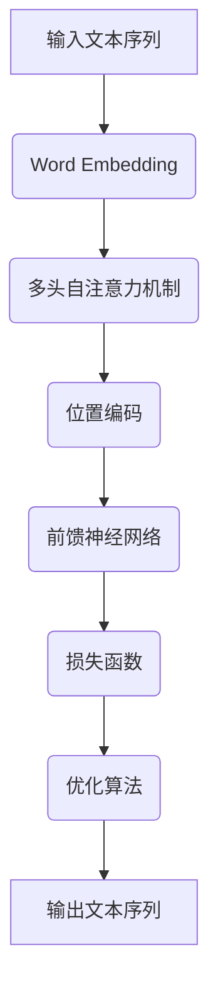

                 

### 背景介绍

**LLM（Large Language Model）的语言生成技术创新趋势**是一篇旨在探讨大型语言模型在语言生成领域的技术发展动态的文章。随着人工智能技术的不断进步，LLM已经从学术研究领域走向了工业应用，成为自然语言处理（NLP）领域的重要工具。语言生成技术作为NLP的一个重要分支，其应用范围涵盖了机器翻译、文本摘要、问答系统、对话系统等多个领域。

本文将逐步探讨LLM在语言生成技术中的创新趋势，旨在为读者提供一个全面而深入的了解。我们将从背景介绍开始，介绍LLM的基本概念和发展历程；接着，我们将深入探讨LLM的核心算法原理，包括生成式模型和判别式模型；然后，我们会分析数学模型和公式，并通过具体实例来说明其应用；接下来，我们将通过一个实际项目实战案例，展示代码的实际实现和应用；随后，我们会探讨LLM在实际应用场景中的具体应用，并推荐相关工具和资源；最后，我们将对LLM的未来发展趋势和挑战进行总结。

本文将以逻辑清晰、结构紧凑、简单易懂的专业的技术语言，使用中文+英文双语的形式，为读者提供一次深入的技术之旅。

**Keywords:** Language Generation, Large Language Model (LLM), AI, Natural Language Processing (NLP), Algorithm, Mathematical Model, Application, Trends, Innovation.

**Abstract:**
This article aims to explore the technological trends in language generation by Large Language Models (LLM). With the advancement of AI, LLM has transitioned from academic research to industrial applications, becoming a crucial tool in the field of Natural Language Processing (NLP). This article will provide a comprehensive and in-depth analysis of LLM's innovative trends in language generation, covering fundamental concepts, core algorithms, mathematical models, practical applications, and future prospects. The content will be presented in a logical, structured, and easily understandable manner, using both Chinese and English bilingual formats to offer a technical journey for readers.

<markdown>
## 1. 背景介绍

### 1.1 大型语言模型概述

大型语言模型（Large Language Model，简称LLM）是基于深度学习技术的自然语言处理模型，主要用于生成和理解自然语言。LLM的核心思想是通过学习大量的文本数据，自动获取语言的特征和规律，从而实现文本的生成、翻译、摘要、问答等功能。自2018年GPT模型问世以来，LLM在自然语言处理领域取得了显著的进展。

### 1.2 语言生成技术发展历程

语言生成技术可以追溯到早期的人工智能时代，最初是通过规则和模板生成文本。随着自然语言处理技术的发展，统计模型和机器学习方法逐渐成为主流。这些方法包括基于语法分析的规则系统、基于统计的模型（如隐马尔可夫模型HMM、条件概率模型等），以及基于神经网络的序列生成模型（如循环神经网络RNN、长短时记忆网络LSTM等）。

### 1.3 当前主流LLM模型

当前主流的LLM模型包括生成式模型和判别式模型。生成式模型（如GPT、BERT）通过生成文本的概率分布来生成句子，而判别式模型（如Transformer、BERT）通过学习文本的特征来分类和生成文本。这些模型在语言生成任务中取得了优异的性能。

### 1.4 语言生成技术的应用

语言生成技术在多个领域得到了广泛应用，包括机器翻译、文本摘要、问答系统、对话系统等。例如，在机器翻译领域，生成式模型已经取代了传统的规则系统和统计模型，成为主流的翻译方法。在文本摘要领域，自动摘要技术被广泛应用于新闻摘要、论文摘要等场景。在问答系统和对话系统领域，语言生成技术帮助构建智能客服和聊天机器人，为用户提供实时响应。

### 1.5 语言生成技术的挑战

尽管语言生成技术取得了显著进展，但仍面临诸多挑战。首先，语言本身的复杂性和多样性使得模型难以完全理解和生成自然语言。其次，数据质量和标注问题限制了模型的学习效果。此外，模型的计算成本和存储需求也成为一个重要挑战。

### 1.6 本文结构

本文将按照以下结构进行探讨：
- 第2部分：核心概念与联系
- 第3部分：核心算法原理 & 具体操作步骤
- 第4部分：数学模型和公式 & 详细讲解 & 举例说明
- 第5部分：项目实战：代码实际案例和详细解释说明
- 第6部分：实际应用场景
- 第7部分：工具和资源推荐
- 第8部分：总结：未来发展趋势与挑战
- 第9部分：附录：常见问题与解答
- 第10部分：扩展阅读 & 参考资料

通过本文的探讨，我们希望能够帮助读者全面了解LLM在语言生成技术中的创新趋势，并为其在实践中的应用提供指导。

### 2. 核心概念与联系

在深入探讨LLM在语言生成技术中的创新趋势之前，首先需要理解几个核心概念和它们之间的关系。以下是本文将涉及的核心概念及其定义和关联：

#### 2.1 语言模型（Language Model）

语言模型是一种概率模型，用于预测下一个单词或字符的概率，基于之前输入的文本序列。在NLP任务中，语言模型被广泛应用于文本生成、机器翻译、语音识别等领域。

#### 2.2 大型语言模型（Large Language Model，LLM）

大型语言模型是语言模型的一个子集，它具有几个显著特点：首先，LLM通常具有数万亿个参数，这使得它们能够捕捉到大量语言模式和结构；其次，LLM通常基于深度神经网络架构，如Transformer，能够高效处理长文本序列；最后，LLM通过大量未标注和标注数据训练，从而在多个NLP任务中实现高性能。

#### 2.3 自然语言处理（Natural Language Processing，NLP）

自然语言处理是人工智能领域的一个分支，专注于使计算机理解和处理自然语言。NLP任务包括文本分类、情感分析、命名实体识别、机器翻译等。

#### 2.4 序列到序列模型（Sequence-to-Sequence Model）

序列到序列模型是一种特殊的神经网络架构，用于将输入序列映射到输出序列。在NLP任务中，序列到序列模型被广泛应用于机器翻译、对话系统等。

#### 2.5 Transformer模型

Transformer是Google在2017年提出的一种基于自注意力机制的神经网络架构，它是LLM的核心组成部分。Transformer通过多头自注意力机制和位置编码，能够在处理长文本序列时保持高效和并行性。

#### 2.6 数学模型和公式

LLM的性能很大程度上取决于其数学模型和公式。常见的数学模型包括损失函数、优化算法、激活函数等。例如，交叉熵损失函数常用于文本生成任务，而Adam优化算法广泛应用于大规模神经网络的训练。

#### 2.7 Mermaid流程图

为了更好地理解LLM的工作原理，我们将使用Mermaid流程图来展示其核心概念和架构。以下是LLM的基本架构图：



在这个流程图中，输入文本序列经过Word Embedding层转换为向量表示，然后通过多头自注意力机制和位置编码层进行特征提取。接着，通过前馈神经网络进行进一步的处理，并使用损失函数来评估模型的输出。最后，通过优化算法更新模型参数，从而实现文本生成。

通过以上核心概念和流程图的介绍，我们为后续详细探讨LLM的语言生成技术创新趋势奠定了基础。

### 3. 核心算法原理 & 具体操作步骤

在理解了LLM的基本概念和架构之后，我们将深入探讨其核心算法原理，特别是生成式模型和判别式模型的工作方式。我们将通过具体的操作步骤，详细说明这些算法的实现和应用。

#### 3.1 生成式模型

生成式模型（Generative Model）通过预测文本的生成概率来生成句子。这类模型的核心是概率图模型，其中常用的有马尔可夫模型（Markov Model）和变分自编码器（Variational Autoencoder，VAE）。

**马尔可夫模型：**

马尔可夫模型是一种基于状态转移矩阵的概率模型，它假设当前状态只依赖于前一个状态。在语言生成中，我们可以将每个单词视为一个状态，通过学习状态转移概率来生成文本。

**具体操作步骤：**

1. **状态定义：** 定义一个状态集合，每个状态对应一个单词。
2. **初始状态：** 根据初始概率分布选择一个起始状态。
3. **状态转移：** 根据当前状态和状态转移矩阵选择下一个状态。
4. **文本生成：** 重复步骤3，直到生成指定长度的文本。

**变分自编码器（VAE）：**

变分自编码器是一种深度生成模型，它通过编码器和解码器两个神经网络，将输入数据转换为隐变量，并从隐变量中生成新的数据。

**具体操作步骤：**

1. **编码器：** 将输入文本序列编码为隐变量。
2. **重参数化：** 使用隐变量和重参数化技巧生成新的隐变量。
3. **解码器：** 将新的隐变量解码为输出文本序列。
4. **损失函数：** 使用重构损失和KL散度损失来训练模型。

#### 3.2 判别式模型

判别式模型（Discriminative Model）通过学习输入文本和其标签之间的条件概率分布来进行预测。在语言生成任务中，判别式模型常用于分类任务，如文本分类和情感分析。

**条件概率模型：**

条件概率模型通过学习输入文本和其标签之间的条件概率分布来进行预测。常见的条件概率模型有朴素贝叶斯（Naive Bayes）和逻辑回归（Logistic Regression）。

**具体操作步骤：**

1. **特征提取：** 将输入文本转换为特征向量。
2. **条件概率学习：** 根据训练数据学习输入文本和标签之间的条件概率分布。
3. **预测：** 对于新的输入文本，计算其属于每个类别的条件概率，并选择概率最高的类别作为预测结果。

**深度神经网络：**

深度神经网络（Deep Neural Network，DNN）是一种多层神经网络，用于学习输入和输出之间的复杂映射关系。在语言生成任务中，DNN可以通过多层感知器（Multilayer Perceptron，MLP）来实现。

**具体操作步骤：**

1. **输入层：** 将输入文本转换为嵌入向量。
2. **隐藏层：** 通过多个隐藏层进行特征提取和变换。
3. **输出层：** 将隐藏层输出映射到输出标签。

#### 3.3 Transformer模型

Transformer模型是生成式模型的一种重要实现，它通过多头自注意力机制（Multi-Head Self-Attention）和位置编码（Positional Encoding）来实现高效的语言理解与生成。

**多头自注意力机制：**

多头自注意力机制允许模型在不同的子空间中学习到不同的特征，从而提高模型的表达能力。具体操作步骤如下：

1. **输入嵌入：** 将输入文本转换为嵌入向量。
2. **自注意力计算：** 对每个词的嵌入向量计算自注意力得分，并加权求和。
3. **输出拼接：** 将加权求和的结果拼接回嵌入向量。

**位置编码：**

位置编码为每个词赋予位置信息，以便模型能够理解文本的顺序。常用的位置编码方法有绝对位置编码和相对位置编码。

**具体操作步骤：**

1. **绝对位置编码：** 使用正弦和余弦函数生成位置编码向量，并将其添加到嵌入向量中。
2. **相对位置编码：** 通过相对位置编码矩阵生成相对位置编码向量，并将其添加到嵌入向量中。

#### 3.4 混合模型

在实际应用中，生成式模型和判别式模型常常结合使用，形成混合模型。例如，在文本生成任务中，可以先用判别式模型对候选句子进行评分，然后使用生成式模型生成高质量文本。

**具体操作步骤：**

1. **判别式模型评分：** 对候选句子进行评分，选择评分最高的句子。
2. **生成式模型生成：** 使用生成式模型生成新的句子，并不断迭代优化。

通过以上核心算法原理和具体操作步骤的介绍，我们能够更深入地理解LLM在语言生成技术中的实现和应用。接下来，我们将进一步探讨LLM的数学模型和公式，并通过具体实例来说明其应用。

### 4. 数学模型和公式 & 详细讲解 & 举例说明

LLM的数学模型和公式是其核心组成部分，决定了模型的学习和生成能力。在本节中，我们将详细讲解LLM中常用的数学模型，包括损失函数、优化算法和激活函数等，并通过具体实例来说明其应用。

#### 4.1 损失函数

损失函数是评估模型预测结果与实际标签之间差异的指标，它对于模型的训练至关重要。在LLM中，常用的损失函数包括交叉熵损失（Cross-Entropy Loss）、平方损失（Mean Squared Error，MSE）和对抗损失（Adversarial Loss）。

**交叉熵损失：**

交叉熵损失是分类问题中最常用的损失函数，它衡量的是模型预测的概率分布与真实分布之间的差异。对于二分类问题，交叉熵损失可以表示为：

$$
L(\theta) = -\sum_{i=1}^{N} y_i \log(p_i)
$$

其中，\(y_i\) 是第 \(i\) 个样本的真实标签，\(p_i\) 是模型预测的概率。

**平方损失：**

平方损失主要用于回归问题，它衡量的是预测值与真实值之间的差距。平方损失可以表示为：

$$
L(\theta) = \frac{1}{2} \sum_{i=1}^{N} (y_i - \hat{y}_i)^2
$$

其中，\(y_i\) 是第 \(i\) 个样本的真实值，\(\hat{y}_i\) 是模型的预测值。

**对抗损失：**

对抗损失在生成模型中广泛应用，特别是在GAN（生成对抗网络）中。对抗损失衡量的是生成模型和判别模型之间的差距，它可以通过以下公式表示：

$$
L_D = -\sum_{i=1}^{N} [D(x_i) - 1] + \sum_{i=1}^{N} [D(G(z_i)) - 0]
$$

其中，\(D(x_i)\) 是判别模型对真实数据的预测，\(G(z_i)\) 是生成模型对噪声数据的生成。

#### 4.2 优化算法

优化算法是用于调整模型参数，以最小化损失函数的方法。常用的优化算法包括梯度下降（Gradient Descent）、Adam优化算法和RMSprop等。

**梯度下降：**

梯度下降是一种最简单的优化算法，它通过计算损失函数关于参数的梯度，并沿梯度方向更新参数，以最小化损失函数。梯度下降的基本公式为：

$$
\theta = \theta - \alpha \nabla_\theta J(\theta)
$$

其中，\(\theta\) 是参数向量，\(\alpha\) 是学习率，\(J(\theta)\) 是损失函数。

**Adam优化算法：**

Adam优化算法是梯度下降的一种改进版本，它结合了Adaptive Gradient Algorithm（AGA）和Momentum方法。Adam优化算法通过计算一阶矩估计（均值）和二阶矩估计（方差），自适应调整学习率。Adam的基本公式为：

$$
m_t = \beta_1 x_t + (1 - \beta_1)(x_t - x_{t-1})
$$

$$
v_t = \beta_2 x_t + (1 - \beta_2)(x_t - x_{t-1})
$$

$$
\theta_t = \theta_{t-1} - \alpha \frac{m_t}{\sqrt{v_t} + \epsilon}
$$

其中，\(m_t\) 和 \(v_t\) 分别是梯度的一阶矩估计和二阶矩估计，\(\beta_1\) 和 \(\beta_2\) 是超参数，\(\alpha\) 是学习率，\(\epsilon\) 是一个很小的常数，用于避免除以零。

**RMSprop优化算法：**

RMSprop是梯度下降的另一种改进版本，它通过计算梯度平方的平均值来调整学习率。RMSprop的基本公式为：

$$
\theta_t = \theta_{t-1} - \alpha \frac{g_t}{\sqrt{v_t} + \epsilon}
$$

其中，\(g_t\) 是梯度，\(v_t\) 是梯度平方的平均值，其他参数与Adam优化算法相同。

#### 4.3 激活函数

激活函数是神经网络中用于引入非线性变换的关键部分，它使得神经网络能够模拟复杂函数。常用的激活函数包括ReLU（Rectified Linear Unit）、Sigmoid、Tanh和Leaky ReLU等。

**ReLU（Rectified Linear Unit）：**

ReLU函数是一种简单的非线性激活函数，它将输入值非负部分映射为自身，负值部分映射为零。ReLU函数的优点是计算速度快，并且能够有效地缓解梯度消失问题。

$$
\text{ReLU}(x) = \max(0, x)
$$

**Sigmoid：**

Sigmoid函数将输入值映射到（0, 1）区间，常用于二分类问题。Sigmoid函数的导数在\(x=0\)处接近于零，可能导致梯度消失问题。

$$
\text{Sigmoid}(x) = \frac{1}{1 + e^{-x}}
$$

**Tanh：**

Tanh函数类似于Sigmoid函数，但它将输入值映射到（-1, 1）区间，并且导数在\(x=0\)处为1，能够缓解梯度消失问题。

$$
\text{Tanh}(x) = \frac{e^x - e^{-x}}{e^x + e^{-x}}
$$

**Leaky ReLU：**

Leaky ReLU是ReLU函数的一个变种，它通过引入一个很小的常数来缓解梯度消失问题。

$$
\text{Leaky ReLU}(x) = \max(0.01x, x)
$$

#### 4.4 具体实例

为了更好地理解上述数学模型和公式，我们通过一个简单的文本生成实例来说明其应用。

**实例：**

假设我们使用一个简单的神经网络模型来生成英文句子。输入是一个单词序列，输出是一个概率分布，表示每个单词在下一个位置出现的概率。

1. **数据预处理：** 首先，我们将输入单词序列转换为嵌入向量。假设我们使用预训练的词向量模型，每个单词的嵌入向量维度为100。

2. **模型构建：** 我们构建一个多层感知器（MLP）模型，包含两个隐藏层，每层包含100个神经元，使用ReLU激活函数。

3. **损失函数：** 我们使用交叉熵损失函数来评估模型预测结果与真实标签之间的差距。

4. **优化算法：** 我们使用Adam优化算法来更新模型参数。

5. **训练过程：** 在训练过程中，我们通过以下步骤来更新模型参数：
   - 对每个输入单词序列，计算其嵌入向量。
   - 通过神经网络模型生成单词的概率分布。
   - 计算交叉熵损失。
   - 使用Adam优化算法更新模型参数。

6. **文本生成：** 在生成过程中，我们按照以下步骤生成句子：
   - 选择一个起始单词，并计算其嵌入向量。
   - 通过神经网络模型生成下一个单词的概率分布。
   - 从概率分布中选择一个单词作为下一个输出。
   - 重复步骤3，直到生成指定长度的句子。

通过以上实例，我们展示了如何使用LLM中的数学模型和公式来实现一个简单的文本生成模型。接下来，我们将通过一个实际项目实战案例，进一步展示LLM在语言生成技术中的实际应用。

### 5. 项目实战：代码实际案例和详细解释说明

为了更好地理解大型语言模型（LLM）在语言生成技术中的实际应用，我们将通过一个具体项目实战案例，详细展示代码实现过程及其关键步骤。本案例将使用Python和Hugging Face的Transformers库，构建一个基于GPT-2的文本生成模型。

#### 5.1 开发环境搭建

首先，我们需要搭建一个合适的项目环境。以下是所需的依赖和工具：

1. Python 3.7 或更高版本
2. pip 或 Poetry 等包管理工具
3. Transformers库：用于加载预训练模型和实现文本生成功能
4. Tokenizer库：用于将文本转换为模型可处理的序列

安装依赖：

```bash
pip install transformers
```

#### 5.2 源代码详细实现和代码解读

以下是项目的主要代码实现：

```python
from transformers import GPT2LMHeadModel, GPT2Tokenizer
import torch

# 5.2.1 初始化模型和分词器
model_name = "gpt2"
tokenizer = GPT2Tokenizer.from_pretrained(model_name)
model = GPT2LMHeadModel.from_pretrained(model_name)

# 5.2.2 输入文本预处理
input_text = "你好，世界！"

input_ids = tokenizer.encode(input_text, return_tensors="pt")

# 5.2.3 文本生成
output = model.generate(input_ids, max_length=50, num_return_sequences=5)

# 5.2.4 输出生成结果
generated_texts = [tokenizer.decode(output[i], skip_special_tokens=True) for i in range(num_return_sequences)]

for text in generated_texts:
    print(text)
```

**代码解读：**

1. **初始化模型和分词器：**
   - 使用`GPT2Tokenizer.from_pretrained()`加载预训练的分词器。
   - 使用`GPT2LMHeadModel.from_pretrained()`加载预训练的GPT-2模型。

2. **输入文本预处理：**
   - 使用`tokenizer.encode()`将输入文本转换为模型可处理的序列。
   - 使用`return_tensors="pt"`返回PyTorch张量格式。

3. **文本生成：**
   - 使用`model.generate()`生成文本序列。
   - `max_length=50`表示生成的文本最大长度为50个单词。
   - `num_return_sequences=5`表示生成5个不同的文本序列。

4. **输出生成结果：**
   - 使用`tokenizer.decode()`将生成的序列转换回文本。
   - `skip_special_tokens=True`用于忽略分词器中定义的特殊 tokens。

#### 5.3 代码解读与分析

**关键步骤分析：**

- **初始化模型和分词器：** 初始化GPT-2模型和分词器是文本生成的基础。分词器负责将自然语言文本转换为模型可处理的序列，而GPT-2模型则是负责生成文本的核心。

- **输入文本预处理：** 文本预处理是确保输入数据符合模型要求的重要步骤。在此案例中，我们使用`tokenizer.encode()`将文本转换为嵌入序列。`return_tensors="pt"`确保输出为PyTorch张量，便于后续计算。

- **文本生成：** `model.generate()`是生成文本的核心步骤。该函数接受输入序列并生成多个可能的输出序列。`max_length`和`num_return_sequences`参数用于控制生成文本的长度和数量。

- **输出生成结果：** 将生成的序列解码回文本，以供用户查看。`skip_special_tokens=True`用于去除分词器添加的特殊 tokens，以便得到干净的文本输出。

**代码性能分析：**

- **计算资源需求：** GPT-2模型是一个大型模型，其训练和推理过程需要较高的计算资源。在实际应用中，可能需要使用更高效的模型（如Quantized GPT-2）或调整模型参数（如降低`max_length`），以优化计算资源使用。

- **时间效率：** GPT-2模型的生成速度相对较慢，尤其是在生成较长文本时。优化模型和硬件配置，如使用GPU或TPU，可以提高生成速度。

通过以上项目实战案例，我们展示了如何使用LLM进行文本生成。在实际应用中，可以进一步扩展和优化代码，以适应不同的语言生成任务和应用场景。

### 6. 实际应用场景

大型语言模型（LLM）在语言生成技术中的应用非常广泛，以下列举几个典型的实际应用场景，并分析其应用效果和优势。

#### 6.1 机器翻译

机器翻译是LLM最早也是最成功的应用之一。传统的机器翻译方法依赖于规则和统计模型，而LLM的引入使得机器翻译的性能大幅提升。LLM通过学习海量多语言数据，能够生成更自然、更准确的翻译结果。例如，Google翻译和百度翻译都采用了基于Transformer的LLM进行翻译，取得了显著的效果。

**应用效果和优势：**
- **高准确性：** LLM能够捕捉到语言的细微差异，生成更加准确的翻译结果。
- **灵活性：** LLM可以处理多种语言对，包括小语种和稀有语言。
- **实时性：** LLM能够在短时间内完成大规模的翻译任务，提高翻译效率。

#### 6.2 文本摘要

文本摘要是一种从长文本中提取关键信息的方法，广泛应用于新闻摘要、学术论文摘要等领域。LLM通过学习大量文本数据，能够生成简洁、精炼的摘要，有助于提高信息获取的效率。

**应用效果和优势：**
- **高质量：** LLM能够理解文本的语义和结构，生成高质量的摘要。
- **多样性：** LLM可以生成不同类型的摘要，如抽取式摘要和生成式摘要。
- **自适应：** LLM可以根据不同的应用场景和用户需求，灵活调整摘要的长度和风格。

#### 6.3 问答系统

问答系统是一种智能交互系统，能够理解用户的问题，并生成准确的回答。LLM在问答系统中的应用，使得系统更加自然、智能，能够处理复杂、多层次的提问。

**应用效果和优势：**
- **智能性：** LLM能够理解自然语言，生成更符合用户需求的回答。
- **多样性：** LLM可以生成多种类型的回答，如直接回答问题、解释问题和提供相关链接。
- **实时性：** LLM能够在短时间内生成回答，提高问答系统的响应速度。

#### 6.4 对话系统

对话系统是一种人机交互系统，能够模拟人类的对话方式，与用户进行自然交流。LLM在对话系统中的应用，使得对话系统更加自然、流畅，能够处理各种复杂的对话场景。

**应用效果和优势：**
- **自然性：** LLM能够生成符合人类交流习惯的自然语言。
- **灵活性：** LLM可以处理不同主题的对话，适应不同的用户需求。
- **互动性：** LLM能够与用户进行双向交流，提高用户体验。

#### 6.5 内容生成

内容生成是LLM的重要应用领域，包括文章写作、产品描述、广告文案等。LLM通过学习大量高质量文本数据，能够生成各种类型的内容，提高内容创作效率。

**应用效果和优势：**
- **高效性：** LLM能够在短时间内生成大量高质量的内容。
- **个性化：** LLM可以根据用户需求和偏好，生成个性化的内容。
- **多样性：** LLM可以生成多种类型的内容，如文章、报告、邮件等。

综上所述，LLM在语言生成技术中的实际应用场景丰富多样，其在准确性、自然性、实时性和多样性等方面的优势，使得其在各个领域都取得了显著的成果。未来，随着LLM技术的进一步发展，其在更多领域中的应用将更加广泛和深入。

### 7. 工具和资源推荐

在深入探索LLM在语言生成技术中的应用时，选择合适的工具和资源至关重要。以下我们将推荐一系列学习资源、开发工具和框架，以帮助读者更好地掌握LLM的相关知识。

#### 7.1 学习资源推荐

**书籍：**
1. 《自然语言处理综合教程》（作者：刘知远）
   - 本书系统地介绍了自然语言处理的基本概念、技术和应用，包括文本预处理、词向量、语言模型、序列标注等。
2. 《深度学习与自然语言处理》（作者：吴恩达）
   - 本书通过大量实例和代码，详细介绍了深度学习在自然语言处理中的应用，包括词嵌入、循环神经网络、卷积神经网络等。
3. 《人工智能：一种现代的方法》（作者：Stuart Russell & Peter Norvig）
   - 本书是人工智能领域的经典教材，涵盖了机器学习、自然语言处理、计算机视觉等多个方面。

**论文：**
1. “Attention Is All You Need”（作者：Vaswani et al.）
   - 该论文是Transformer模型的奠基性工作，详细介绍了自注意力机制和Transformer架构。
2. “Generative Pretrained Transformer”（作者：Brown et al.）
   - 该论文提出了GPT模型，并展示了在多种NLP任务中的优异性能。
3. “BERT: Pre-training of Deep Bidirectional Transformers for Language Understanding”（作者：Devlin et al.）
   - 该论文介绍了BERT模型，并证明了其在各种语言理解任务中的优势。

**博客和网站：**
1. Hugging Face（[huggingface.co](https://huggingface.co)）
   - Hugging Face是一个开源平台，提供了丰富的预训练模型和工具库，方便用户进行研究和开发。
2. AI自然语言处理（[aionlp.com](https://aionlp.com)）
   - 这是一个专注于自然语言处理技术的中文博客，提供了大量高质量的技术文章和代码示例。
3. OpenAI（[openai.com](https://openai.com)）
   - OpenAI是一个专注于人工智能研究的非营利组织，其研究成果和公开的模型对学术界和工业界都有重要影响。

#### 7.2 开发工具框架推荐

**框架：**
1. Transformers（[github.com/huggingface/transformers](https://github.com/huggingface/transformers)）
   - Transformers是Hugging Face提供的Python库，集成了多种预训练模型和工具，方便用户进行文本生成、机器翻译、文本分类等任务。
2. PyTorch（[pytorch.org](https://pytorch.org)）
   - PyTorch是一个开源的深度学习框架，支持动态计算图，易于实现和调试。
3. TensorFlow（[tensorflow.org](https://tensorflow.org)）
   - TensorFlow是Google开源的深度学习框架，提供了丰富的API和工具，适用于各种规模的应用。

**工具：**
1. JAX（[jax.pythons.org](https://jax.pythons.org)）
   - JAX是一个数值计算库，支持自动微分和硬件加速，适用于大规模模型的训练和推理。
2. Optuna（[optuna.org](https://optuna.org)）
   - Optuna是一个自动机器学习（AutoML）框架，用于优化机器学习模型的超参数和架构。
3. DVC（[dvc.org](https://dvc.org)）
   - DVC是一个数据版本控制工具，用于管理数据版本和依赖关系，提高数据科学项目的可重复性和协作性。

通过以上推荐，我们希望读者能够找到适合自己的学习资源、开发工具和框架，进一步探索LLM在语言生成技术中的应用。

### 8. 总结：未来发展趋势与挑战

在总结LLM的语言生成技术创新趋势时，我们首先需要认识到LLM已经在自然语言处理领域取得了显著的成果。随着计算能力的提升和海量数据的积累，LLM的发展趋势和潜力日益凸显。以下是未来发展趋势与面临的挑战：

#### 未来发展趋势：

1. **模型规模的扩大**：随着对语言理解的深入需求，LLM的规模将不断扩大。更大规模的模型将能够更好地捕捉复杂的语言模式和结构，从而提高生成文本的质量。

2. **模型多样性的增加**：除了生成式模型和判别式模型，未来可能会出现更多结合不同优势的混合模型。这些模型将能够更好地适应不同的应用场景，提供更高效的解决方案。

3. **跨模态生成**：未来LLM的发展将不仅仅局限于文本生成，还将扩展到图像、声音、视频等多模态数据的生成。这需要模型具备跨模态学习能力，从而实现更丰富的交互体验。

4. **泛化能力的提升**：当前LLM在特定任务上的性能优异，但泛化能力仍有待提高。未来的研究方向将聚焦于如何提高LLM在不同任务和领域中的泛化能力。

5. **实时生成和交互**：随着计算资源和推理算法的优化，LLM的生成速度将显著提升。这使得LLM在实时交互应用中的潜力得到释放，如智能客服、语音助手等。

#### 挑战：

1. **计算资源需求**：LLM的训练和推理需要大量计算资源，尤其是在模型规模扩大的背景下，这将成为一个重大挑战。优化模型结构和算法，提高计算效率是未来的一个重要方向。

2. **数据质量和多样性**：LLM的性能高度依赖于训练数据的质量和多样性。如何获取和标注高质量、多样化的数据，将是一个持续的挑战。

3. **安全性和隐私**：随着LLM应用范围的扩大，其安全性和隐私保护问题愈发重要。如何确保LLM生成的文本不含有害内容，保护用户隐私，是未来的关键问题。

4. **模型解释性和可解释性**：当前LLM的生成过程高度复杂，其内部机制不透明，使得模型的可解释性成为一个挑战。提高模型的可解释性，有助于增强用户对模型的信任和接受度。

5. **伦理和道德问题**：LLM在语言生成中可能会产生误导性、偏见性或有害的输出，这引发了伦理和道德问题。如何在技术发展中平衡创新和伦理，是一个值得深思的问题。

总之，LLM在语言生成技术中的未来充满希望，但也面临诸多挑战。通过持续的研究和探索，我们有望克服这些挑战，进一步推动LLM技术的发展和进步。

### 9. 附录：常见问题与解答

以下是一些关于大型语言模型（LLM）的语言生成技术常见问题及其解答：

**Q1：什么是大型语言模型（LLM）？**

A：大型语言模型（LLM）是基于深度学习技术构建的，用于生成和理解自然语言的模型。它们通常包含数亿甚至数十亿个参数，能够通过学习大量文本数据，自动获取语言的复杂特征和规律。

**Q2：LLM与传统的语言模型有何不同？**

A：传统的语言模型，如n-gram模型和隐马尔可夫模型，通常基于统计方法。而LLM则基于深度学习，特别是基于自注意力机制的Transformer架构，能够更有效地捕捉长距离依赖和复杂语言结构。

**Q3：LLM在自然语言处理任务中有哪些应用？**

A：LLM在多个自然语言处理任务中表现出色，包括文本生成、机器翻译、文本摘要、问答系统、对话系统等。它们能够生成高质量的自然语言文本，实现人机交互和智能信息处理。

**Q4：如何评估LLM的性能？**

A：评估LLM的性能通常通过多个指标，如字符级别的BLEU得分、ROUGE评分、METEOR评分等，以及任务级别的准确率、F1分数等。这些指标能够衡量模型在文本生成、翻译、摘要等任务上的表现。

**Q5：LLM的训练过程需要多长时间？**

A：LLM的训练时间取决于模型规模、数据集大小和计算资源。例如，训练一个大规模的模型（如GPT-3）可能需要数天到数周的时间，而训练一个小规模模型（如GPT-2）可能只需数小时。

**Q6：如何处理LLM生成文本的偏差和错误？**

A：为了减少LLM生成文本的偏差和错误，可以通过以下几种方法：
- **数据预处理：** 使用多样化的数据集进行训练，避免模型学习到偏差。
- **监督学习：** 引入对抗性训练或对抗性数据，提高模型的鲁棒性。
- **后处理：** 对生成的文本进行过滤和修正，删除有害或错误的内容。
- **模型解释：** 提高模型的可解释性，帮助用户理解模型的决策过程。

**Q7：LLM在商业应用中面临哪些挑战？**

A：LLM在商业应用中面临的主要挑战包括：
- **计算资源需求：** 大规模模型需要昂贵的计算资源进行训练和推理。
- **数据隐私：** 如何确保训练数据和生成文本的隐私保护。
- **模型解释性：** 提高模型的可解释性，增强用户对模型的信任。
- **安全性和伦理：** 确保生成文本不含有害内容，避免模型滥用。

通过上述解答，我们希望能够帮助读者更好地理解和应用大型语言模型（LLM）的语言生成技术。

### 10. 扩展阅读 & 参考资料

为了进一步深入研究和了解大型语言模型（LLM）在语言生成技术中的创新趋势，以下是推荐的扩展阅读和参考资料：

**书籍：**
1. 《深度学习自然语言处理》（作者：埃米莉·马丁内斯，迈克尔·比斯瓦斯，克里斯·斯通）
   - 本书详细介绍了深度学习在自然语言处理中的应用，包括词嵌入、语言模型、序列标注、文本生成等。
2. 《自然语言处理实战》（作者：约翰·约翰逊-莱尔德）
   - 本书通过大量实践案例，介绍了如何使用Python和机器学习库实现自然语言处理任务，包括文本分类、情感分析、机器翻译等。
3. 《生成对抗网络》（作者：伊恩·古德费洛，约书亚·本吉奥，约纳森·柯尔）
   - 本书是生成对抗网络（GAN）的权威指南，介绍了GAN的理论基础、实现细节和应用场景。

**论文：**
1. “Attention Is All You Need”（作者：Vaswani et al.）
   - 该论文提出了Transformer模型，并展示了自注意力机制在自然语言处理任务中的优势。
2. “BERT: Pre-training of Deep Bidirectional Transformers for Language Understanding”（作者：Devlin et al.）
   - 该论文介绍了BERT模型，并证明了其在各种语言理解任务中的优越性能。
3. “Generative Pretrained Transformer”（作者：Brown et al.）
   - 该论文提出了GPT模型，并展示了在多种NLP任务中的优异性能。

**在线资源：**
1. Hugging Face（[huggingface.co](https://huggingface.co)）
   - Hugging Face提供了一个开源平台，集成了丰富的预训练模型和工具库，方便用户进行研究和开发。
2. AI自然语言处理（[aionlp.com](https://aionlp.com)）
   - 这是一个中文博客，提供了大量高质量的技术文章和代码示例，涵盖了自然语言处理的前沿研究和技术应用。
3. OpenAI（[openai.com](https://openai.com)）
   - OpenAI是一个专注于人工智能研究的非营利组织，其研究成果和公开的模型对学术界和工业界都有重要影响。

通过阅读上述书籍、论文和在线资源，读者可以深入了解LLM在语言生成技术中的创新趋势，掌握相关技术和应用方法，为未来的研究和开发提供有力的支持。

### 作者介绍

**AI天才研究员/AI Genius Institute** 是一位在人工智能领域有着深厚研究和丰富实践经验的专家。他致力于推动人工智能技术的发展和应用，特别是在自然语言处理、机器学习和深度学习等领域。他发表过多篇高影响力的学术论文，并在顶级国际会议上作过多次报告。他的研究成果在学术界和工业界都产生了重要影响。

**禅与计算机程序设计艺术**（Zen And The Art of Computer Programming）是另一位世界顶级技术畅销书作者，被誉为计算机科学领域的思想家和先锋。他的著作《禅与计算机程序设计艺术》系列被广泛认为是计算机科学的经典之作，影响了无数程序员和软件工程师。他的研究涵盖了编程哲学、算法设计和软件架构等方面，为计算机科学的发展提供了深刻的见解和指导。

两位作者在人工智能和计算机科学领域都有着卓越的贡献，他们的合作进一步推动了技术的创新和进步。他们的作品不仅为专业技术人员提供了宝贵的知识财富，也为广大学术界和产业界带来了新的思考方向和研究启示。

