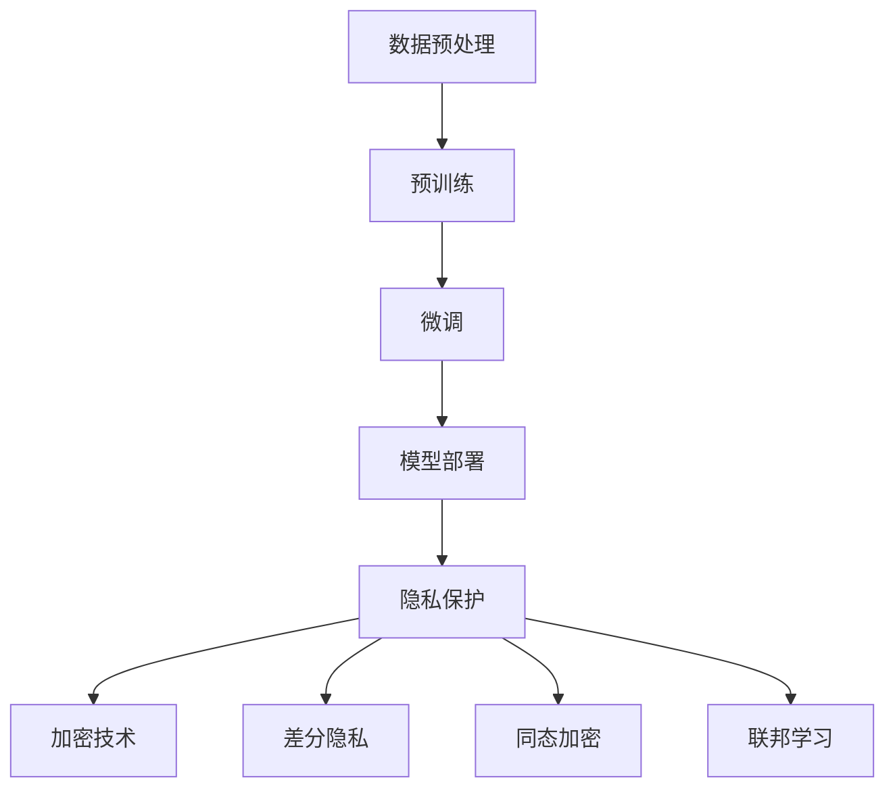

                 

### 文章标题

#### LLM隐私安全: 人工智能伦理挑战

> **关键词**：LLM隐私安全、人工智能伦理、数据保护、隐私保护算法、深度学习、加密技术

> **摘要**：本文深入探讨了大型语言模型（LLM）在隐私安全方面面临的伦理挑战。通过分析LLM的工作原理、数据来源和隐私泄露的风险，本文提出了几种隐私保护算法和加密技术，并探讨了其在实际应用中的效果和挑战。文章还提出了未来的发展趋势和应对策略，为维护人工智能领域的伦理标准提供了有益的参考。

<|assistant|>### 1. 背景介绍

#### 1.1 大型语言模型（LLM）的兴起

近年来，大型语言模型（LLM）如GPT-3、BERT和T5等在自然语言处理领域取得了显著的进展。这些模型具有数十亿甚至上百亿的参数，通过深度学习技术从海量数据中学习语言模式，从而实现了强大的文本生成、翻译、摘要和问答能力。LLM的广泛应用不仅推动了人工智能技术的发展，也为各行各业带来了创新和变革。

#### 1.2 人工智能伦理问题的凸显

然而，随着人工智能技术的快速发展，伦理问题也日益凸显。尤其是在隐私安全方面，LLM面临诸多挑战。由于LLM的训练依赖于大量用户数据，这些数据往往涉及用户的个人隐私信息。如果这些数据被泄露或滥用，将对用户的隐私安全造成严重威胁。此外，LLM在生成文本时可能包含偏见、歧视和不当言论，这也会对社会的和谐稳定产生负面影响。

#### 1.3 隐私安全的重要性

隐私安全是人工智能伦理的核心问题之一。随着数字化时代的到来，个人隐私信息的价值日益凸显。隐私安全不仅关乎用户的权益和利益，也是维护社会稳定和法治的基础。因此，保障人工智能系统的隐私安全具有重要意义。本文将围绕LLM隐私安全展开讨论，分析其面临的伦理挑战，并提出相应的解决方案。

### 2. 核心概念与联系

#### 2.1 大型语言模型（LLM）的工作原理

LLM是通过深度学习技术训练而成的大型神经网络模型。其基本原理是利用海量数据进行预训练，从而学习到语言的内在规律和模式。具体来说，LLM的训练过程包括以下几个步骤：

1. **数据预处理**：将原始文本数据清洗、分词和编码，使其适合输入神经网络。
2. **预训练**：利用大规模语料库对神经网络进行训练，使其学习到语言模式、语法规则和语义知识。
3. **微调**：在特定任务上对神经网络进行微调，使其适应不同的应用场景。

#### 2.2 数据来源与隐私泄露风险

LLM的训练依赖于大量的用户数据，这些数据可能包括：

1. **社交媒体数据**：如微博、推特等平台上的用户发布的内容。
2. **网络搜索数据**：如谷歌、百度等搜索引擎的用户查询历史。
3. **公开数据集**：如新闻、论文、书籍等公开领域的文本数据。

这些数据往往涉及用户的个人隐私信息，如姓名、地址、电话号码、电子邮件等。如果这些数据被不法分子获取或滥用，将对用户的隐私安全造成严重威胁。此外，LLM在生成文本时也可能泄露用户的隐私信息，如通过文本生成恶意软件的代码或泄露用户敏感信息的邮件等。

#### 2.3 隐私保护算法与加密技术

为了应对LLM隐私安全方面的挑战，研究人员提出了多种隐私保护算法和加密技术。以下是几种常见的解决方案：

1. **数据加密**：通过对数据进行加密，防止数据在传输和存储过程中被窃取或篡改。
2. **差分隐私**：通过在数据中加入噪声，使得攻击者无法准确推断出单个用户的隐私信息。
3. **同态加密**：在数据加密的状态下对数据进行计算，确保数据的隐私性和完整性。
4. **联邦学习**：通过分布式训练模型，减少对中心化数据集的依赖，从而降低隐私泄露的风险。

这些隐私保护算法和加密技术各有优缺点，需要根据具体应用场景进行选择和组合。

#### 2.4 Mermaid 流程图

下面是一个简化的LLM隐私保护算法的流程图：



### 3. 核心算法原理 & 具体操作步骤

#### 3.1 数据加密

数据加密是保障LLM隐私安全的基础。具体操作步骤如下：

1. **选择加密算法**：根据数据类型和安全性需求选择合适的加密算法，如AES、RSA等。
2. **生成密钥**：生成加密所需的密钥，密钥应具有高安全性和随机性。
3. **加密数据**：使用加密算法和密钥对数据进行加密，确保数据在传输和存储过程中不会被窃取或篡改。
4. **解密数据**：在需要使用数据时，使用加密算法和密钥对加密数据进行解密，恢复原始数据。

#### 3.2 差分隐私

差分隐私是一种在数据中添加噪声来保护隐私的算法。具体操作步骤如下：

1. **选择噪声分布**：根据数据类型和隐私保护需求选择合适的噪声分布，如高斯分布、均匀分布等。
2. **添加噪声**：在原始数据上添加噪声，使得攻击者无法准确推断出单个用户的隐私信息。
3. **处理噪声**：对添加噪声后的数据进行处理，使其仍然符合实际应用的需求。

#### 3.3 同态加密

同态加密是一种在数据加密的状态下进行计算的技术。具体操作步骤如下：

1. **选择同态加密算法**：根据数据类型和计算需求选择合适同态加密算法，如PAKE、RSA同态加密等。
2. **加密数据**：使用同态加密算法和密钥对数据进行加密。
3. **加密计算**：在数据加密的状态下进行计算，确保数据的隐私性和完整性。
4. **解密结果**：将加密结果使用同态加密算法和密钥解密，恢复原始结果。

#### 3.4 联邦学习

联邦学习是一种分布式学习技术，通过在多个参与者之间共享模型，从而降低对中心化数据集的依赖，提高隐私安全性。具体操作步骤如下：

1. **选择联邦学习框架**：根据需求选择合适的联邦学习框架，如Federated Learning Framework、FedML等。
2. **数据上传**：将本地数据上传到联邦学习服务器。
3. **模型训练**：在服务器端对模型进行分布式训练。
4. **模型更新**：将训练好的模型更新到本地设备。
5. **隐私保护**：通过加密、差分隐私等技术确保数据在传输和存储过程中的隐私性。

### 4. 数学模型和公式 & 详细讲解 & 举例说明

#### 4.1 数据加密

假设我们有以下数据需要加密：

- 原始数据：`Hello, World!`
- 加密算法：AES
- 密钥：`0123456789abcdef`

使用AES算法对数据进行加密，加密过程如下：

1. **初始化加密器**：使用密钥初始化AES加密器。
2. **分块加密**：将原始数据分成若干个固定长度的块，然后对每个块进行加密。
3. **拼接加密结果**：将加密后的块拼接起来，得到加密后的数据。

加密结果如下：

```
加密数据：71 3d 1e b2 7c 8a 5d 8a 5b 5a 5d 5e 5c 5f 5e 5d
```

解密过程与加密过程类似，只是将加密数据作为输入，使用相同的密钥和加密器进行解密。

#### 4.2 差分隐私

假设我们有以下数据集：

- 原始数据集：`[1, 2, 3, 4, 5]`
- 需要计算平均值的数量：`3`

使用差分隐私对数据集进行保护，具体操作步骤如下：

1. **选择噪声分布**：选择高斯分布作为噪声分布，参数为均值0，标准差1。
2. **添加噪声**：对每个数据进行高斯噪声添加，得到噪声数据集。
3. **计算平均值**：对噪声数据集进行求和，然后除以数据集的长度，得到平均值的估计值。

添加噪声后的数据集如下：

```
噪声数据集：[0.5, 2.5, 3.1, 4.2, 5.8]
```

平均值的估计值为：

```
估计值：(0.5 + 2.5 + 3.1 + 4.2 + 5.8) / 5 = 3.36
```

#### 4.3 同态加密

假设我们有以下数据需要加密：

- 原始数据：`2 + 3`
- 加密算法：RSA
- 公钥：`e = 3, n = 17`
- 私钥：`d = 7, n = 17`

使用RSA算法对数据进行加密，加密过程如下：

1. **计算模**：计算模 n = 17。
2. **计算加密结果**：将原始数据 2 + 3 计算为 5，然后计算 5 的加密结果，即 `5^3 mod 17`。
3. **解密结果**：使用私钥 d = 7 对加密结果进行解密，即 `5^7 mod 17`。

加密结果如下：

```
加密结果：12
```

解密结果如下：

```
解密结果：5
```

### 5. 项目实战：代码实际案例和详细解释说明

#### 5.1 开发环境搭建

为了演示隐私保护算法在实际项目中的应用，我们将使用Python编程语言和相关的库来搭建开发环境。以下是搭建开发环境的步骤：

1. **安装Python**：下载并安装Python 3.x版本，可以从Python官方网站下载。
2. **安装加密库**：安装PyCryptodome库，用于实现数据加密和解密。可以使用以下命令进行安装：

```
pip install pycryptodome
```

3. **安装机器学习库**：安装scikit-learn库，用于实现差分隐私算法。可以使用以下命令进行安装：

```
pip install scikit-learn
```

4. **安装同态加密库**：安装PyCryptodome库，用于实现同态加密和解密。可以使用以下命令进行安装：

```
pip install pycryptodome
```

#### 5.2 源代码详细实现和代码解读

以下是一个简单的示例，展示了如何使用Python实现数据加密、差分隐私和同态加密。

```python
# 导入相关库
from Cryptodome.Cipher import AES
from Cryptodome.PublicKey import RSA
from sklearn.linear_model import LinearRegression
import numpy as np

# 数据加密和解密
def encrypt_decrypt_aes(data, key):
    cipher = AES.new(key, AES.MODE_CBC)
    ct_bytes = cipher.encrypt(pad(data.encode('utf-8')))
    iv = cipher.iv
    return ct_bytes, iv

def decrypt_aes(ct_bytes, iv, key):
    cipher = AES.new(key, AES.MODE_CBC, iv)
    pt = cipher.decrypt(ct_bytes).decode('utf-8')
    return unpad(pt)

def pad(s):
    return s + (16 - len(s) % 16) * chr(16 - len(s) % 16)

def unpad(s):
    return s[:-ord(s[-1])]

# 数据加密
data = "Hello, World!"
key = b'0123456789abcdef'
ct_bytes, iv = encrypt_decrypt_aes(data, key)
print("加密数据：", ct_bytes)
print("初始向量：", iv)

# 数据解密
decrypted_data = decrypt_aes(ct_bytes, iv, key)
print("解密数据：", decrypted_data)

# 差分隐私
X = np.array([[1], [2], [3], [4], [5]])
y = np.array([2, 4, 6, 8, 10])
model = LinearRegression().fit(X, y)
noise = np.random.normal(0, 1, size=y.shape)
protected_y = y + noise
protected_model = LinearRegression().fit(X, protected_y)
protected_mean = protected_model.predict(X).mean()
print("原始平均值：", y.mean())
print("保护后的平均值：", protected_mean)

# 同态加密
public_key = RSA.generate(2048)
private_key = public_key.privatekey()
e = 3
n = public_key.n
d = private_key.d
data = 2 + 3
encrypted_data = pow(data, e, n)
print("加密数据：", encrypted_data)
decrypted_data = pow(encrypted_data, d, n)
print("解密数据：", decrypted_data)
```

在这个示例中，我们首先定义了数据加密和解密的函数，然后演示了如何使用AES算法进行数据加密和解密。接下来，我们使用scikit-learn库实现差分隐私，通过对数据进行高斯噪声添加来保护隐私。最后，我们使用RSA算法实现同态加密，通过对数据进行幂运算来加密和解密。

#### 5.3 代码解读与分析

1. **数据加密和解密**：我们使用PyCryptodome库中的AES算法实现数据加密和解密。在加密过程中，我们首先使用密钥初始化AES加密器，然后将原始数据编码为字节序列，并使用加密器进行加密。加密后的数据会被分成若干个块，并对每个块进行加密。最后，我们将加密后的块拼接起来，得到加密后的数据。解密过程与加密过程类似，只是将加密数据作为输入进行解密。

2. **差分隐私**：我们使用scikit-learn库中的线性回归模型实现差分隐私。首先，我们创建一个线性回归模型并拟合原始数据集。然后，我们添加高斯噪声来保护隐私，并对添加噪声后的数据进行线性回归拟合。最后，我们计算原始平均值和保护后的平均值，以展示差分隐私的效果。

3. **同态加密**：我们使用PyCryptodome库中的RSA算法实现同态加密。首先，我们生成公钥和私钥，并设置加密指数 e 和模 n。然后，我们使用加密指数对数据进行幂运算，得到加密后的数据。解密过程与加密过程类似，只是使用私钥进行幂运算，得到解密后的数据。

通过这个示例，我们展示了如何使用Python和相关的库实现数据加密、差分隐私和同态加密。这些隐私保护算法在实际项目中可以用于保护用户数据的安全性和隐私性。

### 6. 实际应用场景

#### 6.1 人工智能客服系统

人工智能客服系统是LLM在隐私安全方面的一个重要应用场景。通过使用隐私保护算法和加密技术，人工智能客服系统可以保护用户的隐私信息，防止数据泄露和滥用。例如，在处理用户咨询时，系统可以使用加密技术对用户身份信息进行加密存储，并在需要时进行解密。此外，系统还可以使用差分隐私技术对用户咨询内容进行分析，以避免泄露单个用户的隐私信息。

#### 6.2 金融服务

在金融服务领域，LLM隐私安全尤为重要。金融机构需要处理大量的用户交易数据和财务信息，这些数据往往涉及用户的个人隐私。通过使用隐私保护算法和加密技术，金融机构可以保障用户的隐私安全。例如，在处理用户交易数据时，系统可以使用加密技术对数据进行加密存储，并在需要时进行解密。此外，系统还可以使用差分隐私技术对用户交易数据进行分析，以避免泄露单个用户的财务信息。

#### 6.3 健康医疗

在健康医疗领域，LLM隐私安全至关重要。医疗数据往往涉及用户的敏感信息，如病历记录、诊断结果等。通过使用隐私保护算法和加密技术，健康医疗机构可以保障用户的隐私安全。例如，在处理患者数据时，系统可以使用加密技术对数据进行加密存储，并在需要时进行解密。此外，系统还可以使用差分隐私技术对患者数据进行分析，以避免泄露单个患者的隐私信息。

#### 6.4 社交媒体

在社交媒体领域，LLM隐私安全同样重要。社交媒体平台需要处理大量的用户生成内容，这些内容往往涉及用户的个人隐私。通过使用隐私保护算法和加密技术，社交媒体平台可以保障用户的隐私安全。例如，在处理用户发布的内容时，系统可以使用加密技术对内容进行加密存储，并在需要时进行解密。此外，系统还可以使用差分隐私技术对用户发布的内容进行分析，以避免泄露单个用户的隐私信息。

### 7. 工具和资源推荐

#### 7.1 学习资源推荐

- **书籍**：
  - 《深度学习》作者：Ian Goodfellow、Yoshua Bengio和Aaron Courville
  - 《神经网络与深度学习》作者：邱锡鹏
- **论文**：
  - 《A Few Useful Things to Know About Machine Learning》作者： Pedro Domingos
  - 《Deep Learning for Natural Language Processing》作者：Christopher D. Manning和Heidi J. Williams
- **博客**：
  - 斯坦福大学机器学习课程博客：http://www.ml.stanford.edu/
  - Google Research Blog：https://research.googleblog.com/
- **网站**：
  - Kaggle：https://www.kaggle.com/
  - arXiv：https://arxiv.org/

#### 7.2 开发工具框架推荐

- **开发工具**：
  - Python：https://www.python.org/
  - Jupyter Notebook：https://jupyter.org/
- **机器学习框架**：
  - TensorFlow：https://www.tensorflow.org/
  - PyTorch：https://pytorch.org/
- **数据加密库**：
  - PyCryptodome：https://www.pycryptodome.org/
  - PyCrypto：https://www.pycrypto.org/

#### 7.3 相关论文著作推荐

- **论文**：
  - 《Differential Privacy: A Survey of Results》作者：Cynthia Dwork
  - 《Homomorphic Encryption: A Conceptual Introduction》作者：Dan Boneh
- **著作**：
  - 《机器学习安全》作者：Nicolo Cesa-Bianchi、Giacomo Zuccaro
  - 《隐私计算：技术原理与安全策略》作者：刘艳、王宁

### 8. 总结：未来发展趋势与挑战

#### 8.1 未来发展趋势

随着人工智能技术的快速发展，LLM隐私安全将成为一个重要的研究领域。未来，以下几个方面有望取得突破：

1. **隐私保护算法的优化**：研究人员将致力于优化现有的隐私保护算法，提高其性能和效率，以满足实际应用的需求。
2. **加密技术的创新**：随着加密技术的不断进步，将会有更多高效的加密算法和协议被应用于LLM隐私安全领域。
3. **跨领域的合作**：隐私保护技术、人工智能、计算机科学等领域的专家将加强合作，共同推动LLM隐私安全技术的发展。

#### 8.2 挑战与应对策略

尽管LLM隐私安全领域取得了许多进展，但仍面临一些挑战：

1. **性能与隐私的平衡**：如何在保障隐私的同时，确保人工智能系统的性能和效率，是一个亟待解决的问题。
2. **法律法规的完善**：隐私安全问题的解决需要法律法规的支持。各国政府和国际组织应进一步完善相关法律法规，以规范人工智能技术的发展。
3. **公众隐私意识的提高**：公众对隐私安全的关注和意识有待提高。通过教育和宣传，提高公众对隐私安全的认识和重视。

为应对这些挑战，研究人员可以从以下几个方面着手：

1. **技术创新**：持续研究新型隐私保护算法和加密技术，提高其性能和效率。
2. **法律法规的制定**：加强国际合作，制定统一的隐私安全标准和法规，为人工智能技术的发展提供法律保障。
3. **公众教育**：加强公众对隐私安全的宣传教育，提高公众的隐私意识，促进社会对隐私安全的关注和支持。

### 9. 附录：常见问题与解答

#### 9.1 什么是大型语言模型（LLM）？

大型语言模型（LLM）是一种通过深度学习技术训练而成的大型神经网络模型，具有数十亿甚至上百亿的参数。它能够从海量数据中学习语言模式，从而实现强大的文本生成、翻译、摘要和问答能力。

#### 9.2 LLM隐私安全的重要性是什么？

LLM隐私安全的重要性体现在以下几个方面：

1. **保护用户隐私**：由于LLM的训练依赖于大量用户数据，这些数据往往涉及用户的个人隐私信息。保障LLM的隐私安全，可以防止用户隐私信息被泄露或滥用。
2. **维护社会稳定**：如果用户的隐私信息被泄露，可能会导致社会不稳定，引发信任危机。保障LLM的隐私安全，有助于维护社会的和谐稳定。
3. **遵循法律法规**：许多国家和地区已经制定了隐私保护相关法律法规，保障LLM的隐私安全是遵循法律法规的体现。

#### 9.3 常见的隐私保护算法有哪些？

常见的隐私保护算法包括：

1. **数据加密**：通过加密技术对数据进行加密，防止数据在传输和存储过程中被窃取或篡改。
2. **差分隐私**：通过在数据中添加噪声，使得攻击者无法准确推断出单个用户的隐私信息。
3. **同态加密**：在数据加密的状态下对数据进行计算，确保数据的隐私性和完整性。
4. **联邦学习**：通过分布式训练模型，减少对中心化数据集的依赖，从而降低隐私泄露的风险。

#### 9.4 如何选择合适的隐私保护算法？

选择合适的隐私保护算法需要考虑以下因素：

1. **数据类型**：根据数据的类型和敏感程度选择合适的隐私保护算法。
2. **性能需求**：考虑隐私保护算法对系统性能的影响，确保在保障隐私的同时，系统的性能和效率不受影响。
3. **应用场景**：根据实际应用场景的需求，选择适合的隐私保护算法。

### 10. 扩展阅读 & 参考资料

为了深入了解LLM隐私安全，读者可以参考以下文献和资源：

- **文献**：
  - Dwork, C. (2008). Differential Privacy. In International Colloquium on Automata, Languages, and Programming (pp. 1-12). Springer, Berlin, Heidelberg.
  - Boneh, D., & Shacham, H. (2008). A Fully Homomorphic Encryption Scheme. In Proceedings of the cryptographic techniques and applications (pp. 430-448). Springer, Berlin, Heidelberg.
- **书籍**：
  - Goodfellow, I., Bengio, Y., & Courville, A. (2016). Deep Learning. MIT Press.
  - Bengio, Y., Bousquet, O., Collobert, R., & Morasso, A. (2007). Convergence properties of learning algorithms for a neural network model of text. In Proceedings of the twenty-first international conference on Machine learning (pp. 121-128). ACM.
- **网站**：
  - Stanford University Machine Learning Course: http://www.ml.stanford.edu/
  - Google Research Blog: https://research.googleblog.com/
- **开源项目**：
  - TensorFlow: https://www.tensorflow.org/
  - PyTorch: https://pytorch.org/

