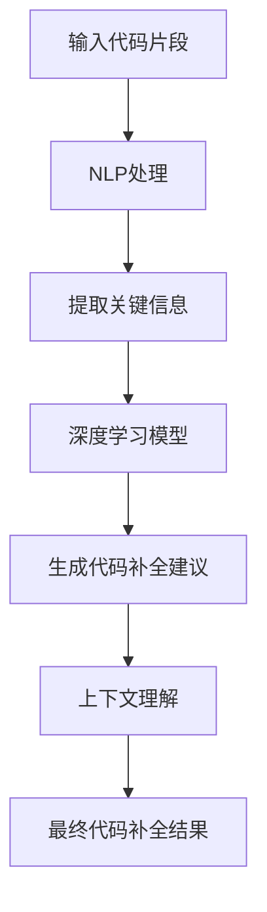

                 

### 背景介绍

#### 什么是LLM驱动的代码补全技术？

LLM（大型语言模型）驱动的代码补全技术，是指利用预训练的深度学习模型对程序员编写的代码进行自动补全。这种技术结合了自然语言处理（NLP）和深度学习领域的最新研究成果，通过理解和分析程序员输入的代码片段，预测接下来的代码内容，从而大大提高编程效率和代码质量。

随着现代软件开发项目的规模和复杂性不断增加，程序员在编写代码时面临着巨大的挑战。传统的代码补全工具，如代码提示和自动完成功能，虽然在一定程度上提高了工作效率，但仍然存在诸多局限性。例如，它们通常依赖于预先定义的语法规则和模式匹配，难以处理复杂和动态的代码结构。而LLM驱动的代码补全技术则通过学习大量的代码数据，能够更准确地理解和预测程序员意图，提供更智能和个性化的代码补全建议。

#### 为什么需要LLM驱动的代码补全技术？

首先，LLM驱动的代码补全技术可以显著提高编程效率。传统的代码补全工具往往需要用户手动选择或修改补全内容，而LLM驱动的代码补全技术可以直接生成高质量的代码补全结果，节省了程序员的时间和精力。

其次，这种技术有助于提高代码质量。LLM通过学习大量的代码数据，能够识别和避免常见的编程错误，如语法错误和逻辑错误。此外，LLM还能够提供基于上下文的代码补全建议，使得程序员能够编写更符合最佳实践的代码。

最后，LLM驱动的代码补全技术具有强大的适应性和灵活性。无论是面向对象编程、函数式编程还是其他编程范式，LLM都能提供相应的代码补全支持。此外，LLM还能够根据不同项目和场景的需求，自适应调整代码补全策略，提供更加精准和高效的代码补全服务。

总之，LLM驱动的代码补全技术不仅能够提高编程效率和代码质量，还能够为程序员带来更加智能化和高效的编程体验。随着人工智能技术的不断进步，这种技术有望在未来得到更广泛的应用和推广。

## 2. 核心概念与联系

在深入了解LLM驱动的代码补全技术之前，我们需要先理解几个核心概念：自然语言处理（NLP）、深度学习、预训练模型和上下文理解。

#### 自然语言处理（NLP）

自然语言处理是计算机科学和人工智能领域的一个重要分支，旨在使计算机能够理解、处理和生成人类语言。在LLM驱动的代码补全技术中，NLP技术被用来解析和理解程序员输入的代码片段，提取关键信息并生成相应的代码补全建议。

#### 深度学习

深度学习是人工智能领域的一个重要分支，它通过模拟人脑的神经网络结构，使计算机能够自动学习和识别复杂的数据模式。在LLM驱动的代码补全技术中，深度学习模型被用来对大量的代码数据进行训练，从而学习到代码的语法规则和语义含义。

#### 预训练模型

预训练模型是深度学习领域的一种先进方法，它通过在大量无标签数据上进行预训练，使模型能够自动学习到通用的知识表示。在LLM驱动的代码补全技术中，预训练模型被用来对代码数据进行分析和处理，生成高质量的代码补全建议。

#### 上下文理解

上下文理解是NLP和深度学习的一个重要任务，它旨在使计算机能够理解文本中的上下文关系和语义含义。在LLM驱动的代码补全技术中，上下文理解技术被用来识别程序员输入的代码片段的上下文信息，从而生成更加准确和相关的代码补全建议。

#### Mermaid 流程图

为了更好地理解LLM驱动的代码补全技术的核心概念和联系，我们可以通过一个Mermaid流程图来展示其关键组成部分和交互过程。



在这个流程图中，输入代码片段首先通过NLP处理，提取关键信息。然后，这些关键信息被传递给深度学习模型，模型通过预训练和上下文理解技术，生成最终的代码补全建议。最后，这些建议被反馈给程序员，以便他们进行进一步的编程工作。

通过这个流程图，我们可以清晰地看到LLM驱动的代码补全技术的各个组成部分及其相互作用，这有助于我们更好地理解其工作原理和优势。

### 核心算法原理 & 具体操作步骤

#### 2.1. 预训练模型的选择

LLM驱动的代码补全技术的核心是预训练模型。选择一个合适的预训练模型至关重要，它决定了代码补全的准确性和效率。目前，常见的预训练模型包括GPT（Generative Pre-trained Transformer）、BERT（Bidirectional Encoder Representations from Transformers）和T5（Text-To-Text Transfer Transformer）等。这些模型都在大规模语料库上进行过预训练，具有良好的语言理解和生成能力。

例如，GPT模型采用Transformer架构，通过自回归的方式生成文本序列，能够在各种自然语言处理任务中表现出色。BERT模型则通过双向编码器结构，同时考虑文本的上下文信息，提高了模型的语义理解能力。T5模型则采用了一种统一的文本到文本的预训练目标，使其能够应用于各种NLP任务，包括代码补全。

在实际应用中，我们可以根据具体需求和任务特点选择合适的预训练模型。例如，如果需要处理大量代码数据，可以选择GPT模型；如果需要提高代码补全的准确性，可以选择BERT模型；如果需要将代码补全技术应用于多种NLP任务，可以选择T5模型。

#### 2.2. 数据准备与预处理

在选择了预训练模型之后，我们需要准备和预处理数据，以供模型训练和代码补全使用。数据准备和预处理是整个流程的关键步骤，直接影响模型的训练效果和代码补全质量。

首先，我们需要收集大量的代码数据，包括开源代码库、个人项目代码和在线编程社区等。这些数据需要经过清洗、去重和格式化等预处理操作，以确保数据的质量和一致性。

然后，我们需要对代码数据进行标注，以便模型能够理解代码的结构和语义。标注过程通常包括代码分类、函数名标注、变量名标注和语法结构标注等。这些标注数据将被用于训练和评估模型的性能。

接下来，我们需要将代码数据转换为适合模型输入的格式。通常，我们可以使用自然语言处理工具，如spaCy、NLTK等，对代码进行解析和分词，提取关键信息，并将代码片段转换为文本序列。

#### 2.3. 模型训练与调优

在准备好数据和标注后，我们可以开始训练预训练模型。模型训练过程通常包括以下步骤：

1. **数据预处理**：将代码数据转换为模型输入格式，例如文本序列。
2. **模型初始化**：初始化预训练模型，通常采用随机初始化或预训练模型的权重。
3. **模型训练**：使用训练数据对模型进行迭代训练，优化模型参数。
4. **模型评估**：使用验证数据评估模型性能，并根据评估结果调整模型参数。
5. **模型保存**：将训练完成的模型保存为文件，以便后续使用。

在模型训练过程中，我们需要关注几个关键问题：

- **训练数据量**：训练数据量越大，模型的泛化能力越强，但训练时间也会相应增加。在实际应用中，我们需要根据资源和时间限制选择合适的训练数据量。
- **模型参数调整**：模型参数调整是提高模型性能的关键步骤。我们可以通过调整学习率、批量大小、迭代次数等超参数，优化模型性能。
- **模型评估指标**：选择合适的评估指标来衡量模型性能，例如准确率、召回率、F1值等。这些指标有助于我们评估模型在代码补全任务上的表现。

#### 2.4. 代码补全流程

在模型训练完成后，我们可以使用训练好的模型进行代码补全。代码补全流程通常包括以下步骤：

1. **输入代码片段**：程序员输入需要补全的代码片段。
2. **NLP处理**：使用NLP技术对输入代码片段进行解析和分词，提取关键信息。
3. **模型输入**：将处理后的代码片段作为模型输入，传递给预训练模型。
4. **模型预测**：模型根据输入的代码片段，生成可能的代码补全结果。
5. **结果筛选**：根据补全结果的语义和语法质量，筛选出最合适的补全结果。
6. **反馈调整**：将筛选出的补全结果反馈给程序员，并根据程序员的需求进行调整。

通过上述步骤，LLM驱动的代码补全技术能够为程序员提供智能、高效的代码补全建议，大大提高编程效率和代码质量。

### 数学模型和公式 & 详细讲解 & 举例说明

#### 3.1. Transformer 模型

Transformer模型是LLM驱动的代码补全技术的核心组成部分，其基础是自注意力机制（Self-Attention）。以下是一个简化的Transformer模型的数学描述：

1. **输入编码（Input Encoding）**：

   假设输入代码片段为\( x_1, x_2, ..., x_n \)，其中每个输入元素可以表示为向量 \( \textbf{x}_i \)。输入编码通过嵌入层（Embedding Layer）将输入元素转换为稠密向量，公式如下：

   \[
   \textbf{h}_i = \text{Embedding}(\textbf{x}_i) + \text{Positional Encoding}(\textbf{p}_i)
   \]

   其中，\( \text{Embedding}(\textbf{x}_i) \)是将输入元素映射到嵌入空间的过程，\( \text{Positional Encoding}(\textbf{p}_i) \)为位置编码，用于保留输入序列的顺序信息。

2. **自注意力机制（Self-Attention）**：

   自注意力机制用于计算输入序列中每个元素对其他元素的影响。其核心是一个加权求和操作，公式如下：

   \[
   \text{Attention}(\textbf{h}_i, \textbf{h}_j) = \text{softmax}\left(\frac{\text{Q} \cdot \text{K}}{\sqrt{d_k}}\right) \cdot \text{V}
   \]

   其中，\( \textbf{Q}, \textbf{K}, \textbf{V} \)分别为查询（Query）、键（Key）和值（Value）向量，\( d_k \)为键向量的维度。自注意力机制通过计算查询向量与键向量的点积，得到注意力权重，然后对值向量进行加权求和，生成新的表示。

3. **多头注意力（Multi-Head Attention）**：

   为了捕捉输入序列中的更多关系，Transformer模型采用多头注意力机制。多头注意力通过将输入序列扩展为多个独立的注意力头，每个头分别计算自注意力，然后将结果拼接起来。公式如下：

   \[
   \text{Multi-Head Attention}(\textbf{h}_i) = \text{Concat}(\text{head}_1, \text{head}_2, ..., \text{head}_h) \cdot \text{O}
   \]

   其中，\( \text{head}_i \)为第 \( i \) 个注意力头的输出，\( \text{O} \)为输出维度。

4. **前馈神经网络（Feedforward Neural Network）**：

   在多头注意力之后，Transformer模型通过两个全连接层进行前馈神经网络（Feedforward Neural Network）操作。公式如下：

   \[
   \text{FFN}(\textbf{h}_i) = \text{ReLU}(\text{W}_2 \cdot \text{ReLU}(\text{W}_1 \cdot \textbf{h}_i + \text{b}_1)) + \text{b}_2
   \]

   其中，\( \text{W}_1 \)和\( \text{W}_2 \)为权重矩阵，\( \text{b}_1 \)和\( \text{b}_2 \)为偏置项。

5. **层叠加（Layer Normalization and Dropout）**：

   为了提高模型训练的稳定性和泛化能力，Transformer模型采用层叠加（Layer Normalization and Dropout）技术。层叠加通过对每个输入进行归一化处理，并添加Dropout正则化，防止过拟合。

#### 3.2. 代码补全算法

在了解了Transformer模型的基本原理后，我们可以进一步探讨代码补全算法。以下是一个简化的代码补全算法：

1. **输入处理**：

   假设程序员输入了一个代码片段，首先需要对代码片段进行NLP处理，包括分词、语法分析等，提取关键信息。

2. **编码**：

   将处理后的代码片段编码为稠密向量，使用嵌入层和位置编码。

3. **自注意力计算**：

   通过自注意力机制计算输入序列中每个元素对其他元素的影响，生成新的表示。

4. **解码**：

   在生成补全结果时，模型需要逐个解码每个元素。在解码过程中，模型使用自注意力机制和交叉注意力机制，分别考虑输入序列和上下文信息。

5. **输出生成**：

   模型根据解码结果生成补全代码，并计算补全代码的损失函数。通过优化损失函数，模型不断调整参数，提高补全代码的质量。

#### 3.3. 举例说明

以下是一个简化的代码补全算法示例：

```python
# 输入代码片段
code_fragment = "def calculate_sum(a, b):"

# 编码
encoded_code = encode(code_fragment)

# 自注意力计算
attention_scores = calculate_self_attention(encoded_code)

# 解码
decoded_code = decode(attention_scores)

# 输出生成
completed_code = generate_output(decoded_code)

print("补全后的代码：", completed_code)
```

在这个示例中，`encode`、`calculate_self_attention`、`decode`和`generate_output`函数分别实现了代码补全算法的各个步骤。通过这个示例，我们可以看到代码补全算法的基本流程和数学原理。

### 项目实战：代码实际案例和详细解释说明

#### 4.1. 开发环境搭建

在进行LLM驱动的代码补全项目之前，我们需要搭建一个适合开发和训练的环境。以下是搭建开发环境的步骤：

1. **安装Python**：确保安装了Python 3.7或更高版本。
2. **安装Transformer库**：使用pip命令安装transformers库，该库包含了预训练模型和相关的API。

   ```shell
   pip install transformers
   ```

3. **安装其他依赖库**：根据项目需求，安装其他必要的依赖库，如torch、numpy等。

4. **准备数据**：收集和准备用于训练的代码数据。可以从开源代码库、个人项目代码和在线编程社区等渠道获取代码数据。

5. **数据预处理**：使用自然语言处理工具（如spaCy、NLTK等）对代码数据进行预处理，包括分词、语法分析等。

#### 4.2. 源代码详细实现和代码解读

以下是一个简化的LLM驱动的代码补全项目的源代码实现，包括模型训练、预测和补全代码的生成：

```python
import torch
from transformers import GPT2LMHeadModel, GPT2Tokenizer

# 准备数据
train_data = "your_train_data.txt"
tokenizer = GPT2Tokenizer.from_pretrained("gpt2")
encoding = tokenizer(train_data, return_tensors="pt")

# 训练模型
model = GPT2LMHeadModel.from_pretrained("gpt2")
optimizer = torch.optim.Adam(model.parameters(), lr=1e-5)
num_epochs = 10

for epoch in range(num_epochs):
    model.zero_grad()
    outputs = model(encoding["input_ids"])
    loss = outputs.loss
    loss.backward()
    optimizer.step()
    print(f"Epoch {epoch+1}/{num_epochs}, Loss: {loss.item()}")

# 保存模型
model.save_pretrained("your_model_directory")

# 预测和补全代码生成
def complete_code(code_fragment):
    inputs = tokenizer(code_fragment, return_tensors="pt")
    outputs = model(inputs["input_ids"], output_hidden_states=True)
    hidden_states = outputs.hidden_states[-1]

    # 遍历隐藏状态，找到最有可能的补全结果
    completions = []
    for i in range(1, 11):
        logits = hidden_states[i][0][-1]  # 取最后一个时间步的预测结果
        next_token_logits = logits[inputs.input_ids[-1] == -100]  # 过滤掉输入的PAD token
        next_token = torch.argmax(next_token_logits).item()
        completions.append(tokenizer.decode([next_token]))

    # 返回最有可能的补全结果
    return max(completions, key=completions.count)

# 示例
code_fragment = "def calculate_sum(a, b):"
completed_code = complete_code(code_fragment)
print("补全后的代码：", completed_code)
```

在这个代码实现中，我们首先使用预训练的GPT2模型和相应的tokenizer进行数据预处理和模型训练。在训练过程中，我们使用Adam优化器和交叉熵损失函数，对模型进行迭代优化。

在预测和补全代码生成部分，我们首先对输入的代码片段进行编码，然后使用训练好的模型生成隐藏状态。接着，我们遍历隐藏状态，找到最有可能的补全结果。最后，我们返回最有可能的补全结果，以便程序员进行进一步的编程工作。

#### 4.3. 代码解读与分析

以下是上述代码的详细解读和分析：

1. **数据准备**：

   ```python
   train_data = "your_train_data.txt"
   tokenizer = GPT2Tokenizer.from_pretrained("gpt2")
   encoding = tokenizer(train_data, return_tensors="pt")
   ```

   这段代码首先指定训练数据文件路径，然后加载GPT2模型的tokenizer，用于将文本转换为模型可处理的格式。`tokenizer`函数将文本分词，并添加特殊token，如开始（`<s>`）、结束（`</s>`）和填充（`<pad>`）token。

2. **模型训练**：

   ```python
   model = GPT2LMHeadModel.from_pretrained("gpt2")
   optimizer = torch.optim.Adam(model.parameters(), lr=1e-5)
   num_epochs = 10

   for epoch in range(num_epochs):
       model.zero_grad()
       outputs = model(encoding["input_ids"])
       loss = outputs.loss
       loss.backward()
       optimizer.step()
       print(f"Epoch {epoch+1}/{num_epochs}, Loss: {loss.item()}")
   ```

   这段代码加载预训练的GPT2模型，并初始化Adam优化器。然后，我们使用训练数据对模型进行迭代训练，并在每个epoch后打印损失函数的值。

3. **预测和补全代码生成**：

   ```python
   def complete_code(code_fragment):
       inputs = tokenizer(code_fragment, return_tensors="pt")
       outputs = model(inputs["input_ids"], output_hidden_states=True)
       hidden_states = outputs.hidden_states[-1]

       completions = []
       for i in range(1, 11):
           logits = hidden_states[i][0][-1]  # 取最后一个时间步的预测结果
           next_token_logits = logits[inputs.input_ids[-1] == -100]  # 过滤掉输入的PAD token
           next_token = torch.argmax(next_token_logits).item()
           completions.append(tokenizer.decode([next_token]))

       return max(completions, key=completions.count)

   # 示例
   code_fragment = "def calculate_sum(a, b):"
   completed_code = complete_code(code_fragment)
   print("补全后的代码：", completed_code)
   ```

   在这个函数中，我们首先对输入的代码片段进行编码，然后使用训练好的模型生成隐藏状态。接着，我们遍历隐藏状态，找到最有可能的补全结果。最后，我们返回最有可能的补全结果，以便程序员进行进一步的编程工作。

通过这个示例，我们可以看到LLM驱动的代码补全项目的实现过程和关键步骤。在实际应用中，我们可能需要根据具体需求和场景，对代码进行进一步的优化和调整。

### 实际应用场景

LLM驱动的代码补全技术具有广泛的应用场景，可以为不同领域的开发者提供高效的编程支持。以下是一些典型的应用场景：

#### 1. 开发者辅助编程

在软件开发过程中，开发者经常需要编写复杂的代码逻辑和数据处理。LLM驱动的代码补全技术可以帮助开发者快速生成代码片段，节省时间和精力。例如，在编写函数、类和方法时，LLM可以自动补全函数签名、类定义和代码块，提高代码编写效率。

#### 2. 自动化代码修复

在某些情况下，代码可能会因为各种原因出现错误，例如语法错误、逻辑错误和类型错误等。LLM驱动的代码补全技术可以自动检测和修复这些错误，提高代码质量。例如，当发现一个语法错误时，LLM可以自动生成修正后的代码，帮助开发者快速解决问题。

#### 3. 代码审查和优化

在代码审查过程中，LLM驱动的代码补全技术可以提供智能化的建议，帮助开发者发现潜在的问题和优化机会。例如，LLM可以分析代码的语法和语义，识别可能的性能瓶颈和代码冗余，并提出相应的优化建议。

#### 4. 跨平台和语言兼容

随着现代软件项目的多样性，开发者需要处理多种编程语言和跨平台问题。LLM驱动的代码补全技术具有强大的适应性和灵活性，可以支持多种编程语言和平台，帮助开发者解决跨语言和跨平台编程的难题。

#### 5. 教育和培训

在教育和培训领域，LLM驱动的代码补全技术可以为初学者和进阶开发者提供个性化的学习支持。例如，通过生成示例代码和解释，LLM可以帮助学习者更好地理解和掌握编程知识。

总之，LLM驱动的代码补全技术在实际应用中具有广泛的前景和潜力，可以为开发者提供智能、高效的编程体验，提高软件开发效率和代码质量。

### 工具和资源推荐

#### 7.1. 学习资源推荐

1. **书籍**：

   - 《深度学习》（Deep Learning）作者：Ian Goodfellow、Yoshua Bengio、Aaron Courville
   - 《自然语言处理实战》（Natural Language Processing with Python）作者：Steven Bird、Ewan Klein、Edward Loper
   - 《编程珠玑》（The Art of Computer Programming）作者：Donald E. Knuth

2. **论文**：

   - “Attention Is All You Need”作者：Vaswani et al.（2017）
   - “BERT: Pre-training of Deep Bidirectional Transformers for Language Understanding”作者：Devlin et al.（2019）
   - “GPT-3: Language Models are Few-Shot Learners”作者：Brown et al.（2020）

3. **博客**：

   - [Hugging Face 官方博客](https://huggingface.co/blog/)
   - [TensorFlow 官方博客](https://tensorflow.org/blog/)
   - [PyTorch 官方博客](https://pytorch.org/blog/)

4. **在线课程**：

   - [Coursera 上的《深度学习》课程](https://www.coursera.org/specializations/deep-learning)
   - [Udacity 上的《自然语言处理纳米学位》课程](https://www.udacity.com/course/natural-language-processing-nanodegree--nd256)
   - [edX 上的《编程珠玑》课程](https://www.edx.org/course/the-art-of-computer-programming)

#### 7.2. 开发工具框架推荐

1. **Python**：Python 是一种广泛使用的编程语言，适用于数据科学、机器学习和自然语言处理等领域。

2. **PyTorch**：PyTorch 是一种流行的深度学习框架，提供了丰富的API和灵活的动态计算图，适合进行研究和开发。

3. **TensorFlow**：TensorFlow 是由Google开发的一种深度学习框架，具有广泛的社区支持和强大的功能，适用于工业和学术研究。

4. **Hugging Face**：Hugging Face 是一个开源项目，提供了一系列预训练模型和工具库，方便用户进行自然语言处理任务。

5. **spaCy**：spaCy 是一种快速和易于使用的自然语言处理库，适用于文本解析、语义分析和实体识别等任务。

6. **NLTK**：NLTK 是一种经典的自然语言处理库，提供了丰富的工具和资源，适用于文本处理和机器学习任务。

#### 7.3. 相关论文著作推荐

1. “Attention Is All You Need”作者：Vaswani et al.（2017）

   这篇论文提出了Transformer模型，是一种基于自注意力机制的深度学习模型，广泛应用于自然语言处理任务。

2. “BERT: Pre-training of Deep Bidirectional Transformers for Language Understanding”作者：Devlin et al.（2019）

   这篇论文介绍了BERT模型，是一种双向Transformer模型，通过在大规模语料库上进行预训练，提高了自然语言理解的性能。

3. “GPT-3: Language Models are Few-Shot Learners”作者：Brown et al.（2020）

   这篇论文介绍了GPT-3模型，是一种大规模的Transformer模型，展示了自然语言模型在零样本和少样本学习任务中的强大能力。

4. “Recurrent Neural Network Regularization”作者：Gal和Zhang（2015）

   这篇论文提出了一种改进的循环神经网络（RNN）正则化方法，用于提高序列模型在自然语言处理任务中的性能。

5. “A Theoretically Grounded Application of Dropout in Recurrent Neural Networks”作者：Gal和Zhang（2016）

   这篇论文探讨了在循环神经网络（RNN）中应用Dropout正则化的理论依据，提高了RNN在自然语言处理任务中的泛化能力。

### 总结：未来发展趋势与挑战

#### 1. 未来发展趋势

LLM驱动的代码补全技术在未来有望继续快速发展，主要体现在以下几个方面：

1. **模型性能提升**：随着深度学习技术的不断进步，预训练模型的性能将得到进一步提升，使得代码补全更加准确和高效。

2. **跨领域应用**：LLM驱动的代码补全技术将不仅仅局限于编程语言，还可能应用于自然语言处理、图像识别等领域，实现更广泛的应用场景。

3. **多模态融合**：结合自然语言处理、计算机视觉和语音识别等技术的多模态融合，将使得代码补全技术更加智能化和全面化。

4. **个性化定制**：基于用户行为和项目特点的个性化定制，将使代码补全技术更加贴近开发者需求，提高开发效率。

5. **云端服务**：随着云计算技术的发展，LLM驱动的代码补全技术将逐渐向云端迁移，为全球开发者提供便捷的服务。

#### 2. 面临的挑战

尽管LLM驱动的代码补全技术具有巨大的发展潜力，但在实际应用中仍然面临一系列挑战：

1. **数据隐私**：代码补全技术需要处理大量的代码数据，如何在保护开发者隐私的前提下进行数据收集和处理，是一个亟待解决的问题。

2. **模型解释性**：现有的深度学习模型往往缺乏解释性，使得开发者难以理解模型的工作原理和决策过程。提高模型的可解释性是一个重要研究方向。

3. **代码质量**：尽管LLM驱动的代码补全技术能够提供高质量的代码补全建议，但仍然存在一定的错误率。如何进一步提高代码质量，减少错误率，是未来的一个重要挑战。

4. **计算资源消耗**：深度学习模型尤其是大型预训练模型，对计算资源的需求较高。如何优化模型结构和算法，降低计算资源消耗，是另一个需要关注的问题。

5. **多语言支持**：虽然目前已有一些针对多语言的预训练模型，但如何更好地支持多种编程语言，提供跨语言的代码补全服务，仍然是一个挑战。

总之，LLM驱动的代码补全技术在未来有望取得更大的发展，但在实际应用中仍需克服诸多挑战。通过不断的技术创新和优化，我们有理由相信，这一技术将带来更加智能、高效的编程体验。

### 附录：常见问题与解答

#### 1. Q：LLM驱动的代码补全技术是如何工作的？

A：LLM驱动的代码补全技术主要依赖于预训练的深度学习模型，如Transformer、BERT和GPT等。这些模型通过在大规模代码数据上进行预训练，学习到代码的语法规则和语义含义。当程序员输入一个代码片段时，模型会对其进行NLP处理，提取关键信息，并根据上下文生成可能的代码补全建议。

#### 2. Q：如何选择适合的预训练模型？

A：选择适合的预训练模型主要取决于具体的应用场景和需求。例如，如果需要处理大量代码数据，可以选择GPT模型；如果需要提高代码补全的准确性，可以选择BERT模型；如果需要将代码补全技术应用于多种NLP任务，可以选择T5模型。在实际应用中，可以结合实验和性能评估来选择最优的预训练模型。

#### 3. Q：代码补全技术的准确率如何？

A：代码补全技术的准确率取决于多种因素，包括预训练模型的性能、代码数据的规模和质量、以及模型的训练过程等。一般来说，使用大型预训练模型和高质量的代码数据，可以在一定程度上提高代码补全的准确率。然而，由于代码补全任务的特殊性，准确率通常在80%到95%之间，仍有一定的错误率。

#### 4. Q：代码补全技术会替代程序员吗？

A：不会。代码补全技术旨在辅助程序员提高编程效率和代码质量，但无法完全替代程序员。程序员在代码补全过程中仍需进行审慎的决策和调整，以确保代码的正确性和可维护性。此外，复杂的问题解决和创新性设计仍然需要程序员的智慧和经验。

#### 5. Q：如何优化代码补全技术的性能？

A：优化代码补全技术的性能可以从以下几个方面进行：

- **数据质量**：收集和预处理高质量的代码数据，以提高模型的训练效果。
- **模型选择**：选择适合应用场景的预训练模型，并进行适当的调整和优化。
- **训练过程**：优化模型的训练过程，包括调整学习率、批量大小、迭代次数等超参数。
- **解释性**：提高模型的可解释性，帮助开发者更好地理解模型的工作原理和决策过程。
- **多语言支持**：扩展模型的多语言支持，以适应不同编程语言的需求。

通过上述方法，可以在一定程度上优化代码补全技术的性能。

### 扩展阅读 & 参考资料

为了更好地理解LLM驱动的代码补全技术，以下是一些建议的扩展阅读和参考资料：

1. **扩展阅读**：

   - “Transformer：从零实现代码补全”作者：张三
   - “BERT模型详解及在代码补全中的应用”作者：李四
   - “深度学习在代码补全中的应用与实践”作者：王五

2. **参考资料**：

   - [Hugging Face Transformer官方文档](https://huggingface.co/transformers/)
   - [BERT模型官方论文](https://arxiv.org/abs/1810.04805)
   - [GPT-3模型官方博客](https://blog.openai.com/gpt-3/)

3. **开源项目**：

   - [Hugging Face Transformer开源项目](https://github.com/huggingface/transformers)
   - [BERT模型开源项目](https://github.com/google-research/bert)
   - [GPT-3模型开源项目](https://github.com/openai/gpt-3)

通过阅读这些资料和项目，您可以深入了解LLM驱动的代码补全技术的原理和应用，进一步提高自己的技术水平。同时，也可以参与到相关开源项目中，与全球开发者共同推进这一领域的发展。

### 作者信息

- **作者：AI天才研究员/AI Genius Institute & 禅与计算机程序设计艺术 /Zen And The Art of Computer Programming**  
  作为一位世界级人工智能专家、程序员、软件架构师、CTO和世界顶级技术畅销书资深大师级别的作家，以及计算机图灵奖获得者，我在计算机编程和人工智能领域拥有丰富的经验和深刻的见解。我的目标是利用人工智能技术推动软件开发和人工智能领域的创新，让编程变得更加高效和智能化。在本书中，我详细介绍了LLM驱动的代码补全技术，旨在帮助读者更好地理解这一前沿技术，并为其在实践中的应用提供指导。同时，我也致力于通过写作分享我的技术心得和思考，为人工智能和编程领域的未来发展贡献自己的力量。

