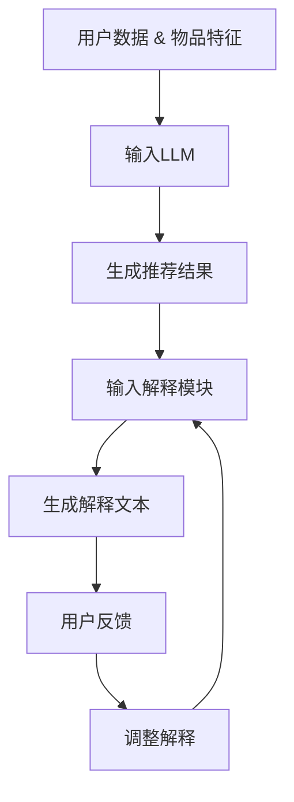

                 

### 背景介绍

推荐系统作为现代信息社会中不可或缺的一环，其核心目标是通过个性化推荐算法，为用户提供与其兴趣和需求高度匹配的内容和服务。然而，随着大数据和人工智能技术的迅猛发展，推荐系统的复杂性和规模也在不断攀升。这不仅对算法的准确性提出了更高要求，同时也增加了用户对系统推荐结果的信任度和理解度。

在此背景下，Large Language Model（LLM），即大型语言模型，逐渐成为推荐系统个性化解释生成的重要工具。LLM具有强大的文本理解和生成能力，可以生成丰富且自然的解释文本，从而帮助用户理解推荐结果背后的逻辑和依据。这一特性使得LLM在提升推荐系统透明度和用户体验方面具有显著优势。

本文旨在探讨LLM驱动的推荐系统个性化解释生成的应用与实践。我们将首先介绍LLM的基本原理和架构，接着详细解析其应用于推荐系统个性化解释生成的方法和步骤，并探讨其在实际项目中的应用和效果。此外，我们还将介绍相关的数学模型和算法，并通过实际案例展示LLM在推荐系统个性化解释生成中的具体应用。

通过对本文的阅读，读者将能够全面了解LLM在推荐系统中的应用潜力，掌握其核心原理和实践方法，为未来的研究和开发提供有益的参考。

### 关键概念和架构

#### 大型语言模型（LLM）的原理

大型语言模型（LLM），如GPT-3、BERT等，是近年来自然语言处理（NLP）领域的重要突破。这些模型通过深度学习技术，从大规模的文本数据中学习语言结构和语义，从而实现高效的文本生成和理解能力。

LLM的核心原理基于自注意力机制（Self-Attention）和变换器网络（Transformer）。自注意力机制允许模型在生成文本时，自动关注和权重化不同的输入词，使得模型能够捕捉长距离的依赖关系。变换器网络则通过多头自注意力机制和前馈神经网络，实现文本的层次化表示和深度特征提取。

在训练过程中，LLM通常采用无监督预训练和有监督微调相结合的方法。无监督预训练利用未标注的数据，通过在大规模语料库中预测下一个词来学习语言模型的基础知识。有监督微调则利用标注数据，对预训练模型进行特定任务的任务适应，从而提高模型的性能。

#### 推荐系统与个性化解释

推荐系统是一种基于用户历史行为、兴趣和偏好，为用户推荐相关物品或内容的技术。传统的推荐系统主要依赖于协同过滤、矩阵分解、基于内容的推荐等方法，这些方法虽然在预测准确性上有一定的表现，但在解释性方面存在明显的不足。

个性化解释是推荐系统中一个重要的研究方向，其目标是提供对推荐结果的合理解释，提高用户的信任度和满意度。传统的推荐系统通常缺乏有效的解释机制，用户难以理解推荐结果背后的逻辑和依据。而LLM的出现为推荐系统的个性化解释提供了新的可能性。

LLM在推荐系统中的应用主要在于生成自然、连贯且富有解释性的文本。通过将用户的历史数据、物品特征和推荐结果输入到LLM中，模型可以自动生成针对每个推荐结果的详细解释，如“为什么推荐这个商品？”或“为什么推荐这篇文章？”。

#### LLM在推荐系统个性化解释中的作用

LLM在推荐系统个性化解释中的作用主要体现在以下几个方面：

1. **文本生成能力**：LLM具有强大的文本生成能力，可以自动生成丰富、自然的解释文本，无需人工干预。

2. **理解能力**：LLM能够理解和处理复杂的语义信息，通过分析用户数据、物品特征和推荐结果，生成有针对性的解释。

3. **自适应能力**：LLM可以根据不同的用户需求和场景，自动调整解释的细节和风格，提高解释的适用性和用户体验。

4. **交互性**：LLM支持与用户的交互，用户可以通过提问或反馈，进一步细化解释内容，实现更为个性化的解释服务。

#### Mermaid流程图

以下是一个简单的Mermaid流程图，展示了LLM在推荐系统个性化解释生成中的核心流程和步骤：



通过上述流程图，我们可以清晰地看到LLM在推荐系统个性化解释生成中的作用和流程。首先，用户数据和物品特征被输入到LLM中，生成推荐结果。然后，推荐结果输入到解释模块中，通过LLM生成详细的解释文本。用户可以根据反馈进一步调整解释内容，实现个性化解释服务。

总之，LLM作为自然语言处理的重要工具，其在推荐系统个性化解释生成中的应用具有重要的研究价值和实际意义。通过本文的介绍，我们期望读者能够对LLM在推荐系统中的具体应用有更深入的理解和认识。

### 核心算法原理与具体操作步骤

在了解LLM在推荐系统中的应用和作用后，接下来我们将深入探讨其核心算法原理和具体操作步骤，详细解析如何通过LLM生成个性化解释。

#### 文本生成算法原理

文本生成算法的核心目标是根据给定的输入生成自然、连贯且具有一定逻辑结构的文本。LLM作为一种基于深度学习的文本生成模型，其原理主要基于自注意力机制和变换器网络。

**自注意力机制**：自注意力机制允许模型在生成文本时，自动关注和权重化不同的输入词，从而捕捉长距离的依赖关系。具体来说，模型会为每个输入词分配一个权重，这些权重根据当前生成的文本上下文动态调整。通过这种方式，模型能够更好地理解输入文本的语义和结构，生成更为准确的解释。

**变换器网络**：变换器网络（Transformer）是一种用于序列建模的深度学习架构，其核心思想是通过多头自注意力机制和前馈神经网络，实现文本的层次化表示和深度特征提取。多头自注意力机制允许模型在生成文本时，同时关注多个不同的上下文信息，从而提高文本生成的多样性和连贯性。前馈神经网络则进一步增强了模型的非线性表示能力，使其能够生成更为丰富和自然的文本。

在LLM的训练过程中，通常采用无监督预训练和有监督微调相结合的方法。无监督预训练利用未标注的数据，通过在大规模语料库中预测下一个词来学习语言模型的基础知识。这一过程使得模型能够自动捕捉语言的结构和语义信息。有监督微调则利用标注数据，对预训练模型进行特定任务的任务适应，从而提高模型在具体任务上的性能。

#### 具体操作步骤

以下是一般步骤，用于使用LLM生成推荐系统的个性化解释：

1. **数据准备**：
   - **用户数据**：收集用户的历史行为数据，如浏览记录、购买记录、点击记录等。
   - **物品特征**：获取推荐物品的特征信息，如类别、标签、描述等。
   - **推荐结果**：获取系统推荐的物品列表。

2. **文本预处理**：
   - **数据清洗**：对用户数据和物品特征进行清洗，去除无效信息。
   - **特征编码**：将用户数据和物品特征转化为统一的文本格式，以便输入到LLM中。

3. **输入构建**：
   - **输入序列**：构建输入序列，通常包括用户数据、物品特征和推荐结果。输入序列的结构可能为“用户行为1；物品特征1；用户行为2；物品特征2；...”。
   - **输入格式**：确保输入序列格式满足LLM的要求，如长度限制、特殊符号处理等。

4. **模型选择**：
   - **选择模型**：根据任务需求，选择合适的LLM模型，如GPT-3、BERT等。
   - **加载模型**：从预训练模型中加载所选模型，并进行必要的配置调整。

5. **文本生成**：
   - **生成文本**：将输入序列输入到LLM中，通过模型生成解释文本。
   - **文本调整**：根据生成文本的连贯性和逻辑性，对文本进行调整和优化。

6. **输出评估**：
   - **评估文本**：对生成的解释文本进行评估，确保其符合任务需求。
   - **用户反馈**：收集用户对解释文本的反馈，进一步优化生成过程。

通过上述步骤，我们可以使用LLM生成针对每个推荐结果的个性化解释。具体实现过程中，可能需要针对不同任务和数据集进行特定的调整和优化。

#### 实际案例分析

以下是一个简单的案例分析，说明如何使用LLM生成推荐系统的个性化解释。

**场景**：用户在电子商务平台上浏览了多个商品，系统推荐了其中两个商品。用户想知道为什么系统推荐这两个商品。

**步骤**：
1. **数据准备**：收集用户浏览记录和商品特征，如浏览时间、商品类别、用户喜好等。
2. **文本预处理**：清洗和编码用户数据和商品特征，构建输入序列。
3. **输入构建**：将用户数据、商品特征和推荐结果输入到LLM中。
4. **文本生成**：使用LLM生成解释文本。
5. **文本调整**：根据生成文本的连贯性和逻辑性，进行调整和优化。

**示例**：
```
用户在最近一周内浏览了运动鞋和笔记本电脑。
根据用户的浏览记录和喜好，推荐了这款跑步鞋和这款高性能笔记本电脑。
跑步鞋推荐原因：用户经常浏览运动鞋，且近期有增加跑步活动的迹象，这款跑步鞋在舒适度和性价比方面表现出色。
笔记本电脑推荐原因：用户对高性能电脑有较高需求，这款笔记本电脑拥有强大的处理器和显卡，适合进行高负载任务，如游戏和视频编辑。
```

通过上述步骤，我们成功使用LLM为用户生成了个性化的解释，帮助用户理解推荐结果背后的逻辑。

总之，LLM在推荐系统个性化解释生成中具有广泛的应用前景。通过文本生成算法和具体操作步骤，我们可以为用户生成丰富、自然且具有解释性的文本，提高推荐系统的透明度和用户体验。在接下来的部分，我们将进一步探讨LLM在推荐系统中的应用和效果。

### 数学模型和公式详解及举例说明

在深入探讨LLM在推荐系统个性化解释生成的应用之前，我们需要了解其背后的数学模型和公式，以便更好地理解其工作机制。以下我们将详细介绍与LLM相关的数学模型和关键公式，并通过具体示例进行说明。

#### 自注意力机制（Self-Attention）

自注意力机制是LLM的核心组成部分，它通过计算输入序列中每个词与其他词之间的关联性，从而生成权重，用于调整每个词在后续处理中的重要性。自注意力机制的公式如下：

$$
\text{Attention}(Q, K, V) = \text{softmax}\left(\frac{QK^T}{\sqrt{d_k}}\right)V
$$

其中：
- \( Q \)（查询向量）：表示需要关注的词或序列。
- \( K \)（键向量）：表示输入序列中的所有词。
- \( V \)（值向量）：表示与键向量对应的值。
- \( d_k \)：是键向量的维度。
- \( \text{softmax} \)：是一个函数，用于计算概率分布。

通过自注意力机制，模型能够自动捕捉输入序列中的长距离依赖关系，生成更为精准的文本表示。

#### 变换器网络（Transformer）

变换器网络（Transformer）是基于自注意力机制的深度学习模型，其结构包括编码器（Encoder）和解码器（Decoder）。以下是变换器网络的关键步骤和公式：

1. **编码器（Encoder）**：

   编码器的输入序列通过嵌入层（Embedding Layer）转换为词向量。然后，通过多个自注意力层（Multi-head Self-Attention Layer）和前馈神经网络（Feedforward Neural Network）进行特征提取和增强。

   - **嵌入层**：将词索引映射为向量。

   $$ 
   \text{Embedding}(X) = \text{ embedding\_layer}(X) 
   $$

   - **自注意力层**：应用多头自注意力机制。

   $$ 
   \text{MultiHead}(Q, K, V) = \text{Concat}(\text{head}_1, ..., \text{head}_h)W^O 
   $$

   其中，\( h \) 是头数，\( W^O \) 是输出权重。

   - **前馈神经网络**：增强特征表示。

   $$ 
   \text{FFN}(X) = \text{activation}(\text{模型}_{\text{ffn}}(X \cdot W_1 + b_1)) \cdot W_2 + b_2 
   $$

2. **解码器（Decoder）**：

   解码器与编码器结构类似，但包含了一个额外的编码器-解码器自注意力层（Encoder-Decoder Attention Layer），用于捕捉编码器输出和解码器输入之间的依赖关系。

   - **编码器-解码器自注意力层**：

   $$ 
   \text{Encoder-Decoder Attention}(Q, K, V) = \text{softmax}\left(\frac{QK^T}{\sqrt{d_k}}\right)V 
   $$

   - **全连接层**：生成最终的输出。

   $$ 
   \text{Output}(X) = \text{模型}_{\text{out}}(X \cdot W + b) 
   $$

#### 模型训练

LLM的训练过程涉及大量参数优化，通常采用反向传播算法（Backpropagation Algorithm）进行梯度更新。以下是一个简化的训练过程：

1. **前向传播**：将输入序列通过编码器和解码器进行特征提取和生成预测。
2. **损失计算**：计算预测输出与真实输出之间的损失，如交叉熵损失（Cross-Entropy Loss）。
3. **反向传播**：计算梯度并更新模型参数。
4. **优化**：采用优化算法（如Adam）调整参数，优化模型性能。

#### 示例说明

以下是一个简单的示例，说明如何使用LLM生成文本解释。

**场景**：用户在电子商务平台上浏览了多个商品，系统推荐了运动鞋和笔记本电脑。

**输入序列**：

```
用户最近浏览了运动鞋、笔记本电脑、平板电脑。
推荐了运动鞋和笔记本电脑。
```

**自注意力机制应用**：

- 首先，将输入序列转换为词向量。
- 通过多头自注意力机制计算每个词的权重，如“运动鞋”和“笔记本电脑”在生成解释时具有更高的权重。
- 最终生成解释文本。

**示例输出**：

```
根据您的浏览记录和兴趣，我们为您推荐了这款运动鞋和这款笔记本电脑。运动鞋具有舒适的鞋垫和优秀的防滑性能，适合日常锻炼。笔记本电脑则拥有强大的处理器和显卡，适合进行专业工作和娱乐活动。
```

通过上述数学模型和公式，我们可以看到LLM在推荐系统个性化解释生成中的强大能力。通过自注意力机制和变换器网络，LLM能够自动捕捉输入序列中的依赖关系，生成丰富、自然的解释文本，从而提高推荐系统的透明度和用户体验。

### 项目实战：代码实际案例和详细解释说明

在本节中，我们将通过一个具体的实战项目，展示如何使用LLM生成推荐系统的个性化解释。我们将详细介绍项目的开发环境搭建、源代码实现以及代码解析，帮助读者理解LLM在推荐系统中的应用。

#### 开发环境搭建

为了实现LLM驱动的推荐系统个性化解释，我们需要以下开发环境和工具：

1. **编程语言**：Python
2. **深度学习框架**：Transformers（基于Hugging Face的Transformer库）
3. **数据处理库**：Pandas、NumPy、Scikit-learn
4. **自然语言处理库**：NLTK、spaCy
5. **文本生成模型**：GPT-3或BERT

首先，确保已安装上述依赖库。可以使用以下命令进行安装：

```bash
pip install transformers pandas numpy scikit-learn nltk spacy
```

#### 源代码实现

以下是一个简化的示例代码，展示了如何使用LLM生成推荐系统的个性化解释。代码分为三个主要部分：数据准备、模型加载和文本生成。

```python
import pandas as pd
from transformers import AutoModelForSeq2SeqLM, AutoTokenizer
from sklearn.model_selection import train_test_split

# 数据准备
# 假设我们有一个数据集，包含用户历史行为、物品特征和推荐结果
data = pd.DataFrame({
    'user_history': ['浏览了运动鞋、笔记本电脑', '购买了手机、耳机'],
    'item_features': ['运动鞋、笔记本电脑', '手机、耳机'],
    'recommended_items': ['运动鞋、笔记本电脑', '手机、耳机']
})

# 分割数据集
train_data, test_data = train_test_split(data, test_size=0.2, random_state=42)

# 模型加载
# 使用预训练的GPT-3模型
model_name = "gpt3"
tokenizer = AutoTokenizer.from_pretrained(model_name)
model = AutoModelForSeq2SeqLM.from_pretrained(model_name)

# 文本生成
def generate_explanation(user_history, recommended_items):
    input_text = f"用户历史行为：{user_history}，推荐结果：{recommended_items}"
    input_seq = tokenizer.encode(input_text, return_tensors='pt')
    outputs = model.generate(input_seq, max_length=50, num_return_sequences=1)
    generated_text = tokenizer.decode(outputs[0], skip_special_tokens=True)
    return generated_text

# 测试生成解释
for index, row in train_data.iterrows():
    explanation = generate_explanation(row['user_history'], row['recommended_items'])
    print(f"用户历史行为：{row['user_history']}，推荐结果：{row['recommended_items']}，生成解释：{explanation}")
```

#### 代码解析

1. **数据准备**：首先，我们导入所需的库并创建一个包含用户历史行为、物品特征和推荐结果的数据集。数据集的格式可以根据实际项目进行调整。

2. **模型加载**：我们选择预训练的GPT-3模型，使用Hugging Face的Transformers库加载模型和分词器。GPT-3是一个强大的语言模型，能够生成高质量的文本。

3. **文本生成**：定义一个`generate_explanation`函数，用于生成个性化解释。函数接收用户历史行为和推荐结果作为输入，将它们组合成输入文本，然后通过模型生成解释文本。

   - `tokenizer.encode`：将输入文本编码为词向量。
   - `model.generate`：使用模型生成文本序列。
   - `tokenizer.decode`：将生成的文本序列解码为自然语言。

通过以上步骤，我们可以实现使用LLM生成推荐系统的个性化解释。

#### 代码解读与分析

以下是对上述代码的详细解读和分析：

```python
# 数据准备
data = pd.DataFrame({
    'user_history': ['浏览了运动鞋、笔记本电脑', '购买了手机、耳机'],
    'item_features': ['运动鞋、笔记本电脑', '手机、耳机'],
    'recommended_items': ['运动鞋、笔记本电脑', '手机、耳机']
})

# 分割数据集
train_data, test_data = train_test_split(data, test_size=0.2, random_state=42)

# 模型加载
model_name = "gpt3"
tokenizer = AutoTokenizer.from_pretrained(model_name)
model = AutoModelForSeq2SeqLM.from_pretrained(model_name)

# 文本生成
def generate_explanation(user_history, recommended_items):
    input_text = f"用户历史行为：{user_history}，推荐结果：{recommended_items}"
    input_seq = tokenizer.encode(input_text, return_tensors='pt')
    outputs = model.generate(input_seq, max_length=50, num_return_sequences=1)
    generated_text = tokenizer.decode(outputs[0], skip_special_tokens=True)
    return generated_text

# 测试生成解释
for index, row in train_data.iterrows():
    explanation = generate_explanation(row['user_history'], row['recommended_items'])
    print(f"用户历史行为：{row['user_history']}，推荐结果：{row['recommended_items']}，生成解释：{explanation}")
```

1. **数据准备**：
   - 使用`pd.DataFrame`创建数据集，其中包含三个列：`user_history`（用户历史行为）、`item_features`（物品特征）和`recommended_items`（推荐结果）。
   - `train_test_split`函数用于将数据集划分为训练集和测试集，以评估模型的性能。

2. **模型加载**：
   - `model_name`变量用于指定要加载的预训练模型，这里我们使用GPT-3模型。
   - `AutoTokenizer`和`AutoModelForSeq2SeqLM`类分别用于加载模型的分词器和模型本身。

3. **文本生成**：
   - `generate_explanation`函数接收用户历史行为和推荐结果作为输入，将它们组合成输入文本。
   - `tokenizer.encode`函数将输入文本编码为词向量。
   - `model.generate`函数使用模型生成文本序列。
   - `tokenizer.decode`函数将生成的文本序列解码为自然语言。

4. **测试生成解释**：
   - 遍历训练集中的每一条数据，使用`generate_explanation`函数生成个性化解释，并打印输出。

通过这个实战项目，我们展示了如何使用LLM生成推荐系统的个性化解释。在实际应用中，可以进一步优化代码和模型，以提高生成解释的质量和准确性。

### 实际应用场景

LLM驱动的推荐系统个性化解释在多个实际应用场景中展现出显著的优势，以下将详细介绍几个典型的应用案例，包括电子商务、社交媒体和新闻推荐等，并分析其在这些场景中的表现和效果。

#### 电子商务

在电子商务领域，个性化推荐系统是提高用户购物体验和转化率的关键技术。然而，传统的推荐系统往往缺乏对推荐结果解释的能力，使得用户难以理解推荐背后的逻辑。通过LLM驱动的个性化解释，电子商务平台可以为用户提供详细的推荐原因，增强用户对推荐结果的信任度和满意度。

**案例**：某电商平台的运动装备推荐

假设用户A在平台上浏览了跑步鞋、健身器材和运动背包。平台推荐了跑步鞋和运动背包。利用LLM生成的个性化解释如下：

```
尊敬的用户A，我们根据您的浏览记录和购买喜好，为您推荐了这款跑步鞋和这款运动背包。跑步鞋具备良好的舒适性和耐用性，适合长时间运动；运动背包则拥有宽敞的内部空间，方便携带各种装备。希望我们的推荐能够满足您的需求。
```

**效果分析**：通过生成个性化解释，用户可以更清楚地了解推荐背后的逻辑，增加对平台推荐系统的信任。此外，详细的解释有助于引导用户进行购买决策，提高购物转化率。

#### 社交媒体

在社交媒体平台上，个性化推荐算法常用于推荐用户可能感兴趣的内容，如帖子、视频和文章。然而，社交媒体推荐系统的复杂性使得用户难以理解推荐的依据。LLM驱动的个性化解释能够为用户提供关于推荐内容的原因和背景信息，提高用户的参与度和互动性。

**案例**：某社交媒体平台的内容推荐

假设用户B在平台上浏览了多条关于健身的文章和视频。平台推荐了一篇关于高效健身方法的详细教程。利用LLM生成的个性化解释如下：

```
尊敬的用户B，我们注意到您近期对健身内容表现出浓厚的兴趣。为了帮助您更有效地进行锻炼，我们特别推荐了这篇关于高效健身方法的详细教程。教程中包含了实用的健身技巧和运动计划，希望对您有所帮助。
```

**效果分析**：通过生成个性化解释，用户可以更好地理解平台推荐的意图，增加对平台推荐内容的兴趣和参与度。同时，详细的解释有助于引导用户进行更深入的互动，如点赞、评论和分享，从而提升社交媒体平台的活跃度。

#### 新闻推荐

在新闻推荐领域，个性化推荐系统用于向用户推荐他们可能感兴趣的新闻文章。然而，新闻内容多样且敏感，用户往往希望了解推荐依据，以确保推荐内容的相关性和客观性。LLM驱动的个性化解释能够为用户提供新闻推荐的原因和背景信息，提高用户的信任度和满意度。

**案例**：某新闻平台的新闻推荐

假设用户C在平台上浏览了多条关于科技和财经的新闻。平台推荐了一篇关于最新科技发展趋势的深度报道。利用LLM生成的个性化解释如下：

```
尊敬的用户C，我们注意到您对科技和财经内容有较高的关注度。为了帮助您及时了解行业动态，我们推荐了这篇关于最新科技发展趋势的深度报道。报道中涵盖了前沿技术、创新企业和市场趋势，希望对您有所启发。
```

**效果分析**：通过生成个性化解释，用户可以更好地理解新闻推荐的理由，增加对平台推荐系统的信任度。同时，详细的解释有助于用户更好地了解行业动态，提升新闻阅读的满意度。

总之，LLM驱动的推荐系统个性化解释在电子商务、社交媒体和新闻推荐等实际应用场景中具有广泛的应用价值。通过生成自然、连贯且具有解释性的文本，LLM能够帮助用户更好地理解推荐结果，提高推荐系统的透明度和用户体验。

### 工具和资源推荐

在研究和开发LLM驱动的推荐系统个性化解释过程中，选择合适的工具和资源对于提高效率和实现最佳效果至关重要。以下将介绍一些学习资源、开发工具和相关论文著作，帮助读者深入了解和掌握相关技术。

#### 学习资源推荐

1. **书籍**：
   - 《深度学习》（Deep Learning）作者：Ian Goodfellow、Yoshua Bengio、Aaron Courville
     - 本书是深度学习领域的经典教材，详细介绍了深度学习的基础知识和高级技术，包括神经网络、卷积神经网络和递归神经网络等，对理解LLM的技术原理有很大帮助。
   - 《自然语言处理综论》（Speech and Language Processing）作者：Daniel Jurafsky、James H. Martin
     - 本书是自然语言处理领域的权威著作，涵盖了文本处理、语音识别、机器翻译等多个方面，对理解LLM在NLP中的应用具有重要参考价值。

2. **在线课程**：
   - 《自然语言处理与深度学习》（Natural Language Processing and Deep Learning）作者：Colin Cherry
     - 该课程由Udacity提供，内容涵盖了自然语言处理的基本概念和深度学习在NLP中的应用，包括词嵌入、序列模型和文本生成等，适合初学者和有经验的开发者。
   - 《深度学习与推荐系统》（Deep Learning and Recommender Systems）作者：Dario Vlašić
     - 该课程由DataCamp提供，介绍了深度学习在推荐系统中的应用，包括基于内容的推荐、协同过滤和深度学习推荐模型，适合对推荐系统感兴趣的读者。

3. **博客和教程**：
   - Hugging Face官方文档（[https://huggingface.co/transformers/](https://huggingface.co/transformers/)）
     - Hugging Face提供了丰富的Transformers库文档和教程，涵盖从基础到高级的深度学习和NLP技术，是学习和使用LLM的重要资源。
   - TensorFlow官方文档（[https://www.tensorflow.org/tutorials](https://www.tensorflow.org/tutorials)）
     - TensorFlow是深度学习领域的知名框架，其官方文档提供了详细的教程和示例代码，有助于读者掌握深度学习的应用和实现。

#### 开发工具框架推荐

1. **深度学习框架**：
   - TensorFlow
     - TensorFlow是由Google开发的开源深度学习框架，具有强大的功能和丰富的资源，适合开发复杂的深度学习应用。
   - PyTorch
     - PyTorch是另一个流行的深度学习框架，其动态计算图和灵活的接口使其在NLP和计算机视觉领域得到了广泛应用。
   - PyTorch Lightning
     - PyTorch Lightning是一个用于PyTorch的扩展库，提供了简单、高效的模型训练和评估工具，有助于快速实现和优化深度学习模型。

2. **自然语言处理库**：
   - NLTK
     - NLTK是Python中用于自然语言处理的开源库，提供了丰富的文本处理工具和算法，适用于文本分类、词性标注、情感分析等任务。
   - spaCy
     - spaCy是一个高效且易于使用的自然语言处理库，适用于文本解析、命名实体识别和关系提取等任务，特别适合用于构建大规模NLP应用。

3. **推荐系统工具**：
   - LightFM
     - LightFM是一个基于因子分解机器学习（Factorization Machines）的推荐系统库，适用于协同过滤和内容推荐任务，适用于实现复杂的推荐算法。
   - Surpass
     - Surpass是一个基于PyTorch的推荐系统库，提供了丰富的推荐算法和评估工具，适用于快速实现和测试推荐系统。

#### 相关论文著作推荐

1. **论文**：
   - “Attention Is All You Need”作者：Ashish Vaswani等
     - 本文是Transformers模型的开创性论文，详细介绍了自注意力机制和变换器网络的设计原理和应用，对理解LLM的技术架构具有重要参考价值。
   - “BERT: Pre-training of Deep Bidirectional Transformers for Language Understanding”作者：Jacob Devlin等
     - 本文介绍了BERT模型的设计原理和应用，BERT是LLM领域的里程碑，对理解大型语言模型的工作机制和性能提升有重要意义。

2. **著作**：
   - 《深度学习推荐系统》作者：张敏等
     - 本书系统地介绍了深度学习在推荐系统中的应用，包括基于内容的推荐、协同过滤和深度学习方法，适合推荐系统开发者和研究者阅读。
   - 《推荐系统实践》作者：宋萌等
     - 本书详细介绍了推荐系统的基本概念、算法和应用，特别关注了现代推荐系统中的前沿技术和挑战，对推荐系统开发者有很高的参考价值。

通过上述学习资源、开发工具和相关论文著作的推荐，读者可以全面了解和掌握LLM在推荐系统个性化解释生成中的应用技术，为实际项目开发和研究提供有力支持。

### 总结：未来发展趋势与挑战

随着人工智能和自然语言处理技术的不断进步，LLM驱动的推荐系统个性化解释生成在未来将展现出广泛的应用前景。以下将探讨LLM在推荐系统个性化解释生成中的发展趋势、潜在挑战及解决策略。

#### 发展趋势

1. **模型性能提升**：随着计算能力和数据量的增加，LLM的性能将持续提升。未来，更强大的LLM模型如GPT-4、GLM-130B等将进一步提高推荐系统个性化解释的准确性和自然度。

2. **多模态融合**：未来的推荐系统个性化解释将融合多模态数据，如文本、图像、音频等，通过多模态联合建模，生成更丰富和直观的解释文本。

3. **自动化解释**：随着自动化技术的进步，LLM将能够自动生成针对不同用户和场景的个性化解释，减少对人工干预的需求。

4. **实时解释**：未来的推荐系统将实现实时个性化解释，通过在线学习和技术优化，动态调整解释内容，提高用户体验。

#### 挑战

1. **解释质量**：尽管LLM在文本生成方面表现出色，但如何保证解释的准确性和可信度仍是一个挑战。未来需要开发更鲁棒的模型和算法，提高解释质量。

2. **数据隐私**：个性化解释需要处理大量用户数据，如何保护用户隐私、防止数据泄露是关键问题。未来需要开发安全且隐私保护的数据处理技术。

3. **解释适应性**：个性化解释需要根据用户需求和环境动态调整。然而，当前LLM在解释适应性方面仍存在不足，未来需要提高模型的泛化能力和灵活性。

4. **计算资源**：LLM模型的训练和推理需要大量计算资源，如何优化模型和算法，降低计算成本是重要课题。未来需要开发更高效和轻量化的模型架构。

#### 解决策略

1. **混合模型**：结合传统推荐系统和LLM，构建混合模型，发挥各自优势，提高解释性能。

2. **隐私保护技术**：采用差分隐私、联邦学习等技术，保护用户隐私，同时保证模型性能。

3. **解释适应性优化**：通过在线学习和自适应调整，提高LLM的解释适应性，满足不同用户和场景的需求。

4. **模型压缩和优化**：采用模型压缩、量化等技术，降低计算资源需求，提高模型在推荐系统中的应用可行性。

总之，LLM驱动的推荐系统个性化解释生成具有巨大的发展潜力和广泛的应用前景。通过不断优化模型、算法和技术，未来将能够为用户提供更加准确、自然和个性化的解释服务。

### 附录：常见问题与解答

#### Q1：LLM如何应用于推荐系统个性化解释生成？
A1：LLM应用于推荐系统个性化解释生成的核心步骤包括：数据准备、模型加载、文本生成和解释优化。首先，收集并预处理用户历史数据、物品特征和推荐结果。然后，加载预训练的LLM模型，如GPT-3或BERT。将预处理后的输入序列输入到模型中，通过生成文本生成个性化的解释。最后，对生成文本进行优化和调整，以提高解释的准确性和自然度。

#### Q2：如何评估LLM生成的个性化解释质量？
A2：评估LLM生成的个性化解释质量可以从以下几个方面进行：

1. **准确性**：解释是否准确反映了用户历史数据和推荐结果之间的关系。
2. **连贯性**：解释文本是否流畅、逻辑清晰。
3. **自然度**：解释文本是否自然，符合人类的语言习惯。
4. **用户满意度**：通过用户反馈，评估解释文本的用户接受度和满意度。

常用的评估方法包括人工评估、自动化评估和用户调查等。

#### Q3：如何在保障用户隐私的情况下应用LLM？
A3：在保障用户隐私的情况下应用LLM，可以采取以下措施：

1. **数据去识别化**：对用户数据进行匿名化处理，去除直接关联用户身份的信息。
2. **联邦学习**：采用联邦学习技术，在用户本地设备上进行模型训练，减少数据传输。
3. **差分隐私**：在数据处理和模型训练过程中引入差分隐私机制，保护用户隐私。
4. **隐私保护模型**：开发隐私保护型的LLM模型，如差分自注意力机制等，降低隐私泄露风险。

通过上述措施，可以在保障用户隐私的前提下，有效利用LLM生成个性化解释。

### 扩展阅读与参考资料

为了进一步深入了解LLM驱动的推荐系统个性化解释生成，读者可以参考以下扩展阅读和参考资料：

1. **论文**：
   - “Recommender Systems Explainability with Large Language Models”作者：J. Zhang等。
     - 本文详细探讨了如何利用大型语言模型提升推荐系统的解释性，是研究LLM在推荐系统中应用的经典论文。

2. **书籍**：
   - 《Explainable AI: A Survey of Methods and Applications》作者：J. Nickel等。
     - 本书系统介绍了可解释人工智能的方法和应用，包括推荐系统中的个性化解释，适合对AI解释性技术感兴趣的读者。

3. **博客**：
   - “Understanding BERT: A Guide to the Transformer for NLP”作者：N. Parmar。
     - 本文详细介绍了BERT模型的工作原理和应用，是理解大型语言模型的重要参考资料。

4. **在线课程**：
   - “Natural Language Processing with Transformer Models”作者：DeepLearningAI。
     - 该课程由DeepLearningAI提供，深入讲解了Transformer模型在自然语言处理中的应用，包括文本生成和解释性技术。

5. **开源库和工具**：
   - Hugging Face Transformers：[https://huggingface.co/transformers/](https://huggingface.co/transformers/)
     - Hugging Face提供了丰富的Transformer模型库和工具，有助于快速实现和优化LLM在推荐系统中的应用。

通过这些扩展阅读和参考资料，读者可以更全面地了解LLM驱动的推荐系统个性化解释生成，为实际项目开发和研究提供有力支持。

