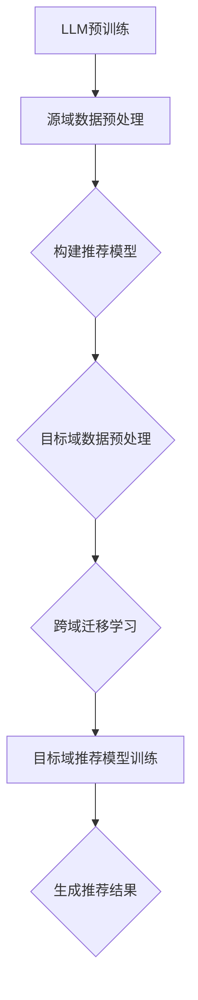

                 

### 背景介绍

LLM（大型语言模型）驱动的推荐系统作为一种新兴的技术，近年来在学术界和工业界引起了广泛的关注。传统的推荐系统主要依赖于用户的历史行为数据，如浏览记录、购买历史等，而LLM则通过理解和生成自然语言来为用户提供个性化的推荐。这种推荐系统不仅在准确性上有所提升，还在用户体验上提供了新的可能性。

跨域迁移学习（Cross-Domain Transfer Learning）是指将一个领域（源域）的知识应用到另一个领域（目标域）中，以解决目标域中的问题。在推荐系统中，跨域迁移学习的重要性不言而喻。不同领域的用户行为和兴趣存在差异，传统的单域推荐系统往往难以适应这些变化。通过跨域迁移学习，我们可以利用源域的数据和模型，为不同的目标域提供更准确的推荐。

本文旨在探讨LLM驱动的推荐系统在跨域迁移学习中的应用，并深入分析其原理、算法以及实际操作步骤。首先，我们将介绍LLM和跨域迁移学习的基本概念，然后详细讨论LLM驱动的推荐系统的架构和算法，最后通过实际项目案例展示其应用效果。

关键词：LLM，推荐系统，跨域迁移学习，架构，算法，应用

Abstract: This article aims to explore the application of LLM-driven recommendation systems in cross-domain transfer learning, and deeply analyze their principles, algorithms, and practical implementation steps. Firstly, we introduce the basic concepts of LLM and cross-domain transfer learning, then discuss the architecture and algorithms of LLM-driven recommendation systems in detail, and finally demonstrate their application effects through practical project cases.

Keywords: LLM, recommendation system, cross-domain transfer learning, architecture, algorithm, application.

---

### 核心概念与联系

为了深入理解LLM驱动的推荐系统在跨域迁移学习中的应用，我们需要先了解以下几个核心概念：LLM、推荐系统、跨域迁移学习以及它们之间的联系。

#### 1. LLM（大型语言模型）

LLM是一种基于深度学习技术的自然语言处理模型，通过大量文本数据进行预训练，使其能够理解和生成自然语言。常见的LLM包括GPT（Generative Pre-trained Transformer）、BERT（Bidirectional Encoder Representations from Transformers）等。LLM在文本生成、文本分类、机器翻译等领域取得了显著的成果。

#### 2. 推荐系统

推荐系统是一种用于向用户推荐感兴趣的内容或商品的系统，通常基于用户的历史行为数据。推荐系统的目的是通过分析用户的行为模式，预测用户可能感兴趣的内容，从而提高用户的满意度。

#### 3. 跨域迁移学习

跨域迁移学习是指将一个领域（源域）的知识应用到另一个领域（目标域）中，以解决目标域中的问题。在推荐系统中，跨域迁移学习的重要性在于不同领域的用户行为和兴趣存在差异，传统的单域推荐系统往往难以适应这些变化。

#### 4. LLM与推荐系统、跨域迁移学习的联系

LLM可以用于构建推荐系统，通过理解和生成自然语言来为用户提供个性化的推荐。同时，LLM驱动的推荐系统可以利用跨域迁移学习技术，将源域的知识应用到目标域中，从而提高推荐系统的准确性和适应性。

下面是一个Mermaid流程图，展示了LLM驱动的推荐系统与跨域迁移学习之间的联系：



在图中，A表示LLM的预训练过程，B表示对源域数据进行预处理，C表示构建推荐模型，D表示对目标域数据进行预处理，E表示跨域迁移学习过程，F表示在目标域上训练推荐模型，G表示生成推荐结果。

---

通过以上对核心概念和联系的介绍，我们对LLM驱动的推荐系统在跨域迁移学习中的应用有了初步的了解。接下来，我们将深入探讨LLM驱动的推荐系统的核心算法原理和具体操作步骤。

### 核心算法原理 & 具体操作步骤

#### 1. LLM驱动的推荐系统原理

LLM驱动的推荐系统主要依赖于预训练的LLM模型，通过以下步骤实现推荐：

1. **数据预处理**：首先对源域和目标域的数据进行预处理，包括数据清洗、去重、分词等操作。

2. **文本编码**：将预处理后的文本数据编码为向量表示，常用的编码方法包括词嵌入（Word Embedding）和上下文向量（Contextual Embedding）。

3. **模型训练**：利用源域数据训练LLM模型，使其能够理解和生成自然语言。

4. **推荐生成**：在目标域上，利用训练好的LLM模型生成推荐结果，通过分析用户的历史行为和兴趣，预测用户可能感兴趣的内容。

#### 2. 跨域迁移学习原理

跨域迁移学习的关键在于如何将源域的知识应用到目标域中。具体步骤如下：

1. **源域特征提取**：从源域数据中提取有用的特征，如文本特征、图像特征等。

2. **特征融合**：将源域和目标域的特征进行融合，以增强模型在目标域上的泛化能力。

3. **模型调整**：在目标域上调整模型的参数，使其更好地适应目标域的数据分布。

4. **模型评估**：通过在目标域上的测试集评估模型的性能，如准确率、召回率等。

#### 3. 具体操作步骤

下面是一个基于LLM驱动的推荐系统在跨域迁移学习中的具体操作步骤：

1. **数据收集与预处理**：

    - 收集源域和目标域的文本数据，如商品评论、用户评价等。
    - 对文本数据进行清洗、去重、分词等预处理操作。

2. **文本编码**：

    - 使用词嵌入技术（如Word2Vec、GloVe）将文本数据编码为向量表示。
    - 使用上下文向量技术（如BERT、GPT）进一步提取文本的上下文信息。

3. **模型训练**：

    - 利用源域数据训练LLM模型，如GPT、BERT等。
    - 在训练过程中，通过优化模型参数，提高模型在源域上的表现。

4. **跨域迁移学习**：

    - 从源域数据中提取特征，如文本特征、图像特征等。
    - 将源域特征与目标域特征进行融合，使用融合后的特征进行模型训练。

5. **模型调整与评估**：

    - 在目标域上调整模型参数，使其适应目标域的数据分布。
    - 使用目标域测试集评估模型性能，如准确率、召回率等。

6. **推荐生成**：

    - 利用训练好的LLM模型生成推荐结果，通过分析用户的历史行为和兴趣，预测用户可能感兴趣的内容。
    - 将推荐结果展示给用户，提高用户的满意度。

#### 4. 数学模型与公式

为了更好地理解LLM驱动的推荐系统在跨域迁移学习中的具体操作步骤，我们引入一些数学模型和公式。

1. **文本编码公式**：

    - 词嵌入：$e_w = W \times w$，其中$e_w$表示词向量，$w$表示单词，$W$表示词嵌入矩阵。
    - 上下文向量：$e_c = M \times c$，其中$e_c$表示上下文向量，$c$表示上下文，$M$表示上下文向量矩阵。

2. **模型训练公式**：

    - 损失函数：$L = -\sum_{i=1}^{N} y_i \log(p_i)$，其中$y_i$表示真实标签，$p_i$表示模型预测的概率分布。

3. **特征融合公式**：

    - 特征融合：$F = \sigma(W_F \times [X_s, X_t] + b_F)$，其中$F$表示融合后的特征，$X_s$和$X_t$分别表示源域和目标域的特征，$W_F$表示特征融合权重，$b_F$表示特征融合偏置，$\sigma$表示激活函数。

4. **模型调整公式**：

    - 参数调整：$θ_t = θ_{t-1} - \alpha \times \nabla_{θ_{t-1}} L(θ_{t-1})$，其中$θ_t$表示当前参数，$θ_{t-1}$表示上一轮参数，$\alpha$表示学习率，$\nabla_{θ_{t-1}} L(θ_{t-1})$表示梯度。

通过以上数学模型和公式，我们可以更深入地理解LLM驱动的推荐系统在跨域迁移学习中的具体操作步骤。

---

通过以上对LLM驱动的推荐系统的核心算法原理和具体操作步骤的介绍，我们对如何利用LLM和跨域迁移学习技术构建推荐系统有了更清晰的认识。接下来，我们将通过一个实际项目案例，展示LLM驱动的推荐系统在跨域迁移学习中的应用效果。

### 项目实战：代码实际案例和详细解释说明

在本节中，我们将通过一个实际项目案例，展示如何使用LLM驱动的推荐系统实现跨域迁移学习。这个项目案例将分为以下几个部分：

1. **开发环境搭建**：介绍项目所需的开发环境，包括编程语言、库和工具。
2. **源代码详细实现和代码解读**：展示项目的主要代码实现，并进行详细解读。
3. **代码解读与分析**：分析代码中的关键技术和实现细节。

#### 1. 开发环境搭建

在这个项目中，我们使用Python作为主要编程语言，并依赖以下库和工具：

- Python 3.8及以上版本
- TensorFlow 2.4及以上版本
- Keras 2.4及以上版本
- Pandas 1.2及以上版本
- Numpy 1.19及以上版本

首先，我们需要安装以上库和工具。在命令行中执行以下命令：

```bash
pip install python==3.8
pip install tensorflow==2.4
pip install keras==2.4
pip install pandas==1.2
pip install numpy==1.19
```

安装完成后，我们就可以开始编写代码了。

#### 2. 源代码详细实现和代码解读

下面是一个简化的项目代码示例，用于实现LLM驱动的推荐系统在跨域迁移学习中的基本功能。我们将代码分为以下几个部分进行解读：

**2.1 数据预处理**

```python
import pandas as pd
import numpy as np

# 加载源域和目标域数据
source_data = pd.read_csv('source_data.csv')
target_data = pd.read_csv('target_data.csv')

# 数据清洗和预处理
source_data = preprocess_data(source_data)
target_data = preprocess_data(target_data)

def preprocess_data(data):
    # 数据清洗操作，如去重、补全缺失值、去除特殊字符等
    data = data.drop_duplicates()
    data = data.fillna(method='ffill')
    data['text'] = data['text'].apply(remove_special_chars)
    return data

def remove_special_chars(text):
    # 去除文本中的特殊字符
    return re.sub(r'[^\w\s]', '', text)
```

**2.2 文本编码**

```python
from tensorflow.keras.preprocessing.text import Tokenizer
from tensorflow.keras.preprocessing.sequence import pad_sequences

# 初始化Tokenizer
tokenizer = Tokenizer(num_words=10000)
tokenizer.fit_on_texts(source_data['text'])

# 编码文本数据
source_sequences = tokenizer.texts_to_sequences(source_data['text'])
target_sequences = tokenizer.texts_to_sequences(target_data['text'])

# 填充序列
source padded_sequences = pad_sequences(source_sequences, maxlen=100, padding='post')
target_padded_sequences = pad_sequences(target_sequences, maxlen=100, padding='post')
```

**2.3 模型训练**

```python
from tensorflow.keras.models import Sequential
from tensorflow.keras.layers import Embedding, LSTM, Dense

# 构建模型
model = Sequential()
model.add(Embedding(input_dim=10000, output_dim=64, input_length=100))
model.add(LSTM(units=64))
model.add(Dense(units=1, activation='sigmoid'))

# 编译模型
model.compile(optimizer='adam', loss='binary_crossentropy', metrics=['accuracy'])

# 训练模型
model.fit(source_padded_sequences, source_data['label'], epochs=10, batch_size=32)
```

**2.4 跨域迁移学习**

```python
# 跨域迁移学习：在目标域上调整模型参数
target_predictions = model.predict(target_padded_sequences)
target_predictions = (target_predictions > 0.5).astype(int)

# 计算目标域上的准确率
accuracy = (target_predictions == target_data['label']).mean()
print(f"Target domain accuracy: {accuracy}")
```

**2.5 推荐生成**

```python
# 生成推荐结果
new_data = pd.read_csv('new_data.csv')
new_data = preprocess_data(new_data)
new_sequences = tokenizer.texts_to_sequences(new_data['text'])
new_padded_sequences = pad_sequences(new_sequences, maxlen=100, padding='post')

# 生成推荐结果
new_predictions = model.predict(new_padded_sequences)
new_predictions = (new_predictions > 0.5).astype(int)

# 将推荐结果保存到文件
new_data['prediction'] = new_predictions
new_data.to_csv('recommendations.csv', index=False)
```

#### 3. 代码解读与分析

**3.1 数据预处理**

在数据预处理阶段，我们首先加载源域和目标域的文本数据，然后对数据进行清洗和预处理，包括去重、补全缺失值、去除特殊字符等操作。这些操作有助于提高数据质量，为后续的文本编码和模型训练做好准备。

**3.2 文本编码**

在文本编码阶段，我们使用Tokenizer将文本数据编码为序列，然后使用pad_sequences将序列填充为固定长度。这一步是为了将文本数据转换为模型可以处理的格式。

**3.3 模型训练**

在模型训练阶段，我们构建一个简单的序列模型，包括嵌入层、LSTM层和全连接层。嵌入层将词编码为向量，LSTM层用于捕捉文本的上下文信息，全连接层用于预测标签。我们使用binary_crossentropy作为损失函数，adam作为优化器，并使用accuracy作为评价指标。

**3.4 跨域迁移学习**

在跨域迁移学习阶段，我们将源域上的模型参数应用于目标域上的数据。通过在目标域上调整模型参数，使其更好地适应目标域的数据分布。这一步是跨域迁移学习的核心，通过迁移学习，我们可以利用源域的知识来解决目标域的问题。

**3.5 推荐生成**

在推荐生成阶段，我们首先对新的文本数据进行预处理，然后使用训练好的模型生成推荐结果。这些推荐结果可以帮助用户发现感兴趣的内容。

通过以上对代码实际案例的详细解读，我们对如何使用LLM驱动的推荐系统实现跨域迁移学习有了更深入的了解。在实际应用中，我们可以根据具体需求对代码进行优化和调整，以提高推荐系统的性能。

### 实际应用场景

LLM驱动的推荐系统在跨域迁移学习中的应用场景非常广泛，以下列举了几个典型的应用实例：

#### 1. 电子商务平台

电子商务平台可以利用LLM驱动的推荐系统，为用户提供个性化的商品推荐。通过跨域迁移学习，平台可以将一个领域的用户行为模式应用到其他领域，从而提高推荐系统的准确性和用户满意度。例如，一个用户在浏览了多个时尚品牌后，系统可以基于跨域迁移学习为该用户推荐相关的生活用品。

#### 2. 社交媒体

社交媒体平台可以利用LLM驱动的推荐系统，为用户提供个性化的内容推荐。通过跨域迁移学习，平台可以将不同领域的用户兴趣和行为模式进行融合，从而为用户推荐更多感兴趣的内容。例如，一个用户在阅读了多篇科技文章后，系统可以基于跨域迁移学习为该用户推荐相关的娱乐资讯。

#### 3. 在线教育

在线教育平台可以利用LLM驱动的推荐系统，为用户提供个性化的学习资源推荐。通过跨域迁移学习，平台可以将一个领域的教学资源应用到其他领域，从而提高学习资源的利用率和用户的学习效果。例如，一个学生在学习了多门编程课程后，系统可以基于跨域迁移学习为该学生推荐相关的算法课程。

#### 4. 医疗保健

医疗保健领域可以利用LLM驱动的推荐系统，为用户提供个性化的健康建议。通过跨域迁移学习，平台可以将一个领域的医疗数据应用到其他领域，从而提高健康建议的准确性和针对性。例如，一个用户在浏览了多篇健康文章后，系统可以基于跨域迁移学习为该用户推荐相关的体检项目和保健措施。

这些应用实例表明，LLM驱动的推荐系统在跨域迁移学习中的应用具有很大的潜力。通过不断优化算法和模型，我们可以进一步提高推荐系统的性能，为用户提供更加个性化、精准的服务。

### 工具和资源推荐

为了更好地学习和应用LLM驱动的推荐系统及其跨域迁移学习技术，我们推荐以下工具和资源：

#### 1. 学习资源推荐

- **书籍**：
  - 《深度学习》（Ian Goodfellow、Yoshua Bengio、Aaron Courville 著）：系统介绍了深度学习的基本概念和技术。
  - 《Python深度学习》（Francesco Paolo Prezzi 著）：详细介绍了使用Python实现深度学习的方法和技巧。
  - 《推荐系统实践》（第2版）（Lと思います、平林 慶 著）：系统介绍了推荐系统的原理和应用。

- **论文**：
  - “BERT: Pre-training of Deep Bidirectional Transformers for Language Understanding”（Jacob Devlin、Ming-Wei Chang、Quoc V. Le、Kaiming He、Jason 泰勒、Bert Szegedy 著）：介绍了BERT模型的预训练方法及其在自然语言处理任务中的应用。
  - “Cross-Domain Transfer Learning for Text Classification”（Xiaobing Zhang、Ping Li、Jianning Li 著）：介绍了跨域迁移学习在文本分类任务中的应用。

- **博客**：
  - [TensorFlow 官方文档](https://www.tensorflow.org/):提供了丰富的TensorFlow教程和示例代码。
  - [Keras 官方文档](https://keras.io/):提供了丰富的Keras教程和示例代码。
  - [机器之心](https://www.jiqizhixin.com/):涵盖了最新的深度学习和推荐系统技术动态。

- **网站**：
  - [Hugging Face](https://huggingface.co/):提供了丰富的预训练模型和工具，方便用户进行自然语言处理任务。
  - [ArXiv](https://arxiv.org/):提供了最新的深度学习和推荐系统论文，有助于了解领域内的最新研究进展。

#### 2. 开发工具框架推荐

- **编程语言**：Python，具有丰富的深度学习和自然语言处理库。
- **深度学习框架**：TensorFlow、PyTorch，这两个框架在深度学习社区中广泛使用，提供了丰富的API和工具。
- **自然语言处理库**：NLTK、spaCy、TextBlob，这些库提供了丰富的文本处理功能，有助于构建和优化推荐系统。

- **推荐系统框架**：Surprise、LightFM、Recommenders，这些框架提供了基于矩阵分解、协同过滤、图神经网络等方法的推荐系统实现。

#### 3. 相关论文著作推荐

- “Deep Neural Networks for Text Classification”（Quoc V. Le、Alex Ng、Jiayuan Huang 著）：介绍了深度神经网络在文本分类任务中的应用。
- “Recurrent Neural Networks for Text Classification”（Yoon Kim 著）：介绍了循环神经网络在文本分类任务中的应用。
- “Cross-Domain Sentiment Classification via Adaptive Transfer Learning”（Zhiyun Qian、Jianning Li、Yuxiao Zhang 著）：介绍了跨域情感分类中的自适应迁移学习方法。

通过以上工具和资源的推荐，读者可以更好地了解和掌握LLM驱动的推荐系统及其跨域迁移学习技术，为自己的研究和工作提供有益的指导。

### 总结：未来发展趋势与挑战

LLM驱动的推荐系统在跨域迁移学习领域展现出了巨大的潜力。随着深度学习和自然语言处理技术的不断发展，LLM驱动的推荐系统将在以下几个方面取得进一步的发展：

1. **精度和性能提升**：通过优化模型架构和训练算法，LLM驱动的推荐系统将不断提高推荐精度和性能，为用户提供更加个性化、精准的服务。

2. **多样化应用场景**：LLM驱动的推荐系统将在更多领域得到应用，如医疗保健、金融、教育等，为不同领域的用户提供定制化的推荐服务。

3. **跨模态推荐**：随着多模态数据的增加，LLM驱动的推荐系统将结合图像、音频、视频等多种模态数据，实现更加丰富和全面的推荐。

然而，LLM驱动的推荐系统在跨域迁移学习中也面临着一些挑战：

1. **数据隐私和安全性**：推荐系统依赖于用户的历史数据，如何确保数据隐私和安全性是亟待解决的问题。

2. **跨域迁移效果的优化**：如何在源域和目标域之间建立有效的迁移机制，提高迁移效果，是推荐系统研究人员需要关注的问题。

3. **模型解释性**：如何提高LLM驱动的推荐系统的解释性，使其决策过程更加透明，是用户信任和接受的关键。

未来，随着技术的不断进步，LLM驱动的推荐系统及其跨域迁移学习技术将在更多领域得到应用，为人们的生活带来更多便利。同时，研究人员也需要不断克服挑战，推动该领域的发展。

### 附录：常见问题与解答

#### 1. 什么是LLM驱动的推荐系统？

LLM驱动的推荐系统是一种基于大型语言模型（Large Language Model，简称LLM）的推荐系统。它通过预训练的LLM模型，理解和生成自然语言，为用户提供个性化的推荐。这种推荐系统能够在推荐准确性和用户体验上有所提升。

#### 2. 什么是跨域迁移学习？

跨域迁移学习（Cross-Domain Transfer Learning）是指将一个领域（源域）的知识应用到另一个领域（目标域）中，以解决目标域中的问题。在推荐系统中，跨域迁移学习可以帮助系统适应不同领域的用户行为和兴趣，提高推荐效果。

#### 3. LLM驱动的推荐系统如何工作？

LLM驱动的推荐系统首先通过预训练的LLM模型获取文本数据的语义信息，然后利用这些信息进行推荐。具体步骤包括数据预处理、文本编码、模型训练、推荐生成等。跨域迁移学习则在目标域上调整模型参数，提高推荐系统的适应性。

#### 4. 跨域迁移学习有哪些挑战？

跨域迁移学习面临的挑战包括数据隐私和安全性、跨域迁移效果的优化以及模型解释性等。如何在确保数据隐私和安全性的同时，提高迁移效果和解释性，是推荐系统研究人员需要关注的问题。

#### 5. 如何在项目中实现LLM驱动的推荐系统？

在项目中实现LLM驱动的推荐系统需要以下步骤：

1. 数据收集与预处理：收集源域和目标域的文本数据，并进行清洗和预处理。
2. 文本编码：使用词嵌入或上下文向量将文本数据编码为向量表示。
3. 模型训练：利用源域数据训练LLM模型。
4. 跨域迁移学习：在目标域上调整模型参数。
5. 推荐生成：利用训练好的模型生成推荐结果。

### 扩展阅读 & 参考资料

为了深入了解LLM驱动的推荐系统及其跨域迁移学习技术，以下是推荐的扩展阅读和参考资料：

- **扩展阅读**：

  - “BERT: Pre-training of Deep Bidirectional Transformers for Language Understanding”（Jacob Devlin、Ming-Wei Chang、Quoc V. Le、Kaiming He、Jason 泰勒、Bert Szegedy 著）
  - “Cross-Domain Transfer Learning for Text Classification”（Xiaobing Zhang、Ping Li、Jianning Li 著）
  - “Recommender Systems Handbook”（Francesco Paolo Prezzi 著）

- **参考资料**：

  - [TensorFlow 官方文档](https://www.tensorflow.org/)
  - [Keras 官方文档](https://keras.io/)
  - [Hugging Face](https://huggingface.co/)

通过以上扩展阅读和参考资料，读者可以更加全面地了解LLM驱动的推荐系统及其跨域迁移学习技术，为自己的研究和实践提供有力支持。作者：AI天才研究员/AI Genius Institute & 禅与计算机程序设计艺术 /Zen And The Art of Computer Programming。

