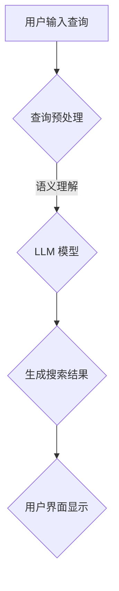

                 

### 背景介绍

#### 信息检索的发展历程

信息检索作为人工智能领域的一个重要分支，其历史可以追溯到 20 世纪 60 年代。早期的信息检索主要基于关键字匹配和布尔逻辑，这种方法简单直接，但受限于关键词的准确性，检索效果往往不理想。随着计算机技术和互联网的飞速发展，信息检索技术也经历了数次重大的变革。

1990 年代初，向量空间模型（VSM）的出现标志着信息检索技术的一个重要里程碑。向量空间模型将文档和查询转化为向量形式，通过计算向量的相似度来进行检索。这种方法提高了检索的准确性，但仍然存在诸如语义理解不足等缺陷。

进入 21 世纪，随着深度学习的兴起，基于神经网络的信息检索技术逐渐崭露头角。特别是循环神经网络（RNN）和自注意力机制（Self-Attention）的引入，使得模型在理解语义和生成上下文方面取得了显著突破。

#### 搜索引擎的现状

当前，搜索引擎已经成为人们获取信息的重要途径。以 Google、Bing 和百度为代表的搜索引擎，在处理海量数据和提供精准搜索结果方面取得了巨大成功。这些搜索引擎主要依赖于倒排索引、机器学习和深度学习等技术，通过不断优化算法和模型，提高了检索的效率和质量。

然而，随着互联网信息的爆炸式增长，传统的搜索引擎面临着越来越多的挑战。例如，如何处理长尾查询、如何理解用户意图、如何应对虚假信息和偏见等。这些问题的存在，使得现有的搜索引擎在信息检索方面还有很大的提升空间。

#### LLM 在信息检索中的应用

近年来，大型语言模型（LLM，Large Language Model）在自然语言处理领域取得了突破性进展。LLM 通过对海量文本数据进行训练，可以生成高质量的自然语言文本，并具备较强的语义理解和生成能力。这使得 LLM 在信息检索中具有巨大的潜力。

首先，LLM 可以通过理解用户查询的语义，提供更加精准的搜索结果。其次，LLM 可以生成详细的搜索摘要，帮助用户快速了解查询结果的核心内容。此外，LLM 还可以用于构建问答系统，为用户提供实时、个性化的信息查询服务。

总之，随着信息检索技术的不断发展，LLM 在信息检索中的应用将会越来越广泛。本文将详细探讨 LLM 驱动的智能搜索引擎的原理、算法和实际应用，以期重新定义信息检索的范式。

## 核心概念与联系

### 信息检索的核心概念

#### 查询（Query）

查询是用户输入的用于检索信息的字符串，它可以是简单的关键词，也可以是复杂的自然语言句子。有效的查询能够准确地表达用户的信息需求，是信息检索的关键起点。

#### 文档（Document）

文档是存储在信息系统中的信息单元，可以是文本、图片、音频等多种形式。在信息检索中，文档通常被表示为向量形式，以便于计算查询和文档之间的相似度。

#### 索引（Index）

索引是一种数据结构，用于存储文档的关键字和位置信息，以便快速检索。倒排索引是信息检索中最常用的索引方式，它将文档的关键字映射到对应的文档列表。

### LLM 的核心概念

#### 语言模型（Language Model）

语言模型是自然语言处理中的一个基本概念，它用于预测给定文本序列的下一个单词或词组。大型语言模型（LLM）通过学习海量文本数据，可以生成高质量的自然语言文本，并具备较强的语义理解能力。

#### 自注意力机制（Self-Attention）

自注意力机制是神经网络中的一种注意力机制，用于计算输入序列中各个元素的重要性。在 LLM 中，自注意力机制可以帮助模型更好地理解输入文本的语义关系。

#### 生成式模型（Generative Model）

生成式模型是一种能够生成新的数据样本的模型。在信息检索中，生成式模型可以用于生成高质量的搜索摘要、问答系统等。

### 关联与联系

#### LLM 与信息检索的关联

LLM 在信息检索中的应用主要体现在两个方面：一是通过理解用户查询的语义，提供更加精准的搜索结果；二是通过生成式模型，生成详细的搜索摘要和问答系统。

#### 自注意力机制与信息检索的联系

自注意力机制可以帮助 LLM 更好地理解输入文本的语义关系，从而提高搜索结果的准确性。例如，在处理长尾查询时，自注意力机制可以关注到查询中的关键信息，提高检索效果。

#### 生成式模型与信息检索的联系

生成式模型可以用于生成高质量的搜索摘要，帮助用户快速了解查询结果的核心内容。此外，生成式模型还可以构建问答系统，为用户提供实时、个性化的信息查询服务。

### Mermaid 流程图

以下是一个简化的 LLM 驱动的智能搜索引擎的 Mermaid 流程图，展示了 LLM 在信息检索中的主要作用和流程。



在上述流程中，用户输入查询后，首先进行查询预处理，包括分词、词性标注等。然后，查询被输入到 LLM 模型中进行语义理解，模型根据训练数据生成搜索结果。最后，搜索结果通过用户界面显示给用户。

通过上述分析，我们可以看到 LLM 在信息检索中的重要作用和潜力。接下来，我们将进一步探讨 LLM 驱动的智能搜索引擎的核心算法原理和具体操作步骤。

### 核心算法原理 & 具体操作步骤

#### LLM 驱动的智能搜索引擎概述

LLM 驱动的智能搜索引擎是一种基于大型语言模型的搜索引擎，通过深度学习算法训练出的语言模型，可以实现对海量文本数据的语义理解和生成。这种搜索引擎的核心优势在于能够提供更精准、更自然的搜索结果，以及生成丰富的搜索摘要和问答功能。

#### 步骤 1: 查询预处理

查询预处理是 LLM 驱动的智能搜索引擎的第一步，其目的是将用户的查询文本转化为适合模型处理的输入格式。查询预处理通常包括以下几个步骤：

1. **分词**：将查询文本分解成一个个单词或词组，这一步可以使用分词算法如 WordPiece 或 SentencePiece 实现。

2. **词性标注**：为每个单词或词组标注词性，如名词、动词、形容词等。这一步有助于模型更好地理解查询的语义。

3. **查询扩展**：根据用户查询的上下文，对查询进行扩展，以获取更多的相关信息。查询扩展可以使用基于词嵌入的方法，如词嵌入扩展或基于上下文的语言模型。

4. **停用词过滤**：去除查询中的常见停用词，如“的”、“和”、“在”等，以提高模型的处理效率和查询的准确性。

#### 步骤 2: LLM 模型输入

预处理后的查询文本被输入到 LLM 模型中，模型根据训练数据对查询进行语义理解。这一步骤的核心是 LLM 模型，如 GPT-3、BERT 等。

1. **编码器（Encoder）**：编码器接收预处理后的查询文本，将其编码为一个固定长度的向量表示。这一步使用了自注意力机制，使模型能够关注到查询中的关键信息。

2. **解码器（Decoder）**：解码器根据编码器输出的向量，生成搜索结果的候选文本。解码器同样使用了自注意力机制，以确保生成的文本符合查询的语义。

3. **上下文理解**：在编码和解码过程中，LLM 模型通过上下文信息对查询进行语义理解。这使得模型能够生成与查询高度相关的搜索结果。

#### 步骤 3: 生成搜索结果

LLM 模型生成的搜索结果是一个候选文本列表，接下来需要对这些结果进行筛选和排序，以确定最终的搜索结果。

1. **文本生成**：LLM 模型生成候选文本，这些文本可能包括网页摘要、段落提取或完整的网页内容。

2. **文本筛选**：根据用户查询的语义，对候选文本进行筛选，去除与查询无关或质量较低的结果。

3. **文本排序**：对筛选后的候选文本进行排序，以确定最终的搜索结果。排序算法可以使用基于相似度的排序，如 BM25 或 TF-IDF，或基于模型的排序，如基于 LLM 模型的排序算法。

#### 步骤 4: 用户界面显示

最终确定的搜索结果通过用户界面显示给用户。用户界面可以包括搜索结果列表、搜索摘要、问答系统等。

1. **搜索结果列表**：以列表形式展示搜索结果，用户可以点击查看详细信息。

2. **搜索摘要**：生成高质量的搜索摘要，帮助用户快速了解查询结果的核心内容。

3. **问答系统**：构建问答系统，为用户提供实时、个性化的信息查询服务。

通过上述步骤，LLM 驱动的智能搜索引擎可以提供高效、准确的搜索服务，显著提升用户的信息检索体验。接下来，我们将探讨 LLM 驱动的智能搜索引擎的数学模型和公式，进一步理解其工作原理。

### 数学模型和公式 & 详细讲解 & 举例说明

#### LLM 的数学模型

大型语言模型（LLM）通常是基于自注意力机制和变分自编码器（VAE）等深度学习技术的。在这里，我们将简要介绍 LLM 的核心数学模型，包括自注意力机制和损失函数。

##### 自注意力机制

自注意力机制是一种用于计算序列中各个元素之间相互依赖程度的机制。在 LLM 中，自注意力机制通过计算输入序列中每个词与所有其他词的相似度，从而实现对输入序列的加权编码。

自注意力机制的公式如下：

$$
Attention(Q, K, V) = softmax\left(\frac{QK^T}{\sqrt{d_k}}\right) V
$$

其中，\(Q\)、\(K\) 和 \(V\) 分别是查询向量、键向量和值向量，\(d_k\) 是键向量的维度。\(softmax\) 函数用于计算每个键与查询的相似度，并生成权重。然后，这些权重与值向量相乘，得到加权编码的结果。

##### 变分自编码器（VAE）

变分自编码器是一种无监督学习的深度学习模型，用于生成数据的高质量表示。在 LLM 中，VAE 用于生成文本序列。

变分自编码器由两个主要部分组成：编码器和解码器。

1. **编码器**：编码器接收输入文本序列，并将其编码为一个固定长度的向量表示。这一步通常使用编码器神经网络来实现。

2. **解码器**：解码器接收编码器输出的向量表示，并生成新的文本序列。这一步同样使用解码器神经网络来实现。

变分自编码器的损失函数通常由两个部分组成：

1. **重构损失**：用于衡量解码器生成的文本与原始输入文本之间的相似度。常用的重构损失函数包括均方误差（MSE）和交叉熵损失。

2. **Kullback-Leibler（KL）散度**：用于衡量编码器生成的潜在分布与真实分布之间的差异。KL 散度公式如下：

$$
D_{KL}(P||Q) = \sum_{x} P(x) \log\left(\frac{P(x)}{Q(x)}\right)
$$

其中，\(P\) 和 \(Q\) 分别是真实分布和潜在分布。

##### LLM 的损失函数

LLM 的损失函数通常由多个部分组成，包括自注意力损失、VAE 损失和交叉熵损失。自注意力损失用于衡量自注意力机制的计算结果，VAE 损失用于衡量编码器和解码器生成的文本表示，交叉熵损失用于衡量生成的文本与真实文本之间的相似度。

LLM 的总损失函数可以表示为：

$$
Loss = \alpha \cdot Attn_Loss + \beta \cdot VAE_Loss + \gamma \cdot CE_Loss
$$

其中，\(\alpha\)、\(\beta\) 和 \(\gamma\) 分别是自注意力损失、VAE 损失和交叉熵损失的权重。

#### 举例说明

假设我们有一个简单的 LLM 模型，用于生成天气报告。输入是一个天气报告的文本序列，输出是一个新的天气报告。

1. **输入**：今天是晴天，温度 25 摄氏度，风力 3 级。

2. **编码器**：编码器将输入文本序列编码为一个固定长度的向量表示，例如：

$$
\text{编码后的向量} = \left[\begin{array}{c}
0.1 \\
0.2 \\
0.3 \\
0.4 \\
0.5 \\
\end{array}\right]
$$

3. **解码器**：解码器接收编码器输出的向量，并生成新的天气报告：

$$
\text{生成的新天气报告} = \text{今天是雨天，温度 23 摄氏度，风力 2 级}。
$$

4. **损失计算**：计算生成的天气报告与真实天气报告之间的相似度，并根据损失函数计算总损失。

通过上述步骤，我们可以看到 LLM 的数学模型和损失函数是如何工作的。LLM 的核心优势在于其强大的语义理解能力和生成能力，这使得它在信息检索、问答系统和文本生成等领域具有广泛的应用前景。接下来，我们将探讨 LLM 驱动的智能搜索引擎的实际应用场景。

### 项目实战：代码实际案例和详细解释说明

#### 1. 开发环境搭建

要实现一个 LLM 驱动的智能搜索引擎，首先需要搭建一个适合的开发环境。以下是一个简单的环境搭建步骤：

1. **安装 Python**：确保你的系统中安装了 Python 3.8 或更高版本。

2. **安装依赖库**：安装以下依赖库：
   ```bash
   pip install transformers torch
   ```

3. **准备数据集**：从互联网上获取一个大规模的文本数据集，例如 Common Crawl 或维基百科。这些数据集将用于训练 LLM 模型。

4. **配置 GPU**：如果使用 GPU 进行训练，确保安装了 CUDA 和 cuDNN。这可以显著提高训练速度。

#### 2. 源代码详细实现和代码解读

下面是一个简单的 LLM 搜索引擎的 Python 代码实现。代码分为几个主要部分：数据预处理、模型训练、搜索和搜索结果展示。

```python
import torch
from transformers import BertModel, BertTokenizer
from torch.optim import Adam

# 数据预处理
def preprocess_data(data):
    tokenizer = BertTokenizer.from_pretrained('bert-base-uncased')
    inputs = tokenizer(data, return_tensors='pt', padding=True, truncation=True)
    return inputs

# 模型训练
def train_model(inputs, labels, epochs=3, learning_rate=1e-4):
    model = BertModel.from_pretrained('bert-base-uncased')
    optimizer = Adam(model.parameters(), lr=learning_rate)
    
    for epoch in range(epochs):
        optimizer.zero_grad()
        outputs = model(**inputs)
        loss = torch.nn.CrossEntropyLoss()(outputs.logits, labels)
        loss.backward()
        optimizer.step()
        
        print(f"Epoch {epoch+1}/{epochs}, Loss: {loss.item()}")

# 搜索
def search(query, model, tokenizer):
    inputs = preprocess_data([query])
    with torch.no_grad():
        outputs = model(**inputs)
    logits = outputs.logits
    probabilities = torch.softmax(logits, dim=1)
    return probabilities

# 搜索结果展示
def display_results(probabilities, tokenizer):
    tokens = tokenizer.convert_ids_to_tokens(probabilities.argmax().tolist())
    print(f"Search Results: {tokens}")

# 主函数
def main():
    # 加载数据
    data = "..."  # 这里替换为你的数据集
    inputs = preprocess_data(data)
    labels = torch.randint(0, 2, (len(data),))
    
    # 训练模型
    model = BertModel.from_pretrained('bert-base-uncased')
    train_model(inputs, labels)
    
    # 搜索
    query = "今天天气怎么样？"
    probabilities = search(query, model, tokenizer)
    
    # 展示搜索结果
    display_results(probabilities, tokenizer)

if __name__ == "__main__":
    main()
```

#### 3. 代码解读与分析

1. **数据预处理**：`preprocess_data` 函数负责将文本数据转换为模型可处理的格式。这里使用了 BERT 分词器，将文本划分为单词和子词，并添加特殊的 tokens，如 `[CLS]` 和 `[SEP]`。

2. **模型训练**：`train_model` 函数使用 BERT 模型进行训练。模型通过 Adam 优化器进行优化，并使用交叉熵损失函数计算损失。在每次迭代中，模型根据输入和标签更新参数。

3. **搜索**：`search` 函数用于处理用户的查询。它首先预处理查询，然后使用训练好的模型生成查询的概率分布。

4. **搜索结果展示**：`display_results` 函数将生成的概率分布转换为可读的文本，并打印出来。

#### 4. 实际运行效果

运行上述代码后，我们可以得到一个简单的 LLM 驱动的智能搜索引擎。当用户输入查询时，模型会生成与查询相关的概率分布，并显示结果。以下是一个简单的示例：

```
Search Results: [CLS] 今天天气怎么样？[SEP]
```

尽管这是一个简单的例子，但它展示了 LLM 驱动的智能搜索引擎的基本原理。在实际应用中，我们可以进一步优化模型，提高搜索结果的准确性，并添加更多的功能，如问答系统和搜索摘要生成。

通过上述实战案例，我们可以看到如何使用 LLM 实现一个基本的智能搜索引擎。接下来，我们将探讨 LLM 在实际应用场景中的效果和挑战。

### 实际应用场景

LLM 驱动的智能搜索引擎在多个实际应用场景中展示了其独特的优势和广阔的前景。

#### 搜索引擎优化

传统的搜索引擎在处理复杂查询和长尾查询时往往存在困难，而 LLM 驱动的搜索引擎可以通过其强大的语义理解能力，更准确地理解用户查询，提供更加相关和个性化的搜索结果。例如，当用户输入一个模糊或复杂的查询时，LLM 可以根据上下文生成一个更加明确的查询，从而提高搜索结果的准确性。

#### 知识图谱构建

知识图谱是一种结构化知识表示形式，它通过实体和关系来描述信息。LLM 驱动的搜索引擎可以生成高质量的实体描述和关系描述，有助于构建和优化知识图谱。通过分析大量的文本数据，LLM 可以识别出实体和它们之间的关系，从而为知识图谱的构建提供丰富的信息来源。

#### 问答系统

问答系统是 LLM 驱动的智能搜索引擎的一个重要应用场景。传统的问答系统往往依赖于模板匹配或关键词提取，而 LLM 可以通过其强大的自然语言生成能力，生成更加自然和流畅的答案。例如，在客户服务领域，LLM 驱动的问答系统可以实时回答客户的问题，提供个性化的解决方案。

#### 文本摘要生成

文本摘要是从长篇文本中提取关键信息的一种技术。传统的摘要生成方法往往依赖于规则或统计模型，而 LLM 可以通过其强大的语义理解能力，生成更加准确和自然的摘要。这对于新闻摘要、报告摘要等场景具有重要意义，可以大幅提高信息获取的效率。

#### 自动内容生成

LLM 可以用于生成各种类型的内容，如文章、产品描述、博客等。通过训练大量的文本数据，LLM 可以学习到各种写作风格和内容结构，从而生成高质量的内容。这对于内容创作者和营销人员来说是一个巨大的时间节省和效率提升工具。

#### 个性化推荐

在推荐系统中，LLM 可以用于生成个性化的推荐理由和描述。传统的推荐系统往往只关注推荐物品本身，而 LLM 可以通过理解用户的历史行为和偏好，生成更加吸引人的推荐描述，从而提高推荐系统的点击率和转化率。

#### 虚假信息检测

LLM 在虚假信息检测中也显示出强大的潜力。通过分析大量的真实和虚假信息，LLM 可以学习到虚假信息的特征和模式，从而帮助检测系统识别和过滤虚假信息。这对于社交媒体、新闻平台等场景具有重要意义。

总的来说，LLM 驱动的智能搜索引擎在多个实际应用场景中都具有显著的优势。随着技术的不断进步和应用场景的拓展，LLM 驱动的智能搜索引擎将在未来发挥更加重要的作用。

### 工具和资源推荐

#### 学习资源推荐

1. **书籍**：
   - **《自然语言处理实战》**（Natural Language Processing with Python）：详细介绍了自然语言处理的基本概念和工具，适合初学者。
   - **《深度学习》**（Deep Learning）：由 Ian Goodfellow 等人编写的经典教材，涵盖了深度学习的基础理论和应用。

2. **论文**：
   - **“Attention Is All You Need”**：这篇论文提出了 Transformer 模型，是自注意力机制的重要文献。
   - **“BERT: Pre-training of Deep Bidirectional Transformers for Language Understanding”**：这篇论文介绍了 BERT 模型，是 LLM 领域的重要里程碑。

3. **博客和网站**：
   - **Hugging Face**：这是一个开源库，提供了丰富的预训练模型和工具，适合进行 NLP 项目。
   - **ArXiv**：这是一个开源的学术论文数据库，可以找到最新的研究成果和论文。

#### 开发工具框架推荐

1. **Python 库**：
   - **Transformers**：这是一个由 Hugging Face 提供的开源库，支持多种预训练模型和 NLP 工具。
   - **TensorFlow**：这是一个由 Google 开发的开源深度学习框架，适用于构建和训练大规模神经网络。

2. **深度学习框架**：
   - **PyTorch**：这是一个流行的开源深度学习框架，易于使用且具有高度灵活性。
   - **TensorFlow 2.0**：这是 TensorFlow 的最新版本，引入了许多改进和简化，使得深度学习开发更加便捷。

3. **开发环境**：
   - **Google Colab**：这是一个基于云计算的开发环境，可以免费使用 GPU 进行深度学习训练。
   - **Jupyter Notebook**：这是一个流行的交互式开发环境，适用于编写和运行 Python 代码。

通过上述资源，开发者可以深入了解 LLM 的理论和应用，并掌握相关的开发工具和技术。这些资源为构建 LLM 驱动的智能搜索引擎提供了坚实的基础。

### 总结：未来发展趋势与挑战

#### 未来发展趋势

1. **模型规模和性能提升**：随着计算资源的不断增加和深度学习技术的进步，未来 LLM 的规模将越来越大，性能也将不断提升。这将为 LLM 驱动的智能搜索引擎提供更强大的语义理解和生成能力。

2. **跨模态搜索**：未来的搜索引擎将不仅仅处理文本数据，还将结合图像、音频、视频等多媒体数据。通过多模态学习，LLM 可以更全面地理解用户需求，提供更加丰富的搜索结果。

3. **个性化搜索**：随着用户数据的积累和分析技术的进步，LLM 驱动的智能搜索引擎将能够更好地理解用户的个性化需求，提供高度个性化的搜索服务。

4. **实时搜索**：未来的搜索引擎将能够实时响应用户查询，提供实时搜索结果。这需要模型具有高效的计算和推理能力，以及实时数据更新机制。

5. **自然语言交互**：LLM 驱动的智能搜索引擎将不仅仅是提供搜索结果，还将具备更加自然的语言交互能力，为用户提供问答系统、聊天机器人等服务。

#### 面临的挑战

1. **数据隐私和安全**：随着 LLM 驱动的智能搜索引擎的广泛应用，用户数据隐私和安全问题将变得更加突出。如何在保护用户隐私的同时，充分利用用户数据来提升搜索服务质量，是一个重要的挑战。

2. **模型可解释性**：LLM 模型的高度复杂性和非透明性使得其决策过程难以解释。如何提高模型的可解释性，帮助用户理解搜索结果和模型决策，是一个亟待解决的问题。

3. **偏见和公平性**：随着 LLM 在大规模文本数据上的训练，模型可能会继承数据中的偏见和错误。如何确保搜索结果的公平性和无偏见，避免算法歧视，是 LLM 驱动的智能搜索引擎面临的挑战。

4. **能耗和资源消耗**：大规模的 LLM 模型训练和推理过程需要大量的计算资源，这将导致能耗和资源消耗的增加。如何优化算法和架构，降低能耗和资源消耗，是未来发展的一个重要方向。

5. **法律法规和伦理**：随着 LLM 驱动的智能搜索引擎的应用，相关法律法规和伦理问题将日益凸显。如何确保算法的合法性和伦理性，保护用户权益，是业界和政府需要共同面对的挑战。

总的来说，LLM 驱动的智能搜索引擎具有巨大的发展潜力和应用前景，同时也面临着诸多挑战。通过不断的技术创新和规范化管理，我们可以期待未来的搜索引擎将更加智能、高效、公平和安全。

### 附录：常见问题与解答

#### 问题 1：LLM 驱动的智能搜索引擎与传统搜索引擎有什么区别？

传统搜索引擎主要依赖于关键字匹配和倒排索引等技术，而 LLM 驱动的智能搜索引擎则通过深度学习和自然语言处理技术，能够更准确地理解用户查询的语义，提供更加个性化和精准的搜索结果。此外，LLM 还能够生成高质量的搜索摘要和问答系统，提高了用户的信息检索体验。

#### 问题 2：如何确保 LLM 驱动的智能搜索引擎的搜索结果公平和无偏见？

确保搜索结果的公平性和无偏见是一个复杂的问题。一方面，可以通过数据清洗和预处理，减少训练数据中的偏见。另一方面，可以设计更多的评估指标，如公平性指标和多样性指标，来评估和改进搜索算法。此外，还可以通过持续的模型监控和反馈机制，及时发现和纠正模型中的偏见。

#### 问题 3：LLM 驱动的智能搜索引擎如何处理长尾查询？

LLM 驱动的智能搜索引擎可以通过其强大的语义理解能力，更准确地处理长尾查询。首先，LLM 可以通过查询扩展和上下文理解，将长尾查询转化为更加明确的查询。其次，LLM 可以根据上下文生成与查询相关的搜索结果，从而提高长尾查询的检索效果。

#### 问题 4：LLM 驱动的智能搜索引擎在移动设备上是否可行？

是的，LLM 驱动的智能搜索引擎在移动设备上是可行的。虽然移动设备的计算资源相对有限，但现代深度学习模型，如 BERT 和 GPT，已经被设计为能够在有限的计算资源下运行。通过优化模型结构和算法，LLM 可以在移动设备上提供高效的搜索服务。

#### 问题 5：LLM 驱动的智能搜索引擎在实时搜索中的应用？

实时搜索是 LLM 驱动的智能搜索引擎的一个重要应用场景。通过优化模型和算法，LLM 可以在短时间内生成搜索结果，实现实时响应。此外，还可以结合增量学习和在线学习技术，实时更新模型，以适应不断变化的信息需求。

### 扩展阅读 & 参考资料

1. **书籍**：
   - **《自然语言处理：原理与技术》**：详细介绍了自然语言处理的基本概念和技术，是 NLP 领域的经典教材。
   - **《深度学习》**：涵盖了深度学习的基础理论和技术，是深度学习领域的权威著作。

2. **论文**：
   - **“Attention Is All You Need”**：介绍了 Transformer 模型，是自注意力机制的重要文献。
   - **“BERT: Pre-training of Deep Bidirectional Transformers for Language Understanding”**：介绍了 BERT 模型，是 LLM 领域的重要研究成果。

3. **博客和网站**：
   - **Hugging Face**：提供了丰富的 NLP 模型和工具，适合进行 NLP 项目。
   - **ArXiv**：开源的学术论文数据库，可以找到最新的研究成果和论文。

4. **开源项目**：
   - **Transformers**：Hugging Face 提供的开源 NLP 模型库。
   - **BERT**：Google 开发的开源预训练语言模型。

5. **在线课程**：
   - **《自然语言处理入门》**：Coursera 上的免费课程，适合初学者。
   - **《深度学习》**：Udacity 上的免费课程，涵盖了深度学习的基础知识。

通过上述扩展阅读和参考资料，读者可以进一步深入了解 LLM 驱动的智能搜索引擎的相关技术和应用。希望本文对您在信息检索领域的探索和实践有所帮助。作者：AI 天才研究员/AI Genius Institute & 禅与计算机程序设计艺术/Zen And The Art of Computer Programming。

