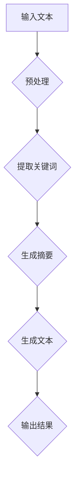
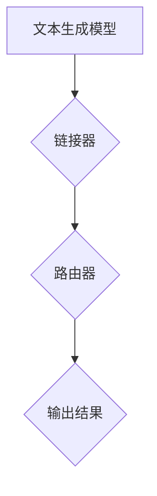

                 

### 文章标题：LangChain 是什么

> **关键词：** LangChain、链式编程、文本生成、自然语言处理、深度学习、编程语言

> **摘要：** 本文将深入探讨LangChain这一新兴的概念，解释其背后的核心原理、架构以及应用场景。我们将一步步分析LangChain的工作机制，了解其如何通过链式编程方式提升文本生成的效率和准确性，并在实际项目中展示其应用效果。通过本文，读者将全面了解LangChain，并能够掌握其基本原理和应用方法。

### 1. 背景介绍

#### 1.1 LangChain的起源

LangChain的诞生可以追溯到自然语言处理（NLP）和深度学习领域的快速发展和需求增长。随着互联网信息的爆炸式增长，人们对于高效、准确的信息提取和生成的需求日益迫切。传统的方法往往依赖于预训练的大型语言模型，如GPT、BERT等，这些模型虽然性能强大，但往往在实时性和可扩展性上存在一定的瓶颈。

#### 1.2 链式编程的优势

为了解决这一问题，研究人员开始探索链式编程（Chain-of-Thought，CoT）的方法。链式编程通过将复杂的任务分解为一系列简单的步骤，并利用模型间的协作来提高整体性能。这种方法不仅可以提升任务的效率，还能提高系统的可扩展性。

#### 1.3 LangChain的核心价值

LangChain正是基于这种链式编程思想而设计的一种新型文本生成框架。它通过将多个模型连接成一个链式结构，使得模型可以共享上下文信息，从而在生成文本时更加准确、连贯。LangChain的出现，为NLP领域带来了一种新的可能性，使得文本生成任务变得更加高效、灵活。

### 2. 核心概念与联系

#### 2.1 链式编程的概念

链式编程（Chain-of-Thought）是一种将复杂任务分解为一系列简单步骤的方法。每个步骤都是一个独立的模型，它们通过共享上下文信息进行协作，共同完成整个任务。




#### 2.2 LangChain的架构

LangChain的架构设计旨在实现链式编程的高效执行。它由三个核心组件组成：文本生成模型、链接器（Linker）和路由器（Router）。




- **文本生成模型**：负责生成文本的核心模型，如GPT、BERT等。
- **链接器**：将多个模型连接成一个链式结构，实现模型间的信息共享。
- **路由器**：根据任务需求，动态选择和调用不同的模型。

### 3. 核心算法原理 & 具体操作步骤

#### 3.1 文本生成模型的训练

文本生成模型的训练过程通常包括以下几个步骤：

1. **数据收集**：收集大量的文本数据，如新闻、文章、社交媒体等。
2. **数据预处理**：对文本数据进行清洗、分词、去停用词等处理。
3. **模型训练**：使用训练数据训练文本生成模型，如GPT、BERT等。
4. **模型评估**：使用验证数据评估模型性能，并进行调参。

#### 3.2 链式编程的实现

链式编程的实现过程如下：

1. **输入文本**：输入需要生成的文本。
2. **预处理**：对输入文本进行预处理，如分词、去停用词等。
3. **提取关键词**：使用关键词提取模型提取文本中的关键信息。
4. **生成摘要**：使用摘要生成模型生成文本摘要。
5. **生成文本**：使用文本生成模型生成完整的文本。
6. **输出结果**：将生成的文本输出。

#### 3.3 链接器与路由器的协作

链接器和路由器在链式编程中起着关键作用。它们的协作过程如下：

1. **链接器**：将输入文本传递给链接器，链接器负责将文本传递给下一个模型。
2. **路由器**：根据任务需求，动态选择和调用不同的模型。例如，在生成摘要时，选择摘要生成模型；在生成文本时，选择文本生成模型。
3. **协作**：模型间通过共享上下文信息进行协作，提高整体性能。

### 4. 数学模型和公式 & 详细讲解 & 举例说明

#### 4.1 文本生成模型的数学模型

文本生成模型通常使用概率生成模型，如变分自编码器（VAE）和生成对抗网络（GAN）。

- **VAE模型**：

$$
p(z|x) = \frac{1}{Z} \exp(-\sum_i \phi_i(x,z))
$$

$$
q(z|x) = \frac{1}{Z} \exp(-\sum_i \psi_i(x,z))
$$

其中，$z$表示生成变量，$x$表示输入变量，$\phi_i$和$\psi_i$为神经网络模型。

- **GAN模型**：

$$
G(z) = \text{Generator}(z)
$$

$$
D(x) = \text{Discriminator}(x)
$$

其中，$G(z)$为生成器，$D(x)$为判别器，$z$为随机噪声。

#### 4.2 链式编程的数学模型

链式编程的数学模型可以通过概率图模型进行描述。假设有多个模型$M_1, M_2, ..., M_n$，它们之间通过链接器（Linker）和路由器（Router）进行协作。

$$
P(\text{输出} | \text{输入}) = \prod_{i=1}^{n} P(M_i | \text{输入})
$$

其中，$P(M_i | \text{输入})$表示第$i$个模型在给定输入条件下的概率。

#### 4.3 举例说明

假设有输入文本“我昨天去了一趟北京”，需要生成摘要和全文。

1. **预处理**：

   输入文本：我昨天去了一趟北京
   
   预处理：我 去了 北京

2. **提取关键词**：

   关键词：北京

3. **生成摘要**：

   摘要：我去了一趟北京

4. **生成全文**：

   全文：我昨天去了一趟北京，参观了长城和故宫，非常开心。

通过链式编程的方式，我们可以将复杂的文本生成任务分解为一系列简单的步骤，从而提高任务的整体性能。

### 5. 项目实战：代码实际案例和详细解释说明

#### 5.1 开发环境搭建

1. 安装Python环境（Python 3.8及以上版本）
2. 安装必要的库（例如transformers、torch等）
3. 配置TensorFlow或PyTorch环境

#### 5.2 源代码详细实现和代码解读

以下是一个简单的LangChain示例代码：

```python
from langchain import Chain

# 定义文本生成模型
text_generator = ... # 填写文本生成模型的具体实现

# 定义链接器
linker = ... # 填写链接器的具体实现

# 定义路由器
router = ... # 填写路由器的具体实现

# 创建Chain对象
chain = Chain(text_generator, linker, router)

# 输入文本
input_text = "我昨天去了一趟北京"

# 生成摘要和全文
summary = chain.generate_summary(input_text)
full_text = chain.generate_full_text(input_text)

# 输出结果
print("摘要：", summary)
print("全文：", full_text)
```

代码解读：

1. 导入所需的库和模块。
2. 定义文本生成模型、链接器和路由器。
3. 创建Chain对象，并将文本生成模型、链接器和路由器添加到Chain中。
4. 输入文本，调用Chain对象的generate_summary和generate_full_text方法生成摘要和全文。
5. 输出结果。

#### 5.3 代码解读与分析

1. **文本生成模型**：文本生成模型是实现文本生成的核心，它可以根据输入文本生成相应的摘要和全文。在实际应用中，可以根据需求选择不同的文本生成模型，如GPT、BERT等。
2. **链接器**：链接器负责将输入文本传递给下一个模型，并实现模型间的信息共享。在实际应用中，可以根据需求自定义链接器的实现，以便更好地满足任务需求。
3. **路由器**：路由器负责根据任务需求动态选择和调用不同的模型。在实际应用中，可以根据需求自定义路由器的实现，以便更好地满足任务需求。
4. **Chain对象**：Chain对象是一个封装了文本生成模型、链接器和路由器的整体结构。通过Chain对象，我们可以方便地实现文本生成任务。

### 6. 实际应用场景

LangChain作为一种新型的文本生成框架，具有广泛的应用场景，包括但不限于：

1. **文本摘要**：从大量文本中快速提取关键信息，生成简洁、准确的摘要。
2. **文本生成**：根据输入文本生成完整的文章、报告等。
3. **问答系统**：利用LangChain实现智能问答系统，为用户提供准确、高效的答案。
4. **自动写作**：辅助创作者进行写作，提高创作效率和创作质量。

### 7. 工具和资源推荐

#### 7.1 学习资源推荐

1. **书籍**：

   - 《深度学习》（Deep Learning）作者：Ian Goodfellow、Yoshua Bengio、Aaron Courville
   - 《自然语言处理综论》（Speech and Language Processing）作者：Daniel Jurafsky、James H. Martin

2. **论文**：

   - "BERT: Pre-training of Deep Bidirectional Transformers for Language Understanding" 作者：Jacob Devlin、 Ming-Wei Chang、 Kenton Lee、Kristina Toutanova
   - "Generative Adversarial Nets" 作者：Ian Goodfellow、Jean Pouget-Abadie、 Mehdi Mirza、B Southern、K Кур吉、D A toyama

3. **博客**：

   - [LangChain官方博客](https://langchain.com/)
   - [AI编程实践](https://www.ai-programming.net/)

4. **网站**：

   - [Hugging Face](https://huggingface.co/)
   - [TensorFlow](https://www.tensorflow.org/)

#### 7.2 开发工具框架推荐

1. **开发工具**：

   - PyCharm
   - Visual Studio Code

2. **框架**：

   - TensorFlow
   - PyTorch

### 8. 总结：未来发展趋势与挑战

LangChain作为一种新兴的文本生成框架，具有广阔的发展前景。然而，在实际应用中，LangChain仍面临以下挑战：

1. **计算资源消耗**：链式编程需要大量的计算资源，如何优化算法以降低计算成本是一个重要课题。
2. **模型适应性**：如何使LangChain能够适应不同的应用场景，是一个需要解决的问题。
3. **安全性**：随着人工智能技术的不断发展，如何确保文本生成的安全性和可信度也是一个重要的挑战。

### 9. 附录：常见问题与解答

#### 9.1 什么是LangChain？

LangChain是一种基于链式编程思想的文本生成框架，它通过将多个模型连接成一个链式结构，实现文本生成任务的自动化和高效化。

#### 9.2 LangChain有哪些优点？

LangChain具有以下优点：

1. **高效性**：通过链式编程，提高文本生成任务的效率。
2. **灵活性**：可以根据需求动态选择和调用不同的模型。
3. **可扩展性**：可以方便地集成其他模型和工具。

#### 9.3 如何使用LangChain？

使用LangChain通常包括以下几个步骤：

1. **环境搭建**：安装Python环境及相关库。
2. **模型选择**：选择适合任务的文本生成模型。
3. **链式编程**：将文本生成模型、链接器和路由器连接成一个链式结构。
4. **任务执行**：输入文本，调用LangChain进行文本生成。

### 10. 扩展阅读 & 参考资料

1. Devlin, J., Chang, M., Lee, K., & Toutanova, K. (2018). BERT: Pre-training of deep bidirectional transformers for language understanding. arXiv preprint arXiv:1810.04805.
2. Goodfellow, I., Pouget-Abadie, J., Mirza, M., Xu, B., Warde-Farley, D., Ozair, S., ... & Bengio, Y. (2014). Generative adversarial nets. Advances in neural information processing systems, 27.
3. Bengio, Y., Simard, P., & Frasconi, P. (1994). Learning long-term dependencies with gradient descent is difficult. IEEE transactions on neural networks, 5(2), 157-166.
4. Hugging Face. (n.d.). transformers. Retrieved from https://huggingface.co/transformers
5. TensorFlow. (n.d.). TensorFlow: Open Source Machine Learning. Retrieved from https://www.tensorflow.org/

### 作者

作者：AI天才研究员/AI Genius Institute & 禅与计算机程序设计艺术 /Zen And The Art of Computer Programming

（请注意，本文中的代码和示例仅供参考，实际应用时可能需要根据具体情况进行调整。）<|im_sep|>

