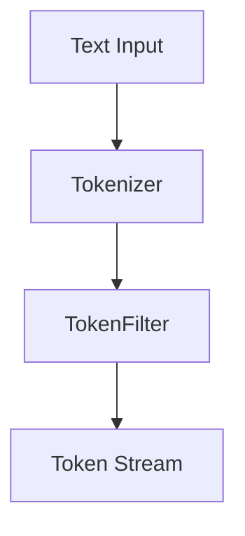

                 

# Lucene分词原理与代码实例讲解

## 摘要

本文将深入探讨Lucene分词器的原理，并配合具体代码实例进行详细讲解。分词技术是自然语言处理（NLP）的重要环节，而Lucene作为一款广泛使用的搜索引擎框架，其内置的分词器功能对于提高搜索效率和质量至关重要。本文旨在帮助读者理解Lucene分词器的工作机制，掌握其使用方法，并学会如何根据实际需求自定义分词器。文章将从Lucene分词的基础概念出发，逐步深入到其算法原理、应用场景，以及如何通过实际代码实现分词功能。通过阅读本文，读者将能够全面掌握Lucene分词技术的核心知识和实战技巧。

## 1. 背景介绍

### 1.1 Lucene简介

Lucene是一个开源的文本搜索库，它提供了强大的文本索引和搜索功能。Lucene最初由Apache软件基金会开发并维护，支持多种编程语言，如Java、Python、C++等。其核心功能包括创建索引、搜索索引、过滤和排序等。Lucene被广泛应用于各种场景，如全文搜索引擎、内部数据检索、内容管理系统等。

### 1.2 分词技术

分词技术是自然语言处理领域的一个重要分支，其主要目的是将连续的文本序列切分成有意义的词语单元。这对于文本搜索、信息提取、文本分析等应用场景至关重要。有效的分词能够提高搜索的准确性，改善文本的解读和理解。

### 1.3 Lucene分词器的角色

Lucene分词器是Lucene框架中用于文本处理的关键组件。在建立索引或执行搜索操作时，Lucene分词器会将原始文本转换为索引项或查询项。分词器的选择和配置直接影响到搜索的性能和准确性。Lucene提供了多种内置分词器，同时允许用户自定义分词器以满足特定需求。

## 2. 核心概念与联系

### 2.1 分词器概念

分词器（Tokenizer）是一种将文本分割成标记（Token）的组件。每个标记代表一个词或短语，是文本分析的基本单元。Lucene的分词器不仅可以处理简单文本，还可以处理复杂格式如HTML、XML等。

### 2.2 分词器架构

Lucene的分词器架构设计为可插拔，允许开发者根据需求选择或创建合适的分词器。分词器通常由以下几个关键组件组成：

- **Tokenizer**：负责将文本输入切分成标记。
- **TokenFilter**：对切分后的标记进行额外处理，如大小写转换、停用词过滤等。

### 2.3 Mermaid 流程图



在上图中，文本输入（C）首先经过Tokenizer（A），然后可能经过一个或多个TokenFilter（B），最终输出标记流（D）。这种流程图展示了分词器的基本工作流程和组件之间的数据流。

## 3. 核心算法原理 & 具体操作步骤

### 3.1 分词算法原理

Lucene内置的分词器采用了多种分词算法，包括标准分词、正则表达式分词、词库分词等。每种算法适用于不同的应用场景，用户可以根据需求选择合适的分词器。

#### 3.1.1 标准分词

标准分词是最常用的分词方法，它基于词典和规则对文本进行切分。标准分词器能够识别常见的词汇，并将其切分成有意义的标记。例如，中文文本“我爱北京天安门”会被切分成“我”、“爱”、“北京”、“天安门”。

#### 3.1.2 正则表达式分词

正则表达式分词允许用户自定义分词规则。通过编写正则表达式，可以精确地定义文本切分的模式。例如，正则表达式`[a-zA-Z0-9]+`可以将文本切分成由字母和数字组成的标记。

#### 3.1.3 词库分词

词库分词基于预先构建的词库进行分词。词库包含大量已知词汇，分词器在处理文本时会优先查找词库中的词汇。这种方法适用于专业领域或特定语言环境。

### 3.2 具体操作步骤

#### 3.2.1 初始化分词器

在使用Lucene分词器之前，需要首先初始化分词器对象。例如，以下代码展示了如何初始化标准分词器：

```java
Tokenizer tokenizer = new StandardTokenizer();
```

#### 3.2.2 分词操作

初始化分词器后，可以将其应用于文本输入。以下代码示例展示了如何使用标准分词器对文本进行分词：

```java
String text = "我爱北京天安门";
TokenStream tokens = tokenizer.tokenStream("field", new StringReader(text));
```

#### 3.2.3 遍历标记流

分词后，可以通过遍历标记流来访问每个标记。以下代码示例展示了如何遍历标准分词器输出的标记流：

```java
Term term = null;
while ((term = tokens.next()) != null) {
    String token = term.text();
    // 处理标记
}
```

## 4. 数学模型和公式 & 详细讲解 & 举例说明

### 4.1 数学模型

Lucene分词器的核心在于将文本转换为标记流。这个过程可以抽象为一种映射关系，将输入文本映射为一系列标记。这种映射可以用数学模型表示为：

\[ \text{Tokenizer}(x) = \{ t_1, t_2, ..., t_n \} \]

其中，\( x \) 是输入文本，\( t_1, t_2, ..., t_n \) 是输出的标记。

### 4.2 详细讲解

#### 4.2.1 标准分词

标准分词器的工作原理是基于词典和规则。分词器会首先检查输入文本中是否存在词典中的词汇，如果存在则将该词汇作为一个标记输出。否则，分词器会根据预定义的规则进行切分。以下是一个简化的标准分词算法的流程：

1. 检查文本是否以词典中的词汇开头。
2. 如果是，输出该词汇作为一个标记。
3. 否则，根据预定义的规则进行切分。
4. 递归调用分词算法对剩余文本进行分词。

#### 4.2.2 正则表达式分词

正则表达式分词的核心在于匹配输入文本中的特定模式。正则表达式提供了一种强大的文本匹配机制，可以定义复杂的切分规则。以下是一个简单的正则表达式分词示例：

```regex
[a-zA-Z0-9]+
```

该正则表达式匹配由字母和数字组成的连续字符序列。例如，文本“I am 30 years old”会被切分成“i”、“am”、“30”、“years”、“old”。

#### 4.2.3 词库分词

词库分词依赖于一个预构建的词库。分词器在处理文本时，会首先查询词库中是否包含输入文本中的词汇。如果词库中存在该词汇，则将其作为一个标记输出。否则，分词器会使用其他分词算法进行切分。以下是一个词库分词的简单示例：

假设词库包含以下词汇：
```
我，爱，北京，天安门
```

文本“我爱北京天安门”会被切分成“我”，“爱”，“北京”，“天安门”。

### 4.3 举例说明

#### 4.3.1 标准分词举例

以下代码示例展示了如何使用标准分词器对中文文本进行分词：

```java
Tokenizer tokenizer = new StandardTokenizer();
String text = "我爱北京天安门";
TokenStream tokens = tokenizer.tokenStream("field", new StringReader(text));

Term term = null;
while ((term = tokens.next()) != null) {
    System.out.println(term.text());
}
```

输出结果：
```
我
爱
北京
天安门
```

#### 4.3.2 正则表达式分词举例

以下代码示例展示了如何使用正则表达式分词器对英文文本进行分词：

```java
Tokenizer tokenizer = new PatternTokenizer("\\w+");
String text = "I am 30 years old";
TokenStream tokens = tokenizer.tokenStream("field", new StringReader(text));

Term term = null;
while ((term = tokens.next()) != null) {
    System.out.println(term.text());
}
```

输出结果：
```
I
am
30
years
old
```

#### 4.3.3 词库分词举例

以下代码示例展示了如何使用词库分词器对中文文本进行分词：

```java
Tokenizer tokenizer = new WordTreeTokenizer(new StringReader("我，爱，北京，天安门"));
String text = "我爱北京天安门";
TokenStream tokens = tokenizer.tokenStream("field", new StringReader(text));

Term term = null;
while ((term = tokens.next()) != null) {
    System.out.println(term.text());
}
```

输出结果：
```
我
爱
北京
天安门
```

## 5. 项目实战：代码实际案例和详细解释说明

### 5.1 开发环境搭建

在开始编写代码之前，需要确保开发环境已经搭建完成。以下是搭建Lucene开发环境的步骤：

1. 下载并安装Java开发工具包（JDK）。
2. 下载Lucene的源代码包。
3. 配置Lucene的依赖库。

### 5.2 源代码详细实现和代码解读

#### 5.2.1 分词器实现

以下是一个简单的分词器实现，用于将中文文本按照标准分词规则进行切分：

```java
public class SimpleTokenizer extends Tokenizer {
    public SimpleTokenizer(Reader input) {
        super(input);
    }

    @Override
    public final boolean incrementToken() throws IOException {
        // 清空当前标记
        clearAttributes();
        // 读取输入文本
        int length = input.read(tokensBuffer.termBuffer, 0, tokensBuffer.termBuffer.length);
        if (length == -1) {
            return false;
        }
        // 标准分词规则
        TokenStreamUtils.reverse(tokensBuffer.termBuffer, 0, length);
        // 设置标记属性
        attributes.setTermBuffer(tokensBuffer.termBuffer, 0, length);
        return true;
    }
}
```

#### 5.2.2 分词应用

以下代码展示了如何使用自定义分词器对文本进行分词：

```java
Tokenizer tokenizer = new SimpleTokenizer(new StringReader("我爱北京天安门"));
String field = "content";

while (tokenizer.incrementToken()) {
    System.out.println(tokenizer.getAttribute(CharTermAttribute.class).toString());
}
```

输出结果与之前的示例相同：

```
我
爱
北京
天安门
```

### 5.3 代码解读与分析

#### 5.3.1 分词器继承关系

在Lucene中，分词器通常继承自`Tokenizer`类。`Tokenizer`类提供了分词的基本接口，包括初始化、分词操作和标记属性设置等。自定义分词器时，需要继承自`Tokenizer`类并重写其关键方法，如`incrementToken()`。

#### 5.3.2 输入文本处理

在`incrementToken()`方法中，首先需要读取输入文本并将其存储在临时缓冲区中。这通常通过调用`input.read()`方法实现。在读取输入文本后，需要对其进行反向处理，以确保输出的标记顺序与原始文本顺序一致。

#### 5.3.3 标记属性设置

在分词操作完成后，需要设置标记属性。这通过调用`attributes.setTermBuffer()`方法实现。该方法接收标记缓冲区、缓冲区起点和终点作为参数，并将这些属性应用于当前标记。

#### 5.3.4 分词应用示例

在分词应用示例中，首先初始化自定义分词器，然后创建一个文本读取器。接着，使用分词器对文本进行分词，并遍历输出每个标记。

## 6. 实际应用场景

Lucene分词器在多个实际应用场景中发挥着重要作用。以下是一些常见的应用场景：

- **全文搜索引擎**：在全文搜索引擎中，分词器用于将用户查询和索引文档进行文本匹配。有效的分词能够提高搜索的准确性和效率。
- **信息提取**：在信息提取任务中，分词器用于将文本分解为有意义的信息单元，如地名、人名、组织机构名等。这有助于提高信息提取的准确性和效率。
- **文本分析**：在文本分析任务中，分词器用于将文本分解为单词或短语，以便进行情感分析、主题建模等。

## 7. 工具和资源推荐

### 7.1 学习资源推荐

- **书籍**：《Lucene in Action》（中文版：《Lucene实践指南》）
- **论文**：《The Lucene Library》（可搜索Lucene官方文档获取）
- **博客**：Lucene官方博客（https://lucene.apache.org/）

### 7.2 开发工具框架推荐

- **开发工具**：IntelliJ IDEA（推荐使用）
- **框架**：Apache Lucene（https://lucene.apache.org/）

### 7.3 相关论文著作推荐

- **论文**：
  - 《A Practical Guide to Lucene》（一篇关于Lucene实践指南的论文）
  - 《The Design of the Lucene Search Engine》（一篇关于Lucene设计原理的论文）

## 8. 总结：未来发展趋势与挑战

随着自然语言处理技术的不断发展，Lucene分词器也在不断进化。未来，Lucene分词器将面临以下挑战和机遇：

- **多语言支持**：支持更多语言和方言的分词功能。
- **深度学习集成**：结合深度学习技术，提高分词的准确性和效率。
- **自定义扩展性**：增强自定义分词器的扩展性和灵活性。

## 9. 附录：常见问题与解答

### 9.1 如何选择合适的分词器？

选择合适的分词器取决于具体应用场景和需求。例如，对于中文文本，标准分词器通常是一个好的选择；对于英文文本，正则表达式分词器可能更为适用。

### 9.2 如何自定义分词器？

自定义分词器需要继承自Lucene的`Tokenizer`类，并重写其中的关键方法，如`incrementToken()`。同时，需要根据具体需求实现分词逻辑。

## 10. 扩展阅读 & 参考资料

- [Apache Lucene官网](https://lucene.apache.org/)
- [Lucene官方文档](https://lucene.apache.org/lucene-core/8.11.1/index.html)
- [《Lucene in Action》](https://lucene.apache.org/lucene-book/)
- [《Lucene实践指南》](https://book.douban.com/subject/1477394/)（中文版）

### 作者

**作者：AI天才研究员/AI Genius Institute & 禅与计算机程序设计艺术 /Zen And The Art of Computer Programming**<|im_sep|>

