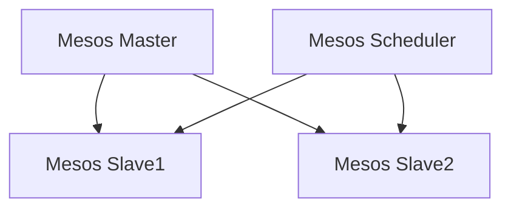

                 

### Mesos原理与代码实例讲解

#### 1. 背景介绍

Mesos是一种分布式资源调度器，由Twitter开源并捐赠给Apache基金会。它旨在有效地管理集群资源，提供统一的资源抽象层，从而简化分布式应用的部署和管理。在Hadoop出现之前，集群资源调度主要依赖于YARN，但YARN是为Hadoop生态系统设计的，无法很好地适应其他类型的应用。为此，Mesos应运而生，成为了一个跨平台、可扩展的资源调度器。

Mesos的主要优势在于其灵活性和可扩展性。它支持多种语言编写的框架，如Hadoop、Spark、TensorFlow等，并且能够整合其他调度系统，如Kubernetes和Docker Swarm。这使得Mesos在处理复杂分布式任务时具有很大的优势。

本文将详细讲解Mesos的工作原理、架构设计，并通过代码实例来展示如何在实际项目中使用Mesos。

#### 2. 核心概念与联系

**Mesos架构设计**

Mesos由三个主要组件组成：Mesos Master、Mesos Slave和Mesos Scheduler。以下是它们的主要功能：

- **Mesos Master**：作为集群的主节点，负责维护整个集群的状态，并选举出集群的领导者。
- **Mesos Slave**：作为集群的从节点，负责汇报自身状态，如资源使用情况，并接收任务分配。
- **Mesos Scheduler**：负责调度任务到合适的slave节点上，可以选择基于资源利用率、任务优先级等因素进行调度。

**Mesos与框架的关系**

Mesos作为一个资源调度器，需要与各种框架进行交互。这些框架被称为Mesos Framework。常见的框架有：

- **Hadoop YARN**：用于管理Hadoop集群资源。
- **Spark**：用于处理大规模数据。
- **TensorFlow**：用于机器学习和深度学习。

它们通过各自的Scheduler与Mesos Master和Slave进行通信，从而充分利用集群资源。

**Mermaid流程图**

下面是Mesos架构的Mermaid流程图：



在这个流程图中，Mesos Master作为中心节点，连接着多个Mesos Slave节点。每个Scheduler负责向适当的Slave节点分配任务。

#### 3. 核心算法原理 & 具体操作步骤

**资源分配算法**

Mesos的核心算法是资源分配算法，它决定了如何将资源分配给不同的任务。资源分配算法主要分为以下几个步骤：

1. **初始化**：Mesos Master从所有Slave节点收集资源信息，并将这些信息存储在内存中。
2. **任务请求**：当一个Scheduler需要资源时，它会向Mesos Master发送一个资源请求。
3. **资源选择**：Mesos Master根据当前集群的资源状态和任务请求，选择一个或多个合适的Slave节点。
4. **资源分配**：Mesos Master向选定的Slave节点发送资源分配命令，Slave节点开始为任务分配资源。
5. **任务执行**：任务在Slave节点上执行，资源使用情况会实时更新。

**任务调度算法**

Mesos的任务调度算法主要基于任务优先级和资源利用率。以下是任务调度的主要步骤：

1. **任务到达**：当一个任务到达Scheduler时，它会根据任务的优先级和当前资源状态进行排序。
2. **选择目标节点**：Scheduler会根据任务的排序结果，选择一个或多个资源利用率较低的节点作为目标节点。
3. **任务分配**：Scheduler向Mesos Master发送任务分配请求，Mesos Master根据资源状态选择合适的节点进行任务分配。
4. **任务执行**：任务在目标节点上执行，资源使用情况会实时更新。

#### 4. 数学模型和公式 & 详细讲解 & 举例说明

**资源利用率公式**

资源利用率（Utilization）是衡量资源使用效率的重要指标。它可以用以下公式表示：

$$
Utilization = \frac{Used\ Resources}{Total\ Resources}
$$

其中，$Used\ Resources$表示已使用的资源，$Total\ Resources$表示总资源。

**任务优先级公式**

Mesos的任务优先级（Priority）是一个整数，值越高，优先级越高。优先级计算公式如下：

$$
Priority = Base\ Priority + Resource\ Weight
$$

其中，$Base\ Priority$表示基础优先级，$Resource\ Weight$表示资源权重。

**实例说明**

假设有一个具有8个CPU和16GB内存的集群，当前已分配的资源如下：

- Slave1：4个CPU，8GB内存
- Slave2：4个CPU，8GB内存

现在有一个新的任务请求，需要2个CPU和4GB内存。以下是资源利用率和任务优先级的计算过程：

1. **资源利用率计算**：

   $$ 
   Utilization_{Slave1} = \frac{4}{8} = 0.5 \\
   Utilization_{Slave2} = \frac{4}{8} = 0.5 
   $$

2. **任务优先级计算**：

   假设基础优先级为1000，资源权重为10。

   $$ 
   Priority_{Task} = 1000 + 2 \times 10 = 1020 \\
   Priority_{Slave1} = 1000 + 0.5 \times 10 = 1050 \\
   Priority_{Slave2} = 1000 + 0.5 \times 10 = 1050 
   $$

根据计算结果，任务应优先分配到Slave1上，因为其资源利用率较低且优先级较高。

#### 5. 项目实战：代码实际案例和详细解释说明

**5.1 开发环境搭建**

要开始使用Mesos，首先需要在本地或集群上搭建开发环境。以下是搭建过程：

1. 安装Java SDK。
2. 安装Git。
3. 下载并解压Mesos源码。
4. 配置环境变量。

**5.2 源代码详细实现和代码解读**

**5.2.1 Mesos Master代码实现**

```java
public class MesosMaster {
    public void start() {
        // 初始化Master
        MasterConfig config = MasterConfig.newBuilder()
                .setAdvertisedAddress("0.0.0.0")
                .setPort(5050)
                .build();

        Master master = Master.builder(config)
                .build();

        // 启动Master
        master.start();
    }

    public void stop() {
        // 停止Master
        master.stop();
    }
}
```

这段代码展示了如何启动和停止Mesos Master。MasterConfig用于配置Master的地址和端口号，Master用于创建和启动Master实例。

**5.2.2 Mesos Slave代码实现**

```java
public class MesosSlave {
    public void start() {
        // 初始化Slave
        SlaveConfig config = SlaveConfig.newBuilder()
                .setMaster("http://localhost:5050")
                .build();

        Slave slave = Slave.builder(config)
                .build();

        // 启动Slave
        slave.start();
    }

    public void stop() {
        // 停止Slave
        slave.stop();
    }
}
```

这段代码展示了如何启动和停止Mesos Slave。SlaveConfig用于配置Slave的Master地址，Slave用于创建和启动Slave实例。

**5.2.3 Mesos Scheduler代码实现**

```java
public class MesosScheduler {
    public void schedule() {
        // 初始化Scheduler
        SchedulerConfig config = SchedulerConfig.newBuilder()
                .setMaster("http://localhost:5050")
                .build();

        Scheduler scheduler = Scheduler.builder(config)
                .build();

        // 启动Scheduler
        scheduler.start();

        // 添加任务
        scheduler.addTask(new Task("task1", 2, 4));

        // 停止Scheduler
        scheduler.stop();
    }
}
```

这段代码展示了如何启动和停止Mesos Scheduler，并添加一个任务。SchedulerConfig用于配置Scheduler的Master地址，Scheduler用于创建和启动Scheduler实例，addTask用于向Scheduler添加任务。

**5.3 代码解读与分析**

这段代码通过构建和启动Mesos Master、Slave和Scheduler，实现了Mesos的基本功能。在启动Master时，需要配置Master的地址和端口号；在启动Slave时，需要配置Slave的Master地址；在启动Scheduler时，需要配置Scheduler的Master地址。

在Scheduler中，通过调用addTask方法，可以向Mesos添加任务。任务是一个包含名称、CPU和内存需求的实体。

#### 6. 实际应用场景

Mesos广泛应用于需要高效管理大规模分布式任务的场景，如大数据处理、机器学习、容器编排等。

**大数据处理**：在处理大规模数据时，Mesos可以有效地调度Hadoop任务，充分利用集群资源。

**机器学习**：在机器学习和深度学习项目中，Mesos可以用于调度TensorFlow或PyTorch任务，实现高效资源利用。

**容器编排**：与Kubernetes和Docker Swarm结合，Mesos可以用于容器化应用的资源调度，实现高效部署和管理。

#### 7. 工具和资源推荐

**7.1 学习资源推荐**

- 《Apache Mesos: A Platform for Fine-Grained Resource Management》
- 《Understanding Mesos: A Comprehensive Guide to Apache Mesos》

**7.2 开发工具框架推荐**

- Mesos SDK：用于Java、Python、C++等语言的Mesos SDK。
- Mesos UI：用于监控和管理Mesos集群的Web界面。

**7.3 相关论文著作推荐**

- "Mesos: A Platform for Fine-Grained Resource Management"
- "Marathon: A Toolkit for Launching Services on Mesos"

#### 8. 总结：未来发展趋势与挑战

Mesos作为一种分布式资源调度器，具有灵活性和可扩展性，在处理大规模分布式任务时具有很大优势。然而，随着技术的发展，Mesos也面临一些挑战：

- **性能优化**：如何进一步提高资源利用率和调度性能。
- **安全性**：如何确保集群资源的安全。
- **易用性**：如何简化Mesos的使用和部署过程。

未来，Mesos有望与更多框架和工具结合，实现更广泛的应用。同时，随着容器化和微服务的发展，Mesos将在容器编排和分布式系统管理方面发挥更大作用。

#### 9. 附录：常见问题与解答

**Q：Mesos与YARN的区别是什么？**

A：Mesos与YARN都是分布式资源调度器，但Mesos具有更高的灵活性和可扩展性。YARN是为Hadoop生态系统设计的，主要支持Hadoop任务，而Mesos可以支持多种类型的分布式任务，如大数据处理、机器学习和容器编排。

**Q：如何监控和管理Mesos集群？**

A：可以使用Mesos UI进行监控和管理。Mesos UI是一个Web界面，提供了集群资源使用情况、任务状态、框架信息等。此外，还可以使用其他工具，如Grafana和Prometheus，进行更详细的监控和报警。

**Q：如何集成Mesos与其他工具和框架？**

A：Mesos提供了多种SDK和插件，可以方便地与其他工具和框架集成。例如，可以使用Mesos SDK集成Java、Python、C++等语言编写的应用，使用Marathon和Mesos结合容器化应用，使用Mesos与Kubernetes结合进行容器编排等。

#### 10. 扩展阅读 & 参考资料

- [Apache Mesos官方文档](https://mesos.apache.org/documentation/latest/)
- [Mesos社区论坛](https://mesos.apache.org/community/)
- [Mesos教程](https://www.mesostutorial.com/)
- [Marathon官方文档](https://mesosphere.com/docs/latest/marathon/)
- [Mesos与Kubernetes集成教程](https://kubernetes.io/docs/tasks/administer-cluster/mesos/)

