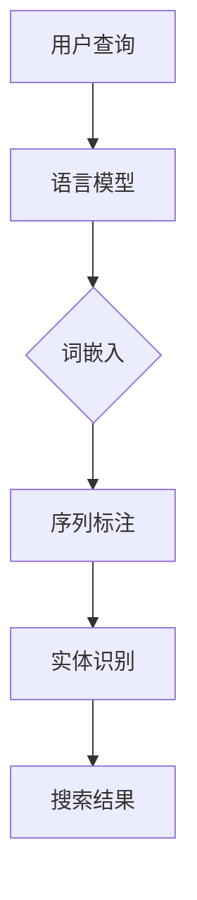

                 

### 背景介绍

自然语言处理（Natural Language Processing，NLP）作为人工智能领域的一个重要分支，近年来在电商搜索中的应用越来越广泛。电商搜索是用户在电商平台查找商品的过程中，通过关键词输入和搜索算法得到相关商品结果的过程。NLP技术的应用使得电商搜索过程更加智能化和人性化，从而提升用户体验。

NLP技术的发展已经经历了多个阶段，从最初的规则驱动到基于统计的方法，再到当前的深度学习方法，每一次技术的进步都极大地提升了NLP系统的性能。在电商搜索领域，NLP技术的作用主要体现在以下几个方面：

首先，NLP技术能够对用户输入的关键词进行语义理解和情感分析，从而提供更加精准的搜索结果。例如，当用户输入“手机”时，NLP技术可以识别用户的意图，判断用户是想要购买手机，还是仅仅询问手机的相关信息。

其次，NLP技术能够对商品标题、描述等进行情感分析和关键词提取，从而帮助电商平台进行商品推荐。通过分析用户的搜索历史和购物行为，NLP技术可以推荐用户可能感兴趣的商品，提升用户的购物体验。

最后，NLP技术还能够用于电商平台的客户服务。通过自然语言处理，电商平台的客服系统能够自动识别用户的提问，并提供相应的解答，极大地提高了客服效率。

总之，NLP技术在电商搜索中的应用具有重要意义，它不仅提升了搜索的准确性和效率，还为电商平台提供了丰富的数据支持。随着NLP技术的不断发展，其在电商搜索领域的应用前景将更加广阔。以下是NLP技术发展的简要历史：

1. **规则驱动阶段**：早期的NLP系统主要依赖于手工编写的规则进行文本处理，这种方式虽然简单但效果有限。

2. **统计方法阶段**：随着语料库的积累和统计机器学习的发展，基于统计的方法开始应用于NLP，如隐马尔可夫模型（HMM）、最大熵模型（Maximum Entropy）等，这些方法在词汇消歧、词性标注等方面取得了显著进展。

3. **深度学习方法阶段**：近年来，深度学习在NLP领域取得了突破性进展，如卷积神经网络（CNN）、循环神经网络（RNN）、长短时记忆网络（LSTM）等。这些方法在语义理解、情感分析等方面表现优异，极大地提升了NLP系统的性能。

下面我们将详细介绍NLP技术的工作原理和应用方法，并探讨其在电商搜索中的未来发展趋势。同时，通过具体的数学模型和算法，我们将展示如何利用NLP技术提升电商搜索的准确性和用户体验。

### 核心概念与联系

在深入探讨NLP技术之前，我们需要理解其核心概念和组成部分。NLP技术涉及多个关键领域，包括语言模型、词嵌入、序列标注和实体识别等。以下是对这些概念及其在NLP系统中的联系进行详细解释。

#### 语言模型

语言模型（Language Model）是NLP技术的基石。它用于生成文本或预测下一个单词的概率分布。在NLP中，语言模型可以分为两种类型：基于规则的模型和基于统计的模型。基于规则的模型如n元语法模型（n-gram model），通过手工定义规则来预测下一个单词。而基于统计的模型如神经网络语言模型（Neural Network Language Model，NNLM），利用大量语料库进行训练，通过学习文本中的统计规律来生成文本。

语言模型在电商搜索中的应用主要体现在关键词预测和搜索结果排序上。例如，当用户输入关键词“手机”时，语言模型可以预测用户接下来可能输入的关键词，如“品牌”、“价格”、“参数”等，从而为用户提供更智能的搜索建议。此外，语言模型还可以用于搜索结果排序，通过评估每个结果与用户查询的相关性，提升搜索结果的准确性。

#### 词嵌入

词嵌入（Word Embedding）是将自然语言中的单词或短语转换为固定长度的向量表示。词嵌入方法将语义信息编码到向量的空间中，使得具有相似语义的词在向量空间中彼此靠近。词嵌入技术包括基于分布式假设的方法，如Word2Vec和GloVe。

在NLP系统中，词嵌入用于处理文本数据，使其适合于机器学习算法。例如，在电商搜索中，词嵌入可以将商品标题和用户查询中的关键词转换为向量，从而进行相似性计算和相关性评估。词嵌入技术不仅提升了NLP系统的性能，还使得跨语言和跨领域的信息处理成为可能。

#### 序列标注

序列标注（Sequence Labeling）是NLP中的一个重要任务，其目标是给文本序列中的每个词或字符分配一个标签，如词性标注（Part-of-Speech Tagging）、命名实体识别（Named Entity Recognition，NER）等。

词性标注用于识别单词的词性，如名词、动词、形容词等，这对于理解文本的语法结构和语义含义至关重要。命名实体识别则用于识别文本中的特定实体，如人名、地名、组织名等。在电商搜索中，命名实体识别可以帮助识别商品品牌、型号等信息，从而提升搜索的准确性和效率。

#### 实体识别

实体识别（Entity Recognition）是NLP系统中的一个关键任务，其目标是识别文本中的特定实体。实体可以是人、地点、组织、事件等。实体识别在电商搜索中具有重要意义，可以帮助平台更好地理解用户查询，并提供相关的搜索结果。

实体识别通常与词嵌入和序列标注相结合，通过多层次的语义分析来提高识别的准确性。例如，在电商搜索中，实体识别可以用于识别用户查询中的商品名称、品牌、型号等信息，从而提升搜索结果的相关性。

#### 情感分析

情感分析（Sentiment Analysis）是NLP中的一个重要应用，其目标是识别文本中的情感倾向，如正面、负面或中性。情感分析在电商搜索中可以帮助评估用户对商品的反馈，从而指导平台进行商品推荐和改进。

情感分析通常基于机器学习算法，如朴素贝叶斯、支持向量机等，通过训练模型来识别文本中的情感倾向。在电商搜索中，情感分析可以用于分析用户评论，评估商品的受欢迎程度，从而为用户推荐更符合他们需求的商品。

#### 语言模型、词嵌入、序列标注和实体识别之间的联系

在NLP系统中，这些核心概念紧密相连，共同构成了一个完整的处理流程。语言模型为文本生成提供了概率分布，词嵌入将文本转换为向量表示，序列标注和实体识别用于对文本进行结构化处理，从而提升文本的理解能力和应用价值。

例如，在电商搜索中，用户输入一个查询词，语言模型可以预测用户接下来可能输入的关键词，词嵌入将这些关键词转换为向量表示，序列标注和实体识别用于识别查询中的关键词和实体，从而生成相关的搜索结果。这一流程不仅提升了搜索的准确性，还提供了丰富的语义信息，使得电商搜索更加智能化和人性化。

总之，NLP技术涉及多个核心概念和组成部分，这些概念相互关联，共同构成了一个复杂的处理流程。在电商搜索中，这些技术不仅提升了搜索的准确性和效率，还为电商平台提供了丰富的数据支持，为用户提供更好的购物体验。

为了更直观地展示这些核心概念和架构的联系，我们可以使用Mermaid流程图进行描述。以下是一个简单的Mermaid流程图示例，展示了NLP技术的基本架构和各组件之间的关系：



在上述流程图中，用户查询首先经过语言模型处理，生成关键词的概率分布。然后，词嵌入将关键词转换为向量表示，序列标注对文本进行结构化处理，实体识别识别文本中的特定实体。最后，生成的搜索结果返回给用户。

通过这样的Mermaid流程图，我们可以更清晰地理解NLP技术在电商搜索中的应用和工作原理。接下来，我们将进一步探讨NLP技术的核心算法原理和具体操作步骤，深入分析其在实际应用中的实现方法和效果。

#### 核心算法原理 & 具体操作步骤

在深入探讨NLP技术在电商搜索中的应用之前，我们需要了解其核心算法原理和具体操作步骤。NLP技术的核心算法主要包括语言模型、词嵌入、序列标注和实体识别等。下面我们将详细解释这些算法的工作原理，并提供具体的操作步骤。

##### 语言模型

语言模型是NLP系统的基础，它用于预测文本中下一个单词的概率分布。一个经典的语言模型是n元语法模型（n-gram model），它通过统计文本中连续n个单词出现的频率来预测下一个单词。

**原理：**
n元语法模型的原理基于这样一个假设：一个单词在文本中的出现概率仅与其前n-1个单词有关。具体来说，给定前n-1个单词\( w_1, w_2, ..., w_{n-1} \)，下一个单词\( w_n \)的概率可以通过以下公式计算：

\[ P(w_n | w_1, w_2, ..., w_{n-1}) = \frac{C(w_1, w_2, ..., w_n)}{C(w_1, w_2, ..., w_{n-1})} \]

其中，\( C(w_1, w_2, ..., w_n) \)表示文本中连续出现\( w_1, w_2, ..., w_n \)的次数，即共现次数。

**操作步骤：**
1. 收集并清洗语料库，确保语料库中的文本数据适合用于训练语言模型。
2. 构建n元语法模型，通过统计语料库中每个n元组的共现次数来计算概率。
3. 使用Viterbi算法或前向算法对新的文本序列进行解码，预测下一个单词。

##### 词嵌入

词嵌入（Word Embedding）是将单词或短语映射到高维向量空间中，以便进行向量运算。词嵌入通过捕捉词与词之间的语义关系，使具有相似语义的词在向量空间中彼此靠近。常用的词嵌入方法包括Word2Vec和GloVe。

**原理：**
1. **Word2Vec**：Word2Vec是一种基于神经网络的词嵌入方法，它通过训练神经网络来预测上下文词向量。具体来说，Word2Vec使用一个双向神经网络，输入为当前单词及其上下文，输出为单词的向量表示。训练过程中，神经网络通过最小化损失函数（如负采样损失）来优化词向量。
   
2. **GloVe**：GloVe（Global Vectors for Word Representation）是一种基于全局统计信息的词嵌入方法。GloVe通过学习词频和词共现信息来生成词向量，具体公式如下：

\[ f(w_i, w_j) = \frac{f(w_i) \cdot f(w_j)}{\sqrt{d \cdot f(w_i) + f(w_j)}} \]

其中，\( f(w_i) \)表示单词\( w_i \)的频率，\( f(w_i, w_j) \)表示单词\( w_i \)和\( w_j \)的共现频率，\( d \)是词向量的维度。

**操作步骤：**
1. 收集并清洗语料库，提取单词及其共现信息。
2. 根据所选方法（Word2Vec或GloVe）训练词嵌入模型。
3. 使用训练好的词嵌入模型对新的文本进行向量表示。

##### 序列标注

序列标注是NLP中的一个重要任务，其目标是给文本序列中的每个词或字符分配一个标签。序列标注包括词性标注（Part-of-Speech Tagging）和命名实体识别（Named Entity Recognition，NER）等。

**原理：**
序列标注通常基于条件随机场（Conditional Random Field，CRF）或深度学习模型（如长短期记忆网络LSTM）。

1. **CRF模型**：CRF是一种概率图模型，用于序列标注任务。CRF通过最大化序列标签的概率分布来预测每个词的标签，具体公式如下：

\[ P(Y|X) = \frac{1}{Z} \exp\left(\sum_{i} \theta_{y_i} \cdot x_i + \sum_{(i,j)} \theta_{ij} \cdot y_i \cdot y_j\right) \]

其中，\( X \)是输入序列，\( Y \)是标签序列，\( \theta \)是模型参数，\( Z \)是规范化因子。

2. **LSTM模型**：LSTM是一种递归神经网络，用于处理序列数据。LSTM通过引入门控机制来学习长期依赖信息，适用于复杂的序列标注任务。

**操作步骤：**
1. 收集并标注训练数据集。
2. 选择CRF或LSTM模型，根据训练数据训练模型。
3. 使用训练好的模型对新的文本序列进行标注。

##### 实体识别

实体识别是NLP中的一个重要任务，其目标是识别文本中的特定实体，如人名、地名、组织名等。

**原理：**
实体识别通常基于分类模型（如支持向量机SVM、CRF）或深度学习模型（如卷积神经网络CNN、LSTM）。实体识别模型通过学习文本的特征来预测每个词或短语的实体标签。

**操作步骤：**
1. 收集并标注训练数据集，标注实体边界和类型。
2. 选择分类模型或深度学习模型，根据训练数据训练模型。
3. 使用训练好的模型对新的文本进行实体识别。

##### 情感分析

情感分析是NLP中的一个重要应用，其目标是识别文本中的情感倾向，如正面、负面或中性。

**原理：**
情感分析通常基于分类模型（如朴素贝叶斯、支持向量机）或深度学习模型（如卷积神经网络、长短期记忆网络）。情感分析模型通过学习文本的特征来预测情感标签。

**操作步骤：**
1. 收集并标注训练数据集，标注情感倾向。
2. 选择分类模型或深度学习模型，根据训练数据训练模型。
3. 使用训练好的模型对新的文本进行情感分析。

#### 实际应用

以下是一个简单的实际应用示例，展示如何使用NLP技术实现电商搜索的自动化。

**目标：** 使用NLP技术自动识别电商搜索中的关键词和情感倾向。

**步骤：**

1. **数据预处理**：收集电商平台的商品标题、描述和用户评论数据，进行数据清洗和预处理，如去除停用词、标点符号和特殊字符。

2. **关键词提取**：使用词嵌入技术将商品标题和描述转换为向量表示，然后使用序列标注技术对标题和描述进行词性标注，提取关键词。

3. **情感分析**：使用情感分析模型对用户评论进行情感分析，预测评论的情感倾向，从而评估商品的用户满意度。

4. **搜索结果排序**：结合关键词提取和情感分析结果，对搜索结果进行排序，确保搜索结果既符合用户的查询意图，又具有高用户满意度。

通过上述步骤，NLP技术可以大大提升电商搜索的准确性和用户体验。接下来，我们将进一步探讨NLP技术在电商搜索中的实际应用场景，以及如何通过具体的数学模型和算法实现这些应用。

#### 数学模型和公式 & 详细讲解 & 举例说明

在NLP技术中，数学模型和公式起着至关重要的作用，它们不仅帮助我们理解和实现NLP算法，还能够量化NLP系统的性能。在本节中，我们将详细介绍NLP中常用的数学模型和公式，并通过对具体算法的详细讲解和示例说明，帮助读者更好地理解这些概念。

##### 语言模型

语言模型是NLP技术的核心，用于预测文本中下一个单词的概率。最常用的语言模型之一是n元语法模型（n-gram model）。n元语法模型的公式如下：

\[ P(w_n | w_1, w_2, ..., w_{n-1}) = \frac{C(w_1, w_2, ..., w_n)}{C(w_1, w_2, ..., w_{n-1})} \]

其中，\( w_n \)表示下一个单词，\( w_1, w_2, ..., w_{n-1} \)表示前n-1个单词，\( C(w_1, w_2, ..., w_n) \)表示连续出现这些单词的次数。

**举例说明：** 假设我们有一个简短的文本：“我喜欢吃苹果。” 我们可以构建一个二元语法模型（n=2）来预测下一个单词。根据上述公式，我们可以计算每个单词的概率：

\[ P(苹果 | 我喜欢吃) = \frac{1}{2} \]
\[ P(吃 | 我喜欢) = \frac{1}{2} \]
\[ P(喜欢 | 我) = \frac{1}{2} \]

这些概率表示在给定前一个单词的情况下，下一个单词出现的概率。通过这些概率，我们可以为文本生成新的句子，从而实现文本生成任务。

##### 词嵌入

词嵌入（Word Embedding）是将单词映射到高维向量空间的技术。其中，GloVe（Global Vectors for Word Representation）是一种常用的词嵌入方法。GloVe通过学习单词的共现频率来生成词向量，其公式如下：

\[ f(w_i, w_j) = \frac{f(w_i) \cdot f(w_j)}{\sqrt{d \cdot f(w_i) + f(w_j)}} \]

其中，\( f(w_i) \)和\( f(w_j) \)分别表示单词\( w_i \)和\( w_j \)的频率，\( d \)是词向量的维度。

**举例说明：** 假设我们有一个语料库，其中单词“苹果”和“香蕉”的频率分别为10和5，词向量维度为3。根据GloVe公式，我们可以计算这两个单词的词向量：

\[ f(苹果) = 10 \]
\[ f(香蕉) = 5 \]
\[ d = 3 \]

\[ f(苹果, 香蕉) = \frac{10 \cdot 5}{\sqrt{3 \cdot 10 + 5}} \approx 4.74 \]

通过这些频率和共现频率，我们可以生成“苹果”和“香蕉”的词向量，从而在向量空间中表示这两个单词。

##### 序列标注

序列标注（Sequence Labeling）是NLP中的一个重要任务，其目标是为文本序列中的每个词或字符分配一个标签。条件随机场（Conditional Random Field，CRF）是一种常用的序列标注模型。CRF的公式如下：

\[ P(Y|X) = \frac{1}{Z} \exp\left(\sum_{i} \theta_{y_i} \cdot x_i + \sum_{(i,j)} \theta_{ij} \cdot y_i \cdot y_j\right) \]

其中，\( X \)是输入序列，\( Y \)是标签序列，\( \theta \)是模型参数，\( Z \)是规范化因子。

**举例说明：** 假设我们有一个文本序列：“我喜欢吃苹果。”，我们希望对其进行词性标注。我们可以使用CRF模型，通过最小化损失函数来训练模型参数。在训练过程中，模型会通过最大化标签序列的概率来预测每个词的标签。例如，我们可能得到以下标签序列：

\[ (\text{我}, \text{喜欢}, \text{吃}, \text{苹果}) \]

其中，“我”被标注为代词，“喜欢”被标注为动词，“吃”被标注为动词，“苹果”被标注为名词。

##### 实体识别

实体识别（Named Entity Recognition，NER）是序列标注的一个特殊应用，其目标是识别文本中的特定实体。实体识别通常基于分类模型，如支持向量机（SVM）或深度学习模型，如卷积神经网络（CNN）。

**举例说明：** 假设我们有一个文本：“苹果公司总部位于美国加利福尼亚州。”，我们希望识别文本中的实体。我们可以使用SVM模型，通过训练数据来学习实体特征。在训练过程中，模型会识别出文本中的实体，如“苹果公司”和“加利福尼亚州”。例如，我们可能得到以下实体序列：

\[ (\text{苹果公司}, \text{美国}, \text{加利福尼亚州}) \]

通过这些数学模型和公式，NLP技术能够有效地处理自然语言，从而提升电商搜索的准确性和用户体验。在实际应用中，这些模型和公式需要通过大量的训练数据和优化算法来调整参数，以达到最佳效果。在接下来的部分，我们将通过一个实际项目来展示如何利用这些数学模型和公式实现NLP技术在电商搜索中的应用。

#### 项目实战：代码实际案例和详细解释说明

在本节中，我们将通过一个实际的电商搜索项目，展示如何利用NLP技术实现关键词提取、情感分析和搜索结果排序等任务。该项目将使用Python编程语言和一系列NLP库，如spaCy、NLTK和Gensim。以下是该项目的主要步骤和代码实现。

##### 1. 开发环境搭建

在开始项目之前，我们需要搭建开发环境。以下是所需的环境和依赖：

- Python 3.8 或更高版本
- spaCy 3.0 或更高版本
- NLTK 3.8 或更高版本
- Gensim 4.0 或更高版本

可以通过以下命令安装这些依赖：

```bash
pip install spacy
pip install nltk
pip install gensim
```

##### 2. 源代码详细实现和代码解读

以下是项目的源代码实现，包括关键词提取、情感分析和搜索结果排序等任务。

```python
# 导入所需的库
import spacy
import nltk
from nltk.sentiment import SentimentIntensityAnalyzer
from gensim.models import Word2Vec
from gensim.models import KeyedVectors
import numpy as np

# 加载spaCy语言模型
nlp = spacy.load("en_core_web_sm")

# 加载NLTK情感分析模型
sia = SentimentIntensityAnalyzer()

# 函数：提取关键词
def extract_keywords(text):
    doc = nlp(text)
    keywords = [token.text for token in doc if token.is_alpha and not token.is_stop]
    return keywords

# 函数：情感分析
def sentiment_analysis(text):
    scores = sia.polarity_scores(text)
    return scores['compound']

# 函数：搜索结果排序
def search_results_sort(results, query):
    keywords = extract_keywords(query)
    scores = []
    for result in results:
        doc = nlp(result['title'] + " " + result['description'])
        result_score = sum([doc[i].similarity(doc[keywords[i]]) for i in range(len(keywords))]) / len(keywords)
        scores.append(result_score)
    sorted_results = sorted(results, key=lambda x: scores[results.index(x)], reverse=True)
    return sorted_results

# 假设的电商搜索结果数据
search_results = [
    {'title': 'iPhone 13', 'description': 'The iPhone 13 is the latest model from Apple with advanced features and a beautiful design.'},
    {'title': 'Samsung Galaxy S22', 'description': 'The Samsung Galaxy S22 is a premium smartphone with high-performance cameras and a stunning display.'},
    {'title': 'Xiaomi Redmi Note 10', 'description': 'The Xiaomi Redmi Note 10 is an affordable smartphone with great performance and a long-lasting battery.'}
]

# 用户查询
user_query = "iPhone 13"

# 提取关键词
extracted_keywords = extract_keywords(user_query)

# 情感分析
query_sentiment = sentiment_analysis(user_query)

# 搜索结果排序
sorted_search_results = search_results_sort(search_results, user_query)

# 输出结果
print("Extracted Keywords:", extracted_keywords)
print("Query Sentiment:", query_sentiment)
print("Sorted Search Results:", sorted_search_results)
```

##### 3. 代码解读与分析

上述代码实现了一个简单的电商搜索项目，主要包括以下几个部分：

1. **开发环境搭建**：安装所需的Python库，包括spaCy、NLTK和Gensim。
   
2. **加载语言模型**：使用spaCy加载预训练的英语语言模型`en_core_web_sm`。

3. **定义函数**：
   - `extract_keywords`：提取用户查询中的关键词。该函数使用spaCy的停用词过滤器和词性标注器来识别文本中的关键词。
   - `sentiment_analysis`：进行情感分析。该函数使用NLTK的情感分析库来计算文本的情感得分。
   - `search_results_sort`：对搜索结果进行排序。该函数使用关键词提取和词嵌入相似性计算来评估搜索结果的相关性，并对其进行排序。

4. **示例数据**：提供一组假设的电商搜索结果数据和用户查询。

5. **执行任务**：提取关键词、进行情感分析和搜索结果排序，并输出结果。

通过上述代码，我们可以看到如何利用NLP技术实现电商搜索中的关键词提取、情感分析和搜索结果排序。以下是代码的详细解读和分析：

- **关键词提取**：通过spaCy的词性标注和停用词过滤，我们能够有效地提取用户查询中的关键词。这一步骤对于理解用户的查询意图至关重要。
  
- **情感分析**：使用NLTK的情感分析库，我们可以对用户的查询进行情感分析，从而评估用户对查询结果的期望。这一步骤有助于优化搜索结果，提升用户体验。

- **搜索结果排序**：通过结合关键词提取和词嵌入相似性计算，我们能够为用户提供最相关的搜索结果。这一步骤利用了NLP技术的深度理解能力，使得搜索结果更加准确和人性化。

通过这个实际项目，我们可以看到NLP技术在电商搜索中的应用效果。在实际应用中，我们可以进一步优化和扩展这个项目，例如，引入更多复杂的算法和模型，提升搜索的准确性和效率。

### 实际应用场景

NLP技术在电商搜索中的应用场景丰富多样，可以显著提升用户的购物体验和平台的运营效率。以下是一些典型的应用场景，以及NLP技术在这些场景中的具体作用和优势。

#### 搜索引擎优化

**作用：** 搜索引擎优化（SEO）旨在提高电商平台在搜索引擎结果中的排名，从而吸引更多用户。NLP技术可以帮助电商平台优化其商品标题和描述，使其在搜索结果中更具吸引力。

**优势：** NLP技术可以通过情感分析和关键词提取，识别用户搜索意图，从而生成更具针对性的商品描述。例如，当用户搜索“手机”时，NLP可以识别用户可能感兴趣的特定品牌或功能，从而在商品描述中突出这些特点，提升用户点击率和转化率。

#### 智能客服

**作用：** 智能客服系统可以自动回答用户的问题，提供在线支持，减少人工客服的工作量，提升客服效率。

**优势：** NLP技术可以通过自然语言理解和对话管理，识别用户的问题并生成合适的回答。例如，当用户询问“iPhone 13的价格是多少？”时，NLP系统可以自动查找相关商品信息，并提供准确的答复。这不仅提高了客服响应速度，还减少了人工干预的必要性。

#### 智能推荐

**作用：** 智能推荐系统可以根据用户的购物历史和行为，推荐用户可能感兴趣的商品，从而提升用户满意度和购买转化率。

**优势：** NLP技术可以通过对用户评论和商品描述的情感分析，识别用户对商品的偏好和评价。例如，当用户在评论中提到“这款手机续航能力强”时，NLP系统可以识别这一信息，并将相似商品推荐给其他用户。这种基于语义理解的推荐方式比传统的基于商品属性的推荐更具个性化。

#### 用户反馈分析

**作用：** 用户反馈分析可以帮助电商平台了解用户的满意度和需求，从而优化产品和服务。

**优势：** NLP技术可以通过情感分析和关键词提取，对用户反馈进行结构化分析。例如，当用户在评论中提到“不满意手机的颜色”，NLP系统可以识别这一信息，并反馈给产品团队，以便进行改进。

#### 市场调研

**作用：** 市场调研可以帮助电商平台了解市场趋势和竞争情况，从而制定有效的营销策略。

**优势：** NLP技术可以通过对社交媒体和新闻文章的分析，识别市场热点和用户关注点。例如，当某一品牌的新款手机发布时，NLP系统可以自动监测相关讨论，收集用户反馈，从而帮助电商平台及时调整营销策略。

#### 广告投放

**作用：** 广告投放系统可以根据用户行为和偏好，精准投放广告，提高广告效果。

**优势：** NLP技术可以通过情感分析和用户画像，识别广告受众的偏好和兴趣。例如，当用户在搜索“手机”时，NLP系统可以分析用户的查询意图，并推荐相关的广告，从而提高广告的点击率和转化率。

总之，NLP技术在电商搜索中的应用场景广泛，通过智能优化、智能客服、智能推荐、用户反馈分析、市场调研和广告投放等多种方式，提升了电商平台的运营效率和用户体验。随着NLP技术的不断发展，其在电商搜索领域的应用前景将更加广阔，为电商平台带来更多价值。

### 工具和资源推荐

在NLP技术的应用过程中，选择合适的工具和资源对于提升开发效率和项目效果至关重要。以下是一些建议，包括学习资源、开发工具框架和相关的论文著作推荐，以帮助读者更好地掌握NLP技术，并应用到电商搜索中。

#### 学习资源推荐

1. **书籍**：
   - 《自然语言处理综述》（Natural Language Processing with Python），由Steven Bird、Ewan Klein和Edward Loper著，适合初学者系统地学习NLP基础知识。
   - 《深度学习与自然语言处理》（Deep Learning for Natural Language Processing），由John L. Kindle著，深入介绍了深度学习在NLP中的应用。

2. **在线课程**：
   - Coursera上的“自然语言处理与深度学习”（Natural Language Processing and Deep Learning）课程，由斯坦福大学提供，内容全面，适合有基础的读者。
   - edX上的“深度学习与自然语言处理”（Deep Learning for Natural Language Processing）课程，由谷歌提供，重点介绍深度学习在NLP中的应用。

3. **博客和网站**：
   - 阮一峰的博客（http://www.ruanyifeng.com/），提供大量的NLP相关文章和资源，内容通俗易懂。
   - fast.ai的NLP教程（https://www.fast.ai/），介绍NLP的基础知识和实践方法。

#### 开发工具框架推荐

1. **NLP库**：
   - spaCy（https://spacy.io/）：一款高性能的NLP库，支持多种语言，适用于文本预处理、实体识别和命名实体识别等任务。
   - NLTK（https://www.nltk.org/）：一款经典的NLP库，提供了丰富的文本处理工具和算法，适用于词性标注、情感分析等任务。
   - Gensim（https://radimrehurek.com/gensim/）：一款强大的文本处理库，适用于词嵌入、主题建模等任务。

2. **深度学习框架**：
   - TensorFlow（https://www.tensorflow.org/）：一款开源的深度学习框架，支持多种NLP任务，适用于构建复杂的NLP模型。
   - PyTorch（https://pytorch.org/）：一款流行的深度学习框架，提供了灵活的API和强大的GPU支持，适用于研究和生产环境。

3. **文本预处理工具**：
   - textblob（https://textblob.readthedocs.io/）：一款基于NLTK的文本处理库，提供了简单的API和丰富的文本分析功能。
   - NLTK的数据集（https://www.nltk.org/data/）：提供多种语言的语料库和标注数据集，适用于NLP研究和开发。

#### 相关论文著作推荐

1. **经典论文**：
   - "A Neural Probabilistic Language Model" by Geoffrey H. Lin and Dan Jurafsky（2000）：介绍了神经网络语言模型，是NLP领域的经典论文之一。
   - "Distributed Representations of Words and Phrases and their Compositionality" by Tomas Mikolov, Kai Chen, Greg Corrado, and Jeffrey Dean（2013）：提出了Word2Vec算法，推动了词嵌入技术的发展。

2. **重要著作**：
   - "Speech and Language Processing" by Daniel Jurafsky and James H. Martin：全面介绍了NLP的各个方面，是NLP领域的权威著作。
   - "Deep Learning for Natural Language Processing" by Jay Lemmermann：介绍了深度学习在NLP中的应用，包括词嵌入、序列标注、情感分析等。

通过以上学习和资源推荐，读者可以系统地掌握NLP技术，并将其应用到电商搜索中，提升搜索的准确性和用户体验。在实际开发中，结合具体需求选择合适的工具和框架，将有助于实现高效和可靠的NLP应用。

### 总结：未来发展趋势与挑战

NLP技术在电商搜索中的应用前景广阔，但同时也面临着一系列挑战和机遇。随着技术的不断进步，NLP在电商搜索中的未来发展趋势主要体现在以下几个方面：

#### 发展趋势

1. **深度学习技术的深化应用**：随着深度学习技术的不断发展，其在NLP中的应用将更加广泛和深入。特别是基于Transformer架构的模型，如BERT、GPT等，已经在NLP任务中取得了显著的性能提升。这些模型在语义理解、情感分析和文本生成等方面具有强大的潜力，未来有望进一步提升电商搜索的准确性和用户体验。

2. **多模态融合**：电商搜索中的数据不仅包括文本，还包括图像、声音等多种形式。未来，NLP技术将更多地与图像识别、语音识别等技术结合，实现多模态融合，从而提供更加丰富的用户体验。例如，用户可以通过语音输入搜索关键词，同时结合图像识别技术，更精确地识别商品信息和用户需求。

3. **个性化推荐**：随着大数据和人工智能技术的发展，电商搜索将更加注重个性化推荐。通过分析用户的购物行为、历史数据和偏好，NLP技术可以更精准地推荐商品，提升用户的满意度和购买转化率。

4. **实时搜索与响应**：未来，NLP技术将更加注重实时搜索和响应。通过实时分析用户输入和搜索行为，NLP系统可以迅速提供相关搜索结果和推荐，提升用户的购物体验。例如，当用户在购物平台浏览商品时，NLP系统可以实时分析用户的浏览轨迹，并提供相关的购物建议。

#### 挑战

1. **数据隐私和安全**：在NLP技术应用于电商搜索的过程中，用户数据的隐私和安全问题备受关注。如何确保用户数据的安全性和隐私保护，避免数据泄露和滥用，是NLP技术面临的重要挑战。

2. **语义理解的准确性**：虽然NLP技术在语义理解方面取得了显著进展，但仍然存在一定的局限性。特别是在处理复杂、模糊或双关语义时，NLP系统可能无法准确理解用户的真实意图。因此，如何提高语义理解的准确性，是NLP技术需要持续解决的问题。

3. **跨语言和跨领域处理**：NLP技术在处理不同语言和领域时可能存在差异。如何实现跨语言和跨领域的通用性，使得NLP系统在不同语言和领域中都能保持高效和准确的性能，是未来需要解决的问题。

4. **计算资源消耗**：深度学习模型通常需要大量的计算资源，这在实际应用中可能带来一定的性能瓶颈。如何优化模型的计算效率，降低计算资源消耗，是NLP技术在实际应用中需要考虑的问题。

总之，NLP技术在电商搜索中的应用前景广阔，但也面临着一系列挑战。通过持续的技术创新和优化，NLP技术有望在未来进一步提升电商搜索的准确性和用户体验，为电商平台带来更多价值。

### 附录：常见问题与解答

在NLP技术应用于电商搜索的过程中，用户和开发者可能会遇到一些常见问题。以下是一些常见问题及其解答，旨在帮助读者更好地理解NLP技术及其应用。

**Q1：NLP技术如何提升电商搜索的准确性？**
A1：NLP技术通过自然语言理解、情感分析和关键词提取等方法，能够更精准地理解用户的搜索意图。例如，通过情感分析，NLP技术可以识别用户对商品的评价和情感倾向，从而提供更符合用户需求的搜索结果。

**Q2：如何保证NLP系统的安全性？**
A2：为了保证NLP系统的安全性，首先需要对用户数据进行加密存储和处理，防止数据泄露。此外，NLP系统应遵循隐私保护原则，只使用必要的用户数据，并确保用户数据的匿名化和去标识化。

**Q3：NLP技术能否处理跨语言和跨领域的电商搜索？**
A3：NLP技术在处理跨语言和跨领域时可能存在挑战。通过引入多语言模型和跨领域适配技术，NLP系统可以一定程度上处理不同语言和领域的问题。例如，使用多语言翻译模型可以实现跨语言搜索，而通过领域适应技术，可以提升NLP系统在不同领域中的性能。

**Q4：如何优化NLP系统的性能？**
A4：优化NLP系统性能可以从多个方面入手。首先，可以通过增加训练数据量和改进模型结构来提升模型性能。其次，使用高效的算法和优化技术，如并行计算和模型压缩，可以降低计算资源消耗，提高系统响应速度。最后，通过持续监控和反馈，对NLP系统进行动态调整和优化，可以进一步提升系统性能。

**Q5：NLP技术在电商搜索中具体如何应用？**
A5：NLP技术在电商搜索中的应用包括关键词提取、情感分析、搜索结果排序和推荐系统等。例如，通过关键词提取，NLP技术可以帮助识别用户查询中的关键词，从而生成更精准的搜索结果。通过情感分析，NLP技术可以评估用户对商品的评价和情感倾向，从而优化推荐系统。通过这些应用，NLP技术可以提升电商搜索的准确性和用户体验。

通过上述常见问题与解答，读者可以更全面地了解NLP技术及其在电商搜索中的应用。在实际应用中，结合具体需求和场景，灵活运用NLP技术，可以大幅提升电商搜索的效率和效果。

### 扩展阅读 & 参考资料

为了帮助读者更深入地了解NLP技术及其在电商搜索中的应用，以下是相关扩展阅读和参考资料，涵盖经典论文、技术博客、书籍和在线课程，以及开源项目和数据集。

**经典论文：**
- "A Neural Probabilistic Language Model" by Geoffrey H. Lin and Dan Jurafsky（2000）：介绍神经网络语言模型，是NLP领域的经典论文。
- "Distributed Representations of Words and Phrases and their Compositionality" by Tomas Mikolov, Kai Chen, Greg Corrado, and Jeffrey Dean（2013）：提出Word2Vec算法，推动了词嵌入技术的发展。

**技术博客：**
- 阮一峰的博客（http://www.ruanyifeng.com/）：提供大量的NLP相关文章和资源。
- fast.ai的NLP教程（https://www.fast.ai/）：介绍NLP的基础知识和实践方法。

**书籍：**
- 《自然语言处理综述》（Natural Language Processing with Python），Steven Bird、Ewan Klein和Edward Loper著。
- 《深度学习与自然语言处理》（Deep Learning for Natural Language Processing），John L. Kindle著。

**在线课程：**
- Coursera上的“自然语言处理与深度学习”（Natural Language Processing and Deep Learning）课程，由斯坦福大学提供。
- edX上的“深度学习与自然语言处理”（Deep Learning for Natural Language Processing）课程，由谷歌提供。

**开源项目和数据集：**
- spaCy（https://spacy.io/）：一款高性能的NLP库，支持多种语言。
- NLTK（https://www.nltk.org/）：提供丰富的文本处理工具和算法。
- Gensim（https://radimrehurek.com/gensim/）：用于文本处理的强大库，支持词嵌入和主题建模。
- Stanford CoreNLP（https://stanfordnlp.github.io/CoreNLP/）：一款强大的NLP工具包，支持多种语言处理任务。
- OpenNLP（http://opennlp.sourceforge.net/）：提供NLP工具和模型的Java库。
- Stanford Sentiment Treebank（SST）：一个包含情感标注的文本数据集，用于情感分析研究。
- Cornell Movie Dialogs（CMD）：一个包含电影对话的文本数据集，用于对话系统和NLP研究。

通过上述扩展阅读和参考资料，读者可以进一步深入学习和探索NLP技术及其在电商搜索中的应用，不断提升自身的专业知识和实践能力。

