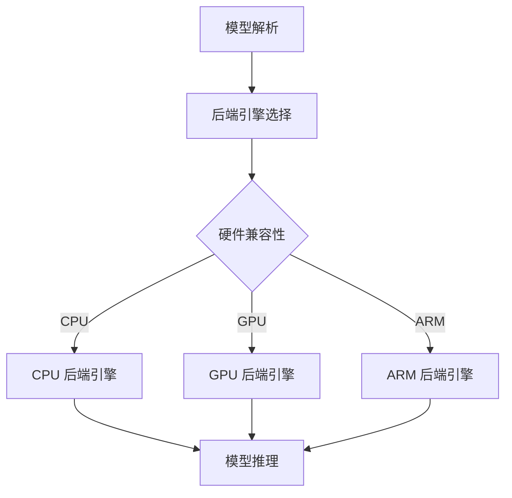

                 

### 背景介绍

#### ONNX Runtime 的诞生背景

随着深度学习技术的蓬勃发展，AI 模型的应用场景越来越广泛，从计算机视觉、自然语言处理到推荐系统等，都离不开高效、可靠的推理引擎。然而，各个深度学习框架和库之间的模型格式和接口并不统一，导致模型在不同平台和设备之间的部署变得困难。为了解决这个问题，Open Neural Network Exchange（ONNX）应运而生。

ONNX 是一个开放的机器学习模型交换格式，旨在提供一种统一的模型表示方式，使不同的深度学习框架和工具能够相互兼容。ONNX Runtime 则是 ONNX 的推理引擎，负责将 ONNX 格式的模型解析并运行在各类设备上，包括 CPU、GPU、ARM 等不同架构的硬件平台。

#### ONNX Runtime 的跨平台部署需求

在现代 AI 应用中，跨平台部署已成为必不可少的一环。不同设备具有各自的计算性能、内存大小和功耗特点，因此需要针对不同设备进行优化，以实现最佳的性能和能耗比。ONNX Runtime 的跨平台部署策略，主要包括以下几个方面：

1. **硬件兼容性**：ONNX Runtime 支持多种硬件平台，如 CPU、GPU、ARM，以及针对不同硬件平台优化的特定后端引擎（如 CPU Reference、CUDA、MKLDNN 等）。

2. **模型优化**：通过模型剪枝、量化等技术，减小模型的体积和计算量，使其能够在资源有限的设备上运行。

3. **动态形状支持**：ONNX Runtime 能够根据输入数据的形状动态调整模型的结构，使得模型可以适应不同的数据输入。

4. **性能优化**：通过并行计算、缓存优化等技术，提高模型的推理速度。

5. **兼容性**：ONNX Runtime 需要支持多种深度学习框架和库，如 TensorFlow、PyTorch、MXNet 等，以实现无缝的跨框架部署。

#### 本文目的

本文旨在介绍 ONNX Runtime 的跨平台部署策略，分析其在不同设备上运行 AI 模型的优势和挑战，并提供一些实用的优化技巧。通过本文的阅读，读者将了解到：

1. ONNX Runtime 的基本架构和核心功能。
2. 跨平台部署的关键技术和方法。
3. 实际应用中的性能优化策略。
4. ONNX Runtime 在未来发展趋势和面临的挑战。

接下来，我们将逐步深入探讨 ONNX Runtime 的核心概念与架构，以及如何在不同的硬件平台上运行 AI 模型。请继续关注接下来的内容。  
<markdown>

# ONNX Runtime 跨平台部署策略：在不同设备上运行 AI 模型

> 关键词：ONNX Runtime，跨平台部署，AI 模型，推理引擎，硬件兼容性，性能优化

> 摘要：本文将详细介绍 ONNX Runtime 的跨平台部署策略，分析其在不同设备上运行 AI 模型的优势和挑战，并通过实际案例和优化技巧，探讨如何实现高效、可靠的 AI 模型部署。

## 1. 背景介绍

随着深度学习技术的蓬勃发展，AI 模型的应用场景越来越广泛，从计算机视觉、自然语言处理到推荐系统等，都离不开高效、可靠的推理引擎。然而，各个深度学习框架和库之间的模型格式和接口并不统一，导致模型在不同平台和设备之间的部署变得困难。为了解决这个问题，Open Neural Network Exchange（ONNX）应运而生。

ONNX 是一个开放的机器学习模型交换格式，旨在提供一种统一的模型表示方式，使不同的深度学习框架和工具能够相互兼容。ONNX Runtime 则是 ONNX 的推理引擎，负责将 ONNX 格式的模型解析并运行在各类设备上，包括 CPU、GPU、ARM 等不同架构的硬件平台。

本文旨在介绍 ONNX Runtime 的跨平台部署策略，分析其在不同设备上运行 AI 模型的优势和挑战，并通过实际案例和优化技巧，探讨如何实现高效、可靠的 AI 模型部署。

## 2. 核心概念与联系

### 2.1 ONNX Runtime 的基本概念

**ONNX Runtime** 是 ONNX 的推理引擎，负责将 ONNX 格式的模型解析并运行在各类设备上。它具有以下核心概念：

- **模型解析（Model Parsing）**：ONNX Runtime 首先将 ONNX 格式的模型文件加载到内存中，解析模型的结构和参数。
- **运行时（Runtime）**：ONNX Runtime 根据解析后的模型，执行推理操作，并将结果输出。
- **后端引擎（Backend Engine）**：ONNX Runtime 支持多种后端引擎，如 CPU Reference、CUDA、MKLDNN 等，以适应不同硬件平台的优化需求。

### 2.2 ONNX Runtime 的架构

ONNX Runtime 的架构可以分为以下几个层次：

- **上层 API**：提供统一的接口，方便开发者调用 ONNX Runtime，如 Python API、C++ API 等。
- **中间层**：负责将上层 API 的调用转换为内部表示，并进行优化。
- **后端引擎**：针对不同硬件平台，提供特定优化的推理引擎，如 CPU、GPU、ARM 等。
- **底层实现**：实现 ONNX Runtime 的核心功能，如模型解析、推理操作、内存管理等。

### 2.3 跨平台部署的关键技术与联系

跨平台部署的关键技术包括硬件兼容性、模型优化、动态形状支持、性能优化和兼容性。这些技术相互联系，共同实现 ONNX Runtime 在不同设备上的高效运行：

- **硬件兼容性**：通过支持多种硬件平台和特定后端引擎，实现 ONNX Runtime 在不同设备的部署。
- **模型优化**：通过模型剪枝、量化等技术，减小模型的体积和计算量，适应不同设备的资源限制。
- **动态形状支持**：通过动态调整模型结构，使 ONNX Runtime 能够适应不同形状的输入数据。
- **性能优化**：通过并行计算、缓存优化等技术，提高模型的推理速度。
- **兼容性**：通过支持多种深度学习框架和库，实现无缝的跨框架部署。

### 2.4 Mermaid 流程图

以下是一个简单的 Mermaid 流程图，展示了 ONNX Runtime 的跨平台部署过程：

在上面的流程图中，模型解析后，根据硬件兼容性选择相应的后端引擎，然后执行模型推理。不同硬件平台的后端引擎实现各有特色，但共同的目标是提高模型的推理性能。

在接下来的部分，我们将进一步探讨 ONNX Runtime 的核心算法原理与具体操作步骤，帮助读者更好地理解其跨平台部署策略。请继续关注接下来的内容。</markdown>

