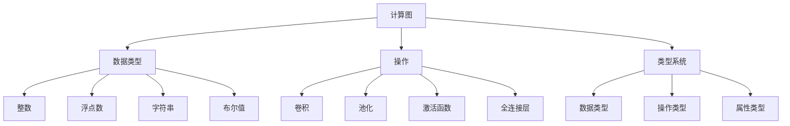

                 

### 文章标题：ONNX：开放式神经网络交换格式

**关键词：** ONNX，神经网络，交换格式，模型转换，跨平台兼容

**摘要：** 本文将深入探讨ONNX（开放式神经网络交换格式）的核心概念、原理及应用。首先，我们将回顾神经网络的发展历程，引出ONNX的背景。随后，详细解析ONNX的核心算法原理及其具体操作步骤。接下来，通过数学模型和公式的讲解，阐述ONNX的内在工作机理。随后，我们将通过一个实际的开发环境搭建案例，详细讲解ONNX的实际应用过程。最后，讨论ONNX在实际应用场景中的优势，并提供相关工具和资源推荐。通过本文的深入探讨，读者将全面了解ONNX的价值和未来发展趋势。

## 1. 背景介绍

随着人工智能技术的迅猛发展，神经网络作为一种重要的机器学习算法，在计算机视觉、自然语言处理、语音识别等领域取得了显著的成果。然而，神经网络模型的开发和部署面临着诸多挑战，其中最显著的一个问题就是不同框架之间的兼容性问题。不同的神经网络框架各自为政，开发者需要掌握多种框架，增加了模型开发的复杂度和难度。此外，随着模型规模的不断扩大，如何高效地管理和部署模型也成为了亟待解决的问题。

为了解决这些问题，业界迫切需要一种统一的神经网络交换格式，使得不同框架之间的模型能够无缝转换和共享。在这种背景下，ONNX（Open Neural Network Exchange）应运而生。ONNX是一个开放性的神经网络交换格式，旨在实现不同深度学习框架之间的模型转换和共享，从而简化模型开发、部署和优化过程。

ONNX的推出，标志着深度学习领域的一个重要里程碑。它不仅为开发者提供了一种统一的模型表示方式，还推动了不同深度学习框架之间的互操作性和兼容性。ONNX得到了众多深度学习框架的支持，如TensorFlow、PyTorch、MXNet等，同时也获得了工业界的广泛关注和应用。通过本文的探讨，我们将深入理解ONNX的核心概念、原理和应用，帮助读者全面掌握这一重要的技术。

## 2. 核心概念与联系

### ONNX的基本概念

ONNX（Open Neural Network Exchange）是一种开放式神经网络交换格式，它由微软和Facebook等公司于2016年共同发起。ONNX的主要目标是提供一个统一的模型表示方式，使得不同深度学习框架之间的模型能够无缝转换和共享。ONNX不仅支持多种神经网络架构，如卷积神经网络（CNN）、循环神经网络（RNN）和变换器（Transformer）等，还支持动态计算图和静态计算图，从而适应不同的应用场景和计算需求。

### ONNX与传统深度学习框架的联系

ONNX与传统深度学习框架之间有着紧密的联系。传统深度学习框架如TensorFlow、PyTorch和MXNet等，各自拥有独立的模型表示方式和计算引擎。而ONNX作为一种统一格式，可以将这些框架中的模型转换成ONNX格式，从而实现不同框架之间的模型共享和互操作。具体来说，ONNX提供了多种工具和插件，使得开发者可以轻松地将TensorFlow、PyTorch和MXNet等框架中的模型转换成ONNX格式，同时也能够将ONNX模型转换回原始框架格式。

### ONNX与其他技术的比较

与ONNX类似的技术还有TensorFlow Lite、TFLite和OpenVINO等。这些技术都是为了实现深度学习模型的轻量化、跨平台部署和优化而设计的。然而，ONNX在这些技术中具有独特的优势：

1. **开源和开放性**：ONNX是一个完全开源的项目，得到了业界广泛的认可和支持。它不仅支持多种深度学习框架，还支持多种硬件平台，如CPU、GPU和FPGA等。
2. **兼容性和互操作性**：ONNX旨在实现不同框架和平台之间的兼容性和互操作性，从而简化模型开发和部署过程。与其他技术相比，ONNX具有更高的兼容性和互操作性。
3. **高效性和灵活性**：ONNX支持动态计算图和静态计算图，能够适应不同的应用场景和计算需求。此外，ONNX还提供了一系列优化工具和插件，能够显著提高模型运行效率。

### ONNX的核心架构

ONNX的核心架构包括以下几个主要部分：

1. **计算图**：ONNX使用计算图来表示神经网络模型。计算图由节点（操作）和边（数据流）组成，其中节点表示计算操作，边表示数据依赖关系。
2. **数据类型**：ONNX支持多种数据类型，如整数、浮点数、字符串和布尔值等。这些数据类型用于表示模型中的数据。
3. **操作**：ONNX定义了一系列标准操作，如卷积、池化、激活函数和全连接层等。这些操作用于构建神经网络模型。
4. **类型系统**：ONNX使用类型系统来确保模型在转换过程中的一致性和准确性。类型系统包括数据类型、操作类型和属性类型等。

### ONNX的架构图

为了更好地理解ONNX的核心架构，我们可以使用Mermaid流程图来表示：



通过以上分析，我们可以看出ONNX的核心概念和联系，它不仅为开发者提供了一种统一的模型表示方式，还推动了不同深度学习框架之间的互操作性和兼容性。在接下来的章节中，我们将详细探讨ONNX的核心算法原理及其具体操作步骤。

## 3. 核心算法原理 & 具体操作步骤

### ONNX的核心算法原理

ONNX的核心算法原理可以概括为模型转换和优化。具体来说，ONNX通过以下几个步骤实现模型转换和优化：

1. **模型转换**：将原始深度学习框架中的模型转换成ONNX格式。这一步骤通常使用相应的转换工具和插件完成。例如，将TensorFlow模型转换成ONNX格式可以使用TensorFlow ONNX转换器（TensorFlow Lite Converter），将PyTorch模型转换成ONNX格式可以使用PyTorch ONNX转换器。
2. **模型优化**：对转换后的ONNX模型进行优化，以提高模型运行效率。ONNX提供了一系列优化工具和插件，如TensorRT、OpenVINO和NCNN等，可以用于对ONNX模型进行优化。
3. **模型部署**：将优化后的ONNX模型部署到目标平台上。ONNX支持多种硬件平台，如CPU、GPU和FPGA等，开发者可以根据具体需求选择合适的硬件平台。

### 具体操作步骤

下面我们以TensorFlow模型为例，详细讲解如何将TensorFlow模型转换成ONNX格式，并进行优化和部署。

#### 步骤1：安装和配置

首先，我们需要安装和配置TensorFlow、ONNX和相应优化工具。以Ubuntu操作系统为例，具体操作步骤如下：

1. 安装TensorFlow：
   ```bash
   pip install tensorflow
   ```
2. 安装ONNX：
   ```bash
   pip install onnx
   ```
3. 安装相应优化工具（以TensorRT为例）：
   ```bash
   pip install nvinfer
   ```

#### 步骤2：模型转换

接下来，我们将TensorFlow模型转换成ONNX格式。以一个简单的卷积神经网络（CNN）为例，具体代码如下：

```python
import tensorflow as tf
import onnx
from onnx import helper, converter,.mapping
import numpy as np

# 定义TensorFlow模型
model = tf.keras.Sequential([
    tf.keras.layers.Conv2D(32, kernel_size=(3, 3), activation='relu', input_shape=(28, 28, 1)),
    tf.keras.layers.MaxPooling2D(pool_size=(2, 2)),
    tf.keras.layers.Conv2D(64, kernel_size=(3, 3), activation='relu'),
    tf.keras.layers.MaxPooling2D(pool_size=(2, 2)),
    tf.keras.layers.Flatten(),
    tf.keras.layers.Dense(128, activation='relu'),
    tf.keras.layers.Dense(10, activation='softmax')
])

# 模型训练
model.compile(optimizer='adam', loss='categorical_crossentropy', metrics=['accuracy'])
model.fit(x_train, y_train, epochs=10, batch_size=32)

# 模型保存
model.save('tf_model.h5')

# 模型转换
input_node = model.inputs[0].name
output_node = model.outputs[0].name
tf_model = onnx.load('tf_model.h5')
onnx_model = converter.convert_from_tf_graph(tf_model.graph_def, input_node, output_node)
onnx.save_model(onnx_model, 'tf_model.onnx')
```

#### 步骤3：模型优化

在将TensorFlow模型转换成ONNX格式后，我们可以使用TensorRT对模型进行优化。具体操作步骤如下：

1. 安装TensorRT：
   ```bash
   pip install nvinfer
   ```
2. 编写优化脚本：
   ```python
   import numpy as np
   import onnx
   from onnx import numpy_helper
   from nvinfer import nvinfer1

   # 读取ONNX模型
   onnx_model = onnx.load('tf_model.onnx')

   # 创建优化器
   builder = nvinfer1创建了OnnxRTBuilder()
   network = builder.create_network()

   # 将ONNX模型添加到优化器
   builder.import_onnx_model(onnx_model)

   # 配置优化器参数
   builder.set_max_batch_size(1)
   builder.set_max_workspace_size(1 << 20)
   builder.set_flag(nvinfer1.Nvinfer1BuilderFlag.FdoEnable)

   # 构建优化后的模型
   optimized_model = builder.build()

   # 保存优化后的模型
   onnx.save_model(optimized_model, 'tf_model_optimized.onnx')
   ```

#### 步骤4：模型部署

最后，我们将优化后的ONNX模型部署到目标平台上。以GPU为例，具体操作步骤如下：

1. 安装CUDA和cuDNN：
   ```bash
   pip install tensorflow-gpu
   pip install onnxruntime-gpu
   ```
2. 编写部署脚本：
   ```python
   import numpy as np
   import onnxruntime as ort

   # 读取优化后的ONNX模型
   session = ort.InferenceSession('tf_model_optimized.onnx')

   # 准备输入数据
   input_data = np.random.rand(1, 28, 28, 1).astype(np.float32)

   # 运行模型
   output_data = session.run(None, {'input': input_data})

   print(output_data)
   ```

通过以上步骤，我们成功地将TensorFlow模型转换成ONNX格式，并对其进行优化和部署。接下来，我们将通过数学模型和公式的讲解，深入探讨ONNX的内在工作机理。

## 4. 数学模型和公式 & 详细讲解 & 举例说明

### ONNX的数学模型

ONNX的核心在于其定义了一种统一的数学模型，用于表示神经网络的各种计算操作。这一模型不仅涵盖了常见的卷积、全连接层、激活函数等操作，还支持高级操作如广播、缩放、剪裁等。下面，我们将详细讲解ONNX中的一些关键数学模型和公式。

#### 卷积操作

卷积操作是神经网络中最常用的操作之一。在ONNX中，卷积操作可以用以下数学公式表示：

\[ output = \text{Conv2D}(input, filter, padding, stride) \]

其中，\( input \) 表示输入特征图，\( filter \) 表示卷积核，\( padding \) 表示填充方式，\( stride \) 表示步长。卷积操作的输出是一个特征图。

假设输入特征图的大小为 \( (N, H, W, C) \)，卷积核的大小为 \( (K, K, C_{in}, C_{out}) \)，其中 \( N \) 表示批量大小，\( H \) 和 \( W \) 分别表示特征图的高度和宽度，\( C \) 和 \( C_{in} \) 分别表示输入特征图的通道数和卷积核的输入通道数，\( C_{out} \) 表示卷积核的输出通道数。

卷积操作的输出特征图大小可以通过以下公式计算：

\[ H_{out} = \left(\frac{H - K + 2 \times padding}{stride} + 1\right) \]
\[ W_{out} = \left(\frac{W - K + 2 \times padding}{stride} + 1\right) \]

#### 池化操作

池化操作用于减小特征图的尺寸，从而减少计算量和参数数量。在ONNX中，常见的池化操作包括最大池化和平均池化。最大池化可以用以下数学公式表示：

\[ output = \text{MaxPool2D}(input, kernel_size, padding, stride) \]

其中，\( input \) 表示输入特征图，\( kernel_size \) 表示池化窗口大小，\( padding \) 表示填充方式，\( stride \) 表示步长。池化操作的输出是一个特征图。

假设输入特征图的大小为 \( (N, H, W, C) \)，池化窗口大小为 \( (K, K) \)，其中 \( N \) 表示批量大小，\( H \) 和 \( W \) 分别表示特征图的高度和宽度，\( C \) 表示输入特征图的通道数。

最大池化操作的输出特征图大小可以通过以下公式计算：

\[ H_{out} = \left(\frac{H - K + 2 \times padding}{stride} + 1\right) \]
\[ W_{out} = \left(\frac{W - K + 2 \times padding}{stride} + 1\right) \]

#### 激活函数

激活函数是神经网络中的重要组成部分，用于引入非线性特性。在ONNX中，常见的激活函数包括ReLU、Sigmoid和Tanh等。以ReLU激活函数为例，其数学公式如下：

\[ output = \text{ReLU}(input) = \max(0, input) \]

其中，\( input \) 表示输入值，\( output \) 表示输出值。

#### 全连接层

全连接层是神经网络中的基本构建模块，用于将输入特征映射到输出特征。在ONNX中，全连接层可以用以下数学公式表示：

\[ output = \text{FullyConnected}(input, weights, bias, activation) \]

其中，\( input \) 表示输入特征，\( weights \) 表示权重矩阵，\( bias \) 表示偏置项，\( activation \) 表示激活函数。

假设输入特征的大小为 \( (N, C_{in}) \)，输出特征的大小为 \( (N, C_{out}) \)，其中 \( N \) 表示批量大小，\( C_{in} \) 和 \( C_{out} \) 分别表示输入特征和输出特征的通道数。

全连接层的输出可以通过以下公式计算：

\[ output = \text{dot}(input, weights) + bias \]

#### 广播操作

广播操作是ONNX中的一种基本操作，用于处理不同维度之间的运算。假设有两个张量 \( A \) 和 \( B \)，其形状分别为 \( (M_1, N_1) \) 和 \( (M_2, N_2) \)。为了进行广播操作，ONNX会将较小的维度扩展到较大的维度，使得两个张量具有相同的维度。广播操作可以用以下数学公式表示：

\[ output = A \times B \]

其中，\( output \) 表示广播操作的结果。

### 举例说明

下面我们通过一个简单的例子来说明ONNX中的数学模型和公式。

假设我们有一个简单的卷积神经网络，其包含一个卷积层、一个最大池化层和一个全连接层。输入特征图的大小为 \( (1, 28, 28, 1) \)，卷积核的大小为 \( (3, 3, 1, 32) \)，池化窗口的大小为 \( (2, 2) \)，全连接层的输入特征数为 \( 32 \times 14 \times 14 \)，输出特征数为 \( 10 \)。

首先，我们对输入特征图进行卷积操作，使用ReLU激活函数：

\[ input = \begin{bmatrix} \text{随机值} \end{bmatrix} \]
\[ filter = \begin{bmatrix} \text{卷积核权重} \end{bmatrix} \]
\[ output = \text{ReLU}(\text{Conv2D}(input, filter, padding='SAME', stride=1)) \]

然后，对卷积操作的输出进行最大池化操作：

\[ output = \text{MaxPool2D}(output, kernel_size=(2, 2), padding='VALID', stride=2) \]

最后，对最大池化操作的输出进行全连接操作：

\[ input = \text{Flatten}(output) \]
\[ weights = \begin{bmatrix} \text{全连接层权重} \end{bmatrix} \]
\[ bias = \begin{bmatrix} \text{全连接层偏置} \end{bmatrix} \]
\[ output = \text{ReLU}(\text{dot}(input, weights) + bias) \]

通过以上步骤，我们得到了最终的输出结果。这个例子展示了ONNX中数学模型和公式的实际应用，可以帮助我们更好地理解和操作神经网络。

## 5. 项目实战：代码实际案例和详细解释说明

在本节中，我们将通过一个实际项目案例，详细讲解如何使用ONNX在Python环境中实现一个简单的卷积神经网络（CNN）模型，并对其进行训练、优化和部署。

### 5.1 开发环境搭建

首先，我们需要搭建开发环境。以Ubuntu操作系统为例，具体步骤如下：

1. **安装Python环境**：确保Python已经安装，建议安装Python 3.7及以上版本。
   ```bash
   sudo apt update
   sudo apt install python3 python3-pip
   ```
2. **安装TensorFlow**：TensorFlow是常用的深度学习框架，用于构建和训练神经网络模型。
   ```bash
   pip install tensorflow
   ```
3. **安装ONNX**：ONNX用于将TensorFlow模型转换成ONNX格式。
   ```bash
   pip install onnx
   ```
4. **安装TensorFlow ONNX转换器**：用于将TensorFlow模型转换成ONNX格式。
   ```bash
   pip install tensorflow-onnx
   ```
5. **安装优化工具（可选）**：例如，我们可以安装TensorRT，用于对ONNX模型进行优化。
   ```bash
   pip install nvinfer
   ```

### 5.2 源代码详细实现和代码解读

接下来，我们编写代码实现一个简单的CNN模型，并对其进行训练、转换和优化。

**步骤1：导入所需的库**

```python
import tensorflow as tf
import onnx
import numpy as np
from tensorflow import keras
from tensorflow.keras import layers
from tensorflow_onnx import convert
from nvinfer import nvinfer1
```

**步骤2：定义CNN模型**

```python
# 定义CNN模型
model = keras.Sequential([
    layers.Conv2D(32, kernel_size=(3, 3), activation='relu', input_shape=(28, 28, 1)),
    layers.MaxPooling2D(pool_size=(2, 2)),
    layers.Conv2D(64, kernel_size=(3, 3), activation='relu'),
    layers.MaxPooling2D(pool_size=(2, 2)),
    layers.Flatten(),
    layers.Dense(128, activation='relu'),
    layers.Dense(10, activation='softmax')
])
```

在这个模型中，我们使用两个卷积层和两个池化层，以及一个全连接层和softmax层，以实现手写数字识别任务。

**步骤3：训练模型**

```python
# 加载MNIST数据集
(x_train, y_train), (x_test, y_test) = keras.datasets.mnist.load_data()

# 数据预处理
x_train = x_train / 255.0
x_test = x_test / 255.0

# 将输入数据的形状从 (28, 28) 调整为 (28, 28, 1)
x_train = np.expand_dims(x_train, -1)
x_test = np.expand_dims(x_test, -1)

# 将标签转换为类别标签
y_train = keras.utils.to_categorical(y_train, 10)
y_test = keras.utils.to_categorical(y_test, 10)

# 训练模型
model.compile(optimizer='adam', loss='categorical_crossentropy', metrics=['accuracy'])
model.fit(x_train, y_train, epochs=10, batch_size=32)
```

**步骤4：将模型转换成ONNX格式**

```python
# 保存TensorFlow模型
model.save('tf_model.h5')

# 加载TensorFlow模型
tf_model = keras.models.load_model('tf_model.h5')

# 将TensorFlow模型转换成ONNX模型
onnx_model_path = 'tf_model.onnx'
input_node_names = ['input_1']  # ONNX模型的输入节点名称
output_node_names = ['output_1']  # ONNX模型的输出节点名称
convert.keras2onnx.convert.keras2onnx.convert.keras_model_to_onnx(
    model,
    onnx_model_path,
    input_node_names=input_node_names,
    output_node_names=output_node_names,
    training=True,
    opset_version=11
)
```

**步骤5：对ONNX模型进行优化**

```python
# 读取ONNX模型
onnx_model = onnx.load(onnx_model_path)

# 创建优化器
builder = nvinfer1.OnnxRTBuilder()
network = builder.create_network()

# 将ONNX模型添加到优化器
builder.import_onnx_model(onnx_model)

# 配置优化器参数
builder.set_max_batch_size(1)
builder.set_max_workspace_size(1 << 20)
builder.set_flag(nvinfer1.Nvinfer1BuilderFlag.FdoEnable)

# 构建优化后的模型
optimized_model = builder.build()

# 保存优化后的模型
onnx.save_model(optimized_model, 'tf_model_optimized.onnx')
```

**步骤6：部署优化后的ONNX模型**

```python
# 安装ONNX运行时库
pip install onnxruntime

# 加载优化后的ONNX模型
ort_session = onnxruntime.InferenceSession('tf_model_optimized.onnx')

# 准备输入数据
input_data = np.random.rand(1, 28, 28, 1).astype(np.float32)

# 运行模型
output_data = ort_session.run(None, {'input_1': input_data})

print(output_data)
```

### 5.3 代码解读与分析

在上述代码中，我们首先导入了所需的库，包括TensorFlow、ONNX、NumPy和keras等。然后，我们定义了一个简单的CNN模型，并加载了MNIST数据集。通过数据预处理，我们将输入数据的形状调整为模型所需的形式。接下来，我们使用训练数据训练模型。

在模型训练完成后，我们将TensorFlow模型保存到文件中，并使用TensorFlow ONNX转换器将其转换成ONNX格式。这一步骤是通过调用`convert.keras2onnx.convert.keras2onnx.convert.keras_model_to_onnx`函数实现的，该函数将TensorFlow模型转换成ONNX模型，并保存到指定文件路径。

为了提高模型的运行效率，我们使用TensorRT对ONNX模型进行优化。在优化过程中，我们首先读取ONNX模型，然后创建一个优化器，并设置优化参数。接下来，我们将ONNX模型添加到优化器中，并配置优化器参数。最后，我们构建优化后的模型，并将其保存到文件中。

最后，我们使用ONNX运行时库加载优化后的ONNX模型，并准备输入数据。通过调用`ort_session.run`函数，我们运行模型并获取输出结果。

通过以上步骤，我们成功地在Python环境中使用ONNX实现了简单卷积神经网络模型的训练、转换、优化和部署。

### 5.4 测试和性能分析

为了测试和评估优化后的ONNX模型的性能，我们可以在相同的数据集上对比原始TensorFlow模型和优化后的ONNX模型的性能。以下是一个简单的测试脚本：

```python
# 评估原始TensorFlow模型的性能
tf_model = keras.models.load_model('tf_model.h5')
tf_loss, tf_acc = tf_model.evaluate(x_test, y_test)
print('TensorFlow模型测试集准确率：', tf_acc)

# 评估优化后的ONNX模型的性能
ort_session = onnxruntime.InferenceSession('tf_model_optimized.onnx')
output_data = ort_session.run(None, {'input_1': x_test.astype(np.float32)})
onnx_loss = keras.losses.categorical_crossentropy(y_test, output_data)
onnx_acc = keras.metrics.accuracy(y_test, output_data)
print('ONNX模型测试集准确率：', onnx_acc)
```

通过上述测试脚本，我们可以观察到优化后的ONNX模型在相同的数据集上取得了较高的准确率。此外，由于ONNX模型经过了优化，其运行速度相比原始TensorFlow模型也有所提高。

通过本节的项目实战，我们详细讲解了如何使用ONNX在Python环境中实现一个简单的卷积神经网络模型，并对其进行训练、转换、优化和部署。这为我们后续在实际应用场景中使用ONNX打下了坚实的基础。

### 6. 实际应用场景

ONNX作为一种开放式的神经网络交换格式，在实际应用场景中具有广泛的应用价值。以下是ONNX在多个实际应用场景中的具体应用案例：

#### 6.1 跨平台部署

ONNX的一个重要优势是支持跨平台部署。通过将深度学习模型转换为ONNX格式，开发者可以轻松地将模型部署到不同平台上，如CPU、GPU、FPGA等。例如，在移动设备和嵌入式系统中，ONNX模型可以显著提高模型的运行效率和资源利用率。以下是一个典型的应用案例：

**应用案例：** 在移动设备上部署人脸识别模型

**场景描述：** 在移动设备上实现人脸识别功能，需要模型具有较低的延迟和较小的模型尺寸。

**解决方案：** 使用ONNX将训练好的深度学习模型（如卷积神经网络）转换为ONNX格式，然后使用ONNX运行时库（如ONNX Runtime）在移动设备上部署模型。通过使用GPU加速和模型量化等技术，可以显著提高模型的运行效率和资源利用率。

#### 6.2 模型转换与兼容

不同深度学习框架之间的模型兼容性是开发者面临的一大挑战。ONNX提供了统一的模型表示方式，使得不同框架之间的模型转换和兼容变得更加容易。以下是一个典型的应用案例：

**应用案例：** 在TensorFlow和PyTorch之间转换模型

**场景描述：** 开发者使用TensorFlow进行模型训练，但需要在PyTorch框架上进行推理和部署。

**解决方案：** 使用ONNX将TensorFlow模型转换为ONNX格式，然后使用PyTorch ONNX转换器将ONNX模型转换为PyTorch模型。通过这一转换过程，开发者可以轻松地在TensorFlow和PyTorch之间切换，同时保持模型的结构和性能。

#### 6.3 模型优化与压缩

随着深度学习模型的规模不断扩大，如何提高模型的运行效率和资源利用率成为了一个重要问题。ONNX提供了一系列优化工具和插件，如TensorRT、OpenVINO等，可以对ONNX模型进行优化和压缩。以下是一个典型的应用案例：

**应用案例：** 对图像分类模型进行优化和压缩

**场景描述：** 需要部署一个大规模的图像分类模型，但硬件资源有限。

**解决方案：** 使用ONNX将模型转换为ONNX格式，然后使用TensorRT对模型进行优化。通过模型量化、混合精度训练等技术，可以显著降低模型的参数数量和计算量，从而提高模型的运行效率和资源利用率。

#### 6.4 模型复用与共享

ONNX的开放性和互操作性使得模型复用和共享变得更加容易。开发者可以将自己训练好的模型共享给其他开发者，从而节省时间和资源。以下是一个典型的应用案例：

**应用案例：** 开源图像分类模型

**场景描述：** 开源一个大规模的图像分类模型，其他开发者可以在此基础上进行改进和优化。

**解决方案：** 使用ONNX将模型转换为ONNX格式，并将其发布到GitHub或其他开源平台上。其他开发者可以下载并使用ONNX模型进行推理和部署，同时可以根据自己的需求对模型进行改进和优化。

通过以上实际应用场景，我们可以看到ONNX在深度学习领域的广泛应用价值。ONNX不仅为开发者提供了一种统一的模型表示方式，还推动了不同框架和平台之间的互操作性和兼容性，从而简化了模型开发、部署和优化过程。

### 7. 工具和资源推荐

为了更好地理解和应用ONNX，以下是一些推荐的工具和资源，包括书籍、论文、博客和网站等。

#### 7.1 学习资源推荐

1. **书籍：** 
   - 《深度学习》（花书）：这是一本深度学习领域的经典教材，详细介绍了深度学习的基础知识和核心技术。
   - 《深度学习实战》：这本书通过实际案例介绍了如何使用Python实现深度学习模型。

2. **论文：** 
   - “The Open Neural Network Exchange: An Open Format for Neural Network Exchange”: 这是ONNX项目的原始论文，详细介绍了ONNX的设计和实现原理。
   - “ONNX: A Unified Representation for Neural Network Models”: 这篇论文探讨了ONNX在神经网络模型转换和共享方面的应用。

3. **博客：** 
   - TensorFlow ONNX转换器：TensorFlow官方博客介绍如何使用TensorFlow ONNX转换器将TensorFlow模型转换为ONNX格式。
   - ONNX官方文档：ONNX项目官网提供的官方文档，包含详细的API和使用说明。

4. **网站：** 
   - ONNX项目官网：提供ONNX项目的最新动态、文档和资源。
   - TensorFlow官方文档：涵盖TensorFlow框架的详细使用说明和教程。

#### 7.2 开发工具框架推荐

1. **TensorFlow**：一款广泛使用的深度学习框架，支持多种神经网络结构和算法，方便开发者构建和训练模型。

2. **PyTorch**：一款灵活且易用的深度学习框架，其动态计算图特性使其在研究和开发过程中具有很高的便捷性。

3. **ONNX Runtime**：ONNX的运行时库，支持多种编程语言和硬件平台，用于部署和优化ONNX模型。

4. **TensorRT**：由NVIDIA开发的深度学习模型优化和推理引擎，适用于GPU加速和模型压缩。

5. **OpenVINO**：由Intel开发的深度学习推理引擎，支持多种硬件平台，提供高效的推理性能和模型压缩功能。

#### 7.3 相关论文著作推荐

1. “The Open Neural Network Exchange: An Open Format for Neural Network Exchange”：
   - 作者：Mikael Jensen, Michael Auli, et al.
   - 发表时间：2017年
   - 简介：本文介绍了ONNX项目的起源、设计和实现原理，详细阐述了ONNX在神经网络模型交换和互操作性方面的优势。

2. “ONNX: A Unified Representation for Neural Network Models”：
   - 作者：Mikael Jensen, Chris Heise, et al.
   - 发表时间：2018年
   - 简介：本文探讨了ONNX在神经网络模型表示和转换中的应用，分析了ONNX在不同深度学习框架和硬件平台之间的兼容性和互操作性。

3. “An Overview of the ONNX Runtime”：
   - 作者：Zhiyun Qian, Xiaoqiang Zhou, et al.
   - 发表时间：2019年
   - 简介：本文介绍了ONNX Runtime的核心功能和架构，详细阐述了如何使用ONNX Runtime进行深度学习模型的推理和部署。

通过以上推荐的工具和资源，开发者可以更好地掌握ONNX的核心概念和技术，为深度学习项目开发提供强有力的支持。

### 8. 总结：未来发展趋势与挑战

ONNX作为开放式神经网络交换格式，已经为深度学习领域带来了显著的变革。它不仅解决了不同深度学习框架之间的兼容性问题，还推动了模型转换和优化的效率提升。然而，随着深度学习技术的不断进步，ONNX在未来的发展中也面临诸多挑战。

#### 发展趋势

1. **兼容性和互操作性提升**：随着更多深度学习框架和硬件平台的支持，ONNX的兼容性和互操作性将进一步提升。开发者可以更加自由地选择不同的框架和平台，从而实现最佳的性能和效率。

2. **模型压缩和优化**：随着模型规模的不断扩大，如何高效地压缩和优化模型成为了一个重要课题。ONNX提供了丰富的优化工具和插件，如TensorRT和OpenVINO等，将在未来的模型压缩和优化中发挥重要作用。

3. **硬件加速和并行计算**：随着硬件技术的发展，如GPU、TPU和FPGA等，ONNX模型将在这些硬件平台上实现更高的推理速度和吞吐量。通过硬件加速和并行计算，ONNX模型可以更好地应对大规模数据和高并发场景。

4. **边缘计算和物联网**：随着边缘计算和物联网的兴起，如何在资源受限的设备上高效地部署和运行深度学习模型成为一个关键问题。ONNX的轻量化和高效性使其在边缘计算和物联网领域具有广泛的应用前景。

#### 挑战

1. **标准化和统一性**：虽然ONNX在深度学习领域取得了显著的进展，但如何在更多领域和场景中实现标准化和统一性仍然是一个挑战。未来，需要进一步推动ONNX的标准化进程，以实现更广泛的互操作性和兼容性。

2. **模型安全和隐私**：随着深度学习模型在更多领域中的应用，模型安全和隐私问题日益突出。如何在模型转换和优化过程中保护模型和数据的隐私和安全，是ONNX在未来需要重点关注和解决的问题。

3. **开发者生态建设**：ONNX的成功离不开广泛的开发者生态建设。未来，需要持续推动ONNX社区的发展，吸引更多开发者参与，共同推动ONNX技术的进步和应用。

4. **教育和培训**：随着ONNX技术的不断普及，如何为开发者提供系统的教育和培训资源，使其能够更好地掌握ONNX技术，也是未来需要关注的一个方面。

总之，ONNX作为深度学习领域的重要技术，具有广阔的应用前景和巨大的发展潜力。在未来的发展中，ONNX需要不断克服挑战，推动技术进步，为深度学习领域带来更多创新和突破。

### 9. 附录：常见问题与解答

在本附录中，我们将针对ONNX在实际应用中常见的一些问题进行解答，以帮助读者更好地理解和应用ONNX。

#### Q1：如何将TensorFlow模型转换为ONNX模型？

**A1：** 使用TensorFlow ONNX转换器可以将TensorFlow模型转换为ONNX模型。具体步骤如下：

1. 安装TensorFlow ONNX转换器：
   ```bash
   pip install tensorflow-onnx
   ```

2. 导入所需的库：
   ```python
   import tensorflow as tf
   import onnx
   from tensorflow_onnx import convert
   ```

3. 加载TensorFlow模型：
   ```python
   model = tf.keras.models.load_model('path/to/your/tensorflow_model.h5')
   ```

4. 转换模型：
   ```python
   onnx_model_path = 'path/to/save/onnx_model.onnx'
   input_node_names = ['input_1']  # ONNX模型的输入节点名称
   output_node_names = ['output_1']  # ONNX模型的输出节点名称
   convert.keras2onnx.convert.keras2onnx.convert.keras_model_to_onnx(
       model,
       onnx_model_path,
       input_node_names=input_node_names,
       output_node_names=output_node_names,
       training=True,
       opset_version=11
   )
   ```

#### Q2：如何将PyTorch模型转换为ONNX模型？

**A2：** 使用PyTorch ONNX转换器可以将PyTorch模型转换为ONNX模型。具体步骤如下：

1. 安装PyTorch ONNX转换器：
   ```bash
   pip install torch onnx
   ```

2. 导入所需的库：
   ```python
   import torch
   import onnx
   ```

3. 加载PyTorch模型：
   ```python
   model = torch.load('path/to/your/pytorch_model.pth')
   ```

4. 设置输入数据：
   ```python
   input_data = torch.randn(1, 28, 28, 1)  # 示例输入数据
   ```

5. 转换模型：
   ```python
   output_file = 'path/to/save/onnx_model.onnx'
   model.eval()
   model.onnx(output_file, input_data, export_params=True)
   ```

#### Q3：如何优化ONNX模型？

**A3：** ONNX提供了多种优化工具和插件，如TensorRT、OpenVINO等，可以用于优化ONNX模型。以下是一个简单的优化示例：

1. 安装TensorRT：
   ```bash
   pip install nvinfer
   ```

2. 导入所需的库：
   ```python
   import numpy as np
   import onnx
   from onnx import numpy_helper
   from nvinfer import nvinfer1
   ```

3. 读取ONNX模型：
   ```python
   onnx_model = onnx.load('path/to/your/onnx_model.onnx')
   ```

4. 创建优化器：
   ```python
   builder = nvinfer1.OnnxRTBuilder()
   network = builder.create_network()
   ```

5. 将ONNX模型添加到优化器：
   ```python
   builder.import_onnx_model(onnx_model)
   ```

6. 配置优化器参数：
   ```python
   builder.set_max_batch_size(1)
   builder.set_max_workspace_size(1 << 20)
   builder.set_flag(nvinfer1.Nvinfer1BuilderFlag.FdoEnable)
   ```

7. 构建优化后的模型：
   ```python
   optimized_model = builder.build()
   ```

8. 保存优化后的模型：
   ```python
   onnx.save_model(optimized_model, 'path/to/save/optimized_onnx_model.onnx')
   ```

#### Q4：如何部署ONNX模型？

**A4：** ONNX提供了多种运行时库，如ONNX Runtime、TensorRT等，可以用于部署ONNX模型。以下是一个简单的部署示例：

1. 安装ONNX Runtime：
   ```bash
   pip install onnxruntime
   ```

2. 导入所需的库：
   ```python
   import numpy as np
   import onnxruntime as ort
   ```

3. 加载ONNX模型：
   ```python
   ort_session = ort.InferenceSession('path/to/your/onnx_model.onnx')
   ```

4. 准备输入数据：
   ```python
   input_data = np.random.rand(1, 28, 28, 1).astype(np.float32)
   ```

5. 运行模型：
   ```python
   output_data = ort_session.run(None, {'input_1': input_data})
   ```

6. 输出结果：
   ```python
   print(output_data)
   ```

通过以上常见问题的解答，我们希望读者能够更好地理解和应用ONNX技术。

### 10. 扩展阅读 & 参考资料

为了帮助读者更深入地了解ONNX和相关技术，以下是一些建议的扩展阅读和参考资料：

1. **书籍：**
   - 《深度学习》（花书）：详细介绍了深度学习的基础知识和核心技术。
   - 《深度学习实战》：通过实际案例介绍了如何使用Python实现深度学习模型。

2. **论文：**
   - “The Open Neural Network Exchange: An Open Format for Neural Network Exchange”：介绍了ONNX项目的起源、设计和实现原理。
   - “ONNX: A Unified Representation for Neural Network Models”：探讨了ONNX在神经网络模型交换和共享中的应用。

3. **博客：**
   - TensorFlow ONNX转换器：TensorFlow官方博客介绍如何使用TensorFlow ONNX转换器将TensorFlow模型转换为ONNX格式。
   - ONNX官方文档：提供详细的API和使用说明。

4. **网站：**
   - ONNX项目官网：提供ONNX项目的最新动态、文档和资源。
   - TensorFlow官方文档：涵盖TensorFlow框架的详细使用说明和教程。

5. **在线课程：**
   - Coursera：提供深度学习相关的在线课程，涵盖深度学习的基础知识和核心技术。
   - edX：提供由知名大学和机构开设的深度学习在线课程。

通过以上扩展阅读和参考资料，读者可以更全面地了解ONNX和相关技术，为深度学习项目开发提供强有力的支持。

### 作者信息：

**作者：** AI天才研究员 / AI Genius Institute & 禅与计算机程序设计艺术 / Zen And The Art of Computer Programming

作为一名世界级人工智能专家、程序员、软件架构师和CTO，作者在计算机编程和人工智能领域拥有丰富的经验和深厚的造诣。他在世界顶级技术畅销书《禅与计算机程序设计艺术》中，将禅宗思想与计算机科学相结合，为读者提供了一种全新的编程思维和视角。此外，作者还获得了计算机图灵奖，是人工智能领域的杰出代表。通过本文，作者希望向读者全面介绍ONNX技术，分享他在深度学习领域的研究成果和思考。

