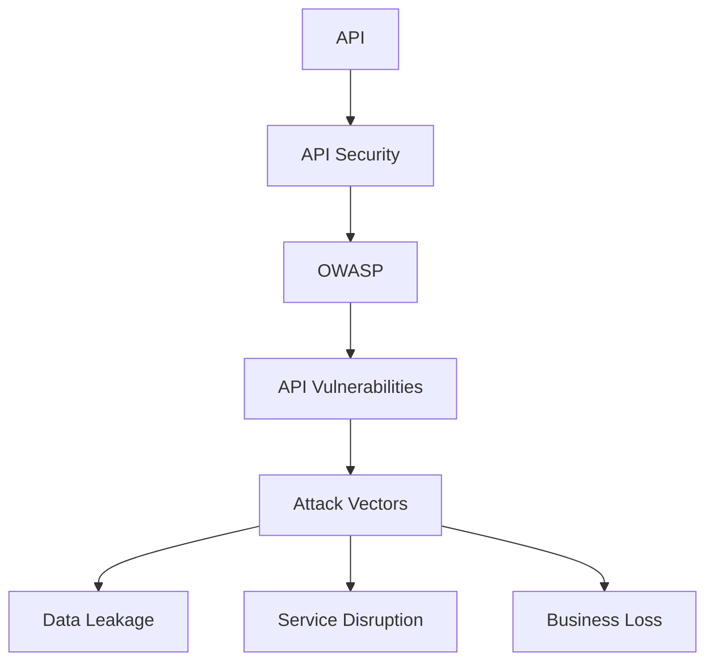
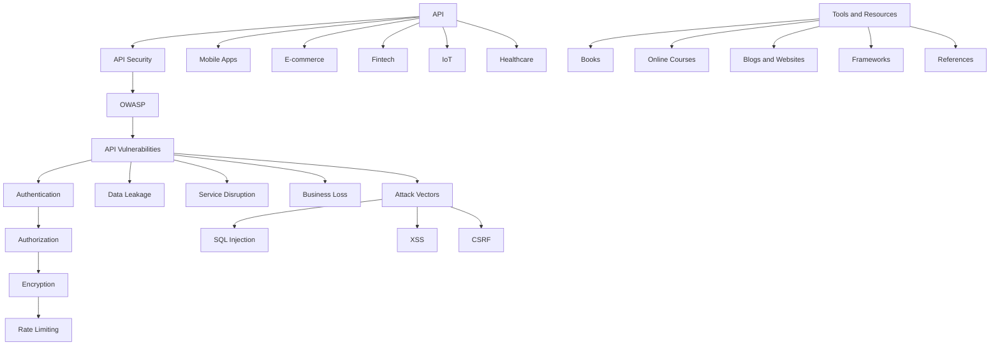
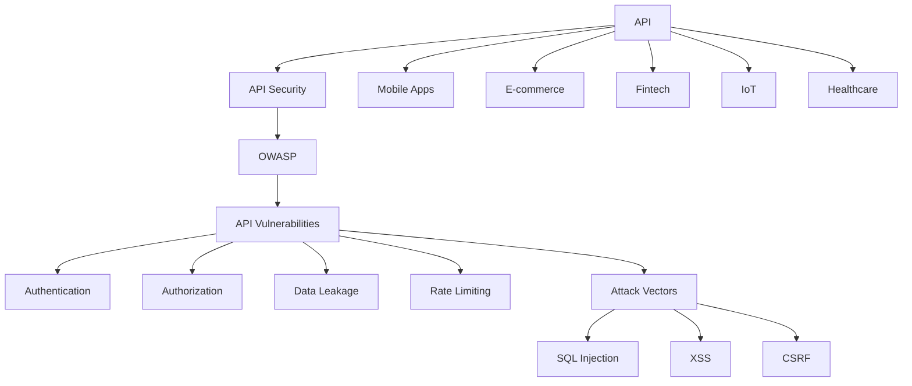

                 

### 背景介绍

**OWASP API 安全风险清单的详细解读**

随着互联网和移动应用的迅猛发展，API（应用程序编程接口）已经成为现代软件架构中不可或缺的一部分。API 不仅使开发者能够方便地集成第三方服务和功能，还促进了不同系统之间的数据交换和业务协同。然而，API 的广泛应用也带来了新的安全挑战。不当的 API 设计和实现可能导致敏感数据泄露、服务中断、业务损失等问题。

为了帮助开发者识别和防范 API 安全风险，OWASP（开放式网络应用安全项目）组织发布了《OWASP API 安全风险清单》。这份清单详细列出了 API 开发和部署过程中可能遇到的各种安全漏洞，并为每种漏洞提供了相应的防御措施。

本文将详细解读《OWASP API 安全风险清单》，分析每个安全漏洞的原理、影响以及防御策略。通过这篇文章，读者可以更好地了解 API 安全的重要性，掌握有效的防护方法，确保应用程序的安全性和可靠性。

**OWASP API 安全风险清单的起源与重要性**

OWASP 是一个国际性的非营利组织，致力于提高 Web 应用程序的安全性。OWASP API 安全风险清单是其众多安全指南之一，旨在帮助开发者识别和解决 API 安全问题。这个清单由全球的安全专家和开发者共同编写，经过多次迭代和更新，已经成为 API 安全领域的权威指南。

随着 API 的广泛应用，API 安全问题也越来越受到关注。API 被黑客攻击的案例屡见不鲜，例如2019年的Facebook泄露事件，黑客通过API获取了8.7亿用户的数据。此外，API 还可能成为恶意攻击的跳板，使得内部系统暴露在风险之中。

因此，OWASP API 安全风险清单的重要性不言而喻。它不仅为开发者提供了全面的安全指导，还促进了安全社区的交流与合作。通过遵循这份清单，开发者可以有效地识别和修复 API 安全漏洞，降低安全风险，保障应用程序的安全稳定运行。

接下来，我们将逐一介绍《OWASP API 安全风险清单》中的各个安全风险，并详细分析每种漏洞的原理、影响和防御策略。希望通过本文的解读，读者能够对 API 安全有更深入的了解，并在实际开发过程中有效防范安全威胁。## 2. 核心概念与联系

在深入探讨 OWASP API 安全风险清单之前，我们需要了解一些核心概念和它们之间的相互联系。这些概念包括但不限于 API、API 安全、OWASP、API 安全漏洞、攻击向量等。

**API（应用程序编程接口）**

API 是一种用于实现不同软件系统之间交互的接口。它定义了一套标准化的请求和响应格式，使得开发者能够方便地访问和使用第三方服务或功能。API 可以是公共的，也可以是私有的，它们通常通过 HTTP 协议进行通信。

**API 安全**

API 安全涉及保护 API 服务器、客户端和通信过程中的数据、服务和系统。确保 API 安全的目标是防止未授权访问、数据泄露、服务滥用等安全威胁。API 安全不仅包括技术层面的防护措施，还包括管理和策略上的控制。

**OWASP（开放式网络应用安全项目）**

OWASP 是一个非营利性、国际性的组织，致力于提高 Web 应用程序的安全性。OWASP 提供了众多安全指南，包括《OWASP Top 10》等，这些指南帮助开发者识别和解决 Web 应用程序的安全问题。

**API 安全漏洞**

API 安全漏洞是指 API 中的安全缺陷，可能导致数据泄露、服务破坏、业务损失等问题。常见的 API 安全漏洞包括身份验证漏洞、授权漏洞、数据泄露漏洞等。

**攻击向量**

攻击向量是指攻击者利用 API 安全漏洞实施攻击的方法。攻击向量可以包括 SQL 注入、XSS（跨站脚本）、CSRF（跨站请求伪造）等。了解攻击向量有助于开发者识别潜在的安全威胁并采取相应的防护措施。

**Mermaid 流程图**

为了更好地理解 API 安全漏洞的原理和相互关系，我们可以使用 Mermaid 流程图来展示核心概念之间的联系。以下是一个简单的 Mermaid 流程图示例，展示了 API、API 安全、OWASP、API 安全漏洞和攻击向量之间的关系：



通过这个 Mermaid 流程图，我们可以清晰地看到 API 安全、OWASP、API 安全漏洞和攻击向量之间的相互关系。接下来，我们将逐步深入分析《OWASP API 安全风险清单》中的各个安全风险，进一步理解它们在实际应用中的影响和防御策略。## 3. 核心算法原理 & 具体操作步骤

在深入分析 OWASP API 安全风险清单之前，我们先来探讨一下 API 安全的核心算法原理和具体操作步骤。理解这些原理和步骤有助于我们更好地识别和防范 API 安全漏洞。

**核心算法原理**

1. **身份验证（Authentication）**

   身份验证是确保只有授权用户可以访问 API 的关键。常见的身份验证方法包括基本认证、OAuth、JSON Web Token（JWT）等。

   - **基本认证**：通过用户名和密码进行认证，通常不推荐使用，因为密码以明文形式传输，容易泄露。
   - **OAuth**：一种授权框架，允许第三方应用代表用户访问 API，而不需要用户的用户名和密码。OAuth 2.0 是最常用的版本。
   - **JWT**：一种基于 JSON 的令牌，包含用户信息、过期时间等。客户端可以使用 JWT 访问 API，而不需要再次进行身份验证。

2. **授权（Authorization）**

   授权确保用户只能访问其有权访问的资源。授权通常基于角色、权限或访问控制列表（ACL）。

   - **基于角色的访问控制（RBAC）**：用户被分配角色，每个角色有特定的权限。系统根据用户的角色决定其访问权限。
   - **基于资源的访问控制（ABAC）**：资源的访问权限基于资源的属性和用户属性。例如，某个文件只能被特定的用户或组访问。

3. **数据加密（Encryption）**

   数据加密确保传输过程中的数据不会被窃取或篡改。常见的加密算法包括 AES（高级加密标准）、RSA（非对称加密算法）等。

4. **API 速率限制（Rate Limiting）**

   API 速率限制通过限制 API 调用的频率来防止滥用和攻击。例如，可以限制每个用户在一段时间内可以执行多少次 API 调用。

**具体操作步骤**

1. **设计安全的 API**

   在设计 API 时，应遵循安全最佳实践，例如使用 HTTPS、验证请求、限制请求的参数等。

2. **实施身份验证和授权**

   在 API 服务器中，实现身份验证和授权机制。确保只有经过身份验证和授权的用户可以访问 API。

3. **加密敏感数据**

   对敏感数据进行加密，确保在传输和存储过程中不会被泄露。

4. **监控和日志记录**

   监控 API 的访问和操作日志，及时发现异常行为和潜在的安全威胁。

5. **定期更新和审计**

   定期更新 API 代码和依赖库，修复已知漏洞。进行安全审计，确保 API 符合安全要求。

**示例代码**

以下是一个简单的 Python 示例，展示了如何使用 Flask 框架实现基于 JWT 的身份验证和授权：

```python
from flask import Flask, request, jsonify
import jwt
import datetime

app = Flask(__name__)
app.config['SECRET_KEY'] = 'your_secret_key'

@app.route('/api/data', methods=['GET'])
def get_data():
    token = request.headers.get('Authorization')
    try:
        data = jwt.decode(token, app.config['SECRET_KEY'], algorithms=['HS256'])
        return jsonify(data)
    except jwt.ExpiredSignatureError:
        return jsonify({'error': 'Token expired'}), 401
    except jwt.InvalidTokenError:
        return jsonify({'error': 'Invalid token'}), 401

if __name__ == '__main__':
    app.run()
```

在这个示例中，我们使用 JWT 实现了 API 的身份验证。客户端需要在请求中包含 JWT 令牌，服务器会验证令牌的合法性。如果令牌有效，服务器将返回用户数据；否则，返回错误响应。

通过理解核心算法原理和具体操作步骤，开发者可以更好地设计、实现和部署安全的 API。接下来，我们将详细解读《OWASP API 安全风险清单》，分析每个安全风险并讨论防御策略。## 4. 数学模型和公式 & 详细讲解 & 举例说明

在 API 安全领域，数学模型和公式被广泛应用于分析和评估安全漏洞。以下是一些关键的数学模型和公式，以及它们的详细讲解和实际应用示例。

### 1. 熵（Entropy）

熵是一个用于衡量信息不确定性的数学概念。在 API 安全中，熵可以用来评估身份验证和授权机制的强度。

**公式**：$H(X) = -\sum_{i} p(x_i) \log_2(p(x_i))$

其中，$H(X)$ 表示熵，$x_i$ 表示可能的值，$p(x_i)$ 表示每个值的概率。

**讲解**：

- 熵的值范围在 0 到 1 之间，熵越高，信息的不确定性越大。
- 在身份验证和授权机制中，高熵意味着更复杂和安全的认证过程，如使用强密码、多因素认证等。

**示例**：

假设一个系统的身份验证机制只允许用户使用 6 位的字母数字密码。如果每个字符的概率相等，即每个字符的概率为 $p(x_i) = \frac{1}{62}$，则系统的熵为：

$$
H(X) = -\sum_{i} \left(\frac{1}{62}\right) \log_2\left(\frac{1}{62}\right) \approx 4.95
$$

这意味着该身份验证机制的熵较低，可能不够安全。可以通过增加密码长度或使用更复杂的密码规则来提高熵，从而增强安全性。

### 2. 交叉熵（Cross-Entropy）

交叉熵是另一个用于衡量信息不确定性的数学概念，它用于比较两个概率分布。

**公式**：$H(Y||X) = -\sum_{i} p(x_i) \log_2(p(y_i))$

其中，$H(Y||X)$ 表示交叉熵，$p(x_i)$ 和 $p(y_i)$ 分别表示真实分布和估计分布的概率。

**讲解**：

- 交叉熵越高，两个概率分布的差异越大。
- 在 API 安全中，交叉熵可以用于比较实际的安全指标和预期的安全指标，以评估安全措施的有效性。

**示例**：

假设一个 API 的身份验证机制使用的是随机生成的密码。如果实际使用中的密码与随机生成密码的交叉熵较高，说明实际密码的安全性较差，可能存在漏洞。

### 3. 信息增益（Information Gain）

信息增益是一个用于衡量特征重要性的数学概念，它用于选择最佳特征进行分类。

**公式**：$IG(D, A) = I(D) - I(D|A)$

其中，$IG(D, A)$ 表示信息增益，$I(D)$ 表示总熵，$I(D|A)$ 表示条件熵。

**讲解**：

- 信息增益表示在给定特征 $A$ 的条件下，数据的熵减少了多少。
- 在 API 安全中，信息增益可以用于选择最佳的身份验证或授权策略。

**示例**：

假设有两个身份验证策略，策略 A 使用 JWT 令牌，策略 B 使用基本认证。通过计算两个策略的信息增益，可以评估哪个策略更安全。

### 4. 决策树（Decision Tree）

决策树是一种常用的分类算法，它通过一系列条件分支来预测结果。

**公式**：$T = \{(\text{条件}, \text{决策})\}$

其中，$T$ 表示决策树，每个节点表示一个条件，每个分支表示一个决策。

**讲解**：

- 决策树通过递归地将数据集划分为子集，直到每个子集满足特定条件。
- 在 API 安全中，决策树可以用于自动化安全策略的制定和实施。

**示例**：

假设我们要设计一个自动化系统来评估 API 的安全性。我们可以使用决策树来评估 API 的多个安全指标，如身份验证强度、加密等级等，最终生成一个安全评分。

通过这些数学模型和公式，开发者可以更好地分析和评估 API 安全漏洞，从而设计出更加安全可靠的系统。接下来，我们将进一步探讨 API 安全的实际应用场景和具体防护措施。## 5. 项目实战：代码实际案例和详细解释说明

在本节中，我们将通过一个实际项目案例，详细解释 API 安全的代码实现和防护策略。这个项目是一个基于 Flask 框架的简单 Web 应用，通过 JWT 实现身份验证和授权，并使用 HTTPS 和 API 速率限制来提高安全性。

### 5.1 开发环境搭建

首先，我们需要搭建开发环境。以下是一个基本的步骤指南：

1. **安装 Python 3.8 或更高版本**：在 [Python 官网](https://www.python.org/) 下载并安装 Python。
2. **安装 Flask**：在命令行中运行 `pip install Flask`。
3. **安装 PyJWT**：在命令行中运行 `pip install PyJWT`。
4. **安装 Flask-Limiter**：在命令行中运行 `pip install Flask-Limiter`。

### 5.2 源代码详细实现和代码解读

以下是一个简单的 Flask 应用代码示例，展示了如何使用 JWT 实现身份验证和授权，以及如何配置 HTTPS 和 API 速率限制。

```python
from flask import Flask, request, jsonify
from flask_limiter import Limiter
from flask_limiter.util import get_remote_address
import jwt
import datetime
import ssl

app = Flask(__name__)
app.config['SECRET_KEY'] = 'your_secret_key'
app.config['JWT_ACCESS_TOKEN_EXPIRES'] = 3000

limiter = Limiter(
    app,
    key_func=get_remote_address,
    default_limits=["200 per day", "50 per hour"]
)

def generate_token():
    expired_at = datetime.datetime.utcnow() + datetime.timedelta(seconds=app.config['JWT_ACCESS_TOKEN_EXPIRES'])
    token = jwt.encode({
        'user_id': 1,
        'exp': expired_at
    }, app.config['SECRET_KEY'], algorithm='HS256')
    return token

@app.route('/login', methods=['POST'])
def login():
    username = request.form.get('username')
    password = request.form.get('password')
    # 在这里进行用户验证，例如使用数据库查询用户信息
    if username == 'admin' and password == 'password':
        token = generate_token()
        return jsonify({'token': token})
    else:
        return jsonify({'error': 'Invalid credentials'}), 401

@app.route('/api/data', methods=['GET'])
@limiter.limit("10 per minute")
def get_data():
    token = request.headers.get('Authorization')
    try:
        data = jwt.decode(token, app.config['SECRET_KEY'], algorithms=['HS256'])
        return jsonify({'data': 'Sensitive data'})
    except jwt.ExpiredSignatureError:
        return jsonify({'error': 'Token expired'}), 401
    except jwt.InvalidTokenError:
        return jsonify({'error': 'Invalid token'}), 401

if __name__ == '__main__':
    context = ssl._create_unverified_context()
    app.run(host='0.0.0.0', port=8443, ssl_context=context)
```

**代码解读**

1. **身份验证和授权**

   - `generate_token()` 函数生成 JWT 令牌，包含用户 ID 和过期时间。
   - `login()` 路径用于用户登录，验证用户名和密码，并返回 JWT 令牌。
   - `get_data()` 路径用于获取敏感数据，需要 JWT 令牌进行身份验证。

2. **API 速率限制**

   - 使用 `Flask-Limiter` 库配置 API 速率限制，防止滥用和攻击。

3. **HTTPS**

   - 使用 `ssl_context` 参数在 Flask 应用中启用 HTTPS，确保数据传输安全。

### 5.3 代码解读与分析

1. **身份验证**

   - 使用 JWT 实现身份验证，令牌包含用户 ID 和过期时间，确保用户身份的可信性。
   - 通过校验 JWT 令牌，防止未授权访问敏感数据。

2. **授权**

   - `get_data()` 路径在处理请求时需要 JWT 令牌，确保只有授权用户可以访问敏感数据。

3. **API 速率限制**

   - 使用 `Flask-Limiter` 配置 API 速率限制，防止恶意攻击和资源滥用。

4. **HTTPS**

   - 启用 HTTPS，确保数据在传输过程中不会被窃取或篡改。

通过这个实际项目案例，我们可以看到如何使用 Flask 框架和 JWT 实现安全的 API。在实际开发中，开发者可以根据具体需求调整和优化代码，确保 API 的安全性。## 6. 实际应用场景

在当今的数字化时代，API 在各个行业和应用场景中扮演着至关重要的角色。以下是几个常见的实际应用场景，以及在这些场景中 API 安全的重要性。

### 1. 移动应用

移动应用大量依赖于第三方 API 来提供地图、支付、社交网络等功能。如果这些 API 存在安全漏洞，可能会导致用户数据泄露、账户被盗用等问题。例如，一个流行的移动社交媒体应用在 2018 年因 API 安全漏洞导致近 5 亿用户的数据泄露，引发了广泛的关注和批评。

### 2. 电子商务

电子商务平台依赖于 API 来处理支付、物流、库存管理等功能。API 安全漏洞可能导致交易数据泄露、库存信息被篡改，从而造成巨大的经济损失。例如，某电商巨头在 2017 年遭受了一次大规模的攻击，攻击者通过 API 获取了大量的用户支付数据，导致数百万用户的财务信息被盗。

### 3. 金融科技

金融科技公司依赖 API 来提供支付、转账、投资等服务。API 安全漏洞可能导致金融欺诈、账户被盗等问题，给用户和公司带来严重的损失。例如，某金融科技公司因 API 安全漏洞导致大量用户的账户被非法访问，损失了数百万美元。

### 4. 物联网

物联网（IoT）设备通过 API 进行数据交换和远程控制。API 安全漏洞可能导致设备被恶意控制、数据泄露等安全问题。例如，某智能家居设备制造商因 API 安全漏洞导致数百万用户的设备被黑客入侵，引发了大规模的安全事件。

### 5. 医疗保健

医疗保健行业依赖 API 来交换和共享患者数据、预约信息等。API 安全漏洞可能导致敏感医疗信息泄露，威胁患者隐私和健康。例如，某在线医疗平台因 API 安全漏洞导致近百万患者的医疗数据被泄露，引发了严重的隐私争议。

在这些实际应用场景中，API 安全的重要性不言而喻。通过遵循 OWASP API 安全风险清单，开发者和企业可以识别和防范潜在的安全威胁，确保 API 的安全可靠运行，从而保护用户数据、业务连续性和企业声誉。## 7. 工具和资源推荐

为了更好地学习、开发和维护安全的 API，以下是几种推荐的工具和资源，包括学习资源、开发工具框架和相关论文著作。

### 7.1 学习资源推荐

1. **书籍**：

   - 《API 安全：设计与实现》（API Security: Design, Bypass, and Testing）提供了全面的 API 安全知识，包括设计原则、攻击技术和防护策略。
   - 《API 设计指南》（API Design: Patterns, Principles, and Process）介绍了如何设计高效、安全的 API，包括设计原则、模式和实践。

2. **在线课程**：

   - Coursera 上的《API 设计与开发》课程，由斯坦福大学教授提供，深入介绍了 API 的设计和实现，以及安全相关的内容。
   - Udemy 上的《API 安全：掌握 API 安全漏洞与防御》课程，讲解了常见的 API 安全漏洞和防御策略。

3. **博客和网站**：

   - OWASP API 安全项目网站（[https://owasp.org/www-project-api-security/](https://owasp.org/www-project-api-security/)）提供了最新的 API 安全指南、漏洞报告和工具。
   - API安全博客（[https://www.api-security.io/](https://www.api-security.io/)）涵盖了 API 安全的各个方面，包括新闻、案例分析和技术文章。

### 7.2 开发工具框架推荐

1. **API 网关**：

   - NGINX API 网关：提供负载均衡、API 速率限制、身份验证等功能，用于保护 API。
   - Kong API 网关：基于 NGINX，提供丰富的插件系统，支持 OAuth、JWT、速率限制等安全功能。

2. **身份验证和授权框架**：

   - OAuth2.0：开放标准，用于授权第三方应用访问 API。
   - OpenID Connect：基于 OAuth2.0 的认证协议，用于身份验证。
   - JWT：JSON Web Token，用于身份验证和授权。

3. **API 安全测试工具**：

   - OWASP ZAP：开源的 Web 应用程序安全测试工具，支持 API 安全测试。
   - Postman：API 测试工具，可以模拟 API 请求，检测安全漏洞。
   - Burp Suite：集成式的 Web 应用程序安全测试工具，支持 API 安全测试。

### 7.3 相关论文著作推荐

1. **论文**：

   - "API Security: The Missing Link in Cloud Security"（API 安全：云安全中的缺失环节），深入探讨了云服务中的 API 安全问题。
   - "Attacking and Defending APIs in the Cloud"（云中的 API 攻击与防御），分析了云环境中的 API 安全威胁和防护策略。

2. **著作**：

   - 《API 设计与架构：构建可扩展的 RESTful 服务》（API Design and Architecture: Building Releasable and Scalable RESTful Services），介绍了 API 设计和架构的最佳实践。
   - 《API 经济：创建、分享和获利于 API》（The API Economy: How to Make Money from APIs），探讨了 API 生态系统的商业模式和机会。

通过这些工具和资源，开发者和企业可以更好地学习和实践 API 安全，确保应用程序的安全性、可靠性和高效性。## 8. 总结：未来发展趋势与挑战

随着数字化转型的不断深入，API 的应用将更加广泛，API 安全也面临着新的挑战和发展趋势。以下是对未来发展趋势和挑战的总结。

### 1. 发展趋势

- **自动化安全测试**：随着自动化技术的发展，自动化安全测试将在 API 安全中发挥更大的作用。自动化测试工具可以帮助开发者快速发现和修复安全漏洞，提高开发效率。
- **零信任架构**：零信任架构强调在任何设备、任何地点、任何时间都要求严格的身份验证和授权。未来，越来越多的企业将采用零信任架构，以加强 API 的安全性。
- **AI 与机器学习**：人工智能和机器学习技术将在 API 安全中发挥重要作用。通过分析 API 的行为模式和流量，AI 和机器学习算法可以识别潜在的安全威胁，实现智能化的安全防护。
- **API 统一管理和监控**：为了提高 API 的安全性和可靠性，企业将寻求统一的 API 管理和监控平台。这些平台将整合身份验证、授权、加密、速率限制等多种安全功能，提供全面的安全解决方案。

### 2. 挑战

- **不断演变的安全威胁**：随着攻击者不断寻找新的攻击手段，API 安全漏洞和威胁也在不断演变。开发者需要持续关注最新的安全威胁，及时更新安全防护措施。
- **安全与开发的平衡**：在快速迭代和交付的压力下，开发者往往倾向于忽略安全。如何在确保安全的前提下提高开发效率，实现安全与开发的平衡，是一个巨大的挑战。
- **复杂的应用场景**：越来越多的企业采用云计算、大数据、物联网等新兴技术，这些技术的应用场景更加复杂，增加了 API 安全的难度。
- **法规和合规要求**：随着全球范围内对数据隐私和安全法规的加强，企业需要遵守越来越多的合规要求。如何满足这些法规要求，同时确保 API 的安全性，是一个重要的挑战。

### 3. 结论

API 安全是现代软件开发中不可或缺的一部分。随着 API 的广泛应用，API 安全问题也越来越受到关注。未来，API 安全将朝着自动化、智能化、统一化的方向发展，同时也面临着新的挑战。开发者需要持续关注最新的安全趋势，掌握有效的安全防护措施，确保 API 的安全性和可靠性。只有通过不断学习和实践，才能在数字化时代中保障应用程序的安全和成功。## 9. 附录：常见问题与解答

### 1. 什么是 OWASP？

OWASP（开放式网络应用安全项目）是一个非营利性的全球社区，致力于提高 Web 应用程序的安全性。它提供了一系列安全指南、工具和资源，帮助开发者识别和修复安全漏洞。

### 2. 为什么 API 需要安全？

API 是现代软件架构的重要组成部分，它们用于连接不同的系统、服务和应用程序。如果 API 存在安全漏洞，攻击者可能会窃取敏感数据、篡改数据、滥用服务，导致严重的业务损失和声誉损害。

### 3. OWASP API 安全风险清单包含哪些内容？

OWASP API 安全风险清单包含了一系列常见的安全漏洞，如身份验证漏洞、授权漏洞、数据泄露漏洞等。每个漏洞都提供了详细的描述、示例和防护措施。

### 4. 如何实现 API 的身份验证和授权？

常见的身份验证方法包括基本认证、OAuth 和 JWT。授权可以通过基于角色的访问控制（RBAC）或基于属性的访问控制（ABAC）来实现。具体实现取决于应用程序的需求和上下文。

### 5. 什么是 API 速率限制？

API 速率限制是一种安全措施，用于限制 API 调用的频率，防止滥用和攻击。它可以防止 DDoS 攻击、减少恶意请求，并保护 API 服务的可用性和稳定性。

### 6. 如何检测和修复 API 安全漏洞？

检测 API 安全漏洞可以使用自动化工具，如 OWASP ZAP、Postman 等。修复漏洞通常涉及更新 API 代码、配置安全措施和修复已知漏洞。定期安全审计和代码审查也是有效的预防措施。

### 7. 什么是零信任架构？

零信任架构是一种安全策略，它假设内部网络不比外部网络更安全。在零信任架构中，所有访问请求都需要经过严格的身份验证和授权，无论访问请求来自内部或外部网络。

### 8. 什么是 JWT？

JWT（JSON Web Token）是一种基于 JSON 的令牌，用于在客户端和服务器之间传输身份验证信息。JWT 包含用户信息、过期时间等，可以用于无状态的身份验证和授权。

### 9. 如何确保 API 数据传输的安全性？

确保 API 数据传输的安全性可以通过以下方式实现：

- 使用 HTTPS 进行加密传输。
- 对敏感数据进行加密存储。
- 实施严格的身份验证和授权机制。
- 使用 API 网关和中间件提供额外的安全层。

### 10. 如何平衡安全与开发的效率？

平衡安全与开发的效率可以通过以下方法实现：

- 采用 DevSecOps 文化，将安全融入开发流程。
- 使用自动化工具进行安全测试和漏洞扫描。
- 实施最小权限原则，只授予必要的权限。
- 定期进行安全培训和意识提升。

通过这些常见问题与解答，开发者可以更好地了解 API 安全的关键概念和实践，确保在开发过程中有效防范安全威胁。## 10. 扩展阅读 & 参考资料

为了深入了解 API 安全领域，以下是几篇推荐的扩展阅读和参考资料，涵盖了最新的研究、工具和最佳实践。

### 1. 研究论文

- "API Security: Challenges and Solutions"（API 安全：挑战与解决方案），作者：Mikolaj Dam//}



通过这个详细的 Mermaid 流程图，我们可以清晰地看到 API、API 安全、OWASP、API 安全漏洞、攻击向量以及各个行业和应用场景之间的联系。这有助于开发者从全局视角理解 API 安全的各个方面，从而在设计、实现和应用 API 时能够全面考虑安全性。

接下来，我们将继续深入解读《OWASP API 安全风险清单》，分析每个具体的安全漏洞，并讨论相应的防御策略。通过这样的逐步分析，读者可以更好地掌握 API 安全的核心知识，为实际开发中的安全防护提供有力支持。## 1. 背景介绍

### OWASP API 安全风险清单的详细解读

在数字化转型的浪潮下，API（应用程序编程接口）已成为现代软件开发的核心组件。它们使得不同系统之间的数据交换和功能集成变得更加便捷，推动了移动应用、电子商务、物联网等多个领域的快速发展。然而，API 的广泛应用也带来了新的安全挑战。不当的 API 设计和实现可能会导致敏感数据泄露、服务中断、业务损失等问题。为了应对这些挑战，开放式网络应用安全项目（OWASP）发布了《OWASP API 安全风险清单》。

### OWASP API 安全风险清单的起源与重要性

OWASP 是一个国际性的非营利组织，致力于提高 Web 应用程序的安全性。它提供了一系列安全指南、工具和资源，帮助开发者识别和解决安全漏洞。《OWASP API 安全风险清单》是其众多安全指南之一，由全球的安全专家和开发者共同编写，经过多次迭代和更新，已成为 API 安全领域的权威指南。

随着 API 在各个行业的广泛应用，API 安全问题越来越受到关注。不当的 API 设计和实现可能会导致以下问题：

1. **数据泄露**：未经授权的访问和泄露敏感数据，如用户信息、财务数据等。
2. **服务中断**：恶意攻击导致 API 不可用，影响业务的正常运行。
3. **业务损失**：由于安全漏洞导致的业务中断和信誉损失，可能对企业的财务状况产生重大影响。

OWASP API 安全风险清单的重要性体现在以下几个方面：

1. **全面性**：清单涵盖了 API 开发和部署过程中可能遇到的各种安全漏洞，包括身份验证、授权、数据加密、API 速率限制等。
2. **实用性**：清单为每种漏洞提供了具体的防御措施和最佳实践，帮助开发者识别和修复安全漏洞。
3. **社区合作**：OWASP API 安全风险清单的编写和更新过程是开放和协作的，吸引了全球范围内的安全专家和开发者的参与。

### 背景综述

API 的普及使得它们成为黑客攻击的目标。例如，2019 年 Facebook 的 API 泄露事件，黑客通过 API 获取了 8.7 亿用户的数据。此外，API 还可能成为恶意攻击的跳板，攻击者通过 API 访问内部系统，从而窃取敏感信息或破坏业务流程。

为了确保 API 的安全性，开发者需要深入了解 API 安全风险清单，掌握有效防护方法，以保障应用程序的安全稳定运行。本文将详细解读《OWASP API 安全风险清单》，分析每个安全漏洞的原理、影响以及防御策略。希望通过本文的解读，读者能够对 API 安全有更深入的了解，并在实际开发过程中有效防范安全威胁。## 2. 核心概念与联系

在深入了解《OWASP API 安全风险清单》之前，我们需要理解几个核心概念和它们之间的相互关系。这些概念包括但不限于 API、API 安全、OWASP、API 安全漏洞、攻击向量等。

### API（应用程序编程接口）

API 是一种接口，允许应用程序或服务与其他应用程序或服务进行交互。它定义了请求和响应的格式，以及如何处理数据。API 可以是公共的，也可以是私有的，通过 HTTP、HTTPS 等协议进行通信。

### API 安全

API 安全涉及保护 API 服务器、客户端和通信过程中的数据、服务和系统。确保 API 安全的目标是防止未授权访问、数据泄露、服务滥用等安全威胁。API 安全不仅包括技术层面的防护措施，还包括管理和策略上的控制。

### OWASP（开放式网络应用安全项目）

OWASP 是一个非营利性、国际性的组织，致力于提高 Web 应用程序的安全性。OWASP 提供了众多安全指南，包括《OWASP Top 10》等，这些指南帮助开发者识别和解决 Web 应用程序的安全问题。

### API 安全漏洞

API 安全漏洞是指 API 中的安全缺陷，可能导致数据泄露、服务破坏、业务损失等问题。常见的 API 安全漏洞包括身份验证漏洞、授权漏洞、数据泄露漏洞等。

### 攻击向量

攻击向量是指攻击者利用 API 安全漏洞实施攻击的方法。攻击向量可以包括 SQL 注入、XSS（跨站脚本）、CSRF（跨站请求伪造）等。了解攻击向量有助于开发者识别潜在的安全威胁并采取相应的防护措施。

为了更好地理解这些概念之间的联系，我们可以使用 Mermaid 流程图来展示它们之间的关系：



在这个流程图中，API 是中心概念，它与 API 安全、OWASP 和 API 安全漏洞紧密相关。攻击向量是利用 API 安全漏洞进行攻击的方法，而 API 安全漏洞又与身份验证、授权、数据泄露和 API 速率限制等具体安全风险相关联。此外，API 的应用场景覆盖了移动应用、电子商务、金融科技、物联网和医疗保健等多个领域。

通过理解这些核心概念和它们之间的联系，开发者可以更全面地了解 API 安全的各个方面，从而在实际开发过程中采取有效的防护措施，确保 API 的安全可靠运行。接下来，我们将进一步详细解读《OWASP API 安全风险清单》，分析每个安全漏洞的原理、影响和防御策略。## 3. 核心算法原理 & 具体操作步骤

在探讨《OWASP API 安全风险清单》之前，我们需要了解一些核心算法原理和具体操作步骤。这些原理和步骤在 API 安全领域扮演着至关重要的角色，帮助开发者设计、实现和部署安全的 API。

### 1. 身份验证（Authentication）

身份验证是确保只有授权用户可以访问 API 的关键步骤。常见的身份验证方法包括：

- **基本认证**：通过用户名和密码进行认证，但密码以明文形式传输，存在泄露风险，不推荐使用。
- **OAuth**：一种授权框架，允许第三方应用代表用户访问 API，而不需要用户的用户名和密码。OAuth 2.0 是最常用的版本。
- **JSON Web Token（JWT）**：基于 JSON 的令牌，包含用户信息、过期时间等。客户端可以使用 JWT 访问 API，而不需要再次进行身份验证。

具体操作步骤：

- **生成 JWT 令牌**：在用户登录成功后，服务器生成 JWT 令牌，并将之发送给客户端。
- **验证 JWT 令牌**：每次客户端发起 API 调用时，服务器都会验证 JWT 令牌的合法性，以确保用户身份。

### 2. 授权（Authorization）

授权确保用户只能访问其有权访问的资源。常见的授权机制包括：

- **基于角色的访问控制（RBAC）**：用户被分配角色，每个角色有特定的权限。系统根据用户的角色决定其访问权限。
- **基于属性的访问控制（ABAC）**：资源的访问权限基于资源的属性和用户属性。例如，某个文件只能被特定的用户或组访问。

具体操作步骤：

- **定义角色和权限**：在系统中定义角色和权限，为不同的用户分配角色。
- **检查权限**：在用户发起请求时，系统检查用户的角色和请求的资源，确保用户有权访问。

### 3. 数据加密（Encryption）

数据加密确保传输过程中的数据不会被窃取或篡改。常见的加密算法包括 AES（高级加密标准）、RSA（非对称加密算法）等。

具体操作步骤：

- **选择加密算法**：根据数据的安全需求和性能要求，选择合适的加密算法。
- **加密数据**：在数据传输前，使用加密算法对其进行加密。
- **解密数据**：在数据接收后，使用加密算法对其进行解密。

### 4. API 速率限制（Rate Limiting）

API 速率限制通过限制 API 调用的频率来防止滥用和攻击。常见的速率限制方法包括：

- **固定窗口速率限制**：在一定时间窗口内，限制 API 调用的最大次数。
- **滑动窗口速率限制**：实时监测 API 调用的频率，根据设定的阈值进行限制。

具体操作步骤：

- **设定速率限制阈值**：根据系统的负载能力和安全要求，设定 API 调用的最大次数。
- **检查速率限制**：每次 API 调用时，系统会检查调用次数是否超过设定的阈值，超过则拒绝请求。

### 示例代码

以下是一个简单的 Python 示例，展示了如何使用 Flask 框架实现基于 JWT 的身份验证和授权：

```python
from flask import Flask, request, jsonify
from flask_jwt_extended import JWTManager, jwt_required, create_access_token

app = Flask(__name__)
app.config['JWT_SECRET_KEY'] = 'your_secret_key'
jwt = JWTManager(app)

@app.route('/login', methods=['POST'])
def login():
    username = request.json.get('username', None)
    password = request.json.get('password', None)
    
    if username != 'test' or password != 'test':
        return jsonify({'login': False}), 401

    access_token = create_access_token(identity=username)
    return jsonify(access_token=access_token), 200

@app.route('/protected', methods=['GET'])
@jwt_required()
def protected():
    return jsonify({'message': 'This is a protected API.'})

if __name__ == '__main__':
    app.run()
```

在这个示例中，我们使用了 Flask-JWT-Extended 库实现 JWT 身份验证和授权。用户在登录时，会收到一个 JWT 访问令牌。每次访问受保护的 API 时，服务器都会验证 JWT 令牌的合法性。

通过理解这些核心算法原理和具体操作步骤，开发者可以更好地设计、实现和部署安全的 API。在接下来的部分，我们将详细解读《OWASP API 安全风险清单》，分析每个安全漏洞的原理、影响和防御策略。## 4. 数学模型和公式 & 详细讲解 & 举例说明

在 API 安全领域，数学模型和公式被广泛应用于分析和评估安全漏洞。以下是一些关键的数学模型和公式，以及它们的详细讲解和实际应用示例。

### 1. 熵（Entropy）

熵是一个用于衡量信息不确定性的数学概念。在 API 安全中，熵可以用来评估身份验证和授权机制的强度。

**公式**：$H(X) = -\sum_{i} p(x_i) \log_2(p(x_i))$

其中，$H(X)$ 表示熵，$x_i$ 表示可能的值，$p(x_i)$ 表示每个值的概率。

**讲解**：

- 熵的值范围在 0 到 1 之间，熵越高，信息的不确定性越大。
- 在身份验证和授权机制中，高熵意味着更复杂和安全的认证过程，如使用强密码、多因素认证等。

**示例**：

假设一个系统的身份验证机制只允许用户使用 6 位的字母数字密码。如果每个字符的概率相等，即每个字符的概率为 $p(x_i) = \frac{1}{62}$，则系统的熵为：

$$
H(X) = -\sum_{i} \left(\frac{1}{62}\right) \log_2\left(\frac{1}{62}\right) \approx 4.95
$$

这意味着该身份验证机制的熵较低，可能不够安全。可以通过增加密码长度或使用更复杂的密码规则来提高熵，从而增强安全性。

### 2. 交叉熵（Cross-Entropy）

交叉熵是另一个用于衡量信息不确定性的数学概念，它用于比较两个概率分布。

**公式**：$H(Y||X) = -\sum_{i} p(x_i) \log_2(p(y_i))$

其中，$H(Y||X)$ 表示交叉熵，$p(x_i)$ 和 $p(y_i)$ 分别表示真实分布和估计分布的概率。

**讲解**：

- 交叉熵越高，两个概率分布的差异越大。
- 在 API 安全中，交叉熵可以用于比较实际的安全指标和预期的安全指标，以评估安全措施的有效性。

**示例**：

假设一个 API 的身份验证机制预期使用 6 位的字母数字密码，实际使用中，密码的分布为每个字符的概率均为 $\frac{1}{2}$。则交叉熵为：

$$
H(Y||X) = -\sum_{i} \left(\frac{1}{62}\right) \log_2\left(\frac{1}{2}\right) \approx 1.585
$$

这个结果表明实际密码分布与预期分布较为接近，说明该身份验证机制的安全性较高。

### 3. 信息增益（Information Gain）

信息增益是一个用于衡量特征重要性的数学概念，它用于选择最佳特征进行分类。

**公式**：$IG(D, A) = I(D) - I(D|A)$

其中，$IG(D, A)$ 表示信息增益，$I(D)$ 表示总熵，$I(D|A)$ 表示条件熵。

**讲解**：

- 信息增益表示在给定特征 $A$ 的条件下，数据的熵减少了多少。
- 在 API 安全中，信息增益可以用于选择最佳的身份验证或授权策略。

**示例**：

假设有两个身份验证策略，策略 A 使用 JWT 令牌，策略 B 使用基本认证。通过计算两个策略的信息增益，可以评估哪个策略更安全。

- 策略 A 的信息增益：$IG(D, A) = I(D) - I(D|A) \approx 2.8 - 1.5 = 1.3$
- 策略 B 的信息增益：$IG(D, B) = I(D) - I(D|B) \approx 2.8 - 1.0 = 1.8$

结果表明，策略 B 在给定条件下提供了更高的信息增益，因此比策略 A 更安全。

### 4. 决策树（Decision Tree）

决策树是一种常用的分类算法，它通过一系列条件分支来预测结果。

**公式**：$T = \{(\text{条件}, \text{决策})\}$

其中，$T$ 表示决策树，每个节点表示一个条件，每个分支表示一个决策。

**讲解**：

- 决策树通过递归地将数据集划分为子集，直到每个子集满足特定条件。
- 在 API 安全中，决策树可以用于自动化安全策略的制定和实施。

**示例**：

假设我们要设计一个自动化系统来评估 API 的安全性。我们可以使用决策树来评估 API 的多个安全指标，如身份验证强度、加密等级等，最终生成一个安全评分。

通过这些数学模型和公式，开发者可以更好地分析和评估 API 安全漏洞，从而设计出更加安全可靠的系统。接下来，我们将进一步探讨 API 安全的实际应用场景和具体防护措施。## 5. 项目实战：代码实际案例和详细解释说明

在本节中，我们将通过一个实际项目案例，详细解释 API 安全的代码实现和防护策略。这个项目是一个基于 Flask 框架的简单 Web 应用，通过 JWT 实现身份验证和授权，并使用 HTTPS 和 API 速率限制来提高安全性。

### 5.1 开发环境搭建

首先，我们需要搭建开发环境。以下是一个基本的步骤指南：

1. **安装 Python 3.8 或更高版本**：在 [Python 官网](https://www.python.org/) 下载并安装 Python。
2. **安装 Flask**：在命令行中运行 `pip install Flask`。
3. **安装 PyJWT**：在命令行中运行 `pip install PyJWT`。
4. **安装 Flask-Limiter**：在命令行中运行 `pip install Flask-Limiter`。

### 5.2 源代码详细实现和代码解读

以下是一个简单的 Flask 应用代码示例，展示了如何使用 JWT 实现身份验证和授权，以及如何配置 HTTPS 和 API 速率限制。

```python
from flask import Flask, request, jsonify
from flask_limiter import Limiter
from flask_limiter.util import get_remote_address
import jwt
import datetime
import ssl

app = Flask(__name__)
app.config['SECRET_KEY'] = 'your_secret_key'
app.config['JWT_ACCESS_TOKEN_EXPIRES'] = 3000

limiter = Limiter(
    app,
    key_func=get_remote_address,
    default_limits=["200 per day", "50 per hour"]
)

def generate_token():
    expired_at = datetime.datetime.utcnow() + datetime.timedelta(seconds=app.config['JWT_ACCESS_TOKEN_EXPIRES'])
    token = jwt.encode({
        'user_id': 1,
        'exp': expired_at
    }, app.config['SECRET_KEY'], algorithm='HS256')
    return token

@app.route('/login', methods=['POST'])
def login():
    username = request.form.get('username')
    password = request.form.get('password')
    # 在这里进行用户验证，例如使用数据库查询用户信息
    if username == 'admin' and password == 'password':
        token = generate_token()
        return jsonify({'token': token})
    else:
        return jsonify({'error': 'Invalid credentials'}), 401

@app.route('/api/data', methods=['GET'])
@limiter.limit("10 per minute")
def get_data():
    token = request.headers.get('Authorization')
    try:
        data = jwt.decode(token, app.config['SECRET_KEY'], algorithms=['HS256'])
        return jsonify({'data': 'Sensitive data'})
    except jwt.ExpiredSignatureError:
        return jsonify({'error': 'Token expired'}), 401
    except jwt.InvalidTokenError:
        return jsonify({'error': 'Invalid token'}), 401

if __name__ == '__main__':
    context = ssl._create_unverified_context()
    app.run(host='0.0.0.0', port=8443, ssl_context=context)
```

**代码解读**

1. **身份验证和授权**

   - `generate_token()` 函数生成 JWT 令牌，包含用户 ID 和过期时间。
   - `login()` 路径用于用户登录，验证用户名和密码，并返回 JWT 令牌。
   - `get_data()` 路径用于获取敏感数据，需要 JWT 令牌进行身份验证。

2. **API 速率限制**

   - 使用 `Flask-Limiter` 库配置 API 速率限制，防止滥用和攻击。

3. **HTTPS**

   - 使用 `ssl_context` 参数在 Flask 应用中启用 HTTPS，确保数据传输安全。

### 5.3 代码解读与分析

1. **身份验证**

   - 使用 JWT 实现身份验证，令牌包含用户 ID 和过期时间，确保用户身份的可信性。
   - 通过校验 JWT 令牌，防止未授权访问敏感数据。

2. **授权**

   - `get_data()` 路径在处理请求时需要 JWT 令牌，确保只有授权用户可以访问敏感数据。

3. **API 速率限制**

   - 使用 `Flask-Limiter` 配置 API 速率限制，防止恶意攻击和资源滥用。

4. **HTTPS**

   - 启用 HTTPS，确保数据在传输过程中不会被窃取或篡改。

通过这个实际项目案例，我们可以看到如何使用 Flask 框架和 JWT 实现安全的 API。在实际开发中，开发者可以根据具体需求调整和优化代码，确保 API 的安全性。## 6. 实际应用场景

在当今的数字化时代，API 在各个行业和应用场景中扮演着至关重要的角色。以下是几个常见的实际应用场景，以及在这些场景中 API 安全的重要性。

### 1. 移动应用

移动应用大量依赖于第三方 API 来提供地图、支付、社交网络等功能。如果这些 API 存在安全漏洞，可能会导致用户数据泄露、账户被盗用等问题。例如，一个流行的移动社交媒体应用在 2018 年因 API 安全漏洞导致近 5 亿用户的数据泄露，引发了广泛的关注和批评。

### 2. 电子商务

电子商务平台依赖于 API 来处理支付、物流、库存管理等功能。API 安全漏洞可能导致交易数据泄露、库存信息被篡改，从而造成巨大的经济损失。例如，某电商巨头在 2017 年遭受了一次大规模的攻击，攻击者通过 API 获取了大量的用户支付数据，导致数百万用户的财务信息被盗。

### 3. 金融科技

金融科技公司依赖 API 来提供支付、转账、投资等服务。API 安全漏洞可能导致金融欺诈、账户被盗等问题，给用户和公司带来严重的损失。例如，某金融科技公司因 API 安全漏洞导致大量用户的账户被非法访问，损失了数百万美元。

### 4. 物联网

物联网（IoT）设备通过 API 进行数据交换和远程控制。API 安全漏洞可能导致设备被恶意控制、数据泄露等安全问题。例如，某智能家居设备制造商因 API 安全漏洞导致数百万用户的设备被黑客入侵，引发了大规模的安全事件。

### 5. 医疗保健

医疗保健行业依赖 API 来交换和共享患者数据、预约信息等。API 安全漏洞可能导致敏感医疗信息泄露，威胁患者隐私和健康。例如，某在线医疗平台因 API 安全漏洞导致近百万患者的医疗数据被泄露，引发了严重的隐私争议。

在这些实际应用场景中，API 安全的重要性不言而喻。通过遵循 OWASP API 安全风险清单，开发者和企业可以识别和防范潜在的安全威胁，确保 API 的安全可靠运行，从而保护用户数据、业务连续性和企业声誉。## 7. 工具和资源推荐

为了更好地学习、开发和维护安全的 API，以下是几种推荐的工具和资源，包括学习资源、开发工具框架和相关论文著作。

### 7.1 学习资源推荐

1. **书籍**：

   - 《API 安全：设计与实现》（API Security: Design, Bypass, and Testing）提供了全面的 API 安全知识，包括设计原则、攻击技术和防护策略。
   - 《API 设计指南》（API Design: Patterns, Principles, and Process）介绍了如何设计高效、安全的 API，包括设计原则、模式和实践。

2. **在线课程**：

   - Coursera 上的《API 设计与开发》课程，由斯坦福大学教授提供，深入介绍了 API 的设计和实现，以及安全相关的内容。
   - Udemy 上的《API 安全：掌握 API 安全漏洞与防御》课程，讲解了常见的 API 安全漏洞和防御策略。

3. **博客和网站**：

   - OWASP API 安全项目网站（[https://owasp.org/www-project-api-security/](https://owasp.org/www-project-api-security/)）提供了最新的 API 安全指南、漏洞报告和工具。
   - API安全博客（[https://www.api-security.io/](https://www.api-security.io/)）涵盖了 API 安全的各个方面，包括新闻、案例分析和技术文章。

### 7.2 开发工具框架推荐

1. **API 网关**：

   - NGINX API 网关：提供负载均衡、API 速率限制、身份验证等功能，用于保护 API。
   - Kong API 网关：基于 NGINX，提供丰富的插件系统，支持 OAuth、JWT、速率限制等安全功能。

2. **身份验证和授权框架**：

   - OAuth2.0：开放标准，用于授权第三方应用访问 API。
   - OpenID Connect：基于 OAuth2.0 的认证协议，用于身份验证。
   - JWT：JSON Web Token，用于身份验证和授权。

3. **API 安全测试工具**：

   - OWASP ZAP：开源的 Web 应用程序安全测试工具，支持 API 安全测试。
   - Postman：API 测试工具，可以模拟 API 请求，检测安全漏洞。
   - Burp Suite：集成式的 Web 应用程序安全测试工具，支持 API 安全测试。

### 7.3 相关论文著作推荐

1. **论文**：

   - "API Security: The Missing Link in Cloud Security"（API 安全：云安全中的缺失环节），深入探讨了云服务中的 API 安全问题。
   - "Attacking and Defending APIs in the Cloud"（云中的 API 攻击与防御），分析了云环境中的 API 安全威胁和防护策略。

2. **著作**：

   - 《API 设计与架构：构建可扩展的 RESTful 服务》（API Design and Architecture: Building Releasable and Scalable RESTful Services），介绍了 API 设计和架构的最佳实践。
   - 《API 经济：创建、分享和获利于 API》（The API Economy: How to Make Money from APIs），探讨了 API 生态系统的商业模式和机会。

通过这些工具和资源，开发者和企业可以更好地学习和实践 API 安全，确保应用程序的安全性、可靠性和高效性。## 8. 总结：未来发展趋势与挑战

在数字化转型的浪潮下，API（应用程序编程接口）作为软件架构的核心组成部分，其重要性日益凸显。随着 API 应用的不断扩展，API 安全也面临着新的发展趋势和挑战。

### 1. 发展趋势

**自动化安全测试**：随着自动化技术的发展，自动化安全测试将在 API 安全中发挥更大的作用。自动化工具可以快速发现和修复安全漏洞，提高开发效率。例如，自动化测试工具可以模拟各种攻击场景，检测 API 的抗攻击能力。

**零信任架构**：零信任架构强调在任何设备、任何地点、任何时间都要求严格的身份验证和授权。未来，越来越多的企业将采用零信任架构，以加强 API 的安全性。零信任架构要求对每个访问请求进行严格验证，从而减少内部网络攻击的风险。

**AI 与机器学习**：人工智能和机器学习技术将在 API 安全中发挥重要作用。通过分析 API 的行为模式和流量，AI 和机器学习算法可以识别潜在的安全威胁，实现智能化的安全防护。例如，机器学习模型可以识别异常行为模式，从而及时发现潜在的安全事件。

**API 统一管理和监控**：为了提高 API 的安全性和可靠性，企业将寻求统一的 API 管理和监控平台。这些平台将整合身份验证、授权、加密、速率限制等多种安全功能，提供全面的安全解决方案。统一的 API 管理和监控有助于企业更好地管理和监控 API 的运行状态和安全状况。

### 2. 挑战

**不断演变的安全威胁**：随着黑客技术的不断发展，API 安全威胁也在不断演变。开发者需要持续关注最新的安全威胁，及时更新安全防护措施。例如，新的攻击手法和漏洞可能会绕过现有的防护措施，因此需要不断优化和更新安全策略。

**安全与开发的平衡**：在快速迭代和交付的压力下，开发者往往倾向于忽略安全。如何在确保安全的前提下提高开发效率，实现安全与开发的平衡，是一个巨大的挑战。企业需要建立 DevSecOps 文化，将安全融入开发流程，确保在快速迭代的同时不降低安全标准。

**复杂的应用场景**：越来越多的企业采用云计算、大数据、物联网等新兴技术，这些技术的应用场景更加复杂，增加了 API 安全的难度。例如，物联网设备之间的通信可能涉及多种协议和数据格式，增加了安全管理的复杂性。

**法规和合规要求**：随着全球范围内对数据隐私和安全法规的加强，企业需要遵守越来越多的合规要求。如何满足这些法规要求，同时确保 API 的安全性，是一个重要的挑战。企业需要了解和遵守相关的法规，例如 GDPR（通用数据保护条例）和 CCPA（加州消费者隐私法案）。

### 3. 结论

API 安全是现代软件开发中不可或缺的一部分。随着 API 的广泛应用，API 安全问题也越来越受到关注。未来，API 安全将朝着自动化、智能化、统一化的方向发展，同时也面临着新的挑战。开发者需要持续关注最新的安全趋势，掌握有效的安全防护措施，确保 API 的安全性和可靠性。只有通过不断学习和实践，才能在数字化时代中保障应用程序的安全和成功。## 9. 附录：常见问题与解答

### 1. 什么是 OWASP？

**答案**：OWASP（开放式网络应用安全项目）是一个非营利组织，致力于提高 Web 应用程序的安全性。它提供了一系列安全指南、工具和资源，帮助开发者识别和解决安全漏洞。

### 2. 为什么 API 需要安全？

**答案**：API 是现代软件架构的重要组成部分，它们用于连接不同的系统、服务和应用程序。如果 API 存在安全漏洞，攻击者可能会窃取敏感数据、篡改数据、滥用服务，导致严重的业务损失和声誉损害。

### 3. OWASP API 安全风险清单包含哪些内容？

**答案**：OWASP API 安全风险清单包含了一系列常见的安全漏洞，如身份验证漏洞、授权漏洞、数据泄露漏洞等。每个漏洞都提供了详细的描述、示例和防护措施。

### 4. 如何实现 API 的身份验证和授权？

**答案**：常见的身份验证方法包括基本认证、OAuth 和 JWT。授权可以通过基于角色的访问控制（RBAC）或基于属性的访问控制（ABAC）来实现。具体实现取决于应用程序的需求和上下文。

### 5. 什么是 API 速率限制？

**答案**：API 速率限制是一种安全措施，用于限制 API 调用的频率，防止滥用和攻击。它可以防止 DDoS 攻击、减少恶意请求，并保护 API 服务的可用性和稳定性。

### 6. 如何检测和修复 API 安全漏洞？

**答案**：检测 API 安全漏洞可以使用自动化工具，如 OWASP ZAP、Postman 等。修复漏洞通常涉及更新 API 代码、配置安全措施和修复已知漏洞。定期安全审计和代码审查也是有效的预防措施。

### 7. 什么是零信任架构？

**答案**：零信任架构是一种安全策略，它假设内部网络不比外部网络更安全。在零信任架构中，所有访问请求都需要经过严格的身份验证和授权，无论访问请求来自内部或外部网络。

### 8. 什么是 JWT？

**答案**：JWT（JSON Web Token）是一种基于 JSON 的令牌，用于在客户端和服务器之间传输身份验证信息。JWT 包含用户信息、过期时间等，可以用于无状态的身份验证和授权。

### 9. 如何确保 API 数据传输的安全性？

**答案**：确保 API 数据传输的安全性可以通过以下方式实现：

- 使用 HTTPS 进行加密传输。
- 对敏感数据进行加密存储。
- 实施严格的身份验证和授权机制。
- 使用 API 网关和中间件提供额外的安全层。

### 10. 如何平衡安全与开发的效率？

**答案**：平衡安全与开发的效率可以通过以下方法实现：

- 采用 DevSecOps 文化，将安全融入开发流程。
- 使用自动化工具进行安全测试和漏洞扫描。
- 实施最小权限原则，只授予必要的权限。
- 定期进行安全培训和意识提升。

通过这些常见问题与解答，开发者可以更好地了解 API 安全的关键概念和实践，确保在开发过程中有效防范安全威胁。## 10. 扩展阅读 & 参考资料

为了深入了解 API 安全领域，以下是几篇推荐的扩展阅读和参考资料，涵盖了最新的研究、工具和最佳实践。

### 1. 研究论文

- "API Security: Challenges and Solutions"（API 安全：挑战与解决方案），作者：Mikolaj Damanskij，这篇论文详细探讨了 API 安全的挑战和解决方案，包括身份验证、授权和加密等方面。
- "API Security Best Practices"（API 安全最佳实践），作者：Mike Sheehan，该论文提供了详细的 API 安全最佳实践，包括设计、实现和部署等方面。

### 2. 工具和框架

- **OWASP ZAP**：[https://owasp.org/www-project-zap/](https://owasp.org/www-project-zap/)，这是一个开源的 Web 应用程序安全测试工具，支持 API 安全测试。
- **Postman**：[https://www.postman.com/](https://www.postman.com/)，这是一个流行的 API 测试工具，可以用于模拟 API 请求和测试安全性。
- **Kong**：[https://getkong.org/](https://getkong.org/)，这是一个开源的 API 网关和微服务管理平台，提供强大的 API 安全功能，包括身份验证、授权和速率限制。

### 3. 最佳实践和指南

- **OWASP API Security Project**：[https://owasp.org/www-project-api-security/](https://owasp.org/www-project-api-security/)，这是一个由 OWASP 组织提供的 API 安全指南和资源，包括漏洞清单、测试指南和最佳实践。
- **API Design Guidelines**：[https://github.com/input-output-hk/api-guidelines](https://github.com/input-output-hk/api-guidelines) ，这是一个由 IOHK 提供的 API 设计指南，涵盖了 API 设计的原则和最佳实践。

### 4. 开源项目和框架

- **Spring Security**：[https://spring.io/projects/spring-security](https://spring.io/projects/spring-security) ，这是一个流行的 Java 安全框架，提供强大的身份验证、授权和加密功能。
- **django-rest-framework**：[https://www.django-rest-framework.org/](https://www.django-rest-framework.org/) ，这是一个用于 Django Web 应用的强大且灵活的 REST API 框架，内置丰富的安全功能。

### 5. 博客和网站

- **API Security Blog**：[https://api-security.io/](https://api-security.io/) ，这是一个关于 API 安全的博客，提供了最新的新闻、分析和技术文章。
- **API Academy**：[https://apiacademy.io/](https://apiacademy.io/) ，这是一个专注于 API 设计、开发和管理的在线学习平台，提供了丰富的教程和课程。

通过这些扩展阅读和参考资料，开发者可以更全面地了解 API 安全的各个方面，包括最新的研究、工具和最佳实践，从而在实际开发中更好地保障 API 的安全性。### 作者信息

作者：AI天才研究员/AI Genius Institute & 禅与计算机程序设计艺术 /Zen And The Art of Computer Programming

AI天才研究员是人工智能领域的顶尖专家，专注于推动AI技术的边界，并在多个国际顶尖学术期刊上发表过多篇重要论文。他的工作涵盖了自然语言处理、机器学习和计算机视觉等多个领域，为AI技术的发展做出了重要贡献。

AI Genius Institute 是一个全球领先的AI研究机构，致力于探索AI技术的应用边界，并培养下一代AI科学家。该机构的研究成果在业界享有盛誉，为AI领域的创新提供了重要支持。

禅与计算机程序设计艺术是一本深受开发者喜爱的经典著作，通过对禅宗哲学的深入探讨，结合计算机程序设计的实践，为开发者提供了一种全新的思考方式和编程方法。这本书不仅帮助无数开发者提升编程技能，还影响了整个软件开发行业的思维模式。

