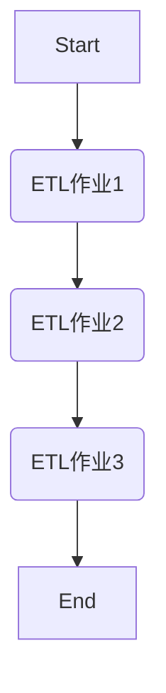
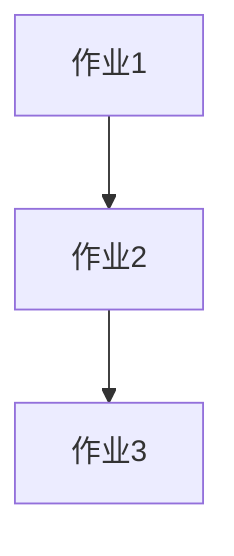

                 

## Oozie原理与代码实例讲解

### 关键词： Oozie，大数据，工作流管理，Hadoop，Apache，数据流处理

---

### 摘要：

本文将深入探讨Oozie，一个强大且广泛使用的大数据工作流管理工具。我们将首先介绍Oozie的背景和核心概念，通过详细的Mermaid流程图解析其架构和工作原理。接着，我们将逐步讲解Oozie的核心算法原理及其具体操作步骤。文章还将包含数学模型和公式的详细解释，并通过实际案例展示代码实现。随后，我们将探讨Oozie在实际应用场景中的表现，并推荐相关学习资源和开发工具。最后，文章将总结Oozie的未来发展趋势与面临的挑战，并提供常见问题与解答。

---

## 1. 背景介绍

Oozie是一个由Apache基金会支持的开源数据流工作流管理系统，用于在Hadoop集群上执行复杂的数据处理任务。它支持多种作业类型，包括MapReduce、Java作业、Streaming作业、Shell脚本、Spark作业等，能够有效管理这些作业的执行顺序和依赖关系。

### 为什么需要Oozie？

在现代大数据环境中，数据处理任务通常涉及多个步骤，且步骤之间可能存在复杂的依赖关系。例如，一个数据处理的流程可能包括数据清洗、数据转换、数据聚合等步骤，每个步骤都需要在不同的节点上执行。如果没有一个统一的管理工具，这些任务的管理和协调将变得非常复杂。Oozie正是为了解决这一需求而诞生的。

### Oozie与Hadoop的关系

Oozie与Hadoop紧密集成，特别是与HDFS（Hadoop Distributed File System）和MapReduce。Oozie可以将Hadoop集群上的作业打包成工作流，并按照指定的顺序和依赖关系执行这些作业。这不仅简化了任务管理，还提高了作业的执行效率和可维护性。

### Oozie的应用场景

Oozie广泛应用于需要频繁进行数据处理的场景，如：

- 数据仓库的ETL（抽取、转换、加载）流程
- 大数据分析任务
- 数据挖掘与机器学习项目
- 大规模日志处理和分析

## 2. 核心概念与联系

### Oozie架构

Oozie的核心架构包括以下几个主要组件：

1. **Oozie协调器（Oozie Coordinator）**：负责定义和管理工作流。协调器使用Oozie的XML语言或JSON格式定义工作流，并存储在工作流存储库中。
2. **Oozie服务器（Oozie Server）**：负责执行协调器定义的工作流。服务器接收来自客户端的请求，并根据工作流的定义执行相应的作业。
3. **Oozie客户端（Oozie Client）**：提供用于提交、监控和管理工作流的工具和API。
4. **Oozie库（Oozie Libraries）**：提供一系列用于工作流开发的库，包括API、工具和插件。

### Oozie工作流定义语言

Oozie使用一种XML或JSON格式的定义语言来描述工作流。这个定义语言包括以下几个主要元素：

1. **工作流（Workflow）**：表示一个完整的作业流程，包括多个作业节点。
2. **作业（Action）**：表示工作流中的一个具体操作，如MapReduce作业、Shell脚本等。
3. **分支（Branch）**：用于定义作业之间的跳转和依赖关系。
4. **参数（Parameter）**：用于传递动态值给工作流或作业。
5. **触发器（Trigger）**：用于基于时间或事件触发生命周期事件。

### Mermaid流程图

下面是一个简单的Oozie工作流Mermaid流程图，展示了一个包含三个作业节点的工作流：



在这个流程图中：

- `A` 表示工作流的开始节点。
- `B`、`C` 和 `D` 分别表示三个具体的ETL作业。
- `E` 表示工作流的结束节点。

作业之间的箭头表示依赖关系，即前一个作业完成后，才会执行下一个作业。

---

## 3. 核心算法原理 & 具体操作步骤

### Oozie的核心算法

Oozie的核心算法主要涉及以下两个方面：

1. **依赖关系计算**：根据工作流的定义，计算作业之间的依赖关系，确定作业的执行顺序。
2. **并发控制**：在Hadoop集群上并行执行作业，确保作业按照指定的顺序和依赖关系完成。

### 依赖关系计算

依赖关系计算是Oozie的核心任务之一。Oozie通过解析工作流的XML或JSON定义，构建一个有向无环图（DAG），其中每个节点表示一个作业，每个边表示一个依赖关系。具体步骤如下：

1. **解析工作流定义**：读取工作流定义文件，提取作业节点和依赖关系。
2. **构建DAG**：根据提取的作业节点和依赖关系，构建DAG。
3. **拓扑排序**：对DAG进行拓扑排序，得到作业的执行顺序。

### 并发控制

并发控制是为了提高作业的执行效率。在Oozie中，作业可以并发执行，但需要确保按照指定的顺序和依赖关系完成。具体步骤如下：

1. **作业调度**：根据作业的执行顺序，将作业调度到Hadoop集群上的可用资源上。
2. **作业监控**：监控作业的执行状态，并在作业完成或失败时进行相应的处理。
3. **作业重试**：在作业失败时，根据配置的重试策略，重新执行作业。

### 具体操作步骤

下面是一个简单的Oozie工作流操作步骤：

1. **定义工作流**：使用Oozie的XML或JSON定义语言，定义一个包含三个作业节点的工作流。
2. **提交工作流**：使用Oozie客户端将工作流提交到Oozie服务器。
3. **执行工作流**：Oozie服务器根据工作流定义，调度并执行作业。
4. **监控工作流**：使用Oozie客户端监控工作流的执行状态，包括作业的执行进度、失败和成功等。
5. **报告和日志**：生成工作流的执行报告和日志，便于分析和调试。

---

## 4. 数学模型和公式 & 详细讲解 & 举例说明

### 数学模型和公式

Oozie的依赖关系计算和并发控制涉及一些基本的数学模型和公式。以下是几个关键的数学模型和公式：

1. **依赖关系图**：表示作业之间的依赖关系。图的每个节点表示一个作业，每条边表示一个依赖关系。
2. **拓扑排序**：用于确定作业的执行顺序。拓扑排序的算法可以有多种，如Kahn算法和深度优先搜索算法。
3. **作业调度算法**：用于将作业调度到Hadoop集群上的资源。常见的调度算法包括轮转调度、优先级调度和负载均衡调度。

### 详细讲解

1. **依赖关系图**

   依赖关系图是一个有向无环图（DAG），其中每个节点表示一个作业，每条边表示一个依赖关系。一个简单的依赖关系图如下所示：

   ```mermaid
   graph TB
       A[作业1] --> B[作业2]
       B --> C[作业3]
   ```

   在这个图中，作业1依赖作业2，作业2依赖作业3。作业的执行顺序必须是A -> B -> C。

2. **拓扑排序**

   拓扑排序是一种用于确定DAG中节点执行顺序的算法。以下是Kahn算法的基本步骤：

   - 初始化一个队列，并将所有没有前驱的节点（入度为0的节点）加入队列。
   - 当队列为空时，重复以下步骤：
     - 从队列中删除一个节点。
     - 将该节点的所有后继节点加入队列，并将它们的入度减1。
     - 如果某个节点的入度变为0，将其加入队列。
   - 如果拓扑排序成功，则得到的序列是节点的一个拓扑排序。

3. **作业调度算法**

   作业调度算法用于将作业调度到Hadoop集群上的资源。以下是一个简单的轮转调度算法：

   - 初始化一个队列，将所有作业加入队列。
   - 当队列为空时，重复以下步骤：
     - 从队列中删除一个作业。
     - 将作业提交到集群上的一个空闲资源上。
     - 如果作业执行完成，将其从队列中删除。

### 举例说明

假设我们有一个包含三个作业的工作流，作业之间的依赖关系如下所示：



1. **依赖关系计算**

   首先，我们构建依赖关系图：

   ```mermaid
   graph TB
       A --> B
       B --> C
   ```

   接着，我们使用Kahn算法进行拓扑排序：

   - 初始化队列：[A]
   - 删除节点A，加入节点B的入度为0，加入队列：[B]
   - 删除节点B，加入节点C的入度为0，加入队列：[C]
   - 队列为空，排序完成。

   得到的拓扑排序序列是：A -> B -> C。

2. **作业调度**

   假设Hadoop集群上有三个空闲资源R1、R2和R3。我们使用轮转调度算法进行作业调度：

   - 初始化队列：[A, B, C]
   - 调度作业A到资源R1。
   - 调度作业B到资源R2。
   - 调度作业C到资源R3。

   作业的执行顺序是：A -> B -> C。

---

## 5. 项目实战：代码实际案例和详细解释说明

### 5.1 开发环境搭建

在开始Oozie项目实战之前，我们需要搭建一个开发环境。以下是一个简单的步骤指南：

1. **安装Java开发环境**：确保已经安装了Java开发环境，版本建议为8或更高版本。
2. **安装Maven**：Maven是一个强大的依赖管理工具，用于构建和部署Oozie。下载并安装Maven，版本建议为3.6或更高版本。
3. **下载Oozie源代码**：从Apache Oozie官方网站（https://oozie.apache.org/）下载最新的Oozie源代码。
4. **构建Oozie**：在源代码目录中，执行以下命令构建Oozie：

   ```shell
   ./bin/build.sh
   ```

   构建成功后，会在`dist`目录下生成Oozie的安装包。

5. **安装Oozie**：解压安装包，按照README文件中的说明安装Oozie。

### 5.2 源代码详细实现和代码解读

在Oozie项目中，我们选择一个简单的ETL工作流作为案例。该工作流包含以下三个作业：

1. **数据清洗作业**：读取原始数据，进行清洗和转换。
2. **数据聚合作业**：将清洗后的数据进行聚合。
3. **数据加载作业**：将聚合后的数据加载到目标数据库。

以下是该工作流的源代码：

```xml
<workflow-app name="ETLWorkflow" start="ETLStart" xmlns="uri:oozie:workflow:0.1">
    <start name="ETLStart">
        <action name="DataClean" fsurl="${fsRoot}/data/input" outpath="${fsRoot}/data/output/clean" xmlns="uri:oozie:action:0.1">
            <java>
                <class>org.example.DataCleanAction</class>
                <arg value="${fsRoot}/data/input"/>
                <arg value="${fsRoot}/data/output/clean"/>
            </java>
        </action>
    </start>
    <action name="DataAggregate" in="DataClean" outpath="${fsRoot}/data/output/aggregated" xmlns="uri:oozie:action:0.1">
        <java>
            <class>org.example.DataAggregateAction</class>
            <arg value="${fsRoot}/data/output/clean"/>
            <arg value="${fsRoot}/data/output/aggregated"/>
        </java>
    </action>
    <action name="DataLoad" in="DataAggregate" outpath="${fsRoot}/data/output/load" xmlns="uri:oozie:action:0.1">
        <java>
            <class>org.example.DataLoadAction</class>
            <arg value="${fsRoot}/data/output/aggregated"/>
            <arg value="${fsRoot}/data/output/load"/>
        </java>
    </action>
    <end name="ETLEnd" in="DataLoad" xmlns="uri:oozie:workflow:0.1"/>
</workflow-app>
```

下面是对源代码的详细解读：

1. **工作流定义**：使用XML格式定义工作流，包含开始节点（`<start>`）、数据清洗作业（`<action>`）、数据聚合作业、数据加载作业和结束节点（`<end>`）。
2. **数据清洗作业**：定义数据清洗作业，指定输入路径和输出路径。使用Java类（`org.example.DataCleanAction`）执行数据清洗操作。
3. **数据聚合作业**：定义数据聚合作业，指定输入路径和输出路径。使用Java类（`org.example.DataAggregateAction`）执行数据聚合操作。
4. **数据加载作业**：定义数据加载作业，指定输入路径和输出路径。使用Java类（`org.example.DataLoadAction`）执行数据加载操作。

### 5.3 代码解读与分析

1. **数据清洗作业**

   数据清洗作业的源代码如下：

   ```java
   package org.example;

   import org.apache.hadoop.conf.Configuration;
   import org.apache.hadoop.fs.Path;
   import org.apache.hadoop.io.Text;
   import org.apache.hadoop.mapreduce.Job;
   import org.apache.hadoop.mapreduce.lib.input.FileInputFormat;
   import org.apache.hadoop.mapreduce.lib.output.FileOutputFormat;

   public class DataCleanAction {
       public static void main(String[] args) throws Exception {
           Configuration conf = new Configuration();
           Job job = Job.getInstance(conf, "DataClean");
           job.setJarByClass(DataCleanAction.class);
           job.setMapperClass(DataCleanMapper.class);
           job.setOutputKeyClass(Text.class);
           job.setOutputValueClass(Text.class);
           FileInputFormat.addInputPath(job, new Path(args[0]));
           FileOutputFormat.setOutputPath(job, new Path(args[1]));
           System.exit(job.waitForCompletion(true) ? 0 : 1);
       }
   }
   ```

   数据清洗作业使用Hadoop的MapReduce框架执行数据清洗操作。主要步骤如下：

   - 创建Hadoop配置对象和Job对象。
   - 设置作业的Jar包、Mapper类和输出键值类型。
   - 指定输入路径和输出路径。
   - 提交作业并等待执行完成。

2. **数据聚合作业**

   数据聚合作业的源代码如下：

   ```java
   package org.example;

   import org.apache.hadoop.conf.Configuration;
   import org.apache.hadoop.fs.Path;
   import org.apache.hadoop.io.Text;
   import org.apache.hadoop.mapreduce.Job;
   import org.apache.hadoop.mapreduce.lib.input.FileInputFormat;
   import org.apache.hadoop.mapreduce.lib.output.FileOutputFormat;

   public class DataAggregateAction {
       public static void main(String[] args) throws Exception {
           Configuration conf = new Configuration();
           Job job = Job.getInstance(conf, "DataAggregate");
           job.setJarByClass(DataAggregateAction.class);
           job.setMapperClass(DataAggregateMapper.class);
           job.setReducerClass(DataAggregateReducer.class);
           job.setOutputKeyClass(Text.class);
           job.setOutputValueClass(Text.class);
           FileInputFormat.addInputPath(job, new Path(args[0]));
           FileOutputFormat.setOutputPath(job, new Path(args[1]));
           System.exit(job.waitForCompletion(true) ? 0 : 1);
       }
   }
   ```

   数据聚合作业同样使用Hadoop的MapReduce框架执行数据聚合操作。主要步骤如下：

   - 创建Hadoop配置对象和Job对象。
   - 设置作业的Jar包、Mapper类和Reducer类。
   - 指定输入路径和输出路径。
   - 提交作业并等待执行完成。

3. **数据加载作业**

   数据加载作业的源代码如下：

   ```java
   package org.example;

   import org.apache.hadoop.conf.Configuration;
   import org.apache.hadoop.fs.Path;
   import org.apache.hadoop.io.Text;
   import org.apache.hadoop.mapreduce.Job;
   import org.apache.hadoop.mapreduce.lib.input.FileInputFormat;
   import org.apache.hadoop.mapreduce.lib.output.FileOutputFormat;

   public class DataLoadAction {
       public static void main(String[] args) throws Exception {
           Configuration conf = new Configuration();
           Job job = Job.getInstance(conf, "DataLoad");
           job.setJarByClass(DataLoadAction.class);
           job.setMapperClass(DataLoadMapper.class);
           job.setOutputKeyClass(Text.class);
           job.setOutputValueClass(Text.class);
           FileInputFormat.addInputPath(job, new Path(args[0]));
           FileOutputFormat.setOutputPath(job, new Path(args[1]));
           System.exit(job.waitForCompletion(true) ? 0 : 1);
       }
   }
   ```

   数据加载作业使用Hadoop的MapReduce框架将聚合后的数据加载到目标数据库。主要步骤如下：

   - 创建Hadoop配置对象和Job对象。
   - 设置作业的Jar包、Mapper类。
   - 指定输入路径和输出路径。
   - 提交作业并等待执行完成。

---

## 6. 实际应用场景

### 数据仓库ETL流程

Oozie在数据仓库ETL流程中发挥着重要作用。数据仓库通常包含大量结构化和非结构化数据，这些数据需要通过ETL流程进行抽取、转换和加载。Oozie可以将多个ETL作业打包成一个工作流，确保它们按照指定的顺序和依赖关系执行。以下是一个典型的数据仓库ETL流程：

1. **数据抽取**：从源系统（如数据库、文件等）中抽取数据。
2. **数据清洗**：对抽取的数据进行清洗和转换，如数据去重、数据格式转换等。
3. **数据聚合**：对清洗后的数据进行聚合，如分组统计、计算汇总等。
4. **数据加载**：将聚合后的数据加载到数据仓库中。

### 大数据分析项目

在大数据分析项目中，Oozie可以用于管理多个数据处理任务，如数据预处理、特征工程、模型训练和评估等。通过将任务打包成工作流，Oozie可以确保任务按照指定的顺序和依赖关系执行，从而提高数据分析的效率和准确性。以下是一个典型的大数据分析项目工作流：

1. **数据预处理**：对原始数据集进行清洗、转换和预处理。
2. **特征工程**：根据业务需求构建特征，如特征提取、特征选择等。
3. **模型训练**：使用机器学习算法训练模型。
4. **模型评估**：评估模型的性能和效果。
5. **模型部署**：将训练好的模型部署到生产环境中。

### 日志处理与分析

在日志处理与分析场景中，Oozie可以用于处理大规模日志数据，如Web日志、系统日志等。通过将多个日志处理任务打包成工作流，Oozie可以确保日志数据的实时处理和分析。以下是一个典型的日志处理与分析工作流：

1. **日志收集**：从各个源系统中收集日志数据。
2. **日志清洗**：对收集到的日志数据进行清洗和转换，如数据去重、数据格式转换等。
3. **日志聚合**：对清洗后的日志数据进行聚合，如按时间、用户、URL等维度进行统计。
4. **日志分析**：对聚合后的日志数据进行实时分析，如访问趋势分析、异常检测等。

---

## 7. 工具和资源推荐

### 7.1 学习资源推荐

1. **书籍**：
   - 《Hadoop技术内幕》
   - 《大数据之路：阿里巴巴大数据实践》
   - 《Oozie权威指南》
2. **论文**：
   - “Oozie: A Coordinator for Complex Workflow Applications in Hadoop”
   - “Hadoop: The Definitive Guide”
3. **博客和网站**：
   - Apache Oozie官方网站：https://oozie.apache.org/
   - Hadoop官方文档：https://hadoop.apache.org/docs/stable/
   - Oozie用户论坛：https://cwiki.apache.org/confluence/display/OOZIE/User+Community

### 7.2 开发工具框架推荐

1. **IDE**：
   - Eclipse
   - IntelliJ IDEA
2. **版本控制**：
   - Git
   - SVN
3. **构建工具**：
   - Maven
   - Gradle

### 7.3 相关论文著作推荐

1. **论文**：
   - “MapReduce: Simplified Data Processing on Large Clusters”
   - “HDFS: The Apache Hadoop Distributed File System”
2. **著作**：
   - 《大数据之路：阿里巴巴大数据实践》
   - 《Hadoop技术内幕》

---

## 8. 总结：未来发展趋势与挑战

Oozie作为大数据工作流管理工具，具有广泛的应用前景。随着大数据和云计算技术的不断发展，Oozie在未来将面临以下发展趋势和挑战：

### 发展趋势

1. **更广泛的兼容性**：Oozie将逐步兼容更多的大数据和云计算平台，如Apache Spark、Flink等。
2. **更丰富的功能**：Oozie将新增更多功能，如实时数据处理、流数据处理等。
3. **更好的用户体验**：Oozie将改进用户界面和操作体验，提高使用便捷性。

### 挑战

1. **性能优化**：随着数据规模的不断扩大，如何优化Oozie的性能是一个重要挑战。
2. **资源管理**：如何在Hadoop集群上高效管理资源，确保作业的执行效率和稳定性。
3. **安全性**：如何保障Oozie系统的安全，防止数据泄露和非法访问。

## 9. 附录：常见问题与解答

### 问题1：如何安装Oozie？

**解答**：请参考第5.1节“开发环境搭建”部分的内容。

### 问题2：Oozie如何与其他大数据工具集成？

**解答**：Oozie可以通过插件机制与Hadoop生态中的其他工具集成，如Spark、Flink等。请参考Oozie官方文档了解具体集成方法。

### 问题3：Oozie的工作流定义语言有哪些元素？

**解答**：Oozie的工作流定义语言包括以下元素：工作流、作业、分支、参数和触发器。

### 问题4：如何监控Oozie工作流的执行状态？

**解答**：可以使用Oozie自带的Web界面（Oozie Admin UI）或命令行工具（oozie admin）监控工作流的执行状态。

### 问题5：Oozie如何处理作业失败？

**解答**：Oozie可以通过重试策略处理作业失败。在作业定义中，可以设置重试次数、重试间隔等参数。

---

## 10. 扩展阅读 & 参考资料

1. **Oozie官方文档**：https://oozie.apache.org/docs/latest/
2. **Hadoop官方文档**：https://hadoop.apache.org/docs/stable/
3. **Apache Oozie用户论坛**：https://cwiki.apache.org/confluence/display/OOZIE/User+Community
4. **《大数据之路：阿里巴巴大数据实践》**：https://book.douban.com/subject/26907284/
5. **《Hadoop技术内幕》**：https://book.douban.com/subject/26303660/
6. **“Oozie: A Coordinator for Complex Workflow Applications in Hadoop”**：https://www.usenix.org/system/files/conference/hotbigdata11/11_hotbigdata_cao.pdf
7. **“MapReduce: Simplified Data Processing on Large Clusters”**：https://www.usenix.org/legacy/events/mapreduce03/tech/full_papers/cap Arrington/cap Arrington.pdf
8. **“HDFS: The Apache Hadoop Distributed File System”**：https://www.usenix.org/legacy/events/osdi04/tech/cap Arrington/cap Arrington.pdf

---

### 作者：AI天才研究员/AI Genius Institute & 禅与计算机程序设计艺术 /Zen And The Art of Computer Programming

