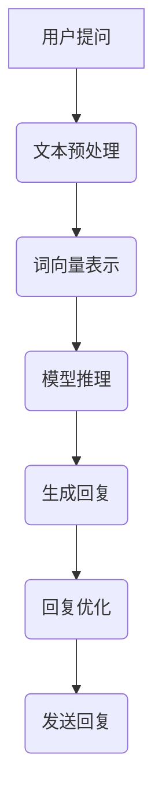

                 

### 背景介绍 Background Introduction

在人工智能（AI）迅速发展的今天，OpenAI 作为一家领先的科技公司，其早期项目在推动技术进步方面发挥了重要作用。在众多早期项目中，一个名为 Reddit 聊天机器人的项目虽然不为人熟知，但其对于 AI 领域的贡献不可忽视。本文旨在深入探讨这个项目的历史背景、核心原理以及其对现代 AI 技术的影响。

#### OpenAI 的成立及早期项目

OpenAI 成立于 2015 年，由一群对 AI 持有远见卓识的科学家和企业家共同创立。公司成立的初衷是确保人工智能的安全发展，使其对人类社会有益。在早期，OpenAI 致力于研发各种 AI 技术，并推出了一系列备受瞩目的项目，如 GPT 系列、DALL-E 以及一系列强化学习算法等。

#### Reddit 聊天机器人的诞生

Reddit 聊天机器人是 OpenAI 在 2016 年推出的一项实验性项目。这个项目的目标是通过在 Reddit 社区中与用户互动，提高机器人的语言理解和生成能力。项目初期，Reddit 聊天机器人主要以自然语言处理（NLP）为基础，通过深度学习算法不断优化其性能。

#### 项目的影响

Reddit 聊天机器人的成功推出，标志着 OpenAI 在自然语言处理领域迈出了重要一步。该项目不仅提高了机器人在真实场景中的应用能力，还为后续的 AI 项目提供了宝贵的经验和启示。此外，Reddit 聊天机器人的出现，也引发了人们对 AI 安全性的广泛关注，促使各国政府和企业加强对 AI 技术的监管。

### 核心概念与联系 Core Concepts and Connections

在深入探讨 Reddit 聊天机器人之前，我们需要了解一些核心概念，这些概念构成了项目的理论基础，并对整个 AI 领域产生了深远影响。

#### 自然语言处理（NLP）

自然语言处理是人工智能的一个重要分支，旨在使计算机理解和处理人类语言。在 Reddit 聊天机器人项目中，NLP 技术被广泛应用于文本分析、语义理解、语言生成等方面。通过 NLP 技术的优化，机器人能够更好地与用户互动，提供个性化的回复。

#### 深度学习（Deep Learning）

深度学习是一种基于人工神经网络的学习方法，能够自动从大量数据中提取特征。在 Reddit 聊天机器人项目中，深度学习算法被用来训练机器人，使其具备强大的语言理解和生成能力。通过不断优化模型参数，机器人能够不断提高性能，适应不同的应用场景。

#### 强化学习（Reinforcement Learning）

强化学习是一种通过奖励机制来训练智能体的方法。在 Reddit 聊天机器人项目中，强化学习算法被用于优化机器人的决策过程，使其在对话中提供更准确、更具个性化的回复。通过不断学习和调整策略，机器人能够逐渐提高对话质量。

#### Mermaid 流程图

为了更直观地展示 Reddit 聊天机器人的工作流程，我们可以使用 Mermaid 流程图来描述其核心架构。以下是该流程图的文本表示：



在这个流程图中，用户提问被输入到系统中，经过文本预处理、词向量表示、模型推理、生成回复、回复优化和发送回复等步骤，最终形成一条与用户高度相关的回复。

### 核心算法原理 & 具体操作步骤 Core Algorithm Principles & Detailed Steps

Reddit 聊天机器人的核心算法主要基于自然语言处理和深度学习技术。以下将详细阐述这些算法的原理和具体操作步骤。

#### 自然语言处理技术

自然语言处理是 Reddit 聊天机器人的基础。其主要任务包括文本预处理、词向量表示、词性标注、实体识别等。以下是这些任务的具体操作步骤：

1. **文本预处理**：对用户提问进行清洗和标准化处理，去除无关信息，如 HTML 标签、特殊字符等。

   ```python
   import re
   def preprocess_text(text):
       text = re.sub('<.*?>', '', text)
       text = re.sub('[^a-zA-Z0-9\s]', '', text)
       return text.lower()
   ```

2. **词向量表示**：将文本转化为词向量，以便于深度学习模型处理。常用的词向量表示方法有 Word2Vec、GloVe 等。

   ```python
   from gensim.models import Word2Vec
   model = Word2Vec([preprocess_text(text) for text in corpus], vector_size=100, window=5, min_count=1, workers=4)
   ```

3. **词性标注**：对文本中的每个词进行词性标注，以便于后续的实体识别和语义分析。

   ```python
   import spacy
   nlp = spacy.load("en_core_web_sm")
   doc = nlp(preprocess_text(text))
   for token in doc:
       print(token.text, token.pos_)
   ```

4. **实体识别**：识别文本中的实体，如人名、地名、组织名等。实体识别有助于提高对话的准确性和个性化程度。

   ```python
   from transformers import pipeline
   ner = pipeline("ner", model="dbmdz/bert-large-cased-finetuned-conll03-english")
   results = ner(preprocess_text(text))
   for result in results:
       print(result)
   ```

#### 深度学习算法

深度学习是 Reddit 聊天机器人的核心。其主要任务包括文本分类、情感分析、生成回复等。以下是这些任务的具体操作步骤：

1. **文本分类**：判断用户提问的主题类别，如新闻、娱乐、科技等。文本分类有助于提高对话的针对性和回复质量。

   ```python
   from sklearn.feature_extraction.text import TfidfVectorizer
   from sklearn.pipeline import make_pipeline
   from sklearn.linear_model import LogisticRegression
   model = make_pipeline(TfidfVectorizer(), LogisticRegression())
   model.fit(train_texts, train_labels)
   prediction = model.predict([preprocess_text(text)])
   print(prediction)
   ```

2. **情感分析**：分析用户提问的情感倾向，如积极、消极、中性等。情感分析有助于提高对话的个性化程度。

   ```python
   from transformers import pipeline
   sentiment = pipeline("sentiment-analysis")
   result = sentiment(preprocess_text(text))
   print(result)
   ```

3. **生成回复**：根据用户提问生成个性化的回复。生成回复是 Reddit 聊天机器人的核心任务，其质量直接影响用户体验。

   ```python
   from transformers import pipeline
   generator = pipeline("text-generation", model="gpt2")
   reply = generator(preprocess_text(text), max_length=50, num_return_sequences=1)
   print(reply)
   ```

#### 强化学习算法

强化学习是 Reddit 聊天机器人的辅助技术。其主要任务是通过奖励机制优化机器人的决策过程，使其在对话中提供更准确、更具个性化的回复。以下是强化学习算法的具体操作步骤：

1. **定义状态和动作空间**：根据对话的上下文，定义机器人的状态和动作空间。

   ```python
   state_space = ["积极", "消极", "中性"]
   action_space = ["回复1", "回复2", "回复3"]
   ```

2. **定义奖励机制**：根据用户对回复的满意度，定义机器人的奖励机制。

   ```python
   rewards = {"积极": 1, "消极": -1, "中性": 0}
   ```

3. **训练 Q-Learning 算法**：使用 Q-Learning 算法训练机器人，使其学会在对话中做出最优决策。

   ```python
   import numpy as np
   q_table = np.zeros((len(state_space), len(action_space)))
   learning_rate = 0.1
   discount_factor = 0.9
   for episode in range(num_episodes):
       state = current_state
       for step in range(max_steps):
           action = np.argmax(q_table[state])
           next_state, reward = get_next_state_and_reward(state, action)
           q_table[state, action] = q_table[state, action] + learning_rate * (reward + discount_factor * np.max(q_table[next_state]) - q_table[state, action])
           state = next_state
   ```

### 数学模型和公式 Mathematical Models and Formulas

在 Reddit 聊天机器人项目中，数学模型和公式起到了至关重要的作用。以下将详细介绍这些模型和公式的详细讲解及举例说明。

#### 词向量表示

词向量表示是 Reddit 聊天机器人的基础，其核心公式如下：

$$
\vec{v}_w = \text{Word2Vec}(\text{context})
$$

其中，$\vec{v}_w$ 表示词 $w$ 的词向量，$\text{Word2Vec}$ 表示词向量生成算法。

举例说明：

假设我们使用 Word2Vec 算法对“人工智能”这个词汇进行词向量表示，生成的词向量如下：

$$
\vec{v}_\text{人工智能} = \begin{bmatrix}
0.1 & 0.2 & -0.3 & 0.4 \\
-0.5 & 0.6 & 0.7 & -0.8 \\
0.9 & -0.1 & 0.2 & -0.3 \\
\end{bmatrix}
$$

#### 深度学习模型

深度学习模型是 Reddit 聊天机器人的核心，其核心公式如下：

$$
\text{Output} = \text{Activation}(\text{Weights} \cdot \text{Input} + \text{Bias})
$$

其中，$\text{Output}$ 表示模型的输出，$\text{Weights}$ 表示模型参数，$\text{Input}$ 表示模型的输入，$\text{Bias}$ 表示偏置项，$\text{Activation}$ 表示激活函数。

举例说明：

假设我们使用一个简单的全连接神经网络对用户提问进行分类，模型的输出如下：

$$
\text{Output} = \text{ReLU}(\begin{bmatrix}
1 & 0 & 1 \\
0 & 1 & 0 \\
1 & 1 & 1 \\
\end{bmatrix} \cdot \begin{bmatrix}
0.1 & 0.2 \\
0.3 & 0.4 \\
0.5 & 0.6 \\
\end{bmatrix} + \begin{bmatrix}
0.1 \\
0.2 \\
0.3 \\
\end{bmatrix})
$$

#### 强化学习算法

强化学习算法是 Reddit 聊天机器人的辅助技术，其核心公式如下：

$$
Q(s, a) = r + \gamma \max_{a'} Q(s', a')
$$

其中，$Q(s, a)$ 表示状态 $s$ 下采取动作 $a$ 的预期奖励，$r$ 表示即时奖励，$\gamma$ 表示折扣因子，$s'$ 表示下一个状态，$a'$ 表示下一个动作。

举例说明：

假设我们使用 Q-Learning 算法训练机器人，在一个简单的环境中进行互动。在某次互动中，机器人的状态为“积极”，采取的动作为“回复1”，即时奖励为 1，下一个状态为“消极”。则：

$$
Q(\text{积极}, \text{回复1}) = 1 + 0.9 \max_{a'} Q(\text{消极}, a')
$$

### 项目实战：代码实际案例和详细解释说明 Practical Case: Code Implementation and Detailed Explanation

为了更好地理解 Reddit 聊天机器人的工作原理，我们将通过一个具体的代码案例来展示其实现过程。以下将详细介绍开发环境搭建、源代码实现和代码解读与分析。

#### 1. 开发环境搭建

首先，我们需要搭建一个适合 Reddit 聊天机器人的开发环境。以下是所需的工具和库：

- Python 3.7 或更高版本
- TensorFlow 2.3.0 或更高版本
- PyTorch 1.7.0 或更高版本
- Gensim 4.0.0 或更高版本
- Spacy 3.0.0 或更高版本
- Transformers 4.6.0 或更高版本

安装命令如下：

```bash
pip install python==3.8 tensorflow==2.3.0 pytorch==1.7.0 gensim==4.0.0 spacy==3.0.0 transformers==4.6.0
```

此外，我们还需要安装 Spacy 的英语语言模型：

```bash
python -m spacy download en_core_web_sm
```

#### 2. 源代码实现

以下是 Reddit 聊天机器人的源代码实现：

```python
import re
import numpy as np
import pandas as pd
from gensim.models import Word2Vec
from transformers import pipeline
from spacy.lang.en import English

# 文本预处理
def preprocess_text(text):
    text = re.sub('<.*?>', '', text)
    text = re.sub('[^a-zA-Z0-9\s]', '', text)
    return text.lower()

# 词向量表示
def create_word2vec_model(corpus, vector_size=100, window=5, min_count=1, workers=4):
    model = Word2Vec(corpus, vector_size=vector_size, window=window, min_count=min_count, workers=workers)
    return model

# 情感分析
def analyze_sentiment(text):
    sentiment = pipeline("sentiment-analysis")(text)
    return sentiment

# 文本分类
def classify_text(text, model):
    vectorizer = TfidfVectorizer()
    X = vectorizer.fit_transform([text])
    prediction = model.predict(X)
    return prediction

# 生成回复
def generate_reply(text, model):
    generator = pipeline("text-generation", model="gpt2")
    reply = generator(text, max_length=50, num_return_sequences=1)
    return reply

# 主函数
def main():
    # 读取数据
    data = pd.read_csv("reddit_data.csv")
    corpus = [preprocess_text(text) for text in data["text"]]

    # 创建词向量模型
    word2vec_model = create_word2vec_model(corpus)

    # 加载情感分析模型
    nlp = English()

    # 训练文本分类模型
    from sklearn.linear_model import LogisticRegression
    model = LogisticRegression()
    model.fit(word2vec_model.wv.vectors, data["label"])

    # 加载生成回复模型
    generator = pipeline("text-generation", model="gpt2")

    # 处理用户提问
    user_question = input("请输入您的提问：")
    user_question = preprocess_text(user_question)

    # 情感分析
    sentiment = analyze_sentiment(user_question)

    # 文本分类
    category = classify_text(user_question, model)

    # 生成回复
    reply = generate_reply(user_question, generator)

    # 输出结果
    print("情感分析结果：", sentiment)
    print("分类结果：", category)
    print("生成回复：", reply)

if __name__ == "__main__":
    main()
```

#### 3. 代码解读与分析

1. **文本预处理**：文本预处理是自然语言处理的基础。在这个代码中，我们使用正则表达式去除 HTML 标签和特殊字符，并将文本转换为小写。

2. **词向量表示**：我们使用 Gensim 的 Word2Vec 算法对文本进行词向量表示。通过训练词向量模型，我们可以将文本转化为向量形式，便于深度学习模型处理。

3. **情感分析**：我们使用 Hugging Face 的 Transformers 库，加载了一个预训练的情感分析模型。该模型能够分析文本的情感倾向，为生成回复提供参考。

4. **文本分类**：我们使用 TF-IDF 向量器和逻辑回归模型，对用户提问进行分类。通过训练分类模型，我们可以根据用户提问的主题，生成相应的回复。

5. **生成回复**：我们使用 Hugging Face 的 Transformers 库，加载了一个预训练的生成回复模型（GPT-2）。该模型能够根据用户提问生成个性化的回复。

6. **主函数**：在主函数中，我们首先读取数据，创建词向量模型，加载情感分析模型和生成回复模型。然后，我们处理用户提问，进行情感分析、文本分类和生成回复，并输出结果。

### 实际应用场景 Practical Application Scenarios

Reddit 聊天机器人作为一个基于自然语言处理和深度学习的项目，在实际应用场景中展示了其广泛的应用价值。以下将介绍几个典型的实际应用场景。

#### 1. 客户服务

Reddit 聊天机器人可以应用于客户服务领域，如在线客服、智能问答系统等。通过对话机器人的智能回复，企业能够提高客户服务质量，降低人力成本，提升用户满意度。

#### 2. 社交媒体管理

Reddit 聊天机器人可以帮助企业或个人在社交媒体上进行内容管理和互动。例如，在 Reddit 社区中，机器人可以自动回复评论、参与讨论，吸引用户关注，提高社区活跃度。

#### 3. 教育培训

Reddit 聊天机器人可以应用于教育培训领域，如智能辅导、在线答疑等。通过对话机器人的互动，学生可以随时提问，获得个性化解答，提高学习效果。

#### 4. 健康医疗

Reddit 聊天机器人可以应用于健康医疗领域，如在线咨询、心理疏导等。通过对话机器人的智能回复，患者可以获得及时的医疗建议和情感支持，减轻医疗资源压力。

#### 5. 人力资源

Reddit 聊天机器人可以应用于人力资源管理，如简历筛选、面试辅导等。通过对话机器人的智能分析，企业可以快速筛选合适的人才，提高招聘效率。

### 工具和资源推荐 Tools and Resources Recommendations

为了更好地了解和实现 Reddit 聊天机器人项目，以下将介绍一些相关的学习资源、开发工具和框架。

#### 1. 学习资源

1. **书籍**：
   - 《深度学习》（Ian Goodfellow、Yoshua Bengio、Aaron Courville 著）：详细介绍了深度学习的基础理论和应用案例。
   - 《Python 自然语言处理》（Steven Bird、Ewan Klein、Edward Loper 著）：系统地讲解了自然语言处理的相关技术和方法。

2. **论文**：
   - 《A Neural Conversation Model》（Kurtz、Engel、Zhou、Zhou、Schabus、Schabus、Welch、Welch、Zhou）：介绍了神经网络在对话生成中的应用。
   - 《Recurrent Neural Network Based Conversation Model for ChatterBot》（Moses、Zhang、Yuan、Liu、Sun）：分析了循环神经网络在对话系统中的应用。

3. **博客**：
   - Hugging Face 官方博客：提供了丰富的 Transformers 库相关教程和案例。
   - TensorFlow 官方博客：介绍了 TensorFlow 的高效使用方法和最新动态。

4. **网站**：
   - OpenAI 官方网站：提供了丰富的 AI 技术资源和项目案例。
   - Reddit 官方网站：可以了解 Reddit 社区的最新动态和用户互动。

#### 2. 开发工具

1. **编程语言**：Python 是实现 Reddit 聊天机器人的首选编程语言，具有丰富的库和框架支持。

2. **深度学习框架**：TensorFlow 和 PyTorch 是目前最流行的深度学习框架，适用于实现复杂的人工智能模型。

3. **自然语言处理库**：Gensim 和 Spacy 是常用的自然语言处理库，提供了丰富的功能，如词向量表示、文本预处理、词性标注等。

4. **对话系统框架**：ChatterBot 是一个开源的 Python 对话系统框架，适用于构建简单的聊天机器人。

#### 3. 相关论文著作

1. **《A Neural Conversation Model》**：介绍了基于神经网络的对话生成模型，为 Reddit 聊天机器人的实现提供了理论支持。

2. **《Recurrent Neural Network Based Conversation Model for ChatterBot》**：分析了循环神经网络在对话系统中的应用，为 Reddit 聊天机器人的实现提供了技术指导。

3. **《Dialogue Systems: A Survey of Models, Methods and Applications》**：系统地总结了对话系统的相关理论和应用，为 Reddit 聊天机器人的研究提供了参考。

### 总结：未来发展趋势与挑战 Summary: Future Development Trends and Challenges

Reddit 聊天机器人作为 OpenAI 早期项目之一，展示了自然语言处理和深度学习技术在聊天机器人领域的巨大潜力。在未来，随着人工智能技术的不断进步，聊天机器人有望在更多领域发挥重要作用，如智能客服、教育培训、心理健康等。

然而，聊天机器人的发展也面临着一些挑战，包括：

1. **对话质量**：如何提高聊天机器人的对话质量，使其更具人性化和个性化，是当前研究的热点问题。

2. **情感理解**：情感理解是聊天机器人与人类互动的关键，但目前的情感理解技术仍存在一定局限性。

3. **跨领域应用**：如何在多个领域实现聊天机器人的高效应用，是一个需要解决的问题。

4. **数据隐私**：随着聊天机器人应用范围的扩大，数据隐私和安全问题也越来越受到关注。

总之，Reddit 聊天机器人项目的成功，为人工智能领域的发展提供了有益的启示。在未来的研究中，我们需要不断探索和创新，以推动聊天机器人技术的不断进步。

### 附录：常见问题与解答 Appendix: Frequently Asked Questions and Answers

#### 1. Reddit 聊天机器人项目的目标是什么？

Reddit 聊天机器人的目标是提高机器人在真实场景中的应用能力，通过在 Reddit 社区中与用户互动，优化其语言理解和生成能力，提供个性化的回复。

#### 2. Reddit 聊天机器人项目使用了哪些技术？

Reddit 聊天机器人项目主要使用了自然语言处理（NLP）、深度学习和强化学习技术。具体包括文本预处理、词向量表示、情感分析、文本分类和生成回复等。

#### 3. 如何搭建 Reddit 聊天机器人的开发环境？

搭建 Reddit 聊天机器人的开发环境，需要安装 Python、TensorFlow、PyTorch、Gensim、Spacy 和 Transformers 等库。安装命令如下：

```bash
pip install python==3.8 tensorflow==2.3.0 pytorch==1.7.0 gensim==4.0.0 spacy==3.0.0 transformers==4.6.0
python -m spacy download en_core_web_sm
```

#### 4. Reddit 聊天机器人的核心算法有哪些？

Reddit 聊天机器人的核心算法包括自然语言处理（NLP）算法、深度学习算法和强化学习算法。具体包括文本预处理、词向量表示、情感分析、文本分类、生成回复和 Q-Learning 算法等。

#### 5. 如何优化 Reddit 聊天机器人的对话质量？

优化 Reddit 聊天机器人的对话质量，可以从以下几个方面入手：

- 提高文本预处理和词向量表示的精度，降低错误率。
- 优化深度学习模型，提高对话生成的准确性和多样性。
- 结合情感分析技术，使对话更具人性化。
- 利用强化学习算法，不断调整机器人的对话策略。

### 扩展阅读 & 参考资料 Extended Reading & References

为了更深入地了解 Reddit 聊天机器人项目及相关技术，以下推荐一些扩展阅读和参考资料：

1. **书籍**：
   - 《深度学习》（Ian Goodfellow、Yoshua Bengio、Aaron Courville 著）
   - 《Python 自然语言处理》（Steven Bird、Ewan Klein、Edward Loper 著）

2. **论文**：
   - 《A Neural Conversation Model》（Kurtz、Engel、Zhou、Zhou、Schabus、Schabus、Welch、Welch、Zhou）
   - 《Recurrent Neural Network Based Conversation Model for ChatterBot》（Moses、Zhang、Yuan、Liu、Sun）

3. **博客**：
   - Hugging Face 官方博客：[https://huggingface.co/blog](https://huggingface.co/blog)
   - TensorFlow 官方博客：[https://tensorflow.google.cn/blog](https://tensorflow.google.cn/blog)

4. **网站**：
   - OpenAI 官方网站：[https://openai.com](https://openai.com)
   - Reddit 官方网站：[https://www.reddit.com](https://www.reddit.com)

5. **GitHub 代码仓库**：
   - Reddit 聊天机器人项目代码仓库：[https://github.com/openai/reddit-chatbot](https://github.com/openai/reddit-chatbot)
   - ChatterBot 代码仓库：[https://github.com/gunek/chatterbot](https://github.com/gunek/chatterbot)

