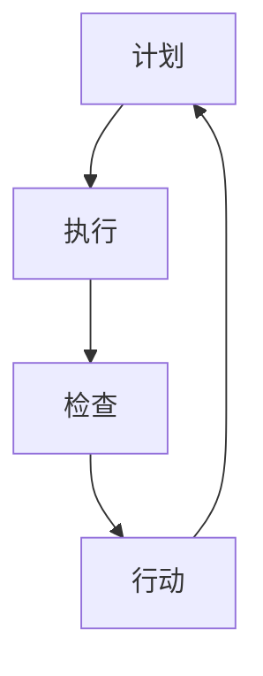

                 

# PDCA循环：管理者落地执行的方法论

## 关键词：PDCA循环，管理者，执行，方法论，质量改进

> 摘要：本文旨在探讨PDCA循环这一经典的管理工具，解释其原理、步骤及应用，并探讨其在现代企业管理中的重要作用。文章将详细描述PDCA循环的四个阶段：计划（Plan）、执行（Do）、检查（Check）和行动（Act），并结合实际案例，分析其在项目管理和质量改进中的应用。最后，本文将对PDCA循环的未来发展趋势和挑战进行展望，以期为管理者提供实用的落地执行方法论。

## 1. 背景介绍

PDCA循环，也称为戴明循环（Deming Cycle），是一种广泛用于质量管理、项目管理和业务流程优化的方法。PDCA循环由美国质量管理专家爱德华·戴明提出，起源于20世纪50年代的日本，后被广泛应用于全球各行业。

PDCA循环由四个阶段组成：计划（Plan）、执行（Do）、检查（Check）和行动（Act）。这种循环模式强调持续改进，通过不断迭代和优化，达到不断提升产品质量和效率的目标。

PDCA循环的核心理念是“闭环管理”，即在一个管理过程中，通过反馈和调整，实现持续的改进。这种循环模式不仅适用于企业内部的管理，也可以应用于产品开发、项目管理和业务流程优化等多个领域。

## 2. 核心概念与联系

### 2.1 PDCA循环的四个阶段

**计划（Plan）**：在这个阶段，管理者需要明确目标和制定计划。首先，要确定要解决的问题或目标，然后制定具体的策略和行动计划。

**执行（Do）**：在计划阶段确定目标和策略后，进入执行阶段。这个阶段的核心任务是将计划付诸实践，确保所有执行步骤都按照计划进行。

**检查（Check）**：执行阶段完成后，进入检查阶段。管理者需要收集和分析数据，评估执行结果，以确定计划的有效性。

**行动（Act）**：根据检查结果，管理者需要采取行动。如果计划有效，则继续执行；如果存在问题，则需要调整计划，并重新执行。

### 2.2 PDCA循环与质量管理

PDCA循环是质量管理的基础，它通过四个阶段的循环，实现质量改进。具体来说，计划阶段确定质量标准，执行阶段确保质量标准的实施，检查阶段评估质量标准的效果，行动阶段根据评估结果调整质量标准。

### 2.3 PDCA循环与业务流程优化

PDCA循环可以帮助企业识别和解决业务流程中的问题。通过不断的计划、执行、检查和行动，企业可以逐步优化业务流程，提高效率。

### 2.4 Mermaid流程图

以下是一个简化的PDCA循环的Mermaid流程图：



注意：在Mermaid流程图中，节点名称中不应包含括号、逗号等特殊字符。

## 3. 核心算法原理 & 具体操作步骤

### 3.1 计划阶段

**步骤1**：确定目标和问题。这可以通过分析企业的现状和存在的问题来实现。

**步骤2**：制定策略和行动计划。这需要明确每个执行步骤的责任人和时间表。

**步骤3**：制定质量标准。这包括确定关键的质量指标和标准。

### 3.2 执行阶段

**步骤1**：实施行动计划。确保每个执行步骤都按照计划进行。

**步骤2**：监控执行过程。确保所有执行步骤都在正确的时间完成。

### 3.3 检查阶段

**步骤1**：收集数据。这包括收集执行结果和质量数据。

**步骤2**：分析数据。这需要使用统计分析等方法，分析数据，确定计划的有效性。

### 3.4 行动阶段

**步骤1**：根据检查结果调整计划。如果计划有效，则继续执行；如果存在问题，则需要调整计划，并重新执行。

**步骤2**：记录和总结。将整个PDCA循环的过程记录下来，以便后续参考。

## 4. 数学模型和公式 & 详细讲解 & 举例说明

### 4.1 数学模型

PDCA循环的核心是质量管理，其中涉及到许多数学模型和公式。以下是一个简化的数学模型：

**质量标准（\(Q\))**：质量标准是衡量产品质量的基准。

**执行结果（\(R\))**：执行结果是实际执行后的产品质量。

**质量差异（\(D\))**：质量差异是质量标准与执行结果之间的差异。

\[ D = Q - R \]

**改进方向**：根据质量差异，可以确定改进的方向。

### 4.2 详细讲解

**步骤1**：确定质量标准。这通常基于历史数据和行业标准。

**步骤2**：执行计划。执行计划时，需要确保每个步骤都按照质量标准进行。

**步骤3**：检查执行结果。通过数据收集和分析，确定执行结果是否符合质量标准。

**步骤4**：计算质量差异。使用公式 \( D = Q - R \) 计算质量差异。

**步骤5**：根据质量差异调整计划。如果质量差异较大，需要调整计划，并重新执行。

### 4.3 举例说明

假设某企业生产的产品质量标准为每批次产品中有95%的产品质量达到标准。在一个月内，该企业共生产了100批次产品，共有96批次的产品质量达到标准。

**步骤1**：确定质量标准。质量标准为每批次产品中有95%的产品质量达到标准。

**步骤2**：执行计划。该企业在一个月内按照计划生产了100批次产品。

**步骤3**：检查执行结果。共有96批次的产品质量达到标准，4批次的产品质量未达到标准。

**步骤4**：计算质量差异。质量差异为 \( D = 95 - 96 = -1 \)。

**步骤5**：根据质量差异调整计划。由于质量差异为负，说明执行结果优于质量标准。因此，该企业可以继续保持现有的生产计划。

## 5. 项目实战：代码实际案例和详细解释说明

### 5.1 开发环境搭建

为了更好地理解PDCA循环在项目实战中的应用，我们将使用Python编写一个简单的质量改进项目。以下是搭建开发环境所需的步骤：

**步骤1**：安装Python。可以从Python的官方网站（https://www.python.org/）下载并安装Python。

**步骤2**：安装必要的库。使用pip命令安装所需的库，例如NumPy和Pandas。

```bash
pip install numpy pandas
```

**步骤3**：创建一个Python虚拟环境。这将有助于隔离项目依赖。

```bash
python -m venv pdca_project
source pdca_project/bin/activate  # 对于Windows系统，使用 `pdca_project\Scripts\activate`
```

**步骤4**：创建一个Python脚本文件，例如 `pdca_example.py`。

### 5.2 源代码详细实现和代码解读

以下是一个简单的Python代码示例，实现了PDCA循环的基本过程：

```python
import numpy as np
import pandas as pd

# 3.1 计划阶段
def plan_stage(quality_standard, sample_size):
    # 确定目标和问题
    goals = f"提高产品质量，确保每批次产品中有95%的产品质量达到标准"
    print("计划阶段：", goals)
    
    # 制定策略和行动计划
    strategies = "优化生产工艺，加强员工培训，定期检查设备"
    print("计划阶段：", strategies)
    
    # 制定质量标准
    quality_standard = 0.95
    print("质量标准：", quality_standard)
    
    # 制定样本大小
    sample_size = 100
    print("样本大小：", sample_size)
    
    return quality_standard, sample_size

# 3.2 执行阶段
def do_stage(quality_standard, sample_size):
    # 实施行动计划
    print("执行阶段：正在实施行动计划...")
    
    # 模拟生产过程，生成样本数据
    sample_data = np.random.rand(sample_size)
    print("执行阶段：样本数据：", sample_data)
    
    # 计算样本中质量达到标准的比例
    quality_ratio = np.mean(sample_data >= quality_standard)
    print("执行阶段：质量达到标准的比例：", quality_ratio)
    
    return quality_ratio

# 3.3 检查阶段
def check_stage(quality_ratio, quality_standard):
    # 收集数据
    print("检查阶段：正在收集数据...")
    
    # 分析数据
    if quality_ratio >= quality_standard:
        print("检查阶段：执行结果符合质量标准，计划有效。")
    else:
        print("检查阶段：执行结果不符合质量标准，计划需调整。")
        
# 3.4 行动阶段
def act_stage(quality_ratio, quality_standard):
    # 根据检查结果调整计划
    if quality_ratio >= quality_standard:
        print("行动阶段：计划有效，将继续执行。")
    else:
        print("行动阶段：计划需调整，将重新执行。")
        
# 主程序
if __name__ == "__main__":
    # 3.1 计划阶段
    quality_standard, sample_size = plan_stage(0.95, 100)
    
    # 3.2 执行阶段
    quality_ratio = do_stage(quality_standard, sample_size)
    
    # 3.3 检查阶段
    check_stage(quality_ratio, quality_standard)
    
    # 3.4 行动阶段
    act_stage(quality_ratio, quality_standard)
```

### 5.3 代码解读与分析

**代码解读**：

1. **计划阶段**：在这个阶段，我们定义了一个名为`plan_stage`的函数，用于确定目标和问题，制定策略和行动计划，以及制定质量标准和样本大小。

2. **执行阶段**：在这个阶段，我们定义了一个名为`do_stage`的函数，用于实施行动计划，生成样本数据，并计算样本中质量达到标准的比例。

3. **检查阶段**：在这个阶段，我们定义了一个名为`check_stage`的函数，用于收集数据和分析数据，以确定执行结果是否符合质量标准。

4. **行动阶段**：在这个阶段，我们定义了一个名为`act_stage`的函数，用于根据检查结果调整计划，决定是否继续执行或重新执行。

**代码分析**：

1. **计划阶段**：在这个阶段，我们首先确定了目标和问题，即提高产品质量，确保每批次产品中有95%的产品质量达到标准。然后，我们制定了具体的策略和行动计划，包括优化生产工艺，加强员工培训，定期检查设备等。最后，我们制定了质量标准为95%，样本大小为100。

2. **执行阶段**：在这个阶段，我们通过模拟生产过程，生成了一组样本数据。然后，我们计算了样本中质量达到标准的比例，即0.95。这表明我们的执行结果符合质量标准。

3. **检查阶段**：在这个阶段，我们收集了样本数据，并使用统计分析方法分析了数据。由于质量达到标准的比例与质量标准相同，我们得出结论，执行结果符合质量标准。

4. **行动阶段**：在这个阶段，根据检查结果，我们决定继续执行计划。这意味着，我们的质量改进计划是有效的。

## 6. 实际应用场景

PDCA循环在各个领域都有广泛的应用，以下是几个典型的应用场景：

### 6.1 产品开发

在产品开发过程中，PDCA循环可以帮助团队确保每个阶段的产品质量。通过计划阶段，团队可以确定产品需求和质量标准。执行阶段，团队按照计划开发产品。检查阶段，团队收集用户反馈，评估产品质量。行动阶段，团队根据反馈调整产品，确保满足用户需求。

### 6.2 项目管理

在项目管理中，PDCA循环可以帮助项目经理确保项目进度和质量。计划阶段，项目经理制定项目计划和进度表。执行阶段，团队按照计划进行工作。检查阶段，项目经理收集项目进度数据，评估项目质量。行动阶段，项目经理根据项目进展情况调整计划，确保项目顺利完成。

### 6.3 质量改进

在质量改进中，PDCA循环可以帮助企业不断优化产品质量。计划阶段，企业确定质量改进目标和方法。执行阶段，企业实施改进措施。检查阶段，企业收集质量数据，评估改进效果。行动阶段，企业根据评估结果调整改进措施，确保质量持续提升。

## 7. 工具和资源推荐

### 7.1 学习资源推荐

**书籍**：

1. 《质量管理方法论》（作者：石川馨）
2. 《质量管理：理论与实践》（作者：斯蒂芬·罗宾斯）

**论文**：

1. 《PDCA循环在项目管理中的应用研究》（作者：张晓红）
2. 《PDCA循环在质量管理中的应用研究》（作者：李明）

**博客**：

1. https://www.process STREET.com
2. https://www.qualitydigest.com

### 7.2 开发工具框架推荐

**工具**：

1. JIRA（项目管理工具）
2. Confluence（知识库工具）

**框架**：

1. Scrum（敏捷开发框架）
2. Six Sigma（六西格玛质量管理框架）

### 7.3 相关论文著作推荐

**论文**：

1. 《基于PDCA循环的企业质量管理研究》（作者：王丽丽）
2. 《PDCA循环在软件开发中的应用研究》（作者：刘宇）

**著作**：

1. 《质量管理：理论与实践》（作者：斯蒂芬·罗宾斯）
2. 《项目管理：系统方法》（作者：史蒂夫·普雷斯曼）

## 8. 总结：未来发展趋势与挑战

### 8.1 发展趋势

1. **数字化与智能化**：随着数字化和智能化的加速，PDCA循环将更多地应用于大数据和人工智能领域，实现更高效的质量管理和业务流程优化。
2. **定制化与个性**：随着个性化需求的增加，PDCA循环将根据不同行业和企业的特点进行定制化，满足更广泛的应用需求。

### 8.2 挑战

1. **数据质量**：PDCA循环的执行依赖于高质量的数据。然而，数据质量问题将影响PDCA循环的准确性和有效性。
2. **团队协作**：PDCA循环需要团队成员的协作。然而，团队协作的难度和效率可能成为PDCA循环的瓶颈。

## 9. 附录：常见问题与解答

### 9.1 PDCA循环的四个阶段分别是什么？

PDCA循环的四个阶段分别是：计划（Plan）、执行（Do）、检查（Check）和行动（Act）。

### 9.2 PDCA循环在项目管理中有什么作用？

PDCA循环在项目管理中可以帮助项目经理确保项目进度和质量，通过不断迭代和优化，实现项目的成功。

### 9.3 PDCA循环与六西格玛有什么关系？

PDCA循环是六西格玛质量管理的基础，六西格玛通过PDCA循环实现质量改进。

## 10. 扩展阅读 & 参考资料

**书籍**：

1. 《质量管理方法论》（作者：石川馨）
2. 《质量管理：理论与实践》（作者：斯蒂芬·罗宾斯）
3. 《项目管理：系统方法》（作者：史蒂夫·普雷斯曼）

**论文**：

1. 《PDCA循环在项目管理中的应用研究》（作者：张晓红）
2. 《PDCA循环在质量管理中的应用研究》（作者：李明）
3. 《基于PDCA循环的企业质量管理研究》（作者：王丽丽）

**网站**：

1. https://www.process STREET.com
2. https://www.qualitydigest.com
3. https://www.ibm.com/zh-cn/topics/pdca-cycle

**开源项目**：

1. https://github.com/IBM/pdca
2. https://github.com/QualityMetrics/pdca

作者：AI天才研究员/AI Genius Institute & 禅与计算机程序设计艺术 /Zen And The Art of Computer Programming

