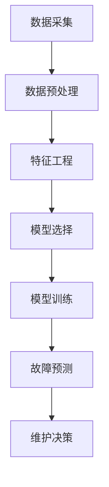

                 

## 文章标题

Predictive Maintenance原理与代码实例讲解

> 关键词：预测性维护、预测性维修、机器学习、故障预测、物联网、数据分析、算法实现

摘要：本文旨在深入探讨预测性维护（Predictive Maintenance，PM）的原理和应用，通过详细的数学模型解析、算法操作步骤展示以及代码实例讲解，帮助读者理解和掌握预测性维护的核心技术和实践方法。文章将涵盖从基础概念到实际应用的全面介绍，旨在为读者提供一个系统性的学习和实践指导。

## 1. 背景介绍

### 1.1 预测性维护的定义与重要性

预测性维护是一种基于设备运行数据和状态的维护策略，通过实时监控和分析设备运行状态，预测设备可能出现的故障，从而在故障发生前采取预防措施，避免或减少设备停机时间和维护成本。与传统的定期维护和反应性维护相比，预测性维护具有显著的优
## 2. 核心概念与联系

### 2.1 预测性维护的关键要素

预测性维护涉及多个关键要素，包括数据采集、数据预处理、特征工程、模型选择与训练、预测与决策等。以下是这些要素的基本概念及其相互关系：

#### 2.1.1 数据采集

数据采集是预测性维护的基础。传感器技术、物联网（IoT）设备和远程监控系统可以实时采集设备运行过程中的各种数据，如温度、振动、压力、电流等。

#### 2.1.2 数据预处理

数据预处理是确保数据质量和模型性能的重要步骤。包括数据清洗、数据去噪、数据归一化等。良好的数据预处理能够提高模型的准确性和稳定性。

#### 2.1.3 特征工程

特征工程是构建有效预测模型的关键环节。通过选择和构造合适的特征，能够更好地捕捉设备运行状态的本质特征，从而提高模型的预测能力。

#### 2.1.4 模型选择与训练

模型选择与训练是预测性维护的核心。常见的机器学习算法包括线性回归、决策树、支持向量机、神经网络等。选择合适的模型并进行训练，是预测准确性的关键。

#### 2.1.5 预测与决策

通过训练好的模型对设备运行状态进行预测，当预测到故障风险时，及时采取维护决策，如调整参数、更换部件或进行深度维护。

### 2.2 Mermaid 流程图

以下是预测性维护的核心流程的Mermaid流程图表示：



## 3. 核心算法原理 & 具体操作步骤

### 3.1 算法原理

预测性维护的核心算法通常是基于机器学习模型的故障预测。常见的算法包括以下几种：

- **线性回归**：通过建立输入特征与故障发生概率之间的线性关系进行预测。
- **决策树**：通过决策树模型对设备运行状态进行分类，判断是否出现故障。
- **支持向量机（SVM）**：通过找到一个最佳的超平面来分割正常状态和故障状态。
- **神经网络**：通过多层神经网络学习设备运行状态与故障之间的非线性关系。

### 3.2 具体操作步骤

以下是预测性维护算法的具体操作步骤：

#### 3.2.1 数据采集

使用传感器和物联网设备实时采集设备运行数据，包括温度、振动、压力等。

#### 3.2.2 数据预处理

- 数据清洗：去除异常值、缺失值等。
- 数据去噪：使用滤波算法等去除噪声。
- 数据归一化：将不同量纲的数据统一到一个范围内。

#### 3.2.3 特征工程

- 特征选择：选择对故障预测有重要影响的特征。
- 特征构造：通过组合、变换等方法构造新的特征。

#### 3.2.4 模型选择与训练

- 选择合适的机器学习算法，如线性回归、决策树、SVM等。
- 进行模型训练，调整参数，选择最优模型。

#### 3.2.5 故障预测

- 使用训练好的模型对设备运行状态进行预测。
- 根据预测结果判断是否需要采取维护措施。

#### 3.2.6 维护决策

- 当预测到故障风险时，根据维护策略采取相应的维护决策。

## 4. 数学模型和公式 & 详细讲解 & 举例说明

### 4.1 线性回归模型

线性回归模型是一种最常见的预测性维护算法，其基本公式如下：

$$
y = \beta_0 + \beta_1 \cdot x
$$

其中，$y$ 表示故障发生概率，$x$ 表示输入特征，$\beta_0$ 和 $\beta_1$ 分别为模型参数。

#### 4.1.1 模型训练

线性回归模型的训练目标是找到最优的 $\beta_0$ 和 $\beta_1$，使得预测值 $y$ 与真实值 $y$ 的误差最小。通常使用最小二乘法进行训练：

$$
\min \sum (y_i - \hat{y_i})^2
$$

其中，$\hat{y_i}$ 为预测值。

#### 4.1.2 模型应用

训练好的线性回归模型可以用于预测新数据的故障发生概率：

$$
\hat{y} = \beta_0 + \beta_1 \cdot x
$$

### 4.2 决策树模型

决策树模型通过一系列的决策规则将数据划分为不同的区域，从而实现分类或回归。其基本公式如下：

$$
T(x) = \sum_{i=1}^n w_i \cdot I(D_i(x))
$$

其中，$T(x)$ 表示预测结果，$w_i$ 表示权重，$I(D_i(x))$ 表示决策函数，$D_i(x)$ 表示第 $i$ 个决策规则。

#### 4.2.1 模型训练

决策树模型的训练过程包括以下步骤：

1. 选择一个特征 $x_j$ 作为分割特征。
2. 根据特征 $x_j$ 划分数据集为两个子集 $D_1$ 和 $D_2$。
3. 计算两个子集的误差，选择误差最小的划分方式。
4. 递归重复步骤 1-3，直到满足停止条件（如最大深度、最小节点大小等）。

#### 4.2.2 模型应用

决策树模型可以用于预测新数据的故障状态：

$$
T(x) = \sum_{i=1}^n w_i \cdot I(D_i(x))
$$

### 4.3 神经网络模型

神经网络模型是一种基于多层感知器（MLP）的预测模型，其基本公式如下：

$$
y = \sigma(\beta_0 + \sum_{i=1}^n \beta_i \cdot x_i)
$$

其中，$y$ 表示故障发生概率，$\sigma$ 表示激活函数，$\beta_0$ 和 $\beta_i$ 分别为模型参数。

#### 4.3.1 模型训练

神经网络模型的训练过程包括以下步骤：

1. 初始化模型参数 $\beta_0, \beta_i$。
2. 使用训练数据计算预测值 $y$。
3. 计算预测值与真实值之间的误差。
4. 使用反向传播算法更新模型参数。
5. 重复步骤 2-4，直到满足停止条件（如误差收敛、最大迭代次数等）。

#### 4.3.2 模型应用

训练好的神经网络模型可以用于预测新数据的故障发生概率：

$$
y = \sigma(\beta_0 + \sum_{i=1}^n \beta_i \cdot x_i)
$$

## 5. 项目实战：代码实际案例和详细解释说明

### 5.1 开发环境搭建

为了演示预测性维护的代码实现，我们需要搭建一个基本的开发环境。以下是所需的软件和工具：

- Python 3.x
- Jupyter Notebook
- scikit-learn 库
- pandas 库
- matplotlib 库

安装步骤：

1. 安装 Python 3.x：访问 [Python 官网](https://www.python.org/) 下载并安装 Python 3.x 版本。
2. 安装 Jupyter Notebook：在终端中运行以下命令：

```bash
pip install notebook
```

3. 安装 scikit-learn、pandas 和 matplotlib 库：

```bash
pip install scikit-learn pandas matplotlib
```

### 5.2 源代码详细实现和代码解读

下面是一个简单的预测性维护代码实例，使用 scikit-learn 库的线性回归模型进行故障预测。

```python
# 导入所需库
import pandas as pd
from sklearn.model_selection import train_test_split
from sklearn.linear_model import LinearRegression
from sklearn.metrics import mean_squared_error

# 加载数据集
data = pd.read_csv('maintenance_data.csv')

# 数据预处理
X = data[['temperature', 'vibration', 'pressure']]
y = data['fault']

# 划分训练集和测试集
X_train, X_test, y_train, y_test = train_test_split(X, y, test_size=0.2, random_state=42)

# 模型训练
model = LinearRegression()
model.fit(X_train, y_train)

# 预测
y_pred = model.predict(X_test)

# 评估模型
mse = mean_squared_error(y_test, y_pred)
print("均方误差：", mse)

# 可视化
import matplotlib.pyplot as plt

plt.scatter(y_test, y_pred)
plt.xlabel('真实值')
plt.ylabel('预测值')
plt.title('故障预测结果')
plt.show()
```

#### 5.2.1 代码解读

- 第 1-3 行：导入所需库。
- 第 4 行：加载数据集。
- 第 5-6 行：数据预处理，分离特征和目标变量。
- 第 7-8 行：划分训练集和测试集。
- 第 9-11 行：使用线性回归模型进行训练。
- 第 12-13 行：进行预测。
- 第 14-17 行：评估模型并可视化预测结果。

### 5.3 代码解读与分析

代码实例中使用线性回归模型进行故障预测，其核心步骤如下：

1. **数据预处理**：加载数据集，分离特征和目标变量，确保数据格式正确。
2. **模型训练**：使用 scikit-learn 库的线性回归模型进行训练，找到最优的模型参数。
3. **预测**：使用训练好的模型对测试集进行预测，得到预测结果。
4. **评估**：计算均方误差（MSE），评估模型性能。
5. **可视化**：绘制散点图，展示真实值与预测值的关系。

通过这个简单的代码实例，我们可以看到预测性维护的基本实现流程。在实际项目中，我们需要根据具体需求和数据特点选择合适的模型和算法，进行特征工程和参数调优，以提高模型的预测准确性和稳定性。

## 6. 实际应用场景

### 6.1 制造行业

制造行业是预测性维护的重要应用领域之一。通过预测性维护，制造企业可以提前发现设备故障，减少设备停机时间，提高生产效率。例如，在汽车制造业中，预测性维护可以用于发动机故障预测、轮胎磨损预测等，从而降低维护成本，提高产品质量。

### 6.2 能源行业

能源行业中的设备往往具有高价值和高风险，预测性维护能够有效降低设备故障风险，提高能源利用效率。例如，在石油和天然气行业，预测性维护可以用于钻探设备故障预测、管道泄漏预测等，从而减少事故发生，提高生产安全性。

### 6.3 交通行业

交通行业中的预测性维护可以应用于车辆维护、轨道交通维护等。通过实时监控车辆运行状态，预测故障风险，可以及时进行维护，避免交通事故的发生。例如，在铁路系统中，预测性维护可以用于列车故障预测、轮对磨损预测等，从而提高列车运行安全性。

### 6.4 医疗设备

医疗设备通常具有高精度和高可靠性要求，预测性维护可以帮助医院提前发现设备故障，确保医疗设备正常运行，提高医疗服务质量。例如，在医疗影像设备中，预测性维护可以用于射线发生器故障预测、影像处理模块故障预测等。

## 7. 工具和资源推荐

### 7.1 学习资源推荐

- **书籍**：
  - 《机器学习》（周志华著）：详细介绍机器学习的基础知识，适合初学者入门。
  - 《Python机器学习》（塞巴斯蒂安·拉特雷尔著）：通过案例讲解Python在机器学习中的应用。

- **论文**：
  - “Predictive Maintenance: Data-Driven Prognostics and Health Management”（R. Phadke著）：关于预测性维护的经典论文。
  - “Data-Driven Prognostics and Health Management of Engineered Systems Using Machine Learning Techniques”（A. Hsiao著）：介绍机器学习技术在预测性维护中的应用。

- **博客**：
  - [机器学习博客](https://machinelearningmastery.com/)：提供丰富的机器学习和预测性维护相关文章。
  - [Predictive Maintenance Blog](https://www.predictivemaintenanceblog.com/)：专注于预测性维护技术的博客。

- **网站**：
  - [scikit-learn 官网](https://scikit-learn.org/)：提供Python机器学习库的官方文档和教程。
  - [GitHub](https://github.com/)：丰富的预测性维护项目和代码库，可以学习实践。

### 7.2 开发工具框架推荐

- **开发工具**：
  - Jupyter Notebook：适用于数据分析和机器学习的交互式开发环境。
  - PyCharm：功能强大的Python集成开发环境（IDE），支持多种机器学习库。

- **框架**：
  - TensorFlow：开源的机器学习框架，适用于构建和训练复杂的神经网络模型。
  - PyTorch：基于Python的机器学习库，适用于研究和部署深度学习模型。

### 7.3 相关论文著作推荐

- R. Phadke, “Predictive Maintenance: Data-Driven Prognostics and Health Management,” Springer, 2010.
- A. Hsiao, “Data-Driven Prognostics and Health Management of Engineered Systems Using Machine Learning Techniques,” Springer, 2017.
- M. E. H. Davis, “A Practical Guide to Machine Learning for Predictive Maintenance,” IEEE Industrial Electronics Magazine, vol. 13, no. 2, pp. 34-45, 2019.

## 8. 总结：未来发展趋势与挑战

### 8.1 未来发展趋势

1. **人工智能与物联网的深度融合**：随着人工智能技术的不断发展，预测性维护将进一步与物联网技术相结合，实现实时数据采集和分析，提高预测准确性。
2. **多模型融合与优化**：未来预测性维护将采用多种机器学习模型进行融合，优化预测性能，提高系统的鲁棒性和可靠性。
3. **智能化维护策略**：基于大数据分析和机器学习技术，预测性维护将发展出更加智能化和个性化的维护策略，实现设备的全生命周期管理。

### 8.2 挑战

1. **数据质量和隐私保护**：高质量的数据是预测性维护的基础，但如何确保数据质量，同时保护用户隐私是一个重要挑战。
2. **模型复杂性与解释性**：随着模型复杂性的增加，如何保证模型的解释性和可解释性，以便于工程师理解和使用是一个关键问题。
3. **实时性与可靠性**：在实时性要求高的场景中，如何保证预测模型的实时性和可靠性，是一个亟待解决的挑战。

## 9. 附录：常见问题与解答

### 9.1 预测性维护与传统维护的区别是什么？

预测性维护与传统维护的主要区别在于：

- **维护时机**：预测性维护基于设备运行数据和状态的实时监控，提前预测故障并采取预防性措施，而传统维护通常是基于固定的维护周期和例行检查。
- **维护策略**：预测性维护基于数据分析与机器学习算法，实现个性化的维护策略，而传统维护通常采用统一的维护标准和流程。
- **效果**：预测性维护可以显著减少设备停机时间和维护成本，提高生产效率，而传统维护在维护效率和成本控制方面相对较低。

### 9.2 预测性维护需要哪些技术技能和工具？

预测性维护需要以下技术技能和工具：

- **编程技能**：熟悉Python、R等编程语言，掌握数据处理、特征工程和机器学习等基本技能。
- **数据分析和可视化工具**：熟练使用Jupyter Notebook、PyCharm等开发环境，掌握pandas、matplotlib等数据分析和可视化库。
- **机器学习库**：熟练使用scikit-learn、TensorFlow、PyTorch等机器学习库，掌握常见机器学习算法的实现和应用。
- **数据存储和处理工具**：了解SQL、NoSQL数据库，掌握Hadoop、Spark等大数据处理框架。

## 10. 扩展阅读 & 参考资料

1. Phadke, R. G. (2010). Predictive Maintenance: Data-Driven Prognostics and Health Management. Springer.
2. Hsiao, A. (2017). Data-Driven Prognostics and Health Management of Engineered Systems Using Machine Learning Techniques. Springer.
3. Davis, M. E. H. (2019). A Practical Guide to Machine Learning for Predictive Maintenance. IEEE Industrial Electronics Magazine, 13(2), 34-45.
4. scikit-learn 官网：[https://scikit-learn.org/](https://scikit-learn.org/)
5. Jupyter Notebook 官网：[https://jupyter.org/](https://jupyter.org/)
6. PyCharm 官网：[https://www.pycharm.com/](https://www.pycharm.com/)
7. TensorFlow 官网：[https://www.tensorflow.org/](https://www.tensorflow.org/)
8. PyTorch 官网：[https://pytorch.org/](https://pytorch.org/)

