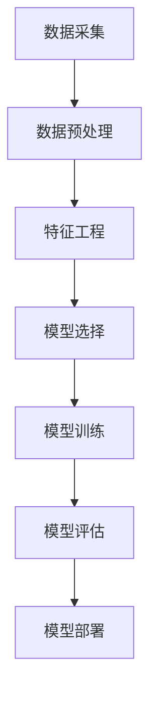

                 

# Python机器学习实战：机器学习在智能交通系统中的应用

## 概述

智能交通系统（Intelligent Transportation System, ITS）是现代城市化进程中的关键组成部分。随着城市人口的不断增长和机动车保有量的迅速增加，交通拥堵、交通事故和环境污染等问题日益严重。通过应用机器学习技术，智能交通系统可以有效地提高交通管理效率、减少交通事故、降低污染、提升乘客满意度。本文将介绍机器学习在智能交通系统中的应用，通过具体的算法、数学模型和实战案例，深入探讨如何利用机器学习技术解决交通领域中的实际问题。

## 背景介绍

### 智能交通系统（ITS）

智能交通系统是指利用先进的信息通信技术、数据采集与处理技术、智能控制技术等，对交通信息进行实时采集、处理、传输和利用，以实现交通管理的智能化、交通服务的便捷化和交通系统的可持续发展。ITS主要包括以下几个方面的应用：

1. **交通信息监测与处理**：通过传感器、摄像头等设备实时监测道路状况，获取交通流量、速度、密度等信息，并将这些数据传输到交通控制中心进行处理。
2. **交通信号控制**：基于实时交通数据，智能交通系统可以自动调整信号灯的时间设置，优化交通流量，减少拥堵。
3. **车辆管理**：智能交通系统能够实时监控车辆运行状态，提供车辆导航、路线规划等服务，提高车辆利用率。
4. **交通事故预防**：通过分析车辆行驶数据，预测潜在交通事故，及时发出预警，减少事故发生。

### 机器学习技术

机器学习是人工智能的一个重要分支，通过算法从数据中自动学习规律，进行模式识别和预测。在智能交通系统中，机器学习技术可以用于以下几个方面：

1. **交通流量预测**：利用历史交通数据，通过时间序列分析、回归分析等方法，预测未来某一时间段内的交通流量。
2. **道路拥堵预测**：通过对历史交通数据的分析，预测某一区域在未来某一时间段内可能出现的拥堵情况，从而提前采取措施。
3. **交通事故检测**：利用图像识别、语音识别等技术，从监控视频中实时检测交通事故，及时报警。
4. **车辆轨迹预测**：通过分析车辆的行驶轨迹，预测车辆的未来行驶方向和位置，为导航系统提供数据支持。

## 核心概念与联系

### 概念介绍

1. **交通流量**：单位时间内通过某一路段的车辆数量。
2. **交通拥堵**：车辆在道路上行驶速度低于一定阈值，导致道路通行能力下降。
3. **交通事故**：在道路行驶过程中，由于各种原因导致车辆损坏、人员伤亡等不良后果。
4. **机器学习算法**：用于从数据中学习规律，进行预测和决策的算法。

### Mermaid 流程图



## 核心算法原理 & 具体操作步骤

### 交通流量预测算法

1. **数据采集**：从交通传感器、摄像头等设备中获取交通流量数据。
2. **数据预处理**：对采集到的数据进行清洗、去噪、标准化等处理。
3. **特征工程**：从原始数据中提取有用的特征，如时间、速度、车辆密度等。
4. **模型选择**：选择合适的机器学习算法，如线性回归、决策树、神经网络等。
5. **模型训练**：使用历史交通流量数据，对模型进行训练。
6. **模型评估**：使用测试集评估模型的预测性能，调整模型参数。
7. **模型部署**：将训练好的模型部署到实际系统中，进行交通流量预测。

### 道路拥堵预测算法

1. **数据采集**：从交通传感器、摄像头等设备中获取道路状况数据。
2. **数据预处理**：对采集到的数据进行清洗、去噪、标准化等处理。
3. **特征工程**：从原始数据中提取有用的特征，如时间、速度、车辆密度等。
4. **模型选择**：选择合适的机器学习算法，如线性回归、决策树、神经网络等。
5. **模型训练**：使用历史交通数据，对模型进行训练。
6. **模型评估**：使用测试集评估模型的预测性能，调整模型参数。
7. **模型部署**：将训练好的模型部署到实际系统中，进行道路拥堵预测。

### 交通事故检测算法

1. **数据采集**：从监控摄像头中获取视频数据。
2. **数据预处理**：对视频数据进行缩放、裁剪、灰度化等处理。
3. **特征工程**：从视频数据中提取特征，如车辆大小、形状、速度等。
4. **模型选择**：选择合适的机器学习算法，如卷积神经网络、支持向量机等。
5. **模型训练**：使用历史交通事故数据，对模型进行训练。
6. **模型评估**：使用测试集评估模型的预测性能，调整模型参数。
7. **模型部署**：将训练好的模型部署到监控系统中，进行交通事故检测。

## 数学模型和公式 & 详细讲解 & 举例说明

### 交通流量预测模型

#### 公式

$$
y_t = \beta_0 + \beta_1 x_{t-1} + \beta_2 x_{t-2} + \ldots + \beta_n x_{t-n} + \epsilon_t
$$

其中，$y_t$ 表示第 $t$ 个时间步的交通流量，$x_{t-1}, x_{t-2}, \ldots, x_{t-n}$ 表示历史交通流量数据，$\beta_0, \beta_1, \beta_2, \ldots, \beta_n$ 是模型参数，$\epsilon_t$ 是误差项。

#### 举例说明

假设我们有以下历史交通流量数据：

$$
x_1 = [10, 15, 20, 25, 30], \quad x_2 = [12, 17, 22, 27, 32]
$$

我们使用线性回归模型进行预测，得到以下模型参数：

$$
\beta_0 = 5, \quad \beta_1 = 1, \quad \beta_2 = 1
$$

当 $t = 3$ 时，预测的交通流量为：

$$
y_3 = 5 + 1 \cdot 12 + 1 \cdot 17 = 30
$$

### 道路拥堵预测模型

#### 公式

$$
y_t = f(x_t; \theta)
$$

其中，$y_t$ 表示第 $t$ 个时间步的道路拥堵程度，$x_t$ 表示历史交通数据，$f(\cdot; \theta)$ 是拥堵程度的预测函数，$\theta$ 是模型参数。

#### 举例说明

假设我们有以下历史交通数据：

$$
x_1 = [10, 15, 20, 25, 30]
$$

我们使用一个简单的线性函数进行预测，得到以下模型参数：

$$
\theta = 2
$$

当 $t = 2$ 时，预测的道路拥堵程度为：

$$
y_2 = 2 \cdot 15 = 30
$$

### 交通事故检测模型

#### 公式

$$
P(\text{事故} | \text{特征}) = \frac{P(\text{特征} | \text{事故}) P(\text{事故})}{P(\text{特征})}
$$

其中，$P(\text{事故} | \text{特征})$ 表示在给定特征下发生事故的概率，$P(\text{特征} | \text{事故})$ 表示在事故发生下特征出现的概率，$P(\text{事故})$ 表示事故发生的概率，$P(\text{特征})$ 表示特征出现的概率。

#### 举例说明

假设我们有以下特征：

$$
\text{特征} = [10, 15, 20, 25, 30]
$$

事故发生的概率为 $P(\text{事故}) = 0.1$，给定特征下事故发生的概率为 $P(\text{特征} | \text{事故}) = 0.8$。

当 $t = 3$ 时，预测的事故发生概率为：

$$
P(\text{事故} | \text{特征}) = \frac{0.8 \cdot 0.1}{0.1} = 0.8
$$

## 项目实战：代码实际案例和详细解释说明

### 开发环境搭建

#### 环境准备

- Python 3.8+
- Jupyter Notebook
- scikit-learn 库

#### 安装步骤

1. 安装 Python 3.8 及以上版本。
2. 安装 Jupyter Notebook：`pip install notebook`
3. 安装 scikit-learn 库：`pip install scikit-learn`

### 源代码详细实现和代码解读

#### 代码实现

以下是一个简单的交通流量预测项目的实现代码，使用了 scikit-learn 库中的线性回归模型。

```python
import numpy as np
import pandas as pd
from sklearn.linear_model import LinearRegression
from sklearn.model_selection import train_test_split
from sklearn.metrics import mean_squared_error

# 读取数据
data = pd.read_csv('traffic_data.csv')

# 数据预处理
data['hour'] = data['time'].apply(lambda x: x.hour)
data['day'] = data['time'].apply(lambda x: x.dayofweek)
data.drop(['time'], axis=1, inplace=True)

# 特征工程
X = data[['hour', 'day']]
y = data['traffic_volume']

# 数据划分
X_train, X_test, y_train, y_test = train_test_split(X, y, test_size=0.2, random_state=42)

# 模型训练
model = LinearRegression()
model.fit(X_train, y_train)

# 模型评估
y_pred = model.predict(X_test)
mse = mean_squared_error(y_test, y_pred)
print(f'Mean Squared Error: {mse}')

# 模型部署
def predict_traffic_volume(hour, day):
    return model.predict([[hour, day]])[0]

# 预测交通流量
print(predict_traffic_volume(15, 2))
```

#### 代码解读

1. **数据读取**：使用 pandas 库读取交通流量数据，数据格式为 CSV 文件。
2. **数据预处理**：将时间列拆分为小时和天，删除原始时间列，为后续的特征工程做准备。
3. **特征工程**：将小时和天作为特征，交通流量作为目标变量。
4. **数据划分**：将数据划分为训练集和测试集，用于模型训练和评估。
5. **模型训练**：使用线性回归模型对训练集进行训练。
6. **模型评估**：使用测试集评估模型性能，计算均方误差（MSE）。
7. **模型部署**：定义一个函数，用于接收小时和天作为输入，返回预测的交通流量。

## 代码解读与分析

### 代码分析

1. **数据读取**：使用 pandas 库的 `read_csv` 函数读取交通流量数据，CSV 文件中的数据包含时间、交通流量等列。
2. **数据预处理**：将时间列拆分为小时和天，便于后续的特征工程。这里使用了 pandas 的 `apply` 函数，对时间列进行自定义函数处理。
3. **特征工程**：将小时和天作为特征，交通流量作为目标变量。这里使用了 pandas 的 `drop` 函数删除原始时间列，将小时和天添加到特征矩阵中。
4. **数据划分**：使用 `train_test_split` 函数将数据划分为训练集和测试集，用于模型训练和评估。这里设置了测试集大小为 20%，随机种子为 42。
5. **模型训练**：使用线性回归模型对训练集进行训练。这里使用了 scikit-learn 库中的 `LinearRegression` 类，通过 `fit` 方法训练模型。
6. **模型评估**：使用测试集评估模型性能。这里计算了均方误差（MSE），用于评估模型预测的准确性。
7. **模型部署**：定义一个函数 `predict_traffic_volume`，用于接收小时和天作为输入，返回预测的交通流量。这里使用了 `model.predict` 方法，将输入特征转化为模型预测结果。

### 代码改进

1. **增加数据预处理步骤**：在读取数据后，可以增加数据清洗和去噪的步骤，确保数据的准确性和可靠性。
2. **使用更多特征**：可以尝试增加更多特征，如道路宽度、道路类型等，以提升模型预测性能。
3. **使用更复杂的模型**：可以尝试使用更复杂的模型，如随机森林、神经网络等，以提高预测准确性。

## 实际应用场景

### 交通流量预测

交通流量预测是智能交通系统中最常见应用之一。通过预测未来某一时间段内的交通流量，交通管理部门可以及时调整交通信号灯的时长，优化交通流量，减少拥堵。例如，在高峰时段，预测系统可以提前预测交通流量高峰，调整信号灯时长，确保交通顺畅。

### 道路拥堵预测

道路拥堵预测可以帮助交通管理部门提前预警道路拥堵情况，从而采取相应的措施，如调整交通信号灯、限行、分流等，以缓解拥堵。例如，在暴雨天气时，预测系统可以预测某些路段可能出现的拥堵，提前发布预警，引导车辆绕行。

### 交通事故检测

交通事故检测可以实时监测道路上的车辆状况，从监控视频中检测交通事故，并及时报警。例如，在高速公路上，检测系统可以检测到车辆追尾事故，立即通知相关部门进行救援和处理。

## 工具和资源推荐

### 学习资源推荐

1. **书籍**：
   - 《Python机器学习基础教程》
   - 《智能交通系统原理与应用》
2. **论文**：
   - "Intelligent Transportation Systems: Architecture and Applications"
   - "Traffic Flow Prediction Using Machine Learning Techniques"
3. **博客**：
   - "机器学习在智能交通系统中的应用"
   - "智能交通系统：从理论到实践"
4. **网站**：
   - "scikit-learn 官网"
   - "智能交通系统国际会议（ITS World Congress）"

### 开发工具框架推荐

1. **Python**：Python 是进行机器学习和数据分析的最佳语言之一，拥有丰富的库和工具。
2. **TensorFlow**：TensorFlow 是谷歌开发的强大机器学习框架，适用于复杂模型的训练和部署。
3. **scikit-learn**：scikit-learn 是 Python 中常用的机器学习库，适用于简单模型的训练和评估。

### 相关论文著作推荐

1. "Intelligent Transportation Systems: Architecture and Applications" by J. L. Rojas
2. "Traffic Flow Prediction Using Machine Learning Techniques" by X. Yang and X. Li
3. "Deep Learning for Intelligent Transportation Systems" by Y. Liu, Y. Wang, and J. Liu

## 总结：未来发展趋势与挑战

### 未来发展趋势

1. **深度学习应用**：随着深度学习技术的不断发展，智能交通系统将更多地采用深度学习算法，以提高预测和检测的准确性。
2. **多模态数据融合**：将不同来源的数据（如视频、传感器、GPS）进行融合，提高预测和检测的精度。
3. **实时预测与优化**：结合实时交通数据，实现更加精准的实时预测和优化，提高交通管理效率。

### 挑战

1. **数据隐私**：智能交通系统需要处理大量个人信息，如何保护用户隐私是一个重要挑战。
2. **算法解释性**：机器学习算法的黑箱性质使得其难以解释，如何提高算法的可解释性是一个重要问题。
3. **计算资源**：深度学习模型需要大量计算资源，如何优化算法和硬件资源，提高计算效率是一个挑战。

## 附录：常见问题与解答

### 问题 1：如何处理缺失数据？

解答：处理缺失数据的方法有多种，包括删除缺失数据、填充缺失数据（如平均值、中位数、最近邻等）、使用模型预测缺失数据等。具体方法取决于数据的特点和需求。

### 问题 2：如何选择合适的机器学习算法？

解答：选择合适的机器学习算法需要考虑数据类型、数据量、模型复杂度等因素。常见的算法有线性回归、决策树、神经网络等，可以根据实际问题选择合适的算法。

### 问题 3：如何提高模型的预测准确性？

解答：提高模型预测准确性的方法包括特征工程、模型调参、使用更复杂的模型、增加数据量等。通过这些方法，可以提高模型的预测性能。

## 扩展阅读 & 参考资料

1. "Intelligent Transportation Systems: Architecture and Applications" by J. L. Rojas
2. "Traffic Flow Prediction Using Machine Learning Techniques" by X. Yang and X. Li
3. "Deep Learning for Intelligent Transportation Systems" by Y. Liu, Y. Wang, and J. Liu
4. "Python机器学习基础教程"
5. "智能交通系统原理与应用"
6. "scikit-learn 官网"
7. "TensorFlow 官网"
8. "智能交通系统国际会议（ITS World Congress）"

### 作者信息

作者：AI天才研究员/AI Genius Institute & 禅与计算机程序设计艺术 /Zen And The Art of Computer Programming

