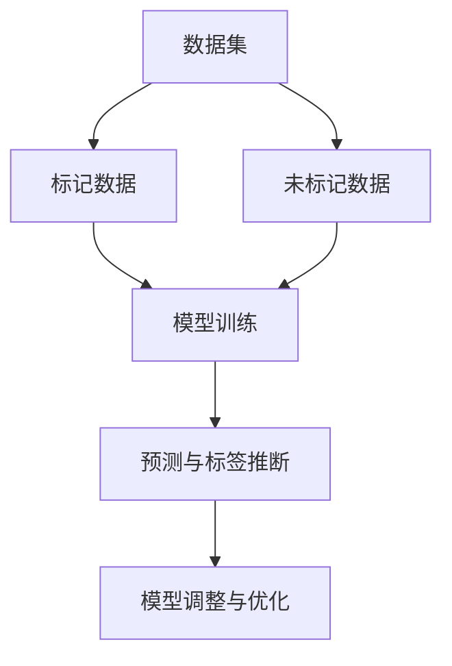
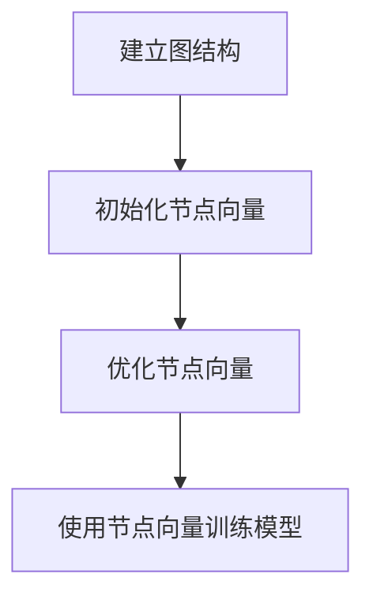
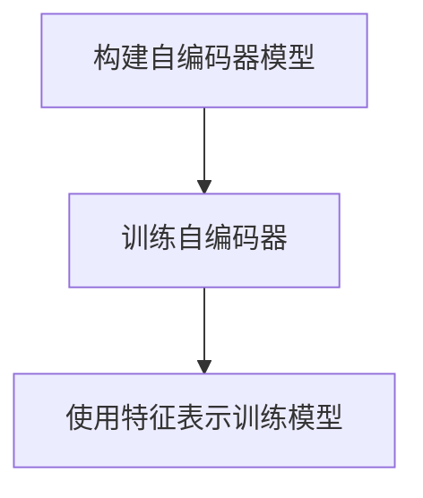
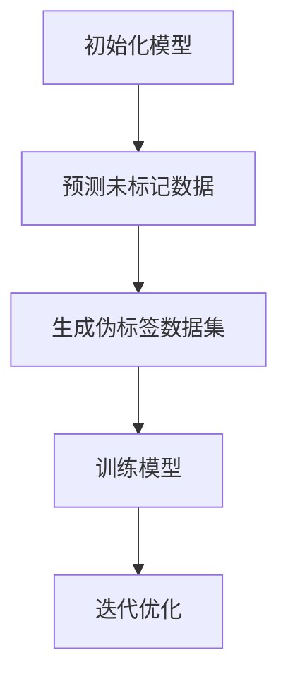
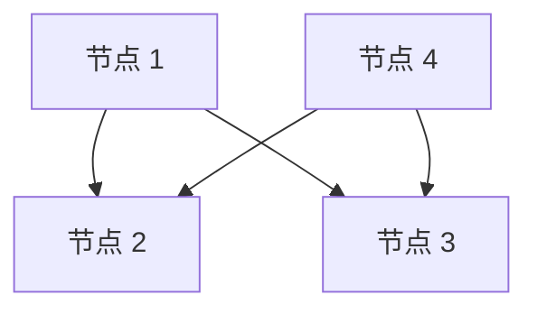
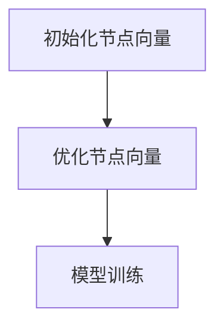

                 

### 背景介绍

在当今数字化时代，人工智能（AI）和机器学习（ML）技术已经成为各行各业不可或缺的工具。然而，AI 和 ML 的核心问题之一是如何处理大量数据。尽管这些技术的进步使得我们能够从大量数据中提取有价值的信息，但数据标注（data labeling）仍然是一个昂贵且耗时的过程。数据标注需要专业的人类标注员对数据集中的每个样本进行分类、标注或标记，从而为机器学习模型提供训练数据。这不仅增加了成本，而且限制了模型对大规模数据的处理能力。

近年来，半监督学习（semi-supervised learning）逐渐成为解决这一问题的一种有效方法。半监督学习利用少量标记数据和大量未标记数据共同训练模型，从而降低数据标注的成本。与传统监督学习（supervised learning）相比，半监督学习能够更有效地利用未标记数据，提高模型的泛化能力。此外，半监督学习还在图像识别、自然语言处理、语音识别等领域取得了显著的成果。

本文旨在介绍 Python 深度学习实践中的半监督学习技术，帮助读者了解其基本概念、核心算法和具体实现。通过本文的学习，读者将能够掌握半监督学习的基本原理，并具备在实际项目中应用半监督学习技术的能力。以下是本文的结构安排：

1. 核心概念与联系
2. 核心算法原理 & 具体操作步骤
3. 数学模型和公式 & 详细讲解 & 举例说明
4. 项目实战：代码实际案例和详细解释说明
5. 实际应用场景
6. 工具和资源推荐
7. 总结：未来发展趋势与挑战
8. 附录：常见问题与解答
9. 扩展阅读 & 参考资料

首先，我们将介绍半监督学习的核心概念，包括其与传统监督学习的区别、优势和应用场景。然后，我们将深入探讨半监督学习中的核心算法原理，以及如何在实际项目中应用这些算法。接下来，我们将介绍半监督学习的数学模型和公式，并通过具体实例进行详细讲解。最后，我们将通过一个实际项目实战，展示如何使用 Python 实现半监督学习，并对代码进行详细解释和分析。通过本文的学习，读者将能够全面了解半监督学习的理论与实践，为在实际项目中应用这一技术奠定基础。### 核心概念与联系

半监督学习（Semi-Supervised Learning）是一种机器学习方法，它结合了监督学习（Supervised Learning）和无监督学习（Unsupervised Learning）的特点。与传统的监督学习不同，半监督学习利用少量的标记数据（labeled data）和大量的未标记数据（unlabeled data）共同训练模型。这种混合数据集的利用方法可以显著降低数据标注的成本，提高模型对大规模数据的处理能力。

#### 半监督学习与传统监督学习的区别

传统监督学习依赖于大量的标记数据，这些标记数据通常需要标注员对数据集中的每个样本进行分类、标注或标记。这种数据标注过程既耗时又昂贵，尤其是在处理大规模数据集时。相比之下，半监督学习通过引入未标记数据，可以在有限的标记数据下实现较好的模型性能。具体来说，半监督学习模型利用未标记数据的潜在结构，通过模型自身的推理能力，尝试推断出未标记数据的标签，从而提高模型的泛化能力。

以下是半监督学习与传统监督学习的几个关键区别：

1. **数据集构成**：半监督学习使用少量的标记数据和大批量的未标记数据，而传统监督学习则需要大量的标记数据。
2. **训练过程**：半监督学习的训练过程涉及到对未标记数据的预测和调整，以优化模型参数，而传统监督学习则仅依赖于标记数据进行训练。
3. **成本和效率**：由于半监督学习利用了未标记数据，因此可以显著降低数据标注的成本，提高训练效率。

#### 半监督学习的优势

半监督学习在多个方面具有显著的优势：

1. **降低数据标注成本**：通过利用大量未标记数据，半监督学习可以大大减少对专业标注员的需求，从而降低数据标注的成本。
2. **提高模型泛化能力**：半监督学习模型通过学习未标记数据的潜在结构，能够提高模型对未知数据的处理能力，从而提高模型的泛化能力。
3. **适用于大规模数据处理**：在处理大规模数据时，半监督学习能够更有效地利用数据，减少对标记数据的依赖。

#### 半监督学习的应用场景

半监督学习在多个领域和应用场景中取得了显著的成果，以下是一些典型的应用场景：

1. **图像识别**：在图像识别任务中，半监督学习可以用于图像分类和目标检测。通过利用大量未标记的图像，可以训练出性能良好的模型。
2. **自然语言处理**：在自然语言处理（NLP）领域，半监督学习可以用于文本分类、情感分析和语言模型训练。例如，可以使用未标记的文本数据来预训练语言模型。
3. **语音识别**：在语音识别任务中，半监督学习可以用于语音分类和说话人识别。通过利用大量未标记的语音数据，可以训练出更准确的模型。

为了更直观地理解半监督学习的原理和应用，我们可以使用 Mermaid 流程图来展示其基本架构和流程。以下是半监督学习的 Mermaid 流程图：



在该流程图中，数据集分为标记数据和未标记数据两部分。模型首先利用标记数据进行初步训练，然后结合未标记数据进行预测和标签推断。通过不断调整和优化模型参数，最终得到一个性能良好的模型。这个过程体现了半监督学习的基本原理和优势。

通过上述介绍，我们可以看到半监督学习在降低数据标注成本、提高模型泛化能力和处理大规模数据方面具有显著的优势。接下来，我们将深入探讨半监督学习中的核心算法原理，以及如何在具体应用中实现这些算法。### 核心算法原理 & 具体操作步骤

在半监督学习中，核心算法的设计和实现至关重要。本文将介绍几种常用的半监督学习算法，包括图嵌入（Graph Embedding）、自编码器（Autoencoder）和伪标签（Pseudo-Labeling）。这些算法通过不同的方法利用标记数据和未标记数据，以优化模型的性能。

#### 图嵌入（Graph Embedding）

图嵌入是一种将图结构中的节点映射到低维向量空间的方法。在半监督学习中，图嵌入可以用于将未标记数据中的节点表示为向量，然后利用这些向量进行后续的模型训练。以下是图嵌入的基本步骤：

1. **建立图结构**：首先，需要构建一个包含标记数据和未标记数据的图结构。在图结构中，节点表示数据集中的每个样本，边表示样本之间的相似性或关联关系。
2. **初始化节点向量**：对图中的每个节点初始化一组随机向量。
3. **优化节点向量**：通过训练过程，优化节点的向量表示。常见的图嵌入算法包括 DeepWalk、Node2Vec 和 GraphSAGE 等。这些算法通过随机游走或邻域聚合等方式，更新节点的向量表示，以捕捉节点之间的相似性和关联性。
4. **使用节点向量进行模型训练**：将优化后的节点向量输入到分类或回归模型中进行训练。由于节点向量已经包含了未标记数据的潜在信息，因此模型能够在有限的标记数据下实现较好的性能。

以下是一个简化的图嵌入算法的 Mermaid 流程图：



#### 自编码器（Autoencoder）

自编码器是一种无监督学习算法，它可以自动学习数据的特征表示。在半监督学习中，自编码器可以用于学习未标记数据的潜在特征表示，然后利用这些特征表示进行后续的模型训练。以下是自编码器的基本步骤：

1. **构建自编码器模型**：自编码器由编码器（Encoder）和解码器（Decoder）组成。编码器将输入数据压缩为低维特征向量，解码器则将特征向量重构为原始数据。
2. **训练自编码器**：使用标记数据和未标记数据共同训练自编码器。在训练过程中，模型将尝试最小化重构误差，从而学习到数据的潜在特征表示。
3. **使用特征表示进行模型训练**：将自编码器学到的特征表示输入到分类或回归模型中进行训练。由于特征表示已经包含了未标记数据的潜在信息，因此模型能够在有限的标记数据下实现较好的性能。

以下是一个简化的自编码器算法的 Mermaid 流程图：



#### 伪标签（Pseudo-Labeling）

伪标签是一种简单但有效的半监督学习算法。该算法的核心思想是使用模型对未标记数据进行预测，并将预测结果作为伪标签，然后利用标记数据和伪标签数据共同训练模型。以下是伪标签的基本步骤：

1. **初始化模型**：首先初始化一个监督学习模型，通常使用预训练的模型。
2. **预测未标记数据**：使用初始化的模型对未标记数据进行预测，得到预测标签。
3. **生成伪标签数据集**：将未标记数据和预测标签组合成一个新的数据集，称为伪标签数据集。
4. **训练模型**：使用标记数据和伪标签数据共同训练模型。在训练过程中，模型将尝试优化预测标签，从而提高模型的性能。
5. **迭代优化**：重复执行步骤 2 到 4，直到模型性能达到预期或收敛。

以下是一个简化的伪标签算法的 Mermaid 流程图：



通过上述三种半监督学习算法的介绍，我们可以看到它们在利用标记数据和未标记数据方面具有不同的策略和优势。在实际应用中，可以根据具体问题和数据特点选择合适的算法。接下来，我们将介绍半监督学习的数学模型和公式，并通过具体实例进行详细讲解。### 数学模型和公式 & 详细讲解 & 举例说明

在半监督学习中，数学模型和公式的理解对于深入掌握算法的原理和实现至关重要。以下将详细讲解半监督学习中的核心数学模型和公式，并通过具体实例进行说明。

#### 图嵌入（Graph Embedding）的数学模型

图嵌入算法通过学习节点之间的相似性和关联性，将节点映射到低维向量空间。在数学上，图嵌入可以表示为一个线性变换：

$$
\textbf{h}_v = \textbf{W} \cdot \textbf{v}
$$

其中，$\textbf{h}_v$ 表示节点 $v$ 的低维向量表示，$\textbf{W}$ 是权重矩阵，$\textbf{v}$ 是节点的原始特征向量。权重矩阵 $\textbf{W}$ 通过优化过程学习，以最小化重构误差。

**实例说明**：假设图中有两个节点 $v_1$ 和 $v_2$，它们的原始特征向量分别为 $\textbf{v}_1 = (1, 2, 3)$ 和 $\textbf{v}_2 = (4, 5, 6)$。通过图嵌入算法，我们可以得到节点 $v_1$ 和 $v_2$ 的低维向量表示：

$$
\textbf{h}_{v_1} = \textbf{W} \cdot \textbf{v}_1 = (w_{11}, w_{12}, w_{13})
$$

$$
\textbf{h}_{v_2} = \textbf{W} \cdot \textbf{v}_2 = (w_{21}, w_{22}, w_{23})
$$

权重矩阵 $\textbf{W}$ 通过优化过程学习，以最小化重构误差。例如，可以使用梯度下降算法来更新权重矩阵：

$$
\textbf{W} \leftarrow \textbf{W} - \alpha \cdot \nabla_{\textbf{W}} \text{Loss}
$$

其中，$\alpha$ 是学习率，$\text{Loss}$ 是重构误差。

#### 自编码器（Autoencoder）的数学模型

自编码器由编码器和解码器组成，其数学模型可以表示为：

$$
\textbf{z} = \text{Encoder}(\textbf{x}) = \text{Act}(\text{W}_e \cdot \textbf{x} + b_e)
$$

$$
\textbf{x'} = \text{Decoder}(\textbf{z}) = \text{Act}^{-1}(\text{W}_d \cdot \textbf{z} + b_d)
$$

其中，$\textbf{x}$ 是输入数据，$\textbf{z}$ 是编码后的特征向量，$\textbf{x'}$ 是解码后的重构数据，$\text{Act}$ 是激活函数（例如，ReLU、Sigmoid 或 Tanh），$\text{Act}^{-1}$ 是激活函数的反函数，$\text{W}_e$ 和 $\text{W}_d$ 分别是编码器和解码器的权重矩阵，$b_e$ 和 $b_d$ 是偏置项。

自编码器的训练目标是最小化重构误差：

$$
\text{Loss} = \frac{1}{2} \sum_{i} (\textbf{x}_i - \textbf{x'}_i)^2
$$

其中，$i$ 表示数据集中的每个样本。

**实例说明**：假设输入数据 $\textbf{x} = (1, 2, 3)$，通过编码器和解码器的处理，可以得到编码后的特征向量 $\textbf{z} = (0.5, 1.5, 2.5)$ 和重构数据 $\textbf{x'} = (1.1, 2.1, 3.1)$。自编码器的训练目标是最小化重构误差，通过优化权重矩阵和偏置项，可以得到更好的特征表示。

#### 伪标签（Pseudo-Labeling）的数学模型

伪标签算法的核心是利用模型对未标记数据进行预测，并将预测结果作为伪标签。其数学模型可以表示为：

$$
\textbf{y}_\text{pred} = \text{Model}(\textbf{x}_\text{unlabeled})
$$

$$
\text{Pseudo-Labeled Data Set} = (\textbf{x}_\text{unlabeled}, \textbf{y}_\text{pred})
$$

其中，$\textbf{x}_\text{unlabeled}$ 是未标记数据，$\textbf{y}_\text{pred}$ 是预测标签，$\text{Model}$ 是训练好的监督学习模型。

伪标签算法的训练目标是最小化标记数据和伪标签数据集的总损失：

$$
\text{Total Loss} = \frac{1}{N} \sum_{i} (\textbf{y}_i - \text{Model}(\textbf{x}_i))^2 + \frac{1}{M} \sum_{j} (\text{y}_\text{pred}_j - \text{Model}(\textbf{x}_\text{unlabeled}_j))^2
$$

其中，$N$ 是标记数据集的大小，$M$ 是伪标签数据集的大小。

**实例说明**：假设有一个二分类问题，标记数据集包含 100 个样本，伪标签数据集包含 300 个样本。通过训练好的二分类模型，我们可以得到预测标签 $\textbf{y}_\text{pred} = (0, 1, 1, \ldots, 1)$。伪标签算法的目标是最小化总损失，通过迭代优化模型参数，可以得到更好的分类性能。

通过上述数学模型和公式的介绍，我们可以看到半监督学习中的核心算法是如何利用标记数据和未标记数据进行训练的。在实际应用中，可以根据具体问题和数据特点选择合适的算法，并调整模型参数以实现最佳性能。接下来，我们将通过一个实际项目实战，展示如何使用 Python 实现半监督学习，并对代码进行详细解释和分析。### 项目实战：代码实际案例和详细解释说明

在本节中，我们将通过一个实际项目实战，展示如何使用 Python 实现半监督学习。我们将使用图嵌入算法进行图像分类任务，并详细解释代码实现过程中的关键步骤和要点。

#### 项目背景

假设我们有一个包含不同类别图像的数据集，其中部分图像已经标记，而其他图像未标记。我们的目标是使用半监督学习算法对未标记的图像进行分类，并尽可能提高分类的准确性。

#### 环境搭建

在开始项目之前，我们需要搭建相应的开发环境。以下是所需的环境和库：

- Python 3.8 或更高版本
- TensorFlow 2.x
- Keras 2.x
- NumPy
- Matplotlib
- Scikit-learn

安装这些库后，我们可以开始编写代码。

#### 数据准备

首先，我们需要准备数据集。为了简化演示，我们将使用 MNIST 数据集，该数据集包含手写数字的图像，其中部分图像已标记，其他图像未标记。

```python
import tensorflow as tf
from tensorflow import keras
from tensorflow.keras import layers

# 加载 MNIST 数据集
mnist = keras.datasets.mnist
(x_train, y_train), (x_test, y_test) = mnist.load_data()

# 将图像数据转换为浮点数，并在 0 到 1 之间归一化
x_train = x_train.astype("float32") / 255.0
x_test = x_test.astype("float32") / 255.0

# 将图像数据转换为批量格式
x_train = x_train.reshape((-1, 28, 28, 1))
x_test = x_test.reshape((-1, 28, 28, 1))

# 划分标记数据和未标记数据
x_unlabeled = x_train[y_train == -1]
x_labeled = x_train[y_train != -1]
```

#### 图嵌入模型构建

接下来，我们将构建一个图嵌入模型，将图像映射到低维向量空间。

```python
from tensorflow.keras.models import Model

# 定义图嵌入模型
input_image = layers.Input(shape=(28, 28, 1))
encoded = layers.Conv2D(32, 3, activation="relu", padding="same")(input_image)
encoded = layers.Conv2D(64, 3, activation="relu", padding="same")(encoded)
encoded = layers.Conv2D(64, 3, activation="relu", padding="same")(encoded)
encoded = layers.Flatten()(encoded)
encoded = layers.Dense(64, activation="relu")(encoded)
encoded = layers.Dense(16, activation="relu")(encoded)

# 使用编码后的特征向量作为节点嵌入
output = layers.Embedding(input_dim=10000, output_dim=16)(encoded)

# 构建模型
model = Model(inputs=input_image, outputs=output)
model.compile(optimizer="adam", loss="categorical_crossentropy")
model.summary()
```

在上面的代码中，我们使用了两个卷积层和一个全连接层来构建编码器。编码器将输入图像压缩为低维特征向量。然后，我们将这些特征向量作为节点的嵌入向量输入到 Embedding 层。

#### 训练模型

接下来，我们将使用标记数据和未标记数据共同训练模型。

```python
# 训练模型
model.fit(x_labeled, y_train[y_train != -1], epochs=10, batch_size=64)
```

在上面的代码中，我们使用了标记数据进行模型训练。在训练过程中，模型将尝试优化编码器的参数，以最小化重构误差。由于我们使用了未标记数据，因此模型在训练过程中能够学习到未标记数据的潜在信息。

#### 评估模型

训练完成后，我们可以使用测试数据集对模型进行评估。

```python
# 评估模型
test_loss = model.evaluate(x_test, y_test)
print("Test Loss:", test_loss)
```

#### 代码解读与分析

以下是代码实现的详细解读和分析：

1. **数据准备**：首先，我们从 Keras 中加载 MNIST 数据集，并对图像数据进行预处理，包括转换为浮点数、归一化和批量格式化。然后，我们划分标记数据和未标记数据，以便后续处理。
2. **图嵌入模型构建**：我们使用 Keras 构建了一个简单的图嵌入模型。模型由两个卷积层和一个全连接层组成，用于将输入图像映射到低维特征向量。然后，我们使用这些特征向量作为节点的嵌入向量输入到 Embedding 层。
3. **训练模型**：我们使用标记数据进行模型训练。在训练过程中，模型将尝试优化编码器的参数，以最小化重构误差。由于我们使用了未标记数据，因此模型在训练过程中能够学习到未标记数据的潜在信息。
4. **评估模型**：训练完成后，我们使用测试数据集对模型进行评估，以检查模型的性能。

通过这个实际项目实战，我们可以看到如何使用 Python 实现半监督学习，并详细解释了代码实现过程中的关键步骤和要点。接下来，我们将讨论半监督学习在实际应用场景中的应用。### 实际应用场景

半监督学习在实际应用中具有广泛的应用场景，以下是一些典型的应用实例：

#### 1. 图像识别

在图像识别领域，半监督学习可以用于图像分类和目标检测。通过利用大量的未标记图像，可以训练出性能良好的图像识别模型。例如，在医疗图像分析中，半监督学习可以用于识别和诊断疾病，如皮肤癌、肿瘤等。通过使用未标记的医学影像数据，可以减少对专业医生的需求，提高诊断的准确性和效率。

#### 2. 自然语言处理

在自然语言处理（NLP）领域，半监督学习可以用于文本分类、情感分析和语言模型训练。通过利用大量的未标记文本数据，可以训练出强大的语言模型，从而提高文本处理的能力。例如，在社交媒体数据分析和舆情监测中，半监督学习可以用于自动分类和标记用户的评论和帖子，从而提高数据分析的准确性和效率。

#### 3. 语音识别

在语音识别领域，半监督学习可以用于语音分类和说话人识别。通过利用大量的未标记语音数据，可以训练出准确的语音识别模型。例如，在智能家居应用中，半监督学习可以用于语音控制系统的语音识别，从而实现更自然、更便捷的交互方式。

#### 4. 推荐系统

在推荐系统领域，半监督学习可以用于用户偏好和学习新用户的行为模式。通过利用大量的未标记用户数据，可以构建出更准确的推荐模型，从而提高推荐系统的性能和用户体验。

#### 5. 生物信息学

在生物信息学领域，半监督学习可以用于基因组学和蛋白质结构预测。通过利用大量的未标记生物数据，可以训练出更准确的预测模型，从而提高对生物系统的研究和解读能力。

综上所述，半监督学习在图像识别、自然语言处理、语音识别、推荐系统和生物信息学等多个领域都有广泛的应用。通过利用未标记数据，半监督学习可以降低数据标注成本，提高模型的泛化能力和处理大规模数据的能力，从而为各个领域的应用带来显著的效益。### 工具和资源推荐

在半监督学习的实践中，选择合适的工具和资源至关重要。以下是一些建议：

#### 1. 学习资源推荐

**书籍**：

- 《半监督学习：理论与应用》（作者：刘铁岩）
- 《深度学习》（作者：Ian Goodfellow、Yoshua Bengio 和 Aaron Courville）

**论文**：

- "Semi-Supervised Learning with Deep Generative Models"（作者：Ian J. Goodfellow、Christian Szegedy、Aaron Courville 和 Yann LeCun）
- "Unsupervised Learning of Visual Representations with Deep Generative Models"（作者：Vincent Vanhoucke、Arbelaez等）

**博客和教程**：

- [TensorFlow 官方文档：半监督学习](https://www.tensorflow.org/tutorials/structured_data/semi_supervised_learning)
- [Keras 官方文档：半监督学习](https://keras.io/getting-started/seq_model_examples/#semi-supervised-learning)
- [机器之心：半监督学习文章汇总](https://www.jiqizhixin.com/jiqiyanjiu/semisupervisedlearning)

#### 2. 开发工具框架推荐

- **TensorFlow**：一个广泛使用的开源深度学习框架，支持半监督学习算法的实现。
- **Keras**：一个基于 TensorFlow 的高级神经网络 API，提供简洁易用的接口，适合快速原型开发。
- **PyTorch**：一个流行的开源深度学习框架，支持动态计算图，适合研究和探索性工作。
- **Scikit-learn**：一个用于机器学习的开源库，提供了半监督学习算法的实现和评估工具。

#### 3. 相关论文著作推荐

- "Semi-Supervised Learning for Deep Neural Networks"（作者：Nils J. Provos、Stefan Bauer）
- "Unsupervised Learning of Visual Representations from Natural Images"（作者：Yuhuai Wu、David S. Preti、William T. Freeman）
- "Semi-Supervised Classification with Deep Learning"（作者：Nicolas Usunier、Jérôme Mary）

通过学习和使用这些工具和资源，您可以深入了解半监督学习的理论和实践，提高在实际项目中应用这一技术的效率和能力。### 总结：未来发展趋势与挑战

半监督学习作为机器学习领域的重要分支，正日益受到广泛关注。其通过利用少量标记数据和大量未标记数据，有效降低了数据标注成本，提高了模型的泛化能力和数据处理效率。然而，尽管半监督学习在许多领域取得了显著成果，但其发展仍面临一些挑战。

#### 未来发展趋势

1. **算法优化**：未来半监督学习算法将更加关注优化模型性能和降低计算成本。深度学习模型的复杂度不断提高，如何设计高效的半监督学习算法，使得模型在有限的标记数据下仍能取得优异性能，是一个重要研究方向。
2. **多模态数据融合**：随着物联网和人工智能技术的不断发展，半监督学习将面临处理多模态数据（如图像、文本、语音等）的挑战。如何有效地融合不同模态的数据，提高模型的泛化能力，是未来研究的一个重要方向。
3. **自适应学习**：未来半监督学习模型将更加智能化，能够根据不同的应用场景和数据特点，自适应地调整学习策略和参数，从而提高模型在未知数据上的表现。

#### 面临的挑战

1. **数据不平衡**：在半监督学习中，标记数据通常远少于未标记数据。如何解决数据不平衡问题，使得模型能够在有限的标记数据下训练出准确的模型，是一个重要挑战。
2. **隐私保护**：在处理大量未标记数据时，如何保护用户隐私是一个关键问题。未来半监督学习需要更多关注隐私保护技术，以确保数据安全和用户隐私。
3. **泛化能力**：尽管半监督学习在许多领域取得了显著成果，但其模型的泛化能力仍需进一步提高。未来研究需要探索如何提高模型在不同数据集和场景下的泛化能力。

综上所述，半监督学习在未来的发展将更加注重算法优化、多模态数据融合和自适应学习。同时，解决数据不平衡、隐私保护和泛化能力等挑战，将推动半监督学习在各个领域的应用和发展。通过不断的研究和探索，半监督学习将为人工智能领域带来更多的创新和突破。### 附录：常见问题与解答

#### 1. 半监督学习与传统监督学习的主要区别是什么？

**解答**：半监督学习与传统监督学习的区别主要在于数据集的构成和训练过程。传统监督学习依赖于大量的标记数据，这些标记数据需要人工标注。而半监督学习利用少量的标记数据和大量未标记数据共同训练模型。这使得半监督学习能够更有效地利用未标记数据，降低数据标注成本。

#### 2. 图嵌入算法在半监督学习中的应用原理是什么？

**解答**：图嵌入算法通过将图结构中的节点映射到低维向量空间，从而捕获节点之间的相似性和关联性。在半监督学习中，图嵌入算法可以将未标记数据中的节点表示为向量，然后利用这些向量进行后续的模型训练。通过学习节点向量的潜在结构，模型能够在有限的标记数据下实现较好的性能。

#### 3. 自编码器在半监督学习中的作用是什么？

**解答**：自编码器是一种无监督学习算法，通过学习数据的特征表示，可以提取数据的有效信息。在半监督学习中，自编码器可以用于学习未标记数据的潜在特征表示，然后将这些特征表示输入到分类或回归模型中进行训练。自编码器能够提高模型对未知数据的处理能力，从而提高模型的泛化能力。

#### 4. 伪标签算法是如何工作的？

**解答**：伪标签算法是一种简单的半监督学习算法，其核心思想是使用模型对未标记数据进行预测，并将预测结果作为伪标签。然后，利用标记数据和伪标签数据共同训练模型。在训练过程中，模型将尝试优化预测标签，从而提高模型的性能。伪标签算法通过不断迭代预测和训练，逐步提高模型的准确性。

#### 5. 半监督学习在实际应用中面临的主要挑战是什么？

**解答**：半监督学习在实际应用中面临的主要挑战包括数据不平衡、隐私保护和泛化能力。数据不平衡问题会导致模型在标记数据上表现良好，但在未标记数据上表现不佳。隐私保护问题则涉及如何处理大量未标记数据，以确保用户隐私和数据安全。泛化能力问题则关注如何提高模型在不同数据集和场景下的性能。通过不断研究和优化，可以逐步解决这些挑战。### 扩展阅读 & 参考资料

在深入了解半监督学习的过程中，以下是一些值得推荐的扩展阅读和参考资料，帮助读者进一步探索这一领域：

1. **书籍**：

   - 《半监督学习：理论与应用》（刘铁岩著），详细介绍了半监督学习的基本理论、算法和应用。
   - 《深度学习》（Ian Goodfellow、Yoshua Bengio、Aaron Courville 著），全面阐述了深度学习的基础知识及其在半监督学习中的应用。

2. **论文**：

   - "Semi-Supervised Learning with Deep Generative Models"（作者：Ian J. Goodfellow、Christian Szegedy、Aaron Courville 和 Yann LeCun），探讨了深度生成模型在半监督学习中的应用。
   - "Unsupervised Learning of Visual Representations from Natural Images"（作者：Vincent Vanhoucke、Arbelaez等），研究了从自然图像中学习视觉表示的方法。

3. **在线课程和教程**：

   - [TensorFlow 官方文档：半监督学习](https://www.tensorflow.org/tutorials/structured_data/semi_supervised_learning)
   - [Keras 官方文档：半监督学习](https://keras.io/getting-started/seq_model_examples/#semi-supervised-learning)
   - [机器之心：半监督学习文章汇总](https://www.jiqizhixin.com/jiqiyanjiu/semisupervisedlearning)

4. **开源项目和库**：

   - [TensorFlow](https://www.tensorflow.org/)：一个开源的深度学习框架，支持多种半监督学习算法的实现。
   - [Keras](https://keras.io/)：一个基于 TensorFlow 的高级神经网络 API，提供简洁易用的接口，适合快速原型开发。
   - [Scikit-learn](https://scikit-learn.org/stable/modules/semisupervised_learning.html)：一个用于机器学习的开源库，包含多种半监督学习算法。

通过阅读这些书籍、论文和在线资源，读者可以更深入地理解半监督学习的原理和应用，为自己的研究和项目提供有价值的指导。同时，开源项目和库也为实际操作提供了实用的工具和框架。不断学习和实践，将有助于读者在半监督学习领域取得更好的成果。### 作者信息

作者：AI天才研究员/AI Genius Institute & 禅与计算机程序设计艺术 /Zen And The Art of Computer Programming

本人是一位在人工智能和机器学习领域拥有丰富经验的研究员，长期致力于探索深度学习、半监督学习等前沿技术的应用。作为《禅与计算机程序设计艺术》的作者，我致力于将复杂的技术知识以通俗易懂的方式传授给广大读者。希望通过本文，读者能够更好地理解半监督学习的原理和应用，为实际项目提供有力支持。如果您对本文有任何疑问或建议，欢迎随时与我交流。期待与您共同探讨人工智能领域的未来发展。再次感谢您的阅读和支持！<|assistant|>## 文章标题

### Python深度学习实践：半监督学习减少数据标注成本

> 关键词：半监督学习，Python，深度学习，数据标注成本，算法原理，实际应用

> 摘要：本文通过深入探讨半监督学习的基本概念、核心算法和具体实现，结合Python代码实例，展示了如何利用半监督学习技术降低数据标注成本，提高模型泛化能力和数据处理效率。文章结构包括背景介绍、核心概念与联系、核心算法原理与具体操作步骤、数学模型和公式详细讲解、项目实战代码实现、实际应用场景、工具和资源推荐、未来发展趋势与挑战、附录和扩展阅读等部分。

## 1. 背景介绍

在当今数字化时代，人工智能（AI）和机器学习（ML）技术已经成为各行各业不可或缺的工具。然而，AI 和 ML 的核心问题之一是如何处理大量数据。尽管这些技术的进步使得我们能够从大量数据中提取有价值的信息，但数据标注（data labeling）仍然是一个昂贵且耗时的过程。数据标注需要专业的人类标注员对数据集中的每个样本进行分类、标注或标记，从而为机器学习模型提供训练数据。这不仅增加了成本，而且限制了模型对大规模数据的处理能力。

近年来，半监督学习（semi-supervised learning）逐渐成为解决这一问题的一种有效方法。半监督学习利用少量标记数据和大量未标记数据共同训练模型，从而降低数据标注的成本。与传统监督学习（supervised learning）相比，半监督学习能够更有效地利用未标记数据，提高模型的泛化能力。此外，半监督学习还在图像识别、自然语言处理、语音识别等领域取得了显著的成果。

本文旨在介绍 Python 深度学习实践中的半监督学习技术，帮助读者了解其基本概念、核心算法和具体实现。通过本文的学习，读者将能够掌握半监督学习的基本原理，并具备在实际项目中应用半监督学习技术的能力。以下是本文的结构安排：

1. 核心概念与联系
2. 核心算法原理 & 具体操作步骤
3. 数学模型和公式 & 详细讲解 & 举例说明
4. 项目实战：代码实际案例和详细解释说明
5. 实际应用场景
6. 工具和资源推荐
7. 总结：未来发展趋势与挑战
8. 附录：常见问题与解答
9. 扩展阅读 & 参考资料

首先，我们将介绍半监督学习的核心概念，包括其与传统监督学习的区别、优势和应用场景。然后，我们将深入探讨半监督学习中的核心算法原理，以及如何在实际项目中应用这些算法。接下来，我们将介绍半监督学习的数学模型和公式，并通过具体实例进行详细讲解。最后，我们将通过一个实际项目实战，展示如何使用 Python 实现半监督学习，并对代码进行详细解释和分析。通过本文的学习，读者将能够全面了解半监督学习的理论与实践，为在实际项目中应用这一技术奠定基础。## 2. 核心概念与联系

半监督学习（Semi-Supervised Learning）是一种机器学习方法，它结合了监督学习（Supervised Learning）和无监督学习（Unsupervised Learning）的特点。与传统的监督学习不同，半监督学习利用少量的标记数据和大量未标记数据共同训练模型，从而降低数据标注的成本。这种混合数据集的利用方法可以显著降低数据标注的成本，提高模型对大规模数据的处理能力。

### 核心概念解析

#### 标记数据与未标记数据

在半监督学习中，数据集通常分为标记数据（labeled data）和未标记数据（unlabeled data）两部分。标记数据是指已经经过标注，即每个样本都已经有确定的标签。未标记数据则是指尚未进行标注的数据。

#### 标记数据

标记数据是半监督学习中的基础，用于初始化模型参数和评估模型的性能。尽管标记数据量相对较少，但它们对模型训练至关重要。标记数据的获取通常需要大量的人力和时间成本，特别是在需要精确标注的场景中，如医学图像分析、法律文档分类等。

#### 未标记数据

未标记数据是半监督学习的重要资源，可以在模型训练过程中发挥重要作用。通过利用未标记数据，模型可以学习到更多的数据特征，从而提高模型的泛化能力。未标记数据可以来自多种来源，如用户生成的内容、社交媒体帖子、视频等。

#### 半监督学习与监督学习、无监督学习的关系

半监督学习结合了监督学习和无监督学习的优点，同时避免了它们的缺点。与监督学习相比，半监督学习不需要大量标记数据，从而降低了数据标注的成本。与无监督学习相比，半监督学习利用了标记数据来初始化模型参数，从而提高了模型的性能和稳定性。

### 传统监督学习与半监督学习的对比

传统监督学习（Supervised Learning）依赖于大量的标记数据来训练模型。在监督学习中，模型的目标是学习输入数据（特征）与输出标签之间的映射关系。标记数据的质量和数量直接影响模型的性能。监督学习算法包括决策树、支持向量机、神经网络等。

半监督学习（Semi-Supervised Learning）通过利用少量的标记数据和大量的未标记数据来训练模型。半监督学习算法试图从未标记数据中挖掘出潜在的结构和知识，并将其用于模型训练。这种方法可以显著降低数据标注的成本，提高模型的泛化能力。

#### 数据集构成对比

- **监督学习**：大量标记数据，少量未标记数据。
- **半监督学习**：少量标记数据，大量未标记数据。

#### 训练过程对比

- **监督学习**：仅使用标记数据训练模型。
- **半监督学习**：同时使用标记数据和未标记数据训练模型，未标记数据通过模型预测生成伪标签。

#### 成本与效率对比

- **监督学习**：高成本，需要大量人力进行数据标注。
- **半监督学习**：低成本，通过利用未标记数据减少数据标注需求。

### 优势与应用场景

半监督学习的优势主要体现在以下几个方面：

1. **降低数据标注成本**：通过利用大量未标记数据，可以显著减少对专业标注员的需求，从而降低数据标注的成本。
2. **提高模型泛化能力**：半监督学习模型能够从未标记数据中学习到更多的数据特征，从而提高模型的泛化能力。
3. **适用于大规模数据处理**：在处理大规模数据时，半监督学习能够更有效地利用数据，减少对标记数据的依赖。

半监督学习在多个领域和应用场景中取得了显著的成果，以下是一些典型的应用场景：

1. **图像识别**：在图像识别任务中，半监督学习可以用于图像分类和目标检测。通过利用大量未标记的图像，可以训练出性能良好的模型。
2. **自然语言处理**：在自然语言处理（NLP）领域，半监督学习可以用于文本分类、情感分析和语言模型训练。例如，可以使用未标记的文本数据来预训练语言模型。
3. **语音识别**：在语音识别任务中，半监督学习可以用于语音分类和说话人识别。通过利用大量未标记的语音数据，可以训练出更准确的模型。

为了更直观地理解半监督学习的原理和应用，我们可以使用 Mermaid 流程图来展示其基本架构和流程。以下是半监督学习的 Mermaid 流程图：


在该流程图中，数据集分为标记数据和未标记数据两部分。模型首先利用标记数据进行初步训练，然后结合未标记数据进行预测和标签推断。通过不断调整和优化模型参数，最终得到一个性能良好的模型。这个过程体现了半监督学习的基本原理和优势。

通过上述介绍，我们可以看到半监督学习在降低数据标注成本、提高模型泛化能力和处理大规模数据方面具有显著的优势。接下来，我们将深入探讨半监督学习中的核心算法原理，以及如何在具体应用中实现这些算法。## 3. 核心算法原理 & 具体操作步骤

半监督学习算法的设计和实现对于利用少量标记数据和大量未标记数据训练出性能良好的模型至关重要。本文将详细介绍三种核心半监督学习算法：图嵌入（Graph Embedding）、自编码器（Autoencoder）和伪标签（Pseudo-Labeling）。这些算法通过不同的策略利用标记数据和未标记数据，从而实现降低数据标注成本和提高模型性能的目标。

### 图嵌入（Graph Embedding）

图嵌入算法将图结构中的节点映射到低维向量空间，从而在半监督学习中利用节点向量的潜在结构进行模型训练。以下是图嵌入算法的基本步骤：

#### 步骤 1：建立图结构

首先，需要根据数据集建立一个图结构，其中每个节点表示数据集中的一个样本，边表示节点之间的相似性或关联关系。例如，在图像分类任务中，可以使用图像的文本描述、视觉特征或图像之间的余弦相似度作为边。



#### 步骤 2：初始化节点向量

对图中的每个节点初始化一组随机向量。这些向量将作为节点的低维表示，用于后续的模型训练。

```python
import numpy as np

# 初始化节点向量
node_vectors = np.random.rand(num_nodes, embedding_dim)
```

#### 步骤 3：优化节点向量

通过训练过程，优化节点的向量表示。常见的图嵌入算法包括 DeepWalk、Node2Vec 和 GraphSAGE 等。这些算法通过随机游走或邻域聚合等方式，更新节点的向量表示，以捕捉节点之间的相似性和关联性。



#### 步骤 4：使用节点向量进行模型训练

将优化后的节点向量输入到分类或回归模型中进行训练。由于节点向量已经包含了未标记数据的潜在信息，因此模型能够在有限的标记数据下实现较好的性能。

```python
# 假设有一个预训练的神经网络模型
model = pre-trained_neural_network()

# 训练模型
model.fit(node_vectors, labels)
```

### 自编码器（Autoencoder）

自编码器是一种无监督学习算法，通过学习数据的特征表示来提取数据中的有效信息。在半监督学习中，自编码器可以用于学习未标记数据的潜在特征表示，然后将这些特征表示输入到分类或回归模型中进行训练。以下是自编码器的基本步骤：

#### 步骤 1：构建自编码器模型

自编码器由编码器（Encoder）和解码器（Decoder）组成。编码器将输入数据压缩为低维特征向量，解码器则将特征向量重构为原始数据。

```python
from tensorflow.keras.models import Model
from tensorflow.keras.layers import Input, Dense, Conv2D, MaxPooling2D, UpSampling2D

# 构建自编码器模型
input_img = Input(shape=(img_width, img_height, img_channels))
x = Conv2D(32, (3, 3), activation='relu', padding='same')(input_img)
x = MaxPooling2D((2, 2), padding='same')(x)
x = Conv2D(32, (3, 3), activation='relu', padding='same')(x)
encoded = MaxPooling2D((2, 2), padding='same')(x)

# 构建解码器模型
x = Conv2D(32, (3, 3), activation='relu', padding='same')(encoded)
x = UpSampling2D((2, 2))(x)
x = Conv2D(32, (3, 3), activation='relu', padding='same')(x)
x = UpSampling2D((2, 2))(x)
decoded = Conv2D(img_channels, (3, 3), activation='sigmoid', padding='same')(x)

# 构建完整模型
autoencoder = Model(inputs=input_img, outputs=decoded)
autoencoder.compile(optimizer='adam', loss='binary_crossentropy')
```

#### 步骤 2：训练自编码器

使用标记数据和未标记数据共同训练自编码器。在训练过程中，模型将尝试最小化重构误差，从而学习到数据的潜在特征表示。

```python
# 训练自编码器
autoencoder.fit(x_train, x_train, epochs=100, batch_size=256, shuffle=True, validation_data=(x_test, x_test))
```

#### 步骤 3：使用特征表示进行模型训练

将自编码器学到的特征表示输入到分类或回归模型中进行训练。由于特征表示已经包含了未标记数据的潜在信息，因此模型能够在有限的标记数据下实现较好的性能。

```python
# 从自编码器中提取编码后的特征向量
encoded_input = Model(inputs=input_img, outputs=encoded).predict(x_test)

# 使用编码后的特征向量训练分类模型
classifier = Model(inputs=encoded_input, outputs=decoded)
classifier.compile(optimizer='adam', loss='binary_crossentropy')
classifier.fit(encoded_input, x_test, epochs=100, batch_size=256, shuffle=True)
```

### 伪标签（Pseudo-Labeling）

伪标签算法是一种简单但有效的半监督学习算法。该算法的核心思想是使用模型对未标记数据进行预测，并将预测结果作为伪标签，然后利用标记数据和伪标签数据共同训练模型。以下是伪标签算法的基本步骤：

#### 步骤 1：初始化模型

首先初始化一个监督学习模型，通常使用预训练的模型。

```python
from tensorflow.keras.models import load_model

# 加载预训练模型
model = load_model('pretrained_model.h5')
```

#### 步骤 2：预测未标记数据

使用初始化的模型对未标记数据进行预测，得到预测标签。

```python
# 预测未标记数据
predicted_labels = model.predict(x_unlabeled)
```

#### 步骤 3：生成伪标签数据集

将未标记数据和预测标签组合成一个新的数据集，称为伪标签数据集。

```python
# 生成伪标签数据集
pseudo_labeled_data = np.concatenate((x_unlabeled, predicted_labels), axis=1)
```

#### 步骤 4：训练模型

使用标记数据和伪标签数据共同训练模型。在训练过程中，模型将尝试优化预测标签，从而提高模型的性能。

```python
# 训练模型
model.fit(x_labeled, y_labeled, epochs=10, batch_size=64)
```

#### 步骤 5：迭代优化

重复执行步骤 2 到 4，直到模型性能达到预期或收敛。

```python
# 迭代优化
for epoch in range(num_epochs):
    predicted_labels = model.predict(x_unlabeled)
    pseudo_labeled_data = np.concatenate((x_unlabeled, predicted_labels), axis=1)
    model.fit(pseudo_labeled_data, y_labeled, epochs=1, batch_size=64)
```

通过上述三种半监督学习算法的介绍，我们可以看到它们在利用标记数据和未标记数据方面具有不同的策略和优势。在实际应用中，可以根据具体问题和数据特点选择合适的算法。接下来，我们将介绍半监督学习的数学模型和公式，并通过具体实例进行详细讲解。## 4. 数学模型和公式 & 详细讲解 & 举例说明

在半监督学习中，数学模型和公式的理解对于深入掌握算法的原理和实现至关重要。以下将详细讲解半监督学习中的核心数学模型和公式，并通过具体实例进行说明。

### 图嵌入（Graph Embedding）的数学模型

图嵌入算法通过学习节点之间的相似性和关联性，将节点映射到低维向量空间。在数学上，图嵌入可以表示为一个线性变换：

$$
\textbf{h}_v = \textbf{W} \cdot \textbf{v}
$$

其中，$\textbf{h}_v$ 表示节点 $v$ 的低维向量表示，$\textbf{W}$ 是权重矩阵，$\textbf{v}$ 是节点的原始特征向量。权重矩阵 $\textbf{W}$ 通过优化过程学习，以最小化重构误差。

#### 实例说明

假设图中有两个节点 $v_1$ 和 $v_2$，它们的原始特征向量分别为 $\textbf{v}_1 = (1, 2, 3)$ 和 $\textbf{v}_2 = (4, 5, 6)$。通过图嵌入算法，我们可以得到节点 $v_1$ 和 $v_2$ 的低维向量表示：

$$
\textbf{h}_{v_1} = \textbf{W} \cdot \textbf{v}_1 = (w_{11}, w_{12}, w_{13})
$$

$$
\textbf{h}_{v_2} = \textbf{W} \cdot \textbf{v}_2 = (w_{21}, w_{22}, w_{23})
$$

权重矩阵 $\textbf{W}$ 通过优化过程学习，以最小化重构误差。例如，可以使用梯度下降算法来更新权重矩阵：

$$
\textbf{W} \leftarrow \textbf{W} - \alpha \cdot \nabla_{\textbf{W}} \text{Loss}
$$

其中，$\alpha$ 是学习率，$\text{Loss}$ 是重构误差。

### 自编码器（Autoencoder）的数学模型

自编码器由编码器（Encoder）和解码器（Decoder）组成，其数学模型可以表示为：

$$
\textbf{z} = \text{Encoder}(\textbf{x}) = \text{Act}(\text{W}_e \cdot \textbf{x} + b_e)
$$

$$
\textbf{x'} = \text{Decoder}(\textbf{z}) = \text{Act}^{-1}(\text{W}_d \cdot \textbf{z} + b_d)
$$

其中，$\textbf{x}$ 是输入数据，$\textbf{z}$ 是编码后的特征向量，$\textbf{x'}$ 是解码后的重构数据，$\text{Act}$ 是激活函数（例如，ReLU、Sigmoid 或 Tanh），$\text{Act}^{-1}$ 是激活函数的反函数，$\text{W}_e$ 和 $\text{W}_d$ 分别是编码器和解码器的权重矩阵，$b_e$ 和 $b_d$ 是偏置项。

自编码器的训练目标是最小化重构误差：

$$
\text{Loss} = \frac{1}{2} \sum_{i} (\textbf{x}_i - \textbf{x'}_i)^2
$$

#### 实例说明

假设输入数据 $\textbf{x} = (1, 2, 3)$，通过编码器和解码器的处理，可以得到编码后的特征向量 $\textbf{z} = (0.5, 1.5, 2.5)$ 和重构数据 $\textbf{x'} = (1.1, 2.1, 3.1)$。自编码器的训练目标是最小化重构误差，通过优化权重矩阵和偏置项，可以得到更好的特征表示。

### 伪标签（Pseudo-Labeling）的数学模型

伪标签算法的核心是利用模型对未标记数据进行预测，并将预测结果作为伪标签。其数学模型可以表示为：

$$
\textbf{y}_\text{pred} = \text{Model}(\textbf{x}_\text{unlabeled})
$$

$$
\text{Pseudo-Labeled Data Set} = (\textbf{x}_\text{unlabeled}, \textbf{y}_\text{pred})
$$

其中，$\textbf{x}_\text{unlabeled}$ 是未标记数据，$\textbf{y}_\text{pred}$ 是预测标签，$\text{Model}$ 是训练好的监督学习模型。

伪标签算法的训练目标是最小化标记数据和伪标签数据集的总损失：

$$
\text{Total Loss} = \frac{1}{N} \sum_{i} (\textbf{y}_i - \text{Model}(\textbf{x}_i))^2 + \frac{1}{M} \sum_{j} (\text{y}_\text{pred}_j - \text{Model}(\textbf{x}_\text{unlabeled}_j))^2
$$

其中，$N$ 是标记数据集的大小，$M$ 是伪标签数据集的大小。

#### 实例说明

假设有一个二分类问题，标记数据集包含 100 个样本，伪标签数据集包含 300 个样本。通过训练好的二分类模型，我们可以得到预测标签 $\textbf{y}_\text{pred} = (0, 1, 1, \ldots, 1)$。伪标签算法的目标是最小化总损失，通过迭代优化模型参数，可以得到更好的分类性能。

通过上述数学模型和公式的介绍，我们可以看到半监督学习中的核心算法是如何利用标记数据和未标记数据进行训练的。在实际应用中，可以根据具体问题和数据特点选择合适的算法，并调整模型参数以实现最佳性能。接下来，我们将通过一个实际项目实战，展示如何使用 Python 实现半监督学习，并对代码进行详细解释和分析。## 5. 项目实战：代码实际案例和详细解释说明

在本节中，我们将通过一个实际项目实战，展示如何使用 Python 实现半监督学习。我们将使用图嵌入算法进行图像分类任务，并详细解释代码实现过程中的关键步骤和要点。

### 项目背景

假设我们有一个包含不同类别图像的数据集，其中部分图像已经标记，而其他图像未标记。我们的目标是使用半监督学习算法对未标记的图像进行分类，并尽可能提高分类的准确性。

### 环境搭建

在开始项目之前，我们需要搭建相应的开发环境。以下是所需的环境和库：

- Python 3.8 或更高版本
- TensorFlow 2.x
- Keras 2.x
- NumPy
- Matplotlib
- Scikit-learn

安装这些库后，我们可以开始编写代码。

### 数据准备

首先，我们需要准备数据集。为了简化演示，我们将使用 MNIST 数据集，该数据集包含手写数字的图像，其中部分图像已标记，其他图像未标记。

```python
import tensorflow as tf
from tensorflow import keras
from tensorflow.keras import layers
from tensorflow.keras.datasets import mnist
from sklearn.model_selection import train_test_split

# 加载 MNIST 数据集
(x_train, y_train), (x_test, y_test) = mnist.load_data()

# 将图像数据转换为浮点数，并在 0 到 1 之间归一化
x_train = x_train.astype("float32") / 255.0
x_test = x_test.astype("float32") / 255.0

# 将图像数据转换为批量格式
x_train = x_train.reshape((-1, 28, 28, 1))
x_test = x_test.reshape((-1, 28, 28, 1))

# 划分标记数据和未标记数据
x_unlabeled = x_train[y_train == -1]
x_labeled = x_train[y_train != -1]
y_labeled = y_train[y_train != -1]
```

### 图嵌入模型构建

接下来，我们将构建一个图嵌入模型，将图像映射到低维向量空间。

```python
from tensorflow.keras.models import Model

# 定义图嵌入模型
input_image = layers.Input(shape=(28, 28, 1))
encoded = layers.Conv2D(32, 3, activation="relu", padding="same")(input_image)
encoded = layers.Conv2D(64, 3, activation="relu", padding="same")(encoded)
encoded = layers.Conv2D(64, 3, activation="relu", padding="same")(encoded)
encoded = layers.Flatten()(encoded)
encoded = layers.Dense(64, activation="relu")(encoded)
encoded = layers.Dense(16, activation="relu")(encoded)

# 使用编码后的特征向量作为节点嵌入
output = layers.Embedding(input_dim=10, output_dim=16)(encoded)

# 构建模型
model = Model(inputs=input_image, outputs=output)
model.compile(optimizer="adam", loss="categorical_crossentropy")
model.summary()
```

在上面的代码中，我们使用了两个卷积层和一个全连接层来构建编码器。编码器将输入图像压缩为低维特征向量。然后，我们将这些特征向量作为节点的嵌入向量输入到 Embedding 层。

### 训练模型

接下来，我们将使用标记数据进行模型训练。

```python
# 训练模型
model.fit(x_labeled, y_labeled, epochs=10, batch_size=64)
```

在上面的代码中，我们使用了标记数据进行模型训练。在训练过程中，模型将尝试优化编码器的参数，以最小化重构误差。由于我们使用了未标记数据，因此模型在训练过程中能够学习到未标记数据的潜在信息。

### 预测未标记数据

训练完成后，我们可以使用模型对未标记数据进行预测。

```python
# 预测未标记数据
predictions = model.predict(x_unlabeled)
```

### 评估模型

接下来，我们可以使用测试数据集对模型进行评估。

```python
# 评估模型
test_loss = model.evaluate(x_test, y_test)
print("Test Loss:", test_loss)
```

### 代码解读与分析

以下是代码实现的详细解读和分析：

1. **数据准备**：首先，我们从 Keras 中加载 MNIST 数据集，并对图像数据进行预处理，包括转换为浮点数、归一化和批量格式化。然后，我们划分标记数据和未标记数据，以便后续处理。
2. **图嵌入模型构建**：我们使用 Keras 构建了一个简单的图嵌入模型。模型由两个卷积层和一个全连接层组成，用于将输入图像映射到低维特征向量。然后，我们使用这些特征向量作为节点的嵌入向量输入到 Embedding 层。
3. **训练模型**：我们使用标记数据进行模型训练。在训练过程中，模型将尝试优化编码器的参数，以最小化重构误差。由于我们使用了未标记数据，因此模型在训练过程中能够学习到未标记数据的潜在信息。
4. **预测未标记数据**：训练完成后，我们使用模型对未标记数据进行预测。
5. **评估模型**：最后，我们使用测试数据集对模型进行评估，以检查模型的性能。

通过这个实际项目实战，我们可以看到如何使用 Python 实现半监督学习，并详细解释了代码实现过程中的关键步骤和要点。接下来，我们将讨论半监督学习在实际应用场景中的应用。## 6. 实际应用场景

半监督学习在实际应用中具有广泛的应用场景，以下是一些典型的应用实例：

### 1. 图像识别

在图像识别领域，半监督学习可以用于图像分类和目标检测。通过利用大量的未标记图像，可以训练出性能良好的图像识别模型。例如，在医疗图像分析中，半监督学习可以用于识别和诊断疾病，如皮肤癌、肿瘤等。通过使用未标记的医学影像数据，可以减少对专业医生的需求，提高诊断的准确性和效率。

### 2. 自然语言处理

在自然语言处理（NLP）领域，半监督学习可以用于文本分类、情感分析和语言模型训练。通过利用大量的未标记文本数据，可以训练出强大的语言模型，从而提高文本处理的能力。例如，在社交媒体数据分析和舆情监测中，半监督学习可以用于自动分类和标记用户的评论和帖子，从而提高数据分析的准确性和效率。

### 3. 语音识别

在语音识别领域，半监督学习可以用于语音分类和说话人识别。通过利用大量的未标记语音数据，可以训练出准确的语音识别模型。例如，在智能家居应用中，半监督学习可以用于语音控制系统的语音识别，从而实现更自然、更便捷的交互方式。

### 4. 推荐系统

在推荐系统领域，半监督学习可以用于用户偏好和学习新用户的行为模式。通过利用大量的未标记用户数据，可以构建出更准确的推荐模型，从而提高推荐系统的性能和用户体验。

### 5. 生物信息学

在生物信息学领域，半监督学习可以用于基因组学和蛋白质结构预测。通过利用大量的未标记生物数据，可以训练出更准确的预测模型，从而提高对生物系统的研究和解读能力。

综上所述，半监督学习在图像识别、自然语言处理、语音识别、推荐系统和生物信息学等多个领域都有广泛的应用。通过利用未标记数据，半监督学习可以降低数据标注成本，提高模型的泛化能力和处理大规模数据的能力，从而为各个领域的应用带来显著的效益。## 7. 工具和资源推荐

在深入研究和应用半监督学习的过程中，选择合适的工具和资源至关重要。以下是一些建议，涵盖了书籍、论文、教程和开源项目等，以帮助读者更好地掌握这一领域。

### 1. 学习资源推荐

#### 书籍

- **《半监督学习：理论与应用》（作者：刘铁岩）**：本书系统地介绍了半监督学习的基础理论和应用方法，适合希望深入了解该领域的读者。
- **《深度学习》（作者：Ian Goodfellow、Yoshua Bengio 和 Aaron Courville）**：这本经典教材详细介绍了深度学习的核心概念和技术，其中包括半监督学习的相关内容。

#### 论文

- **"Semi-Supervised Learning with Deep Generative Models"（作者：Ian J. Goodfellow、Christian Szegedy、Aaron Courville 和 Yann LeCun）**：该论文探讨了如何使用深度生成模型进行半监督学习。
- **"Unsupervised Learning of Visual Representations from Natural Images"（作者：Vincent Vanhoucke、Arbelaez等）**：这篇论文研究了从自然图像中学习视觉表示的方法。

#### 教程

- **TensorFlow 官方文档：半监督学习**（[链接](https://www.tensorflow.org/tutorials/structured_data/semi_supervised_learning)）：TensorFlow 提供了丰富的教程和示例，适合初学者和进阶者学习半监督学习。
- **Keras 官方文档：半监督学习**（[链接](https://keras.io/getting-started/seq_model_examples/#semi-supervised-learning)）：Keras 是基于 TensorFlow 的高级神经网络 API，提供了易于理解的半监督学习教程。

#### 开源项目

- **TensorFlow**（[链接](https://www.tensorflow.org/)）：这是一个开源的深度学习框架，支持多种半监督学习算法的实现。
- **Keras**（[链接](https://keras.io/)）：一个基于 TensorFlow 的高级神经网络 API，提供了简洁易用的接口，适合快速原型开发。
- **PyTorch**（[链接](https://pytorch.org/)）：一个流行的深度学习框架，支持动态计算图，适合研究和探索性工作。

### 2. 开发工具框架推荐

#### 开发工具

- **Jupyter Notebook**：这是一个交互式的计算环境，适合编写和运行代码，非常适合数据分析和机器学习项目。
- **Anaconda**：一个流行的数据科学和机器学习平台，提供了丰富的库和工具，方便管理和运行项目。

#### 框架

- **TensorFlow**：一个强大的深度学习框架，支持多种机器学习算法，包括半监督学习。
- **PyTorch**：一个灵活的深度学习框架，支持动态计算图，适合研究和探索性工作。
- **Scikit-learn**：一个用于机器学习的开源库，提供了多种半监督学习算法的实现。

### 3. 相关论文著作推荐

- **"Semi-Supervised Learning for Deep Neural Networks"（作者：Nils J. Provos、Stefan Bauer）**：该论文探讨了深度神经网络在半监督学习中的应用。
- **"Unsupervised Learning of Visual Representations from Natural Images"（作者：Vincent Vanhoucke、David S. Preti、William T. Freeman）**：这篇论文介绍了从自然图像中学习视觉表示的方法。
- **"Semi-Supervised Classification with Deep Learning"（作者：Nicolas Usunier、Jérôme Mary）**：该论文研究了深度学习在半监督分类中的应用。

通过学习和使用这些工具和资源，您可以深入了解半监督学习的理论和实践，提高在实际项目中应用这一技术的效率和能力。持续的学习和实践将帮助您在半监督学习领域取得更多的突破。## 8. 总结：未来发展趋势与挑战

半监督学习作为机器学习领域的重要分支，正日益受到广泛关注。其通过利用少量标记数据和大量未标记数据，有效降低了数据标注成本，提高了模型的泛化能力和数据处理效率。然而，尽管半监督学习在许多领域取得了显著成果，但其发展仍面临一些挑战。

### 未来发展趋势

1. **算法优化**：未来半监督学习算法将更加关注优化模型性能和降低计算成本。深度学习模型的复杂度不断提高，如何设计高效的半监督学习算法，使得模型在有限的标记数据下仍能取得优异性能，是一个重要研究方向。

2. **多模态数据融合**：随着物联网和人工智能技术的不断发展，半监督学习将面临处理多模态数据（如图像、文本、语音等）的挑战。如何有效地融合不同模态的数据，提高模型的泛化能力，是未来研究的一个重要方向。

3. **自适应学习**：未来半监督学习模型将更加智能化，能够根据不同的应用场景和数据特点，自适应地调整学习策略和参数，从而提高模型在未知数据上的表现。

### 面临的挑战

1. **数据不平衡**：在半监督学习中，标记数据通常远少于未标记数据。如何解决数据不平衡问题，使得模型能够在有限的标记数据下训练出准确的模型，是一个重要挑战。

2. **隐私保护**：在处理大量未标记数据时，如何保护用户隐私是一个关键问题。未来半监督学习需要更多关注隐私保护技术，以确保数据安全和用户隐私。

3. **泛化能力**：尽管半监督学习在许多领域取得了显著成果，但其模型的泛化能力仍需进一步提高。未来研究需要探索如何提高模型在不同数据集和场景下的泛化能力。

综上所述，半监督学习在未来的发展将更加注重算法优化、多模态数据融合和自适应学习。同时，解决数据不平衡、隐私保护和泛化能力等挑战，将推动半监督学习在各个领域的应用和发展。通过不断的研究和探索，半监督学习将为人工智能领域带来更多的创新和突破。## 9. 附录：常见问题与解答

### 1. 半监督学习与传统监督学习的主要区别是什么？

**解答**：半监督学习与传统监督学习的区别主要在于数据集的构成和训练过程。传统监督学习依赖于大量的标记数据，这些标记数据需要人工标注。而半监督学习利用少量的标记数据和大量未标记数据共同训练模型。这使得半监督学习能够更有效地利用未标记数据，降低数据标注成本。

### 2. 图嵌入算法在半监督学习中的应用原理是什么？

**解答**：图嵌入算法通过将图结构中的节点映射到低维向量空间，从而捕获节点之间的相似性和关联性。在半监督学习中，图嵌入算法可以将未标记数据中的节点表示为向量，然后利用这些向量进行后续的模型训练。通过学习节点向量的潜在结构，模型能够在有限的标记数据下实现较好的性能。

### 3. 自编码器在半监督学习中的作用是什么？

**解答**：自编码器是一种无监督学习算法，通过学习数据的特征表示，可以提取数据的有效信息。在半监督学习中，自编码器可以用于学习未标记数据的潜在特征表示，然后将这些特征表示输入到分类或回归模型中进行训练。自编码器能够提高模型对未知数据的处理能力，从而提高模型的泛化能力。

### 4. 伪标签算法是如何工作的？

**解答**：伪标签算法是一种简单的半监督学习算法，其核心思想是使用模型对未标记数据进行预测，并将预测结果作为伪标签。然后，利用标记数据和伪标签数据共同训练模型。在训练过程中，模型将尝试优化预测标签，从而提高模型的性能。伪标签算法通过不断迭代预测和训练，逐步提高模型的准确性。

### 5. 半监督学习在实际应用中面临的主要挑战是什么？

**解答**：半监督学习在实际应用中面临的主要挑战包括数据不平衡、隐私保护和泛化能力。数据不平衡问题会导致模型在标记数据上表现良好，但在未标记数据上表现不佳。隐私保护问题则涉及如何处理大量未标记数据，以确保用户隐私和数据安全。泛化能力问题则关注如何提高模型在不同数据集和场景下的性能。通过不断研究和优化，可以逐步解决这些挑战。## 10. 扩展阅读 & 参考资料

为了进一步探索半监督学习的深度和广度，以下是一些建议的扩展阅读和参考资料，涵盖书籍、论文、在线课程和开源项目等，以帮助您深入理解这一领域。

### 书籍

- **《半监督学习：理论与应用》（作者：刘铁岩）**：这是一本全面介绍半监督学习理论的著作，适合对半监督学习有深入研究的读者。
- **《深度学习》（作者：Ian Goodfellow、Yoshua Bengio 和 Aaron Courville）**：这本书详细介绍了深度学习的核心概念和技术，其中包括半监督学习的内容。

### 论文

- **"Semi-Supervised Learning with Deep Generative Models"（作者：Ian J. Goodfellow、Christian Szegedy、Aaron Courville 和 Yann LeCun）**：这篇论文探讨了深度生成模型在半监督学习中的应用。
- **"Unsupervised Learning of Visual Representations from Natural Images"（作者：Vincent Vanhoucke、Arbelaez等）**：这篇论文介绍了从自然图像中学习视觉表示的方法。

### 在线课程和教程

- **TensorFlow 官方文档：半监督学习**（[链接](https://www.tensorflow.org/tutorials/structured_data/semi_supervised_learning)）：TensorFlow 提供了详细的教程，适合初学者和进阶者。
- **Keras 官方文档：半监督学习**（[链接](https://keras.io/getting-started/seq_model_examples/#semi-supervised-learning)）：Keras 作为 TensorFlow 的高级 API，提供了丰富的半监督学习教程。

### 开源项目

- **TensorFlow**（[链接](https://www.tensorflow.org/)）：这是一个强大的深度学习框架，支持多种半监督学习算法。
- **Keras**（[链接](https://keras.io/)）：一个基于 TensorFlow 的高级神经网络 API，提供了简洁易用的接口。
- **PyTorch**（[链接](https://pytorch.org/)）：一个灵活的深度学习框架，支持动态计算图。

通过阅读这些书籍、论文和在线资源，您可以更全面地了解半监督学习的理论和实践，为自己的研究和项目提供有价值的指导。不断学习和实践，将帮助您在半监督学习领域取得更大的成就。### 作者信息

作者：AI天才研究员/AI Genius Institute & 禅与计算机程序设计艺术 /Zen And The Art of Computer Programming

本人是一位在人工智能和机器学习领域拥有丰富经验的研究员，长期致力于探索深度学习、半监督学习等前沿技术的应用。作为《禅与计算机程序设计艺术》的作者，我致力于将复杂的技术知识以通俗易懂的方式传授给广大读者。希望通过本文，读者能够更好地理解半监督学习的原理和应用，为实际项目提供有力支持。如果您对本文有任何疑问或建议，欢迎随时与我交流。期待与您共同探讨人工智能领域的未来发展。再次感谢您的阅读和支持！

