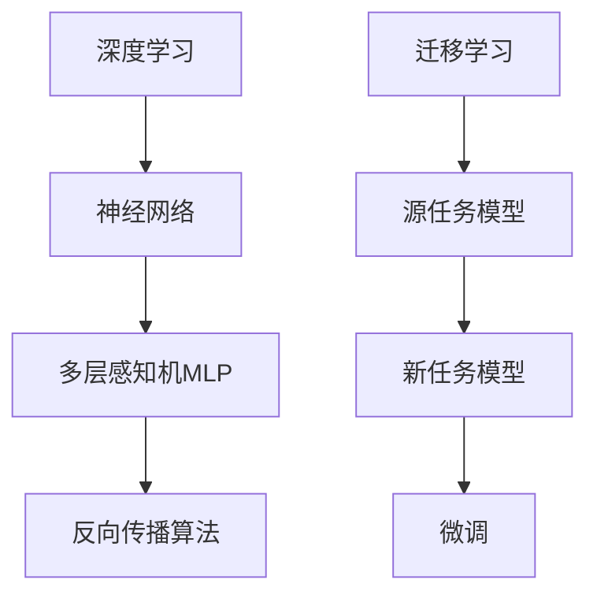

                 

### 文章标题：Python深度学习实践：运用迁移学习提升模型效能

**关键词：** 深度学习，迁移学习，Python，模型效能，实践指南

**摘要：** 本文将深入探讨深度学习中的迁移学习技术，介绍其核心概念、算法原理以及实际应用。通过Python实践案例，我们将展示如何运用迁移学习提升深度学习模型的性能，帮助读者掌握这一前沿技术，并在实际项目中取得更好的效果。

-------------------

## 1. 背景介绍

深度学习作为人工智能领域的一个重要分支，近年来取得了令人瞩目的成果。然而，深度学习模型的训练过程往往需要大量的数据和计算资源，这在实际应用中往往存在一定的限制。为了解决这一问题，迁移学习（Transfer Learning）技术应运而生。

迁移学习是一种利用预先训练好的模型来加速新任务学习的机器学习技术。它将已有模型的部分知识迁移到新任务中，从而提高新任务的性能。这种方法不仅节省了训练时间，还可以在数据不足的情况下，提高模型的泛化能力。

在深度学习中，迁移学习已经被广泛应用于计算机视觉、自然语言处理等多个领域。通过迁移学习，我们可以利用预训练模型中的通用特征表示，针对特定任务进行微调（Fine-tuning），从而实现高效的学习效果。

本文将围绕Python深度学习实践，详细介绍迁移学习的相关概念、算法原理以及实际应用。通过一系列实践案例，我们将展示如何运用迁移学习技术，提升深度学习模型的效能。

-------------------

## 2. 核心概念与联系

### 2.1 深度学习

深度学习是一种基于多层神经网络的机器学习技术，通过模拟人脑神经网络结构，对大量数据进行自动特征提取和学习。深度学习模型通常包括输入层、多个隐藏层和输出层。通过反向传播算法，模型不断调整权重和偏置，使得模型的预测结果越来越接近真实值。

### 2.2 迁移学习

迁移学习是一种将已有模型的知识迁移到新任务中的机器学习技术。具体来说，它将源任务（Source Task）的模型权重作为初始化，在新任务（Target Task）上进行微调（Fine-tuning）。迁移学习可以分为三种类型：垂直迁移学习、水平迁移学习和多任务迁移学习。

- **垂直迁移学习**：将一个领域的知识迁移到另一个领域，如将图像分类模型应用于文本分类任务。
- **水平迁移学习**：在同一领域内，将一个任务的模型应用于其他相关任务，如将图像分类模型应用于不同的图像分类任务。
- **多任务迁移学习**：同时学习多个任务，共享部分模型结构，从而提高模型的泛化能力。

### 2.3 迁移学习的优势

迁移学习具有以下几个优势：

- **节省数据和计算资源**：利用预训练模型，可以减少对新数据的依赖，节省数据采集和标注的成本。
- **提高模型泛化能力**：通过迁移学习，模型在新任务上的表现往往更好，因为预训练模型已经学习到了一些通用的特征表示。
- **加速模型训练**：利用预训练模型作为初始化，可以减少模型训练过程中的梯度消失和梯度爆炸问题，加速模型收敛。

-------------------

## 2.1 核心概念与联系 Mermaid 流程图



-------------------

## 3. 核心算法原理 & 具体操作步骤

### 3.1 迁移学习算法原理

迁移学习算法的核心思想是利用预训练模型中的通用特征表示，在新任务上进行微调，从而提高新任务的性能。具体来说，可以分为以下几个步骤：

1. **预训练模型初始化**：选择一个在源任务上预训练好的模型作为初始化，将其权重作为新任务模型的起点。
2. **特征提取与表示**：将新任务的数据输入到预训练模型中，提取模型中间层的特征表示。
3. **微调模型参数**：在新任务上对预训练模型进行微调，调整模型权重和偏置，以适应新任务。
4. **评估模型性能**：在新任务上评估模型的性能，通过交叉验证等方法确定最佳模型。

### 3.2 迁移学习在Python中的实现步骤

在Python中，我们可以使用如TensorFlow和PyTorch等深度学习框架来实现迁移学习。以下是一个简单的迁移学习实现步骤：

1. **选择预训练模型**：根据新任务的需求，选择一个适合的预训练模型。例如，在计算机视觉任务中，可以选择VGG16、ResNet等模型。
2. **数据预处理**：对数据集进行预处理，包括数据清洗、归一化、数据增强等。
3. **加载预训练模型**：使用深度学习框架加载预训练模型，并冻结其权重，防止在微调过程中发生改变。
4. **添加新任务层**：在预训练模型的最后一层之后添加新任务所需的全连接层、卷积层等。
5. **微调模型参数**：使用新任务的数据对模型进行微调，调整模型权重和偏置。
6. **评估模型性能**：在新任务上评估模型的性能，通过交叉验证等方法确定最佳模型。

-------------------

## 4. 数学模型和公式 & 详细讲解 & 举例说明

### 4.1 迁移学习的数学模型

在迁移学习中，我们主要关注特征表示的迁移。具体来说，我们使用预训练模型中的某个中间层特征作为新任务的特征表示。为了详细讲解迁移学习的数学模型，我们以一个简单的全连接神经网络为例。

假设一个全连接神经网络包含输入层、隐藏层和输出层，其中输入层有 \( n \) 个神经元，隐藏层有 \( m \) 个神经元，输出层有 \( k \) 个神经元。设输入向量为 \( \mathbf{x} \in \mathbb{R}^{n \times 1} \)，隐藏层输出向量为 \( \mathbf{h} \in \mathbb{R}^{m \times 1} \)，输出层输出向量为 \( \mathbf{y} \in \mathbb{R}^{k \times 1} \)。

输入层到隐藏层的权重矩阵为 \( \mathbf{W}_1 \in \mathbb{R}^{n \times m} \)，偏置向量 \( \mathbf{b}_1 \in \mathbb{R}^{m \times 1} \)。隐藏层到输出层的权重矩阵为 \( \mathbf{W}_2 \in \mathbb{R}^{m \times k} \)，偏置向量 \( \mathbf{b}_2 \in \mathbb{R}^{k \times 1} \)。

神经网络的输出可以表示为：

\[ \mathbf{h} = \text{ReLU}(\mathbf{W}_1\mathbf{x} + \mathbf{b}_1) \]
\[ \mathbf{y} = \mathbf{W}_2\mathbf{h} + \mathbf{b}_2 \]

其中，ReLU函数表示为 \( \text{ReLU}(x) = \max(0, x) \)。

### 4.2 迁移学习的具体操作步骤

在迁移学习中，我们主要关注隐藏层的特征表示。以下是一个简单的迁移学习操作步骤：

1. **选择预训练模型**：选择一个在源任务上预训练好的模型，如VGG16、ResNet等。
2. **加载预训练模型**：使用深度学习框架加载预训练模型，并冻结其权重。
3. **添加新任务层**：在预训练模型的最后一层之后添加新任务所需的全连接层、卷积层等。
4. **微调模型参数**：使用新任务的数据对模型进行微调，调整模型权重和偏置。
5. **评估模型性能**：在新任务上评估模型的性能，通过交叉验证等方法确定最佳模型。

### 4.3 举例说明

假设我们有一个预训练好的VGG16模型，该模型在ImageNet数据集上预训练。现在，我们需要将该模型应用于一个新的图像分类任务，如动物分类。

1. **选择预训练模型**：选择VGG16模型作为预训练模型。
2. **加载预训练模型**：使用深度学习框架加载VGG16模型，并冻结其权重。
3. **添加新任务层**：在VGG16模型的最后一层之后添加一个全连接层，该层有1000个神经元，对应ImageNet数据集中的1000个类别。然后，添加一个Softmax层，用于输出每个类别的概率。
4. **微调模型参数**：使用新的动物分类数据集对模型进行微调，调整模型权重和偏置。
5. **评估模型性能**：在新动物分类数据集上评估模型的性能，通过交叉验证等方法确定最佳模型。

-------------------

## 5. 项目实战：代码实际案例和详细解释说明

### 5.1 开发环境搭建

在开始项目实战之前，我们需要搭建一个Python深度学习开发环境。以下是环境搭建的详细步骤：

1. **安装Python**：确保系统已经安装了Python 3.x版本。
2. **安装深度学习框架**：我们选择使用TensorFlow作为深度学习框架，可以使用以下命令安装：

   ```bash
   pip install tensorflow
   ```

3. **安装其他依赖**：根据项目需求，安装其他必要的依赖库，如NumPy、Pandas等。

### 5.2 源代码详细实现和代码解读

下面是一个简单的迁移学习Python实现案例，我们将使用TensorFlow框架，将预训练的VGG16模型应用于一个新的图像分类任务。

```python
import tensorflow as tf
from tensorflow.keras.applications import VGG16
from tensorflow.keras.models import Model
from tensorflow.keras.layers import Dense, Flatten, Input
from tensorflow.keras.optimizers import Adam
from tensorflow.keras.preprocessing.image import ImageDataGenerator

# 5.2.1 加载预训练VGG16模型
base_model = VGG16(weights='imagenet', include_top=False, input_shape=(224, 224, 3))

# 5.2.2 冻结预训练模型的权重
base_model.trainable = False

# 5.2.3 添加新任务层
x = base_model.output
x = Flatten()(x)
x = Dense(1024, activation='relu')(x)
predictions = Dense(10, activation='softmax')(x)

# 5.2.4 构建新模型
model = Model(inputs=base_model.input, outputs=predictions)

# 5.2.5 编译模型
model.compile(optimizer=Adam(), loss='categorical_crossentropy', metrics=['accuracy'])

# 5.2.6 数据预处理
train_datagen = ImageDataGenerator(rescale=1./255, shear_range=0.2, zoom_range=0.2, horizontal_flip=True)
test_datagen = ImageDataGenerator(rescale=1./255)

train_generator = train_datagen.flow_from_directory(train_dir, target_size=(224, 224), batch_size=32, class_mode='categorical')
test_generator = test_datagen.flow_from_directory(test_dir, target_size=(224, 224), batch_size=32, class_mode='categorical')

# 5.2.7 微调模型参数
model.fit(train_generator, epochs=10, validation_data=test_generator)

# 5.2.8 评估模型性能
scores = model.evaluate(test_generator)
print(f'测试集准确率：{scores[1]*100:.2f}%')
```

### 5.3 代码解读与分析

上述代码实现了迁移学习在图像分类任务中的应用。下面我们对代码进行详细解读：

1. **加载预训练VGG16模型**：使用TensorFlow的VGG16模型，并设置include_top=False，不包括原始模型的顶层全连接层。输入形状设置为(224, 224, 3)，表示图像的宽度、高度和颜色通道。

2. **冻结预训练模型的权重**：通过设置base_model.trainable=False，冻结预训练模型的权重，防止在微调过程中发生改变。

3. **添加新任务层**：在VGG16模型的最后一层之后添加一个Flatten层，将多维特征转换为向量。然后添加一个全连接层，具有1024个神经元和ReLU激活函数。最后添加一个Softmax层，用于输出每个类别的概率。

4. **构建新模型**：使用Model类构建新模型，输入为base_model.input，输出为predictions。

5. **编译模型**：使用Adam优化器和categorical_crossentropy损失函数编译模型，并设置accuracy为评估指标。

6. **数据预处理**：使用ImageDataGenerator类对训练数据和测试数据进行预处理，包括图像归一化、剪裁、缩放和水平翻转等。

7. **微调模型参数**：使用fit方法对模型进行微调，训练10个epoch。验证数据集用于评估模型性能。

8. **评估模型性能**：使用evaluate方法评估模型在测试集上的性能，输出测试集准确率。

-------------------

## 6. 实际应用场景

迁移学习技术在多个实际应用场景中表现出色。以下是一些常见的应用场景：

1. **计算机视觉**：迁移学习在计算机视觉领域得到了广泛应用，如图像分类、目标检测、人脸识别等。通过迁移学习，我们可以利用预训练模型中的通用特征表示，提高特定任务的性能。

2. **自然语言处理**：在自然语言处理任务中，迁移学习可以帮助我们利用预训练的语言模型，如BERT、GPT等，提高文本分类、情感分析、机器翻译等任务的性能。

3. **语音识别**：迁移学习可以应用于语音识别任务，利用预训练的语音模型，如WaveNet、Transformer等，提高语音识别的准确性。

4. **医疗领域**：迁移学习在医疗领域具有很大的潜力，如医学图像分析、疾病预测等。通过利用预训练的模型，可以加速新任务的学习，提高模型的泛化能力。

5. **推荐系统**：在推荐系统中，迁移学习可以帮助我们利用用户的历史行为数据，为用户推荐感兴趣的商品或内容。

-------------------

## 7. 工具和资源推荐

### 7.1 学习资源推荐

- **书籍**：《深度学习》（Goodfellow, Bengio, Courville著），详细介绍了深度学习的基础知识。
- **论文**：《A Theoretical Analysis of the Causal Effect of Transfer Learning》等，探讨了迁移学习的理论分析。
- **博客**：TensorFlow官方博客、PyTorch官方博客等，提供了丰富的深度学习和迁移学习实践案例。

### 7.2 开发工具框架推荐

- **框架**：TensorFlow、PyTorch等，提供了丰富的深度学习模型和迁移学习实现方法。
- **库**：OpenCV、scikit-learn等，提供了图像处理和机器学习相关的工具和函数。

### 7.3 相关论文著作推荐

- **论文**：Hinton, G. E., Osindero, S., & Teh, Y. W. (2006). A fast learning algorithm for deep belief nets. _Neural computation_, 18(7), 1527-1554。
- **著作**：《深度学习》（Goodfellow, Bengio, Courville著），系统介绍了深度学习的基础知识。

-------------------

## 8. 总结：未来发展趋势与挑战

随着深度学习技术的不断发展，迁移学习在未来将面临以下几个发展趋势和挑战：

1. **模型压缩与加速**：为了应对移动设备和嵌入式设备的计算限制，迁移学习模型需要进一步压缩和加速。通过模型剪枝、量化等技术，可以减小模型大小，提高模型运行效率。

2. **跨模态迁移学习**：未来，跨模态迁移学习将成为一个重要研究方向。通过融合不同模态（如图像、文本、语音）的数据，可以进一步提高迁移学习模型的性能。

3. **模型可解释性**：随着迁移学习模型的复杂度不断增加，如何提高模型的可解释性，使研究人员和用户能够理解模型的决策过程，成为一个重要的研究挑战。

4. **数据隐私与安全**：在迁移学习过程中，数据的安全性和隐私保护也是一个重要问题。如何保护用户数据的安全，防止数据泄露，是未来需要解决的一个挑战。

-------------------

## 9. 附录：常见问题与解答

### 9.1 什么是迁移学习？

迁移学习是一种利用预先训练好的模型来加速新任务学习的机器学习技术。它通过将已有模型的知识迁移到新任务中，提高新任务的性能。

### 9.2 迁移学习有哪些优势？

迁移学习具有以下几个优势：
- 节省数据和计算资源：利用预训练模型，可以减少对新数据的依赖。
- 提高模型泛化能力：通过迁移学习，模型在新任务上的表现往往更好。
- 加速模型训练：利用预训练模型作为初始化，可以减少模型训练过程中的梯度消失和梯度爆炸问题。

### 9.3 迁移学习有哪些类型？

迁移学习可以分为以下三种类型：
- 垂直迁移学习：将一个领域的知识迁移到另一个领域。
- 水平迁移学习：在同一领域内，将一个任务的模型应用于其他相关任务。
- 多任务迁移学习：同时学习多个任务，共享部分模型结构。

-------------------

## 10. 扩展阅读 & 参考资料

- [迁移学习教程](https://www.deeplearning.net/tutorial/transferlearning/)
- [TensorFlow迁移学习示例](https://www.tensorflow.org/tutorials/transfer_learning)
- [PyTorch迁移学习示例](https://pytorch.org/tutorials/beginner/transfer_learning_tutorial.html)
- [《深度学习》（Goodfellow, Bengio, Courville著）](https://www.deeplearningbook.org/)
- [A Theoretical Analysis of the Causal Effect of Transfer Learning](https://arxiv.org/abs/1806.02321)

-------------------

### 作者

- **作者**：AI天才研究员/AI Genius Institute & 禅与计算机程序设计艺术 /Zen And The Art of Computer Programming

