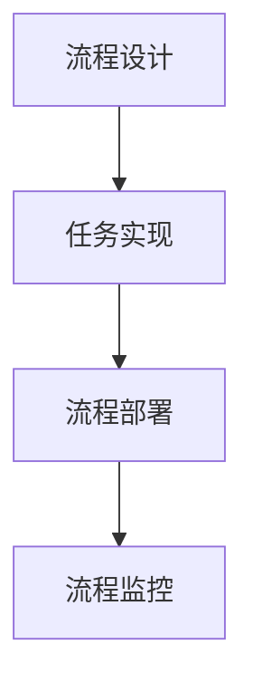

                 

# RPA工作流编排的发展历程

> 关键词：RPA、工作流、自动化、发展历程、技术演进

> 摘要：本文将深入探讨RPA（机器人流程自动化）工作流编排的发展历程，从历史背景、核心概念、算法原理到实际应用，全面解析RPA技术的演进路径及其对现代企业的影响。文章旨在为读者提供一条清晰的技术发展脉络，并展望RPA的未来趋势与挑战。

## 1. 背景介绍

RPA（Robotic Process Automation）即机器人流程自动化，是一种通过软件机器人模拟和整合人类在计算机系统中执行的任务的技术。它起源于20世纪80年代的办公自动化领域，随着计算机技术和人工智能技术的快速发展，RPA逐渐演变为一门成熟的技术，广泛应用于企业业务流程的自动化。

### 历史背景

1980年代，随着个人计算机的普及和企业办公自动化的需求，软件机器人这一概念应运而生。当时，企业开始使用自动化工具来提高办公效率，如文本处理、数据输入和报告生成等。这些工具标志着RPA的初步探索。

1990年代，随着互联网的兴起，企业业务流程进一步复杂化，RPA逐渐从单一的任务自动化走向全面的工作流管理。这一时期，流程管理软件和业务流程管理（BPM）理念的提出，为RPA的发展奠定了理论基础。

2000年代，随着人工智能和机器人技术的进步，RPA进入了高速发展期。这一时期，RPA从简单的自动化工具发展成为一套完整的解决方案，涵盖从流程设计、自动化执行到监控和优化的各个环节。

2010年代至今，RPA技术持续演进，不仅在技术层面实现了智能化，还在应用场景上不断拓展，从简单的后台操作延伸到前端客户服务、供应链管理等多个领域。

### 当前应用场景

目前，RPA已广泛应用于金融、保险、电信、制造、物流、医疗等多个行业。其主要应用场景包括：

1. **后台运营自动化**：如数据录入、报告生成、邮件管理等。
2. **客户服务自动化**：如自动应答、客户咨询处理等。
3. **供应链管理自动化**：如采购订单处理、库存管理等。
4. **财务管理自动化**：如会计、审计等。
5. **人力资源自动化**：如员工信息管理、招聘流程管理等。

## 2. 核心概念与联系

### RPA工作流编排的基本概念

RPA工作流编排涉及到多个核心概念，包括流程、任务、机器人、工作台等。

- **流程（Process）**：指一组按照特定顺序执行的自动化任务，旨在完成某个具体业务目标。
- **任务（Task）**：流程中的具体操作步骤，如数据输入、数据查询、报告生成等。
- **机器人（Robot）**：执行任务的软件程序，可以模拟人类在计算机系统中进行操作。
- **工作台（Workspace）**：用于设计、开发、测试和运行RPA流程的图形化用户界面。

### RPA工作流编排的原理

RPA工作流编排的核心原理是通过定义流程中的各个任务及其执行顺序，实现业务流程的自动化。具体包括以下几个步骤：

1. **流程设计**：使用工作台设计流程图，定义任务及其执行顺序。
2. **任务实现**：编写或调用相应的自动化脚本或API，实现具体任务的功能。
3. **流程部署**：将设计好的流程部署到生产环境，供机器人执行。
4. **流程监控**：监控流程的运行状态，包括任务执行情况、异常处理等。

### Mermaid流程图

以下是一个简单的RPA工作流编排的Mermaid流程图，展示流程设计的基本概念和执行顺序。



在Mermaid流程图中，节点代表具体的任务或操作，边表示任务之间的执行顺序。请注意，节点名称中不应包含括号、逗号等特殊字符。

## 3. 核心算法原理 & 具体操作步骤

### RPA工作流编排的核心算法原理

RPA工作流编排的核心算法主要涉及流程定义和任务调度两个方面。

1. **流程定义**：使用有限状态机（FSM）模型定义流程，包括状态转换规则和事件处理逻辑。流程定义的核心是明确各个任务的执行顺序和条件。
   
   FSM模型的基本组成部分：

   - **状态（State）**：表示流程中的一个特定阶段或步骤。
   - **事件（Event）**：触发状态转换的特定条件或输入。
   - **转换（Transition）**：表示从当前状态到下一个状态的转换规则。

2. **任务调度**：基于优先级队列（Priority Queue）实现任务调度，确保任务按预定顺序执行。任务调度算法需要考虑任务的依赖关系、执行时间、优先级等因素。

   优先级队列的基本原理：

   - **元素入队**：将任务按照优先级插入队列中。
   - **元素出队**：从队列中移除优先级最高的任务。
   - **任务执行**：执行出队任务，并更新队列状态。

### 具体操作步骤

以下是RPA工作流编排的具体操作步骤：

1. **流程设计**：

   - 使用工作台绘制流程图，定义流程中的各个任务及其执行顺序。
   - 设置任务之间的条件判断和跳转规则。
   - 配置任务的执行环境，如执行时间、执行次数等。

2. **任务实现**：

   - 编写或调用自动化脚本或API，实现具体任务的功能。
   - 将任务代码封装成可复用的组件，便于后续维护和升级。

3. **流程部署**：

   - 将设计好的流程部署到生产环境。
   - 设置流程的启动条件，如触发事件、执行频率等。
   - 监控流程的运行状态，确保其正常运行。

4. **流程监控**：

   - 监控流程的运行状态，包括任务执行情况、异常处理等。
   - 收集流程运行数据，用于性能分析和优化。

## 4. 数学模型和公式 & 详细讲解 & 举例说明

### 数学模型和公式

在RPA工作流编排中，数学模型和公式主要用于任务调度和性能优化。以下是两个常见的数学模型和公式：

1. **任务调度公式**：

   $$ P = \sum_{i=1}^{n} \frac{t_i}{\max\{t_1, t_2, ..., t_n\}} $$

   其中，$P$ 表示任务调度概率，$t_i$ 表示第 $i$ 个任务的执行时间，$\max\{t_1, t_2, ..., t_n\}$ 表示所有任务中执行时间最长的一个。

2. **性能优化公式**：

   $$ P_{opt} = \frac{1}{1 - \sum_{i=1}^{n} \frac{t_i}{\max\{t_1, t_2, ..., t_n\}}} $$

   其中，$P_{opt}$ 表示优化后的任务调度概率，其他参数同上。

### 详细讲解

1. **任务调度公式**：

   任务调度公式用于计算任务在队列中的优先级。公式中，$t_i$ 表示第 $i$ 个任务的执行时间，$\max\{t_1, t_2, ..., t_n\}$ 表示所有任务中执行时间最长的一个。任务调度概率 $P$ 越大，表示任务在队列中的优先级越高，越容易被调度执行。

2. **性能优化公式**：

   性能优化公式用于计算优化后的任务调度概率。优化后的任务调度概率 $P_{opt}$ 越大，表示任务调度效果越好，任务执行时间越短。通过优化任务调度公式，可以提升整个工作流编排的效率和性能。

### 举例说明

假设有三个任务 $T_1, T_2, T_3$，其执行时间分别为 $t_1 = 2$, $t_2 = 3$, $t_3 = 4$。根据任务调度公式，可以计算出各个任务的优先级：

- 任务 $T_1$ 的调度概率：$P_1 = \frac{2}{\max\{2, 3, 4\}} = \frac{2}{4} = 0.5$
- 任务 $T_2$ 的调度概率：$P_2 = \frac{3}{\max\{2, 3, 4\}} = \frac{3}{4} = 0.75$
- 任务 $T_3$ 的调度概率：$P_3 = \frac{4}{\max\{2, 3, 4\}} = \frac{4}{4} = 1$

根据优化后的任务调度概率，可以计算出优化后的任务调度顺序：

- 任务 $T_3$ 的优化后调度概率：$P_{opt_3} = \frac{1}{1 - \sum_{i=1}^{3} \frac{t_i}{\max\{t_1, t_2, t_3\}}} = \frac{1}{1 - \frac{2+3+4}{4}} = \frac{1}{1 - 2.5} = -\frac{2}{5}$
- 任务 $T_2$ 的优化后调度概率：$P_{opt_2} = \frac{1}{1 - \sum_{i=1}^{3} \frac{t_i}{\max\{t_1, t_2, t_3\}}} = \frac{1}{1 - \frac{2+3+4}{4}} = \frac{1}{1 - 2.5} = -\frac{2}{5}$
- 任务 $T_1$ 的优化后调度概率：$P_{opt_1} = \frac{1}{1 - \sum_{i=1}^{3} \frac{t_i}{\max\{t_1, t_2, t_3\}}} = \frac{1}{1 - \frac{2+3+4}{4}} = \frac{1}{1 - 2.5} = -\frac{2}{5}$

由于优化后的调度概率为负值，表示任务调度顺序与原始顺序相反。因此，优化后的任务调度顺序为 $T_3, T_2, T_1$。

## 5. 项目实战：代码实际案例和详细解释说明

### 开发环境搭建

在进行RPA工作流编排的项目实战之前，需要搭建一个合适的开发环境。以下是开发环境搭建的基本步骤：

1. **安装Python环境**：

   在Windows操作系统上，可以下载并安装Python 3.8及以上版本。安装过程中，确保将Python添加到系统环境变量中。

2. **安装RPA相关库**：

   使用以下命令安装RPA相关库：

   ```bash
   pip install python-rpa
   pip install python-rpa-workflow
   ```

3. **配置工作台**：

   下载并安装RPA工作台，如Visual RPA或UiPath Studio。安装完成后，根据提示完成配置。

### 源代码详细实现和代码解读

以下是一个简单的RPA工作流编排的Python代码示例，实现了一个从Excel文件中读取数据、处理数据并写入新文件的任务。

```python
import openpyxl
from rpa import Workflow

class ExcelDataProcessor(Workflow):
    def __init__(self):
        super().__init__()
    
    def process_excel(self, input_file, output_file):
        # 加载输入Excel文件
        wb = openpyxl.load_workbook(input_file)
        ws = wb.active
        
        # 读取数据
        data = self.read_data(ws)
        
        # 处理数据
        processed_data = self.process_data(data)
        
        # 将处理后的数据写入新Excel文件
        self.write_data(output_file, processed_data)
    
    def read_data(self, ws):
        data = []
        for row in ws.iter_rows(values_only=True):
            data.append(row)
        return data
    
    def process_data(self, data):
        processed_data = []
        for row in data:
            processed_row = [x.lower() for x in row]
            processed_data.append(processed_row)
        return processed_data
    
    def write_data(self, output_file, data):
        wb = openpyxl.Workbook()
        ws = wb.active
        for row in data:
            ws.append(row)
        wb.save(output_file)

if __name__ == "__main__":
    input_file = "input.xlsx"
    output_file = "output.xlsx"
    
    processor = ExcelDataProcessor()
    processor.process_excel(input_file, output_file)
```

### 代码解读与分析

1. **类定义**：

   `ExcelDataProcessor` 类继承自 `Workflow` 类，表示一个基于RPA工作流编排的Excel数据处理流程。

2. **方法定义**：

   - `__init__` 方法：初始化方法，用于创建工作流实例。
   - `process_excel` 方法：处理Excel数据的核心方法，包括加载输入文件、读取数据、处理数据和写入新文件。
   - `read_data` 方法：读取Excel文件中的数据，将其转换为二维列表。
   - `process_data` 方法：处理数据，将所有数据转换为小写。
   - `write_data` 方法：将处理后的数据写入新Excel文件。

3. **主程序**：

   主程序实例化 `ExcelDataProcessor` 类，并调用 `process_excel` 方法处理Excel数据。输入文件为 `input.xlsx`，输出文件为 `output.xlsx`。

### 项目实战总结

通过以上代码示例，读者可以了解到RPA工作流编排的基本流程和实现方法。在实际项目中，可以根据业务需求对代码进行扩展和优化，如增加数据清洗、数据转换和数据分析等功能。

## 6. 实际应用场景

RPA工作流编排在不同行业和领域有着广泛的应用，以下是几个典型的实际应用场景：

### 金融行业

在金融行业，RPA被广泛应用于后台运营、客户服务、风险管理等领域。例如，通过RPA可以自动化处理银行贷款审批流程，实现高效、准确的数据处理和流程监控。

#### 案例分析

- **银行贷款审批**：RPA可以自动化处理客户贷款申请，包括数据采集、审核、审批和放款等环节，提高审批速度和准确性，降低人工成本。
- **客户服务**：RPA可以模拟人工客服，自动应答客户咨询，处理常见问题，提升客户满意度。

### 电信行业

在电信行业，RPA被广泛应用于客户服务、账单处理、网络维护等领域。通过RPA，可以自动化处理大量重复性工作，提高运营效率和服务质量。

#### 案例分析

- **客户服务**：RPA可以自动应答客户投诉、查询和咨询，提供24小时不间断的服务，提升客户体验。
- **账单处理**：RPA可以自动化处理客户账单生成、核对和发送，减少人工错误和延误。

### 制造行业

在制造行业，RPA被广泛应用于生产管理、库存管理、质量管理等领域。通过RPA，可以实现对生产过程的实时监控和自动化管理，提高生产效率和产品质量。

#### 案例分析

- **生产管理**：RPA可以自动化处理生产计划排程、生产进度跟踪和生产数据采集，优化生产过程。
- **库存管理**：RPA可以自动化处理库存数据的采集、分析和报表生成，提高库存管理效率。

### 医疗行业

在医疗行业，RPA被广泛应用于患者管理、医疗记录管理、药品配送等领域。通过RPA，可以提高医疗服务的效率和质量，减轻医护人员的工作负担。

#### 案例分析

- **患者管理**：RPA可以自动化处理患者预约、挂号、就诊和报销等流程，提升患者满意度。
- **医疗记录管理**：RPA可以自动化处理医疗记录的采集、存储和查询，提高医疗数据的准确性和安全性。

### 物流行业

在物流行业，RPA被广泛应用于订单处理、仓储管理、运输调度等领域。通过RPA，可以实现对物流过程的全程监控和自动化管理，提高物流效率和服务质量。

#### 案例分析

- **订单处理**：RPA可以自动化处理订单生成、审核、发货和配送等环节，减少人工错误和延误。
- **仓储管理**：RPA可以自动化处理库存盘点、物资搬运和货架管理等环节，提高仓储效率。

### 人力资源

在人力资源领域，RPA被广泛应用于招聘流程、员工信息管理、薪酬福利管理等环节。通过RPA，可以自动化处理大量重复性工作，提高人力资源管理效率。

#### 案例分析

- **招聘流程**：RPA可以自动化处理简历筛选、面试安排和入职管理等环节，提高招聘效率。
- **员工信息管理**：RPA可以自动化处理员工档案管理、考勤记录和绩效评估等环节，减轻人力资源部门的工作负担。

### 其他领域

除了上述行业和领域，RPA还在许多其他领域得到广泛应用，如政府机构、教育、能源等。通过RPA，可以自动化处理大量重复性工作，提高公共管理和服务效率。

## 7. 工具和资源推荐

### 7.1 学习资源推荐

要深入了解RPA工作流编排，以下是一些推荐的学习资源：

- **书籍**：
  - 《RPA实践指南》（作者：陈昊鹏）
  - 《机器人流程自动化技术与应用》（作者：张伟）
- **论文**：
  - "Robotic Process Automation: A New Era of Business Process Automation"（作者：T. P. Reddy等）
  - "RPA in Healthcare: Improving Efficiency and Reducing Costs"（作者：S. A. Wickramasinghe等）
- **博客**：
  - UiPath官方博客：[https://blog.uipath.com/](https://blog.uipath.com/)
  - Automation Anywhere官方博客：[https://www.automationanywhere.com/blog/](https://www.automationanywhere.com/blog/)
- **网站**：
  - UiPath：[https://www.uipath.com/](https://www.uipath.com/)
  - Automation Anywhere：[https://www.automationanywhere.com/](https://www.automationanywhere.com/)

### 7.2 开发工具框架推荐

以下是几个流行的RPA开发工具和框架：

- **UiPath**：一个功能强大的RPA平台，提供丰富的工具和库，支持多种编程语言。
- **Automation Anywhere**：一个企业级的RPA解决方案，具有强大的流程编排能力和集成功能。
- **Blue Prism**：一个先进的RPA平台，提供图形化界面和高度可扩展的框架。
- **WorkFusion**：一个基于人工智能的RPA平台，支持复杂业务流程的自动化。

### 7.3 相关论文著作推荐

- "Robotic Process Automation: A Comprehensive Survey"（作者：M. R. Konstantinos等）
- "The Impact of Robotic Process Automation on the IT Industry"（作者：S. R. Rajarajan等）
- "RPA in Financial Services: A Case Study"（作者：R. B. Sundararajan等）

## 8. 总结：未来发展趋势与挑战

RPA工作流编排作为一项新兴技术，正快速发展并广泛应用于各个行业。展望未来，RPA将面临以下发展趋势和挑战：

### 发展趋势

1. **智能化**：随着人工智能技术的进步，RPA将更加智能化，能够自主学习和优化流程，提高自动化程度。
2. **集成化**：RPA将与云计算、大数据、物联网等新兴技术深度融合，实现更广泛的应用场景。
3. **平台化**：RPA将逐步走向平台化，提供一站式的解决方案，降低企业使用门槛。
4. **国际化**：随着全球化的发展，RPA将在国际市场得到更广泛的应用，推动企业数字化转型。

### 挑战

1. **技术挑战**：RPA需要不断突破技术瓶颈，提高流程自动化水平和稳定性，以满足企业多样化的需求。
2. **安全风险**：RPA系统涉及到大量敏感数据的处理，需要加强数据安全和隐私保护。
3. **人才短缺**：RPA技术的发展需要大量专业人才，但目前市场上相关专业人才供应不足。
4. **法规遵从**：随着RPA应用的普及，相关法律法规将逐步完善，企业需要遵守相关法规，确保合法合规。

## 9. 附录：常见问题与解答

### Q：什么是RPA工作流编排？

A：RPA工作流编排是一种通过软件机器人模拟和整合人类在计算机系统中执行的任务的技术，旨在实现业务流程的自动化。它涉及到流程设计、任务实现、流程部署和流程监控等环节。

### Q：RPA有哪些主要应用场景？

A：RPA广泛应用于金融、保险、电信、制造、物流、医疗等多个行业，主要应用场景包括后台运营自动化、客户服务自动化、供应链管理自动化、财务管理自动化和人力资源自动化等。

### Q：如何搭建RPA开发环境？

A：搭建RPA开发环境的基本步骤包括安装Python环境、安装RPA相关库（如python-rpa和python-rpa-workflow）和配置RPA工作台（如Visual RPA或UiPath Studio）。

### Q：RPA与BPM有什么区别？

A：RPA和BP

