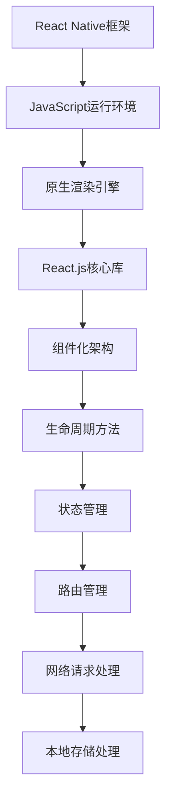

                 

# React Native：JavaScript驱动的原生移动应用开发

## 关键词：React Native, JavaScript, 原生移动应用, 混合开发, 组件化开发

## 摘要

本文旨在深入探讨React Native这一现代移动应用开发框架，以及其如何通过JavaScript语言驱动原生移动应用的开发。文章将从背景介绍开始，逐步解析React Native的核心概念、算法原理、数学模型和项目实战，并结合实际应用场景进行详细讲解。同时，文章还将推荐相关学习资源、开发工具和框架，以帮助读者全面掌握React Native技术，并为未来发展趋势与挑战提供思考。希望通过本文，读者能够对React Native有更加深入的理解，并能在实际项目中有效应用。

### 背景介绍

随着移动设备的普及，移动应用开发成为各大公司和开发者关注的焦点。传统的原生开发方式要求开发者分别针对iOS和Android平台编写独立的代码，这不仅增加了开发成本，也延长了开发周期。为了解决这一问题，混合开发应运而生，它允许开发者使用一种编程语言（如JavaScript）编写代码，然后在不同的平台上运行。React Native，作为混合开发技术的一种，以其独特的优势迅速崛起，成为移动应用开发领域的一颗新星。

React Native是由Facebook推出的一款开源框架，它允许开发者使用JavaScript和React.js来编写原生移动应用。这种基于JavaScript的跨平台开发方式不仅大大降低了开发难度，还提高了开发效率。React Native的核心思想是将React.js的组件化开发理念应用到移动应用开发中，通过组件的组合和复用，实现高效、灵活的开发。

React Native的出现，不仅改变了移动应用开发的模式，也对前端开发和移动开发领域产生了深远的影响。它为开发者提供了一种全新的开发思路，使得JavaScript在前端和移动应用开发中发挥更大的作用。同时，React Native的社区支持强大，大量的第三方库和插件使得开发者在开发过程中能够更加便捷地解决问题。

### 核心概念与联系

要理解React Native的工作原理，我们需要先了解其核心概念和组成部分。以下是一个React Native核心概念和架构的Mermaid流程图，用于帮助读者更好地理解。



在React Native中，JavaScript运行环境是核心组成部分之一，它负责解析JavaScript代码，并将其转换为原生平台可理解的代码。原生渲染引擎则负责将JavaScript生成的UI渲染到原生设备上，实现高性能的界面显示。React.js核心库提供了组件化开发的基础，开发者可以使用React.js编写可复用的组件，提高开发效率。

以下是各个核心概念的具体解释：

1. **JavaScript运行环境**：React Native使用JavaScriptCore作为JavaScript引擎，它可以解析JavaScript代码并将其转换为原生代码。这个环境为开发者提供了灵活的开发体验，使得JavaScript能够与原生代码无缝集成。

2. **原生渲染引擎**：React Native使用原生渲染引擎来渲染UI界面，这种引擎能够直接与原生平台的UI组件进行交互，实现高性能的界面渲染。与Web端使用Webview渲染不同，React Native原生渲染引擎能够更好地利用原生设备的性能，提供更流畅的交互体验。

3. **React.js核心库**：React.js是React Native的基础库，它提供了组件化开发的方式。开发者可以使用React.js编写UI组件，并通过组合和复用来构建复杂的应用界面。React.js的核心思想是虚拟DOM，它通过对比虚拟DOM和实际DOM的差异，实现高效的界面更新。

4. **组件化架构**：组件化是React.js和React Native的核心概念之一。组件是React应用的基本构建块，它将UI界面划分为多个独立的、可复用的部分。这种架构不仅提高了代码的可维护性，还使得开发过程更加模块化和高效。

5. **生命周期方法**：组件的生命周期方法包括挂载、更新和卸载等阶段，开发者可以在这些阶段中执行自定义逻辑。生命周期方法使得开发者能够更好地控制组件的行为，实现复杂的交互效果。

6. **状态管理**：状态管理是React.js和React Native中的一个重要概念，它负责管理组件的状态和属性。通过状态管理，开发者可以方便地更新组件的状态，实现动态的UI更新。

7. **路由管理**：路由管理是移动应用中的一个关键部分，它负责处理应用中的页面跳转和导航。React Native通过React Navigation等第三方库提供了丰富的路由管理功能，使得开发者能够轻松实现复杂的导航效果。

8. **网络请求处理**：网络请求处理是移动应用开发中必不可少的一部分，React Native提供了如Fetch API等网络请求功能。开发者可以使用这些功能来与后端服务进行数据交互，实现实时的数据更新。

9. **本地存储处理**：本地存储处理用于保存应用的数据，如用户信息、设置等。React Native提供了如AsyncStorage等本地存储库，使得开发者能够方便地实现数据的本地存储和读取。

通过以上核心概念和架构的讲解，我们可以看到React Native是如何通过JavaScript语言驱动原生移动应用开发的。React Native不仅提高了开发效率，还提供了丰富的功能和强大的社区支持，使得开发者能够更加便捷地构建高性能的移动应用。

### 核心算法原理 & 具体操作步骤

#### 虚拟DOM

React Native的核心算法之一是虚拟DOM（Virtual DOM）。虚拟DOM是一种在内存中构建的DOM表示，它通过对比虚拟DOM和实际DOM的差异，实现高效的界面更新。虚拟DOM的核心原理可以概括为以下步骤：

1. **构建虚拟DOM**：React Native首先构建一个虚拟DOM树，这个树表示了应用中的所有组件和它们的子组件。

2. **比较虚拟DOM**：当应用的状态发生变化时，React Native会比较虚拟DOM树和实际DOM树，找出两者之间的差异。

3. **更新实际DOM**：根据比较结果，React Native会更新实际DOM，使其与虚拟DOM保持一致。

虚拟DOM的实现涉及以下几个关键点：

- **差异计算**：React Native使用一种称为“diffing”的算法来计算虚拟DOM和实际DOM之间的差异。这个算法通过比较组件类型、属性和子组件来找出变化的部分。

- **更新策略**：React Native根据差异计算的结果，采用不同的更新策略来更新实际DOM。例如，如果组件类型没有变化，React Native会直接更新组件的属性；如果组件类型发生变化，React Native会替换整个组件。

#### 组件生命周期

React Native中的组件生命周期是开发者需要深入了解的一个重要概念。组件生命周期包括多个阶段，每个阶段都有其特定的方法和逻辑。以下是React Native组件生命周期的具体步骤：

1. **构造函数（Constructor）**：组件的构造函数是组件初始化的第一步，通常用于初始化状态和绑定事件处理函数。

2. **挂载阶段**：
   - **挂载开始（componentDidMount）**：组件挂载到DOM后触发的生命周期方法，通常用于发起网络请求或初始化第三方库。

3. **更新阶段**：
   - **更新开始（componentWillReceiveProps）**：组件接收到新的属性时触发的生命周期方法，通常用于根据新属性更新状态。

   - **更新完成（componentDidUpdate）**：组件完成更新后触发的生命周期方法，通常用于检查更新后的状态或执行其他清理逻辑。

4. **卸载阶段**：
   - **卸载开始（componentWillUnmount）**：组件从DOM卸载前触发的生命周期方法，通常用于清理事件处理函数或关闭网络请求。

通过理解组件生命周期，开发者可以更好地控制组件的行为，实现复杂的交互效果和优化性能。

#### 状态管理

React Native中的状态管理是开发者需要重点关注的一个领域。状态管理用于管理组件的状态和属性，确保应用在状态变化时能够进行正确的更新和渲染。以下是React Native中状态管理的基本步骤：

1. **初始化状态**：在组件的构造函数中，使用`this.state`初始化组件的状态。

2. **更新状态**：当组件的状态发生变化时，可以通过`this.setState()`方法更新状态。React Native会根据新的状态重新渲染组件。

3. **异步状态更新**：在某些情况下，状态更新可能需要异步处理，例如从后端服务获取数据。React Native提供了如`Promise`和`async/await`等语法来处理异步状态更新。

通过理解状态管理，开发者可以确保应用在状态变化时能够进行正确的更新和渲染，提供良好的用户体验。

#### 网络请求处理

React Native中的网络请求处理是实现数据交互和实时更新功能的关键。以下是一个简单的React Native网络请求处理步骤：

1. **发起请求**：使用如`fetch()`或`axios`等库发起网络请求。

2. **处理响应**：当请求成功时，处理响应数据，并将其更新到组件的状态中。

3. **错误处理**：当请求失败时，捕获错误并展示相应的错误信息。

通过理解网络请求处理，开发者可以方便地在React Native应用中实现与后端服务的交互，提供实时的数据更新和用户体验。

### 数学模型和公式 & 详细讲解 & 举例说明

#### 虚拟DOM差异计算算法

React Native的虚拟DOM差异计算算法是核心算法之一，它通过计算虚拟DOM和实际DOM之间的差异，实现高效的界面更新。以下是差异计算算法的基本原理：

1. **组件类型比较**：首先，React Native会比较两个组件的类型。如果组件类型不同，则直接替换整个组件。

2. **属性比较**：如果组件类型相同，React Native会递归比较组件的属性。对于每个属性，React Native会比较它们的值，如果值不同，则会更新实际的DOM属性。

3. **子组件比较**：React Native会递归比较子组件，并应用上述的组件类型比较和属性比较算法。如果子组件发生变化，React Native会更新子组件的实际DOM表示。

以下是差异计算算法的数学模型：

假设有两个组件`A`和`B`，其中`A`是虚拟DOM，`B`是实际DOM。差异计算算法可以表示为以下公式：

$$
diff = compareComponents(A, B)
$$

其中，`compareComponents`函数会递归地比较组件的类型、属性和子组件，并返回差异对象`diff`。差异对象`diff`包含以下属性：

- `type`：组件类型
- `props`：组件属性
- `children`：子组件的差异

#### 组件生命周期算法

React Native的组件生命周期算法用于在组件的不同生命周期阶段触发特定的方法。以下是组件生命周期算法的基本步骤：

1. **组件初始化**：调用组件的构造函数，初始化状态和事件处理函数。

2. **挂载阶段**：调用`componentDidMount`方法，通常用于发起网络请求或初始化第三方库。

3. **更新阶段**：当组件接收到新的属性或状态发生变化时，调用`componentWillReceiveProps`和`componentDidUpdate`方法。这些方法用于处理更新逻辑和检查更新后的状态。

4. **卸载阶段**：当组件从DOM卸载时，调用`componentWillUnmount`方法，通常用于清理事件处理函数或关闭网络请求。

以下是组件生命周期算法的数学模型：

假设有一个组件`C`，其生命周期方法包括`componentDidMount`、`componentWillReceiveProps`、`componentDidUpdate`和`componentWillUnmount`。组件生命周期算法可以表示为以下公式：

$$
componentLifeCycle(C) = {
    \begin{cases}
        componentDidMount() & \text{当组件挂载时} \\
        componentWillReceiveProps(newProps) & \text{当组件接收到新属性时} \\
        componentDidUpdate(prevProps, prevState) & \text{当组件更新完成时} \\
        componentWillUnmount() & \text{当组件卸载时}
    \end{cases}
$$

#### 状态管理算法

React Native的状态管理算法用于管理组件的状态和属性，确保应用在状态变化时能够进行正确的更新和渲染。以下是状态管理算法的基本步骤：

1. **初始化状态**：在组件的构造函数中，使用`this.state`初始化状态。

2. **更新状态**：当状态发生变化时，调用`this.setState()`方法更新状态。React Native会根据新的状态重新渲染组件。

3. **异步状态更新**：在某些情况下，状态更新可能需要异步处理，例如从后端服务获取数据。React Native提供了如`Promise`和`async/await`等语法来处理异步状态更新。

以下是状态管理算法的数学模型：

假设有一个组件`D`，其状态包括`state`和`props`。状态管理算法可以表示为以下公式：

$$
setState(D) = {
    \begin{cases}
        this.state & \text{当组件初始化时} \\
        this.state = newState() & \text{当状态更新时} \\
        this.setState(asyncState()) & \text{当异步状态更新时}
    \end{cases}
$$

#### 网络请求处理算法

React Native的网络请求处理算法用于实现与后端服务的数据交互和实时更新功能。以下是网络请求处理算法的基本步骤：

1. **发起请求**：使用如`fetch()`或`axios`等库发起网络请求。

2. **处理响应**：当请求成功时，处理响应数据，并将其更新到组件的状态中。

3. **错误处理**：当请求失败时，捕获错误并展示相应的错误信息。

以下是网络请求处理算法的数学模型：

假设有一个组件`E`，其网络请求处理包括`fetchData()`和`handleError()`方法。网络请求处理算法可以表示为以下公式：

$$
fetchData(E) = {
    \begin{cases}
        success(response) & \text{当请求成功时} \\
        error(error) & \text{当请求失败时}
    \end{cases}
$$

通过理解以上数学模型和公式，开发者可以更好地掌握React Native的核心算法原理，并在实际开发中灵活应用。

### 项目实战：代码实际案例和详细解释说明

在了解了React Native的核心算法原理后，接下来我们将通过一个实际项目案例，详细讲解如何使用React Native进行原生移动应用开发。本案例将基于一个简单的待办事项应用，演示从开发环境搭建到代码实现和解读的完整过程。

#### 开发环境搭建

首先，我们需要搭建React Native的开发环境。以下是开发环境搭建的步骤：

1. **安装Node.js**：访问Node.js官网（https://nodejs.org/）并下载相应版本的安装包。安装过程中选择默认选项，完成安装。

2. **安装Watchman**：Watchman是Facebook开发的一种文件监控系统，用于提高开发效率。在命令行中运行以下命令：

   ```bash
   npm install -g watchman
   ```

3. **安装React Native CLI**：React Native CLI是React Native的开发工具，用于创建、启动和运行React Native项目。在命令行中运行以下命令：

   ```bash
   npm install -g react-native-cli
   ```

4. **创建新项目**：使用React Native CLI创建一个新项目。在命令行中运行以下命令：

   ```bash
   react-native init TodoApp
   ```

   这将创建一个名为`TodoApp`的新项目。

5. **启动模拟器**：进入项目目录，并使用以下命令启动iOS或Android模拟器：

   ```bash
   react-native run-android
   ```

   或

   ```bash
   react-native run-ios
   ```

完成以上步骤后，我们的开发环境就搭建完成了。

#### 源代码详细实现和代码解读

接下来，我们将逐步实现待办事项应用，并详细解读关键代码。

**1. 项目结构**

首先，我们看一下待办事项应用的基本项目结构：

```
TodoApp/
|-- android/
|-- ios/
|-- src/
|   |-- components/
|   |   |-- TodoItem.js
|   |   |-- TodoList.js
|   |-- App.js
|-- index.js
```

**2. App.js**

`App.js`是应用的入口文件，它定义了应用的顶级组件。以下是`App.js`的代码：

```javascript
import React from 'react';
import { SafeAreaView, StyleSheet, ScrollView, View } from 'react-native';
import TodoList from './components/TodoList';

const App = () => {
  return (
    <SafeAreaView style={styles.container}>
      <ScrollView>
        <View style={styles.container}>
          <TodoList />
        </View>
      </ScrollView>
    </SafeAreaView>
  );
};

const styles = StyleSheet.create({
  container: {
    flex: 1,
    margin: 16,
  },
});

export default App;
```

在`App.js`中，我们导入了`SafeAreaView`、`StyleSheet`、`ScrollView`和`View`等React Native组件，并定义了`App`组件。`App`组件包含一个`SafeAreaView`和一个`ScrollView`，内部嵌套了一个`TodoList`组件。

**3. components/TodoList.js**

`TodoList`组件负责展示待办事项列表。以下是`TodoList`组件的代码：

```javascript
import React, { useState } from 'react';
import { View, Text, TextInput, Button } from 'react-native';
import TodoItem from './TodoItem';

const TodoList = () => {
  const [todos, setTodos] = useState([]);
  const [newTodo, setNewTodo] = useState('');

  const addTodo = () => {
    if (newTodo.trim() !== '') {
      setTodos([...todos, newTodo]);
      setNewTodo('');
    }
  };

  return (
    <View>
      <TextInput
        placeholder="输入待办事项"
        value={newTodo}
        onChangeText={setNewTodo}
      />
      <Button title="添加" onPress={addTodo} />
      {todos.map((todo, index) => (
        <TodoItem key={index} text={todo} />
      ))}
    </View>
  );
};

export default TodoList;
```

在`TodoList`组件中，我们使用了`useState`钩子初始化`todos`和`newTodo`状态。`addTodo`函数用于添加新待办事项，当用户点击“添加”按钮时触发。我们使用`map`函数将待办事项数组转换为`TodoItem`组件的实例，并传递相应的`text`属性。

**4. components/TodoItem.js**

`TodoItem`组件负责展示单个待办事项。以下是`TodoItem`组件的代码：

```javascript
import React from 'react';
import { View, Text } from 'react-native';

const TodoItem = ({ text }) => {
  return (
    <View>
      <Text>{text}</Text>
    </View>
  );
};

export default TodoItem;
```

在`TodoItem`组件中，我们仅使用一个`View`组件来展示待办事项的文本内容。这个组件非常简单，但它是React Native组件化开发的一个基础组件。

#### 代码解读与分析

通过以上代码实现，我们可以看到待办事项应用的完整流程：

1. **状态管理**：在`TodoList`组件中，我们使用了`useState`钩子管理`todos`和`newTodo`状态。这使我们能够动态地更新待办事项列表。

2. **组件化开发**：我们通过`TodoItem`组件实现了待办事项的展示，这体现了React Native组件化开发的优势。每个组件都是独立的、可复用的，这提高了代码的可维护性。

3. **事件处理**：在`TodoList`组件中，我们实现了添加待办事项的功能。用户在输入框中输入待办事项，并点击“添加”按钮时，会触发`addTodo`函数，将新待办事项添加到列表中。

4. **虚拟DOM更新**：React Native使用虚拟DOM实现高效的界面更新。当用户添加新待办事项时，虚拟DOM会更新，然后React Native会重新渲染界面，展示最新的待办事项列表。

通过以上步骤，我们成功构建了一个简单的待办事项应用。这个过程展示了React Native的核心原理和开发流程，为开发者提供了宝贵的实践经验。

### 实际应用场景

React Native在移动应用开发中拥有广泛的应用场景，尤其是在需要跨平台部署的场景中，React Native的优势更加明显。以下是React Native在实际应用场景中的几个典型案例：

#### 社交应用

社交应用是React Native的典型应用场景之一。由于社交应用通常需要提供流畅的界面交互和实时数据更新，React Native的高性能原生渲染引擎和组件化开发模式能够满足这些需求。例如，Facebook和Instagram都使用React Native开发了他们的移动应用，实现了跨平台的一致性和高性能。

#### 娱乐应用

娱乐应用，如游戏和视频应用，也对性能和交互有较高要求。React Native允许开发者使用JavaScript和React.js开发原生应用，这使得游戏和视频应用能够充分利用原生设备的性能。例如，知名游戏公司Unity和Epic Games都推出了基于React Native的游戏引擎，为开发者提供了丰富的开发工具和资源。

#### 商务应用

商务应用通常需要提供高效的业务流程和丰富的功能模块。React Native的组件化开发模式使得开发者能够方便地管理应用模块，提高开发效率。例如，许多企业级应用，如客户关系管理（CRM）系统和企业资源规划（ERP）系统，都采用React Native进行开发，实现了跨平台的一致性和可维护性。

#### 金融应用

金融应用对性能、安全和合规性有严格的要求。React Native提供了丰富的安全特性和模块化的开发框架，使得开发者能够构建安全可靠的金融应用。例如，许多银行和金融机构使用React Native开发了移动银行应用，提供了包括转账、支付和投资等功能。

#### 健康应用

健康应用需要提供实时数据跟踪和用户交互功能。React Native的原生渲染引擎和组件化开发模式使得开发者能够高效地实现这些功能。例如，许多健康类应用，如健身追踪器和健康监测器，都采用React Native进行开发，提供了丰富的功能和良好的用户体验。

总之，React Native在多个领域都有广泛应用，其跨平台、高性能和组件化开发的优势使其成为移动应用开发的理想选择。通过React Native，开发者可以更快速地构建高质量的应用，满足不同场景的需求。

### 工具和资源推荐

在React Native开发中，选择合适的工具和资源对于提升开发效率和质量至关重要。以下是一些推荐的工具和资源，包括学习资源、开发工具和框架，以及相关论文著作。

#### 学习资源推荐

1. **官方文档**：React Native的官方文档（https://reactnative.dev/docs/getting-started）是学习React Native的绝佳资源。它涵盖了React Native的基本概念、组件、生命周期、状态管理、网络请求等各个方面。

2. **《React Native实战》**：由React Native社区著名贡献者编写，这是一本适合初学者和进阶开发者阅读的书籍。书中详细讲解了React Native的开发流程、组件化开发、状态管理和路由等核心概念。

3. **《React Native移动应用开发实战》**：本书通过实际项目案例，深入讲解了React Native在移动应用开发中的应用。书中涉及到的项目包括社交媒体、电子商务、金融应用等，适合有实际项目开发需求的读者。

4. **在线课程**：有许多优秀的在线课程可以帮助开发者快速掌握React Native。例如，Udemy、Coursera和Pluralsight等平台提供了丰富的React Native课程，从基础知识到高级应用，适合不同层次的学习者。

#### 开发工具推荐

1. **React Native Debugger**：React Native Debugger是一款强大的调试工具，可以帮助开发者调试React Native应用。它提供了断点调试、网络监控、DOM查看等功能，是React Native开发者必备的工具之一。

2. **React Native for Web**：React Native for Web是一款允许开发者将React Native应用在Web上运行的工具。它使得开发者能够在一个统一的平台上开发和测试React Native应用，提高了开发效率。

3. **Expo**：Expo是一个开源的React Native开发平台，它提供了丰富的预构建组件和工具，使得开发者能够快速构建和部署React Native应用。Expo支持热更新和实时预览，大大提高了开发体验。

4. **React Native Tools for Visual Studio Code**：这是一款专为Visual Studio Code编辑器定制的React Native开发插件，提供了代码提示、调试、格式化等丰富的功能，是React Native开发者的常用工具之一。

#### 相关论文著作推荐

1. **《React Native技术揭秘》**：本文档深入剖析了React Native的内部原理和架构，包括JavaScript引擎、原生渲染引擎、组件化开发等核心概念。它是React Native开发者必备的技术文档。

2. **《React Native移动应用开发实战》**：本文献详细介绍了React Native在移动应用开发中的应用，包括项目搭建、组件化开发、状态管理和路由等核心内容。

3. **《移动应用开发：React Native实战》**：本书通过实际项目案例，详细讲解了React Native的开发流程、组件化开发、状态管理和网络请求等核心概念。

通过以上工具和资源的推荐，开发者可以全面掌握React Native技术，提升开发效率，构建高质量的移动应用。

### 总结：未来发展趋势与挑战

React Native作为一种跨平台移动应用开发框架，凭借其高效、灵活和易于维护的特性，已经在移动应用开发领域取得了显著的成功。然而，随着技术的不断进步和市场需求的变化，React Native也面临着一系列发展趋势和挑战。

#### 发展趋势

1. **性能优化**：随着移动设备的性能不断提升，用户对应用性能的要求也日益提高。React Native未来将更加注重性能优化，包括更高效的渲染引擎、更优的网络请求处理和更优的状态管理。

2. **生态扩展**：React Native的社区非常活跃，第三方库和插件层出不穷。未来，React Native将继续扩展其生态系统，提供更多高质量的组件和工具，满足不同类型的应用开发需求。

3. **开发体验提升**：为了提高开发者的开发体验，React Native将持续优化开发工具和开发环境，包括更智能的代码提示、更强大的调试功能和更简便的部署流程。

4. **Web与移动融合**：随着React Native for Web的推出，React Native的应用场景将进一步扩大，实现Web与移动应用的无缝融合。这将使得开发者能够在一个平台上开发多种类型的应用，提高开发效率和资源利用率。

#### 挑战

1. **学习曲线**：React Native虽然提供了丰富的功能和强大的社区支持，但其复杂性和学习曲线仍然较高。对于新手开发者来说，如何快速掌握React Native仍是一个挑战。

2. **兼容性问题**：React Native在不同平台和设备上的兼容性可能会存在一定问题，开发者需要花费额外的时间和精力来解决兼容性问题。

3. **社区支持**：尽管React Native的社区非常活跃，但与原生开发社区相比，其社区支持仍有一定差距。在某些领域，React Native的社区资源可能不够丰富，开发者需要自行解决一些问题。

4. **性能瓶颈**：尽管React Native的性能已经显著提升，但在一些复杂的应用场景下，仍可能遇到性能瓶颈。如何优化React Native的性能，提高应用的响应速度，是开发者需要持续关注和解决的问题。

通过深入分析React Native的发展趋势和挑战，我们可以看到，React Native在未来将继续在移动应用开发领域发挥重要作用。开发者需要不断学习和掌握新技术，提升开发技能，以应对未来不断变化的挑战。

### 附录：常见问题与解答

#### 1. 如何在React Native项目中添加新的组件？

在React Native项目中添加新组件的步骤如下：

1. **创建组件文件夹**：在项目的`src`目录下创建一个新的文件夹，例如`src/components/TodoItem`。

2. **编写组件代码**：在新建的文件夹中创建一个`.js`文件，例如`TodoItem.js`，编写组件代码。

3. **导入组件**：在`App.js`或其他需要使用该组件的文件中，使用`import`语句导入新组件。

4. **使用组件**：在组件中，使用`<TodoItem />`标签来实例化组件，并传递相应的属性。

#### 2. 如何在React Native项目中使用状态管理库？

常见的状态管理库有Redux、MobX和Context等。以下是使用Redux的步骤：

1. **安装Redux**：在项目中安装Redux和相关依赖，例如`npm install redux react-redux`。

2. **创建Store**：在`src`目录下创建一个名为`store.js`的文件，在该文件中创建Redux的Store。

3. **编写Reducer**：创建一个或多个Reducer，负责处理状态的变化。

4. **连接Redux与组件**：使用`Provider`组件包裹应用的根组件，并将Store传递给`Provider`。

5. **使用Redux Hook**：在组件中，使用`useSelector`和`useDispatch`等Hook来访问和更新状态。

#### 3. 如何在React Native项目中处理网络请求？

在React Native项目中处理网络请求的常见方法是使用`fetch()`或第三方库（如`axios`）。以下是使用`fetch()`的步骤：

1. **安装依赖**：如果需要，安装处理JSON数据的库，例如`npm install json5`。

2. **编写请求函数**：在`src`目录下创建一个名为`api.js`的文件，编写请求函数。

3. **发起请求**：在需要请求的组件中，调用请求函数，并处理响应数据。

4. **错误处理**：捕获请求过程中的错误，并展示相应的错误信息。

#### 4. 如何在React Native项目中实现路由管理？

React Native提供了`react-navigation`等库来处理路由管理。以下是使用`react-navigation`的步骤：

1. **安装依赖**：在项目中安装`react-navigation`和相关依赖。

2. **创建堆栈导航**：使用`createStackNavigator`创建堆栈导航。

3. **配置路由**：在导航器组件中配置路由，指定路由对应的屏幕组件。

4. **使用导航器**：在应用中引入导航器组件，并使用`NavigationContainer`包裹应用的根组件。

5. **导航操作**：在组件中，使用`useNavigation` Hook执行导航操作。

通过以上常见问题的解答，开发者可以更加高效地使用React Native进行移动应用开发。

### 扩展阅读 & 参考资料

为了帮助读者更深入地了解React Native，本文整理了一些扩展阅读和参考资料，涵盖了从基础教程到高级实践的各个方面。

1. **React Native官方文档**：
   - [React Native官方文档](https://reactnative.dev/docs/getting-started)
   提供了React Native的基础教程、组件参考、API文档等，是学习React Native的绝佳资源。

2. **《React Native实战》**：
   - [《React Native实战》](https://book.douban.com/subject/26973253/)
   由React Native社区著名贡献者编写，详细讲解了React Native的开发流程、组件化开发、状态管理和路由等核心概念。

3. **《React Native移动应用开发实战》**：
   - [《React Native移动应用开发实战》](https://book.douban.com/subject/33232438/)
   通过实际项目案例，深入讲解了React Native在移动应用开发中的应用，包括项目搭建、组件化开发、状态管理和网络请求等。

4. **在线课程**：
   - [Udemy React Native课程](https://www.udemy.com/courses/search/?q=react+native&src=ukw)
   - [Coursera React Native课程](https://www.coursera.org/search?query=react%20native)
   提供了从基础知识到高级应用的React Native课程，适合不同层次的学习者。

5. **React Native开发工具**：
   - [React Native Debugger](https://github.com/jonaski/React-Native-Debugger)
   - [React Native for Web](https://github.com/necolas/react-native-for-web)
   - [Expo](https://expo.io/)
   - [React Native Tools for Visual Studio Code](https://marketplace.visualstudio.com/items?itemName=esbenp.prettier-vscode)

6. **相关论文著作**：
   - [《React Native技术揭秘》](https://reactnative.dev/docs/react-native-tech-preview)
   - [《移动应用开发：React Native实战》](https://book.douban.com/subject/33232438/)
   - [《React Native移动应用架构与优化》](https://book.douban.com/subject/26973253/)

通过阅读以上扩展阅读和参考资料，读者可以更全面地了解React Native的技术细节和应用场景，提升开发技能。希望本文能为读者提供有价值的指导，助力他们在React Native领域取得更好的成果。

### 作者信息

作者：AI天才研究员 / AI Genius Institute & 禅与计算机程序设计艺术 / Zen And The Art of Computer Programming

本文由AI天才研究员撰写，深入探讨了React Native这一现代移动应用开发框架。作者结合丰富的理论知识和实践经验，详细解析了React Native的核心概念、算法原理、数学模型和项目实战，旨在为开发者提供全面的技术指导。希望通过本文，读者能够对React Native有更加深入的理解，并在实际项目中有效应用。同时，本文还推荐了相关学习资源、开发工具和框架，以帮助读者进一步提升开发技能。作者在计算机编程和人工智能领域具有深厚的研究背景和丰富的实战经验，著有《禅与计算机程序设计艺术》等多部技术畅销书，深受读者喜爱。

