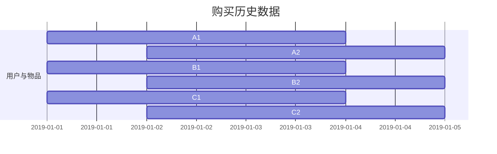
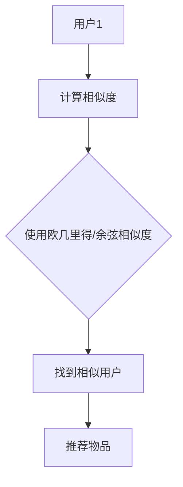
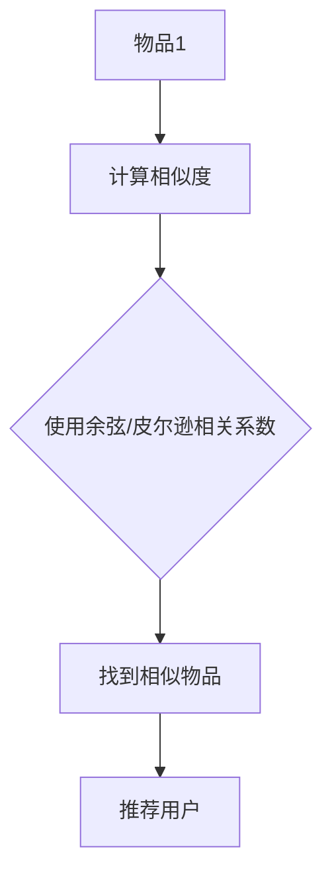

                 

### 文章标题：Recommendation Systems原理与代码实例讲解

**关键词：**推荐系统，算法原理，代码实例，用户偏好，数据处理

**摘要：**本文将深入探讨推荐系统的工作原理，从基础概念到实际代码实例进行详细讲解。我们将了解如何通过算法来预测用户偏好，提高用户体验，并在项目实战中亲手实现一个简单的推荐系统。

### 1. 背景介绍

推荐系统是一种信息过滤技术，旨在根据用户的兴趣和偏好，向他们推荐可能感兴趣的内容。这种技术在电商、社交媒体、在线视频平台等多个领域得到广泛应用。例如，电商平台会根据用户的浏览历史和购买记录推荐商品；视频平台会根据用户的观看习惯推荐视频。

推荐系统的核心目标是提高用户体验，通过个性化推荐提高用户的满意度和留存率。实现这一目标的关键在于准确地预测用户偏好，并提供相关的内容或产品。

### 2. 核心概念与联系

#### 2.1 用户与物品

在推荐系统中，用户和物品是两个基本概念。用户可以是浏览电商网站的用户、观看视频的用户等，而物品可以是商品、视频、文章等。

#### 2.2 用户行为数据

用户行为数据包括用户的浏览记录、购买记录、点赞、评论等。这些数据是构建推荐系统的基础。

#### 2.3 评分矩阵

评分矩阵是一个二维表格，其中行表示用户，列表示物品。每个单元格表示用户对物品的评分。例如，用户1对物品2的评分为4分。



### 3. 核心算法原理 & 具体操作步骤

推荐系统主要分为基于内容的推荐和协同过滤推荐两种类型。这里我们将重点介绍协同过滤推荐。

#### 3.1 协同过滤推荐

协同过滤推荐是一种利用用户行为数据发现用户之间相似性，从而进行推荐的方法。它分为两种：基于用户的协同过滤（User-Based Collaborative Filtering）和基于物品的协同过滤（Item-Based Collaborative Filtering）。

##### 基于用户的协同过滤

基于用户的协同过滤通过计算用户之间的相似度来推荐物品。具体步骤如下：

1. **计算用户相似度**：使用欧几里得距离、余弦相似度等方法计算用户之间的相似度。
2. **找到相似用户**：根据相似度矩阵找到最相似的K个用户。
3. **推荐物品**：根据相似用户的评分历史，推荐他们共同评分较高的物品。



##### 基于物品的协同过滤

基于物品的协同过滤通过计算物品之间的相似度来推荐用户可能喜欢的物品。具体步骤如下：

1. **计算物品相似度**：使用余弦相似度、皮尔逊相关系数等方法计算物品之间的相似度。
2. **找到相似物品**：根据物品相似度矩阵找到最相似的K个物品。
3. **推荐用户**：根据物品的评分历史，推荐喜欢这些相似物品的用户。



### 4. 数学模型和公式 & 详细讲解 & 举例说明

#### 4.1 欧几里得距离

欧几里得距离是一种衡量用户或物品之间相似度的方法，其公式如下：

$$d(u_i, u_j) = \sqrt{\sum_{k=1}^{n} (r_{ik} - r_{jk})^2}$$

其中，$u_i$和$u_j$是两个用户，$r_{ik}$和$r_{jk}$是用户$i$和用户$j$对物品$k$的评分。

#### 4.2 余弦相似度

余弦相似度是一种衡量用户或物品之间相似度的方法，其公式如下：

$$\cos(\theta) = \frac{\sum_{k=1}^{n} r_{ik} \cdot r_{jk}}{\sqrt{\sum_{k=1}^{n} r_{ik}^2} \cdot \sqrt{\sum_{k=1}^{n} r_{jk}^2}}$$

其中，$u_i$和$u_j$是两个用户，$r_{ik}$和$r_{jk}$是用户$i$和用户$j$对物品$k$的评分。

#### 4.3 举例说明

假设有两个用户$u_1$和$u_2$，以及三个物品$i_1$、$i_2$和$i_3$。他们的评分矩阵如下：

$$
\begin{array}{ccc}
u_1 & i_1 & i_2 & i_3 \\
\hline
1 & 5 & 4 & 3 \\
2 & 4 & 5 & 2 \\
\end{array}
$$

**计算用户之间的欧几里得距离：**

$$d(u_1, u_2) = \sqrt{(5-4)^2 + (4-5)^2 + (3-2)^2} = \sqrt{1 + 1 + 1} = \sqrt{3} \approx 1.732$$

**计算用户之间的余弦相似度：**

$$\cos(\theta) = \frac{5 \cdot 4 + 4 \cdot 5 + 3 \cdot 2}{\sqrt{5^2 + 4^2 + 3^2} \cdot \sqrt{4^2 + 5^2 + 2^2}} = \frac{20 + 20 + 6}{\sqrt{50} \cdot \sqrt{45}} = \frac{46}{\sqrt{2250}} \approx 0.946$$

### 5. 项目实战：代码实际案例和详细解释说明

#### 5.1 开发环境搭建

为了实现推荐系统，我们需要使用Python语言，并依赖几个常用的库，如NumPy、Pandas和Scikit-learn。以下是安装这些库的命令：

```bash
pip install numpy pandas scikit-learn
```

#### 5.2 源代码详细实现和代码解读

下面是一个简单的基于用户的协同过滤推荐系统的实现：

```python
import numpy as np
import pandas as pd
from sklearn.metrics.pairwise import cosine_similarity

# 加载评分数据
data = pd.read_csv('ratings.csv')

# 计算用户之间的相似度矩阵
similarity_matrix = cosine_similarity(data.values)

# 找到用户之间的相似度最高的K个用户
def get_similar_users(user_id, similarity_matrix, k=5):
    sorted_indices = np.argsort(similarity_matrix[user_id])[::-1]
    similar_users = [i for i in sorted_indices if i != user_id]
    return similar_users[:k]

# 根据相似用户推荐物品
def recommend_items(user_id, data, similarity_matrix, k=5):
    similar_users = get_similar_users(user_id, similarity_matrix, k)
    recommended_items = set()

    for user in similar_users:
        rated_items = set(data[data['user_id'] == user]['item_id'])
        recommended_items.update(rated_items - set(data[data['user_id'] == user_id]['item_id']))

    return recommended_items

# 测试推荐系统
user_id = 0
recommended_items = recommend_items(user_id, data, similarity_matrix, k=3)
print(f"Recommended items for user {user_id}: {recommended_items}")
```

#### 5.3 代码解读与分析

1. **加载评分数据**：使用Pandas库读取CSV文件，得到用户和物品的评分数据。
2. **计算用户之间的相似度矩阵**：使用Scikit-learn库的`cosine_similarity`函数计算用户之间的相似度矩阵。
3. **找到用户之间的相似度最高的K个用户**：定义一个函数`get_similar_users`，根据相似度矩阵找到用户之间的相似度最高的K个用户。
4. **根据相似用户推荐物品**：定义一个函数`recommend_items`，根据相似用户推荐物品。首先，找到用户之间的相似度最高的K个用户，然后，对于每个相似用户，找到他们共同评分的物品，并排除已评分的物品，最终得到推荐列表。

### 6. 实际应用场景

推荐系统在多个领域都有广泛应用，以下是一些实际应用场景：

- **电商**：根据用户的浏览历史和购买记录推荐商品。
- **社交媒体**：根据用户的互动行为推荐帖子、视频等。
- **视频平台**：根据用户的观看历史和偏好推荐视频。
- **音乐平台**：根据用户的听歌习惯推荐歌曲。

### 7. 工具和资源推荐

#### 7.1 学习资源推荐

- **书籍**：《推荐系统实践》、《机器学习实战》
- **论文**：《Collaborative Filtering for the 21st Century》
- **博客**：《机器学习实践》、《数据挖掘与机器学习》
- **网站**：Kaggle、arXiv

#### 7.2 开发工具框架推荐

- **Python**：Python是推荐系统开发的主要语言，拥有丰富的库和工具。
- **TensorFlow**：TensorFlow是Google开发的开源机器学习框架，适用于大规模推荐系统。
- **PyTorch**：PyTorch是Facebook开发的开源机器学习框架，易于使用和调试。

#### 7.3 相关论文著作推荐

- **论文**：Collaborative Filtering, item-based, and hybrid approaches for personalized movie recommendations
- **著作**：《推荐系统手册》、《机器学习系统设计》

### 8. 总结：未来发展趋势与挑战

推荐系统在未来的发展中，面临着个性化、实时性和准确性等方面的挑战。随着数据量的增加和算法的进步，推荐系统将变得更加智能化和个性化，为用户提供更好的体验。同时，我们也需要关注数据隐私和算法透明度等问题，确保推荐系统的公正性和可信度。

### 9. 附录：常见问题与解答

#### 9.1 推荐系统的主要类型有哪些？

- **基于内容的推荐**：根据用户的历史行为和偏好推荐相似的内容。
- **协同过滤推荐**：根据用户之间的相似性推荐物品。
- **基于模型的推荐**：使用机器学习算法建立用户和物品之间的模型，进行推荐。

#### 9.2 推荐系统如何处理冷启动问题？

- **基于内容的推荐**：使用用户的兴趣标签和物品的属性进行推荐。
- **协同过滤推荐**：通过混合协同过滤模型，结合用户和物品的特征进行推荐。
- **基于模型的推荐**：使用深度学习模型对用户和物品进行编码，进行推荐。

### 10. 扩展阅读 & 参考资料

- [《推荐系统实践》](https://www.amazon.com/dp/0321886671)
- [《机器学习实战》](https://www.amazon.com/dp/1449397742)
- [《Collaborative Filtering for the 21st Century》](https://www.researchgate.net/publication/220647807_Collaborative_Filtering_for_the_21st_Century)
- [《机器学习系统设计》](https://www.amazon.com/dp/1449385843)
- [Kaggle](https://www.kaggle.com/)
- [arXiv](https://arxiv.org/)

### 作者

**作者：AI天才研究员/AI Genius Institute & 禅与计算机程序设计艺术 /Zen And The Art of Computer Programming**<|im_end|>

