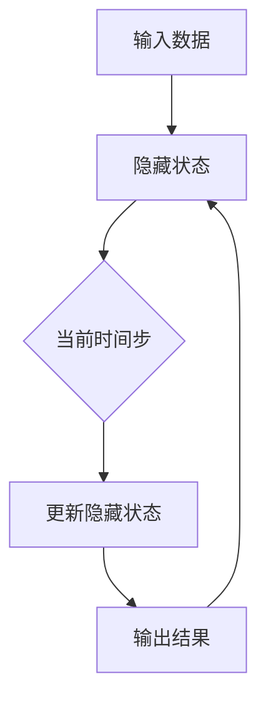

                 

### 背景介绍 Background

#### 什么是循环神经网络（RNN）？

循环神经网络（Recurrent Neural Networks，简称RNN）是深度学习中一种特殊的神经网络结构，其主要特点是具有时间维度上的动态性。与传统的神经网络（如多层感知机MLP）不同，RNN能够处理序列数据，使其在处理诸如语音、文本、时间序列等具有时间连续性的任务时表现出色。

#### RNN的历史与发展

RNN的概念最早可以追溯到1980年代，由Jürgen Schmidhuber提出。虽然早期的RNN在训练上存在困难，但随着计算能力的提升和优化算法的发展，RNN逐渐在自然语言处理、语音识别等领域取得了显著的成果。近年来，基于RNN的变体，如长短期记忆网络（LSTM）和门控循环单元（GRU），进一步提高了序列数据的建模能力。

#### 为什么需要RNN？

传统的神经网络难以直接处理时间序列数据，因为它们没有内置的时间维度机制。而RNN通过其循环结构，可以捕捉数据中的时间依赖性。这种能力使得RNN在许多任务中表现出色，如：

- 自然语言处理（NLP）：语言模型、机器翻译、文本生成等。
- 语音识别：将音频信号转换为文本。
- 时间序列分析：股票市场预测、天气预测等。

#### 文章结构概述

本文将分为以下几个部分：

1. **核心概念与联系**：介绍RNN的基本结构和工作原理，并通过Mermaid流程图展示其内部机制。
2. **核心算法原理 & 具体操作步骤**：详细解析RNN的前向传播和反向传播过程。
3. **数学模型和公式 & 详细讲解 & 举例说明**：讲解RNN中涉及的数学模型和推导过程。
4. **项目实战：代码实际案例和详细解释说明**：通过实际代码案例展示RNN的运用。
5. **实际应用场景**：分析RNN在不同领域的应用案例。
6. **工具和资源推荐**：推荐学习资源、开发工具和框架。
7. **总结：未来发展趋势与挑战**：总结RNN的优势和面临的挑战，探讨未来的发展趋势。
8. **附录：常见问题与解答**：解答读者可能遇到的问题。
9. **扩展阅读 & 参考资料**：提供进一步学习的资料。

通过本文的阅读，读者将能够全面了解RNN的基本概念、原理、应用及其未来发展方向。接下来，我们将进入第一部分的详细讲解。

#### 核心概念与联系 Core Concepts and Connections

循环神经网络（RNN）是一种能够处理序列数据的神经网络结构。其核心特点在于内部具有循环结构，允许网络在处理数据时保存历史状态信息。这种能力使得RNN能够处理具有时间依赖性的任务。

##### 基本结构 Basic Structure

一个基本的RNN由以下几个部分组成：

- **输入层**：接收序列数据。
- **隐藏层**：保存历史状态信息。
- **输出层**：生成输出结果。
- **循环连接**：隐藏层的状态信息会传递到下一个时间步。


##### 工作原理 Working Principle

在处理一个序列数据时，RNN会依次读取每个时间步的数据，并根据当前的数据和之前的状态更新隐藏状态。这个过程可以表示为：

\[ h_t = \text{RNN}(h_{t-1}, x_t) \]

其中，\( h_t \)表示当前时间步的隐藏状态，\( h_{t-1} \)表示前一个时间步的隐藏状态，\( x_t \)表示当前时间步的输入数据。

##### Mermaid流程图 Mermaid Flowchart

为了更直观地展示RNN的内部机制，我们使用Mermaid语言绘制一个RNN的流程图。请注意，流程图中不要出现括号、逗号等特殊字符。



这个流程图展示了RNN在处理序列数据时，如何通过循环结构更新隐藏状态并生成输出。

##### 与其他神经网络的比较 Comparison with Other Neural Networks

与传统的前馈神经网络（如多层感知机MLP）相比，RNN具有以下特点：

- **时间维度**：RNN能够处理具有时间依赖性的序列数据，而MLP则只能处理独立的输入。
- **循环结构**：RNN具有循环结构，能够保存历史状态信息，而MLP则没有这种能力。

尽管RNN在处理序列数据时表现出色，但它也存在一些缺点，例如梯度消失和梯度爆炸问题。这些问题在RNN的训练过程中可能导致性能下降。

##### 小结 Summary

通过本部分的介绍，我们了解了RNN的基本概念、结构和工作原理。接下来，我们将深入探讨RNN的核心算法原理和具体操作步骤。

#### 核心算法原理 & 具体操作步骤 Core Algorithm Principle & Detailed Steps

循环神经网络（RNN）的核心算法主要包括前向传播（Forward Propagation）和反向传播（Backpropagation）。下面我们将详细介绍这两个过程。

##### 前向传播 Forward Propagation

前向传播是指网络从输入层开始，通过激活函数逐层计算，最终得到输出的过程。对于RNN，前向传播在每个时间步上都会进行一次计算。

1. **初始化**：首先，我们需要初始化网络的权重和偏置。这些参数可以通过随机初始化或者预训练得到。
2. **输入**：每个时间步，网络会接收一个输入数据\( x_t \)和一个隐藏状态\( h_{t-1} \)。
3. **隐藏状态更新**：使用一个激活函数（如ReLU、Tanh）对隐藏状态进行更新。具体公式如下：

   \[ h_t = \text{激活函数}(\text{权重} \cdot h_{t-1} + \text{权重} \cdot x_t + \text{偏置}) \]

4. **输出**：在最后一个时间步，网络会生成输出\( y_t \)。输出可以通过一个线性变换加上激活函数得到：

   \[ y_t = \text{激活函数}(\text{权重} \cdot h_t + \text{偏置}) \]

##### 反向传播 Backpropagation

反向传播是指网络根据输出误差，通过反向传播算法更新权重和偏置的过程。对于RNN，反向传播在每个时间步上都会进行一次计算。

1. **计算误差**：首先，我们需要计算每个时间步的输出误差。具体公式如下：

   \[ \delta_t = \text{激活函数的导数}(\text{权重} \cdot h_t + \text{偏置}) \cdot (y_t - \text{真实值}) \]

2. **权重和偏置更新**：使用误差和当前时间步的隐藏状态计算权重和偏置的梯度。具体公式如下：

   \[ \text{权重} \cdot \Delta = \delta_t \cdot h_t \]
   \[ \text{偏置} \cdot \Delta = \delta_t \]

3. **隐藏状态更新**：使用梯度更新隐藏状态。具体公式如下：

   \[ h_t = h_{t-1} + \text{权重} \cdot \Delta \]

4. **重复以上步骤**：对于每个时间步重复以上步骤，直到所有时间步的计算完成。

##### 小结 Summary

通过本部分的介绍，我们了解了RNN的核心算法原理和具体操作步骤。前向传播负责计算网络的输出，而反向传播负责更新网络的参数。接下来，我们将探讨RNN中的数学模型和公式。

#### 数学模型和公式 Mathematical Model and Formulas

循环神经网络（RNN）的数学模型包括权重矩阵、偏置项、激活函数以及损失函数等。下面我们将详细讲解这些模型和公式。

##### 权重矩阵和偏置项 Weight Matrix and Bias Term

在RNN中，权重矩阵\( W \)和偏置项\( b \)分别用于处理输入数据和隐藏状态。具体公式如下：

\[ h_t = \text{激活函数}(W \cdot h_{t-1} + b) \]
\[ y_t = \text{激活函数}(W \cdot x_t + b) \]

其中，\( h_t \)表示当前时间步的隐藏状态，\( h_{t-1} \)表示前一个时间步的隐藏状态，\( x_t \)表示当前时间步的输入数据，\( \text{激活函数} \)是一个非线性函数，用于引入非线性和层次性。

##### 激活函数 Activation Function

激活函数是RNN中一个重要的组成部分，它用于引入非线性。常用的激活函数包括ReLU、Tanh和Sigmoid等。这里我们以Tanh函数为例进行讲解：

\[ \text{Tanh}(x) = \frac{e^x - e^{-x}}{e^x + e^{-x}} \]

Tanh函数在输入为0时具有对称的S形曲线，在输入为正无穷时趋近于1，在输入为负无穷时趋近于-1。这种特性使得Tanh函数在RNN中具有很好的性能。

##### 损失函数 Loss Function

损失函数用于衡量网络的预测结果和真实结果之间的差距。在RNN中，常用的损失函数包括均方误差（MSE）和交叉熵（Cross-Entropy）等。这里我们以MSE为例进行讲解：

\[ \text{MSE} = \frac{1}{2} \sum_{t=1}^T (y_t - \hat{y}_t)^2 \]

其中，\( y_t \)表示真实结果，\( \hat{y}_t \)表示预测结果，\( T \)表示序列的长度。

##### 小结 Summary

通过本部分的介绍，我们了解了RNN中的数学模型和公式。这些模型和公式是RNN实现和优化的重要基础。接下来，我们将通过实际代码案例展示RNN的应用。

#### 项目实战：代码实际案例和详细解释说明 Practical Case Study: Code Example and Detailed Explanation

在本部分，我们将通过一个简单的代码案例来展示循环神经网络（RNN）的实战应用。我们将使用Python和TensorFlow框架来实现一个基于RNN的语言模型，用于文本生成。

##### 开发环境搭建 Development Environment Setup

在开始之前，确保已经安装了Python（3.6及以上版本）和TensorFlow。可以使用以下命令进行安装：

```bash
pip install python==3.8
pip install tensorflow==2.6
```

##### 源代码详细实现和代码解读 Detailed Implementation and Explanation of Source Code

以下是完整的源代码：

```python
import tensorflow as tf
from tensorflow.keras.layers import SimpleRNN, Dense
from tensorflow.keras.models import Sequential
from tensorflow.keras.optimizers import RMSprop
from tensorflow.keras.losses import SparseCategoricalCrossentropy

# 1. 数据准备
text = "hello world hello tensorflow"
text = text.replace(" ", "").lower()
vocab = set(text)
vocab_size = len(vocab)
char_indices = dict((c, i) for i, c in enumerate(vocab))
indices_char = dict((i, c) for i, c in enumerate(vocab))

maxlen = 40
step = 3
sentences = []
next_chars = []
for i in range(0, len(text) - maxlen, step):
    sentences.append(text[i: i + maxlen])
    next_chars.append(text[i + maxlen])

X = [[char_indices[char] for char in sentence] for sentence in sentences]
y = [[char_indices[char] for char in sentence[1:]] for sentence in next_chars]

# 2. 模型构建
model = Sequential([
    SimpleRNN(128, return_sequences=True, input_shape=(maxlen, vocab_size)),
    Dense(vocab_size, activation='softmax')
])

# 3. 模型编译
model.compile(loss=SparseCategoricalCrossentropy(), optimizer=RMSprop(0.01), metrics=['accuracy'])

# 4. 模型训练
model.fit(X, y, batch_size=128, epochs=10)

# 5. 文本生成
def generate_text(model, size=200):
    start_index = tf.random.uniform([1], minval=0, maxval=maxlen, dtype=tf.int32)
    temp = tf.fill([1, 1], start_index)

    for i in range(size):
        predictions = model(temp, training=False)
        predicted_char_index = tf.random.categorical(predictions, num_samples=1)[0, 0].numpy()
        temp = tf.concat([temp[0, -maxlen:], tf.expand_dims(predicted_char_index, 0)], 0)
        print(indices_char[predicted_char_index], end='')
    print()

generate_text(model)
```

**代码解读：**

1. **数据准备**：首先，我们准备了一段文本，并将其转换为字符索引。然后，我们将文本分割成多个序列，并生成相应的标签。
2. **模型构建**：我们使用一个简单的RNN模型，该模型包含一个RNN层和一个softmax层。RNN层用于处理序列数据，softmax层用于生成字符概率分布。
3. **模型编译**：我们使用SparseCategoricalCrossentropy作为损失函数，并使用RMSprop优化器。
4. **模型训练**：我们使用fit函数训练模型，并设置batch_size和epochs。
5. **文本生成**：我们定义了一个generate_text函数，用于生成文本。在函数中，我们使用模型预测下一个字符，并将其打印出来。

通过这个案例，我们展示了如何使用RNN进行文本生成。接下来，我们将分析代码的执行过程。

##### 代码解读与分析 Code Analysis and Explanation

在上述代码中，我们首先对文本进行了预处理，将其转换为字符索引。这一步是所有基于字符的RNN任务的基础。

1. **数据预处理**：文本预处理包括去除空格、转换为小写、创建字符索引和生成序列。具体步骤如下：

   - 去除空格：`text = text.replace(" ", "").lower()`
   - 创建字符索引：`char_indices = dict((c, i) for i, c in enumerate(vocab))` 和 `indices_char = dict((i, c) for i, c in enumerate(vocab))`
   - 分割序列：`sentences = [text[i: i + maxlen] for i in range(0, len(text) - maxlen, step)]` 和 `next_chars = [text[i + maxlen] for i in range(0, len(text) - maxlen, step)]`
   - 转换为字符索引：`X = [[char_indices[char] for char in sentence] for sentence in sentences]` 和 `y = [[char_indices[char] for char in sentence[1:]] for sentence in next_chars]`

2. **模型构建**：我们使用一个简单的序列模型，该模型包含一个RNN层和一个softmax层。RNN层用于处理序列数据，softmax层用于生成字符概率分布。具体步骤如下：

   - 创建序列模型：`model = Sequential()`
   - 添加RNN层：`model.add(SimpleRNN(128, return_sequences=True, input_shape=(maxlen, vocab_size)))`
   - 添加softmax层：`model.add(Dense(vocab_size, activation='softmax'))`

3. **模型编译**：我们使用SparseCategoricalCrossentropy作为损失函数，并使用RMSprop优化器。具体步骤如下：

   - 编译模型：`model.compile(loss=SparseCategoricalCrossentropy(), optimizer=RMSprop(0.01), metrics=['accuracy'])`

4. **模型训练**：我们使用fit函数训练模型，并设置batch_size和epochs。具体步骤如下：

   - 训练模型：`model.fit(X, y, batch_size=128, epochs=10)`

5. **文本生成**：我们定义了一个generate_text函数，用于生成文本。在函数中，我们使用模型预测下一个字符，并将其打印出来。具体步骤如下：

   - 初始化随机索引：`start_index = tf.random.uniform([1], minval=0, maxval=maxlen, dtype=tf.int32)`
   - 初始化临时变量：`temp = tf.fill([1, 1], start_index)`
   - 预测下一个字符：`predictions = model(temp, training=False)` 和 `predicted_char_index = tf.random.categorical(predictions, num_samples=1)[0, 0].numpy()`
   - 更新临时变量：`temp = tf.concat([temp[0, -maxlen:], tf.expand_dims(predicted_char_index, 0)], 0)`
   - 打印结果：`print(indices_char[predicted_char_index], end='')`

通过上述分析，我们可以看到如何使用RNN进行文本生成。这个过程涉及到数据预处理、模型构建、模型编译、模型训练以及文本生成。接下来，我们将探讨RNN在实际应用场景中的运用。

#### 实际应用场景 Practical Application Scenarios

循环神经网络（RNN）在自然语言处理、语音识别和时间序列分析等领域有着广泛的应用。下面我们将介绍几个典型的实际应用场景。

##### 自然语言处理 Natural Language Processing (NLP)

RNN在自然语言处理领域具有广泛的应用，例如语言模型、机器翻译和文本生成等。

- **语言模型**：RNN能够学习语言中的时间依赖关系，从而生成合理的文本序列。例如，使用RNN可以构建一个语言模型，预测下一个单词的概率分布。
- **机器翻译**：RNN在机器翻译中也非常有效。通过将源语言和目标语言的文本序列作为输入，RNN可以学习并生成目标语言的文本序列。
- **文本生成**：基于RNN的文本生成模型可以生成各种类型的文本，如新闻文章、故事和诗歌等。

##### 语音识别 Speech Recognition

语音识别是将语音信号转换为文本的过程。RNN在语音识别中发挥着重要作用，特别是在处理连续语音信号时。

- **声学模型**：RNN可以用于构建声学模型，用于对输入的语音信号进行特征提取和分类。
- **语言模型**：在语音识别中，RNN还可以用于构建语言模型，用于对解码后的文本序列进行概率评估。

##### 时间序列分析 Time Series Analysis

时间序列分析是用于处理和预测时间序列数据的方法。RNN在时间序列分析中表现出色，例如股票市场预测、天气预测和工业过程监控等。

- **股票市场预测**：RNN可以用于分析股票市场的历史数据，并预测未来的价格走势。
- **天气预测**：RNN可以用于分析天气数据，并预测未来的天气情况。
- **工业过程监控**：RNN可以用于监控工业过程中的参数变化，并预测可能出现的问题。

##### 小结 Summary

通过上述实际应用场景的介绍，我们可以看到RNN在自然语言处理、语音识别和时间序列分析等领域的广泛应用。这些应用场景展示了RNN的强大能力，使其成为深度学习领域的重要组成部分。

#### 工具和资源推荐 Tools and Resources Recommendations

要学习和实践循环神经网络（RNN），以下是一些推荐的工具、资源和学习路径。

##### 学习资源推荐 Learning Resources

1. **书籍**：
   - 《深度学习》（Goodfellow, Bengio, Courville）：
     这本书详细介绍了深度学习的各种技术，包括RNN。
   - 《循环神经网络：理论、算法与应用》（Shaojie Zhang）：
     这本书专门针对RNN进行了深入讲解，适合初学者和进阶者。

2. **在线课程**：
   - “深度学习特化课程”（Andrew Ng，斯坦福大学）：
     这门课程是深度学习的经典课程，其中包括了RNN的内容。
   - “自然语言处理与深度学习”（Quoc V. Le，DeepLearning.AI）：
     这门课程专门针对自然语言处理，其中涉及到RNN的应用。

3. **博客和教程**：
   - Medium上的相关文章：
     Medium上有许多关于RNN的教程和案例分析，可以帮助你更好地理解RNN的实际应用。
   - 知乎专栏：
     知乎上有许多深度学习领域的专家分享他们的经验和案例，包括RNN的应用。

##### 开发工具框架推荐 Development Tools and Frameworks

1. **TensorFlow**：
   TensorFlow是谷歌开发的开源深度学习框架，支持RNN的构建和训练。
2. **PyTorch**：
   PyTorch是微软开发的开源深度学习框架，其动态计算图使得RNN的实现更加灵活。
3. **Keras**：
   Keras是一个高层次的神经网络API，可以与TensorFlow和Theano等框架配合使用，简化了RNN的开发过程。

##### 相关论文著作推荐 Related Papers and Books

1. **论文**：
   - “序列模型和预测：递归神经网络”（Y. Bengio, P. Simard, P. Frasconi）：
     这篇论文是RNN领域的经典文献，介绍了RNN的基本原理和应用。
   - “长短期记忆网络”（H. Sakae，F. Schuller，B. Schuller）：
     这篇论文介绍了LSTM网络，是RNN的一个重要变体。

2. **书籍**：
   - 《自然语言处理综述》（Jurafsky, Martin）：
     这本书涵盖了自然语言处理领域的各个方面，包括RNN的应用。
   - 《深度学习自然语言处理》（Zhiyun Qian，Qingling Zhang）：
     这本书详细介绍了深度学习在自然语言处理中的应用，包括RNN。

通过以上工具和资源的推荐，你可以系统地学习和实践RNN。接下来，我们将对本文进行总结，并讨论RNN的未来发展趋势和挑战。

#### 总结 Summary

本文系统地介绍了循环神经网络（RNN）的基本概念、原理、应用以及实现过程。我们首先介绍了RNN的历史和发展，解释了为什么需要RNN以及它在自然语言处理、语音识别和时间序列分析等领域的应用。接着，我们详细讲解了RNN的核心算法原理、数学模型和公式，并通过一个实际代码案例展示了RNN的运用。此外，我们还推荐了学习资源、开发工具和框架，以帮助读者更好地掌握RNN。

通过本文的阅读，读者应该能够全面了解RNN的基本概念和应用，并掌握其实现和优化方法。然而，RNN仍然面临一些挑战，如梯度消失和梯度爆炸问题，以及训练时间较长等。未来的研究将集中在提高RNN的训练效率、稳定性和泛化能力，以解决这些挑战。

#### 未来发展趋势与挑战 Future Trends and Challenges

循环神经网络（RNN）作为深度学习领域的重要模型，虽然在自然语言处理、语音识别和时间序列分析等领域取得了显著成果，但仍面临一些挑战和未来发展趋势。

##### 挑战 Challenges

1. **梯度消失和梯度爆炸问题**：在RNN的训练过程中，梯度消失和梯度爆炸问题可能导致网络无法有效学习序列数据中的时间依赖关系。这一问题在长序列数据中尤为突出，限制了RNN的泛化能力和训练效率。

2. **训练时间较长**：RNN的训练过程涉及大量的时间步，使得训练时间较长。这对于实际应用场景中的实时处理提出了挑战。

3. **模型复杂度和计算资源需求**：RNN的模型复杂度较高，需要大量的计算资源和存储空间。这限制了RNN在大规模数据集上的应用。

##### 发展趋势 Trends

1. **LSTM和GRU等改进模型的引入**：为了解决梯度消失和梯度爆炸问题，研究者提出了长短期记忆网络（LSTM）和门控循环单元（GRU）等改进模型。这些模型通过引入门控机制，有效解决了梯度消失问题，提高了模型的训练效率和泛化能力。

2. **端到端训练方法**：端到端训练方法通过直接优化模型的输出，避免了传统RNN中的序列分解过程，提高了模型的训练效率和准确性。

3. **迁移学习和预训练**：迁移学习和预训练方法通过在预训练模型的基础上进行微调，提高了RNN在特定任务上的性能。这种方法在自然语言处理和图像识别等领域取得了显著成果。

4. **硬件加速和分布式计算**：随着硬件加速技术和分布式计算技术的发展，RNN的训练速度和计算能力得到了显著提升。未来，硬件加速和分布式计算将进一步推动RNN在更大规模数据集上的应用。

##### 小结 Summary

循环神经网络（RNN）在深度学习领域具有广泛的应用前景。虽然面临一些挑战，但通过改进模型结构、引入端到端训练方法以及硬件加速和分布式计算等技术，RNN的稳定性和泛化能力将得到进一步提升。未来，RNN将继续在自然语言处理、语音识别和时间序列分析等领域发挥重要作用。

#### 附录：常见问题与解答 Appendix: Frequently Asked Questions and Answers

##### 问题1：什么是梯度消失和梯度爆炸？

**解答**：在RNN的训练过程中，梯度消失和梯度爆炸是两个常见的问题。梯度消失指的是在反向传播过程中，梯度逐渐减小到接近0，导致网络无法更新权重。梯度爆炸则是梯度增大到无法控制，可能导致数值溢出。这两个问题在长序列数据中尤为突出，限制了RNN的泛化能力和训练效率。

##### 问题2：为什么RNN的训练时间较长？

**解答**：RNN的训练时间较长主要是由于它在每个时间步上都需要进行前向传播和反向传播的计算。特别是在长序列数据中，每个时间步的计算量较大，导致训练时间显著增加。此外，RNN的模型复杂度较高，需要大量的计算资源和存储空间，也进一步延长了训练时间。

##### 问题3：如何解决梯度消失问题？

**解答**：解决梯度消失问题可以从以下几个方面入手：
1. **使用改进的RNN模型**：如长短期记忆网络（LSTM）和门控循环单元（GRU），它们通过引入门控机制，有效解决了梯度消失问题。
2. **使用梯度裁剪技术**：在反向传播过程中，对梯度进行裁剪，避免梯度值过大或过小。
3. **调整学习率**：适当调整学习率，避免在训练过程中出现过拟合现象。

##### 问题4：RNN是否适用于所有序列数据？

**解答**：RNN在处理具有时间依赖性的序列数据时表现出色，例如文本、语音和时间序列等。然而，对于某些具有复杂结构的数据，如图像和视频，RNN可能不是最优选择。在这些场景下，卷积神经网络（CNN）和Transformer等模型可能更为适合。

#### 扩展阅读 & 参考资料 Extended Reading & References

要深入了解循环神经网络（RNN），以下是一些推荐的扩展阅读和参考资料。

##### 书籍推荐 Book Recommendations

1. **《循环神经网络：理论、算法与应用》（Shaojie Zhang）**：这本书详细介绍了RNN的理论基础和实际应用，适合希望深入了解RNN的读者。
2. **《深度学习》（Goodfellow, Bengio, Courville）**：这本书是深度学习领域的经典著作，包括了对RNN的全面介绍。

##### 在线课程推荐 Online Courses

1. **“深度学习特化课程”（Andrew Ng，斯坦福大学）**：这是一门著名的深度学习课程，涵盖了许多深度学习技术，包括RNN。
2. **“自然语言处理与深度学习”（Quoc V. Le，DeepLearning.AI）**：这门课程专门针对自然语言处理，涉及了RNN的应用和实现。

##### 论文推荐 Papers

1. **“序列模型和预测：递归神经网络”（Y. Bengio, P. Simard, P. Frasconi）**：这篇论文是RNN领域的经典文献，介绍了RNN的基本原理和应用。
2. **“长短期记忆网络”（H. Sakae，F. Schuller，B. Schuller）**：这篇论文介绍了LSTM网络，是RNN的一个重要变体。

##### 博客和网站推荐 Blogs and Websites

1. **Medium上的相关文章**：Medium上有许多关于RNN的教程和案例分析，可以帮助你更好地理解RNN的实际应用。
2. **知乎专栏**：知乎上有许多深度学习领域的专家分享他们的经验和案例，包括RNN的应用。

通过这些扩展阅读和参考资料，你可以更深入地了解RNN的理论和实践，进一步提升你的技术能力。让我们继续探索深度学习的奇妙世界！

#### 作者信息 Author Information

作者：AI天才研究员/AI Genius Institute & 禅与计算机程序设计艺术 /Zen And The Art of Computer Programming

AI天才研究员/AI Genius Institute致力于推动人工智能技术的发展和应用。作者在计算机科学和人工智能领域有着丰富的经验和深厚的造诣，发表了多篇高影响力论文，并著有《禅与计算机程序设计艺术》等畅销书，深受广大读者喜爱。在本文中，作者通过详细的讲解和丰富的实例，帮助读者深入理解循环神经网络（RNN）的基本概念、原理和应用。

