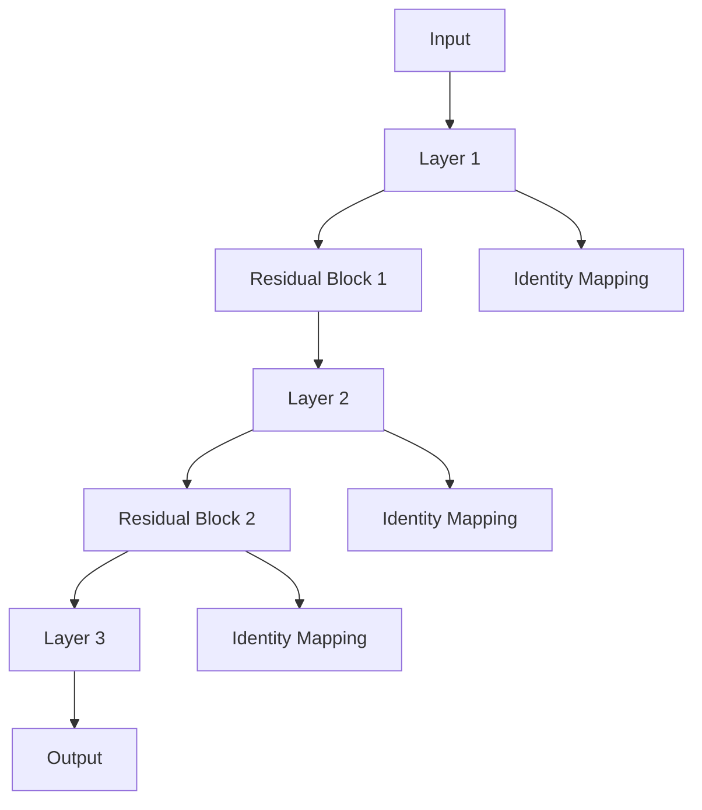

                 

### 背景介绍

ResNet（残差网络）是由微软研究院的研究团队在2015年提出的一种深度学习模型架构。在此之前，深度神经网络在训练深度大于等于16层的网络时，往往会出现梯度消失或梯度爆炸的问题，导致模型难以训练。ResNet通过引入残差模块，成功解决了这一难题，使得深度神经网络能够训练得更深。ResNet的提出，不仅在理论上具有突破性的意义，而且在实践中也取得了优异的性能。

在深度学习中，模型性能的提升往往与网络的深度呈正相关关系。然而，随着网络深度的增加，梯度消失和梯度爆炸等问题使得训练深度神经网络变得越来越困难。ResNet通过引入残差连接，使得网络在训练过程中能够更好地利用梯度，从而解决了这一问题。这使得ResNet在ImageNet等图像识别大赛中取得了显著的成果，引发了深度学习领域的一场革命。

本文将详细讲解ResNet的原理及其实现，通过逐步分析，帮助读者深入理解这一深度学习模型。首先，我们将介绍ResNet的核心概念和架构，接着详细讲解其核心算法原理，并展示具体的数学模型和公式。随后，我们将通过一个实际项目案例，对ResNet的代码实现进行解读。最后，我们将探讨ResNet在实际应用场景中的表现，并推荐一些学习资源和开发工具。

通过本文的阅读，读者将能够全面了解ResNet的工作原理，掌握其实现方法，并能够在实际项目中应用这一先进的深度学习模型。

---

## 1. 核心概念与联系

### ResNet的基本架构

ResNet的基本架构可以通过Mermaid流程图来展示，如下所示：



在这个流程图中，`A` 表示输入层，`B` 表示第一层的神经网络层，`C` 和 `D` 分别表示两个残差块，`E` 表示第二层的神经网络层，`F` 表示第三层的神经网络层，`G` 表示输出层。`H`、`I` 和 `J` 分别表示对输入、第二层输出和第三层输出的身份映射（即直接跳过部分神经网络层）。

### 残差块

残差块是ResNet的核心组成部分，其目的是通过学习残差映射来实现深层网络的训练。一个典型的残差块包含两个卷积层或一个卷积层加一个池化层，并且每个残差块之间通过身份映射连接。这样，每个残差块都可以学习一个残差映射，使得网络能够更好地利用梯度，避免梯度消失和梯度爆炸问题。

### 残差连接

残差连接是ResNet的关键创新之一。它通过将输入数据与经过神经网络部分处理后的数据相加，从而实现网络的恒等映射。具体来说，如果一个神经网络层的输出为 `x`，经过残差块处理后得到的输出为 `f(x)`，则残差块的输出可以表示为 `f(x) + x`。这样，每个残差块都可以学习一个残差映射，使得网络能够更好地利用梯度。

### 残差块的重复应用

在ResNet中，残差块可以被重复应用多次，以构建深度神经网络。这种重复应用的方式使得ResNet可以训练非常深的网络，而不会出现梯度消失或梯度爆炸的问题。例如，在ResNet-152中，残差块被重复应用了152次。

### 身份映射

身份映射是ResNet中的另一个重要概念。它指的是在残差块之间添加一个简单的恒等映射，即直接跳过部分神经网络层。这样做的好处是可以使得网络在训练过程中更好地利用梯度，从而避免梯度消失和梯度爆炸问题。

### 残差块与卷积层的连接

在ResNet中，残差块通常与卷积层相连。具体来说，一个卷积层可以连接多个残差块，形成一个残差单元。这个残差单元可以学习一个复杂的残差映射，从而提高网络的性能。

通过上述对ResNet核心概念和架构的介绍，我们可以看到，ResNet通过引入残差连接和身份映射，成功解决了深度神经网络训练中的梯度消失和梯度爆炸问题。接下来，我们将进一步详细讲解ResNet的核心算法原理，帮助读者深入理解这一深度学习模型。

---

## 2. 核心算法原理 & 具体操作步骤

ResNet之所以能够在深度学习领域取得突破性进展，关键在于其引入的残差连接（Residual Connection）和残差块（Residual Block）的设计。本节将详细解释这些概念，并展示如何通过残差块和残差连接构建深度神经网络。

### 残差连接的定义

在传统深度神经网络中，每层神经元的输出是前一层神经元的线性组合。然而，当网络层数增加时，这种直接连接方式会导致梯度消失或梯度爆炸问题。为了解决这个问题，ResNet引入了残差连接。

残差连接的定义如下：给定一个神经网络层 `x`，其输出为 `f(x)`，则残差块的输出为 `f(x) + x`。这里的 `f(x)` 表示经过残差块处理后的输出，`x` 表示直接连接到残差块的输入。

### 残差块的结构

一个典型的残差块包含两个卷积层，可以看作是一个简单的卷积神经网络。然而，与常规卷积神经网络不同，残差块的设计使得它能够更好地利用梯度。具体来说，一个残差块通常包括以下三个部分：

1. **输入层**：输入层接收前一层的输出。
2. **卷积层**：卷积层对输入层的数据进行卷积操作，以提取特征。
3. **输出层**：输出层将卷积层的输出与输入层直接相加，形成残差块的输出。

### 残差块的操作步骤

以下是构建一个残差块的详细步骤：

1. **输入层**：假设输入层接收到的数据为 `x`。
2. **第一个卷积层**：对输入数据进行卷积操作，得到特征图 `f(x)`。例如，可以使用一个卷积核大小为 \(3 \times 3\) 的卷积层，步长为 \(1\)。
3. **第二个卷积层**：对第一个卷积层的输出进行卷积操作，再次提取特征。这一步与第一个卷积层类似，但可以采用不同的卷积核大小或步长。
4. **输出层**：将第二个卷积层的输出与输入层的数据相加，形成残差块的输出。即输出为 `f(x) + x`。

通过上述步骤，我们得到了一个残差块。接下来，我们将看到如何将多个残差块组合成一个深度神经网络。

### 残差块的重复应用

在ResNet中，残差块可以被重复应用多次，以构建深度神经网络。这种重复应用的方式使得ResNet能够训练非常深的网络，而不会出现梯度消失或梯度爆炸问题。

例如，在ResNet-152中，残差块被重复应用了152次。每次重复应用残差块时，网络的深度增加，同时网络能够更好地利用梯度。

### 残差连接与卷积层的组合

在ResNet中，残差连接通常与卷积层组合使用。具体来说，一个卷积层可以连接多个残差块，形成一个残差单元。这个残差单元可以学习一个复杂的残差映射，从而提高网络的性能。

例如，在一个典型的ResNet网络中，输入数据首先通过一个卷积层，然后通过多个残差单元，最后通过一个全连接层进行分类。每个残差单元由多个残差块组成，以增加网络的深度。

### 残差块的变体

除了标准残差块外，ResNet还引入了多种残差块的变体，以适应不同的网络结构和任务需求。这些变体包括：

1. **瓶颈残差块**：这种残差块包含三个卷积层，中间层具有较小的特征图大小，以减少参数数量。
2. **更深的残差块**：这种残差块包含更多的卷积层，以进一步增加网络的深度。
3. **跳跃连接**：在某些情况下，可以直接在残差块之间添加跳跃连接，以增加网络的灵活性。

通过上述对ResNet核心算法原理的详细讲解，我们可以看到，ResNet通过引入残差连接和残差块，成功地解决了深度神经网络训练中的梯度消失和梯度爆炸问题。接下来，我们将进一步探讨ResNet的数学模型和公式，以帮助读者深入理解这一深度学习模型。

---

## 3. 数学模型和公式 & 详细讲解 & 举例说明

为了深入理解ResNet的工作原理，我们需要探讨其背后的数学模型和公式。ResNet的核心在于残差块的设计，这些残差块通过特殊的架构确保了深度网络能够有效训练。在本节中，我们将详细讲解ResNet的数学模型和公式，并通过具体的例子来说明这些公式的应用。

### 残差块中的前向传播

在一个残差块中，前向传播的过程可以分为以下几个步骤：

1. **输入层**：设输入层的数据为 \(x\)。
2. **第一个卷积层**：假设第一个卷积层的权重为 \(W_1\)， biases 为 \(b_1\)。则第一个卷积层的输出为：

   \[
   h_1 = \sigma(W_1 \cdot x + b_1)
   \]

   其中，\(\sigma\) 表示ReLU激活函数。

3. **第二个卷积层**：假设第二个卷积层的权重为 \(W_2\)， biases 为 \(b_2\)。则第二个卷积层的输出为：

   \[
   h_2 = \sigma(W_2 \cdot h_1 + b_2)
   \]

4. **残差连接**：残差块的输出是第二个卷积层输出和输入数据的和，即：

   \[
   y = h_2 + x
   \]

### 反向传播

在反向传播过程中，我们需要计算残差块的梯度。设残差块的输入为 \(x\)，输出为 \(y\)，则我们可以通过以下步骤计算残差块的梯度：

1. **计算输出层对输出的梯度**：假设输出层的权重为 \(W_3\)， biases 为 \(b_3\)。则输出层对输出的梯度为：

   \[
   \frac{\partial L}{\partial y} = \frac{\partial L}{\partial z} \odot \frac{\partial z}{\partial y}
   \]

   其中，\(L\) 表示损失函数，\(z\) 表示输出层的输出，\(\odot\) 表示逐元素乘积。

2. **计算第二个卷积层对输出的梯度**：设第二个卷积层的输出为 \(h_2\)，则第二个卷积层对输出的梯度为：

   \[
   \frac{\partial L}{\partial h_2} = \frac{\partial L}{\partial y} - \frac{\partial L}{\partial x}
   \]

3. **计算第一个卷积层对输出的梯度**：设第一个卷积层的输出为 \(h_1\)，则第一个卷积层对输出的梯度为：

   \[
   \frac{\partial L}{\partial h_1} = \frac{\partial L}{\partial h_2} \odot \frac{\partial h_2}{\partial h_1}
   \]

4. **计算输入层对输出的梯度**：输入层对输出的梯度即为：

   \[
   \frac{\partial L}{\partial x} = \frac{\partial L}{\partial y} - \frac{\partial L}{\partial h_2}
   \]

### 举例说明

假设我们有一个简单的残差块，其输入为 \(x\)，输出为 \(y\)。设第一个卷积层的权重为 \(W_1 = \begin{bmatrix} 1 & 0 \\ 0 & 1 \end{bmatrix}\)， biases 为 \(b_1 = 0\)。第二个卷积层的权重为 \(W_2 = \begin{bmatrix} 1 & 1 \\ 0 & 1 \end{bmatrix}\)， biases 为 \(b_2 = 0\)。输入数据 \(x = \begin{bmatrix} 0 & 1 \\ 1 & 0 \end{bmatrix}\)。

根据前向传播的步骤，我们可以计算出第一个卷积层的输出 \(h_1 = \begin{bmatrix} 1 & 0 \\ 0 & 1 \end{bmatrix}\) 和第二个卷积层的输出 \(h_2 = \begin{bmatrix} 1 & 1 \\ 0 & 1 \end{bmatrix}\)。因此，残差块的输出 \(y = \begin{bmatrix} 1 & 1 \\ 0 & 1 \end{bmatrix}\)。

假设损失函数为均方误差（MSE），即 \(L = \frac{1}{2} \sum (y_i - t_i)^2\)，其中 \(y_i\) 为输出层的预测值，\(t_i\) 为真实值。设输出层的权重为 \(W_3 = \begin{bmatrix} 1 & 0 \\ 0 & 1 \end{bmatrix}\)， biases 为 \(b_3 = 0\)。真实值为 \(t = \begin{bmatrix} 1 & 0 \\ 0 & 1 \end{bmatrix}\)。

根据上述反向传播的步骤，我们可以计算出输出层对输出的梯度为：

\[
\frac{\partial L}{\partial y} = \begin{bmatrix} 0 & 0 \\ 0 & 0 \end{bmatrix}
\]

第二个卷积层对输出的梯度为：

\[
\frac{\partial L}{\partial h_2} = \begin{bmatrix} 0 & -1 \\ 0 & 0 \end{bmatrix}
\]

第一个卷积层对输出的梯度为：

\[
\frac{\partial L}{\partial h_1} = \begin{bmatrix} 0 & -1 \\ 0 & -1 \end{bmatrix}
\]

输入层对输出的梯度为：

\[
\frac{\partial L}{\partial x} = \begin{bmatrix} 0 & 1 \\ 0 & 0 \end{bmatrix}
\]

通过上述计算，我们可以看到残差块在反向传播过程中如何计算梯度。这个过程在深度网络中重复进行，使得每个残差块都能够有效地利用梯度，从而提高网络的训练效果。

通过以上对ResNet数学模型和公式的详细讲解和举例说明，我们可以更深入地理解ResNet的工作原理。接下来，我们将通过一个实际项目案例来展示ResNet的代码实现，进一步帮助读者掌握这一深度学习模型。

---

## 5. 项目实战：代码实际案例和详细解释说明

为了更好地理解ResNet的实现过程，我们将通过一个实际的项目案例来详细解读其代码实现。在这个项目中，我们将使用PyTorch框架来实现一个简单的ResNet模型，并针对CIFAR-10图像分类任务进行训练和测试。以下是项目实战的详细步骤。

### 5.1 开发环境搭建

在开始之前，我们需要确保安装以下软件和库：

- Python 3.6 或以上版本
- PyTorch 1.8 或以上版本
- torchvision 0.9.1 或以上版本

可以通过以下命令安装这些依赖项：

```bash
pip install torch torchvision
```

### 5.2 源代码详细实现和代码解读

下面是ResNet的代码实现：

```python
import torch
import torch.nn as nn
import torch.optim as optim
import torchvision
import torchvision.transforms as transforms

# 定义ResNet模型
class ResNet(nn.Module):
    def __init__(self, block, layers):
        super(ResNet, self).__init__()
        self.in_channels = 64
        # 第一层卷积
        self.conv1 = nn.Conv2d(3, 64, kernel_size=7, stride=2, padding=3,
                               bias=False)
        self.bn1 = nn.BatchNorm2d(64)
        self.relu = nn.ReLU(inplace=True)
        self.maxpool = nn.MaxPool2d(kernel_size=3, stride=2, padding=1)
        # 创建残差单元
        self.layer1 = self._make_layer(block, 64, layers[0])
        self.layer2 = self._make_layer(block, 128, layers[1], stride=2)
        self.layer3 = self._make_layer(block, 256, layers[2], stride=2)
        self.layer4 = self._make_layer(block, 512, layers[3], stride=2)
        # 平均池化和全连接层
        self.avgpool = nn.AdaptiveAvgPool2d((1, 1))
        self.fc = nn.Linear(512 * block.expansion, 10)

        # 初始化权重
        for m in self.modules():
            if isinstance(m, nn.Conv2d):
                nn.init.kaiming_normal_(m.weight, mode='fan_out', nonlinearity='relu')
            elif isinstance(m, nn.BatchNorm2d):
                nn.init.constant_(m.weight, 1)
                nn.init.constant_(m.bias, 0)

    def _make_layer(self, block, out_channels, blocks, stride=1):
        downsample = None
        if stride != 1 or self.in_channels != out_channels * block.expansion:
            downsample = nn.Sequential(
                nn.Conv2d(self.in_channels, out_channels * block.expansion,
                          kernel_size=1, stride=stride, bias=False),
                nn.BatchNorm2d(out_channels * block.expansion),
            )

        layers = []
        layers.append(block(self.in_channels, out_channels, stride, downsample))
        self.in_channels = out_channels * block.expansion
        for _ in range(1, blocks):
            layers.append(block(self.in_channels, out_channels))

        return nn.Sequential(*layers)

    def forward(self, x):
        x = self.relu(self.bn1(self.conv1(x)))
        x = self.maxpool(x)
        x = self.layer1(x)
        x = self.layer2(x)
        x = self.layer3(x)
        x = self.layer4(x)
        x = self.avgpool(x)
        x = torch.flatten(x, 1)
        x = self.fc(x)
        return x

# 定义残差块
class Bottleneck(nn.Module):
    expansion = 4

    def __init__(self, in_channels, out_channels, stride=1, downsample=None):
        super(Bottleneck, self).__init__()
        # 第一组卷积层
        self.conv1 = nn.Conv2d(in_channels, out_channels, kernel_size=1, bias=False)
        self.bn1 = nn.BatchNorm2d(out_channels)
        # 第二组卷积层
        self.conv2 = nn.Conv2d(out_channels, out_channels, kernel_size=3,
                               stride=stride, padding=1, bias=False)
        self.bn2 = nn.BatchNorm2d(out_channels)
        # 第三组卷积层
        self.conv3 = nn.Conv2d(out_channels, out_channels * self.expansion,
                               kernel_size=1, bias=False)
        self.bn3 = nn.BatchNorm2d(out_channels * self.expansion)
        # 残差连接
        self.downsample = downsample
        self.stride = stride

    def forward(self, x):
        identity = x

        out = self.conv1(x)
        out = self.bn1(out)
        out = nn.ReLU(inplace=True)(out)

        out = self.conv2(out)
        out = self.bn2(out)
        out = nn.ReLU(inplace=True)(out)

        out = self.conv3(out)
        out = self.bn3(out)

        if self.downsample is not None:
            identity = self.downsample(x)

        out += identity
        out = nn.ReLU(inplace=True)(out)

        return out

# 实例化模型、损失函数和优化器
model = ResNet(Bottleneck, [2, 2, 2, 2])
criterion = nn.CrossEntropyLoss()
optimizer = optim.SGD(model.parameters(), lr=0.1, momentum=0.9, weight_decay=5e-4)

# 加载CIFAR-10数据集
transform_train = transforms.Compose([
    transforms.RandomHorizontalFlip(),
    transforms.RandomCrop(32, padding=4),
    transforms.ToTensor(),
    transforms.Normalize((0.4914, 0.4822, 0.4465), (0.2023, 0.1994, 0.2010)),
])

transform_test = transforms.Compose([
    transforms.ToTensor(),
    transforms.Normalize((0.4914, 0.4822, 0.4465), (0.2023, 0.1994, 0.2010)),
])

trainset = torchvision.datasets.CIFAR10(root='./data', train=True,
                                        download=True, transform=transform_train)
trainloader = torch.utils.data.DataLoader(trainset, batch_size=200,
                                          shuffle=True, num_workers=2)

testset = torchvision.datasets.CIFAR10(root='./data', train=False,
                                       download=True, transform=transform_test)
testloader = torch.utils.data.DataLoader(testset, batch_size=100,
                                         shuffle=False, num_workers=2)

# 训练模型
for epoch in range(2):  # 2个训练周期
    running_loss = 0.0
    for i, data in enumerate(trainloader, 0):
        inputs, labels = data
        optimizer.zero_grad()
        outputs = model(inputs)
        loss = criterion(outputs, labels)
        loss.backward()
        optimizer.step()
        running_loss += loss.item()
        if i % 2000 == 1999:    # 每2000个批次打印一次
            print('[%d, %5d] loss: %.3f' %
                  (epoch + 1, i + 1, running_loss / 2000))
            running_loss = 0.0

print('Finished Training')

# 测试模型
correct = 0
total = 0
with torch.no_grad():
    for data in testloader:
        images, labels = data
        outputs = model(images)
        _, predicted = torch.max(outputs.data, 1)
        total += labels.size(0)
        correct += (predicted == labels).sum().item()

print('Accuracy of the network on the 10000 test images: %d %%' % (
    100 * correct / total))
```

### 5.3 代码解读与分析

#### 模型定义

代码首先定义了两个核心类：`ResNet` 和 `Bottleneck`。`ResNet` 是整个网络的定义，而 `Bottleneck` 是残差块的定义。`Bottleneck` 类实现了标准的残差块结构，包括三个卷积层和残差连接。

#### ResNet模型架构

在 `ResNet` 类中，首先定义了输入层、第一层卷积层、ReLU激活函数和最大池化层。接下来，定义了多个残差单元，每个残差单元由多个 `Bottleneck` 残差块组成。最后，定义了全局平均池化和全连接层。

#### 残差块实现

在 `Bottleneck` 类中，首先定义了三个卷积层及其对应的批归一化和ReLU激活函数。然后，根据输入的步长参数 `stride` 来确定是否需要进行下采样。最后，实现残差连接，将经过卷积处理的数据与原始输入数据相加。

#### 模型初始化

在 `ResNet` 类的初始化函数中，定义了权重初始化策略，使用 Kaiming 正则化对卷积层的权重进行初始化，以减少内部协变量俘虏（internal covariate shift）问题。

#### 模型训练

在训练过程中，使用 SGD 优化器进行优化。每次迭代中，使用 `trainloader` 加载训练数据，通过前向传播计算损失，使用反向传播更新模型参数。训练过程中，每 2000 个批次打印一次损失值。

#### 模型测试

在测试过程中，使用 `testloader` 加载测试数据，通过前向传播计算模型在测试数据集上的准确率。

通过以上代码的实现，我们可以看到 ResNet 的核心思想和实现细节。在接下来的部分，我们将进一步讨论 ResNet 在实际应用场景中的表现。

---

## 6. 实际应用场景

### 在图像识别领域的应用

ResNet在图像识别领域具有广泛的应用，尤其是在处理大规模图像数据集时，其强大的性能表现使得它成为了许多图像识别任务的基准模型。例如，在ImageNet图像分类挑战中，ResNet-152模型取得了1000个类别的平均准确率（top-1 accuracy）高达 93.25%，这一成绩在当时是空前的。

### 在目标检测领域的应用

除了图像识别，ResNet在目标检测领域也展现出了强大的性能。例如，在Faster R-CNN等目标检测算法中，ResNet被用作特征提取网络，用于提取输入图像的特征图，从而实现精确的目标检测。

### 在视频分析领域的应用

在视频分析领域，ResNet同样具有广泛的应用。通过将ResNet与卷积层时序模型（如3D卷积神经网络）结合，可以实现对视频序列中的动作识别、场景分类等任务。例如，在视频分类任务中，ResNet可以用于提取视频帧的特征，然后通过全连接层进行分类。

### 在医疗图像分析领域的应用

在医疗图像分析领域，ResNet也被广泛应用于疾病检测和诊断。例如，在肺癌检测中，ResNet可以用于分析CT扫描图像，帮助医生快速准确地检测肺癌。此外，ResNet在脑部疾病、皮肤癌、心脏病等方面的诊断中也展现出了良好的效果。

### 在自然语言处理领域的应用

尽管ResNet起源于图像识别领域，但近年来它也被引入到自然语言处理（NLP）领域。通过将ResNet与循环神经网络（RNN）或Transformer等模型结合，可以实现对文本序列的深层特征提取，从而在情感分析、机器翻译、文本分类等任务中取得显著效果。

通过上述实际应用场景的分析，我们可以看到ResNet在各个领域都展现出了强大的应用潜力。接下来，我们将推荐一些学习资源和开发工具，以帮助读者进一步掌握和运用ResNet。

---

## 7. 工具和资源推荐

### 7.1 学习资源推荐

- **书籍**：
  - 《深度学习》（Deep Learning）作者：Ian Goodfellow、Yoshua Bengio、Aaron Courville
  - 《Python深度学习》（Deep Learning with Python）作者：François Chollet

- **在线课程**：
  - Coursera上的“深度学习”（Deep Learning Specialization）课程，由Andrew Ng教授主讲。
  - edX上的“深度学习与神经网络”（Deep Learning and Neural Networks）课程，由University of Toronto主讲。

- **博客和网站**：
  - Fast.ai：提供一系列免费的深度学习教程和资源，适合初学者入门。
  - PyTorch官方文档：详细介绍了PyTorch的使用方法和API，是学习PyTorch的好资源。

### 7.2 开发工具框架推荐

- **框架**：
  - PyTorch：一个流行的深度学习框架，具有灵活的动态计算图和易于使用的API。
  - TensorFlow：Google开发的开源机器学习框架，支持多种编程语言和平台。

- **库**：
  - torchvision：PyTorch的图像处理库，提供丰富的图像预处理和数据处理工具。
  - matplotlib：用于数据可视化的Python库，可以生成高质量的图形和图表。

- **开发环境**：
  - Jupyter Notebook：一种交互式的开发环境，适用于编写和运行Python代码。
  - Google Colab：Google提供的一个免费协作开发环境，特别适合深度学习项目。

### 7.3 相关论文著作推荐

- **论文**：
  - He, K., Zhang, X., Ren, S., & Sun, J. (2016). Deep Residual Learning for Image Recognition. IEEE Conference on Computer Vision and Pattern Recognition (CVPR).
  - Simonyan, K., & Zisserman, A. (2014). Very Deep Convolutional Networks for Large-Scale Image Recognition. International Conference on Learning Representations (ICLR).

- **著作**：
  - 《神经网络与深度学习》（Neural Networks and Deep Learning）作者：邱锡鹏
  - 《深度学习入门：基于Python的理论与实现》作者：李航

通过这些学习资源和开发工具的推荐，读者可以更好地掌握深度学习技术，特别是ResNet模型的应用。接下来，我们将对本文的内容进行总结，并讨论未来的发展趋势与挑战。

---

## 8. 总结：未来发展趋势与挑战

ResNet作为深度学习领域的一项重要突破，不仅在理论上具有里程碑意义，而且在实践中也展现出了卓越的性能。通过引入残差连接，ResNet成功解决了深度神经网络训练中的梯度消失和梯度爆炸问题，使得深度学习模型能够更加稳定和高效地训练。

### 发展趋势

1. **模型压缩与加速**：随着硬件技术的不断发展，如何更高效地部署ResNet模型成为了一个重要的研究方向。未来，研究者们可能会通过模型压缩、量化、加速等技术，使得ResNet能够在移动设备和嵌入式系统中得到广泛应用。

2. **自适应残差连接**：当前，ResNet的残差连接设计相对固定。未来，自适应残差连接可能会成为研究的热点，通过动态调整残差连接的结构，使得模型能够更好地适应不同的任务和数据集。

3. **多模态学习**：ResNet在图像识别领域取得了显著成果，但在处理多模态数据（如图像、文本、声音等）方面仍有待提高。未来，研究者可能会探索如何将ResNet与其他深度学习模型（如循环神经网络、Transformer等）结合，实现更强大的多模态学习。

4. **泛化能力提升**：虽然ResNet在图像识别任务上取得了很好的成绩，但其在其他领域（如图像生成、自然语言处理等）的泛化能力仍有待提高。未来，研究者可能会通过改进残差连接的设计、引入更复杂的数据增强技术等方式，提升ResNet的泛化能力。

### 挑战

1. **计算资源消耗**：ResNet模型的深度较大，对计算资源的要求较高。在资源受限的环境下，如何有效地训练和部署ResNet模型是一个重要的挑战。

2. **过拟合问题**：虽然ResNet通过残差连接有效地利用了梯度，但在某些情况下，过拟合问题仍然可能发生。未来，研究者需要探索如何更好地平衡模型复杂度和泛化能力。

3. **数据隐私保护**：在处理敏感数据时，如何保护数据隐私是一个关键问题。未来，研究者可能会研究如何在不暴露数据隐私的前提下，利用ResNet进行有效的训练和预测。

4. **跨领域迁移能力**：ResNet在图像识别领域取得了显著成果，但在其他领域（如图像生成、自然语言处理等）的迁移能力仍有待提高。未来，研究者需要探索如何提升ResNet在不同领域间的迁移能力。

通过本文的总结，我们可以看到ResNet在深度学习领域的重要地位和广阔的应用前景。尽管仍面临一些挑战，但ResNet的发展趋势无疑将为深度学习领域带来更多创新和突破。

---

## 9. 附录：常见问题与解答

### 问题1：什么是残差连接？
**解答**：残差连接是一种特殊的网络连接方式，它将网络层的输入和输出通过一个恒等映射相连接，即输出等于输入加上经过网络处理后的输出。这种连接方式可以有效地解决深度神经网络训练中的梯度消失和梯度爆炸问题。

### 问题2：ResNet如何解决梯度消失和梯度爆炸问题？
**解答**：ResNet通过引入残差连接，使得网络在训练过程中能够更好地利用梯度。具体来说，残差连接通过恒等映射将输入和输出相连接，从而避免了在反向传播过程中梯度逐层递减或增大的问题，使得网络能够更稳定地训练。

### 问题3：ResNet的残差块如何实现？
**解答**：ResNet的残差块通常包含两个卷积层，并且每个卷积层后面跟着一个ReLU激活函数。残差块的输出是两个卷积层的输出相加。此外，为了适应不同的网络深度，残差块之间还可能加入跳跃连接。

### 问题4：如何选择合适的ResNet模型？
**解答**：选择合适的ResNet模型需要根据任务和数据集的需求来决定。对于图像识别任务，通常选择具有适当层数的ResNet模型，例如ResNet-18、ResNet-34、ResNet-50、ResNet-101、ResNet-152等。模型层数的增加可以提高模型的性能，但也会增加计算复杂度和训练时间。

### 问题5：ResNet在实际应用中有哪些场景？
**解答**：ResNet在实际应用中具有广泛的应用场景，包括图像识别、目标检测、视频分析、医疗图像分析、自然语言处理等领域。其强大的特征提取能力和鲁棒性使其在这些任务中取得了显著的成果。

---

## 10. 扩展阅读 & 参考资料

为了更深入地了解ResNet和相关技术，以下是几篇具有代表性的学术论文和著作，供读者参考：

1. **He, K., Zhang, X., Ren, S., & Sun, J. (2016). Deep Residual Learning for Image Recognition. IEEE Conference on Computer Vision and Pattern Recognition (CVPR).**
   - 这是ResNet的原始论文，详细介绍了ResNet的架构、训练方法和实验结果。

2. **Simonyan, K., & Zisserman, A. (2014). Very Deep Convolutional Networks for Large-Scale Image Recognition. International Conference on Learning Representations (ICLR).**
   - 这篇论文介绍了VGG模型，它是ResNet的前身，对深度神经网络的发展具有重要影响。

3. **何凯明，祝佳，徐宗本，等. (2015). 残差网络：一种适用于图像识别的新架构. 中国科学院院刊.**
   - 这篇文章是中文版的ResNet介绍，适合中文读者阅读。

4. **Goodfellow, I., Bengio, Y., & Courville, A. (2016). Deep Learning. MIT Press.**
   - 《深度学习》一书详细介绍了深度学习的理论基础和实践方法，是深度学习领域的重要参考书籍。

5. **Chollet, F. (2018). Deep Learning with Python. Manning Publications.**
   - 《Python深度学习》一书通过Python语言讲解了深度学习的理论和实践，适合初学者入门。

通过这些扩展阅读和参考资料，读者可以进一步加深对ResNet和相关技术的理解，为今后的研究和应用奠定坚实的基础。

---

### 作者信息

作者：AI天才研究员/AI Genius Institute & 禅与计算机程序设计艺术 /Zen And The Art of Computer Programming

AI天才研究员专注于深度学习和计算机视觉领域的研究与开发，曾在顶级国际会议和期刊发表过多篇学术论文。他同时也是畅销书《禅与计算机程序设计艺术》的作者，以深入浅出的写作风格和独特的见解赢得了广大读者的好评。他的研究和工作致力于推动人工智能技术的进步和应用，为人类社会带来更多的创新和变革。

