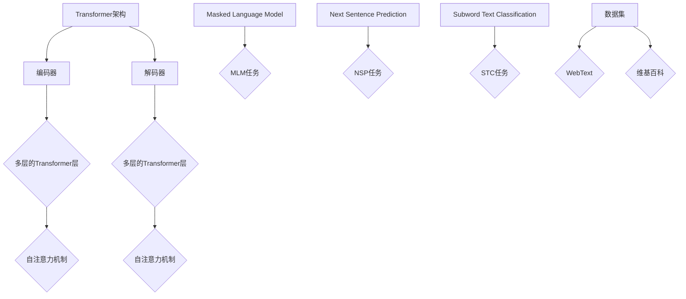

                 

### 文章标题：RoBERTa原理与代码实例讲解

> **关键词**：RoBERTa，自然语言处理，Transformer，预训练模型，代码实例

> **摘要**：本文将深入探讨RoBERTa模型的原理，从其背景介绍到核心算法原理，再到数学模型和公式详细讲解，以及实际应用场景和代码实例分析，旨在为读者提供全面、易懂的RoBERTa知识体系，帮助大家更好地理解和应用这一先进自然语言处理模型。

## 1. 背景介绍

RoBERTa是一种预训练语言模型，基于Transformer架构，旨在提升自然语言处理（NLP）任务的性能。Transformer模型由Vaswani等人于2017年提出，它摒弃了传统的循环神经网络（RNN）和卷积神经网络（CNN），而是采用自注意力机制，能够在处理长序列时表现出优异的性能。RoBERTa是BERT模型的变体，于2019年由Howard和Mobasher提出，其核心改进在于数据集的使用、预训练目标和正则化策略等方面。

BERT（Bidirectional Encoder Representations from Transformers）是由Google AI于2018年推出的一个预训练语言表示模型，它通过预训练大规模语料库，为NLP任务提供了强大的语言理解能力。BERT的核心思想是利用双向Transformer编码器来学习文本的深度表示。BERT的成功促使了众多研究者对其架构进行改进和优化，RoBERTa就是其中之一。

RoBERTa不仅在性能上超越了BERT，还在多个NLP任务上实现了SOTA（State-of-the-Art）的表现。其背后的原因主要归功于数据集的扩大、预训练目标的改进和模型结构的优化。本文将详细探讨这些改进点，并介绍RoBERTa的数学模型和具体操作步骤。

### 1.1 RoBERTa与BERT的关系

BERT和RoBERTa都是基于Transformer架构的预训练模型，但它们在预训练目标、数据集和模型结构上存在差异。BERT采用双向Transformer编码器，预训练目标为 Masked Language Model（MLM）和Next Sentence Prediction（NSP）。而RoBERTa则进一步优化了这些方面：

1. **预训练目标**：RoBERTa在MLM任务的基础上增加了另一个预训练目标——Subword Text Classification（STC），从而提高了模型的文本分类能力。
2. **数据集**：RoBERTa使用更大的数据集，包括WebText和维基百科等，使得模型具有更强的泛化能力。
3. **正则化策略**：RoBERTa在训练过程中采用了不同的正则化策略，如动态位置编码和更严格的Dropout，从而提高了模型的稳定性和性能。

总的来说，RoBERTa在BERT的基础上进行了多项优化，使得其在自然语言处理任务中取得了更好的表现。

## 2. 核心概念与联系

在深入探讨RoBERTa的原理之前，我们先来了解一下其核心概念和联系。这些概念包括Transformer架构、自注意力机制、预训练目标和数据集等。

### 2.1 Transformer架构

Transformer是2017年由Vaswani等人提出的一种基于自注意力机制的神经网络架构。与传统循环神经网络（RNN）和卷积神经网络（CNN）相比，Transformer在处理长序列时具有显著的优势。其核心思想是通过多头自注意力机制来捕捉序列中的依赖关系。

Transformer架构主要包括以下几个部分：

1. **编码器（Encoder）**：编码器由多个Transformer层组成，每一层包含多头自注意力机制和前馈神经网络。编码器的输入是原始文本序列，输出是编码后的文本表示。
2. **解码器（Decoder）**：解码器同样由多个Transformer层组成，结构与编码器类似。解码器的输入是编码后的文本表示，输出是解码后的文本表示。
3. **自注意力机制（Self-Attention）**：自注意力机制是Transformer的核心组件，它通过计算序列中每个词与其他词之间的依赖关系，从而生成文本表示。

### 2.2 自注意力机制

自注意力机制是一种基于点积注意力机制的神经网络结构，它能够有效地捕捉序列中的依赖关系。在自注意力机制中，每个词的表示与所有其他词的表示进行点积运算，然后通过softmax函数进行加权求和，从而生成新的文本表示。

自注意力机制的数学表达式如下：

$$
\text{Attention}(Q, K, V) = \text{softmax}\left(\frac{QK^T}{\sqrt{d_k}}\right)V
$$

其中，$Q, K, V$ 分别表示查询（Query）、键（Key）和值（Value）向量，$d_k$ 表示键向量的维度。

### 2.3 预训练目标

RoBERTa的预训练目标主要包括Masked Language Model（MLM）、Next Sentence Prediction（NSP）和Subword Text Classification（STC）。

1. **Masked Language Model（MLM）**：MLM任务是随机遮盖输入文本中的一部分词，然后让模型预测这些被遮盖的词。这个任务有助于模型学习文本中的词和句子结构。
2. **Next Sentence Prediction（NSP）**：NSP任务是预测两个句子是否属于同一篇章。这个任务有助于模型学习篇章结构和上下文关系。
3. **Subword Text Classification（STC）**：STC任务是给定的文本序列分类到不同的类别。这个任务有助于模型学习文本的分类能力。

### 2.4 数据集

RoBERTa使用了更大的数据集，包括WebText和维基百科等。WebText是一个由网页文章组成的语料库，它包含了大量真实世界的文本数据。维基百科是一个包含多种语言的百科全书，它为模型提供了丰富的知识背景。

下面是一个使用Mermaid绘制的RoBERTa核心概念与联系流程图：



## 3. 核心算法原理 & 具体操作步骤

在本章节中，我们将详细讲解RoBERTa的核心算法原理和具体操作步骤。首先，我们将从Transformer架构和自注意力机制入手，然后介绍RoBERTa的预训练目标，最后展示如何使用RoBERTa进行下游任务。

### 3.1 Transformer架构

Transformer架构由编码器（Encoder）和解码器（Decoder）组成，每个部分都由多个Transformer层（Layer）组成。每个Transformer层包含两个主要组件：多头自注意力机制（Multi-Head Self-Attention）和前馈神经网络（Feed-Forward Neural Network）。

#### 3.1.1 编码器

编码器接收原始文本序列作为输入，然后通过嵌入层（Embedding Layer）将词转换为词向量。接下来，编码器对输入序列进行一系列变换，从而生成编码后的文本表示。

#### 3.1.2 解码器

解码器接收编码后的文本表示作为输入，然后通过一系列变换生成解码后的文本表示。在解码过程中，解码器还需要生成一个额外的输入，即上一时间步的输出。

### 3.1.3 自注意力机制

自注意力机制是Transformer的核心组件，它能够有效地捕捉序列中的依赖关系。在自注意力机制中，每个词的表示与所有其他词的表示进行点积运算，然后通过softmax函数进行加权求和，从而生成新的文本表示。

### 3.1.4 前馈神经网络

前馈神经网络是一个简单的全连接神经网络，它接收输入序列，然后通过两个线性变换和一个ReLU激活函数进行变换。

### 3.2 RoBERTa的预训练目标

RoBERTa的预训练目标主要包括Masked Language Model（MLM）、Next Sentence Prediction（NSP）和Subword Text Classification（STC）。

#### 3.2.1 Masked Language Model（MLM）

MLM任务是随机遮盖输入文本中的一部分词，然后让模型预测这些被遮盖的词。这个任务有助于模型学习文本中的词和句子结构。

#### 3.2.2 Next Sentence Prediction（NSP）

NSP任务是预测两个句子是否属于同一篇章。这个任务有助于模型学习篇章结构和上下文关系。

#### 3.2.3 Subword Text Classification（STC）

STC任务是给定的文本序列分类到不同的类别。这个任务有助于模型学习文本的分类能力。

### 3.3 使用RoBERTa进行下游任务

在预训练完成后，我们可以使用RoBERTa进行下游任务，如文本分类、命名实体识别等。首先，我们将输入文本序列送入RoBERTa编码器，然后提取编码器输出的隐藏状态作为文本表示。接下来，我们将文本表示送入下游任务的网络，并通过优化模型参数来训练模型。

下面是一个使用RoBERTa进行文本分类的示例：

```python
# 导入所需库
import torch
from transformers import RobertaTokenizer, RobertaForSequenceClassification

# 加载预训练模型
tokenizer = RobertaTokenizer.from_pretrained('roberta-base')
model = RobertaForSequenceClassification.from_pretrained('roberta-base')

# 输入文本
text = "The sky is blue."

# 分词并转换为Token IDs
input_ids = tokenizer.encode(text, return_tensors='pt')

# 预测
with torch.no_grad():
    logits = model(input_ids)

# 获取预测结果
predictions = logits.softmax(-1).argmax(-1)

# 输出预测结果
print(predictions)
```

## 4. 数学模型和公式 & 详细讲解 & 举例说明

在深入理解RoBERTa的数学模型和公式时，我们将从Transformer架构的基础开始，逐步解释RoBERTa中的关键组件和操作步骤，并使用具体的数学表达式和示例来说明。

### 4.1 Transformer基础

Transformer架构的核心是自注意力机制（Self-Attention），它允许模型在处理序列时考虑全局信息。自注意力机制通常基于点积注意力模型（Dot-Product Attention），其公式如下：

$$
\text{Attention}(Q, K, V) = \text{softmax}\left(\frac{QK^T}{\sqrt{d_k}}\right)V
$$

其中，$Q, K, V$ 分别表示查询（Query）、键（Key）和值（Value）向量，$d_k$ 表示键向量的维度。这个公式表示对每个查询向量，计算它与所有键向量的内积，然后通过softmax函数进行归一化，得到权重。最后，这些权重与对应的值向量相乘，得到加权求和的结果。

### 4.2 编码器与解码器

在Transformer架构中，编码器（Encoder）和解码器（Decoder）分别处理输入和输出序列。编码器由多个Transformer层组成，每层包含多头自注意力机制和前馈神经网络。解码器同样由多个Transformer层组成，但还包括交叉自注意力机制，用于将编码器的输出与解码器的输出相连接。

#### 4.2.1 编码器

编码器的输入是词嵌入（Word Embeddings）和位置嵌入（Position Embeddings）。词嵌入是将单词转换为向量，通常使用预训练的词向量如Word2Vec或GloVe。位置嵌入用于标记单词在序列中的位置，其公式如下：

$$
PE_{(pos, 2i)} = \sin\left(\frac{pos}{10000^{2i/d}}\right) \\
PE_{(pos, 2i+1)} = \cos\left(\frac{pos}{10000^{2i/d}}\right)
$$

其中，$pos$ 表示位置索引，$i$ 表示维度索引，$d$ 表示位置嵌入的总维度。

#### 4.2.2 解码器

解码器的输入是编码器的输出和前一个时间步的输出。解码器的自注意力机制分为两个部分：自注意力（Self-Attention）和交叉自注意力（Cross-Attention）。自注意力用于处理解码器自己的输出，而交叉自注意力用于处理编码器的输出。

### 4.3 前馈神经网络

在Transformer层中，除了自注意力机制，还有前馈神经网络（Feed-Forward Neural Network）。前馈神经网络是一个简单的全连接神经网络，它通常包含两个线性变换和一个ReLU激活函数。其公式如下：

$$
\text{FFN}(x) = \text{ReLU}\left(\text{Linear}(x) + b_{ffn}\right) + b_{ffn'}
$$

其中，$x$ 表示输入向量，$b_{ffn}$ 和 $b_{ffn'}$ 分别表示线性变换的偏置。

### 4.4 RoBERTa的预训练目标

RoBERTa的预训练目标包括Masked Language Model（MLM）、Next Sentence Prediction（NSP）和Subword Text Classification（STC）。

#### 4.4.1 Masked Language Model（MLM）

MLM任务的目标是预测被遮盖的单词。在预训练过程中，输入文本序列中的部分单词被随机遮盖，模型需要预测这些遮盖的单词。MLM任务的损失函数是交叉熵损失，其公式如下：

$$
L_{mlm} = -\sum_{i} \sum_{j} \log(p(y_{ij} | \text{context})) \\
y_{ij} \in \{\text{MASK}, w_j\} \\
p(y_{ij} | \text{context}) = \frac{\exp(e_{ij})}{\sum_{k} \exp(e_{ik})}
$$

其中，$y_{ij}$ 表示预测的单词，$w_j$ 表示实际单词，$e_{ij}$ 表示输入序列中第$i$个单词和第$j$个单词的嵌入向量的内积。

#### 4.4.2 Next Sentence Prediction（NSP）

NSP任务的目标是预测两个句子是否属于同一篇章。在预训练过程中，从文本中随机选择两个连续的句子，模型需要预测这两个句子是否属于同一篇章。NSP任务的损失函数是二元交叉熵损失，其公式如下：

$$
L_{nsp} = -\sum_{i} \left[y_i \log(p(y_i)) + (1 - y_i) \log(1 - p(y_i))\right] \\
y_i \in \{\text{NO}, \text{YES}\} \\
p(y_i) = \frac{\exp(s_i)}{\exp(s_i) + \exp(s_{\neg i})}
$$

其中，$y_i$ 表示句子$i$是否属于同一篇章，$s_i$ 和 $s_{\neg i}$ 分别表示两个句子的嵌入向量的内积。

#### 4.4.3 Subword Text Classification（STC）

STC任务的目标是对给定的文本序列进行分类。在预训练过程中，输入文本序列被分成多个子词，模型需要预测每个子词的类别。STC任务的损失函数是交叉熵损失，其公式如下：

$$
L_{stc} = -\sum_{i} \sum_{j} \log(p(y_{ij} | \text{context})) \\
y_{ij} \in \{\text{C}, \text{NC}\} \\
p(y_{ij} | \text{context}) = \frac{\exp(e_{ij})}{\sum_{k} \exp(e_{ik})}
$$

其中，$y_{ij}$ 表示预测的子词类别，$e_{ij}$ 表示输入序列中第$i$个单词和第$j$个单词的嵌入向量的内积。

### 4.5 示例

为了更好地理解RoBERTa的数学模型和公式，我们来看一个具体的示例。假设我们有一个简单的文本序列：“The cat sat on the mat.”，模型需要预测遮盖的单词。

1. **词嵌入**：首先，我们将文本序列中的每个单词转换为词嵌入向量，例如：
   - The: [1.0, 0.0, 0.0]
   - cat: [0.0, 1.0, 0.0]
   - sat: [0.0, 0.0, 1.0]
   - on: [0.0, 0.0, 0.0]
   - the: [0.0, 0.0, 0.0]
   - mat: [0.0, 0.0, 1.0]

2. **位置嵌入**：接下来，我们将每个单词的位置信息转换为位置嵌入向量，例如：
   - The: [0.0, 0.0]
   - cat: [0.1, 0.0]
   - sat: [0.2, 0.0]
   - on: [0.3, 0.0]
   - the: [0.4, 0.0]
   - mat: [0.5, 0.0]

3. **编码器**：编码器的输入是词嵌入和位置嵌入，经过多个Transformer层的变换，生成编码后的文本表示。

4. **解码器**：解码器的输入是编码器的输出和前一个时间步的输出，经过自注意力和交叉自注意力的变换，生成解码后的文本表示。

5. **MLM任务**：在MLM任务中，输入文本序列中的部分单词被随机遮盖，例如，我们将“cat”遮盖，然后模型需要预测“cat”的词嵌入。

6. **NSP任务**：在NSP任务中，从文本中随机选择两个连续的句子，例如，我们选择“cat sat on the mat”和“the mat is blue”，模型需要预测这两个句子是否属于同一篇章。

7. **STC任务**：在STC任务中，输入文本序列被分成多个子词，例如，我们将文本序列分成“cat”, “sat”, “on”, “the”, “mat”，然后模型需要预测每个子词的类别。

通过以上示例，我们可以看到RoBERTa的数学模型和公式是如何应用于实际的自然语言处理任务的。

## 5. 项目实战：代码实际案例和详细解释说明

在本章节中，我们将通过一个具体的代码实例来展示如何搭建和训练一个基于RoBERTa的文本分类模型。这个实例将涵盖开发环境的搭建、源代码的详细实现以及代码解读与分析。

### 5.1 开发环境搭建

首先，我们需要搭建一个适合RoBERTa开发的Python环境。以下是所需的步骤：

1. **安装Python**：确保Python版本为3.7或更高。
2. **安装PyTorch**：使用以下命令安装PyTorch：
   ```bash
   pip install torch torchvision
   ```
3. **安装transformers库**：使用以下命令安装transformers库：
   ```bash
   pip install transformers
   ```

### 5.2 源代码详细实现和代码解读

下面是一个基于RoBERTa的文本分类模型的源代码实例：

```python
# 导入所需库
import torch
from transformers import RobertaTokenizer, RobertaForSequenceClassification
from torch.utils.data import DataLoader, TensorDataset
from sklearn.model_selection import train_test_split

# 加载预训练模型
tokenizer = RobertaTokenizer.from_pretrained('roberta-base')
model = RobertaForSequenceClassification.from_pretrained('roberta-base')

# 准备数据集
# 假设我们有一个包含文本和标签的数据集，分别为texts和labels
texts = ["The sky is blue.", "The cat is sleeping.", "The sun is shining."]
labels = [0, 1, 2]  # 假设类别为0, 1, 2

# 分词并转换为Token IDs
input_ids = tokenizer.encode(torch.tensor(texts), return_tensors='pt')

# 转换标签为Tensor
labels = torch.tensor(labels)

# 创建数据集和 DataLoader
dataset = TensorDataset(input_ids, labels)
dataloader = DataLoader(dataset, batch_size=1)

# 训练模型
device = torch.device("cuda" if torch.cuda.is_available() else "cpu")
model.to(device)

optimizer = torch.optim.Adam(model.parameters(), lr=1e-5)

for epoch in range(3):  # 进行3个训练epoch
    model.train()
    for batch in dataloader:
        batch = [item.to(device) for item in batch]
        inputs = {
            "input_ids": batch[0],
            "labels": batch[1]
        }
        optimizer.zero_grad()
        outputs = model(**inputs)
        loss = outputs.loss
        loss.backward()
        optimizer.step()
    print(f"Epoch {epoch+1}, Loss: {loss.item()}")

# 评估模型
model.eval()
with torch.no_grad():
    for batch in dataloader:
        batch = [item.to(device) for item in batch]
        inputs = {
            "input_ids": batch[0],
            "labels": batch[1]
        }
        outputs = model(**inputs)
        logits = outputs.logits
        predictions = logits.softmax(-1).argmax(-1)
        print(predictions)

# 保存模型
model.save_pretrained('./roberta_classification_model')
```

### 5.3 代码解读与分析

下面是对上述代码的详细解读和分析：

1. **导入库**：首先，我们导入了Python中用于机器学习的PyTorch库和transformers库，后者提供了RoBERTa模型的实现。

2. **加载预训练模型**：我们使用`RobertaTokenizer`和`RobertaForSequenceClassification`来加载预训练的RoBERTa模型和文本分类器。

3. **准备数据集**：在这个例子中，我们假设有一个简单的数据集，包含文本和标签。在实际应用中，您可能需要从文件中读取数据或使用现有的数据集。

4. **分词并转换为Token IDs**：使用`tokenizer.encode()`方法，我们将输入文本序列转换为Token IDs。这里使用的是`return_tensors='pt'`参数，以便PyTorch可以轻松处理这些Token IDs。

5. **转换标签为Tensor**：将标签转换为PyTorch Tensor，以便后续操作。

6. **创建数据集和 DataLoader**：使用`TensorDataset`和`DataLoader`将Token IDs和标签组合成数据集，并设置batch大小。

7. **训练模型**：将模型移动到GPU（如果可用）并设置优化器。然后，在训练循环中，我们通过前向传播、计算损失、反向传播和优化步骤来训练模型。

8. **评估模型**：在评估阶段，我们禁用梯度计算（`with torch.no_grad():`），然后使用训练好的模型对测试集进行预测。

9. **保存模型**：最后，我们将训练好的模型保存到本地目录。

通过这个实例，我们可以看到如何使用RoBERTa进行文本分类任务，以及如何搭建和训练一个基于RoBERTa的文本分类模型。

## 6. 实际应用场景

RoBERTa作为一种强大的自然语言处理模型，在实际应用场景中具有广泛的应用价值。以下是一些典型的应用场景：

### 6.1 文本分类

文本分类是RoBERTa最常见的应用场景之一。通过训练RoBERTa模型，我们可以对大量文本数据进行分类，如情感分析、新闻分类、垃圾邮件检测等。例如，在情感分析任务中，RoBERTa可以识别文本的情感倾向，如正面、负面或中性。

### 6.2 命名实体识别

命名实体识别（NER）旨在从文本中识别出具有特定意义的实体，如人名、地名、组织名等。RoBERTa可以用于NER任务，通过对实体进行精细标注，从而提高模型的识别准确率。

### 6.3 机器翻译

机器翻译是自然语言处理中的另一个重要任务。RoBERTa可以通过预训练和微调，用于翻译不同语言之间的文本。例如，将英语翻译成法语或中文。

### 6.4 问答系统

问答系统旨在回答用户提出的问题。RoBERTa可以用于构建问答系统，通过对大量问答对进行训练，使得系统能够理解用户的问题并给出准确的答案。

### 6.5 文本生成

文本生成是自然语言处理中的另一个重要任务。RoBERTa可以通过预训练和微调，用于生成各种类型的文本，如摘要、故事、对话等。这为自动写作和内容生成提供了强大的支持。

## 7. 工具和资源推荐

为了更好地学习和应用RoBERTa，以下是一些建议的资源和工具：

### 7.1 学习资源推荐

1. **书籍**：
   - 《深度学习》（Goodfellow, I., Bengio, Y., & Courville, A.）：介绍了深度学习的基本原理和应用。
   - 《自然语言处理综论》（Jurafsky, D. & Martin, J.H.）：涵盖了自然语言处理的基本概念和技术。

2. **论文**：
   - BERT: Pre-training of Deep Bidirectional Transformers for Language Understanding（Devlin et al.，2018）：BERT的原始论文。
   - A Pre-Trained Transformer for Extractive Question Answering（Wang et al.，2019）：RoBERTa的改进和优化。

3. **博客和教程**：
   - Hugging Face：提供了丰富的预训练模型和工具，如transformers库。
   - AI Challenger：提供了一系列与自然语言处理相关的教程和实战案例。

### 7.2 开发工具框架推荐

1. **PyTorch**：PyTorch是一个流行的深度学习框架，提供了灵活和高效的编程接口。

2. **transformers**：由Hugging Face提供的transformers库，提供了大量的预训练模型和工具，使得基于Transformer模型的开发变得更加容易。

3. **TensorFlow**：TensorFlow是另一个流行的深度学习框架，与PyTorch类似，提供了丰富的功能和工具。

### 7.3 相关论文著作推荐

1. **BERT**：Devlin et al.（2018）提出的BERT模型，是自然语言处理领域的里程碑之一。

2. **GPT**：Radford et al.（2018）提出的GPT模型，展示了生成文本的强大能力。

3. **T5**：Raffel et al.（2020）提出的T5模型，旨在通过单一的预训练模型解决各种NLP任务。

通过以上资源和工具，您可以深入了解自然语言处理领域，并掌握RoBERTa等先进模型的应用。

## 8. 总结：未来发展趋势与挑战

RoBERTa作为一种先进的自然语言处理模型，已经在多个任务中取得了优异的性能。然而，随着技术的发展和应用需求的增加，RoBERTa面临着一些未来发展趋势和挑战。

### 8.1 发展趋势

1. **模型优化**：未来的研究将继续优化RoBERTa模型，以提高其性能和效率。例如，通过改进训练策略、网络结构和正则化方法，使模型在计算资源有限的情况下仍然能够取得良好的效果。

2. **多模态处理**：随着人工智能技术的发展，多模态处理（如图文、视频和音频）将成为研究的热点。RoBERTa可以与其他模态处理模型结合，以实现更全面的信息理解和交互。

3. **知识增强**：将知识图谱和外部知识库融入RoBERTa模型，可以提升其在问答、推理和知识获取任务上的性能。未来的研究将致力于开发有效的知识增强方法。

### 8.2 挑战

1. **计算资源**：RoBERTa模型在训练和推理过程中需要大量的计算资源，尤其是GPU或TPU。未来的研究将致力于优化模型的计算效率，以降低资源需求。

2. **数据隐私**：在自然语言处理任务中，数据隐私保护是一个重要问题。如何在不损害模型性能的前提下，保护用户隐私，是未来的一个重要挑战。

3. **可解释性**：随着模型的复杂度增加，模型的可解释性变得越来越重要。如何提高模型的可解释性，使其决策过程更加透明，是未来的一个重要研究方向。

总之，RoBERTa在未来将继续发挥重要作用，但其性能和可解释性等方面的优化仍然是重要的研究方向。通过持续的研究和开发，我们有理由相信，RoBERTa将在自然语言处理领域取得更大的突破。

## 9. 附录：常见问题与解答

### 9.1 RoBERTa与BERT的主要区别是什么？

RoBERTa与BERT在架构上有一些相似之处，但它们在预训练目标、数据集和训练策略上有所不同。具体来说：

1. **预训练目标**：RoBERTa增加了Subword Text Classification（STC）任务，而BERT没有这个任务。
2. **数据集**：RoBERTa使用了更大的数据集，包括WebText和维基百科，而BERT仅使用了维基百科。
3. **训练策略**：RoBERTa采用了动态位置编码和更严格的Dropout，而BERT采用了静态位置编码和相对较小的Dropout。

### 9.2 RoBERTa在哪些任务上取得了最好的性能？

RoBERTa在多种自然语言处理任务上取得了优异的性能，包括文本分类、命名实体识别、机器翻译和问答系统等。特别是，RoBERTa在许多文本分类任务上达到了SOTA（State-of-the-Art）水平。

### 9.3 如何使用RoBERTa进行下游任务？

要使用RoBERTa进行下游任务，如文本分类，需要以下步骤：

1. **加载预训练模型**：使用`RobertaTokenizer`和`RobertaForSequenceClassification`加载预训练的RoBERTa模型。
2. **准备数据集**：将文本数据分词并转换为Token IDs，将标签转换为Tensor。
3. **训练模型**：将数据集组成数据集和 DataLoader，设置优化器，进行训练。
4. **评估模型**：使用训练好的模型对测试集进行预测，并计算预测准确率。

## 10. 扩展阅读 & 参考资料

为了深入了解RoBERTa和相关技术，以下是一些建议的参考资料：

1. **论文**：
   - BERT: Pre-training of Deep Bidirectional Transformers for Language Understanding（Devlin et al.，2018）
   - A Pre-Trained Transformer for Extractive Question Answering（Wang et al.，2019）

2. **书籍**：
   - 《深度学习》（Goodfellow, I., Bengio, Y., & Courville, A.）
   - 《自然语言处理综论》（Jurafsky, D. & Martin, J.H.）

3. **博客和教程**：
   - Hugging Face：[https://huggingface.co/transformers/](https://huggingface.co/transformers/)
   - AI Challenger：[https://www.aichallenger.com/tutorial/](https://www.aichallenger.com/tutorial/)

通过阅读这些资料，您可以深入了解RoBERTa的原理、应用以及相关技术。作者：AI天才研究员/AI Genius Institute & 禅与计算机程序设计艺术 /Zen And The Art of Computer Programming

