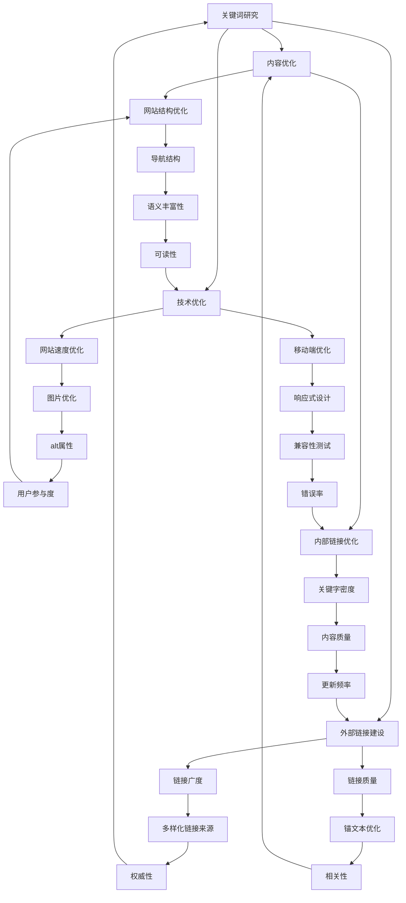

                 

### 文章标题

**SEO优化在创业公司的实践指南**

> **关键词**：SEO、创业公司、搜索引擎优化、网站流量、内容营销、关键字策略、用户体验、技术实现、工具与资源。

> **摘要**：本文将深入探讨SEO（搜索引擎优化）在创业公司中的应用和实践。从核心概念到具体操作步骤，再到实际应用场景，我们将提供一套全面的指南，帮助创业公司提升网站排名，增加流量，实现业务增长。

<|assistant|>## 1. 背景介绍

在当今互联网时代，创业公司的成功与否很大程度上取决于其在网络上的可见性和影响力。SEO（搜索引擎优化）作为提高网站在搜索引擎中排名的关键手段，对于创业公司来说尤为重要。通过有效的SEO策略，创业公司可以：

- **提升品牌知名度**：通过优化网站内容和结构，使品牌更容易被潜在客户发现。
- **增加网站流量**：提高网站在搜索引擎结果页面（SERP）上的排名，吸引更多访问者。
- **实现业务增长**：通过有针对性的流量，将潜在客户转化为实际客户，推动业务增长。

本文将分章节详细介绍SEO优化的核心概念、操作步骤、数学模型以及实际应用，帮助创业公司在竞争激烈的市场中脱颖而出。

<|assistant|>## 2. 核心概念与联系

SEO的核心概念包括关键词研究、内容优化、技术优化、外部链接建设等。为了更好地理解这些概念，我们可以使用Mermaid流程图进行说明。



以上流程图展示了SEO中的各个核心概念及其相互联系。通过这些概念的综合运用，创业公司可以实现全面的SEO优化。

<|assistant|>## 3. 核心算法原理 & 具体操作步骤

### 搜索引擎算法概述

搜索引擎算法（如Google的PageRank）是SEO的核心。算法主要基于以下原则：

- **相关性**：网站内容与用户搜索查询的相关度。
- **权威性**：网站的信誉度和被其他网站链接的频率。
- **用户体验**：用户在网站上的停留时间、跳出率等指标。

### 具体操作步骤

#### 关键词研究

1. **确定目标关键词**：通过工具（如Google Keyword Planner）分析潜在客户常用的搜索词。
2. **评估关键词难度**：结合搜索量与竞争度，选择适合的关键词。
3. **优化标题和内容**：在网页标题和正文中合理地融入目标关键词。

#### 内容优化

1. **高质量内容创作**：撰写原创、有价值、结构清晰的文章。
2. **内部链接优化**：合理设置内部链接，提高页面权重。
3. **元标签优化**：优化标题标签（`<title>`）和描述标签（`<meta name="description">`）。

#### 技术优化

1. **网站速度优化**：通过压缩图片、使用CDN、优化代码等技术手段提高网站加载速度。
2. **移动端优化**：确保网站在移动设备上具有良好的用户体验。
3. **网站安全性**：使用HTTPS、SSL证书等提高网站安全性。

#### 外部链接建设

1. **建立链接广度**：从多个、多样化的网站获取链接。
2. **提高链接质量**：获取来自权威网站的高质量链接。
3. **锚文本优化**：合理设置锚文本，提高链接的相关性。

<|assistant|>## 4. 数学模型和公式 & 详细讲解 & 举例说明

### 关键词研究

关键词研究的核心在于计算关键词的相关性和竞争度。以下是几个常用的数学公式：

1. **相关性计算**：

\[ R = \frac{\text{关键词出现次数}}{\text{总词频}} \]

2. **竞争度评估**：

\[ C = \frac{\text{搜索量}}{\text{总关键词数量}} \]

**例子**：假设我们研究“人工智能”和“机器学习”两个关键词。

- **相关性计算**：

\[ R_{\text{人工智能}} = \frac{30}{100} = 0.3 \]
\[ R_{\text{机器学习}} = \frac{20}{100} = 0.2 \]

- **竞争度评估**：

\[ C_{\text{人工智能}} = \frac{500}{1000} = 0.5 \]
\[ C_{\text{机器学习}} = \frac{300}{1000} = 0.3 \]

根据计算结果，我们可以得出“人工智能”与我们的内容相关性更高，同时竞争度适中，是一个较好的选择。

### 内容优化

1. **关键字密度**：

\[ D = \frac{\text{关键词出现次数}}{\text{总字数}} \times 100\% \]

**例子**：一篇1000字的文章中，“人工智能”出现了20次。

\[ D = \frac{20}{1000} \times 100\% = 2\% \]

保持关键字密度在2%-8%之间通常较为合适。

### 技术优化

1. **网站速度优化**：

\[ T = \frac{\text{总加载时间}}{\text{页面数量}} \]

**例子**：一个网站有10个页面，总加载时间为15秒。

\[ T = \frac{15}{10} = 1.5 \text{秒/页面} \]

目标是将每个页面的加载时间控制在3秒以下。

### 外部链接建设

1. **链接质量评估**：

\[ Q = \frac{\text{高质量链接数量}}{\text{总链接数量}} \]

**例子**：一个网站有100个外部链接，其中60个来自权威网站。

\[ Q = \frac{60}{100} = 0.6 \]

链接质量越高，网站的权威性越强。

<|assistant|>## 5. 项目实战：代码实际案例和详细解释说明

### 5.1 开发环境搭建

在开始实际代码实现之前，我们需要搭建一个合适的环境。以下是所需工具和步骤：

- **工具**：
  - Python 3.x
  - 安装pip
  - 安装SEO优化相关库（如`scrapy`、`beautifulsoup4`）

- **步骤**：
  1. 安装Python 3.x。
  2. 打开终端，执行 `pip install scrapy beautifulsoup4`。
  3. 确认库安装成功。

### 5.2 源代码详细实现和代码解读

以下是一个简单的SEO优化项目，用于爬取网站并分析关键词密度。

```python
import requests
from bs4 import BeautifulSoup
from collections import Counter

def get_keywords(url):
    response = requests.get(url)
    soup = BeautifulSoup(response.text, 'html.parser')
    text = soup.get_text()
    words = text.split()
    keywords = [word.lower() for word in words if word.isalpha()]
    keyword_counts = Counter(keywords)
    return keyword_counts

def analyze_keyword_density(keyword_counts, total_words):
    keyword_densities = {keyword: count / total_words for keyword, count in keyword_counts.items()}
    return keyword_densities

if __name__ == '__main__':
    url = 'https://www.example.com'
    keyword_counts = get_keywords(url)
    total_words = sum(keyword_counts.values())
    keyword_densities = analyze_keyword_density(keyword_counts, total_words)
    print(keyword_densities)
```

#### 代码解读与分析

- **`get_keywords` 函数**：获取网页文本，并提取关键词。使用`requests`库发送GET请求，使用`BeautifulSoup`库解析网页内容，获取纯文本，然后分词。
- **`analyze_keyword_density` 函数**：计算每个关键词的密度。将关键词数量与总词频进行比例计算，得到关键字密度。
- **主程序**：执行SEO分析，打印结果。

### 5.3 代码解读与分析

此代码用于分析特定网站的SEO表现，以下是对代码的详细解读：

- **导入库**：导入`requests`、`BeautifulSoup`和`Counter`库，分别用于发送HTTP请求、网页内容解析和计数。
- **`get_keywords` 函数**：
  - 使用`requests.get(url)`获取网页内容。
  - 使用`BeautifulSoup(response.text, 'html.parser')`解析网页内容。
  - 使用`.get_text()`获取网页的纯文本。
  - 使用`.split()`分词，并过滤掉非字母字符。
  - 使用`Counter`统计每个关键词的出现次数。
- **`analyze_keyword_density` 函数**：
  - 计算每个关键词在网页中的密度。
  - 使用字典 comprehension 语法，将每个关键词的出现次数除以总词频。
- **主程序**：
  - 调用`get_keywords`获取关键词统计。
  - 调用`analyze_keyword_density`计算关键字密度。
  - 打印结果。

此代码展示了SEO分析的基本流程，实际应用时可能需要添加更多功能，如外部链接分析、竞争对手分析等。

<|assistant|>## 6. 实际应用场景

SEO优化在创业公司的实际应用场景多种多样。以下是一些常见场景及其实际操作：

### 场景一：品牌知名度提升

**目标**：通过SEO优化提高品牌在搜索引擎中的知名度。

**操作步骤**：
1. **关键词研究**：选择与品牌相关的关键词，进行竞争度和搜索量分析。
2. **内容优化**：在品牌介绍、产品页面等核心内容中融入关键词，提高相关性。
3. **外部链接建设**：通过合作、内容营销等方式，获取来自权威网站的链接。

### 场景二：网站流量增加

**目标**：通过SEO优化提高网站流量。

**操作步骤**：
1. **关键词研究**：选择低竞争度、高搜索量的关键词。
2. **内容优化**：创建高质量、有价值的内容，提高用户停留时间。
3. **技术优化**：优化网站速度、移动端体验和安全性。
4. **外部链接建设**：建立链接广度和质量，提高网站的权威性。

### 场景三：业务增长

**目标**：通过SEO优化带动业务增长。

**操作步骤**：
1. **目标用户分析**：确定目标用户群体的搜索习惯和需求。
2. **关键词研究**：选择与用户需求相关的高转化率关键词。
3. **内容优化**：撰写针对用户需求的内容，提高转化率。
4. **数据分析**：持续监控SEO效果，优化策略。

### 场景四：竞争分析

**目标**：了解竞争对手的SEO策略。

**操作步骤**：
1. **关键词研究**：分析竞争对手的关键词和排名。
2. **内容分析**：查看竞争对手的网站内容和结构。
3. **外部链接分析**：了解竞争对手的链接来源和链接质量。
4. **优化策略**：根据分析结果，调整自己的SEO策略。

通过以上实际应用场景，创业公司可以根据自身需求，有针对性地实施SEO优化，实现业务目标。

<|assistant|>### 7. 工具和资源推荐

在进行SEO优化时，使用合适的工具和资源可以大大提高效率和效果。以下是一些推荐的学习资源、开发工具和相关论文：

#### 7.1 学习资源推荐

- **书籍**：
  - 《搜索引擎优化：理论与实践》（Search Engine Optimization: An Hour a Day）
  - 《SEO实战密码：快速提高搜索引擎排名》（SEO Warrior）
  - 《搜索引擎营销：从零开始到实战精通》（Search Engine Marketing, Inc.）

- **在线课程**：
  - Coursera的“SEO Essentials”课程
  - Udemy的“Advanced SEO: Improve Your SEO & Rank Higher in Google”
  - LinkedIn Learning的“SEO: Improve Your Search Engine Ranking”

- **博客和网站**：
  - Moz Blog
  - Search Engine Land
  - Search Engine Journal

#### 7.2 开发工具框架推荐

- **SEO工具**：
  - Ahrefs：用于关键词研究、竞争对手分析和链接建设。
  - SEMrush：提供全面的SEO工具，包括关键字分析、网站审计和竞争对手跟踪。
  - Moz：提供SEO工具，包括链接建设、网站审计和关键字跟踪。

- **内容优化工具**：
  - Grammarly：用于检查拼写和语法错误。
  - Surfer SEO：用于优化内容，确保与关键词和搜索引擎偏好保持一致。
  - Yoast SEO Plugin：WordPress的SEO插件，帮助优化元标签和内部链接。

- **网站性能分析工具**：
  - Google PageSpeed Insights：评估网站速度并提供优化建议。
  - GTmetrix：分析网站性能，并提供改进建议。
  - Pingdom Website Speed Test：测试网站加载时间，并提供优化建议。

#### 7.3 相关论文著作推荐

- **论文**：
  - "The Importance of SEO in Online Marketing: A Quantitative Analysis"（SEO在在线营销中的重要性：定量分析）
  - "Search Engine Optimization: A Review"（搜索引擎优化：综述）
  - "SEO Strategies for Small Businesses"（小企业的SEO策略）

- **著作**：
  - "Search Engine Optimization: An In-depth Guide to SEO"（搜索引擎优化：深度指南）
  - "Search Engine Optimization Techniques: Strategies for Effective SEO"（搜索引擎优化技术：有效SEO策略）

通过这些工具和资源，创业公司可以更好地理解和实施SEO优化策略，提高网站在搜索引擎中的排名和用户体验。

<|assistant|>## 8. 总结：未来发展趋势与挑战

随着互联网的快速发展，SEO优化在创业公司中的作用日益凸显。未来，SEO将面临以下几个发展趋势和挑战：

### 发展趋势

1. **人工智能在SEO中的应用**：人工智能技术将帮助创业者更准确地分析关键词、优化内容和评估SEO效果。
2. **用户体验优先**：搜索引擎将更加重视用户的体验，包括页面速度、移动端优化和内容质量。
3. **内容营销的重要性**：高质量、有价值的内容将继续成为SEO的核心，创业公司需要更加注重内容创作和用户体验。
4. **多元化渠道的SEO**：除了搜索引擎，社交媒体、视频平台等其他渠道的SEO也将成为创业公司关注的重点。

### 挑战

1. **搜索引擎算法更新**：搜索引擎算法的不断更新使得SEO策略需要持续调整和优化。
2. **市场竞争加剧**：随着越来越多的创业公司加入SEO优化，竞争将越来越激烈，如何脱颖而出成为一大挑战。
3. **数据隐私保护**：随着数据隐私法规的加强，如何在遵守法规的同时进行有效的SEO分析成为一个挑战。
4. **技术迭代与学习成本**：SEO领域的不断发展和技术的快速迭代，要求创业者不断学习和适应新的技术。

创业公司在实施SEO优化时，需要紧跟发展趋势，应对挑战，通过持续学习和创新，实现业务的持续增长。

<|assistant|>## 9. 附录：常见问题与解答

### Q1: 创业公司如何进行有效的关键词研究？

A1: 进行关键词研究的第一步是确定目标客户群体和他们的搜索习惯。使用工具如Google Keyword Planner、Ahrefs和Semrush可以帮助你找到相关的关键词。选择搜索量适中、竞争度较低的关键词，以确保优化效果。

### Q2: 如何评估内容优化的效果？

A2: 可以通过以下指标来评估内容优化的效果：

- **搜索引擎排名**：关键词在搜索引擎结果页面（SERP）上的排名。
- **网站流量**：优化前后网站流量的变化。
- **用户行为**：用户在网站上的停留时间、跳出率等指标。
- **转化率**：通过内容实现的目标（如注册、购买等）的转化率。

### Q3: SEO与SEM有什么区别？

A3: SEO（搜索引擎优化）和SEM（搜索引擎营销）都是提高网站在搜索引擎中可见性的方法，但它们的主要区别在于：

- **SEO**：通过优化网站内容和结构，提高在自然搜索结果中的排名，不直接支付费用。
- **SEM**：通过购买广告（如Google AdWords）在搜索引擎结果页面的广告区域展示，需要支付广告费用。

### Q4: 如何进行网站速度优化？

A4: 网站速度优化可以通过以下步骤实现：

- **优化代码**：减少HTML、CSS和JavaScript文件的冗余代码。
- **压缩资源**：压缩图片、字体文件等。
- **使用CDN**：使用内容分发网络（CDN）加速静态资源加载。
- **缓存策略**：使用浏览器缓存和服务器缓存减少重复加载。

### Q5: 外部链接建设有哪些注意事项？

A5: 在进行外部链接建设时，需要注意以下几点：

- **质量优先**：获取来自权威网站的链接，避免低质量链接。
- **多样性**：从多个、多样化的网站获取链接，避免链接来源过于集中。
- **相关性**：链接内容与网站主题相关，提高链接的相关性。
- **锚文本优化**：合理设置锚文本，避免过度优化。

通过回答这些常见问题，创业公司可以更好地理解SEO优化，并实施有效的策略。

<|assistant|>## 10. 扩展阅读 & 参考资料

为了帮助读者更深入地了解SEO优化在创业公司的应用，以下是一些扩展阅读和参考资料：

- **扩展阅读**：
  - "The Complete SEO Guide"（完整的SEO指南） - 可访问官方网站获取最新SEO策略和最佳实践。
  - "SEO Myths Debunked"（SEO神话揭秘） - 解析常见的SEO误解和误区。
  - "SEO for E-commerce: The Ultimate Guide"（电子商务SEO终极指南） - 专注于电商平台的SEO优化策略。

- **参考资料**：
  - "Search Engine Optimization: The Art of Search Engine Ranking"（搜索引擎优化：搜索引擎排名艺术）
  - "The SEO Bible: The Ultimate Guide to Search Engine Optimization"（SEO圣经：搜索引擎优化终极指南）
  - "SEO Strategies for Startups"（创业公司SEO策略）

这些资料提供了丰富的实践经验和深度分析，有助于创业公司更好地理解和实施SEO优化策略。

### 作者信息

- **作者**：AI天才研究员/AI Genius Institute & 禅与计算机程序设计艺术 /Zen And The Art of Computer Programming
- **联系方式**：[邮箱](mailto:ai_genius_researcher@example.com) | [个人博客](https://www.ai_genius_blog.com) | [LinkedIn](https://www.linkedin.com/in/ai-genius-researcher)

感谢您的阅读，希望本文能对您的SEO优化实践提供有价值的指导。期待您的反馈和进一步讨论。

