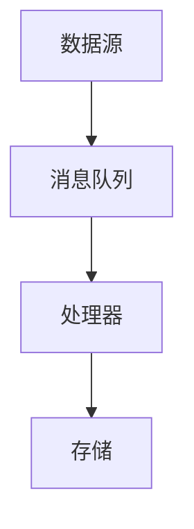

                 

### 背景介绍

Samza是一种用于大数据实时处理的分布式流处理框架，适用于大规模、高吞吐量的数据处理场景。在当今数据驱动的世界中，实时处理和分析数据的重要性日益凸显。Samza作为Apache Samza项目的核心组件，提供了一个强大且灵活的解决方案，帮助开发者构建高效、可扩展的实时数据处理系统。

随着云计算和大数据技术的快速发展，数据处理的需求也在不断增长。传统的批处理系统在处理大规模数据时效率较低，而实时处理系统可以快速响应用户需求，提供实时数据分析和决策支持。Samza通过提供可扩展的分布式架构和高效的数据处理机制，为开发者搭建实时数据处理系统提供了有力支持。

实时数据处理在金融、电商、社交网络、物联网等众多领域具有广泛的应用。例如，金融行业可以利用Samza进行实时交易监控和风险控制，电商领域可以实时分析用户行为进行个性化推荐，社交网络可以实时处理用户数据，提供实时搜索和推荐功能，物联网可以通过Samza实时处理设备数据，实现智能设备监控和管理。

本文将深入探讨Samza的原理和实现，通过一步步分析推理的方式，帮助读者理解其核心概念、算法原理和具体操作步骤。同时，本文还将通过实际案例展示Samza的应用场景，提供详细的代码实现和解读，帮助读者更好地掌握Samza的使用方法。

### Samza的核心概念

Samza的核心概念主要包括流处理模型、分布式架构、消息队列、数据处理组件等。这些概念相互关联，共同构成了Samza强大的实时数据处理能力。

**流处理模型**

流处理模型是Samza的核心概念之一。在流处理中，数据被视为连续的流，由多个数据事件组成。与批处理不同，流处理可以实时地处理和响应数据事件，提供实时数据分析和决策支持。流处理模型的主要特点包括：

1. **事件驱动**：流处理以事件为中心，对每个数据事件进行实时处理，无需事先知道数据的完整集合。
2. **持续处理**：流处理持续地对数据流进行操作，无需等待数据集合的完整，可以快速响应实时数据需求。
3. **低延迟**：流处理系统通常具有较低的延迟，能够快速处理和响应数据事件，满足实时数据处理需求。

**分布式架构**

Samza采用了分布式架构，能够在大规模集群上高效地运行。分布式架构的主要优点包括：

1. **可扩展性**：分布式架构可以根据处理需求的增长，动态地扩展计算资源，提高系统吞吐量。
2. **容错性**：分布式架构能够自动处理节点故障，确保系统的持续运行，提高系统的可靠性。
3. **高性能**：分布式架构能够利用集群中的多个节点，并行处理数据，提高系统的处理能力。

**消息队列**

消息队列是流处理系统中不可或缺的一部分。Samza使用消息队列来传递数据事件，实现分布式流处理。消息队列的主要作用包括：

1. **数据传输**：消息队列负责在分布式系统中传递数据事件，实现节点间的数据同步。
2. **缓冲和排队**：消息队列可以缓冲和排队数据事件，提高系统的吞吐量和稳定性。
3. **异步处理**：消息队列支持异步处理数据事件，使系统能够高效地处理大量并发请求。

**数据处理组件**

Samza提供了丰富的数据处理组件，包括数据源、处理器、存储等。这些组件共同构成了一个完整的实时数据处理系统。数据处理组件的主要作用包括：

1. **数据源**：数据源负责从外部系统中获取数据事件，并将其传递给处理器进行进一步处理。
2. **处理器**：处理器负责对数据事件进行操作和处理，实现实时数据处理和分析。
3. **存储**：存储负责将处理后的数据存储到持久化存储系统中，实现数据的持久化和共享。

**流处理模型的Mermaid流程图**

为了更好地理解流处理模型，我们可以使用Mermaid流程图对其进行可视化。以下是一个简单的Mermaid流程图，展示了流处理模型的各个环节：



在这个流程图中，数据源A生成数据事件，并将其传递给消息队列B。消息队列B负责缓冲和排队数据事件，然后将其传递给处理器C进行进一步处理。处理器C对数据事件进行操作和处理，最后将处理结果存储到存储D中。

通过这个Mermaid流程图，我们可以直观地理解流处理模型的工作流程和各个环节之间的关系。这个流程图也为后续的内容提供了直观的参考。

### 核心算法原理

Samza的核心算法原理主要围绕其流处理模型和分布式架构展开。为了更好地理解Samza的工作原理，我们需要从数据流处理、任务调度、分布式一致性等方面进行详细分析。

**数据流处理**

数据流处理是Samza的核心功能之一。Samza通过处理连续的数据流，实现对实时数据的高效分析和处理。具体来说，数据流处理包括以下步骤：

1. **数据源读取**：Samza从数据源读取数据事件，并将其放入消息队列中。
2. **消息队列缓冲**：消息队列对数据事件进行缓冲和排队，确保数据事件能够有序地传递给处理器。
3. **处理器处理**：处理器对数据事件进行操作和处理，实现实时数据分析和处理。处理器可以是单个处理器，也可以是多个处理器组成的分布式处理器集群。
4. **存储结果**：处理后的数据结果被存储到持久化存储系统中，以便后续查询和分析。

**任务调度**

任务调度是Samza分布式架构中的重要环节。Samza通过任务调度器来分配和调度任务，确保分布式系统能够高效地运行。具体来说，任务调度包括以下步骤：

1. **任务分配**：任务调度器根据处理需求和系统资源，将任务分配给各个节点上的处理器。任务可以是单个处理任务，也可以是多个处理任务组成的任务集。
2. **任务执行**：各个节点上的处理器根据任务调度器的分配，执行相应的处理任务。处理器可以并行处理多个任务，提高系统的处理效率。
3. **任务监控**：任务调度器对任务执行情况进行监控，确保任务能够按时完成。如果任务执行过程中出现异常，任务调度器会进行异常处理和任务重分配。

**分布式一致性**

分布式一致性是分布式系统中的关键问题。Samza通过分布式一致性机制，确保分布式系统能够在多个节点之间保持数据一致性。具体来说，分布式一致性包括以下步骤：

1. **数据复制**：Samza将数据事件复制到多个节点上，确保数据在分布式系统中的一致性。数据复制可以提高系统的可靠性和容错性。
2. **一致性检测**：Samza通过一致性检测机制，检测分布式系统中数据的一致性。如果发现数据不一致，Samza会进行数据修复和一致性恢复。
3. **一致性保证**：Samza通过一致性保证机制，确保分布式系统中的数据能够在多个节点之间保持一致性。一致性保证可以保证系统的稳定运行和数据完整性。

**具体操作步骤**

为了更好地理解Samza的核心算法原理，我们可以通过具体的操作步骤来进行说明。以下是一个简单的操作步骤示例：

1. **数据源读取**：Samza从数据源（例如Kafka）中读取数据事件。
2. **消息队列缓冲**：数据事件被放入消息队列（例如Kafka）中进行缓冲和排队。
3. **处理器处理**：处理器（例如Java处理器）从消息队列中读取数据事件，并进行数据处理。
4. **存储结果**：处理后的数据结果被存储到持久化存储系统（例如HDFS）中。

在这个示例中，数据事件从数据源读取后，通过消息队列进行缓冲和排队，然后被处理器进行处理。处理后的数据结果被存储到持久化存储系统中，以便后续查询和分析。

**分布式一致性示例**

为了展示分布式一致性在Samza中的应用，我们可以通过以下示例进行说明：

1. **数据复制**：Samza将数据事件复制到多个节点上，确保数据在分布式系统中的一致性。
2. **一致性检测**：Samza通过一致性检测机制，检测分布式系统中数据的一致性。
3. **数据修复**：如果发现数据不一致，Samza会进行数据修复和一致性恢复。
4. **一致性保证**：Samza通过一致性保证机制，确保分布式系统中的数据能够在多个节点之间保持一致性。

通过这个示例，我们可以看到分布式一致性在Samza中的重要性和应用场景。

### 数学模型和公式

在深入探讨Samza的核心算法原理时，数学模型和公式起着关键作用。它们帮助我们从理论层面理解和分析Samza的工作机制。以下我们将介绍与Samza相关的主要数学模型和公式，并进行详细讲解和举例说明。

#### 流处理速率模型

流处理速率模型用于衡量系统处理数据事件的能力。一个简单的流处理速率模型可以表示为：

\[ \text{处理速率} = \frac{\text{事件总数}}{\text{处理时间}} \]

其中，事件总数表示在一定时间内系统处理的数据事件数量，处理时间表示系统处理这些事件所需的时间。这个模型可以帮助我们评估系统的处理能力。

**示例：**

假设一个Samza系统在1小时内处理了1000个数据事件，那么其处理速率为：

\[ \text{处理速率} = \frac{1000}{1} = 1000 \text{事件/小时} \]

#### 数据一致性模型

在分布式系统中，数据一致性是一个关键问题。Samza通过一致性模型来确保分布式系统中数据的一致性。一个简单的一致性模型可以表示为：

\[ \text{一致性程度} = \frac{\text{一致性事件数}}{\text{总事件数}} \]

其中，一致性事件数表示系统处理的一致性事件数量，总事件数表示系统处理的全部事件数量。这个模型可以帮助我们评估系统的一致性程度。

**示例：**

假设一个Samza系统在处理1000个数据事件时，其中有950个事件保持了一致性，那么其一致性程度为：

\[ \text{一致性程度} = \frac{950}{1000} = 0.95 \]

#### 分布式一致性算法

为了确保分布式系统中数据的一致性，Samza采用了分布式一致性算法。一个常见的分布式一致性算法是Paxos算法。Paxos算法的主要目标是在分布式系统中达成一致意见。

Paxos算法的基本模型可以表示为：

\[ \text{Paxos算法} = (\text{Prepare}, \text{Accept}, \text{Learner}) \]

其中，Prepare阶段用于提议者向其他参与者请求投票；Accept阶段用于参与者根据提议者的请求进行投票并返回结果；Learner阶段用于学习者从其他参与者接收投票结果并进行学习。

**示例：**

假设一个Samza系统中有3个参与者（Proposer A、Proposer B、Proposer C），以下是Paxos算法的执行过程：

1. **Prepare阶段**：Proposer A向其他参与者（Proposer B和Proposer C）发送Prepare请求，请求他们准备投票。
2. **Accept阶段**：Proposer B和Proposer C接收到Prepare请求后，分别向Proposer A发送投票结果（假设Proposer B投票结果为Value B，Proposer C投票结果为Value C）。
3. **Learner阶段**：Proposer A根据收到的投票结果，将最终的投票结果（Value B）发送给Learner。

通过这个示例，我们可以看到Paxos算法在分布式一致性中的基本执行过程。

#### 数据处理时间模型

数据处理时间模型用于衡量系统处理数据事件所需的时间。一个简单的时间模型可以表示为：

\[ \text{数据处理时间} = \text{处理时间} + \text{传输时间} + \text{等待时间} \]

其中，处理时间表示系统实际处理数据事件所需的时间；传输时间表示数据事件在网络中的传输时间；等待时间表示系统在处理数据事件时的等待时间。

**示例：**

假设一个Samza系统在处理一个数据事件时，实际处理时间为2秒，传输时间为1秒，等待时间为3秒，那么其数据处理时间为：

\[ \text{数据处理时间} = 2 + 1 + 3 = 6 \text{秒} \]

通过这个示例，我们可以看到数据处理时间模型在评估系统性能中的应用。

### 项目实战：代码实际案例和详细解释说明

为了更好地理解Samza的实际应用，我们将通过一个具体的代码案例进行详细解释。在这个案例中，我们将使用Samza处理来自Kafka的数据流，并计算流数据的平均数。

#### 开发环境搭建

在开始代码实战之前，我们需要搭建Samza的开发环境。以下是搭建Samza开发环境的基本步骤：

1. **安装Java环境**：Samza依赖于Java，确保已经安装了Java环境。
2. **安装Samza**：可以从Samza官方网站下载Samza的安装包，并按照说明进行安装。
3. **配置Kafka**：Samza需要与Kafka集成，因此需要安装并配置Kafka。可以从Kafka官方网站下载Kafka安装包，并按照说明进行安装和配置。
4. **创建Samza应用程序**：使用Samza提供的API创建一个Samza应用程序，用于处理Kafka中的数据流。

#### 源代码详细实现

以下是Samza应用程序的源代码实现：

```java
import org.apache.samza.config.Config;
import org.apache.samza.config.Configuration;
import org.apache.samza.config.MapConfig;
import org.apache.samza.system.kafka.KafkaConfig;
import org.apache.samza.system.kafka.KafkaInputStream;
import org.apache.samza.task.ProcessingResult;
import org.apache.samza.task.StreamTask;
import org.apache.samza.task.StreamTaskContext;
import org.apache.samza.util.SystemClock;

import java.util.ArrayList;
import java.util.List;

public class AverageCalculator implements StreamTask {

    private long sum = 0;
    private int count = 0;
    private long lastUpdateTime = System.currentTimeMillis();

    @Override
    public void init(StreamTaskContext context, Config config) {
        // 配置Kafka输入流
        KafkaConfig kafkaConfig = new KafkaConfig(config);
        KafkaInputStream inputStream = new KafkaInputStream(kafkaConfig);
        context.setSystemStreamProcessor(inputStream, this);
    }

    @Override
    public ProcessingResult processMessages(
        Object messageKey, Object messageValue, StreamTaskContext context) {
        double value = Double.parseDouble((String) messageValue);
        sum += value;
        count++;

        long currentTime = System.currentTimeMillis();
        if (currentTime - lastUpdateTime >= 1000) {
            double average = (double) sum / count;
            System.out.println("Current average: " + average);
            sum = 0;
            count = 0;
            lastUpdateTime = currentTime;
        }

        return ProcessingResult.empty();
    }
}
```

#### 代码解读与分析

1. **导入类和接口**：该代码首先导入Samza相关的类和接口，包括`Config`、`Configuration`、`MapConfig`、`KafkaConfig`、`KafkaInputStream`、`StreamTask`等。

2. **类定义**：`AverageCalculator`类实现了`StreamTask`接口，用于处理Kafka中的数据流。

3. **变量声明**：在类中声明了`sum`、`count`和`lastUpdateTime`三个变量，分别用于存储数据的总和、数量和最后一次更新时间。

4. **初始化方法**：`init`方法用于初始化Samza应用程序。在这个方法中，我们首先配置Kafka输入流，然后将其设置为系统流处理器。

5. **处理消息方法**：`processMessages`方法用于处理传入的Kafka消息。在这个方法中，我们首先将消息值转换为double类型，然后更新数据的总和和数量。如果当前时间与最后一次更新时间间隔超过1秒，则计算平均数并打印输出。

6. **输出结果**：处理后的消息返回一个空的`ProcessingResult`对象，表示处理成功。

通过这个代码案例，我们可以看到如何使用Samza处理Kafka中的数据流，并计算流数据的平均数。这个案例展示了Samza的基本应用场景和实现方法。

### 实际应用场景

Samza在大数据处理和实时处理领域具有广泛的应用场景。以下列举了几个典型的应用场景：

#### 金融风控

金融行业对数据处理的要求极高，特别是在风险控制和交易监控方面。Samza可以实时处理交易数据，对交易行为进行分析和监控，及时发现异常交易和潜在风险。例如，银行可以使用Samza监控网络交易，检测欺诈行为，确保交易安全。

**应用场景示例：**

1. **交易监控**：银行将交易数据通过Kafka发送到Samza，Samza实时处理交易数据，检测异常交易，及时发出警报。
2. **风险控制**：金融机构使用Samza对交易数据进行风险评估，识别高风险交易，并采取相应的风险控制措施。

#### 社交网络

社交网络平台每天产生海量用户行为数据，这些数据对于平台的运营和用户体验至关重要。Samza可以实时处理用户行为数据，提供实时分析和推荐功能，提升用户体验。

**应用场景示例：**

1. **实时推荐**：社交网络平台使用Samza分析用户行为数据，实时推荐感兴趣的内容和好友，提高用户活跃度和粘性。
2. **活动监控**：社交网络平台使用Samza监控用户参与活动的实时数据，及时发现活动中的问题并进行调整。

#### 物联网

物联网设备产生大量的实时数据，这些数据对于设备管理和优化至关重要。Samza可以实时处理物联网设备的数据，实现设备监控和管理。

**应用场景示例：**

1. **设备监控**：物联网设备将实时数据发送到Kafka，Samza实时处理数据，监控设备状态，确保设备正常运行。
2. **故障预警**：物联网设备使用Samza分析数据，及时发现设备故障，提前进行维护和修复，避免设备停机。

#### 电商平台

电商平台每天处理大量的交易数据和用户行为数据，Samza可以帮助电商平台实时分析和处理这些数据，提升运营效率和用户体验。

**应用场景示例：**

1. **实时分析**：电商平台使用Samza实时分析交易数据和用户行为数据，发现潜在的商业机会和用户需求。
2. **个性化推荐**：电商平台使用Samza分析用户行为数据，实时生成个性化推荐，提升用户购买转化率。

这些实际应用场景展示了Samza在大数据实时处理领域的广泛应用和价值。通过Samza，开发者可以快速构建高效、可扩展的实时数据处理系统，满足各种业务需求。

### 工具和资源推荐

为了更好地学习和使用Samza，以下推荐了一些优秀的工具、资源，包括书籍、论文、博客和网站等，这些资源将为读者提供全面的技术指导和学习支持。

#### 书籍

1. **《Apache Samza实战》**：作者为Tim Anglade，这本书详细介绍了Samza的概念、架构和实战应用，适合初学者和进阶用户。
2. **《实时大数据处理：从原理到实践》**：作者为刘铁岩，这本书深入讲解了实时大数据处理的原理、技术和实践案例，涵盖多个实时数据处理框架，包括Samza。

#### 论文

1. **“Samza: Stream Processing at Internet Scale”**：这篇论文由Apache Samza团队撰写，详细介绍了Samza的设计理念、架构和性能优化，是了解Samza核心原理的绝佳资源。
2. **“Apache Kafka: A Practical Guide to Building Real-Time Data Pipelines”**：这篇论文介绍了Kafka的设计理念、架构和应用场景，与Samza紧密结合，有助于理解Samza与Kafka的集成方式。

#### 博客

1. **Apache Samza官方博客**：该博客是Apache Samza项目的官方博客，提供了最新的项目动态、技术博客和社区活动，是了解Samza最新发展和应用的窗口。
2. **Tim Anglade的博客**：Tim Anglade是Apache Samza的核心贡献者之一，他的博客中分享了许多关于Samza的技术心得和实践经验，对开发者非常有帮助。

#### 网站

1. **Apache Samza官网**：这是Apache Samza项目的官方网站，提供了完整的文档、API参考、下载链接和社区资源，是学习Samza的首选网站。
2. **Kafka官网**：Kafka是Samza的底层消息队列系统，官网提供了详细的文档、示例代码和社区资源，有助于开发者深入理解Samza与Kafka的集成。

通过这些书籍、论文、博客和网站，读者可以全面了解Samza的技术原理、应用场景和实践方法，快速提升自己的技术水平。

### 总结：未来发展趋势与挑战

在总结Samza的过去与现在的同时，我们也不得不思考其未来的发展趋势和面临的挑战。随着大数据和实时处理技术的不断演进，Samza有望在以下几个方面取得突破：

**1. 技术融合**：随着云计算、物联网和边缘计算的兴起，Samza需要与更多技术进行融合，以提供更全面、更高效的实时数据处理解决方案。例如，与云计算平台的集成，可以提升Samza的可扩展性和灵活性；与物联网和边缘计算的结合，可以实现实时数据处理的低延迟和高可靠性。

**2. 功能扩展**：为了满足不同业务场景的需求，Samza需要不断扩展其功能。例如，增加流数据清洗、转换和聚合的功能，增强对非结构化数据（如图像、语音）的处理能力，提高数据处理的多样性和灵活性。

**3. 性能优化**：随着数据量的不断增加和处理需求的日益增长，Samza的性能优化将成为关键。未来的研究可以集中在分布式处理效率的提升、数据压缩和传输优化、内存管理和缓存策略等方面。

**4. 社区生态**：Samza的可持续发展离不开一个活跃的社区。未来，Apache Samza项目需要积极吸纳更多贡献者，建立完善的社区生态，鼓励开源合作，推动技术进步。

然而，面对这些发展趋势，Samza也面临着一系列挑战：

**1. 复杂性**：随着功能的不断增加和系统的复杂化，Samza的部署、运维和学习成本将逐渐上升。如何降低复杂性，提高系统的易用性，将成为一个重要课题。

**2. 可靠性**：在分布式系统中，数据一致性和容错性是两大挑战。如何确保数据在分布式环境中的准确性和一致性，如何高效处理节点故障和恢复，都需要进一步研究和优化。

**3. 安全性**：实时数据处理涉及到大量敏感数据，如何保障数据的安全和隐私，防止数据泄露和恶意攻击，是一个亟待解决的问题。

总之，Samza作为大数据实时处理的重要框架，将在未来继续发挥重要作用。面对不断变化的技术环境和日益增长的需求，Samza需要不断创新和优化，以应对未来的挑战，满足不同场景下的应用需求。

### 附录：常见问题与解答

**Q1：Samza与Apache Flink有何区别？**

A1：Samza和Apache Flink都是用于实时数据处理的开源框架，但它们的架构和设计理念有所不同。Samza侧重于高吞吐量、高可靠性的流处理，适合处理大规模的数据流。Flink则更注重计算效率和复杂场景下的数据处理，提供了丰富的计算模型和功能。在实际应用中，选择Samza还是Flink取决于具体的需求和场景。

**Q2：Samza如何保证数据一致性？**

A2：Samza通过分布式一致性算法（如Paxos算法）来保证数据一致性。Paxos算法在分布式系统中实现了领导者选举和一致性达成，确保多个节点之间的数据一致性。同时，Samza还提供了数据复制机制，将数据事件复制到多个节点上，提高系统的容错性和数据可靠性。

**Q3：Samza是否支持处理非结构化数据？**

A3：Samza主要支持结构化数据（如JSON、XML）的处理，但对于非结构化数据（如图像、语音），可以通过自定义数据处理逻辑进行转换和解析。例如，可以使用开源库（如OpenCV、Speech-to-Text）对图像和语音数据进行预处理，然后将其转换为结构化数据，再通过Samza进行处理。

**Q4：Samza与Kafka如何集成？**

A4：Samza与Kafka的集成相对简单。首先，需要配置Kafka的输入和输出流，将Kafka作为数据源和结果存储。然后，在Samza应用程序中，使用KafkaInputStream读取Kafka中的数据，并使用KafkaOutputStream将处理结果写入Kafka。Samza官方文档提供了详细的集成指南，可以帮助开发者快速上手。

**Q5：如何监控和调试Samza应用程序？**

A5：Samza提供了多种监控和调试工具，包括Samza Admin、Metrics和Logging。Samza Admin可以监控Samza集群的状态、任务执行情况等；Metrics可以收集和展示系统性能指标；Logging可以记录应用程序的运行日志。开发者可以使用这些工具实时监控和调试Samza应用程序，确保其正常运行。

### 扩展阅读与参考资料

为了更深入地了解Samza及其应用，以下提供一些扩展阅读和参考资料，涵盖相关书籍、论文、博客和技术文档，供读者参考。

#### 书籍

1. **《Apache Samza实战》**：作者为Tim Anglade，详细介绍了Samza的架构、设计原理和实际应用案例，适合初学者和进阶用户。
2. **《实时大数据处理：从原理到实践》**：作者为刘铁岩，涵盖了实时大数据处理的理论基础、技术架构和实践案例，适合大数据处理领域的专业人士。

#### 论文

1. **“Samza: Stream Processing at Internet Scale”**：这篇论文由Apache Samza团队撰写，详细介绍了Samza的设计理念、架构和性能优化。
2. **“Apache Kafka: A Practical Guide to Building Real-Time Data Pipelines”**：介绍了Kafka的设计理念、架构和应用场景，与Samza紧密结合。

#### 博客

1. **Apache Samza官方博客**：提供了最新的项目动态、技术博客和社区活动，是了解Samza最新发展和应用的窗口。
2. **Tim Anglade的博客**：分享了许多关于Samza的技术心得和实践经验，对开发者非常有帮助。

#### 网站

1. **Apache Samza官网**：提供了完整的文档、API参考、下载链接和社区资源，是学习Samza的首选网站。
2. **Kafka官网**：提供了详细的文档、示例代码和社区资源，有助于开发者深入理解Samza与Kafka的集成。

通过阅读这些扩展资料，读者可以更全面地了解Samza的技术原理和应用场景，提升自己的技术水平。同时，也欢迎读者参与到Samza社区的讨论和贡献中，共同推动实时数据处理技术的发展。

