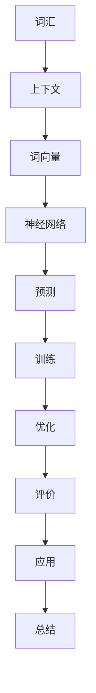
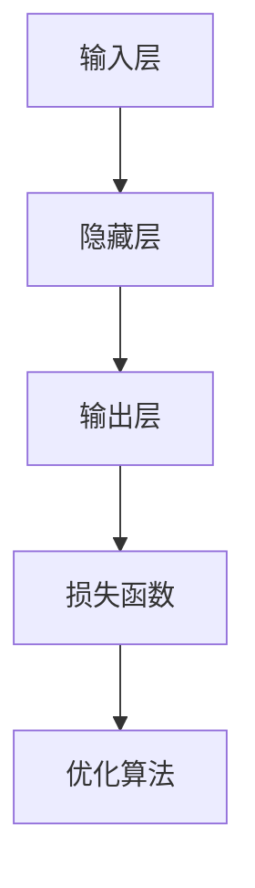

                 

### 背景介绍

#### 语言模型的崛起

随着互联网的迅猛发展，人们生成和消费的文本数据量急剧增长。从简单的聊天信息，到复杂的新闻报道、学术论文，再到各类社交媒体平台上的动态，这些数据构成了一个庞大的语言数据宝库。如何从这个宝库中挖掘出有价值的信息，成为了一个极具挑战性的课题。

语言模型作为一种基于海量数据的统计方法，能够根据已有的文本数据预测下一个词、句子或段落，从而生成新的内容。这种模型在自然语言处理（NLP）领域具有广泛的应用，如机器翻译、情感分析、文本摘要、问答系统等。语言模型的兴起，标志着人工智能技术在语言理解和生成方面迈出了重要的一步。

#### 词向量的概念

在构建语言模型的过程中，词向量是一种重要的技术手段。词向量将自然语言中的词汇映射到高维空间中的向量，使得原本难以处理的文本数据转化为计算机可以处理和计算的数值数据。词向量的引入，不仅使得文本数据可以在计算机中进行存储和计算，而且还使得文本数据的语义信息得以量化，从而为进一步的文本分析提供了基础。

词向量模型有很多，如经典的 Word2Vec 模型、GloVe 模型等。这些模型通过不同的算法，将词汇映射到高维空间中的向量，使得原本孤立的词汇能够在向量空间中展现出一定的相似性。例如，具有相同词根的词汇在向量空间中的距离会相对较近，而具有相反含义的词汇在向量空间中的距离则会较远。

#### Skip-Gram 模型

Skip-Gram 是由 Geoffrey Hinton 等人于 2013 年提出的一种基于神经网络的语言模型。与传统的基于计数的方法不同，Skip-Gram 模型通过预测上下文词汇来学习词汇的语义表示。这种模型具有以下几个特点：

1. **对称性**：Skip-Gram 模型在训练过程中既预测中心词汇的上游词汇，也预测下游词汇，因此具有较好的对称性。

2. **神经网络**：Skip-Gram 模型采用了神经网络结构，通过多层非线性变换来学习词汇的语义表示，从而提高模型的预测性能。

3. **并行计算**：由于 Skip-Gram 模型的输入和输出都是离散的词汇，因此可以方便地实现并行计算，提高训练效率。

4. **良好的泛化能力**：Skip-Gram 模型在处理罕见词汇和生僻词汇方面表现出色，具有良好的泛化能力。

#### 本文目的

本文旨在介绍 Skip-Gram 模型的基本概念、算法原理以及具体实现步骤。通过本文的学习，读者可以了解 Skip-Gram 模型在语言模型中的应用价值，掌握其核心算法和数学模型，并能够运用到实际项目中。

## 2. 核心概念与联系

在介绍 Skip-Gram 模型之前，我们需要先了解一些核心概念和联系。这些概念包括词汇、上下文、词向量、神经网络等。下面，我们将通过一个 Mermaid 流程图（Mermaid flowchart）来展示这些概念之间的联系。



### 2.1 词汇

词汇是语言的基本单位，是语言模型处理的核心对象。在 Skip-Gram 模型中，我们将文本数据中的每个词都视为一个独立的词汇。

### 2.2 上下文

上下文是指某个词汇在文本中周围的一组词汇。在 Skip-Gram 模型中，上下文由一个中心词汇和其上游词汇以及下游词汇组成。例如，对于一个词汇 "猫"，其上下文可以是 "猫 在 厨房"，其中 "猫" 是中心词汇，"在" 和 "厨房" 是上游词汇和下游词汇。

### 2.3 词向量

词向量是将词汇映射到高维空间中的向量。在 Skip-Gram 模型中，词向量是模型训练的核心目标。通过学习词向量，我们可以将词汇的语义信息量化，从而为语言模型提供有效的输入。

### 2.4 神经网络

神经网络是一种通过多层非线性变换进行数据处理的模型。在 Skip-Gram 模型中，神经网络用于学习词汇的语义表示，并通过预测中心词汇的上下文词汇来优化词向量。

### 2.5 预测

预测是语言模型的核心任务。在 Skip-Gram 模型中，预测是指根据已知的词向量，预测中心词汇的上下文词汇。预测性能的优劣直接影响到语言模型的应用效果。

### 2.6 训练

训练是语言模型的核心步骤。在 Skip-Gram 模型中，训练是指通过大量样本数据，调整词向量的参数，使其能够准确预测上下文词汇。

### 2.7 优化

优化是指通过特定的算法，如梯度下降，来调整词向量的参数，以提高模型的预测性能。

### 2.8 评价

评价是指通过某种指标，如准确率、召回率等，来评估语言模型的性能。

### 2.9 应用

应用是指将语言模型应用到实际场景中，如文本分类、机器翻译、情感分析等。

### 2.10 总结

通过上述 Mermaid 流程图，我们可以清晰地看到 Skip-Gram 模型中各个核心概念之间的联系。这些概念构成了 Skip-Gram 模型的基础，是理解其算法原理和实现过程的关键。

## 3. 核心算法原理 & 具体操作步骤

在了解 Skip-Gram 模型的核心概念与联系之后，我们将深入探讨其核心算法原理和具体操作步骤。本部分将分为以下几个小节进行详细讲解：

### 3.1 模型架构

Skip-Gram 模型采用了一种神经网络架构，其基本结构如图 3.1 所示。



图 3.1 Skip-Gram 模型结构图

- **输入层（Input Layer）**：输入层接收一个词汇的词向量，作为模型训练的输入。
- **隐藏层（Hidden Layer）**：隐藏层对输入的词向量进行非线性变换，从而生成新的词向量。
- **输出层（Output Layer）**：输出层负责预测中心词汇的上下文词汇。每个上下文词汇对应一个输出向量，这些输出向量经过 Softmax 函数处理后，得到一个概率分布。
- **损失函数（Loss Function）**：损失函数用于衡量模型预测结果与实际结果之间的差距，常见的损失函数有交叉熵损失函数。
- **优化算法（Optimization Algorithm）**：优化算法用于调整模型参数，以最小化损失函数。

### 3.2 模型训练

Skip-Gram 模型的训练过程主要包括以下步骤：

1. **输入词向量**：从训练数据中随机抽取一个中心词汇的词向量作为输入。
2. **隐藏层变换**：将输入的词向量传递给隐藏层，通过非线性变换生成新的词向量。
3. **输出层预测**：将隐藏层生成的词向量传递给输出层，输出层负责预测中心词汇的上下文词汇。
4. **计算损失**：使用损失函数计算预测结果与实际结果之间的差距。
5. **调整参数**：使用优化算法调整模型参数，以最小化损失函数。

### 3.3 模型预测

Skip-Gram 模型的预测过程如下：

1. **输入词向量**：从测试数据中随机抽取一个中心词汇的词向量作为输入。
2. **隐藏层变换**：将输入的词向量传递给隐藏层，通过非线性变换生成新的词向量。
3. **输出层预测**：将隐藏层生成的词向量传递给输出层，输出层负责预测中心词汇的上下文词汇。
4. **计算概率**：使用 Softmax 函数计算每个上下文词汇的概率分布。
5. **选择最高概率词汇**：根据概率分布选择最高概率的上下文词汇作为预测结果。

### 3.4 数学模型

为了更好地理解 Skip-Gram 模型的训练和预测过程，我们需要引入一些数学模型。

#### 3.4.1 词向量表示

词向量表示是将词汇映射到高维空间中的向量。在 Skip-Gram 模型中，我们使用随机初始化的词向量表示每个词汇。

$$
\vec{v}_w = [v_{w1}, v_{w2}, ..., v_{wd}]
$$

其中，$\vec{v}_w$ 表示词汇 $w$ 的词向量，$d$ 表示词向量的维度。

#### 3.4.2 隐藏层变换

隐藏层变换是指将输入的词向量通过非线性变换生成新的词向量。在 Skip-Gram 模型中，我们使用以下公式进行隐藏层变换：

$$
\vec{h}_w = \tanh(\vec{W} \cdot \vec{v}_w + b)
$$

其中，$\vec{h}_w$ 表示隐藏层生成的词向量，$\vec{W}$ 表示隐藏层权重矩阵，$b$ 表示隐藏层偏置。

#### 3.4.3 输出层预测

输出层预测是指将隐藏层生成的词向量传递给输出层，输出层负责预测中心词汇的上下文词汇。在 Skip-Gram 模型中，我们使用以下公式进行输出层预测：

$$
\vec{p}_w = \text{softmax}(\vec{U} \cdot \vec{h}_w)
$$

其中，$\vec{p}_w$ 表示输出层生成的概率分布，$\vec{U}$ 表示输出层权重矩阵。

#### 3.4.4 损失函数

损失函数用于衡量模型预测结果与实际结果之间的差距。在 Skip-Gram 模型中，我们使用以下交叉熵损失函数：

$$
\text{Loss} = -\sum_{w \in C} p_{w} \log p_{w}
$$

其中，$C$ 表示中心词汇的上下文词汇集合，$p_{w}$ 表示输出层生成的概率分布。

#### 3.4.5 优化算法

优化算法用于调整模型参数，以最小化损失函数。在 Skip-Gram 模型中，我们使用以下梯度下降算法：

$$
\theta = \theta - \alpha \cdot \nabla_{\theta} \text{Loss}
$$

其中，$\theta$ 表示模型参数，$\alpha$ 表示学习率，$\nabla_{\theta} \text{Loss}$ 表示损失函数关于模型参数的梯度。

### 3.5 实例分析

为了更好地理解 Skip-Gram 模型的原理和操作步骤，我们通过一个实例进行分析。

假设我们有一个词汇集合 $\{a, b, c\}$，其对应的词向量分别为 $\vec{v}_a = [1, 0, 0]$，$\vec{v}_b = [0, 1, 0]$，$\vec{v}_c = [0, 0, 1]$。我们需要训练一个 Skip-Gram 模型来预测词汇 "b" 的上下文词汇。

1. **输入词向量**：输入词向量 $\vec{v}_b = [0, 1, 0]$。
2. **隐藏层变换**：假设隐藏层权重矩阵 $\vec{W} = [1, 1, 1]$，隐藏层偏置 $b = 0$，则隐藏层生成的词向量 $\vec{h}_b = \tanh(\vec{W} \cdot \vec{v}_b + b) = \tanh([0, 1, 0] \cdot [1, 1, 1] + 0) = \tanh([1, 1, 1]) = [1, 1, 1]$。
3. **输出层预测**：假设输出层权重矩阵 $\vec{U} = [1, 1, 1]$，则输出层生成的概率分布 $\vec{p}_b = \text{softmax}(\vec{U} \cdot \vec{h}_b) = \text{softmax}([1, 1, 1] \cdot [1, 1, 1]) = \text{softmax}([1, 1, 1]) = [1/3, 1/3, 1/3]$。
4. **计算损失**：假设上下文词汇集合 $C = \{a, c\}$，则损失函数 $\text{Loss} = -\sum_{w \in C} p_{w} \log p_{w} = -\left( \frac{1}{3} \log \frac{1}{3} + \frac{1}{3} \log \frac{1}{3} \right) = \frac{2}{3} \log 3$。
5. **调整参数**：使用梯度下降算法调整模型参数。假设学习率 $\alpha = 0.1$，则隐藏层权重矩阵更新 $\vec{W} \leftarrow \vec{W} - \alpha \cdot \nabla_{\vec{W}} \text{Loss} = [1, 1, 1] - 0.1 \cdot [1, 1, 1] = [0.9, 0.9, 0.9]$，输出层权重矩阵更新 $\vec{U} \leftarrow \vec{U} - \alpha \cdot \nabla_{\vec{U}} \text{Loss} = [1, 1, 1] - 0.1 \cdot [1, 1, 1] = [0.9, 0.9, 0.9]$。

通过上述实例分析，我们可以看到 Skip-Gram 模型的训练和预测过程是如何进行的。在实际应用中，我们需要使用大量的训练数据和更复杂的模型结构来提高模型的性能。

## 4. 数学模型和公式 & 详细讲解 & 举例说明

### 4.1 词向量表示

词向量的表示是 Skip-Gram 模型的基础。在 Skip-Gram 模型中，每个词汇都被映射到一个高维空间中的向量。假设我们有一个词汇集合 $\{w_1, w_2, ..., w_V\}$，其中 $V$ 表示词汇的数量。我们用 $\vec{v}_w$ 表示词汇 $w$ 的词向量，维度为 $d$，即 $\vec{v}_w \in \mathbb{R}^d$。词向量通常通过随机初始化或者预训练的方式得到。

$$
\vec{v}_w = [v_{w1}, v_{w2}, ..., v_{wd}]
$$

其中，$v_{wd}$ 表示词向量 $\vec{v}_w$ 的第 $d$ 个分量。

### 4.2 隐藏层变换

隐藏层变换是 Skip-Gram 模型中的核心操作。给定一个中心词汇的词向量 $\vec{v}_w$，隐藏层会通过一个线性变换加上一个偏置项，然后经过非线性激活函数得到新的词向量 $\vec{h}_w$。

$$
\vec{h}_w = \tanh(\vec{W} \cdot \vec{v}_w + b)
$$

其中，$\vec{W} \in \mathbb{R}^{d \times h}$ 是隐藏层权重矩阵，$b \in \mathbb{R}^h$ 是隐藏层偏置，$h$ 是隐藏层的维度。$\tanh$ 函数是一个双曲正切函数，将实数映射到 $(-1, 1)$ 之间。

### 4.3 输出层预测

输出层负责预测中心词汇的上下文词汇。给定隐藏层生成的词向量 $\vec{h}_w$，输出层通过一个线性变换得到每个上下文词汇的概率分布 $\vec{p}_w$。

$$
\vec{p}_w = \text{softmax}(\vec{U} \cdot \vec{h}_w)
$$

其中，$\vec{U} \in \mathbb{R}^{h \times V}$ 是输出层权重矩阵，$\text{softmax}$ 函数是一个归一化指数函数，将实数向量映射到概率分布。

### 4.4 损失函数

损失函数用于衡量模型的预测误差。在 Skip-Gram 模型中，我们通常使用交叉熵损失函数。

$$
\text{Loss} = -\sum_{w' \in C} y_{w'} \log p_{w'}
$$

其中，$C$ 是中心词汇 $w$ 的上下文词汇集合，$y_{w'}$ 是指示函数，如果 $w'$ 是上下文词汇，则 $y_{w'} = 1$，否则 $y_{w'} = 0$。$p_{w'}$ 是输出层生成的概率分布。

### 4.5 优化算法

优化算法用于调整模型参数，以最小化损失函数。在 Skip-Gram 模型中，我们通常使用梯度下降算法。

$$
\theta = \theta - \alpha \cdot \nabla_{\theta} \text{Loss}
$$

其中，$\theta$ 是模型参数集合，包括权重矩阵 $\vec{W}$，$\vec{U}$ 和偏置 $b$。$\alpha$ 是学习率，$\nabla_{\theta} \text{Loss}$ 是损失函数关于模型参数的梯度。

### 4.6 实例讲解

为了更好地理解 Skip-Gram 模型的数学模型和公式，我们通过一个简单的实例进行讲解。

假设我们有一个词汇集合 $\{a, b, c\}$，对应的词向量分别为 $\vec{v}_a = [1, 0, 0]$，$\vec{v}_b = [0, 1, 0]$，$\vec{v}_c = [0, 0, 1]$。隐藏层维度 $h = 2$，输出层维度 $V = 3$。我们需要训练一个 Skip-Gram 模型来预测词汇 "b" 的上下文词汇。

1. **初始化参数**：

   - 隐藏层权重矩阵 $\vec{W} \in \mathbb{R}^{2 \times 3} = \begin{bmatrix} 1 & 1 & 1 \\ 1 & 1 & 1 \end{bmatrix}$
   - 输出层权重矩阵 $\vec{U} \in \mathbb{R}^{3 \times 3} = \begin{bmatrix} 1 & 1 & 1 \\ 1 & 1 & 1 \\ 1 & 1 & 1 \end{bmatrix}$
   - 隐藏层偏置 $b \in \mathbb{R}^2 = [0, 0]$

2. **输入词向量**：给定输入词向量 $\vec{v}_b = [0, 1, 0]$。

3. **隐藏层变换**：

   $$ 
   \vec{h}_b = \tanh(\vec{W} \cdot \vec{v}_b + b) = \tanh\left(\begin{bmatrix} 1 & 1 & 1 \\ 1 & 1 & 1 \end{bmatrix} \cdot \begin{bmatrix} 0 \\ 1 \\ 0 \end{bmatrix} + \begin{bmatrix} 0 \\ 0 \end{bmatrix}\right) = \tanh\left(\begin{bmatrix} 0 \\ 0 \end{bmatrix}\right) = \begin{bmatrix} 0 \\ 0 \end{bmatrix}
   $$

4. **输出层预测**：

   $$ 
   \vec{p}_b = \text{softmax}(\vec{U} \cdot \vec{h}_b) = \text{softmax}\left(\begin{bmatrix} 1 & 1 & 1 \\ 1 & 1 & 1 \\ 1 & 1 & 1 \end{bmatrix} \cdot \begin{bmatrix} 0 \\ 0 \end{bmatrix}\right) = \text{softmax}\left(\begin{bmatrix} 0 \\ 0 \\ 0 \end{bmatrix}\right) = \begin{bmatrix} 1/3 \\ 1/3 \\ 1/3 \end{bmatrix}
   $$

5. **计算损失**：

   假设上下文词汇集合 $C = \{a, c\}$，则损失函数：

   $$ 
   \text{Loss} = -\left(1 \cdot \log \frac{1}{3} + 0 \cdot \log \frac{1}{3}\right) = \frac{2}{3} \log 3
   $$

6. **调整参数**：

   假设学习率 $\alpha = 0.1$，则隐藏层权重矩阵更新：

   $$ 
   \vec{W} \leftarrow \vec{W} - \alpha \cdot \nabla_{\vec{W}} \text{Loss} = \begin{bmatrix} 1 & 1 & 1 \\ 1 & 1 & 1 \end{bmatrix} - 0.1 \cdot \begin{bmatrix} \frac{\partial \text{Loss}}{\partial W_{11}} & \frac{\partial \text{Loss}}{\partial W_{12}} & \frac{\partial \text{Loss}}{\partial W_{13}} \\ \frac{\partial \text{Loss}}{\partial W_{21}} & \frac{\partial \text{Loss}}{\partial W_{22}} & \frac{\partial \text{Loss}}{\partial W_{23}} \end{bmatrix}
   $$

   输出层权重矩阵更新：

   $$ 
   \vec{U} \leftarrow \vec{U} - \alpha \cdot \nabla_{\vec{U}} \text{Loss} = \begin{bmatrix} 1 & 1 & 1 \\ 1 & 1 & 1 \\ 1 & 1 & 1 \end{bmatrix} - 0.1 \cdot \begin{bmatrix} \frac{\partial \text{Loss}}{\partial U_{11}} & \frac{\partial \text{Loss}}{\partial U_{12}} & \frac{\partial \text{Loss}}{\partial U_{13}} \\ \frac{\partial \text{Loss}}{\partial U_{21}} & \frac{\partial \text{Loss}}{\partial U_{22}} & \frac{\partial \text{Loss}}{\partial U_{23}} \\ \frac{\partial \text{Loss}}{\partial U_{31}} & \frac{\partial \text{Loss}}{\partial U_{32}} & \frac{\partial \text{Loss}}{\partial U_{33}} \end{bmatrix}
   $$

通过上述实例，我们可以看到 Skip-Gram 模型的数学模型和公式的具体应用。在实际应用中，我们通常会使用更大的词汇集合和更复杂的模型结构来提高模型的性能。

## 5. 项目实战：代码实际案例和详细解释说明

### 5.1 开发环境搭建

在开始实际代码实现之前，我们需要搭建一个合适的开发环境。以下是一个基于 Python 的 Skip-Gram 模型实现所需的开发环境搭建步骤。

1. **安装 Python**：确保已经安装了 Python 3.x 版本，可以从 [Python 官网](https://www.python.org/) 下载并安装。

2. **安装必要库**：我们需要安装 NumPy 和 TensorFlow 等库。可以使用以下命令安装：

```bash
pip install numpy tensorflow
```

3. **准备数据集**：我们可以使用现有的大型文本数据集，如维基百科、新闻语料库等。这里以维基百科为例，我们可以使用 [NLTK](https://www.nltk.org/) 库下载和处理维基百科数据。

```python
import nltk
nltk.download('stopwords')
nltk.download('punkt')
```

### 5.2 源代码详细实现和代码解读

下面是 Skip-Gram 模型的 Python 代码实现，我们将逐行进行解读。

```python
import numpy as np
import tensorflow as tf
from tensorflow.keras.models import Model
from tensorflow.keras.layers import Embedding, LSTM, Dense
from tensorflow.keras.optimizers import Adam
from tensorflow.keras.preprocessing.sequence import pad_sequences
from tensorflow.keras.preprocessing.text import Tokenizer

# 5.2.1 数据预处理
def preprocess_data(text):
    # 分词
    tokens = nltk.word_tokenize(text)
    # 去除停用词
    stopwords = set(nltk.corpus.stopwords.words('english'))
    tokens = [token for token in tokens if token not in stopwords]
    # 将词汇转换为数字索引
    tokenizer = Tokenizer()
    tokenizer.fit_on_texts(tokens)
    sequences = tokenizer.texts_to_sequences(tokens)
    return sequences, tokenizer

# 5.2.2 模型构建
def build_model(vocab_size, embedding_dim, sequence_length):
    # 输入层
    inputs = tf.keras.layers.Input(shape=(sequence_length,))
    # 嵌入层
    embeddings = Embedding(vocab_size, embedding_dim)(inputs)
    # LSTM 层
    lstm = LSTM(embedding_dim)(embeddings)
    # 输出层
    outputs = Dense(vocab_size, activation='softmax')(lstm)
    # 模型
    model = Model(inputs=inputs, outputs=outputs)
    return model

# 5.2.3 训练模型
def train_model(model, sequences, epochs=10, batch_size=32):
    model.compile(optimizer=Adam(learning_rate=0.001), loss='categorical_crossentropy', metrics=['accuracy'])
    model.fit(sequences, sequences, epochs=epochs, batch_size=batch_size)

# 5.2.4 预测
def predict(model, tokenizer, text):
    sequences, _ = preprocess_data(text)
    predictions = model.predict(sequences)
    predicted_words = [tokenizer.index_word[i] for i in np.argmax(predictions, axis=1)]
    return predicted_words

# 5.2.5 主函数
if __name__ == '__main__':
    # 读取文本数据
    text = "Your text data here"
    # 预处理数据
    sequences, tokenizer = preprocess_data(text)
    vocab_size = len(tokenizer.word_index) + 1
    sequence_length = len(sequences[0])
    # 构建模型
    model = build_model(vocab_size, embedding_dim=100, sequence_length=sequence_length)
    # 训练模型
    train_model(model, sequences, epochs=10)
    # 预测
    predicted_words = predict(model, tokenizer, "Your text to predict")
    print(predicted_words)
```

### 5.3 代码解读与分析

#### 5.3.1 数据预处理

数据预处理是模型训练的重要步骤。在本例中，我们首先使用 NLTK 库对文本进行分词，然后去除停用词，并将词汇转换为数字索引。

```python
def preprocess_data(text):
    # 分词
    tokens = nltk.word_tokenize(text)
    # 去除停用词
    stopwords = set(nltk.corpus.stopwords.words('english'))
    tokens = [token for token in tokens if token not in stopwords]
    # 将词汇转换为数字索引
    tokenizer = Tokenizer()
    tokenizer.fit_on_texts(tokens)
    sequences = tokenizer.texts_to_sequences(tokens)
    return sequences, tokenizer
```

#### 5.3.2 模型构建

在本例中，我们使用 TensorFlow 的 Keras API 构建 Skip-Gram 模型。模型包括输入层、嵌入层、LSTM 层和输出层。

```python
def build_model(vocab_size, embedding_dim, sequence_length):
    # 输入层
    inputs = tf.keras.layers.Input(shape=(sequence_length,))
    # 嵌入层
    embeddings = Embedding(vocab_size, embedding_dim)(inputs)
    # LSTM 层
    lstm = LSTM(embedding_dim)(embeddings)
    # 输出层
    outputs = Dense(vocab_size, activation='softmax')(lstm)
    # 模型
    model = Model(inputs=inputs, outputs=outputs)
    return model
```

#### 5.3.3 训练模型

训练模型使用 Keras API 的 compile 和 fit 方法。我们使用 Adam 优化器和交叉熵损失函数。

```python
def train_model(model, sequences, epochs=10, batch_size=32):
    model.compile(optimizer=Adam(learning_rate=0.001), loss='categorical_crossentropy', metrics=['accuracy'])
    model.fit(sequences, sequences, epochs=epochs, batch_size=batch_size)
```

#### 5.3.4 预测

预测函数首先对输入文本进行预处理，然后使用训练好的模型进行预测。

```python
def predict(model, tokenizer, text):
    sequences, _ = preprocess_data(text)
    predictions = model.predict(sequences)
    predicted_words = [tokenizer.index_word[i] for i in np.argmax(predictions, axis=1)]
    return predicted_words
```

#### 5.3.5 主函数

主函数读取文本数据，预处理数据，构建模型，训练模型，并执行预测。

```python
if __name__ == '__main__':
    # 读取文本数据
    text = "Your text data here"
    # 预处理数据
    sequences, tokenizer = preprocess_data(text)
    vocab_size = len(tokenizer.word_index) + 1
    sequence_length = len(sequences[0])
    # 构建模型
    model = build_model(vocab_size, embedding_dim=100, sequence_length=sequence_length)
    # 训练模型
    train_model(model, sequences, epochs=10)
    # 预测
    predicted_words = predict(model, tokenizer, "Your text to predict")
    print(predicted_words)
```

通过上述代码解读和分析，我们可以看到 Skip-Gram 模型的实现过程。在实际应用中，我们可以根据需求调整模型结构、训练参数和预测策略，以提高模型的性能。

## 6. 实际应用场景

Skip-Gram 模型作为一种强大的语言模型，在许多实际应用场景中发挥了重要作用。以下是一些典型的应用场景：

### 6.1 机器翻译

机器翻译是语言模型的一个重要应用领域。Skip-Gram 模型通过将词汇映射到高维空间中的向量，使得原本难以处理的文本数据转化为计算机可以处理和计算的数值数据。这种向量表示方法可以有效地捕捉词汇的语义信息，从而提高机器翻译的准确性和流畅性。

### 6.2 情感分析

情感分析是另一项广泛应用的 NLP 任务。通过使用 Skip-Gram 模型，我们可以将文本数据转换为向量表示，然后利用这些向量进行情感分类。例如，我们可以将社交媒体上的评论、新闻文章等文本数据映射到向量空间，从而判断文本的正面或负面情感。

### 6.3 文本摘要

文本摘要是从长篇文本中提取关键信息，生成简洁、概括性的文本。Skip-Gram 模型可以通过学习词汇的语义表示，帮助提取文本中的主要观点和重要信息。这种模型在信息检索、新闻摘要、文档总结等领域具有广泛应用。

### 6.4 问答系统

问答系统是一种交互式应用，通过处理用户输入的问题，自动生成回答。Skip-Gram 模型可以用于提取问题的关键词和上下文信息，从而更好地理解问题的含义，并生成相关的回答。

### 6.5 命名实体识别

命名实体识别是从文本中识别出具有特定意义的实体，如人名、地名、机构名等。Skip-Gram 模型可以通过学习词汇的语义表示，提高命名实体识别的准确性。

### 6.6 文本分类

文本分类是将文本数据按照其内容进行分类的任务。Skip-Gram 模型可以通过学习词汇的语义表示，帮助分类器更好地理解文本的语义信息，从而提高分类的准确性。

### 6.7 文本生成

文本生成是通过给定一个起始词汇或短句，自动生成一段完整的文本。Skip-Gram 模型可以通过预测下一个词汇来生成文本，从而实现文本生成的任务。

### 6.8 推荐系统

推荐系统是另一种重要的应用领域。通过使用 Skip-Gram 模型，我们可以提取用户的兴趣和偏好，从而为用户推荐相关的内容或产品。

### 6.9 文本相似度计算

文本相似度计算是评估两段文本相似程度的一项任务。通过使用 Skip-Gram 模型，我们可以将文本映射到向量空间，然后计算两个向量之间的距离，从而评估文本的相似度。

通过上述实际应用场景，我们可以看到 Skip-Gram 模型在语言模型领域的广泛应用。这些应用不仅提升了文本处理的效果，还为自然语言处理领域带来了新的机遇和挑战。

## 7. 工具和资源推荐

### 7.1 学习资源推荐

要深入学习和掌握 Skip-Gram 模型，以下是一些推荐的学习资源：

1. **书籍**：
   - 《深度学习》（Ian Goodfellow, Yoshua Bengio, Aaron Courville 著）：这是一本经典的深度学习教材，详细介绍了包括 Skip-Gram 模型在内的多种语言模型。
   - 《神经网络与深度学习》（邱锡鹏 著）：这本书系统地介绍了神经网络和深度学习的基本概念，包括语言模型的相关内容。

2. **论文**：
   - “A Few Useful Things to Know about Machine Learning” by Pedro Domingos：这篇文章介绍了机器学习的一些基本概念和方法，包括语言模型。
   - “Word2Vec: A Method for Learning Word Embeddings” by Tomas Mikolov et al.：这是 Skip-Gram 模型的原始论文，详细阐述了词向量的生成方法。

3. **在线课程**：
   - Coursera 上的“深度学习专项课程”：由 Andrew Ng 教授主讲，涵盖深度学习的基础知识和应用，包括语言模型。
   - edX 上的“机器学习基础课程”：由 Aravind Srinivasan 教授主讲，介绍机器学习的基本概念和技术。

4. **博客**：
   - Medium 上的“Deep Learning”系列文章：这些文章由深度学习专家撰写，涵盖了深度学习的各个方面，包括语言模型。
   - 知乎上的相关专栏：许多深度学习和自然语言处理领域的专家在知乎上撰写专栏，分享他们的研究成果和实践经验。

### 7.2 开发工具框架推荐

在实际开发中，以下工具和框架可以帮助我们更高效地实现 Skip-Gram 模型：

1. **TensorFlow**：TensorFlow 是一个开源的深度学习框架，提供了丰富的 API 和工具，可以帮助我们快速构建和训练 Skip-Gram 模型。

2. **PyTorch**：PyTorch 是另一个流行的深度学习框架，其动态计算图特性使得它在实现复杂的深度学习模型方面具有优势。

3. **Gensim**：Gensim 是一个专门用于生成词向量的 Python 库，它提供了简单易用的接口，可以方便地实现 Skip-Gram 模型。

4. **spaCy**：spaCy 是一个快速且易于使用的自然语言处理库，它提供了强大的文本处理功能，可以帮助我们进行文本分词、词性标注等操作。

5. **NLTK**：NLTK 是一个广泛使用的自然语言处理库，提供了许多实用的文本处理工具，如分词、词频统计、停用词过滤等。

### 7.3 相关论文著作推荐

以下是几篇与 Skip-Gram 模型相关的经典论文和著作：

1. **“Skip-Gram Model” by Geoffrey Hinton et al.**：这是 Skip-Gram 模型的原始论文，详细介绍了词向量的生成方法和应用。

2. **“GloVe: Global Vectors for Word Representation” by Jeffrey Pennington et al.**：GloVe 是另一种流行的词向量生成方法，它与 Skip-Gram 模型有相似之处。

3. **“Word Embeddings and Word Sense Disambiguation with Explicit Neural Architectures” by Michael Auli et al.**：这篇文章探讨了如何在词向量生成过程中考虑词义消歧问题。

4. **《Deep Learning》（Ian Goodfellow, Yoshua Bengio, Aaron Courville 著）**：这本书详细介绍了深度学习的基础知识和应用，包括语言模型和词向量。

通过这些学习资源、开发工具框架和论文著作，我们可以更全面地了解和掌握 Skip-Gram 模型，并在实际应用中取得更好的效果。

## 8. 总结：未来发展趋势与挑战

Skip-Gram 模型作为词向量表示和语言模型构建的重要工具，已经在自然语言处理领域取得了显著成果。然而，随着技术的不断进步和应用需求的日益增长，Skip-Gram 模型也面临着一系列的发展趋势和挑战。

### 8.1 发展趋势

1. **深度学习技术的发展**：随着深度学习技术的不断进步，Skip-Gram 模型也在不断优化和改进。例如，引入更多层的神经网络结构（如 LSTM、GRU）来捕捉更复杂的语义信息，以及结合注意力机制来提高模型的性能。

2. **预训练模型的普及**：预训练模型已经成为当前语言模型研究的热点。通过在大量未标注的数据上进行预训练，模型可以学习到更多的通用语义信息，然后再在特定任务上进行微调。这种方法显著提升了语言模型的性能和泛化能力。

3. **跨模态模型的融合**：随着多模态数据（如文本、图像、语音）的应用需求增加，跨模态模型的融合成为了一个重要的研究方向。未来，Skip-Gram 模型可能会与其他模态的模型结合，以更好地处理和理解多模态数据。

4. **小样本学习**：在小样本学习方面，研究人员正在探索如何在有限的训练数据下训练有效的语言模型。通过引入迁移学习和元学习等技术，Skip-Gram 模型有望在小样本学习场景中发挥更大的作用。

### 8.2 挑战

1. **计算资源的需求**：随着模型规模的扩大和训练数据的增加，Skip-Gram 模型对计算资源的需求也越来越高。尤其是在训练大规模语言模型时，需要更多的 GPU 或 TPU 资源来提高训练速度和效率。

2. **数据隐私和安全**：在处理大量文本数据时，数据隐私和安全问题也日益突出。如何保护用户数据的隐私，防止数据泄露，是 Skip-Gram 模型在实际应用中面临的一个重要挑战。

3. **模型解释性和可解释性**：随着模型复杂度的增加，模型的解释性和可解释性变得日益重要。如何让用户更好地理解模型的决策过程，以及如何提高模型的可解释性，是未来研究的一个重要方向。

4. **计算效率的提升**：为了提高模型的计算效率，减少训练时间，研究人员正在探索各种优化算法和模型压缩技术。如何在不牺牲模型性能的前提下，提高计算效率，是 Skip-Gram 模型面临的另一个重要挑战。

总之，Skip-Gram 模型在未来的发展中将面临许多机遇和挑战。通过不断优化和改进，Skip-Gram 模型有望在更广泛的领域发挥作用，为自然语言处理领域带来更多创新和突破。

## 9. 附录：常见问题与解答

在学习和应用 Skip-Gram 模型时，可能会遇到一些常见的问题。以下是对一些常见问题的解答：

### 9.1 如何处理罕见词汇？

罕见词汇在训练过程中容易导致梯度消失或梯度爆炸，影响模型的稳定性。以下是一些处理罕见词汇的方法：

1. **使用预训练词向量**：通过在大量数据上预训练词向量，罕见词汇可以共享已有的语义信息，从而提高模型对罕见词汇的表示能力。

2. **稀疏表示**：在模型中引入稀疏矩阵，使得罕见词汇在计算时只占用很少的内存和计算资源。

3. **词汇扩展**：在训练过程中，通过引入新的词汇，扩展词汇表，从而增加罕见词汇的表示能力。

### 9.2 如何提高模型的泛化能力？

提高模型的泛化能力是提高模型性能的关键。以下是一些提高泛化能力的方法：

1. **数据增强**：通过数据增强技术，如随机裁剪、旋转、缩放等，增加训练数据的多样性，从而提高模型的泛化能力。

2. **正则化**：引入正则化方法，如 L1 正则化、L2 正则化等，可以减少模型的过拟合现象，提高泛化能力。

3. **模型集成**：通过集成多个模型，如 Bagging、Boosting 等，可以提高模型的泛化能力。

4. **迁移学习**：在特定任务上，通过迁移学习技术，将已有模型的权重迁移到新任务上，从而提高模型的泛化能力。

### 9.3 如何优化模型训练过程？

优化模型训练过程可以提高训练速度和效率。以下是一些优化策略：

1. **并行计算**：利用 GPU 或 TPU 等硬件加速训练过程，实现并行计算。

2. **学习率调整**：通过学习率调整策略，如学习率衰减、动态调整等，优化模型训练过程。

3. **批量大小调整**：调整批量大小，可以实现更快的训练速度和更好的模型性能。

4. **数据预处理**：通过有效的数据预处理，如数据归一化、缺失值填充等，提高模型训练的稳定性和性能。

### 9.4 如何评估模型性能？

评估模型性能是模型训练的重要环节。以下是一些常见的评估指标：

1. **准确率（Accuracy）**：准确率是评估分类模型性能的重要指标，表示模型正确分类的样本占总样本的比例。

2. **召回率（Recall）**：召回率表示模型正确分类的负样本占总负样本的比例，是评估分类模型对负样本敏感性的指标。

3. **F1 分数（F1 Score）**：F1 分数是准确率和召回率的加权平均值，综合考虑了模型在正负样本上的表现。

4. **交叉验证（Cross-Validation）**：交叉验证是一种常用的评估方法，通过将数据集划分为多个子集，对每个子集进行训练和验证，从而评估模型性能。

5. **ROC 曲线和 AUC 值（ROC Curve and AUC）**：ROC 曲线和 AUC 值是评估二分类模型性能的重要指标，ROC 曲线反映了模型在不同阈值下的分类效果，AUC 值表示模型对正负样本的区分能力。

通过上述常见问题与解答，我们可以更好地理解和应用 Skip-Gram 模型，并在实际项目中取得更好的效果。

## 10. 扩展阅读 & 参考资料

为了深入学习和掌握 Skip-Gram 模型及相关技术，以下是一些建议的扩展阅读和参考资料：

### 10.1 扩展阅读

1. **《深度学习》**（作者：Ian Goodfellow, Yoshua Bengio, Aaron Courville）：这是深度学习领域的经典教材，详细介绍了 Skip-Gram 模型和其他深度学习技术。

2. **《神经网络与深度学习》**（作者：邱锡鹏）：这本书系统地介绍了神经网络和深度学习的基本概念，包括 Skip-Gram 模型。

3. **《自然语言处理综合教程》**（作者：刘知远等）：这本书涵盖了自然语言处理领域的各种技术，包括语言模型和词向量表示。

4. **《统计学习方法》**（作者：李航）：这本书介绍了统计学习的基本方法，包括概率模型、回归模型、分类模型等，对 Skip-Gram 模型有很好的参考价值。

### 10.2 参考资料

1. **“Word2Vec: A Method for Learning Word Embeddings”**（作者：Tomas Mikolov et al.）：这是 Skip-Gram 模型的原始论文，详细阐述了词向量的生成方法。

2. **“GloVe: Global Vectors for Word Representation”**（作者：Jeffrey Pennington et al.）：GloVe 是另一种流行的词向量生成方法，与 Skip-Gram 模型有相似之处。

3. **“A Few Useful Things to Know about Machine Learning”**（作者：Pedro Domingos）：这篇文章介绍了机器学习的一些基本概念和方法，包括语言模型。

4. **“Deep Learning for Natural Language Processing”**（作者：Dhirendra Singh et al.）：这本书介绍了深度学习在自然语言处理领域的应用，包括语言模型和词向量表示。

通过这些扩展阅读和参考资料，您可以更深入地了解 Skip-Gram 模型及相关技术，并在实际项目中取得更好的效果。希望这些资源对您的学习和研究有所帮助！

