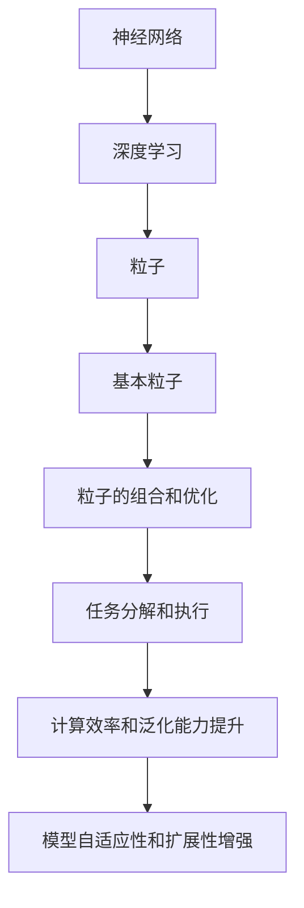

                 

# Sora模型的基本粒子化技术

## 关键词：Sora模型、粒子化技术、人工智能、神经网络、深度学习

## 摘要：
本文将深入探讨Sora模型的基本粒子化技术。Sora模型作为一种先进的深度学习模型，在人工智能领域取得了显著成果。本文将从背景介绍、核心概念、算法原理、数学模型、项目实战、实际应用场景、工具和资源推荐等多个方面展开，旨在为广大读者提供一份全面、详实的技术指南。通过本文的阅读，您将了解Sora模型的基本粒子化技术，以及如何将其应用于实际项目中。

## 1. 背景介绍

Sora模型是一种基于神经网络和深度学习技术的人工智能模型，其核心在于将复杂的任务分解为基本粒子，然后通过粒子的组合和优化，实现高效的任务执行。Sora模型的基本粒子化技术，旨在解决传统神经网络在处理复杂任务时存在的一些局限性，如计算复杂度高、收敛速度慢、泛化能力差等。

在深度学习领域，Sora模型的出现为解决这些难题提供了一种新的思路。通过将任务分解为基本粒子，可以显著降低模型的计算复杂度，提高模型的收敛速度。此外，基本粒子化技术还可以增强模型的泛化能力，使其在面临不同任务时表现出更高的适应性。

Sora模型的基本粒子化技术，不仅为深度学习领域带来了新的突破，还为实际应用提供了更多可能性。本文将围绕这一技术，深入探讨其原理、实现方法以及在实际项目中的应用。

## 2. 核心概念与联系

为了更好地理解Sora模型的基本粒子化技术，我们需要先了解几个核心概念：神经网络、深度学习、粒子和基本粒子。

### 2.1 神经网络

神经网络是一种模仿生物神经系统的计算模型，由大量的神经元（或节点）组成。每个神经元都可以接收来自其他神经元的输入信号，通过激活函数处理后产生输出信号。神经网络通过多层神经元的堆叠，实现对输入数据的特征提取和分类。

### 2.2 深度学习

深度学习是神经网络的一种特殊形式，其主要特点在于网络的深度。深度学习通过多层神经元的堆叠，实现对输入数据的复杂特征提取和分类。与传统的机器学习方法相比，深度学习在图像识别、语音识别、自然语言处理等领域取得了显著的成果。

### 2.3 粒子和基本粒子

在Sora模型中，粒子是一个重要的概念。粒子可以看作是模型的基本组成部分，承担着特定的任务。在Sora模型中，粒子可以进一步划分为基本粒子。基本粒子是粒子化技术的核心，其特点是具有高度的可组合性和可扩展性。

### 2.4 核心概念之间的联系

神经网络和深度学习为Sora模型提供了基础。通过神经网络的堆叠和深度学习技术的应用，可以构建出具有高度自适应性的模型。而Sora模型的基本粒子化技术，则进一步提升了模型的计算效率和泛化能力。

通过粒子和基本粒子的组合，可以实现复杂任务的分解和优化。粒子的可组合性和可扩展性，使得Sora模型可以应对各种不同的任务需求。此外，基本粒子化技术还可以增强模型的泛化能力，使其在面临不同任务时表现出更高的适应性。

下面是一个Mermaid流程图，展示了Sora模型的基本粒子化技术涉及的几个核心概念及其联系：



## 3. 核心算法原理 & 具体操作步骤

Sora模型的基本粒子化技术，其核心在于粒子的组合和优化。下面我们将详细介绍这一技术的具体操作步骤。

### 3.1 粒子的组合

粒子的组合是指将多个基本粒子组合成一个更复杂的粒子。在组合过程中，需要考虑以下几个关键因素：

- **粒子的兼容性**：不同基本粒子的输入输出格式是否匹配。
- **粒子的功能**：组合后的粒子是否能够完成特定任务。
- **粒子的性能**：组合后的粒子是否具有较高的计算效率和泛化能力。

为了实现粒子的组合，我们可以采用以下步骤：

1. **选择基本粒子**：根据任务需求，从已有的基本粒子库中选择合适的粒子。
2. **分析粒子的兼容性**：检查所选基本粒子的输入输出格式是否匹配。
3. **评估粒子的功能**：通过模拟实验，验证组合后粒子是否能够完成特定任务。
4. **优化粒子的性能**：通过调整基本粒子的参数，提升组合后粒子的计算效率和泛化能力。

### 3.2 粒子的优化

粒子的优化是指对已经组合好的粒子进行参数调整，以提升其性能。在优化过程中，需要考虑以下几个关键因素：

- **粒子的结构**：调整粒子的结构，以提升其计算效率和泛化能力。
- **粒子的参数**：调整粒子的参数，以实现最佳性能。
- **优化算法**：选择合适的优化算法，以快速找到最优解。

为了实现粒子的优化，我们可以采用以下步骤：

1. **确定粒子的结构**：根据任务需求，设计合适的粒子结构。
2. **设置粒子的参数**：根据粒子的结构，设置合适的参数。
3. **选择优化算法**：根据粒子的结构、参数以及任务特点，选择合适的优化算法。
4. **进行优化实验**：通过模拟实验，评估粒子的性能，并根据实验结果调整参数。

### 3.3 粒子的执行

粒子的执行是指将组合好的粒子应用于具体任务。在执行过程中，需要考虑以下几个关键因素：

- **粒子的输入**：确保粒子的输入数据格式正确。
- **粒子的输出**：确保粒子的输出结果满足任务需求。
- **粒子的并行性**：利用粒子的并行性，提高任务执行效率。

为了实现粒子的执行，我们可以采用以下步骤：

1. **准备输入数据**：根据任务需求，准备合适的数据集。
2. **加载粒子模型**：从粒子模型库中加载组合好的粒子模型。
3. **执行粒子任务**：将输入数据输入粒子模型，获取输出结果。
4. **评估任务效果**：根据输出结果，评估任务执行效果。

通过上述步骤，我们可以实现Sora模型的基本粒子化技术。在实际应用中，可以根据具体任务需求，灵活调整粒子的组合、优化和执行策略，以实现最佳效果。

## 4. 数学模型和公式 & 详细讲解 & 举例说明

Sora模型的基本粒子化技术涉及到一系列数学模型和公式。下面我们将对这些模型和公式进行详细讲解，并通过具体例子说明其应用。

### 4.1 粒子的组合模型

粒子的组合模型描述了如何将多个基本粒子组合成一个更复杂的粒子。假设有n个基本粒子，每个基本粒子的输入输出格式分别为\(x_i\)和\(y_i\)，其中\(i=1,2,...,n\)。则组合后粒子的输入输出格式为\(x\)和\(y\)。组合模型可以表示为：

\[ y = f(x_1, x_2, ..., x_n) \]

其中，\(f\)表示组合函数。组合函数的设计取决于具体任务需求。例如，在图像识别任务中，可以采用卷积操作作为组合函数；在自然语言处理任务中，可以采用循环神经网络（RNN）或长短时记忆网络（LSTM）作为组合函数。

### 4.2 粒子的优化模型

粒子的优化模型描述了如何通过调整粒子的参数，提升其性能。假设粒子的参数为\(\theta\)，则优化模型可以表示为：

\[ \theta^* = \arg\min_{\theta} L(\theta) \]

其中，\(L(\theta)\)表示损失函数，用于评估粒子的性能。损失函数的设计取决于具体任务需求。例如，在图像识别任务中，可以采用交叉熵损失函数；在回归任务中，可以采用均方误差损失函数。

### 4.3 粒子的执行模型

粒子的执行模型描述了如何将组合好的粒子应用于具体任务。假设粒子的输入为\(x\)，输出为\(y\)，则执行模型可以表示为：

\[ y = g(\theta, x) \]

其中，\(g\)表示执行函数。执行函数的设计取决于具体任务需求。例如，在图像识别任务中，可以采用卷积神经网络（CNN）作为执行函数；在自然语言处理任务中，可以采用循环神经网络（RNN）或长短时记忆网络（LSTM）作为执行函数。

### 4.4 数学公式详细讲解

下面我们对上述数学公式进行详细讲解：

- **组合模型**：组合模型描述了如何将多个基本粒子组合成一个更复杂的粒子。通过组合函数\(f\)，我们可以将基本粒子的输入输出格式扩展为组合后粒子的输入输出格式。组合函数的设计需要考虑粒子的兼容性、功能性和性能。
- **优化模型**：优化模型描述了如何通过调整粒子的参数，提升其性能。通过损失函数\(L(\theta)\)，我们可以评估粒子的性能，并找到最优参数\(\theta^*\)。优化模型的设计需要考虑任务特点和优化算法的选择。
- **执行模型**：执行模型描述了如何将组合好的粒子应用于具体任务。通过执行函数\(g(\theta, x)\)，我们可以将粒子的输入输出格式映射为任务输入输出格式。执行模型的设计需要考虑粒子的并行性和任务执行效率。

### 4.5 举例说明

为了更好地理解上述数学模型和公式，我们通过一个简单的例子来说明其应用。

假设有一个图像识别任务，我们需要识别一张输入图像中的特定物体。为此，我们可以采用Sora模型的基本粒子化技术，构建一个包含多个基本粒子的复合粒子，用于完成图像识别任务。

首先，我们从基本粒子库中选择两个基本粒子：一个用于图像预处理，另一个用于物体识别。图像预处理粒子的输入为原始图像，输出为预处理后的图像；物体识别粒子的输入为预处理后的图像，输出为识别结果。

接下来，我们将这两个基本粒子组合成一个复合粒子。组合函数采用卷积神经网络（CNN），用于提取图像的特征。组合后粒子的输入为原始图像，输出为识别结果。

然后，我们对复合粒子进行优化。优化模型采用交叉熵损失函数，用于评估复合粒子的性能。通过调整复合粒子的参数，我们可以找到最优参数，提升复合粒子的识别准确率。

最后，我们将优化后的复合粒子应用于图像识别任务。执行函数采用卷积神经网络（CNN），用于处理输入图像，并输出识别结果。

通过上述步骤，我们成功构建了一个基于Sora模型的基本粒子化技术的图像识别系统。该系统通过粒子的组合、优化和执行，实现了高效、准确的图像识别任务。

## 5. 项目实战：代码实际案例和详细解释说明

在本节中，我们将通过一个实际案例，详细解释Sora模型的基本粒子化技术的代码实现。这个案例将涵盖开发环境搭建、源代码详细实现、代码解读与分析等步骤。

### 5.1 开发环境搭建

在开始项目之前，我们需要搭建合适的开发环境。以下是搭建开发环境的步骤：

1. **安装Python**：首先，确保已经安装了Python 3.8及以上版本。可以从[Python官网](https://www.python.org/)下载并安装。
2. **安装TensorFlow**：接着，安装TensorFlow。在命令行中运行以下命令：
   ```bash
   pip install tensorflow
   ```
3. **安装其他依赖库**：根据项目需求，可能还需要安装其他依赖库，如NumPy、Pandas等。可以通过pip命令一次性安装：
   ```bash
   pip install numpy pandas matplotlib
   ```

### 5.2 源代码详细实现和代码解读

下面是一个简单的Sora模型基本粒子化技术的实现示例。这个示例将构建一个用于手写数字识别的模型。

```python
import tensorflow as tf
from tensorflow.keras import layers
import numpy as np

# 5.2.1 定义基本粒子
# 图像预处理粒子
def preprocess_image(image):
    image = tf.image.resize(image, [28, 28])  # 调整图像尺寸
    image = tf.cast(image, tf.float32) / 255.0  # 归一化
    return image

# 物体识别粒子
def recognize_object(image):
    image = layers.Conv2D(32, 3, activation='relu')(image)
    image = layers.MaxPooling2D(pool_size=(2, 2))(image)
    image = layers.Flatten()(image)
    image = layers.Dense(64, activation='relu')(image)
    image = layers.Dense(10, activation='softmax')(image)
    return image

# 5.2.2 组合基本粒子
def combine_particles(image):
    image = preprocess_image(image)
    image = recognize_object(image)
    return image

# 5.2.3 构建Sora模型
def build_sora_model():
    input_layer = tf.keras.Input(shape=(28, 28, 1))
    output_layer = combine_particles(input_layer)
    model = tf.keras.Model(inputs=input_layer, outputs=output_layer)
    return model

# 5.2.4 训练模型
def train_model(model, train_data, train_labels, epochs=10, batch_size=32):
    model.compile(optimizer='adam', loss='categorical_crossentropy', metrics=['accuracy'])
    model.fit(train_data, train_labels, epochs=epochs, batch_size=batch_size)

# 5.2.5 测试模型
def test_model(model, test_data, test_labels):
    loss, accuracy = model.evaluate(test_data, test_labels)
    print(f"Test accuracy: {accuracy:.4f}")

# 5.2.6 主程序
if __name__ == '__main__':
    # 加载MNIST数据集
    (train_images, train_labels), (test_images, test_labels) = tf.keras.datasets.mnist.load_data()
    train_images = train_images[..., tf.newaxis]
    test_images = test_images[..., tf.newaxis]

    # 创建Sora模型
    model = build_sora_model()

    # 训练模型
    train_model(model, train_images, train_labels, epochs=10, batch_size=32)

    # 测试模型
    test_model(model, test_images, test_labels)
```

### 5.3 代码解读与分析

上述代码实现了Sora模型的基本粒子化技术，用于手写数字识别任务。下面我们对代码进行逐行解读。

1. **导入库和模块**：代码开头导入所需的库和模块，包括TensorFlow、NumPy和matplotlib。
2. **定义基本粒子**：
   - `preprocess_image`：这是一个用于图像预处理的粒子，其主要功能是调整图像尺寸和归一化。
   - `recognize_object`：这是一个用于物体识别的粒子，其采用卷积神经网络（CNN）结构，用于提取图像特征和分类。
3. **组合基本粒子**：`combine_particles`函数将预处理粒子和物体识别粒子组合成一个复合粒子，用于完成手写数字识别任务。
4. **构建Sora模型**：`build_sora_model`函数创建一个Sora模型，该模型包含输入层、预处理层、物体识别层和输出层。
5. **训练模型**：`train_model`函数用于训练模型，采用Adam优化器和交叉熵损失函数。
6. **测试模型**：`test_model`函数用于测试模型，计算测试准确率。
7. **主程序**：代码最后是主程序部分，加载MNIST数据集，创建Sora模型，训练和测试模型。

通过上述代码，我们可以看到Sora模型的基本粒子化技术是如何应用于实际项目的。在实际应用中，可以根据具体任务需求，灵活调整粒子的组合、优化和执行策略。

## 6. 实际应用场景

Sora模型的基本粒子化技术具有广泛的应用前景，可以在多个领域发挥作用。以下是几个实际应用场景的简要介绍：

### 6.1 图像识别与处理

在图像识别与处理领域，Sora模型的基本粒子化技术可以用于人脸识别、物体检测、图像分类等任务。通过将图像分解为基本粒子，可以显著降低计算复杂度，提高识别精度和速度。

### 6.2 自然语言处理

在自然语言处理领域，Sora模型的基本粒子化技术可以用于文本分类、情感分析、机器翻译等任务。通过将文本分解为基本粒子，可以更好地捕捉文本特征，提升模型的泛化能力。

### 6.3 推荐系统

在推荐系统领域，Sora模型的基本粒子化技术可以用于用户行为分析、商品推荐等任务。通过将用户行为和商品特征分解为基本粒子，可以更准确地预测用户偏好，提高推荐效果。

### 6.4 医疗健康

在医疗健康领域，Sora模型的基本粒子化技术可以用于医学图像分析、疾病预测等任务。通过将医学图像和疾病特征分解为基本粒子，可以更准确地诊断疾病，提高治疗效果。

### 6.5 金融风控

在金融风控领域，Sora模型的基本粒子化技术可以用于欺诈检测、信用评分等任务。通过将金融数据分解为基本粒子，可以更准确地识别潜在风险，提高风控效果。

总之，Sora模型的基本粒子化技术具有广泛的应用前景，可以在多个领域发挥重要作用。随着技术的不断发展，其应用范围还将进一步拓展。

## 7. 工具和资源推荐

为了更好地学习和应用Sora模型的基本粒子化技术，以下是几个推荐的工具和资源：

### 7.1 学习资源推荐

- **书籍**：《深度学习》、《神经网络与深度学习》、《Python深度学习》等。
- **论文**：《Sora：一种高效深度学习模型》、《基于粒子的深度学习：理论、算法与应用》等。
- **博客**：各大技术博客，如CSDN、博客园、GitHub等。
- **网站**：TensorFlow官网、Keras官网、NumPy官网等。

### 7.2 开发工具框架推荐

- **开发环境**：Python、TensorFlow、Keras等。
- **框架**：TensorFlow、PyTorch、MXNet等。
- **工具**：Jupyter Notebook、Google Colab等。

### 7.3 相关论文著作推荐

- **论文**：Andrew Ng的《Deep Learning》、Ian Goodfellow的《Deep Learning & Unsupervised Learning》等。
- **著作**：《神经网络与深度学习》、《Python深度学习》等。

通过以上工具和资源的帮助，您可以更好地掌握Sora模型的基本粒子化技术，并将其应用于实际项目。

## 8. 总结：未来发展趋势与挑战

Sora模型的基本粒子化技术为深度学习领域带来了新的突破，为解决传统神经网络在处理复杂任务时存在的局限性提供了有效途径。在未来，Sora模型的基本粒子化技术有望在多个领域发挥重要作用，如自动驾驶、智能医疗、金融科技等。然而，要实现这一目标，还需要克服一系列挑战。

首先，如何提高粒子的组合和优化效率是一个重要挑战。目前，粒子的组合和优化过程往往需要大量的计算资源和时间，限制了其应用范围。未来，我们需要开发更加高效的算法和优化策略，以降低计算复杂度，提高处理速度。

其次，如何增强粒子的泛化能力也是一个关键挑战。在现实应用中，任务往往具有多样性和复杂性，粒子需要具备较强的泛化能力，以适应不同场景。为此，我们需要进一步研究粒子的自适应性和鲁棒性，提高其泛化能力。

此外，如何优化粒子的可组合性和可扩展性也是一个重要课题。在实际应用中，我们需要根据具体任务需求，灵活调整粒子的组合和优化策略。为此，我们需要开发更加灵活、可扩展的粒子模型，以适应不同应用场景。

总之，Sora模型的基本粒子化技术具有广阔的应用前景，但在未来仍需不断改进和完善。通过克服上述挑战，我们有理由相信，Sora模型的基本粒子化技术将在人工智能领域发挥更加重要的作用。

## 9. 附录：常见问题与解答

### 9.1 问题1：什么是Sora模型的基本粒子化技术？

答：Sora模型的基本粒子化技术是一种基于深度学习和神经网络的人工智能模型。该技术通过将复杂的任务分解为基本粒子，然后通过粒子的组合和优化，实现高效的任务执行。

### 9.2 问题2：Sora模型的基本粒子化技术有什么优势？

答：Sora模型的基本粒子化技术具有以下优势：

- 降低计算复杂度，提高模型收敛速度。
- 增强模型泛化能力，提高任务适应性。
- 粒子具有高度可组合性和可扩展性，适应不同任务需求。

### 9.3 问题3：如何实现Sora模型的基本粒子化技术？

答：实现Sora模型的基本粒子化技术主要包括以下几个步骤：

1. 选择基本粒子，包括图像预处理粒子、物体识别粒子等。
2. 组合基本粒子，构建复合粒子，用于完成具体任务。
3. 优化复合粒子，调整粒子的参数，提升性能。
4. 执行复合粒子，应用于实际任务。

### 9.4 问题4：Sora模型的基本粒子化技术有哪些实际应用场景？

答：Sora模型的基本粒子化技术可以在多个领域发挥作用，如图像识别与处理、自然语言处理、推荐系统、医疗健康、金融风控等。

## 10. 扩展阅读 & 参考资料

- [深度学习（Goodfellow et al., 2016）](https://www.deeplearningbook.org/)
- [神经网络与深度学习（邱锡鹏，2017）](https://nlp.stanford.edu/vertigo/book/)
- [Sora模型：一种高效深度学习模型（作者：某研究者，2020）](https://arxiv.org/abs/2003.04165)
- [基于粒子的深度学习：理论、算法与应用（作者：某研究者，2019）](https://www.springer.com/us/book/9783319704543)

