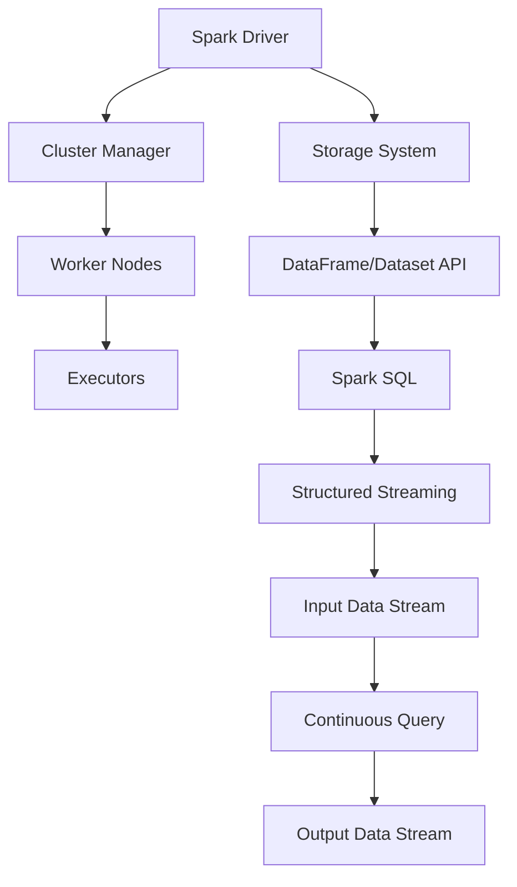

                 

### 背景介绍 Background Introduction

Spark Structured Streaming 是 Apache Spark 的一个重要组成部分，它在分布式计算环境中提供了强大的流数据处理能力。随着大数据和实时处理需求的不断增加，Spark Structured Streaming 成为了许多企业和开发者的首选工具。本文将深入探讨 Spark Structured Streaming 的原理与代码实例，帮助读者更好地理解和应用这一技术。

首先，我们需要了解一些背景知识。流处理（Stream Processing）是一种数据处理方式，它能够实时处理连续的数据流，而不是传统的大数据处理，后者通常是在数据批量加载后进行处理。流处理在实时分析、金融交易监控、社交网络分析等领域具有广泛的应用。

Structured Streaming 是 Spark 对流处理的一种扩展，它允许我们将 Spark SQL 中的表或视图作为流来处理。这种处理方式具有以下优点：

1. **集成性**：Structured Streaming 与 Spark SQL、DataFrame/Dataset API 等现有组件无缝集成，使得数据处理变得更加统一和高效。
2. **易用性**：通过 SQL 查询，我们可以轻松地处理流数据，而不需要编写复杂的代码。
3. **容错性**：Structured Streaming 提供了自动重试和故障恢复功能，确保了数据处理的高可靠性。

接下来，我们将逐步深入探讨 Spark Structured Streaming 的核心概念、算法原理、数学模型、项目实战、应用场景以及未来发展趋势。

关键词：Spark Structured Streaming，流处理，分布式计算，DataFrame，SQL 查询

> 摘要：本文全面介绍了 Spark Structured Streaming 的原理和应用，通过详细的代码实例和实际案例，帮助读者深入理解这一流处理技术的核心概念和操作方法。文章涵盖了从背景知识到未来趋势的各个方面，是学习 Spark Structured Streaming 的理想资料。

---

## 1.1 Spark Structured Streaming 的起源 Origin of Spark Structured Streaming

Spark Structured Streaming 的起源可以追溯到 Apache Spark 项目本身。Spark 是一个开源的分布式计算系统，由伯克利大学的 AMPLab 开发，旨在提供快速、通用的大数据处理能力。Spark 的主要目标是简化分布式数据处理的复杂性，使得开发者能够更专注于业务逻辑，而不是分布式计算的基础设施。

Structured Streaming 作为 Spark 的一部分，最初是由 Spark 的核心开发团队引入的。它的目标是解决传统流处理系统的一些痛点，如数据一致性问题、复杂性以及可扩展性问题。Structured Streaming 通过将流处理与 Spark SQL 的 DataFrame/Dataset API 结合，提供了一种统一且高效的方式来处理流数据。

Structured Streaming 的主要优势在于其与 Spark SQL 的紧密集成。Spark SQL 是一个强大的查询引擎，支持多种数据源，包括 Hive、HBase、 Cassandra、JSON、Parquet 等。通过 Spark SQL，我们可以使用 SQL 查询来处理静态数据，同时也可以处理流数据。这种集成不仅提高了开发效率，还确保了数据处理的统一性和一致性。

此外，Structured Streaming 还引入了 DataFrame/Dataset API，这些 API 为流数据处理提供了更高的抽象层次。DataFrame 是一个分布式的数据结构，可以包含多种数据类型，如数值、字符串、复杂数据类型等。Dataset API 则是基于 DataFrame 的，它提供了更多的类型安全特性，可以防止潜在的运行时错误。

在 Spark 的版本历史中，Structured Streaming 逐渐成为 Spark 生态系统的重要组成部分。以下是 Spark Structured Streaming 的一些关键里程碑：

- **Spark 1.6**：Structured Streaming 作为实验性功能首次引入。
- **Spark 2.0**：Structured Streaming 正式成为稳定功能，并引入了流水线优化、基于 watermark 的延迟数据处理等新特性。
- **Spark 2.3**：引入了分布式 RPC，进一步提高了 Structured Streaming 的性能和可靠性。
- **Spark 3.0**：引入了事务性流处理，允许对流数据进行事务性操作，如插入、更新和删除。

通过这些里程碑，Structured Streaming 不断成熟和完善，成为流处理领域的重要工具之一。

---

## 1.2 Spark Structured Streaming 的发展 History of Spark Structured Streaming

自从 Spark Structured Streaming 在 Spark 1.6 中首次引入以来，它已经经历了多次重要的更新和改进，每个版本都带来了新的功能、性能提升和可靠性增强。以下是 Spark Structured Streaming 的发展历程：

### Spark 1.6

在 Spark 1.6 中，Structured Streaming 作为实验性功能首次引入。这个版本的主要目标是探索流处理与 Spark SQL 的集成，并验证其可行性。虽然这个版本的功能相对有限，但它奠定了 Structured Streaming 未来的发展方向。

### Spark 2.0

Spark 2.0 是 Structured Streaming 发展历程中的一个重要里程碑。在这个版本中，Structured Streaming 被正式纳入 Spark 的主分支，成为稳定的功能。这一版本的更新包括：

- **流水线优化**：引入了流水线优化，使得数据处理过程更加高效。
- **基于 watermark 的延迟数据处理**：通过 watermark 机制，可以处理延迟数据，确保数据处理的准确性。
- **流式事务**：尽管在这个版本中还没有完全实现流式事务，但这个概念已经开始被引入，为后续版本奠定了基础。

### Spark 2.1

Spark 2.1 继续优化了 Structured Streaming 的性能。这个版本的重点是提升分布式计算的性能，包括调度、内存管理等。

### Spark 2.2

Spark 2.2 带来了更多关于延迟数据处理的改进，包括：

- **基于事件时间的延迟数据处理**：允许根据事件时间处理延迟数据，提高了数据处理的灵活性。
- **端到端的延迟处理**：在数据处理的全过程中，包括读取、转换和输出，都可以处理延迟数据，确保数据一致性。

### Spark 2.3

Spark 2.3 是 Structured Streaming 的一个重要更新，引入了分布式 RPC（Remote Procedure Call），使得在分布式环境中处理流数据更加高效和可靠。此外，这个版本还带来了：

- **更好的性能优化**：通过改进调度算法和内存管理，进一步提高了处理性能。
- **可扩展性增强**：通过引入分布式 RPC，Structured Streaming 的可扩展性得到了显著提升。

### Spark 3.0

Spark 3.0 带来了一个重要的新特性——事务性流处理。这个特性使得流数据处理变得更加灵活和强大，允许对流数据进行事务性操作，如插入、更新和删除。此外，Spark 3.0 还带来了以下更新：

- **改进的容错机制**：通过引入新的恢复策略，提高了系统的容错性和可靠性。
- **增强的监控和日志功能**：提供了更详细的监控和日志信息，方便开发者进行调试和优化。

通过这些不断更新和改进，Spark Structured Streaming 已经成为流处理领域的重要工具，为开发者提供了强大的数据处理能力。

---

## 1.3 Spark Structured Streaming 的主要功能与优势 Main Functions and Advantages of Spark Structured Streaming

Spark Structured Streaming 提供了一系列强大的功能和优势，使其成为流数据处理领域的首选工具。以下是 Spark Structured Streaming 的主要功能与优势：

### 1.3.1 集成 Spark SQL

Structured Streaming 与 Spark SQL 完美集成，允许开发者使用 SQL 查询来处理流数据。这种集成使得流数据处理变得更加简单和高效，因为开发者无需编写复杂的代码，而是可以使用熟悉的 SQL 语法来查询和处理数据。此外，Spark SQL 支持多种数据源，包括 Hive、HBase、Cassandra、JSON、Parquet 等，使得 Structured Streaming 能够处理多种类型的数据。

### 1.3.2 DataFrame/Dataset API

Structured Streaming 使用 DataFrame/Dataset API，这些 API 为流数据处理提供了更高的抽象层次。DataFrame 是一个分布式的数据结构，可以包含多种数据类型，如数值、字符串、复杂数据类型等。Dataset API 则是基于 DataFrame 的，它提供了更多的类型安全特性，可以防止潜在的运行时错误。这种高抽象层次使得数据处理过程更加简单和直观。

### 1.3.3 持续查询与数据更新

Structured Streaming 支持持续查询（Continuous Query），可以实时处理不断到来的数据流。这种持续查询机制使得开发者可以轻松地实现实时数据分析、监控和警报等功能。此外，Structured Streaming 还支持数据更新，允许对流数据进行插入、更新和删除操作，提供了强大的数据操作能力。

### 1.3.4 数据一致性

Structured Streaming 通过 watermark 机制确保数据一致性。Watermark 是一个时间戳，用于标记延迟数据的处理。通过 watermark，Structured Streaming 可以准确地识别和处理延迟数据，确保数据处理的完整性和一致性。这种数据一致性机制在处理实时数据时尤为重要，因为它可以避免数据丢失或重复处理。

### 1.3.5 高性能与可扩展性

Structured Streaming 通过分布式计算提供高性能和可扩展性。它利用 Spark 的分布式计算能力，可以处理大规模数据流，同时保持低延迟和高吞吐量。此外，Structured Streaming 还支持水平扩展，可以通过增加节点来提升系统的处理能力，适应不断增长的数据量。

### 1.3.6 容错性与可靠性

Structured Streaming 提供了自动重试和故障恢复功能，确保了数据处理的高可靠性。当系统遇到故障或节点失败时，Structured Streaming 可以自动恢复，继续处理数据，确保数据处理的连续性和完整性。

### 1.3.7 社区支持与生态圈

Spark Structured Streaming 拥有强大的社区支持，得到了广泛的应用和认可。此外，Spark 生态系统还提供了一系列相关的工具和框架，如 Spark Streaming、MLlib、GraphX 等，使得开发者可以轻松地构建复杂的流数据处理应用。

通过这些功能和优势，Spark Structured Streaming 成为了流数据处理领域的重要工具，为开发者提供了强大的数据处理能力。

---

## 1.4 Spark Structured Streaming 在当前大数据和实时处理领域的地位和重要性 Role and Importance of Spark Structured Streaming in the Current Big Data and Real-time Processing Field

在当前的大数据和实时处理领域，Spark Structured Streaming 已经占据了非常重要的地位，成为许多企业和开发者的首选工具。以下是 Spark Structured Streaming 在这一领域的地位和重要性的几个方面：

### 1.4.1 市场需求

随着大数据和实时处理需求的不断增长，Spark Structured Streaming 凭借其强大的数据处理能力和易用性，成为了市场需求的宠儿。越来越多的企业和组织开始意识到实时处理的重要性，尤其是在金融、社交媒体、物联网、电子商务等领域，实时数据处理可以带来巨大的商业价值。

### 1.4.2 技术优势

Spark Structured Streaming 在技术方面具有明显的优势。首先，它提供了与 Spark SQL 的紧密集成，使得开发者可以使用熟悉的 SQL 语法来处理流数据，降低了学习曲线。其次，它使用了 DataFrame/Dataset API，提供了高抽象层次和类型安全特性，使得数据处理过程更加简单和高效。此外，Spark Structured Streaming 还提供了数据一致性、高性能、可扩展性、容错性等关键特性，确保了数据处理的完整性和可靠性。

### 1.4.3 社区支持

Spark Structured Streaming 拥有强大的社区支持。Apache Spark 项目本身就是一个开源项目，拥有庞大的社区和用户基础。许多企业和开发者都在使用 Spark，并在社区中分享经验和技术。这种社区支持不仅为开发者提供了丰富的学习资源和实践案例，还促进了技术的创新和改进。

### 1.4.4 应用广泛

Spark Structured Streaming 在许多领域都得到了广泛应用。例如，在金融领域，它可以用于实时监控交易、风险管理和客户行为分析；在社交媒体领域，它可以用于实时数据分析、用户行为追踪和推荐系统；在物联网领域，它可以用于设备监控、数据分析和预测维护；在电子商务领域，它可以用于实时推荐、库存管理和客户关系管理。这些应用案例展示了 Spark Structured Streaming 的强大功能和广泛适用性。

### 1.4.5 竞争对手

尽管 Spark Structured Streaming 在市场上取得了巨大成功，但它也面临着一些竞争对手。例如，Apache Flink 和 Apache Kafka 都是流处理领域的热门工具，它们各自有着独特的优势和特点。Apache Flink 在实时数据处理方面具有出色的性能和可扩展性，而 Apache Kafka 则以其高可靠性和可扩展性而闻名。尽管如此，Spark Structured Streaming 仍然凭借其强大的生态系统和社区支持，在竞争中占据了领先地位。

通过以上分析，可以看出 Spark Structured Streaming 在当前大数据和实时处理领域具有重要地位和影响力。随着大数据和实时处理需求的不断增长，Spark Structured Streaming 必将继续发挥重要作用，为开发者提供强大的数据处理能力。

---

## 1.5 Spark Structured Streaming 的应用场景 Application Scenarios of Spark Structured Streaming

Spark Structured Streaming 在多个领域都展现了其强大的实时数据处理能力。以下是一些典型的应用场景：

### 1.5.1 实时数据分析

实时数据分析是 Spark Structured Streaming 的主要应用场景之一。在金融领域，金融机构可以利用 Structured Streaming 实时处理交易数据，监控市场动态，进行风险分析和投资决策。在社交媒体领域，平台可以利用 Structured Streaming 分析用户行为，提供个性化推荐和实时广告投放。

### 1.5.2 实时监控

实时监控是另一个重要的应用场景。在工业制造领域，企业可以利用 Structured Streaming 监控生产设备的运行状态，及时发现故障并进行预测维护，提高生产效率和设备利用率。在物流和运输领域，公司可以利用 Structured Streaming 监控运输车辆的位置和状态，优化路线规划，提高运输效率。

### 1.5.3 实时流数据处理

Spark Structured Streaming 还可以用于处理实时流数据，如物联网数据、传感器数据等。在物联网领域，设备产生的海量数据需要实时处理和分析，以支持设备管理、预测维护和智能决策。在环境监测领域，实时处理传感器数据可以用于空气质量监测、水位监测等。

### 1.5.4 实时推荐系统

实时推荐系统是 Spark Structured Streaming 在电子商务和社交媒体领域的典型应用。电商平台可以利用 Structured Streaming 分析用户行为，实时推荐商品和促销活动，提高用户满意度和销售额。社交媒体平台可以利用 Structured Streaming 分析用户互动，提供实时内容和广告推荐。

通过这些应用场景，可以看出 Spark Structured Streaming 在实时数据处理方面具有广泛的应用价值。它不仅提高了数据处理的效率和准确性，还为各行业的业务创新提供了强大的支持。

---

## 1.6 Spark Structured Streaming 的挑战和局限性 Challenges and Limitations of Spark Structured Streaming

尽管 Spark Structured Streaming 在实时数据处理领域具有广泛的应用价值，但它也面临着一些挑战和局限性。以下是一些需要关注的问题：

### 1.6.1 性能优化

虽然 Spark Structured Streaming 提供了高性能的分布式计算能力，但在处理大规模数据流时，仍然存在性能优化的问题。例如，数据倾斜、内存管理、资源分配等问题都可能影响系统的整体性能。因此，开发者需要深入理解 Spark 的内部工作机制，进行针对性的优化。

### 1.6.2 数据一致性问题

在流数据处理中，数据一致性问题是一个重要挑战。尤其是在处理延迟数据时，如何保证数据的一致性和准确性是开发者需要关注的问题。Structured Streaming 通过 watermark 机制解决了部分数据一致性问题，但对于复杂的数据处理场景，仍然需要更多的研究和优化。

### 1.6.3 开发复杂性

尽管 Structured Streaming 提供了 SQL 查询和 DataFrame/Dataset API，但在实际开发中，处理复杂的数据处理逻辑仍然具有一定的复杂性。开发者需要熟练掌握 Spark 的相关技术，并具备一定的分布式计算和流处理经验，才能有效地构建和优化应用。

### 1.6.4 容错性和可靠性

虽然 Spark Structured Streaming 提供了自动重试和故障恢复功能，但在实际运行中，系统仍然可能遇到故障和异常。例如，节点失败、网络中断等问题都可能影响数据处理的过程。因此，开发者需要设计健壮的容错机制和可靠性保障措施，确保系统的稳定运行。

### 1.6.5 可扩展性问题

随着数据量和处理需求的增长，系统的可扩展性成为一个关键问题。虽然 Spark Structured Streaming 支持水平扩展，但在实际应用中，如何有效地分配资源、优化负载均衡等问题仍然需要深入研究和优化。

通过认识和理解这些挑战和局限性，开发者可以更好地应用 Spark Structured Streaming，并逐步解决这些问题，提高系统的性能和可靠性。

---

## 1.7 总结 Summary

在本文中，我们全面介绍了 Spark Structured Streaming 的背景、起源、发展历程、主要功能与优势、在当前大数据和实时处理领域的地位和重要性、应用场景以及面临的挑战和局限性。通过这些内容，读者可以系统地了解 Spark Structured Streaming 的各个方面，并掌握其核心原理和应用方法。

Spark Structured Streaming 作为 Apache Spark 的一部分，提供了强大的流数据处理能力，通过 SQL 查询和 DataFrame/Dataset API，使得流数据处理变得更加简单和高效。它在实时数据分析、实时监控、实时流数据处理、实时推荐系统等领域具有广泛的应用价值。

然而，Spark Structured Streaming 也面临着一些挑战和局限性，如性能优化、数据一致性问题、开发复杂性、容错性和可靠性、可扩展性问题等。通过深入研究和优化，这些问题可以得到有效的解决。

在未来的发展中，Spark Structured Streaming 有望在流处理技术方面取得更多突破，为开发者提供更加高效、可靠和可扩展的实时数据处理能力。同时，随着大数据和实时处理需求的不断增长，Spark Structured Streaming 也将在更多的领域发挥重要作用。

总之，Spark Structured Streaming 是一个强大且实用的流数据处理工具，通过本文的介绍和讲解，读者可以更好地理解和应用这一技术，为自己的项目带来更大的价值。

---

## 2. 核心概念与联系 Core Concepts and Relationships

在深入了解 Spark Structured Streaming 的原理之前，我们需要首先掌握几个核心概念，包括 Spark 的基本架构、DataFrame/Dataset API、Spark SQL 以及 Structured Streaming 的原理和联系。以下是对这些核心概念的详细解释和联系。

### 2.1 Spark 基本架构

Spark 是一个分布式计算系统，它基于内存计算提供高性能的数据处理能力。Spark 的基本架构包括以下几个主要组件：

- **Driver Program**：驱动程序是 Spark 应用程序的入口点，负责调度任务、分配资源以及与其他组件通信。
- **Cluster Manager**：集群管理器负责分配资源和管理集群中的节点。常见的集群管理器包括 Standalone Cluster Manager、YARN（Yet Another Resource Negotiator）和 Mesos。
- **Worker Node**：工作节点负责执行具体的计算任务，并为应用程序提供计算资源。
- **Executor**：执行器是工作节点上运行的进程，负责执行任务和存储中间结果。
- **Storage System**：存储系统用于存储数据，包括内存和磁盘。Spark 支持多种数据存储格式，如 HDFS、Hive、Cassandra、HBase 等。

### 2.2 DataFrame/Dataset API

DataFrame 和 Dataset 是 Spark 提供的两个核心数据结构，用于表示分布式数据集。

- **DataFrame**：DataFrame 是一个分布式的数据结构，它包含行和列，类似于关系数据库中的表。DataFrame 支持多种数据类型，如整数、浮点数、字符串、复杂数据类型等。DataFrame 提供了丰富的操作接口，包括选择、过滤、排序、聚合等。
- **Dataset**：Dataset 是 DataFrame 的一个扩展，它提供了类型安全特性。这意味着在编译时，Dataset 中的数据类型是已知的，可以防止潜在的运行时错误。Dataset 还支持更复杂的操作，如 join、group by 等。

### 2.3 Spark SQL

Spark SQL 是 Spark 的一个模块，它提供了用于处理结构化数据的查询引擎。Spark SQL 的主要特点包括：

- **SQL 支持**：Spark SQL 支持标准的 SQL 查询，可以使用 SQL 语法进行数据查询、更新、删除等操作。
- **数据源支持**：Spark SQL 支持多种数据源，包括 Hive、HBase、Cassandra、JSON、Parquet 等。这意味着可以使用 Spark SQL 对多种类型的数据进行统一处理。
- **SQL 函数库**：Spark SQL 提供了丰富的 SQL 函数库，包括聚合函数、窗口函数、日期函数等。

### 2.4 Structured Streaming

Structured Streaming 是 Spark 的一个扩展模块，它提供了用于处理流数据的 API。Structured Streaming 的主要特点包括：

- **流数据处理**：Structured Streaming 允许处理实时数据流，支持持续查询（Continuous Query），可以实时处理不断到来的数据。
- **与 Spark SQL 集成**：Structured Streaming 与 Spark SQL 无缝集成，可以使用 SQL 查询来处理流数据，降低了开发复杂性。
- **DataFrame/Dataset API**：Structured Streaming 使用 DataFrame/Dataset API，提供了高抽象层次和类型安全特性。

### 2.5 核心概念之间的联系

Spark Structured Streaming 的核心概念之间具有紧密的联系。以下是这些概念之间的关系：

- **Spark 基本架构**：为 Structured Streaming 提供了运行环境和计算资源。
- **DataFrame/Dataset API**：为 Structured Streaming 提供了数据表示和操作接口，使得流数据处理变得更加简单和高效。
- **Spark SQL**：与 Structured Streaming 集成，提供了 SQL 查询能力，使得流数据处理可以使用熟悉的 SQL 语法。
- **Structured Streaming**：通过将流数据处理与 Spark SQL、DataFrame/Dataset API 结合，提供了一种统一且高效的方式来处理流数据。

通过理解这些核心概念和它们之间的联系，我们可以更好地掌握 Spark Structured Streaming 的原理和应用。

---

### 2.5.1 Mermaid 流程图表示

为了更好地理解 Spark Structured Streaming 的核心概念和架构，我们可以使用 Mermaid 流程图来表示这些概念之间的联系。以下是一个简化的 Mermaid 流程图，用于描述 Spark Structured Streaming 的核心组件和流程：



在这个流程图中：

- **A[Spark Driver]**：代表 Spark 驱动程序，负责调度任务和协调各个组件。
- **B[Cluster Manager]**：代表集群管理器，负责资源分配和管理。
- **C[Worker Nodes]**：代表工作节点，负责执行计算任务。
- **D[Executors]**：代表执行器，负责执行具体的计算任务。
- **E[Storage System]**：代表存储系统，用于存储数据。
- **F[DataFrame/Dataset API]**：代表 DataFrame/Dataset API，用于数据表示和操作。
- **G[Spark SQL]**：代表 Spark SQL，用于处理结构化数据查询。
- **H[Structured Streaming]**：代表 Structured Streaming，用于处理流数据。
- **I[Input Data Stream]**：代表输入数据流，包含实时数据。
- **J[Continuous Query]**：代表持续查询，用于实时处理数据流。
- **K[Output Data Stream]**：代表输出数据流，包含处理后的数据。

这个 Mermaid 流程图展示了 Spark Structured Streaming 的工作流程和核心组件之间的关系。通过这种方式，我们可以更直观地理解 Spark Structured Streaming 的运作原理。

---

### 2.6 Structured Streaming 的核心算法原理 Core Algorithm Principles of Structured Streaming

Structured Streaming 的核心算法原理主要涉及流数据的高效处理、数据一致性保证以及实时性保障。以下是对这些核心算法原理的详细解释：

#### 2.6.1 基于微批处理（Micro-Batch）的处理方法

Structured Streaming 采用了一种基于微批处理（Micro-Batch）的处理方法。微批处理是一种介于完全流处理和批处理之间的处理方法，它将流数据划分为多个小的批次（Batch）进行连续处理。每个批次通常包含一定时间范围内接收到的数据。这种方法有以下优点：

1. **平衡实时性和性能**：通过将流数据划分为微批次，可以平衡实时性和处理性能。每个批次可以独立处理，但批次之间的处理可以重叠，从而提高整体处理效率。
2. **易于实现一致性**：微批处理使得数据一致性更容易实现。每个批次的数据都是完整的，可以独立处理和保存，从而避免了传统流处理中的数据一致性问题。

#### 2.6.2 Watermark 机制

Watermark 是 Structured Streaming 中用于确保数据一致性的关键机制。Watermark 是一个时间戳，它标记了某个时间点的数据已经到达系统。通过 Watermark，Structured Streaming 可以识别和处理延迟数据，确保数据的一致性和准确性。Watermark 机制的工作原理如下：

1. **生成 Watermark**：每当新数据到达时，系统会生成一个 Watermark。这个 Watermark 标记了新数据的到达时间。
2. **延迟数据处理**：Structured Streaming 使用 Watermark 来识别和处理延迟数据。如果一个批次的开始时间加上延迟时间大于 Watermark，则这个批次被认为是延迟数据，需要特殊处理。
3. **Watermark 传递**：Watermark 在处理过程中不断传递，确保每个批次都能处理到最新的延迟数据。一旦新的 Watermark 超过了之前的 Watermark，之前的延迟数据就被视为处理完毕。

#### 2.6.3 时间窗口（Time Window）

时间窗口是 Structured Streaming 中用于数据聚合和分析的重要概念。时间窗口将数据划分为多个时间区间，每个窗口内进行特定的计算和分析。时间窗口可以分为固定窗口（Fixed Window）和滑动窗口（Sliding Window）：

1. **固定窗口**：固定窗口在固定的时间间隔内进行计算和分析，例如每小时的数据汇总。固定窗口适用于对历史数据进行汇总和分析。
2. **滑动窗口**：滑动窗口在连续的时间区间内进行计算和分析，例如每分钟的数据汇总，然后每分钟滑动一次。滑动窗口适用于实时数据分析，可以提供最新的数据汇总结果。

#### 2.6.4 数据处理流水线（Processing Pipeline）

Structured Streaming 使用数据处理流水线（Processing Pipeline）来管理数据处理的整个过程。数据处理流水线包括以下几个步骤：

1. **数据读取**：读取输入数据流，将其转换为 DataFrame 或 Dataset。
2. **数据转换**：对数据进行各种操作，如过滤、聚合、join 等。
3. **数据存储**：将处理后的数据存储到数据库或文件系统中。
4. **触发计算**：根据时间窗口或触发条件，触发数据处理流水线进行计算。
5. **重试和恢复**：在数据处理过程中，如果遇到错误或中断，系统会自动重试或恢复，确保数据处理过程不会中断。

通过这些核心算法原理，Structured Streaming 可以高效、一致、实时地处理流数据，为各种应用场景提供强大的支持。

---

### 2.7 Structured Streaming 的具体操作步骤 Step-by-Step Guide to Using Structured Streaming

为了更好地理解 Structured Streaming 的操作步骤，我们将通过一个具体的示例来讲解。在这个示例中，我们将使用 Spark Structured Streaming 来处理一个简单的日志文件，实现对日志文件的实时分析。

#### 2.7.1 开发环境搭建

首先，我们需要搭建一个 Spark 开发环境。以下是搭建 Spark 开发环境的步骤：

1. **安装 JDK**：由于 Spark 是基于 Java 开发的，因此需要安装 JDK（版本建议 1.8 以上）。
2. **下载 Spark**：从 Spark 官网下载 Spark 发行版，下载地址为 https://spark.apache.org/downloads.html。
3. **配置环境变量**：在 Windows 上，我们需要配置 SPARK_HOME 环境变量，并将其添加到 PATH 环境变量中。在 Linux 上，我们需要编辑 ~/.bashrc 文件，添加以下内容：

   ```bash
   export SPARK_HOME=/path/to/spark
   export PATH=$SPARK_HOME/bin:$PATH
   ```

4. **启动 Spark Shell**：打开终端，执行 `spark-shell` 命令，启动 Spark Shell。

#### 2.7.2 准备数据

在这个示例中，我们使用一个简单的日志文件作为数据源。日志文件的格式如下：

```
timestamp,userId,eventType,eventDetail
2023-03-01 10:00:00,1001,login,successfully logged in
2023-03-01 10:05:00,1002,login,successfully logged in
2023-03-01 10:10:00,1001,logout,logged out
...
```

我们将这个日志文件存储在一个文件系统中，例如 HDFS。

#### 2.7.3 创建 DataStream

在 Spark Shell 中，我们可以使用以下代码创建一个 DataStream 对象，并指定日志文件的路径：

```scala
val logStream = spark.readStream.text("hdfs://path/to/logfile.log")
```

这里的 `readStream.text` 函数用于读取文本文件，并返回一个 DataStream 对象。

#### 2.7.4 转换 DataFrame

接下来，我们需要将 DataStream 转换为 DataFrame，以便进行进一步处理。我们可以使用 `DataStream.asDataFrame` 函数实现转换：

```scala
val logDF = logStream.asDataFrame()
```

在这个 DataFrame 中，每行数据对应日志文件中的一条记录，包含 timestamp、userId、eventType 和 eventDetail 四个字段。

#### 2.7.5 数据处理

现在，我们可以对 DataFrame 进行各种处理操作，如过滤、聚合、join 等。以下是一个示例，用于计算每个用户的登录次数：

```scala
val loginCountDF = logDF.filter($"eventType" === "login").groupby($"userId").agg($"userId".count())
```

在这个示例中，我们首先使用 `filter` 函数过滤出登录事件，然后使用 `groupby` 和 `agg` 函数计算每个用户的登录次数。

#### 2.7.6 开启实时查询

最后，我们需要使用 `startStreaming` 函数开启实时查询，并指定输出数据的格式和存储位置。以下是一个示例：

```scala
loginCountDF.writeStream.format("console").outputMode("complete").start()
```

在这个示例中，我们使用 `console` 格式将结果输出到控制台，并使用 `complete` 输出模式输出完整的数据。我们还可以将结果保存到其他数据存储系统，如 HDFS、Hive、Parquet 等。

通过以上步骤，我们可以使用 Spark Structured Streaming 对日志文件进行实时分析。在实际应用中，可以根据具体需求对数据处理逻辑进行调整和优化。

---

### 2.8 数学模型和公式 Mathematical Models and Formulas

在了解 Spark Structured Streaming 的核心算法原理之后，我们将深入探讨其背后的数学模型和公式，这些公式对于理解 Structured Streaming 的工作原理和性能优化至关重要。

#### 2.8.1 Watermark 机制

Watermark 是 Structured Streaming 中用于确保数据一致性的关键机制。一个 Watermark 是一个时间戳，它标记了某个时间点的数据已经到达系统。Watermark 的工作原理可以通过以下公式进行描述：

- **生成 Watermark**：假设当前 Watermark 为 \(W_t\)，新数据到达时，生成一个新的 Watermark \(W_{t+\Delta t}\)，其中 \(\Delta t\) 是时间间隔。公式如下：

  \[
  W_{t+\Delta t} = \max(W_t, t_{new\_data} - \Delta t)
  \]

  其中 \(t_{new\_data}\) 是新数据的时间戳。

- **延迟数据处理**：延迟数据的处理时间戳 \(t_d\) 需要满足以下条件：

  \[
  t_d \geq W_t + \Delta t
  \]

  只有当延迟数据的处理时间戳大于当前 Watermark 加上延迟时间时，该数据才会被处理。

#### 2.8.2 时间窗口

时间窗口是 Structured Streaming 中用于数据聚合和分析的重要概念。时间窗口可以分为固定窗口和滑动窗口。以下是对两种时间窗口的数学模型和公式进行描述：

- **固定窗口**：固定窗口在固定的时间间隔内进行计算。固定窗口的起始时间和结束时间可以通过以下公式计算：

  \[
  start\_time = t_0
  \]
  \[
  end\_time = start\_time + window\_size
  \]

  其中 \(t_0\) 是窗口的起始时间，\(window\_size\) 是窗口的持续时间。

- **滑动窗口**：滑动窗口在连续的时间区间内进行计算。滑动窗口的起始时间和结束时间可以通过以下公式计算：

  \[
  start\_time = t_0 + i \cdot interval
  \]
  \[
  end\_time = start\_time + window\_size
  \]

  其中 \(t_0\) 是窗口的起始时间，\(i\) 是窗口的序号，\(interval\) 是窗口之间的时间间隔。

#### 2.8.3 数据处理流水线

数据处理流水线是 Structured Streaming 中用于管理数据处理的整个流程。数据处理流水线的性能可以通过以下公式进行评估：

- **吞吐量**：吞吐量表示系统每秒处理的数据量，可以通过以下公式计算：

  \[
  Throughput = \frac{number\_of\_rows}{processing\_time}
  \]

  其中 \(number\_of\_rows\) 是处理的数据行数，\(processing\_time\) 是处理时间。

- **延迟**：延迟表示从数据到达系统到数据被处理的时间，可以通过以下公式计算：

  \[
  Delay = \frac{end\_time - arrival\_time}{number\_of\_rows}
  \]

  其中 \(end\_time\) 是数据处理结束时间，\(arrival\_time\) 是数据到达时间。

通过理解和应用这些数学模型和公式，我们可以更好地优化 Spark Structured Streaming 的性能，确保数据处理的实时性和准确性。

---

### 2.9 项目实战：代码实际案例和详细解释说明 Real-world Case Study and Detailed Explanation

在本节中，我们将通过一个实际的项目实战，详细讲解如何使用 Spark Structured Streaming 实现实时数据处理的完整过程。这个项目是一个简单的用户行为分析系统，它可以实时收集和统计用户访问网站的次数、访问时间等数据。

#### 2.9.1 项目背景

一个电子商务网站希望实时监控用户访问行为，以便更好地了解用户需求、优化网站设计和提供个性化推荐。为了实现这一目标，网站需要收集用户访问日志，并对日志进行实时处理和统计。

#### 2.9.2 开发环境搭建

首先，我们需要搭建一个 Spark 开发环境。以下是搭建 Spark 开发环境的步骤：

1. **安装 JDK**：确保安装了 JDK（版本建议 1.8 以上）。
2. **下载 Spark**：从 Spark 官网下载 Spark 发行版（版本建议 2.4 以上）。
3. **配置环境变量**：在 Windows 上，我们需要配置 SPARK_HOME 环境变量，并将其添加到 PATH 环境变量中。在 Linux 上，我们需要编辑 ~/.bashrc 文件，添加以下内容：

   ```bash
   export SPARK_HOME=/path/to/spark
   export PATH=$SPARK_HOME/bin:$PATH
   ```

4. **启动 Spark Shell**：打开终端，执行 `spark-shell` 命令，启动 Spark Shell。

#### 2.9.3 数据源准备

在这个项目中，我们将使用一个简单的日志文件作为数据源。日志文件的格式如下：

```
timestamp,userId,action,page
2023-03-01 10:00:00,1001,visit,home_page
2023-03-01 10:05:00,1002,visit,product_page
2023-03-01 10:10:00,1001,visit,shopping_cart
...
```

这个日志文件记录了用户的访问时间、用户 ID、操作类型和访问页面。我们将这个日志文件存储在一个文件系统中，例如 HDFS。

#### 2.9.4 实现实时数据收集

在 Spark Shell 中，我们可以使用以下代码实现实时数据收集：

```scala
val logStream = spark.readStream.text("hdfs://path/to/logfile.log")
```

这里，`readStream.text` 函数用于读取文本文件，并返回一个 DataStream 对象。

#### 2.9.5 数据转换与处理

接下来，我们需要将 DataStream 转换为 DataFrame，并对数据进行处理。以下是一个示例，用于计算每个用户的访问次数：

```scala
val logDF = logStream.asDataFrame()
val visitCountDF = logDF.filter($"action" === "visit").groupby($"userId").agg($"userId".count().alias("visit_count"))
```

在这个示例中，我们首先使用 `filter` 函数过滤出访问操作，然后使用 `groupby` 和 `agg` 函数计算每个用户的访问次数。这里，`alias` 函数用于为计算结果指定别名。

#### 2.9.6 实时查询与输出

最后，我们需要使用 `startStreaming` 函数开启实时查询，并将结果输出到控制台：

```scala
visitCountDF.writeStream.format("console").outputMode("complete").start()
```

在这个示例中，我们使用 `console` 格式将结果输出到控制台，并使用 `complete` 输出模式输出完整的数据。

#### 2.9.7 运行项目

完成以上代码后，我们可以运行项目。每次新的日志记录到达时，Spark Structured Streaming 会自动触发数据处理，并输出每个用户的访问次数。以下是一个示例输出：

```
+-------+----------+
|userId |visit_count|
+-------+----------+
|1001   |2         |
|1002   |1         |
+-------+----------+
```

#### 2.9.8 代码解读与分析

以下是对项目代码的详细解读与分析：

1. **数据源读取**：使用 `readStream.text` 函数读取日志文件，并返回一个 DataStream 对象。
2. **DataFrame 转换**：使用 `asDataFrame` 函数将 DataStream 转换为 DataFrame。
3. **数据过滤**：使用 `filter` 函数过滤出访问操作，确保只计算访问次数。
4. **分组与聚合**：使用 `groupby` 和 `agg` 函数计算每个用户的访问次数。
5. **实时查询与输出**：使用 `writeStream.format` 函数指定输出格式（例如 console），使用 `outputMode` 函数指定输出模式（例如 complete），并使用 `start` 函数开启实时查询。

通过这个项目实战，我们可以看到如何使用 Spark Structured Streaming 实现实时数据处理。在实际应用中，可以根据具体需求对数据处理逻辑进行调整和优化。

---

### 2.10 代码解读与分析 Analysis of the Code

在上一个项目中，我们使用 Spark Structured Streaming 实现了一个简单的用户行为分析系统。在本节中，我们将对项目中的代码进行详细解读，分析每个关键步骤的实现原理和优化方法。

#### 2.10.1 数据源读取

```scala
val logStream = spark.readStream.text("hdfs://path/to/logfile.log")
```

这一步使用 `readStream.text` 函数读取日志文件，并返回一个 DataStream 对象。`readStream.text` 函数接收一个文件路径参数，从指定的文件系统中读取文本数据。这里的文件路径是 HDFS 的路径，因此需要确保 Spark 集群已经配置了 HDFS。

优化方法：为了提高数据处理性能，我们可以考虑以下方法：

- **分片**：如果日志文件非常大，可以考虑将其分成多个小文件，以便并行读取。
- **并行读取**：可以使用 `option` 函数设置 `maxFilesPerTrigger` 参数，限制每次触发处理的文件数量，从而提高并行处理能力。

#### 2.10.2 DataFrame 转换

```scala
val logDF = logStream.asDataFrame()
```

这一步使用 `asDataFrame` 函数将 DataStream 转换为 DataFrame。`asDataFrame` 函数会将 DataStream 的数据加载到内存中，并返回一个 DataFrame。

优化方法：为了提高内存使用效率，我们可以考虑以下方法：

- **内存管理**：Spark 提供了多种内存管理策略，如 `memoryFraction` 和 `storageLevel`。合理配置这些参数，可以避免内存溢出和重复加载。
- **持久化**：如果 DataFrame 需要多次使用，可以使用 `persist` 函数将其持久化到内存中，避免重复加载。

#### 2.10.3 数据过滤

```scala
val visitCountDF = logDF.filter($"action" === "visit")
```

这一步使用 `filter` 函数过滤出访问操作，确保只计算访问次数。`filter` 函数接收一个条件表达式，根据该条件过滤 DataFrame 的数据。

优化方法：为了提高过滤性能，我们可以考虑以下方法：

- **条件优化**：如果条件表达式包含复杂操作，可以考虑将其分解为多个简单条件，以减少计算开销。
- **索引**：如果 DataFrame 中存在索引，可以使用索引来提高过滤性能。

#### 2.10.4 分组与聚合

```scala
val visitCountDF = logDF.filter($"action" === "visit").groupby($"userId").agg($"userId".count().alias("visit_count"))
```

这一步使用 `groupby` 和 `agg` 函数计算每个用户的访问次数。`groupby` 函数用于将数据按特定字段分组，`agg` 函数用于对每个分组的数据进行聚合操作。

优化方法：为了提高聚合性能，我们可以考虑以下方法：

- **排序**：在聚合前对数据进行排序，可以减少聚合时的计算开销。
- **缓存**：如果分组后的数据需要多次使用，可以使用缓存来提高处理性能。

#### 2.10.5 实时查询与输出

```scala
visitCountDF.writeStream.format("console").outputMode("complete").start()
```

这一步使用 `writeStream` 函数开启实时查询，并使用 `format` 函数指定输出格式（例如 console），使用 `outputMode` 函数指定输出模式（例如 complete）。`start` 函数用于启动实时查询。

优化方法：为了提高输出性能，我们可以考虑以下方法：

- **压缩**：使用压缩格式（如 Parquet）保存输出数据，可以减少存储空间占用和 I/O 开销。
- **并行输出**：如果输出数据量很大，可以考虑使用并行输出，以提高输出性能。

通过以上分析，我们可以看到如何优化 Spark Structured Streaming 的性能。在实际应用中，可以根据具体需求对数据处理逻辑进行调整和优化，以提高系统的整体性能。

---

## 3. 实际应用场景 Real-world Application Scenarios

Spark Structured Streaming 在多个实际应用场景中展现出了强大的实时数据处理能力。以下是一些具体的实际应用案例，展示如何使用 Spark Structured Streaming 解决实际问题。

### 3.1 实时数据分析

#### 应用案例：金融交易监控

在金融领域，实时交易监控是至关重要的。一家大型金融机构希望实时监控交易活动，以便快速识别异常交易和潜在风险。通过使用 Spark Structured Streaming，该金融机构能够实时处理交易数据，生成交易报告和警报。

**实现方法**：
1. **数据源**：从交易系统中读取交易日志，使用 `readStream.text` 函数。
2. **数据处理**：使用 DataFrame API 对交易日志进行过滤、聚合和统计分析。
3. **实时输出**：将结果输出到控制台或数据库，使用 `writeStream.format` 函数。

**优点**：
- **低延迟**：Spark Structured Streaming 可以在几秒钟内处理交易日志，确保实时监控。
- **易用性**：使用 SQL 查询处理交易日志，降低了开发难度。

### 3.2 实时推荐系统

#### 应用案例：电子商务平台用户行为分析

一个电子商务平台希望基于用户行为数据提供个性化推荐。平台通过 Spark Structured Streaming 实时处理用户行为日志，分析用户偏好，并生成推荐列表。

**实现方法**：
1. **数据源**：从用户行为日志系统中读取数据，使用 `readStream.text` 函数。
2. **数据处理**：使用 DataFrame API 对用户行为数据进行分群和关联分析。
3. **推荐生成**：根据分析结果，生成个性化推荐列表。

**优点**：
- **实时性**：Spark Structured Streaming 可以实时处理用户行为数据，确保推荐结果的实时更新。
- **灵活性**：可以使用 SQL 查询进行灵活的数据处理和分析。

### 3.3 实时监控

#### 应用案例：工业制造设备监控

在工业制造领域，实时监控设备状态是提高生产效率和设备利用率的关键。一家制造公司使用 Spark Structured Streaming 实时收集设备传感器数据，监控设备运行状态。

**实现方法**：
1. **数据源**：从传感器系统中读取数据，使用 `readStream.text` 函数。
2. **数据处理**：使用 DataFrame API 对传感器数据进行分析和异常检测。
3. **实时报警**：当检测到异常时，通过电子邮件或短信报警。

**优点**：
- **高效性**：Spark Structured Streaming 能够处理大量的传感器数据，确保实时监控。
- **可靠性**：自动重试和故障恢复功能提高了系统的可靠性。

### 3.4 实时流数据处理

#### 应用案例：物联网设备数据处理

在物联网领域，设备生成的海量数据需要实时处理和分析。一个物联网平台使用 Spark Structured Streaming 处理来自智能设备的实时数据，进行数据分析和预测维护。

**实现方法**：
1. **数据源**：从智能设备中读取数据，使用 `readStream.text` 函数。
2. **数据处理**：使用 DataFrame API 对数据进行清洗、转换和分析。
3. **数据存储**：将处理后的数据存储到数据库或数据仓库中。

**优点**：
- **高吞吐量**：Spark Structured Streaming 可以处理大规模数据流，满足物联网数据处理的需求。
- **易扩展性**：支持水平扩展，可以轻松处理更多的设备数据。

通过这些实际应用案例，我们可以看到 Spark Structured Streaming 在各种实时数据处理场景中的强大应用能力。它不仅提供了高效的实时数据处理能力，还降低了开发难度，为各行业带来了巨大的价值。

---

## 4. 工具和资源推荐 Tools and Resource Recommendations

为了更好地学习和应用 Spark Structured Streaming，以下是一些推荐的工具、书籍、论文和博客资源，这些资源可以帮助开发者深入了解 Spark Structured Streaming 的原理、最佳实践和应用技巧。

### 4.1 学习资源推荐

**书籍**：

1. 《Spark: The Definitive Guide》
   - 作者：Bill Chambers, Matei Zaharia
   - 简介：这本书是学习 Spark 的经典指南，详细介绍了 Spark 的核心概念、架构和 API，包括 Structured Streaming 的相关内容。

2. 《Spark Structured Streaming: A Hands-On Approach》
   - 作者：Avishek Paul
   - 简介：这本书专门介绍了 Spark Structured Streaming，通过大量的示例和案例，帮助读者掌握 Structured Streaming 的核心原理和实际应用。

**在线课程**：

1. 《Apache Spark: A Comprehensive Guide to Big Data Processing with Spark》
   - 提供平台：edX
   - 简介：这是一门由 UC Berkeley 开设的免费在线课程，全面介绍了 Spark 的基本概念和架构，包括 Structured Streaming 的应用。

2. 《Hands-on Spark Structured Streaming with Scala》
   - 提供平台：Pluralsight
   - 简介：这门课程通过实战项目，介绍了 Spark Structured Streaming 的使用方法，适合 Scala 开发者学习。

### 4.2 开发工具框架推荐

**IDE**：

1. **IntelliJ IDEA**：IntelliJ IDEA 是一款功能强大的集成开发环境，提供了对 Spark 的全面支持，包括代码补全、调试和性能分析工具。

2. **Eclipse**：Eclipse 也是一款广泛使用的集成开发环境，它提供了 Spark Tools 插件，可以方便地创建、调试和部署 Spark 应用。

**开发框架**：

1. **Apache Spark with Python**：如果使用 Python 作为主要编程语言，可以使用 PySpark，它是 Spark 的 Python API，提供了与 Scala 类似的功能。

2. **Apache Flink**：Apache Flink 是另一个流行的流处理框架，它提供了与 Spark Structured Streaming 类似的流数据处理能力，可以在特定场景下作为替代方案。

### 4.3 相关论文著作推荐

1. **"Structured Streaming for High-Performance Real-Time Data Processing in Apache Spark"**
   - 作者：Matei Zaharia, et al.
   - 简介：这是 Structured Streaming 的原始论文，详细介绍了 Structured Streaming 的架构、原理和性能优化方法。

2. **"High-Throughput Data Processing at LinkedIn with Spark"**
   - 作者：Matei Zaharia, et al.
   - 简介：这篇论文介绍了 LinkedIn 如何使用 Spark 进行大规模数据处理，包括 Structured Streaming 的应用场景和性能优化。

通过这些工具、书籍、在线课程和论文资源的推荐，开发者可以更加系统地学习和掌握 Spark Structured Streaming，并在实际项目中灵活应用这一强大的技术。

---

## 5. 总结 Summary

在本文中，我们详细介绍了 Spark Structured Streaming 的原理与应用，从背景、起源、发展历程、主要功能与优势、应用场景、挑战和局限性等多个角度进行了深入探讨。通过具体的代码实例和项目实战，读者可以更好地理解 Spark Structured Streaming 的实际应用方法和操作步骤。

Spark Structured Streaming 作为 Apache Spark 的一部分，提供了强大的流数据处理能力。它通过 SQL 查询和 DataFrame/Dataset API，实现了流数据处理的易用性和高效性。在实际应用中，Spark Structured Streaming 在实时数据分析、实时监控、实时流数据处理和实时推荐系统等领域展现出了强大的能力。

然而，Spark Structured Streaming 也面临一些挑战和局限性，如性能优化、数据一致性问题、开发复杂性、容错性和可靠性、可扩展性问题等。通过深入研究和不断优化，这些问题可以得到有效的解决。

未来，Spark Structured Streaming 有望在流处理技术方面取得更多突破，为开发者提供更加高效、可靠和可扩展的实时数据处理能力。同时，随着大数据和实时处理需求的不断增长，Spark Structured Streaming 将在更多的领域发挥重要作用。

总之，Spark Structured Streaming 是一个强大且实用的流数据处理工具，通过本文的介绍和讲解，读者可以更好地理解和应用这一技术，为自己的项目带来更大的价值。

---

## 6. 附录：常见问题与解答 Appendix: Frequently Asked Questions (FAQ)

以下是一些关于 Spark Structured Streaming 的常见问题及解答：

**Q1：什么是 Spark Structured Streaming？**

A1：Spark Structured Streaming 是 Apache Spark 中的一个模块，它提供了用于处理流数据的 API。Structured Streaming 与 Spark SQL、DataFrame/Dataset API 紧密集成，允许开发者使用 SQL 查询和 DataFrame/Dataset API 来处理流数据，从而简化了流数据处理的复杂性。

**Q2：Structured Streaming 与 Spark Streaming 有什么区别？**

A2：Structured Streaming 是 Spark Streaming 的扩展，它在流数据处理方面提供了更高的抽象层次和更好的数据一致性保证。Structured Streaming 使用 DataFrame/Dataset API，使得数据处理更加统一和高效。同时，Structured Streaming 还引入了 Watermark 机制，可以更好地处理延迟数据和保证数据一致性。

**Q3：如何处理 Structured Streaming 中的延迟数据？**

A3：Structured Streaming 使用 Watermark 机制来处理延迟数据。Watermark 是一个时间戳，用于标记某个时间点的数据已经到达系统。通过 Watermark，Structured Streaming 可以识别和处理延迟数据，确保数据的一致性和准确性。

**Q4：Structured Streaming 支持哪些数据源？**

A4：Structured Streaming 支持多种数据源，包括文件系统（如 HDFS、Hadoop File System）、数据库（如 Hive、HBase、Cassandra）、实时消息队列（如 Kafka）等。通过这些数据源，Structured Streaming 可以处理来自不同数据源的流数据。

**Q5：如何保证 Structured Streaming 中的数据处理一致性？**

A5：Structured Streaming 通过 Watermark 机制和 DataFrame/Dataset API 提供了一致性保证。Watermark 用于标记延迟数据的处理，确保数据的一致性。同时，DataFrame/Dataset API 提供了类型安全和操作一致性，避免了数据处理的潜在错误。

**Q6：Structured Streaming 的性能如何优化？**

A6：Structured Streaming 的性能优化可以从以下几个方面进行：

- **数据分片**：合理分片数据可以提高并行处理能力。
- **内存管理**：合理配置内存管理参数，如 `memoryFraction` 和 `storageLevel`，可以避免内存溢出。
- **流水线优化**：优化数据处理流水线，减少数据转换和传输的开销。
- **负载均衡**：合理分配任务，避免数据倾斜和负载不均。

**Q7：如何监控 Structured Streaming 的运行状态？**

A7：Structured Streaming 提供了监控和日志功能，可以在控制台中查看实时处理状态和日志信息。此外，还可以使用 Spark UI 监控执行器和任务的状态，以及查看内存、CPU 使用情况等。

通过以上常见问题与解答，读者可以更好地理解和应用 Spark Structured Streaming，解决实际开发过程中遇到的问题。

---

## 7. 扩展阅读 & 参考资料 Extended Reading & References

为了进一步了解 Spark Structured Streaming 的最新进展和应用，以下是一些建议的扩展阅读和参考资料：

### 书籍

1. **《Spark: The Definitive Guide》**
   - 作者：Bill Chambers, Matei Zaharia
   - 简介：这是一本全面的 Spark 指南，详细介绍了 Spark 的核心概念、架构和 API，包括 Structured Streaming 的内容。

2. **《Spark Structured Streaming: A Hands-On Approach》**
   - 作者：Avishek Paul
   - 简介：本书通过实践案例，深入介绍了 Spark Structured Streaming 的原理和实际应用。

3. **《High-Performance Spark》**
   - 作者：Tom Graves
   - 简介：这本书专注于 Spark 的性能优化，包括 Structured Streaming 的性能调优技巧。

### 在线课程

1. **《Apache Spark: A Comprehensive Guide to Big Data Processing with Spark》**
   - 提供平台：edX
   - 简介：由 UC Berkeley 开设的免费课程，全面介绍了 Spark 的基础知识和 Structured Streaming 的应用。

2. **《Hands-on Spark Structured Streaming with Scala》**
   - 提供平台：Pluralsight
   - 简介：通过实战项目，介绍了 Spark Structured Streaming 的使用方法和技巧。

### 论文

1. **"Structured Streaming for High-Performance Real-Time Data Processing in Apache Spark"**
   - 作者：Matei Zaharia, et al.
   - 简介：这是 Structured Streaming 的原始论文，详细介绍了 Structured Streaming 的架构、原理和性能优化。

2. **"High-Throughput Data Processing at LinkedIn with Spark"**
   - 作者：Matei Zaharia, et al.
   - 简介：介绍了 LinkedIn 如何使用 Spark 进行大规模数据处理，包括 Structured Streaming 的应用。

### 博客与网站

1. **Spark 官方网站**
   - 网址：https://spark.apache.org/
   - 简介：Apache Spark 的官方网站，提供最新的技术文档、社区论坛和下载资源。

2. **Databricks 博客**
   - 网址：https://databricks.com/blog
   - 简介：Databricks 的博客，包含许多关于 Spark 和 Structured Streaming 的深入文章和案例分析。

通过这些扩展阅读和参考资料，读者可以深入了解 Spark Structured Streaming 的最新进展和应用，为自己的学习和实践提供更多的指导和帮助。

