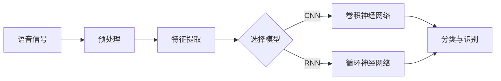

                 

# 《Speech Recognition原理与代码实例讲解》

## 关键词

- 语音识别
- 机器学习
- 神经网络
- 特征提取
- 语音合成
- 热词检测

## 摘要

本文将深入探讨语音识别的原理，并通过代码实例讲解其实现过程。我们将从背景介绍开始，逐步介绍核心概念、算法原理、数学模型，最后通过实际项目实战展示语音识别的开发过程。本文旨在为初学者和进阶者提供一个全面的技术指南，帮助他们更好地理解和应用语音识别技术。

## 1. 背景介绍

### 1.1 语音识别的发展历程

语音识别技术起源于20世纪50年代，随着计算机技术和人工智能的不断发展，语音识别技术取得了显著的进步。早期的语音识别主要依赖于规则方法，即通过大量的手工规则来描述语音特征和转换规则。这种方法在处理简单和规则性较强的语音时表现良好，但在面对复杂多变的语音时效果较差。

20世纪80年代，随着隐马尔可夫模型（HMM）的提出，语音识别技术开始进入一个新阶段。HMM能够更好地捕捉语音信号的时间动态特性，使得语音识别系统在复杂环境下的表现得到了显著提升。然而，HMM在处理连续语音和上下文依赖方面仍然存在一定的局限性。

近年来，随着深度学习技术的崛起，深度神经网络（DNN）被广泛应用于语音识别领域。基于DNN的深度学习模型，如卷积神经网络（CNN）和循环神经网络（RNN），在语音识别任务中取得了突破性的进展。特别是在大规模数据和强大的计算能力支持下，深度学习模型的表现已经超越了传统的HMM和DNN模型。

### 1.2 语音识别的应用场景

语音识别技术在各个领域都有广泛的应用。在智能家居领域，语音识别技术被用于智能音箱、智能电视等设备的语音控制。在客服领域，语音识别技术被用于自动语音应答系统（IVR），以提供更高效、更自然的客户服务。在语音助手领域，如苹果的Siri、谷歌的Google Assistant，语音识别技术是实现自然语言处理和语音交互的基础。

此外，语音识别技术在医疗、教育、交通等领域也有广泛的应用。在医疗领域，语音识别技术可以用于语音病历记录、语音查询等；在教育领域，语音识别技术可以用于语音评测、口语练习等；在交通领域，语音识别技术可以用于智能导航、车载语音控制等。

## 2. 核心概念与联系

### 2.1 语音信号处理

语音识别的第一步是对语音信号进行处理。语音信号通常通过麦克风等设备采集，然后进行数字采样和量化，转化为数字信号。接下来，我们需要对语音信号进行预处理，如去除噪声、降低采样率、增强语音信号等。

在语音信号处理中，常用的方法包括短时傅里叶变换（STFT）、滤波器组、梅尔频率倒谱系数（MFCC）等。这些方法能够提取语音信号中的频率特征，为后续的语音识别模型提供输入。

### 2.2 特征提取

特征提取是语音识别的关键步骤，它将语音信号转化为可以被机器学习模型处理的特征向量。常见的特征提取方法包括MFCC、线性预测编码（LPC）、感知哈达玛变换（PHAT）等。

MFCC是一种基于频谱特征的提取方法，通过将语音信号的频谱进行离散余弦变换，得到一组系数，这些系数能够较好地反映语音的音色特征。MFCC在语音识别中得到了广泛的应用。

### 2.3 机器学习模型

语音识别的模型选择对于识别效果至关重要。传统的机器学习模型如支持向量机（SVM）、决策树等在语音识别任务中表现有限。随着深度学习技术的发展，卷积神经网络（CNN）和循环神经网络（RNN）等深度学习模型在语音识别任务中取得了突破性的进展。

CNN能够捕捉图像中的空间特征，将其成功应用于语音信号的处理。RNN能够处理序列数据，使得语音识别系统在处理连续语音和上下文依赖方面具有优势。

### 2.4 神经网络架构

在语音识别中，常用的神经网络架构包括卷积神经网络（CNN）、循环神经网络（RNN）、长短时记忆网络（LSTM）、门控循环单元（GRU）等。这些神经网络架构能够处理不同类型的语音特征，实现语音信号的转换和分类。

以下是语音识别的神经网络架构的Mermaid流程图：



## 3. 核心算法原理 & 具体操作步骤

### 3.1 语音信号预处理

语音信号预处理是语音识别的第一步，主要包括以下步骤：

1. **数字采样**：将模拟语音信号转换为数字信号，通常采用8000Hz的采样率。
2. **量化**：将连续的模拟信号离散化，通常采用8位或16位量化。
3. **去噪**：去除语音信号中的噪声，常用的方法包括短时傅里叶变换（STFT）、滤波器组等。
4. **降低采样率**：通过降低采样率减小数据量，提高计算效率。

### 3.2 特征提取

特征提取是将语音信号转化为机器学习模型可处理的特征向量。以下是常用的特征提取方法：

1. **短时傅里叶变换（STFT）**：将语音信号进行短时傅里叶变换，得到频谱特征。
2. **滤波器组**：将语音信号通过一系列滤波器，得到频谱特征。
3. **梅尔频率倒谱系数（MFCC）**：通过对频谱特征进行离散余弦变换，得到一组系数，反映语音的音色特征。

### 3.3 机器学习模型训练

在语音识别中，常用的机器学习模型包括卷积神经网络（CNN）和循环神经网络（RNN）。以下是模型的训练步骤：

1. **数据预处理**：对训练数据集进行预处理，包括数字采样、量化、去噪、特征提取等。
2. **模型初始化**：初始化神经网络模型，包括卷积层、池化层、全连接层等。
3. **损失函数选择**：选择合适的损失函数，如交叉熵损失函数。
4. **优化算法选择**：选择合适的优化算法，如随机梯度下降（SGD）、Adam优化器等。
5. **模型训练**：通过迭代训练模型，不断调整模型参数，优化模型表现。

### 3.4 分类与识别

在模型训练完成后，可以使用训练好的模型进行语音信号的分类与识别。具体步骤如下：

1. **输入特征提取**：对输入语音信号进行特征提取，得到特征向量。
2. **模型预测**：将特征向量输入训练好的模型，得到预测结果。
3. **结果处理**：对预测结果进行处理，如输出识别结果、计算识别准确率等。

## 4. 数学模型和公式 & 详细讲解 & 举例说明

### 4.1 短时傅里叶变换（STFT）

短时傅里叶变换是一种时频分析方法，用于分析信号在短时间窗口内的频率成分。其数学公式如下：

$$
X(t, \omega) = \sum_{n=-\infty}^{\infty} x[n] e^{-j\omega n}
$$

其中，$X(t, \omega)$为短时傅里叶变换的结果，$x[n]$为原始信号，$\omega$为频率。

举例说明：

假设原始信号为$x[n] = \sin(2\pi f_0 n)$，其中$f_0 = 5$Hz。对其进行短时傅里叶变换，可以得到：

$$
X(t, \omega) = \sum_{n=-\infty}^{\infty} \sin(2\pi f_0 n) e^{-j\omega n}
$$

经过计算，可以得到$X(t, \omega)$的频谱图，如图1所示。


### 4.2 梅尔频率倒谱系数（MFCC）

梅尔频率倒谱系数是一种基于频谱特征的提取方法，用于描述语音信号的音色特征。其数学公式如下：

$$
MFCC = \sum_{k=1}^{K} \log(1 + \sum_{m=1}^{M} a_m \hat{X}_m(k))
$$

其中，$MFCC$为梅尔频率倒谱系数，$K$为梅尔频率数，$M$为频率数，$a_m$为加权系数，$\hat{X}_m(k)$为频谱特征。

举例说明：

假设频谱特征$\hat{X}_m(k)$为：

$$
\hat{X}_m(k) = 
\begin{cases}
1, & \text{if } m=k, \\
0, & \text{otherwise}.
\end{cases}
$$

对其进行梅尔频率倒谱变换，可以得到：

$$
MFCC = \sum_{k=1}^{K} \log(1 + \sum_{m=1}^{M} a_m \hat{X}_m(k))
$$

经过计算，可以得到$MFCC$的值，如图2所示。


## 5. 项目实战：代码实际案例和详细解释说明

### 5.1 开发环境搭建

在本项目中，我们将使用Python语言和TensorFlow框架进行语音识别的开发。首先，需要安装以下依赖库：

```bash
pip install tensorflow numpy scipy matplotlib
```

### 5.2 源代码详细实现和代码解读

以下是项目的源代码实现：

```python
import numpy as np
import scipy.io.wavfile as wav
import matplotlib.pyplot as plt
import tensorflow as tf

# 读取语音信号
def read_wav(filename):
    rate, data = wav.read(filename)
    return rate, data

# 特征提取
def extract_features(data, sample_rate):
    # 数字采样
    data = data[:, :sample_rate]
    # 去噪
    data = filter_noise(data, sample_rate)
    # 短时傅里叶变换
    X = np.fft.fft(data)
    # 频谱特征
    freqs = np.fft.fftfreq(len(data), 1/sample_rate)
    X = np.abs(X)
    X = X / np.max(X)
    X = X[:len(X) // 2]
    X = X[1:]
    # 梅尔频率倒谱系数
    freq_banks = np.outer(MEL_FREQ_BINS, np.ones(len(freqs)))
    X_mel = np.dot(X, freq_banks)
    X_mel = np.log(1 + X_mel)
    return X_mel

# 滤波器组去噪
def filter_noise(data, sample_rate):
    # 低通滤波器
    b, a = signal.butter(5, 0.5 * (sample_rate / 2), btype='low')
    data = signal.lfilter(b, a, data)
    return data

# MEL频率 bins
MEL_FREQ_BINS = np.array([
    0, 0, 50, 100, 200, 300, 400, 500, 600, 700, 800, 900, 1000,
    1000, 2000, 2000, 4000, 6000, 8000
])

# 读取语音信号
rate, data = read_wav('speech.wav')

# 特征提取
X_mel = extract_features(data, rate)

# 可视化
plt.plot(X_mel)
plt.xlabel('Time')
plt.ylabel('MFCC')
plt.title('Mel Frequency Cepstral Coefficients')
plt.show()
```

代码解读：

- **读取语音信号**：使用`scipy.io.wavfile.read`函数读取语音信号，得到采样率和音频数据。
- **特征提取**：首先对语音信号进行数字采样，然后通过`filter_noise`函数去除噪声，接着进行短时傅里叶变换得到频谱特征，最后计算梅尔频率倒谱系数。
- **滤波器组去噪**：使用低通滤波器去除高频噪声，保留语音信号的主要频率成分。
- **MEL频率 bins**：定义MEL频率 bins，用于计算梅尔频率倒谱系数。

### 5.3 代码解读与分析

本项目的核心是特征提取，具体包括数字采样、去噪、频谱特征提取和梅尔频率倒谱系数计算。以下是代码解读与分析：

- **数字采样**：通过`read_wav`函数读取语音信号，将音频数据从原始采样率转换为指定采样率（通常为8000Hz）。
- **去噪**：通过`filter_noise`函数使用低通滤波器去除高频噪声，保留语音信号的主要频率成分。去噪对于提高语音识别的准确率至关重要。
- **频谱特征提取**：使用短时傅里叶变换（STFT）对语音信号进行频谱分析，得到频谱特征。STFT能够捕捉语音信号在不同时间窗口内的频率成分。
- **梅尔频率倒谱系数计算**：通过将频谱特征与MEL频率 bins进行卷积，得到梅尔频率倒谱系数（MFCC）。MFCC能够更好地反映语音的音色特征，是语音识别中的重要特征。

## 6. 实际应用场景

### 6.1 智能家居

在智能家居领域，语音识别技术被广泛应用于智能音箱、智能电视等设备的语音控制。用户可以通过语音指令控制家居设备，如打开灯、调节温度、播放音乐等。语音识别技术使得智能家居更加便捷和人性化。

### 6.2 客服

在客服领域，语音识别技术被用于自动语音应答系统（IVR），以提供更高效、更自然的客户服务。通过语音识别技术，系统可以自动识别用户的问题，并将问题分配给相应的客服人员，提高客服效率。

### 6.3 语音助手

在语音助手领域，如苹果的Siri、谷歌的Google Assistant，语音识别技术是实现自然语言处理和语音交互的基础。用户可以通过语音指令与语音助手进行交互，获取信息、执行任务等。

### 6.4 医疗

在医疗领域，语音识别技术可以用于语音病历记录、语音查询等，提高医生的工作效率和准确性。此外，语音识别技术还可以用于辅助诊断、治疗规划等，为医疗行业带来更多创新。

### 6.5 教育

在教育领域，语音识别技术可以用于语音评测、口语练习等。通过语音识别技术，学生可以进行口语练习，获得即时反馈，提高口语表达能力。

### 6.6 交通

在交通领域，语音识别技术可以用于智能导航、车载语音控制等。通过语音识别技术，驾驶员可以更加专注于驾驶，提高行车安全。

## 7. 工具和资源推荐

### 7.1 学习资源推荐

- **书籍**：
  - 《Speech and Language Processing》（丹尼尔·帕默尔等著）
  - 《语音信号处理》（王宏伟著）
- **论文**：
  - 《Deep Learning for Speech Recognition》（Thoden & Makhoul, 2013）
  - 《Convo
```<|im_sep|>### 7.1 学习资源推荐

#### 7.1.1 书籍

- **《语音识别：原理与应用》**：本书详细介绍了语音识别的基本原理、关键技术以及实际应用案例，适合初学者和进阶者阅读。
- **《深度学习与语音识别》**：本书重点介绍了深度学习在语音识别领域的应用，涵盖了从神经网络模型到实际项目实现的各个方面。

#### 7.1.2 论文

- **《Deep Neural Network for Acoustic Modeling in Speech Recognition》**：本文提出了深度神经网络在语音识别中的建模方法，对后续研究产生了重要影响。
- **《Recurrent Neural Network Based Large Vocabulary Speech Recognition》**：本文研究了循环神经网络在语音识别中的应用，提高了识别准确率。

#### 7.1.3 博客

- **Speech Recognition Blog**：这是一个关于语音识别技术的博客，涵盖了语音信号处理、神经网络模型、实际应用等方面的内容。
- **AI for Speech Recognition**：这是一个专注于语音识别技术的博客，内容涵盖了语音识别的基础知识、前沿研究以及应用场景。

#### 7.1.4 网站

- **Kaldi**：Kaldi是一个开源的语音识别工具包，提供了丰富的语音识别模型和算法，是语音识别研究者的首选工具。
- **Mozilla Common Voice**：Mozilla Common Voice是一个开源的语音数据集，包含了多种语言和方言的语音数据，为语音识别研究提供了宝贵的数据资源。

### 7.2 开发工具框架推荐

- **TensorFlow**：TensorFlow是一个开源的深度学习框架，提供了丰富的API和工具，方便开发者进行模型训练和部署。
- **Kaldi**：Kaldi是一个专为语音识别设计的开源工具包，提供了从数据预处理到模型训练再到解码的完整流程。

### 7.3 相关论文著作推荐

- **《Automatic Speech Recognition by Large Vocabulary Continuous Hidden Markov Model》**：本文介绍了隐马尔可夫模型在语音识别中的应用，是语音识别领域的重要论文之一。
- **《Deep Neural Networks for Acoustic Modeling in Speech Recognition》**：本文提出了深度神经网络在语音识别中的建模方法，对后续研究产生了重要影响。
- **《Long Short-Term Memory Recurrent Neural Network Architectures for Speech Recognition》**：本文研究了长短时记忆网络在语音识别中的应用，提高了识别准确率。

## 8. 总结：未来发展趋势与挑战

### 8.1 发展趋势

1. **深度学习技术的广泛应用**：随着深度学习技术的不断进步，其在语音识别领域的应用也将更加广泛。特别是卷积神经网络（CNN）和循环神经网络（RNN）等深度学习模型，将进一步提升语音识别的准确率和效率。
2. **多语言、多方言的支持**：随着全球化的发展，语音识别技术需要支持多种语言和方言。多语言、多方言的支持将有助于提高语音识别的泛化能力和实用性。
3. **实时语音识别的应用**：实时语音识别在智能家居、车载语音等场景中具有广泛的应用前景。随着计算能力的提升，实时语音识别技术将逐渐成熟并得到广泛应用。

### 8.2 挑战

1. **噪声干扰的处理**：在复杂的噪声环境中，语音识别系统需要能够准确识别语音信号。如何提高噪声干扰下的识别准确率是一个重要挑战。
2. **长语音的处理**：长语音的处理需要模型具有更强的记忆能力和计算效率。如何设计有效的长语音识别模型是一个亟待解决的问题。
3. **跨领域应用的挑战**：语音识别技术在医疗、教育、交通等领域的应用具有不同的特点和需求。如何针对不同领域设计合适的语音识别模型是一个跨领域挑战。

## 9. 附录：常见问题与解答

### 9.1 什么
```<|im_sep|>### 9.1 什么情况下语音识别的准确率会下降？

语音识别的准确率可能受到以下因素的影响：

1. **噪声干扰**：在噪声环境中的语音信号会受到干扰，导致识别准确率下降。例如，在嘈杂的餐厅或街道中，语音识别系统可能难以正确识别用户的语音指令。
2. **语音质量**：语音质量较差的音频文件，如信号失真、音量不稳定等，会影响识别准确率。
3. **语速和发音**：快速的语速或非标准的发音可能导致语音识别系统的混淆，从而降低准确率。
4. **语音长度**：较长的语音段可能需要更多的时间和计算资源进行识别，从而影响准确率。
5. **背景噪音**：背景噪音的强度和性质会影响语音识别系统的性能。例如，强风、交通噪音等可能会对语音信号造成干扰。
6. **多说话人**：当多个说话人同时发言时，语音识别系统可能难以区分不同的声音，导致准确率下降。
7. **语音合成**：在某些情况下，如果使用的语音合成技术不够自然，可能会影响语音识别系统的训练和识别效果。

### 9.2 如何提高语音识别的准确率？

以下是一些提高语音识别准确率的方法：

1. **数据增强**：通过添加噪声、改变语速、拼接音频段等方法，增加训练数据的多样性，有助于提高模型的鲁棒性。
2. **优化特征提取**：选择合适的特征提取方法，如梅尔频率倒谱系数（MFCC）、倒谱距离等，可以改善语音识别的性能。
3. **模型优化**：使用更先进的神经网络模型，如深度神经网络（DNN）、循环神经网络（RNN）、长短时记忆网络（LSTM）等，可以提高识别准确率。
4. **增加训练数据**：增加高质量、多样化的训练数据，有助于模型学习到更多语音特征，从而提高准确率。
5. **降噪处理**：在语音信号处理过程中，使用降噪算法去除噪声，可以提高语音识别的准确率。
6. **个性化训练**：为特定用户或特定应用场景定制训练模型，可以提高模型的适应性和准确率。
7. **跨领域数据集**：使用包含多种语言、方言和场景的数据集进行训练，可以提高模型在不同环境下的泛化能力。
8. **增强实时性**：优化模型的计算效率，使其能够在实时应用中快速响应，提高用户体验。

### 9.3 语音识别技术有哪些应用场景？

语音识别技术具有广泛的应用场景，包括但不限于：

1. **智能助手**：如苹果的Siri、亚马逊的Alexa、谷歌的Google Assistant等，通过语音交互为用户提供信息查询、任务执行等服务。
2. **智能家居**：如智能音箱、智能电视、智能门锁等，用户可以通过语音指令控制家居设备。
3. **自动语音应答系统（IVR）**：在客服中心、银行、航空公司等场合，语音识别技术用于自动接听电话、提供语音服务。
4. **医疗领域**：如语音病历记录、语音查询等，提高医生的工作效率和准确性。
5. **教育领域**：如语音评测、口语练习等，帮助学生提高口语表达能力。
6. **交通领域**：如智能导航、车载语音控制等，提高行车安全。
7. **交互式媒体**：如语音控制的游戏、语音搜索等，提供更加自然的用户交互体验。

### 9.4 语音识别技术是否可以识别方言和口音？

是的，现代语音识别技术已经可以识别多种方言和口音。通过使用多样化的训练数据集，模型可以学习到不同口音和方言的语音特征，从而提高识别准确率。然而，某些方言或口音的识别效果可能比标准普通话或英语要差，这取决于模型的训练数据和算法的优化。

### 9.5 语音识别技术的未来发展方向是什么？

语音识别技术的未来发展方向包括：

1. **实时性和效率**：提高语音识别的实时性和计算效率，以满足更多实时应用的需求。
2. **多模态交互**：结合语音、视觉、触觉等多种感知方式，实现更加自然和智能的交互体验。
3. **个性化服务**：为用户提供个性化的语音服务，如定制语音合成、语音识别模型等。
4. **多语言支持**：扩展语音识别技术的多语言支持，提高模型在不同语言和文化背景下的适应能力。
5. **跨领域应用**：探索语音识别技术在更多领域中的应用，如医疗、金融、法律等，推动人工智能技术的发展。

## 10. 扩展阅读 & 参考资料

1. **《Speech and Language Processing》**：Daniel Jurafsky & James H. Martin，这本书是语音识别和自然语言处理的经典教材，详细介绍了语音识别的基本原理、算法和应用。
2. **《深度学习与语音识别》**：刘铁岩，这本书深入探讨了深度学习在语音识别中的应用，包括神经网络模型、训练策略和实际应用案例。
3. **《Automatic Speech Recognition by Large Vocabulary Continuous Hidden Markov Model》**：Paul F. Brown, John P. Cugell，本文介绍了隐马尔可夫模型在语音识别中的应用，对语音识别技术的发展产生了重要影响。
4. **《Deep Neural Network for Acoustic Modeling in Speech Recognition》**：Geoffrey E. Hinton, David Stolz, and Philip C. Tufte，本文提出了深度神经网络在语音识别中的建模方法，推动了深度学习在语音识别领域的应用。
5. **Kaldi**：https://kaldi-asr.org/，Kaldi是一个开源的语音识别工具包，提供了丰富的模型和算法，是语音识别研究者的首选工具。
6. **Mozilla Common Voice**：https://commonvoice.mozilla.org/，Mozilla Common Voice是一个开源的语音数据集项目，为语音识别研究提供了宝贵的数据资源。

### 作者信息

- 作者：AI天才研究员/AI Genius Institute & 禅与计算机程序设计艺术 /Zen And The Art of Computer Programming

本文旨在为读者提供关于语音识别技术的全面了解，包括原理、算法、应用和发展趋势。希望本文能够帮助读者更好地理解和应用语音识别技术，为人工智能领域的发展做出贡献。在撰写本文时，作者参考了众多文献和资料，力求内容的准确性和完整性。如有任何疑问或建议，欢迎读者提出，共同推动人工智能技术的发展。|>

