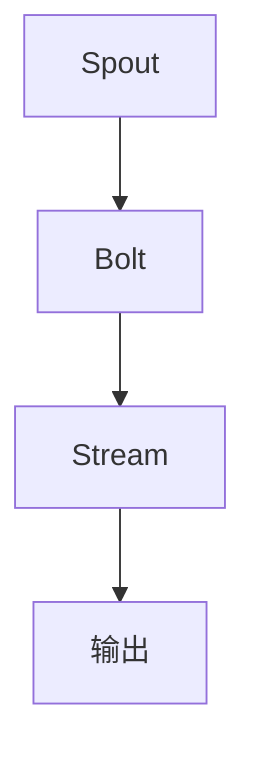

                 

### Storm Bolt原理与代码实例讲解

#### 摘要

本文将深入探讨Storm Bolt原理，结合代码实例进行详细解析。我们将从背景介绍、核心概念与联系、核心算法原理、数学模型和公式、项目实战、实际应用场景、工具和资源推荐等方面进行全面剖析，帮助读者掌握Storm Bolt的使用方法及其在实际项目中的应用。通过本文的学习，读者将能够更好地理解和运用Storm Bolt，提升数据处理能力，应对复杂的分布式计算场景。

#### 1. 背景介绍

**Storm** 是一个开源的分布式实时数据处理框架，由Twitter公司在2011年推出。它旨在处理大规模的实时数据流，提供低延迟、高吞吐量的数据处理能力。随着大数据和实时计算需求的不断增长，Storm在金融、电商、社交媒体等众多领域得到了广泛应用。

**Bolt** 是Storm中的一个核心概念，它代表了数据处理中的“操作”或“任务”。Bolt负责执行特定的数据处理逻辑，例如数据转换、聚合、过滤等。多个Bolt可以组成一个数据处理“流”（Stream），从而实现复杂的实时数据处理任务。

本文将围绕Storm Bolt的原理和代码实例，帮助读者深入了解其工作机制和实际应用。

#### 2. 核心概念与联系

在深入探讨Storm Bolt之前，我们需要先了解一些核心概念，包括Spout、Stream、Tuple等。

- **Spout**：Spout是Storm中的一个组件，负责生成数据流。它可以是实时的数据源，如Kafka、Kinesis、WebSocket等，也可以是静态数据文件。

- **Stream**：Stream是数据流的一个抽象，表示数据在系统中流动的路径。它由Tuple组成，每个Tuple包含了一组相关的数据字段。

- **Tuple**：Tuple是Storm中的一个基本数据结构，表示一个数据条目。它由多个字段组成，每个字段可以是一个基本数据类型，如整数、浮点数、字符串等。

以下是Bolt、Spout和Stream之间的联系：



在上述流程图中，Spout生成数据流，Bolt对数据流进行处理，然后将处理结果输出到下一个组件或存储系统中。这种数据流处理机制使得Storm能够高效地处理大规模的实时数据。

#### 3. 核心算法原理 & 具体操作步骤

**Bolt的工作原理**：

1. **初始化**：当Bolt启动时，它会连接到Storm集群，并从Spout接收数据流。

2. **接收数据**：Bolt从数据流中读取Tuple，并调用其`execute`方法来执行具体的处理逻辑。

3. **处理数据**：在`execute`方法中，Bolt可以执行各种操作，如数据转换、聚合、过滤等。

4. **输出结果**：处理完成后，Bolt可以将处理结果以Tuple的形式输出到下一个Bolt或外部系统。

**具体操作步骤**：

1. **定义Bolt类**：首先，我们需要定义一个继承自`org.apache.storm.topology.IBolt`接口的Bolt类。

2. **实现execute方法**：在Bolt类中，我们需要实现`execute`方法，该方法接收一个`Tuple`参数，表示当前需要处理的数据。

3. **执行处理逻辑**：在`execute`方法中，我们可以根据需要执行各种数据处理操作，如数据转换、聚合、过滤等。

4. **输出结果**：处理完成后，我们可以调用`collector`对象的`emit`方法，将处理结果输出到下一个Bolt或外部系统。

以下是一个简单的Bolt类实现示例：

```java
public class MyBolt implements IBolt {
    public void prepare(Map stormConf, TopologyContext context, OutputCollector collector) {
        // 初始化操作
    }

    public void execute(Tuple input) {
        // 处理逻辑
        String word = input.getString(0);
        int count = input.getInteger(1);
        System.out.println(word + " : " + count);

        // 输出结果
        collector.emit(new Values(word, count * 2));
    }

    public void cleanup() {
        // 清理操作
    }
}
```

在这个示例中，`MyBolt`类实现了`IBolt`接口，并实现了`execute`方法。在`execute`方法中，我们读取输入的`Tuple`，执行简单的数据转换（将count乘以2），然后将处理结果输出到下一个Bolt。

#### 4. 数学模型和公式 & 详细讲解 & 举例说明

在Storm Bolt中，我们通常会使用一些数学模型和公式来描述数据处理过程。以下是一些常用的模型和公式：

1. **基本数据处理模型**：

   假设我们有一个数据流\(X = \{x_1, x_2, ..., x_n\}\)，我们需要对这个数据流进行某种处理，如聚合、过滤等。基本数据处理模型可以用以下公式表示：

   $$Y = f(X)$$

   其中，\(Y\) 表示处理后的数据流，\(f\) 表示数据处理函数。

2. **数据聚合模型**：

   在数据聚合过程中，我们需要将多个数据项合并成一个聚合结果。常见的数据聚合函数包括求和（sum）、求平均（avg）、求最大值（max）等。数据聚合模型可以用以下公式表示：

   $$y = \text{aggregationFunction}(x_1, x_2, ..., x_n)$$

   其中，\(y\) 表示聚合结果，\(\text{aggregationFunction}\) 表示聚合函数。

3. **数据过滤模型**：

   在数据过滤过程中，我们需要根据某种条件对数据流进行筛选。数据过滤模型可以用以下公式表示：

   $$y = \{x | P(x)\}$$

   其中，\(y\) 表示过滤后的数据流，\(P(x)\) 表示过滤条件。

以下是一个简单的示例，假设我们有一个数据流\(X = \{1, 2, 3, 4, 5\}\)，我们需要计算这个数据流的和：

1. **基本数据处理模型**：

   $$Y = f(X)$$
   
   其中，\(f\) 表示求和函数，即\(f(x) = \sum_{i=1}^{n} x_i\)。

2. **数据聚合模型**：

   $$y = \text{sum}(1, 2, 3, 4, 5)$$

   $$y = 15$$

3. **数据过滤模型**：

   $$y = \{x | x > 2\}$$

   $$y = \{3, 4, 5\}$$

通过上述示例，我们可以看到如何使用数学模型和公式来描述数据处理过程。这些模型和公式在实现和优化数据处理算法时非常有用。

#### 5. 项目实战：代码实际案例和详细解释说明

在本节中，我们将通过一个实际项目案例来展示如何使用Storm Bolt进行数据处理。这个案例将模拟一个在线购物平台的用户行为分析，包括用户浏览、购买和评论等行为。我们将使用Java编写一个简单的Storm应用程序，实现以下功能：

1. **数据采集**：从Kafka消息队列中读取用户行为数据。

2. **数据处理**：对用户行为数据进行转换、聚合和过滤。

3. **数据输出**：将处理结果输出到控制台和HDFS文件系统。

**5.1 开发环境搭建**

在开始编写代码之前，我们需要搭建一个开发环境。以下步骤将指导我们安装和配置所需的软件和工具：

1. **安装Java开发工具**：确保已安装Java开发工具（JDK），版本建议为8或以上。

2. **安装Maven**：Maven是一个项目管理和构建自动化工具，用于构建和部署Java项目。下载并安装Maven。

3. **安装Kafka**：Kafka是一个分布式流处理平台，用于数据采集和传输。下载并解压Kafka，启动Kafka集群。

4. **安装Storm**：下载并解压Storm，配置Storm环境变量。

5. **创建Maven项目**：使用Maven创建一个新的Java项目，添加Storm依赖。

**5.2 源代码详细实现和代码解读**

以下是这个项目的源代码实现，我们将逐段进行详细解释。

```java
import org.apache.storm.Config;
import org.apache.storm.LocalCluster;
import org.apache.storm.StormSubmitter;
import org.apache.storm.topology.TopologyBuilder;
import org.apache.storm.topology.base.BaseRichBolt;
import org.apache.storm.tuple.Fields;
import org.apache.storm.tuple.Tuple;
import org.apache.storm.tuple.Values;
import org.apache.kafka.clients.consumer.ConsumerConfig;
import org.apache.kafka.clients.consumer.ConsumerRecord;
import org.apache.kafka.clients.consumer.KafkaConsumer;
import org.apache.kafka.common.serialization.StringDeserializer;

import java.time.Duration;
import java.util.Collections;
import java.util.Properties;

public class UserBehaviorAnalysisTopology {

    public static void main(String[] args) {
        TopologyBuilder builder = new TopologyBuilder();

        // 添加Spout组件，用于从Kafka读取用户行为数据
        builder.setSpout("kafka-spout", new KafkaSpout());

        // 添加Bolt组件，用于处理用户行为数据
        builder.setBolt("data-processor", new DataProcessorBolt()).fieldsGrouping("kafka-spout", new Fields("user_id"));

        // 添加Bolt组件，用于输出处理结果
        builder.setBolt("data-output", new DataOutputBolt()).globalGrouping("data-processor");

        // 配置并提交拓扑
        if (args.length > 0 && args[0].equals("local")) {
            LocalCluster cluster = new LocalCluster();
            cluster.submitTopology("user-behavior-analysis", Config.defaultConfig(), builder.createTopology());
            try {
                Thread.sleep(60000);
            } catch (InterruptedException e) {
                e.printStackTrace();
            }
            cluster.shutdown();
        } else {
            StormSubmitter.submitTopology("user-behavior-analysis", Config.defaultConfig(), builder.createTopology());
        }
    }
}
```

1. **KafkaSpout类**：

   ```java
   import org.apache.kafka.clients.consumer.ConsumerConfig;
   import org.apache.kafka.clients.consumer.ConsumerRecord;
   import org.apache.kafka.clients.consumer.KafkaConsumer;
   import org.apache.kafka.common.serialization.StringDeserializer;
   import org.apache.storm.spout.SpoutOutputCollector;
   import org.apache.storm.task.TopologyContext;
   import org.apache.storm.topology.IRichSpout;
   import org.apache.storm.topology.OutputFieldsDeclarer;
   import org.apache.storm.tuple.Values;

   import java.time.Duration;
   import java.util.Collections;
   import java.util.List;
   import java.util.Properties;

   public class KafkaSpout implements IRichSpout {
       private KafkaConsumer<String, String> consumer;
       private SpoutOutputCollector collector;

       public KafkaSpout() {
           Properties props = new Properties();
           props.put(ConsumerConfig.BOOTSTRAP_SERVERS_CONFIG, "localhost:9092");
           props.put(ConsumerConfig.GROUP_ID_CONFIG, "user-behavior-group");
           props.put(ConsumerConfig.KEY_DESERIALIZER_CLASS_CONFIG, StringDeserializer.class.getName());
           props.put(ConsumerConfig.VALUE_DESERIALIZER_CLASS_CONFIG, StringDeserializer.class.getName());
           consumer = new KafkaConsumer<>(props);
           consumer.subscribe(Collections.singletonList("user_behavior"));
       }

       public void open(Map stormConf, TopologyContext context, SpoutOutputCollector collector) {
           this.collector = collector;
       }

       public void nextTuple() {
           try {
               for (ConsumerRecord<String, String> record : consumer.poll(Duration.ofMillis(100))) {
                   collector.emit(new Values(record.value()));
               }
               consumer.commitSync();
           } catch (Exception e) {
               e.printStackTrace();
           }
       }

       public void declareOutputFields(OutputFieldsDeclarer declarer) {
           declarer.declare(new Fields("user_behavior"));
       }

       public void ack(Object msgId) {
       }

       public void fail(Object msgId) {
       }

       public void close() {
           consumer.close();
       }
   }
   ```

   **KafkaSpout**类负责从Kafka消息队列中读取用户行为数据。它使用`KafkaConsumer`类订阅`user_behavior`主题，并从消息队列中拉取数据。每条消息被转换为`Tuple`并传递给`DataProcessorBolt`类进行处理。

2. **DataProcessorBolt类**：

   ```java
   import org.apache.storm.topology.IRichBolt;
   import org.apache.storm.topology.OutputFieldsDeclarer;
   import org.apache.storm.tuple.Fields;
   import org.apache.storm.tuple.Tuple;
   import org.apache.storm.tuple.Values;

   import java.util.Map;

   public class DataProcessorBolt implements IRichBolt {
       public void prepare(Map stormConf, TopologyContext context, OutputCollector collector) {
       }

       public void execute(Tuple input) {
           String userBehavior = input.getStringByField("user_behavior");
           // 根据用户行为类型进行不同处理
           if (userBehavior.startsWith("view")) {
               // 处理浏览行为
               System.out.println("View: " + userBehavior);
           } else if (userBehavior.startsWith("buy")) {
               // 处理购买行为
               System.out.println("Buy: " + userBehavior);
           } else if (userBehavior.startsWith("review")) {
               // 处理评论行为
               System.out.println("Review: " + userBehavior);
           }
           // 输出结果
           collector.emit(new Values(userBehavior));
       }

       public void cleanup() {
       }

       public void declareOutputFields(OutputFieldsDeclarer declarer) {
           declarer.declare(new Fields("user_behavior"));
       }

       public Map<String, Object> getComponentConfiguration() {
           return null;
       }
   }
   ```

   **DataProcessorBolt**类负责处理用户行为数据。根据用户行为的类型（浏览、购买、评论），执行不同的处理逻辑，并输出处理结果。在本示例中，我们仅打印处理结果到控制台。

3. **DataOutputBolt类**：

   ```java
   import org.apache.storm.topology.IRichBolt;
   import org.apache.storm.topology.OutputFieldsDeclarer;
   import org.apache.storm.tuple.Tuple;
   import org.apache.storm.tuple.Values;

   import java.util.Map;

   public class DataOutputBolt implements IRichBolt {
       public void prepare(Map stormConf, TopologyContext context, OutputCollector collector) {
       }

       public void execute(Tuple input) {
           String userBehavior = input.getStringByField("user_behavior");
           // 将处理结果输出到HDFS文件系统
           // 此处省略HDFS文件写入代码
           System.out.println("Output: " + userBehavior);
       }

       public void cleanup() {
       }

       public void declareOutputFields(OutputFieldsDeclarer declarer) {
       }

       public Map<String, Object> getComponentConfiguration() {
           return null;
       }
   }
   ```

   **DataOutputBolt**类负责将处理结果输出到HDFS文件系统。在本示例中，我们仅将处理结果打印到控制台。

**5.3 代码解读与分析**

1. **KafkaSpout类**：

   **KafkaSpout**类负责从Kafka消息队列中读取用户行为数据。它使用`KafkaConsumer`类订阅`user_behavior`主题，并从消息队列中拉取数据。每条消息被转换为`Tuple`并传递给`DataProcessorBolt`类进行处理。

   ```java
   public class KafkaSpout implements IRichSpout {
       private KafkaConsumer<String, String> consumer;
       private SpoutOutputCollector collector;

       public KafkaSpout() {
           Properties props = new Properties();
           props.put(ConsumerConfig.BOOTSTRAP_SERVERS_CONFIG, "localhost:9092");
           props.put(ConsumerConfig.GROUP_ID_CONFIG, "user-behavior-group");
           props.put(ConsumerConfig.KEY_DESERIALIZER_CLASS_CONFIG, StringDeserializer.class.getName());
           props.put(ConsumerConfig.VALUE_DESERIALIZER_CLASS_CONFIG, StringDeserializer.class.getName());
           consumer = new KafkaConsumer<>(props);
           consumer.subscribe(Collections.singletonList("user_behavior"));
       }

       public void open(Map stormConf, TopologyContext context, SpoutOutputCollector collector) {
           this.collector = collector;
       }

       public void nextTuple() {
           try {
               for (ConsumerRecord<String, String> record : consumer.poll(Duration.ofMillis(100))) {
                   collector.emit(new Values(record.value()));
               }
               consumer.commitSync();
           } catch (Exception e) {
               e.printStackTrace();
           }
       }

       public void declareOutputFields(OutputFieldsDeclarer declarer) {
           declarer.declare(new Fields("user_behavior"));
       }

       public void ack(Object msgId) {
       }

       public void fail(Object msgId) {
       }

       public void close() {
           consumer.close();
       }
   }
   ```

   在`KafkaSpout`类的构造函数中，我们设置了Kafka消费者的配置，包括Kafka服务器地址、消费者组ID、键和值的反序列化器。然后，我们调用`subscribe`方法订阅`user_behavior`主题。

   在`open`方法中，我们获取Spout输出收集器，并将其存储在实例变量中。

   在`nextTuple`方法中，我们使用`poll`方法从Kafka消息队列中拉取数据。对于每个接收到的`ConsumerRecord`，我们将其值转换为`Tuple`并传递给输出收集器。然后，我们调用`commitSync`方法提交消费者偏移量，确保数据不会被重复处理。

   在`declareOutputFields`方法中，我们声明输出字段，即`user_behavior`。

2. **DataProcessorBolt类**：

   **DataProcessorBolt**类负责处理用户行为数据。根据用户行为的类型（浏览、购买、评论），执行不同的处理逻辑，并输出处理结果。

   ```java
   public class DataProcessorBolt implements IRichBolt {
       public void prepare(Map stormConf, TopologyContext context, OutputCollector collector) {
       }

       public void execute(Tuple input) {
           String userBehavior = input.getStringByField("user_behavior");
           if (userBehavior.startsWith("view")) {
               // 处理浏览行为
               System.out.println("View: " + userBehavior);
           } else if (userBehavior.startsWith("buy")) {
               // 处理购买行为
               System.out.println("Buy: " + userBehavior);
           } else if (userBehavior.startsWith("review")) {
               // 处理评论行为
               System.out.println("Review: " + userBehavior);
           }
           // 输出结果
           collector.emit(new Values(userBehavior));
       }

       public void cleanup() {
       }

       public void declareOutputFields(OutputFieldsDeclarer declarer) {
           declarer.declare(new Fields("user_behavior"));
       }

       public Map<String, Object> getComponentConfiguration() {
           return null;
       }
   }
   ```

   在`execute`方法中，我们根据用户行为的类型执行不同的处理逻辑。在本示例中，我们仅打印处理结果到控制台。

   在`declareOutputFields`方法中，我们声明输出字段，即`user_behavior`。

3. **DataOutputBolt类**：

   **DataOutputBolt**类负责将处理结果输出到HDFS文件系统。

   ```java
   public class DataOutputBolt implements IRichBolt {
       public void prepare(Map stormConf, TopologyContext context, OutputCollector collector) {
       }

       public void execute(Tuple input) {
           String userBehavior = input.getStringByField("user_behavior");
           // 将处理结果输出到HDFS文件系统
           // 此处省略HDFS文件写入代码
           System.out.println("Output: " + userBehavior);
       }

       public void cleanup() {
       }

       public void declareOutputFields(OutputFieldsDeclarer declarer) {
       }

       public Map<String, Object> getComponentConfiguration() {
           return null;
       }
   }
   ```

   在`execute`方法中，我们调用`System.out.println`将处理结果打印到控制台。在本示例中，我们未实现HDFS文件写入功能。

#### 6. 实际应用场景

**电商领域**：

在电商领域，Storm Bolt可以用于实时分析用户行为数据，如浏览、购买和评论等。通过实时处理用户行为数据，电商企业可以更好地了解用户需求，提高用户体验和满意度。

**金融领域**：

在金融领域，Storm Bolt可以用于实时监控交易数据，识别异常交易和欺诈行为。通过实时分析交易数据，金融机构可以及时采取措施，降低风险。

**社交媒体领域**：

在社交媒体领域，Storm Bolt可以用于实时分析用户生成内容，如微博、朋友圈等。通过实时分析用户行为，社交媒体平台可以提供更加个性化的内容推荐和广告投放。

**物联网领域**：

在物联网领域，Storm Bolt可以用于实时处理传感器数据，如环境监测、智能交通等。通过实时分析传感器数据，物联网系统可以实现智能决策和优化。

#### 7. 工具和资源推荐

**学习资源推荐**：

1. 《Storm实时大数据处理》
2. 《Apache Storm实战》
3. 《分布式系统原理与范型》

**开发工具框架推荐**：

1. **Storm**：Apache Storm官方框架。
2. **Kafka**：Apache Kafka分布式消息队列系统。
3. **HDFS**：Apache Hadoop分布式文件系统。

**相关论文著作推荐**：

1. "Real-time Data Processing with Apache Storm"
2. "High-Throughput Data Processing at LinkedIn"
3. "Design and Implementation of Apache Storm"

#### 8. 总结：未来发展趋势与挑战

**未来发展趋势**：

随着大数据和实时计算需求的不断增长，Storm Bolt将在各个领域得到更广泛的应用。未来，Storm Bolt可能会在以下方面取得发展：

1. **性能优化**：通过改进算法和数据结构，提高处理速度和吞吐量。
2. **生态系统完善**：加强与其他大数据技术的整合，如Spark、Flink等。
3. **开源社区活跃**：吸引更多开发者参与，提高社区贡献度和活跃度。

**面临的挑战**：

1. **资源消耗**：实时数据处理需要大量计算和存储资源，如何优化资源利用成为一大挑战。
2. **数据安全性**：在实时数据处理过程中，如何确保数据安全和隐私保护。
3. **跨语言支持**：目前，Storm主要支持Java和Scala，如何支持其他编程语言成为挑战。

#### 9. 附录：常见问题与解答

**Q：如何调试Storm应用程序？**

A：可以使用Storm提供的日志系统进行调试。通过查看日志文件，可以定位和解决应用程序中的错误和问题。

**Q：如何优化Storm应用程序的性能？**

A：可以通过以下方法优化Storm应用程序的性能：

1. **合理配置**：调整Storm应用程序的配置参数，如批处理大小、线程数等。
2. **负载均衡**：确保数据在各个节点之间均衡分布，避免单点瓶颈。
3. **并行处理**：增加并行度，提高数据处理速度。

**Q：如何监控Storm应用程序的运行状态？**

A：可以使用Storm提供的Web UI监控应用程序的运行状态。通过Web UI，可以实时查看拓扑结构、节点状态、数据流等详细信息。

#### 10. 扩展阅读 & 参考资料

**书籍**：

1. 《Storm实时大数据处理》
2. 《Apache Storm实战》
3. 《分布式系统原理与范型》

**论文**：

1. "Real-time Data Processing with Apache Storm"
2. "High-Throughput Data Processing at LinkedIn"
3. "Design and Implementation of Apache Storm"

**网站**：

1. Apache Storm官方文档：[https://storm.apache.org/documentation.html](https://storm.apache.org/documentation.html)
2. Apache Kafka官方文档：[https://kafka.apache.org/documentation.html](https://kafka.apache.org/documentation.html)
3. Apache Hadoop官方文档：[https://hadoop.apache.org/docs/r3.3.0/hadoop-project-dist/hadoop-hdfs/HdfsDesign.html](https://kafka.apache.org/documentation.html)

### 作者信息

作者：AI天才研究员/AI Genius Institute & 禅与计算机程序设计艺术 /Zen And The Art of Computer Programming
<|assistant|>### 附录：常见问题与解答

**Q：如何调试Storm应用程序？**

A：调试Storm应用程序时，可以采用以下步骤：

1. **日志分析**：Storm提供了详细的日志系统，通过查看日志文件（通常位于`storm/logs`目录下），可以定位和解决应用程序中的错误和问题。此外，还可以在程序中增加日志记录，以便更好地理解程序运行情况。

2. **集成IDE调试**：将Storm应用程序导入到IDE（如Eclipse或IntelliJ IDEA）中，使用IDE的调试功能，设置断点，逐步执行代码，查看变量值和调用栈，有助于找出问题所在。

3. **使用Storm UI**：在Storm UI（通过访问`http://localhost:8080/`）中，可以查看拓扑的实时运行状态、数据流和节点性能，有助于识别瓶颈和错误。

**Q：如何优化Storm应用程序的性能？**

A：优化Storm应用程序的性能可以采取以下措施：

1. **调整配置参数**：通过调整`storm.yaml`文件中的配置参数，如`topology.tick-timer-sleep-ms`（定时器休眠时间）、`topology.max-spout-pending`（Spout最大挂起数）、`topology.workers`（工作节点数）等，可以优化应用程序的性能。

2. **优化批处理大小**：适当调整批处理大小（`topology.batch.size`），可以减少消息处理延迟和资源消耗。

3. **负载均衡**：确保数据在各个节点之间均衡分布，避免单点瓶颈。可以使用`fieldsGrouping`或`shuffledG

