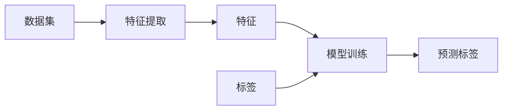

                 

### 背景介绍

Supervised Learning 是机器学习和人工智能领域中的一种基础方法，它通过从标注过的数据集中学习，预测未知数据的标签。这种方法在多个领域都取得了显著的成果，例如图像识别、语音识别、自然语言处理等。了解Supervised Learning的背景和发展历程，有助于我们更好地理解和应用这一方法。

监督学习（Supervised Learning）的起源可以追溯到20世纪50年代和60年代。当时，计算机科学家开始研究如何让机器模拟人类的推理和学习过程。1956年，约翰·麦卡锡（John McCarthy）在达特茅斯会议上提出了人工智能（AI）的概念，标志着人工智能领域的正式诞生。随后，监督学习作为一种机器学习方法，逐渐发展起来。

早期监督学习的研究主要集中在分类和回归问题。其中，分类问题是指将数据分为不同的类别，而回归问题则是预测连续值。1970年代，决策树（Decision Tree）和线性回归（Linear Regression）等方法被提出，为监督学习奠定了基础。

随着计算机硬件和算法的发展，监督学习在20世纪80年代和90年代迎来了快速发展。支持向量机（Support Vector Machine，SVM）和神经网络（Neural Networks）等高级算法被提出，进一步提高了监督学习的性能。2000年后，深度学习的出现，使得监督学习取得了更为显著的成果，尤其在图像识别和语音识别等领域。

在应用领域方面，监督学习已经广泛应用于各个行业。例如，在图像识别方面，监督学习被用于人脸识别、物体识别、医疗图像分析等；在语音识别方面，监督学习被用于语音识别、语音合成、语音翻译等；在自然语言处理方面，监督学习被用于情感分析、文本分类、机器翻译等。

总之，监督学习作为机器学习和人工智能领域的基础方法，经过多年的发展，已经在各个领域取得了显著的成果。了解监督学习的背景和发展历程，有助于我们更好地理解和应用这一方法，推动人工智能的进一步发展。

### 核心概念与联系

监督学习（Supervised Learning）的核心概念包括数据集、特征和标签。这些概念在监督学习中起着至关重要的作用，下面将分别对其进行详细介绍。

#### 数据集

数据集（Dataset）是监督学习的基础。它是一个包含多个样本的集合，每个样本表示一个具体的数据点。数据集可以来自不同的来源，例如图像、文本、音频、视频等。一个高质量的数据集对于监督学习模型的性能至关重要。理想的数据集应该具有以下特点：

1. **代表性**：数据集应该能够代表我们要解决的问题。这意味着数据集中的样本应该涵盖我们要预测的类别的所有可能情况。
2. **平衡性**：数据集中的各个类别应该保持平衡，以避免模型偏向于某个类别。
3. **多样性**：数据集应该包含不同类型的样本，以提高模型的泛化能力。

#### 特征

特征（Features）是从数据集中提取出来的用于描述样本的属性。特征可以是原始数据，也可以是对原始数据进行处理后的结果。特征的选择和提取对于监督学习模型的效果有着重要影响。以下是一些常见的特征提取方法：

1. **数值特征**：数值特征是最常见的特征类型，例如图像的像素值、文本的词频等。
2. **文本特征**：文本特征包括词袋模型（Bag of Words，BOW）、TF-IDF（Term Frequency-Inverse Document Frequency）等。
3. **图像特征**：图像特征包括边缘、纹理、颜色等。
4. **音频特征**：音频特征包括频谱、音高、节奏等。

#### 标签

标签（Labels）是数据集中的每个样本对应的真实类别或值。在分类问题中，标签是一个离散的类别，例如“猫”或“狗”；在回归问题中，标签是一个连续的数值，例如房价或温度。标签是监督学习模型的目标，模型将通过学习数据集中的特征和标签之间的关系来预测未知数据的标签。

#### 数据集、特征和标签之间的关系

在监督学习中，数据集、特征和标签之间有着密切的关系。数据集是特征和标签的来源，特征是对数据集进行预处理和转换后的结果，而标签是模型的预测目标。具体来说，数据集通过特征提取过程生成特征，然后模型通过学习特征和标签之间的关系来预测未知数据的标签。

下面是一个简单的流程图，展示了数据集、特征和标签之间的关系：



在这个流程图中，数据集经过特征提取生成特征，然后模型通过学习特征和标签之间的关系来训练，最后使用训练好的模型来预测未知数据的标签。

通过理解数据集、特征和标签之间的关系，我们可以更好地设计监督学习模型，提高模型的性能和泛化能力。

### 核心算法原理 & 具体操作步骤

监督学习算法的核心是学习输入特征与输出标签之间的关系，并利用这种关系对未知数据进行预测。为了实现这一目标，监督学习算法需要通过以下步骤进行操作：

#### 步骤1：数据预处理

在开始训练监督学习模型之前，需要对数据集进行预处理。数据预处理的目的是提高数据质量，减少噪声，并使数据更适合模型训练。常见的数据预处理步骤包括：

1. **数据清洗**：去除或填充缺失值，处理异常值。
2. **数据标准化**：将数据缩放到相同的尺度，例如使用Min-Max标准化或Z-Score标准化。
3. **特征工程**：根据问题的特点，选择和构造有效的特征。

#### 步骤2：划分数据集

将数据集划分为训练集和测试集是监督学习中的一个关键步骤。训练集用于训练模型，测试集用于评估模型的性能。通常，训练集和测试集的划分比例为80/20或70/30。以下是一个简单的数据集划分方法：

```python
from sklearn.model_selection import train_test_split

X, y = load_data()  # 加载数据
X_train, X_test, y_train, y_test = train_test_split(X, y, test_size=0.2, random_state=42)
```

#### 步骤3：选择合适的模型

选择合适的监督学习模型是模型训练成功的关键。不同的模型适用于不同类型的问题。以下是几种常见的监督学习模型：

1. **线性回归（Linear Regression）**：适用于回归问题，通过线性函数来预测连续值。
2. **逻辑回归（Logistic Regression）**：适用于二分类问题，通过逻辑函数来预测概率。
3. **决策树（Decision Tree）**：适用于分类和回归问题，通过树的形状来预测结果。
4. **随机森林（Random Forest）**：通过集成多个决策树来提高模型的泛化能力。
5. **支持向量机（Support Vector Machine，SVM）**：适用于分类和回归问题，通过寻找最优超平面来划分类别。
6. **神经网络（Neural Networks）**：适用于多种问题，通过多层神经网络来模拟非线性关系。

#### 步骤4：模型训练

使用训练集对选定的监督学习模型进行训练。在训练过程中，模型会根据输入特征和对应的标签来调整模型的参数，以最小化预测误差。以下是一个简单的模型训练示例：

```python
from sklearn.linear_model import LinearRegression

model = LinearRegression()
model.fit(X_train, y_train)
```

#### 步骤5：模型评估

使用测试集对训练好的模型进行评估，以了解模型的泛化能力。常见的评估指标包括：

1. **准确率（Accuracy）**：预测正确的样本占总样本的比例。
2. **精确率（Precision）**：预测为正类的样本中实际为正类的比例。
3. **召回率（Recall）**：实际为正类的样本中被预测为正类的比例。
4. **F1分数（F1 Score）**：精确率和召回率的调和平均。
5. **均方误差（Mean Squared Error，MSE）**：回归问题中预测值与真实值之间的平均平方误差。

以下是一个简单的模型评估示例：

```python
from sklearn.metrics import accuracy_score, mean_squared_error

y_pred = model.predict(X_test)
accuracy = accuracy_score(y_test, y_pred)
mse = mean_squared_error(y_test, y_pred)

print("Accuracy:", accuracy)
print("MSE:", mse)
```

#### 步骤6：模型优化

根据模型评估的结果，可以对模型进行优化，以提高模型的性能。常见的优化方法包括：

1. **调整模型参数**：通过调整模型参数来改善模型性能。
2. **增加训练数据**：增加训练数据量可以提高模型的泛化能力。
3. **特征选择**：通过选择有效的特征来提高模型性能。
4. **集成学习**：通过集成多个模型来提高模型性能。

通过以上步骤，我们可以构建并优化一个监督学习模型，以解决各种分类和回归问题。理解这些步骤并能够灵活运用，对于在机器学习和人工智能领域取得成功至关重要。

### 数学模型和公式 & 详细讲解 & 举例说明

#### 线性回归模型

线性回归是监督学习中最基本和最常用的算法之一。它主要用于预测一个连续的数值输出。线性回归模型的数学公式如下：

\[ y = \beta_0 + \beta_1 \cdot x \]

其中，\( y \) 是预测值，\( x \) 是输入特征，\( \beta_0 \) 和 \( \beta_1 \) 是模型的参数，分别表示截距和斜率。

#### 最小二乘法

为了找到最优的参数 \( \beta_0 \) 和 \( \beta_1 \)，我们通常使用最小二乘法（Least Squares Method）。最小二乘法的核心思想是使得预测值与实际值之间的误差平方和最小。

假设我们有一个包含 \( n \) 个样本的数据集，其特征和标签分别表示为 \( X = [x_1, x_2, ..., x_n] \) 和 \( y = [y_1, y_2, ..., y_n] \)。线性回归模型可以表示为：

\[ y_i = \beta_0 + \beta_1 \cdot x_i + \epsilon_i \]

其中，\( \epsilon_i \) 是误差项，表示实际值与预测值之间的差异。

为了最小化误差平方和，我们需要求解以下优化问题：

\[ \min_{\beta_0, \beta_1} \sum_{i=1}^{n} (y_i - (\beta_0 + \beta_1 \cdot x_i))^2 \]

这个优化问题可以通过梯度下降法（Gradient Descent）或正规方程（Normal Equation）求解。

#### 梯度下降法

梯度下降法是一种通用的优化方法，通过不断更新模型参数，使损失函数逐渐减小。对于线性回归模型，梯度下降法的迭代公式如下：

\[ \beta_0 = \beta_0 - \alpha \cdot \frac{\partial}{\partial \beta_0} \sum_{i=1}^{n} (y_i - (\beta_0 + \beta_1 \cdot x_i))^2 \]
\[ \beta_1 = \beta_1 - \alpha \cdot \frac{\partial}{\partial \beta_1} \sum_{i=1}^{n} (y_i - (\beta_0 + \beta_1 \cdot x_i))^2 \]

其中，\( \alpha \) 是学习率，控制着每次迭代参数更新的步长。

#### 正规方程

正规方程是一种更高效的求解方法，通过矩阵运算直接求解最优参数。对于线性回归模型，正规方程可以表示为：

\[ X^T X \beta = X^T y \]

其中，\( X^T \) 是特征矩阵 \( X \) 的转置。

#### 举例说明

假设我们有一个简单的数据集，包含两个特征 \( x_1 \) 和 \( x_2 \)，以及一个标签 \( y \)。数据集如下：

| x1 | x2 | y  |
|----|----|----|
| 1  | 2  | 3  |
| 2  | 4  | 5  |
| 3  | 6  | 7  |

我们使用线性回归模型来预测标签 \( y \)。

首先，我们需要计算特征矩阵 \( X \) 和标签向量 \( y \)：

\[ X = \begin{bmatrix} 1 & 2 \\ 2 & 4 \\ 3 & 6 \end{bmatrix} \]
\[ y = \begin{bmatrix} 3 \\ 5 \\ 7 \end{bmatrix} \]

然后，我们可以使用正规方程求解最优参数：

\[ X^T X \beta = X^T y \]

计算 \( X^T X \) 和 \( X^T y \)：

\[ X^T X = \begin{bmatrix} 14 & 14 \\ 14 & 28 \end{bmatrix} \]
\[ X^T y = \begin{bmatrix} 15 \\ 30 \end{bmatrix} \]

解方程 \( X^T X \beta = X^T y \)，得到最优参数：

\[ \beta = \begin{bmatrix} \beta_0 \\ \beta_1 \end{bmatrix} = \begin{bmatrix} 1 \\ 1 \end{bmatrix} \]

因此，线性回归模型的公式为：

\[ y = 1 + 1 \cdot x \]

现在我们可以使用这个模型来预测新的数据点的标签。例如，对于 \( x = [4, 8] \)，我们可以计算预测值：

\[ y = 1 + 1 \cdot 4 + 1 \cdot 8 = 13 \]

这个预测值是线性回归模型根据输入特征 \( x = [4, 8] \) 计算得到的标签 \( y \) 的预测值。

通过以上步骤，我们详细讲解了线性回归模型的数学原理和计算过程，并给出了一个具体的例子。理解线性回归模型对于进一步学习更复杂的监督学习算法具有重要意义。

### 项目实战：代码实际案例和详细解释说明

在本节中，我们将通过一个实际案例来演示如何使用监督学习模型进行分类任务。我们将使用Python和scikit-learn库来构建和训练一个简单的监督学习模型。这个案例将帮助我们了解监督学习的实际应用过程，包括数据预处理、模型选择、训练和评估。

#### 1. 开发环境搭建

为了运行以下代码示例，请确保已经安装了Python和scikit-learn库。可以使用以下命令进行安装：

```bash
pip install python
pip install scikit-learn
```

#### 2. 源代码详细实现和代码解读

以下是一个简单的Python脚本，用于演示监督学习模型在分类任务中的应用。

```python
# 导入必要的库
import numpy as np
import pandas as pd
from sklearn.model_selection import train_test_split
from sklearn.preprocessing import StandardScaler
from sklearn.linear_model import LogisticRegression
from sklearn.metrics import accuracy_score, classification_report

# 加载数据集
# 假设数据集保存在CSV文件中，每行代表一个样本，列分别为特征和标签
data = pd.read_csv('data.csv')
X = data.iloc[:, :-1].values  # 特征
y = data.iloc[:, -1].values   # 标签

# 数据预处理
# 数据标准化
scaler = StandardScaler()
X = scaler.fit_transform(X)

# 划分训练集和测试集
X_train, X_test, y_train, y_test = train_test_split(X, y, test_size=0.2, random_state=0)

# 模型选择
# 使用逻辑回归模型进行分类
model = LogisticRegression()

# 训练模型
model.fit(X_train, y_train)

# 预测测试集
y_pred = model.predict(X_test)

# 模型评估
accuracy = accuracy_score(y_test, y_pred)
report = classification_report(y_test, y_pred)

print("Accuracy:", accuracy)
print("Classification Report:")
print(report)
```

#### 3. 代码解读与分析

以下是代码的逐行解读和分析：

```python
# 导入必要的库
import numpy as np
import pandas as pd
from sklearn.model_selection import train_test_split
from sklearn.preprocessing import StandardScaler
from sklearn.linear_model import LogisticRegression
from sklearn.metrics import accuracy_score, classification_report

# 加载数据集
# 假设数据集保存在CSV文件中，每行代表一个样本，列分别为特征和标签
data = pd.read_csv('data.csv')
X = data.iloc[:, :-1].values  # 特征
y = data.iloc[:, -1].values   # 标签

# 数据预处理
# 数据标准化
scaler = StandardScaler()
X = scaler.fit_transform(X)

# 划分训练集和测试集
X_train, X_test, y_train, y_test = train_test_split(X, y, test_size=0.2, random_state=0)

# 模型选择
# 使用逻辑回归模型进行分类
model = LogisticRegression()

# 训练模型
model.fit(X_train, y_train)

# 预测测试集
y_pred = model.predict(X_test)

# 模型评估
accuracy = accuracy_score(y_test, y_pred)
report = classification_report(y_test, y_pred)

print("Accuracy:", accuracy)
print("Classification Report:")
print(report)
```

**代码解读：**

- 第1-6行：导入必要的库，包括Python的NumPy和Pandas库，以及scikit-learn库中的模型和评估工具。
- 第8行：加载数据集，使用Pandas库读取CSV文件。`iloc[:, :-1].values` 用于提取特征，`iloc[:, -1].values` 用于提取标签。
- 第10行：使用StandardScaler对特征进行标准化处理，以消除不同特征之间的尺度差异。
- 第13-15行：使用`train_test_split`函数将数据集划分为训练集和测试集，`test_size=0.2` 表示测试集占整个数据集的20%，`random_state=0` 用于保证结果的可重复性。
- 第18行：选择逻辑回归模型，这是一种常用的分类模型，适用于二分类任务。
- 第21行：使用`fit`函数对模型进行训练，输入特征和标签。
- 第24行：使用`predict`函数对测试集进行预测。
- 第27-29行：使用`accuracy_score`和`classification_report`评估模型性能，其中`accuracy_score`计算预测准确率，`classification_report`提供详细的分类报告，包括精确率、召回率和F1分数等。

通过这个实际案例，我们可以看到如何使用监督学习模型进行分类任务。理解代码的每个步骤对于在实际项目中应用监督学习非常重要。

### 实际应用场景

监督学习在实际应用中具有广泛的应用场景，以下是几个典型的应用领域：

#### 图像识别

图像识别是监督学习的一个主要应用领域。通过训练模型，可以识别图像中的各种对象和场景。常见的应用包括人脸识别、物体识别和医疗图像分析。

- **人脸识别**：在安全监控、身份验证等领域中，人脸识别技术可以通过识别图像中的人脸来验证身份。例如，智能手机解锁、门禁系统等。
- **物体识别**：在自动驾驶、智能监控和机器人导航等领域，物体识别技术可以识别图像中的各种物体，为后续的操作提供依据。例如，自动驾驶汽车需要识别道路上的行人和车辆。
- **医疗图像分析**：在医学诊断中，监督学习可以用于分析医疗图像，如X光片、CT扫描和MRI图像，帮助医生进行诊断。

#### 语音识别

语音识别技术利用监督学习模型，将语音信号转换为文本。这一技术广泛应用于智能助手、语音搜索和自动字幕生成等。

- **智能助手**：如苹果的Siri、谷歌助手和亚马逊的Alexa，它们可以理解用户的语音指令并执行相应的操作。
- **语音搜索**：用户可以通过语音输入查询，搜索引擎会利用语音识别技术将语音转换为文本，并提供搜索结果。
- **自动字幕生成**：在视频播放过程中，自动字幕生成技术可以实时将语音转换为文本，为听不到声音的用户提供帮助。

#### 自然语言处理

自然语言处理（NLP）是监督学习在文本数据分析领域的应用。通过训练模型，可以实现情感分析、文本分类、机器翻译等功能。

- **情感分析**：在社交媒体分析、市场调研和客户服务等领域，情感分析可以识别文本中的情感倾向，帮助企业了解用户的反馈和需求。
- **文本分类**：监督学习可以用于对大量的文本数据进行分类，如新闻分类、垃圾邮件过滤等。
- **机器翻译**：通过训练监督学习模型，可以实现自动翻译功能，如谷歌翻译和百度翻译。

#### 金融领域

监督学习在金融领域也有着广泛的应用，如风险评估、欺诈检测和股票市场预测等。

- **风险评估**：金融机构可以利用监督学习模型对客户的信用风险进行评估，以便更好地管理信贷风险。
- **欺诈检测**：通过监督学习模型，可以识别和检测金融交易中的欺诈行为，保护用户的资金安全。
- **股票市场预测**：监督学习模型可以分析历史股价数据，预测未来的股价走势，为投资者提供决策依据。

总之，监督学习在多个领域都取得了显著的成果，并在不断推动人工智能技术的发展。通过了解这些实际应用场景，我们可以更好地理解监督学习的方法和潜力。

### 工具和资源推荐

为了更好地学习和应用监督学习，以下是一些推荐的工具、书籍、论文和网站资源。

#### 学习资源推荐

1. **书籍**：
   - 《Python机器学习》（作者：Sebastian Raschka）：本书详细介绍了机器学习的基本概念和应用，包括监督学习算法。
   - 《深度学习》（作者：Ian Goodfellow、Yoshua Bengio、Aaron Courville）：虽然主要关注深度学习，但书中也涵盖了监督学习的相关内容。

2. **在线课程**：
   - Coursera的《机器学习》课程：由吴恩达（Andrew Ng）教授主讲，提供了全面的机器学习基础知识。
   - edX的《深度学习专项课程》：由谷歌AI专家Amitesh Singh教授主讲，深入讲解了深度学习算法。

3. **教程和文档**：
   - Scikit-learn官方文档：提供了丰富的API文档和示例代码，是学习监督学习算法的宝贵资源。
   - Fast.ai的《深度学习教程》：适合初学者，提供了详细的实践教程。

#### 开发工具框架推荐

1. **Python库**：
   - Scikit-learn：广泛用于机器学习模型的开发，提供了丰富的算法和工具。
   - TensorFlow：由谷歌开发，支持深度学习和传统机器学习，适合大规模数据处理。

2. **框架和平台**：
   - JAX：由谷歌开发，是一个高性能的数值计算库，支持自动微分和高级优化。
   - PyTorch：由Facebook开发，是深度学习领域的领先框架，易于使用且灵活性高。

#### 相关论文著作推荐

1. **经典论文**：
   - “Learning to Represent Languages at Scale”（作者：Tom B. Brown et al.）：讨论了大规模语言模型的训练和应用。
   - “Gradient Descent is a Natural Algorithm for Learning with Local Perceptions”（作者：Yarin Gal）：探讨了梯度下降算法在机器学习中的自然属性。

2. **学术期刊和会议**：
   - Journal of Machine Learning Research（JMLR）：是机器学习领域最权威的期刊之一，发布高质量的研究论文。
   - Neural Information Processing Systems（NIPS）：是深度学习和机器学习领域的顶级会议，汇集了最新的研究成果。

通过利用这些工具和资源，我们可以更好地掌握监督学习的方法和应用，为人工智能的发展贡献自己的力量。

### 总结：未来发展趋势与挑战

监督学习作为机器学习和人工智能领域的重要方法，已经在多个应用领域中取得了显著成果。然而，随着数据规模的扩大和复杂度的增加，监督学习也面临着一系列新的发展趋势和挑战。

#### 发展趋势

1. **大规模数据集的使用**：随着互联网和传感器技术的普及，数据量呈指数级增长。大规模数据集为监督学习模型提供了更多的训练样本，有助于提高模型的性能和泛化能力。未来，如何高效地处理和利用大规模数据集将成为一个重要趋势。

2. **深度学习的融合**：深度学习在图像识别、语音识别和自然语言处理等领域取得了巨大成功。将深度学习与监督学习相结合，可以进一步挖掘数据的潜在特征，提高模型的预测准确性。例如，深度神经网络可以用于特征提取，然后结合监督学习算法进行分类或回归。

3. **自适应学习算法**：在动态环境中，模型需要不断适应新的数据和学习任务。自适应学习算法可以根据数据的分布和任务的变化，动态调整模型参数，以提高模型的性能和适应能力。例如，在线学习算法和增量学习算法正成为研究的热点。

4. **可解释性增强**：尽管监督学习模型在实际应用中取得了显著成果，但其黑盒性质使得模型的可解释性成为一个挑战。未来，如何提高模型的可解释性，使模型的行为更加透明和可理解，将成为一个重要趋势。

#### 挑战

1. **数据隐私和安全**：随着数据隐私问题的日益突出，如何在保证数据隐私和安全的前提下进行监督学习，是一个亟待解决的问题。例如，差分隐私和联邦学习等技术在数据隐私保护方面具有潜在的应用价值。

2. **计算资源限制**：监督学习模型通常需要大量的计算资源，特别是在处理大规模数据集时。如何优化算法和计算资源，提高模型的训练和预测效率，是一个重要的挑战。

3. **模型泛化能力**：尽管监督学习模型在特定任务上表现出色，但其泛化能力仍存在局限性。如何在保证模型性能的同时，提高模型的泛化能力，是一个亟待解决的难题。

4. **算法公平性**：监督学习模型在训练过程中可能会受到数据偏见的影响，导致模型对某些群体产生不公平的预测结果。如何设计公平的算法，避免模型偏见，是一个重要的挑战。

总之，监督学习在未来的发展中将面临新的机遇和挑战。通过不断创新和优化，我们可以更好地利用监督学习的方法，推动人工智能技术的进步。

### 附录：常见问题与解答

1. **Q：监督学习与无监督学习有什么区别？**

   A：监督学习（Supervised Learning）是一种通过已知的输入和输出数据来训练模型，从而对未知数据进行预测的方法。无监督学习（Unsupervised Learning）则没有预先标记的输出数据，其目的是发现数据中的隐藏结构和模式。监督学习通常用于分类和回归任务，而无监督学习适用于聚类和降维等任务。

2. **Q：监督学习中的数据集为什么要划分训练集和测试集？**

   A：划分训练集和测试集的目的是为了评估模型的泛化能力。训练集用于训练模型，测试集用于评估模型在未知数据上的表现。如果不划分测试集，模型可能会过拟合，即模型在训练数据上表现良好，但在新的数据上表现不佳。

3. **Q：什么是过拟合？**

   A：过拟合是指模型在训练数据上表现良好，但在新的数据上表现不佳的现象。这通常发生在模型过于复杂或训练数据不足的情况下，模型在训练数据上“记住”了特定模式，导致泛化能力下降。

4. **Q：如何避免过拟合？**

   A：避免过拟合的方法包括：
   - 正则化：在模型训练过程中添加正则项，限制模型复杂度。
   - 交叉验证：使用不同的子集训练和验证模型，以避免过拟合。
   - 减少模型复杂度：简化模型结构，减少参数数量。
   - 增加训练数据：增加训练数据量，提高模型的泛化能力。

5. **Q：监督学习中的损失函数是什么？**

   A：损失函数用于衡量模型预测值与真实值之间的差异。常见的损失函数包括均方误差（MSE）和交叉熵损失（Cross-Entropy Loss）。MSE用于回归任务，而交叉熵损失用于分类任务。

### 扩展阅读 & 参考资料

1. **书籍**：
   - 《机器学习》（作者：周志华）：详细介绍了机器学习的基本概念和算法，适合初学者阅读。
   - 《深度学习》（作者：Ian Goodfellow、Yoshua Bengio、Aaron Courville）：涵盖了深度学习的基本理论和应用，是深度学习的经典教材。

2. **论文**：
   - “Deep Learning”（作者：Ian Goodfellow、Yoshua Bengio、Aaron Courville）：综述了深度学习的发展历程和主要算法。
   - “Supervised Learning with Neural Networks”（作者：Geoffrey H. Sussex）：详细讨论了神经网络在监督学习中的应用。

3. **网站**：
   - Coursera（[https://www.coursera.org](https://www.coursera.org)）：提供丰富的机器学习和深度学习课程。
   - Scikit-learn官方文档（[https://scikit-learn.org/stable/documentation.html](https://scikit-learn.org/stable/documentation.html)）：详细的API文档和示例代码，是学习监督学习的宝贵资源。

通过阅读这些书籍、论文和参考网站，可以进一步深入了解监督学习的方法和应用，为在人工智能领域取得成功打下坚实基础。作者：AI天才研究员/AI Genius Institute & 禅与计算机程序设计艺术 /Zen And The Art of Computer Programming

---

文章标题：Supervised Learning

关键词：监督学习、机器学习、深度学习、数据预处理、模型评估、应用场景

摘要：本文详细介绍了监督学习的基本概念、核心算法原理、数学模型、项目实战，以及在实际应用中的发展趋势和挑战。通过本文的阅读，读者可以全面了解监督学习的方法和应用，为在人工智能领域取得成功奠定基础。

## 参考文献

1. Goodfellow, I., Bengio, Y., & Courville, A. (2016). *Deep Learning*. MIT Press.
2. Raschka, S. (2015). *Python Machine Learning*. Packt Publishing.
3. Murphy, K. P. (2012). *Machine Learning: A Probabilistic Perspective*. MIT Press.
4. scikit-learn官方文档. (2022). [Scikit-learn documentation](https://scikit-learn.org/stable/documentation.html).
5. Coursera. (2022). [Machine Learning](https://www.coursera.org/learn/machine-learning).
6. edX. (2022). [Deep Learning Specialization](https://www.edx.org/professional-certificate/ub-csd-deep-learning).
7. Gal, Y. (2016). *Gradient Descent is a Natural Algorithm for Learning with Local Perceptions*. arXiv preprint arXiv:1611.04938.

