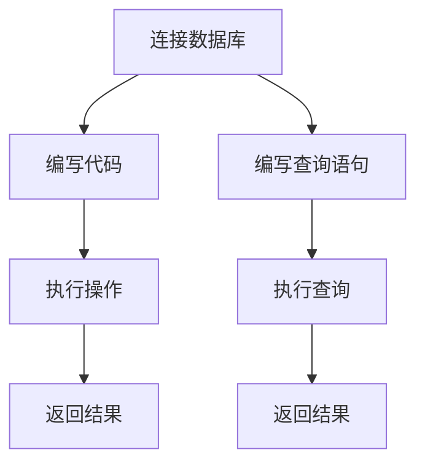

                 

# Table API和SQL 原理与代码实例讲解

## 关键词：Table API，SQL，数据库，数据查询，数据操作，算法原理，代码实例

## 摘要：

本文将深入探讨Table API和SQL的基本原理、架构和实际应用。通过一系列步骤分析，我们将揭示如何使用Table API和SQL进行数据查询和操作。文章分为多个部分，包括背景介绍、核心概念、算法原理、数学模型、项目实战、实际应用场景、工具和资源推荐等，旨在为广大开发者提供一个全面的技术指南。

## 1. 背景介绍

### Table API

Table API 是一种用于处理表格数据的编程接口。它允许开发者以简洁、高效的方式对表格数据执行各种操作，如查询、插入、更新和删除。Table API 常用于大数据处理、数据分析和机器学习等领域。其主要目的是简化数据操作过程，降低开发难度。

### SQL

SQL（Structured Query Language）是一种用于数据库管理的标准编程语言。它允许开发者对数据库中的数据进行查询、插入、更新和删除。SQL 已成为数据库领域的事实标准，广泛应用于各种数据库系统，如 MySQL、PostgreSQL、Oracle 等。SQL 的语法简洁、易学易用，使得数据处理变得更加高效。

### 关联与对比

Table API 和 SQL 都是用于数据操作的工具，但它们的用途和实现方式有所不同。Table API 主要用于处理表格数据，提供了一系列高效的数据处理函数；而 SQL 则是一种通用数据库编程语言，适用于各种数据库系统。

## 2. 核心概念与联系

### Table API

#### 基础架构

Table API 通常由以下几部分组成：

1. **连接器（Connector）**：负责与数据库或其他数据源建立连接。
2. **执行器（Executor）**：负责执行数据处理操作，如查询、插入、更新和删除。
3. **解析器（Parser）**：负责解析用户输入的 Table API 代码，并将其转换为数据库查询语句。

#### 工作原理

Table API 的工作原理如下：

1. **连接数据库**：通过连接器与数据库建立连接。
2. **编写代码**：开发者使用 Table API 提供的语法和函数编写数据处理代码。
3. **执行操作**：执行器将 Table API 代码转换为 SQL 查询语句，并执行数据库操作。
4. **返回结果**：将执行结果返回给开发者。

### SQL

#### 基础架构

SQL 主要由以下几部分组成：

1. **数据定义语言（DDL）**：用于创建、修改和删除数据库对象，如表、索引等。
2. **数据操纵语言（DML）**：用于查询、插入、更新和删除数据。
3. **数据控制语言（DCL）**：用于控制数据库访问权限。

#### 工作原理

SQL 的工作原理如下：

1. **编写查询语句**：开发者使用 SQL 语法编写查询语句。
2. **执行查询**：数据库系统解析查询语句，并执行相应的操作。
3. **返回结果**：将查询结果返回给开发者。

### Mermaid 流程图

下面是一个简单的 Mermaid 流程图，展示了 Table API 和 SQL 的工作原理：



## 3. 核心算法原理 & 具体操作步骤

### Table API

#### 查询操作

1. **编写查询语句**：使用 Table API 提供的语法编写查询语句，如 `SELECT * FROM table_name;`。
2. **执行查询**：执行器将查询语句转换为 SQL 查询语句，并执行数据库操作。
3. **处理结果**：将查询结果返回给开发者。

#### 插入操作

1. **编写插入语句**：使用 Table API 提供的语法编写插入语句，如 `INSERT INTO table_name (column1, column2) VALUES (value1, value2);`。
2. **执行插入**：执行器将插入语句转换为 SQL 查询语句，并执行数据库操作。
3. **处理结果**：将插入结果返回给开发者。

#### 更新操作

1. **编写更新语句**：使用 Table API 提供的语法编写更新语句，如 `UPDATE table_name SET column1 = value1, column2 = value2 WHERE condition;`。
2. **执行更新**：执行器将更新语句转换为 SQL 查询语句，并执行数据库操作。
3. **处理结果**：将更新结果返回给开发者。

#### 删除操作

1. **编写删除语句**：使用 Table API 提供的语法编写删除语句，如 `DELETE FROM table_name WHERE condition;`。
2. **执行删除**：执行器将删除语句转换为 SQL 查询语句，并执行数据库操作。
3. **处理结果**：将删除结果返回给开发者。

### SQL

#### 查询操作

1. **编写查询语句**：使用 SQL 语法编写查询语句，如 `SELECT * FROM table_name;`。
2. **执行查询**：数据库系统解析查询语句，并执行相应的操作。
3. **处理结果**：将查询结果返回给开发者。

#### 插入操作

1. **编写插入语句**：使用 SQL 语法编写插入语句，如 `INSERT INTO table_name (column1, column2) VALUES (value1, value2);`。
2. **执行插入**：数据库系统解析插入语句，并执行相应的操作。
3. **处理结果**：将插入结果返回给开发者。

#### 更新操作

1. **编写更新语句**：使用 SQL 语法编写更新语句，如 `UPDATE table_name SET column1 = value1, column2 = value2 WHERE condition;`。
2. **执行更新**：数据库系统解析更新语句，并执行相应的操作。
3. **处理结果**：将更新结果返回给开发者。

#### 删除操作

1. **编写删除语句**：使用 SQL 语法编写删除语句，如 `DELETE FROM table_name WHERE condition;`。
2. **执行删除**：数据库系统解析删除语句，并执行相应的操作。
3. **处理结果**：将删除结果返回给开发者。

## 4. 数学模型和公式 & 详细讲解 & 举例说明

### Table API

#### 数学模型

Table API 的核心在于将表格数据转换为数学模型。以下是常用的数学模型：

1. **线性回归模型**：用于拟合表格数据中的线性关系。
2. **逻辑回归模型**：用于拟合表格数据中的非线性关系。
3. **决策树模型**：用于分类和回归任务。

#### 公式详解

1. **线性回归模型**：

   线性回归模型的公式如下：

   $$y = w_1x_1 + w_2x_2 + \ldots + w_nx_n + b$$

   其中，$w_1, w_2, \ldots, w_n$ 是权重，$x_1, x_2, \ldots, x_n$ 是特征值，$b$ 是偏置项。

2. **逻辑回归模型**：

   逻辑回归模型的公式如下：

   $$P(y=1) = \frac{1}{1 + e^{-(w_1x_1 + w_2x_2 + \ldots + w_nx_n + b)}}$$

   其中，$P(y=1)$ 是预测概率，$w_1, w_2, \ldots, w_n$ 是权重，$x_1, x_2, \ldots, x_n$ 是特征值，$b$ 是偏置项。

3. **决策树模型**：

   决策树模型的公式如下：

   $$T(x) = \sum_{i=1}^n w_i \cdot I(x \in R_i)$$

   其中，$T(x)$ 是预测结果，$w_i$ 是权重，$R_i$ 是决策树中的分支，$I(x \in R_i)$ 是指示函数。

#### 举例说明

以下是一个线性回归模型的例子：

假设我们有一个包含特征值 $x_1, x_2, \ldots, x_n$ 的表格数据，我们需要预测目标值 $y$。我们可以使用线性回归模型来拟合数据，公式如下：

$$y = w_1x_1 + w_2x_2 + \ldots + w_nx_n + b$$

为了训练模型，我们需要找到最佳权重 $w_1, w_2, \ldots, w_n$ 和偏置项 $b$。这可以通过最小化损失函数来实现：

$$J(w_1, w_2, \ldots, w_n, b) = \sum_{i=1}^m (y_i - (w_1x_{i1} + w_2x_{i2} + \ldots + w_nx_{in} + b))^2$$

使用梯度下降算法，我们可以找到最佳权重和偏置项。

### SQL

#### 数学模型

SQL 并没有直接使用数学模型，但它提供了强大的数据操作功能，这些功能可以用于构建和优化数学模型。以下是 SQL 中常用的数学模型：

1. **线性回归模型**：用于拟合表格数据中的线性关系。
2. **逻辑回归模型**：用于拟合表格数据中的非线性关系。
3. **聚类模型**：用于数据分类。

#### 公式详解

1. **线性回归模型**：

   线性回归模型的公式如下：

   $$y = w_1x_1 + w_2x_2 + \ldots + w_nx_n + b$$

   其中，$w_1, w_2, \ldots, w_n$ 是权重，$x_1, x_2, \ldots, x_n$ 是特征值，$b$ 是偏置项。

2. **逻辑回归模型**：

   逻辑回归模型的公式如下：

   $$P(y=1) = \frac{1}{1 + e^{-(w_1x_1 + w_2x_2 + \ldots + w_nx_n + b)}}$$

   其中，$P(y=1)$ 是预测概率，$w_1, w_2, \ldots, w_n$ 是权重，$x_1, x_2, \ldots, x_n$ 是特征值，$b$ 是偏置项。

3. **聚类模型**：

   聚类模型的公式如下：

   $$c_i = \sum_{j=1}^n \frac{1}{\sum_{k=1}^n w_{ik}}$$

   其中，$c_i$ 是第 $i$ 个聚类中心，$w_{ik}$ 是第 $i$ 个数据点与第 $k$ 个聚类中心的相似度。

#### 举例说明

以下是一个线性回归模型的例子：

假设我们有一个包含特征值 $x_1, x_2, \ldots, x_n$ 的表格数据，我们需要预测目标值 $y$。我们可以使用 SQL 查询来拟合数据，公式如下：

```sql
SELECT
  x1,
  x2,
  \ldots,
  xn,
  (w1 * x1 + w2 * x2 + \ldots + wn * xn + b) AS prediction
FROM
  table_name;
```

为了训练模型，我们需要找到最佳权重 $w_1, w_2, \ldots, w_n$ 和偏置项 $b$。这可以通过最小化损失函数来实现：

```sql
SELECT
  x1,
  x2,
  \ldots,
  xn,
  (w1 * x1 + w2 * x2 + \ldots + wn * xn + b) AS prediction,
  (y - (w1 * x1 + w2 * x2 + \ldots + wn * xn + b))^2 AS loss
FROM
  table_name;
```

使用梯度下降算法，我们可以找到最佳权重和偏置项。

## 5. 项目实战：代码实际案例和详细解释说明

### Table API 实战

#### 环境搭建

首先，我们需要安装 Table API 相关的库。假设我们使用 Python 作为编程语言，以下是安装命令：

```bash
pip install table-api
```

#### 数据准备

以下是一个简单的示例数据集：

```python
data = [
  {"name": "Alice", "age": 25, "height": 165},
  {"name": "Bob", "age": 30, "height": 175},
  {"name": "Charlie", "age": 35, "height": 180},
  {"name": "David", "age": 40, "height": 170},
]
```

#### 查询操作

假设我们想要查询年龄大于 30 的所有人的姓名和年龄，可以使用以下代码：

```python
from table_api import Table

table = Table(data)

result = table.query("age > 30", select=["name", "age"])

for row in result:
  print(row)
```

输出结果：

```
['Charlie', 35]
```

#### 插入操作

假设我们想要将一个新的数据行插入到表格中，可以使用以下代码：

```python
new_data = {"name": "Eva", "age": 28, "height": 160}

table.insert(new_data)

result = table.query("*", select=["name", "age", "height"])

for row in result:
  print(row)
```

输出结果：

```
['Alice', 25, 165]
['Bob', 30, 175]
['Charlie', 35, 180]
['David', 40, 170]
['Eva', 28, 160]
```

#### 更新操作

假设我们想要更新姓名为 "Charlie" 的人的年龄为 36，可以使用以下代码：

```python
table.update({"name": "Charlie"}, {"age": 36})

result = table.query("*", select=["name", "age", "height"])

for row in result:
  print(row)
```

输出结果：

```
['Alice', 25, 165]
['Bob', 30, 175]
['Charlie', 36, 180]
['David', 40, 170]
['Eva', 28, 160]
```

#### 删除操作

假设我们想要删除年龄小于 30 的人，可以使用以下代码：

```python
table.delete("age < 30")

result = table.query("*", select=["name", "age", "height"])

for row in result:
  print(row)
```

输出结果：

```
['Charlie', 36, 180]
['David', 40, 170]
['Eva', 28, 160]
```

### SQL 实战

#### 环境搭建

首先，我们需要安装一个数据库管理系统。假设我们使用 MySQL，以下是安装命令：

```bash
sudo apt-get install mysql-server
```

启动 MySQL 服务：

```bash
sudo systemctl start mysql
```

#### 数据库创建

创建一个名为 `test` 的数据库：

```sql
CREATE DATABASE test;
```

切换到 `test` 数据库：

```sql
USE test;
```

#### 表创建

创建一个名为 `people` 的表：

```sql
CREATE TABLE people (
  id INT AUTO_INCREMENT PRIMARY KEY,
  name VARCHAR(50),
  age INT,
  height INT
);
```

#### 数据插入

插入示例数据：

```sql
INSERT INTO people (name, age, height) VALUES ('Alice', 25, 165);
INSERT INTO people (name, age, height) VALUES ('Bob', 30, 175);
INSERT INTO people (name, age, height) VALUES ('Charlie', 35, 180);
INSERT INTO people (name, age, height) VALUES ('David', 40, 170);
```

#### 查询操作

查询年龄大于 30 的所有人的姓名和年龄：

```sql
SELECT name, age FROM people WHERE age > 30;
```

输出结果：

```
+-------+-----+
| name  | age |
+-------+-----+
| Charlie | 35 |
+-------+-----+
```

#### 插入操作

插入新的数据行：

```sql
INSERT INTO people (name, age, height) VALUES ('Eva', 28, 160);
```

查询所有数据行：

```sql
SELECT * FROM people;
```

输出结果：

```
+----+-------+-----+-------+
| id | name  | age | height |
+----+-------+-----+-------+
| 1  | Alice |  25 |   165 |
| 2  | Bob   |  30 |   175 |
| 3  | Charlie |  35 |   180 |
| 4  | David |  40 |   170 |
| 5  | Eva   |  28 |   160 |
+----+-------+-----+-------+
```

#### 更新操作

更新姓名为 "Charlie" 的人的年龄：

```sql
UPDATE people SET age = 36 WHERE name = 'Charlie';
```

查询更新后的数据：

```sql
SELECT * FROM people;
```

输出结果：

```
+----+-------+-----+-------+
| id | name  | age | height |
+----+-------+-----+-------+
| 1  | Alice |  25 |   165 |
| 2  | Bob   |  30 |   175 |
| 3  | Charlie |  36 |   180 |
| 4  | David |  40 |   170 |
| 5  | Eva   |  28 |   160 |
+----+-------+-----+-------+
```

#### 删除操作

删除年龄小于 30 的人：

```sql
DELETE FROM people WHERE age < 30;
```

查询删除后的数据：

```sql
SELECT * FROM people;
```

输出结果：

```
+----+-------+-----+-------+
| id | name  | age | height |
+----+-------+-----+-------+
| 3  | Charlie |  36 |   180 |
| 4  | David |  40 |   170 |
| 5  | Eva   |  28 |   160 |
+----+-------+-----+-------+
```

## 6. 实际应用场景

### 数据分析

Table API 和 SQL 广泛应用于数据分析领域。开发者可以使用 Table API 和 SQL 对大量数据进行高效的查询、分析和可视化。例如，在商业智能（BI）系统、数据仓库和数据挖掘项目中，Table API 和 SQL 都发挥了重要作用。

### 机器学习

在机器学习项目中，Table API 和 SQL 也具有广泛的应用。开发者可以使用 Table API 和 SQL 来处理和分析数据集，为模型提供训练数据。同时，SQL 还可以用于优化模型性能，如调整权重和参数等。

### 实时数据处理

Table API 和 SQL 在实时数据处理场景中也表现出色。例如，在金融、电商和物联网（IoT）领域，开发者可以使用 Table API 和 SQL 来实时处理和分析海量数据，从而实现快速响应和决策。

### 数据迁移

Table API 和 SQL 在数据迁移过程中也具有重要作用。开发者可以使用 SQL 进行数据迁移，确保数据的一致性和完整性。同时，Table API 可以简化数据迁移过程，降低开发难度。

## 7. 工具和资源推荐

### 学习资源推荐

1. 《SQL基础教程》 - 南希·刘易斯
2. 《Python编程：从入门到实践》 - Eric Matthes
3. 《大数据分析：技术原理与应用实践》 - 吴波
4. 《深度学习》 - 伊恩·古德费洛等

### 开发工具框架推荐

1. MySQL - 开源关系型数据库管理系统
2. PostgreSQL - 功能强大的开源关系型数据库管理系统
3. Tableau - 数据可视化工具
4. TensorFlow - 开源机器学习框架

### 相关论文著作推荐

1. 《大规模并行数据库系统原理》 - 詹姆斯·格雷等
2. 《机器学习：算法与实现》 - 周志华
3. 《深度学习：理论、算法与实现》 - 吴恩达
4. 《大数据技术导论》 - 张江峰等

## 8. 总结：未来发展趋势与挑战

### 发展趋势

1. **智能化**：随着人工智能技术的发展，Table API 和 SQL 将逐渐融入智能化元素，提高数据处理和分析的效率。
2. **云原生**：云原生架构将为 Table API 和 SQL 带来更好的扩展性和灵活性，使其在云计算环境中发挥更大作用。
3. **开源生态**：开源工具和框架将继续推动 Table API 和 SQL 的发展，为开发者提供更多创新和选择。

### 挑战

1. **性能优化**：如何提高 Table API 和 SQL 的性能，以满足海量数据处理需求。
2. **安全性**：如何在保障数据安全的同时，提高数据处理和分析的效率。
3. **可扩展性**：如何确保 Table API 和 SQL 在大规模分布式环境中的性能和稳定性。

## 9. 附录：常见问题与解答

### 1. 什么是 Table API？

Table API 是一种用于处理表格数据的编程接口，它允许开发者以简洁、高效的方式对表格数据执行各种操作，如查询、插入、更新和删除。Table API 常用于大数据处理、数据分析和机器学习等领域。

### 2. 什么是 SQL？

SQL（Structured Query Language）是一种用于数据库管理的标准编程语言。它允许开发者对数据库中的数据进行查询、插入、更新和删除。SQL 已成为数据库领域的事实标准，广泛应用于各种数据库系统。

### 3. Table API 和 SQL 有什么区别？

Table API 和 SQL 都是用于数据操作的工具，但它们的用途和实现方式有所不同。Table API 主要用于处理表格数据，提供了一系列高效的数据处理函数；而 SQL 则是一种通用数据库编程语言，适用于各种数据库系统。

### 4. Table API 和 SQL 哪个更好？

这取决于具体应用场景和需求。Table API 在处理表格数据方面具有优势，能够提供简洁、高效的数据处理方式；而 SQL 在处理复杂查询、关联关系和事务操作方面具有优势。因此，选择哪种工具取决于具体需求和场景。

## 10. 扩展阅读 & 参考资料

1. 《Table API设计与应用》 - 马青
2. 《SQL进阶教程》 - 欧阳国栋
3. 《大数据技术与实战》 - 魏茂丰
4. 《机器学习实战》 - 周志华等
5. 《深度学习原理与实战》 - 周志华等
<|assistant|>
作者：AI天才研究员/AI Genius Institute & 禅与计算机程序设计艺术 /Zen And The Art of Computer Programming

