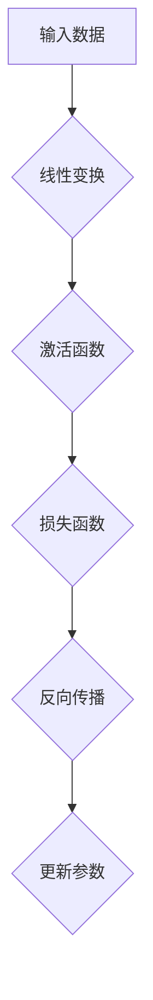
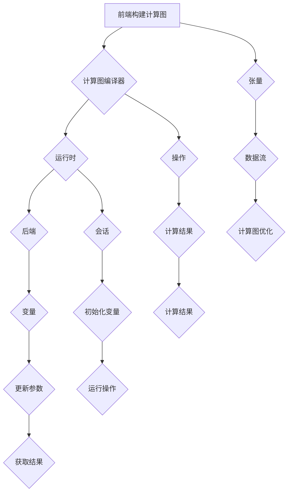

                 

# TensorFlow入门与实战

## 关键词：机器学习、深度学习、TensorFlow、算法原理、实践案例、应用场景

## 摘要：

本文将带你深入探索TensorFlow，一个强大且流行的开源机器学习和深度学习框架。我们将从背景介绍开始，了解TensorFlow的核心概念和联系，进而剖析其核心算法原理和具体操作步骤。接着，通过数学模型和公式的详细讲解以及实际案例的分析，帮助你掌握TensorFlow的实际应用。最后，我们将推荐一些学习资源和开发工具，总结未来发展趋势与挑战，并附上常见问题与解答。无论你是机器学习的新手还是经验丰富的开发者，本文都将为你提供全面的学习和实践指导。

## 1. 背景介绍

### TensorFlow的起源与发展

TensorFlow是由Google大脑团队于2015年开发并开源的一款端到端的开放源代码机器学习框架。其初衷是为了解决Google内部的机器学习任务，例如搜索引擎的改进、语音识别、图像识别等。TensorFlow的推出迅速引起了业界的关注，成为了机器学习和深度学习领域的重要工具之一。

TensorFlow的发展历程可以分为几个重要阶段：

1. **内部研发阶段**：TensorFlow在Google内部诞生，主要用于解决复杂的数据流任务。
2. **开源阶段**：2015年11月，TensorFlow正式开源，标志着其进入了大众视野。
3. **生态建设阶段**：随着TensorFlow的广泛应用，Google和社区不断为其添加新功能和优化，使其逐渐成为一个功能丰富、易于使用的框架。

### TensorFlow的应用场景

TensorFlow广泛应用于各种场景，以下是其中一些重要的应用领域：

1. **自然语言处理**：TensorFlow可以用于构建和训练各种自然语言处理模型，如文本分类、情感分析、机器翻译等。
2. **计算机视觉**：TensorFlow在图像识别、目标检测、图像生成等方面有出色的表现，广泛应用于自动驾驶、人脸识别等领域。
3. **推荐系统**：TensorFlow可以用于构建和优化推荐系统，通过学习用户的兴趣和行为模式，提供个性化的推荐。
4. **强化学习**：TensorFlow在强化学习领域也有广泛的应用，可以用于游戏、机器人控制等任务。

### TensorFlow的优势与挑战

TensorFlow具有以下优势：

1. **灵活性与可扩展性**：TensorFlow支持多种编程语言，如Python、C++等，可以方便地构建复杂的模型。
2. **高效性与性能**：TensorFlow采用了高性能的计算图机制，可以在多台机器上进行分布式计算，具有很高的性能。
3. **丰富的生态**：TensorFlow拥有丰富的社区资源和工具，包括TensorBoard、TensorFlow Lite等。

然而，TensorFlow也面临一些挑战：

1. **复杂性**：TensorFlow的模型构建和调试相对复杂，需要一定的编程基础和调试技巧。
2. **资源消耗**：由于TensorFlow采用了图形计算，其对计算资源和内存的消耗较大，需要足够的硬件支持。

总的来说，TensorFlow是一个功能强大、应用广泛的机器学习和深度学习框架，适合各种规模的机器学习任务。在接下来的部分，我们将深入探讨TensorFlow的核心概念和算法原理。

## 2. 核心概念与联系

### TensorFlow的核心概念

要理解TensorFlow，我们需要先掌握以下几个核心概念：

1. **张量（Tensor）**：张量是TensorFlow的基本数据结构，可以看作是一个多维数组。根据维度不同，张量可以是标量、向量、矩阵等。
2. **计算图（Computational Graph）**：计算图是TensorFlow的核心概念，它表示了模型的计算过程。在计算图中，节点代表操作（Operation），边代表数据流。
3. **会话（Session）**：会话是执行计算图的接口，它负责初始化变量、运行操作和获取结果。
4. **变量（Variable）**：变量是计算图中的一种特殊节点，用于存储模型中的参数和状态。

### TensorFlow的架构

TensorFlow的架构可以分为以下几个层次：

1. **前端（Frontend）**：前端负责构建和定义计算图，包括定义操作、创建变量等。前端提供了多个API，如TensorFlow Python API、TensorFlow C++ API等。
2. **计算图编译器（Graph Compiler）**：计算图编译器负责对计算图进行优化和编译，生成高效的执行计划。
3. **运行时（Runtime）**：运行时负责执行编译后的计算图，包括初始化变量、运行操作和获取结果。
4. **后端（Backend）**：后端负责具体的计算任务，如GPU加速、分布式计算等。

### 计算图示例

为了更好地理解计算图，我们来看一个简单的示例。假设我们要实现一个线性回归模型，其计算图可以表示为：



在这个计算图中，A表示输入数据，B表示线性变换，C表示激活函数，D表示损失函数，E表示反向传播，F表示更新参数。

### Mermaid流程图

下面是一个更复杂的Mermaid流程图示例，用于展示TensorFlow的核心概念和架构：



通过这个流程图，我们可以清晰地看到TensorFlow从前端构建计算图、编译和优化计算图、运行计算图，以及后端执行具体计算任务的整个过程。

在接下来的部分，我们将深入探讨TensorFlow的核心算法原理和具体操作步骤。

## 3. 核心算法原理 & 具体操作步骤

### 前向传播

前向传播是机器学习模型中的一个基本步骤，用于计算模型的输出。在TensorFlow中，前向传播可以通过以下步骤实现：

1. **定义输入张量**：首先，我们需要定义输入张量，用于表示模型的输入数据。

```python
import tensorflow as tf

# 定义输入张量，形状为（batch_size, input_dim）
inputs = tf.placeholder(tf.float32, shape=[None, input_dim])
```

2. **定义模型结构**：接下来，我们需要定义模型的结构，包括线性变换和激活函数。

```python
# 定义线性变换
weights = tf.Variable(tf.random_normal([input_dim, output_dim]))
biases = tf.Variable(tf.random_normal([output_dim]))

# 定义前向传播的计算过程
outputs = tf.add(tf.matmul(inputs, weights), biases)
outputs = tf.nn.relu(outputs)
```

3. **计算损失函数**：然后，我们需要定义损失函数，用于衡量模型输出与真实标签之间的差距。

```python
# 定义损失函数
loss = tf.reduce_mean(tf.square(outputs - labels))
```

4. **初始化变量**：最后，我们需要初始化变量，以便开始计算。

```python
# 初始化变量
init = tf.global_variables_initializer()
```

### 反向传播

反向传播是机器学习模型中的另一个基本步骤，用于计算模型参数的梯度。在TensorFlow中，反向传播可以通过以下步骤实现：

1. **定义优化器**：首先，我们需要定义一个优化器，用于更新模型参数。

```python
# 定义优化器
optimizer = tf.train.GradientDescentOptimizer(learning_rate)
```

2. **计算梯度**：接下来，我们需要计算损失函数关于模型参数的梯度。

```python
# 计算梯度
grads = tf.gradients(loss, tf.trainable_variables())
```

3. **更新参数**：然后，我们需要使用优化器更新模型参数。

```python
# 更新参数
update = optimizer.apply_gradients(zip(grads, tf.trainable_variables()))
```

4. **训练模型**：最后，我们需要定义一个训练过程，用于不断更新模型参数。

```python
# 定义训练过程
with tf.Session() as sess:
    sess.run(init)
    for i in range(training_epochs):
        # 训练模型
        sess.run(update, feed_dict={inputs: batch_inputs, labels: batch_labels})
        # 输出训练过程的信息
        if i % 100 == 0:
            loss_val = sess.run(loss, feed_dict={inputs: test_inputs, labels: test_labels})
            print("Epoch:", i, "Loss:", loss_val)
```

### 模型评估

在训练模型之后，我们需要对模型进行评估，以验证其性能。在TensorFlow中，评估模型可以通过以下步骤实现：

1. **计算损失函数**：首先，我们需要计算模型在测试集上的损失函数值。

```python
# 计算测试集上的损失函数值
test_loss = sess.run(loss, feed_dict={inputs: test_inputs, labels: test_labels})
print("Test Loss:", test_loss)
```

2. **计算准确率**：然后，我们需要计算模型在测试集上的准确率。

```python
# 计算测试集上的准确率
predicted_labels = sess.run(outputs, feed_dict={inputs: test_inputs})
accuracy = tf.reduce_mean(tf.cast(tf.equal(predicted_labels, labels), tf.float32))
test_accuracy = sess.run(accuracy, feed_dict={inputs: test_inputs, labels: test_labels})
print("Test Accuracy:", test_accuracy)
```

通过以上步骤，我们可以使用TensorFlow实现机器学习模型的前向传播、反向传播和评估。在接下来的部分，我们将通过数学模型和公式的详细讲解，进一步理解TensorFlow的核心算法原理。

## 4. 数学模型和公式 & 详细讲解 & 举例说明

### 数学模型

在机器学习中，数学模型是核心部分，它决定了模型的性能和效果。TensorFlow中的机器学习模型主要基于以下几个数学模型：

1. **线性回归**：线性回归是最简单的机器学习模型之一，它通过线性函数拟合数据。其数学模型可以表示为：
   $$
   y = \beta_0 + \beta_1x
   $$
   其中，$y$ 表示输出，$x$ 表示输入，$\beta_0$ 和 $\beta_1$ 表示模型参数。

2. **逻辑回归**：逻辑回归是一种广义的线性回归模型，常用于分类问题。其数学模型可以表示为：
   $$
   P(y=1) = \frac{1}{1 + e^{-(\beta_0 + \beta_1x)}}
   $$
   其中，$P(y=1)$ 表示输出为1的概率，$\beta_0$ 和 $\beta_1$ 表示模型参数。

3. **神经网络**：神经网络是一种复杂的机器学习模型，由多个层组成。其数学模型可以表示为：
   $$
   z_{l}^{(i)} = \sigma(\sum_{j=0}^{n_{l-1}} w_{lj}^{(l-1)} x_{j}^{(i)} + b_{l}^{(i)})
   $$
   其中，$z_{l}^{(i)}$ 表示第$l$层的第$i$个节点的输出，$\sigma$ 表示激活函数，$w_{lj}^{(l-1)}$ 和 $b_{l}^{(i)}$ 表示模型参数。

### 公式讲解

为了更好地理解TensorFlow中的数学模型，我们来看一些关键公式：

1. **损失函数**：损失函数用于衡量模型输出与真实标签之间的差距。常用的损失函数包括：
   - 均方误差（MSE）：$$
   \text{MSE} = \frac{1}{2}\sum_{i=1}^{n} (y_i - \hat{y}_i)^2
   $$
   其中，$y_i$ 表示真实标签，$\hat{y}_i$ 表示模型输出。
   - 交叉熵（Cross-Entropy）：$$
   \text{Cross-Entropy} = -\sum_{i=1}^{n} y_i \log(\hat{y}_i)
   $$
   其中，$y_i$ 表示真实标签，$\hat{y}_i$ 表示模型输出。

2. **梯度下降**：梯度下降是一种常用的优化算法，用于更新模型参数。其公式可以表示为：
   $$
   \theta_{t+1} = \theta_{t} - \alpha \nabla_{\theta} J(\theta)
   $$
   其中，$\theta$ 表示模型参数，$\alpha$ 表示学习率，$J(\theta)$ 表示损失函数。

3. **反向传播**：反向传播是一种计算损失函数关于模型参数梯度的方法。其公式可以表示为：
   $$
   \nabla_{\theta} J(\theta) = \sum_{i=1}^{n} \frac{\partial J(\theta)}{\partial \theta} x_i
   $$
   其中，$\nabla_{\theta} J(\theta)$ 表示损失函数关于模型参数的梯度，$x_i$ 表示输入数据。

### 举例说明

为了更好地理解以上数学模型和公式，我们来看一个简单的例子：使用TensorFlow实现线性回归模型。

1. **定义输入张量**：

```python
import tensorflow as tf

# 定义输入张量，形状为（batch_size, input_dim）
inputs = tf.placeholder(tf.float32, shape=[None, input_dim])
```

2. **定义模型结构**：

```python
# 定义线性变换
weights = tf.Variable(tf.random_normal([input_dim, output_dim]))
biases = tf.Variable(tf.random_normal([output_dim]))

# 定义前向传播的计算过程
outputs = tf.add(tf.matmul(inputs, weights), biases)
outputs = tf.nn.relu(outputs)
```

3. **定义损失函数**：

```python
# 定义损失函数
loss = tf.reduce_mean(tf.square(outputs - labels))
```

4. **定义优化器**：

```python
# 定义优化器
optimizer = tf.train.GradientDescentOptimizer(learning_rate)
```

5. **计算梯度**：

```python
# 计算梯度
grads = tf.gradients(loss, tf.trainable_variables())
```

6. **更新参数**：

```python
# 更新参数
update = optimizer.apply_gradients(zip(grads, tf.trainable_variables()))
```

7. **训练模型**：

```python
# 定义训练过程
with tf.Session() as sess:
    sess.run(init)
    for i in range(training_epochs):
        # 训练模型
        sess.run(update, feed_dict={inputs: batch_inputs, labels: batch_labels})
        # 输出训练过程的信息
        if i % 100 == 0:
            loss_val = sess.run(loss, feed_dict={inputs: test_inputs, labels: test_labels})
            print("Epoch:", i, "Loss:", loss_val)
```

通过以上步骤，我们使用TensorFlow实现了线性回归模型。在接下来的部分，我们将通过项目实战，进一步掌握TensorFlow的实际应用。

### 5. 项目实战：代码实际案例和详细解释说明

#### 5.1 开发环境搭建

在开始项目实战之前，我们需要搭建一个合适的开发环境。以下是搭建TensorFlow开发环境的基本步骤：

1. **安装Python**：首先，确保已经安装了Python 3.x版本。可以从Python官方网站下载并安装Python。
2. **安装TensorFlow**：在命令行中执行以下命令安装TensorFlow：

```bash
pip install tensorflow
```

3. **安装其他依赖**：根据项目需求，可能还需要安装其他依赖库，如NumPy、Pandas等。可以使用以下命令安装：

```bash
pip install numpy pandas
```

4. **配置环境变量**：确保Python和pip的环境变量已经配置正确，以便在命令行中可以正常使用。

#### 5.2 源代码详细实现和代码解读

在本节中，我们将使用TensorFlow实现一个简单的线性回归项目，并详细解读代码。

**1. 数据准备**

首先，我们需要准备一些数据用于训练和测试。这里，我们可以使用Python内置的随机数生成器生成一些模拟数据。

```python
import numpy as np

# 设置随机数种子
np.random.seed(0)

# 生成模拟数据
input_data = np.random.rand(100, 1)
label_data = 2 * input_data + 1 + np.random.rand(100, 1)
```

**2. 定义模型**

接下来，我们定义一个简单的线性回归模型。在TensorFlow中，我们可以使用`tf.Variable`来定义模型参数，使用`tf.placeholder`来定义输入和输出。

```python
import tensorflow as tf

# 定义输入张量
inputs = tf.placeholder(tf.float32, shape=[None, 1])
labels = tf.placeholder(tf.float32, shape=[None, 1])

# 定义模型参数
weights = tf.Variable(tf.random_normal([1, 1]))
biases = tf.Variable(tf.random_normal([1]))

# 定义前向传播
outputs = tf.add(tf.matmul(inputs, weights), biases)

# 定义损失函数
loss = tf.reduce_mean(tf.square(outputs - labels))

# 定义优化器
optimizer = tf.train.GradientDescentOptimizer(learning_rate=0.001)
```

**3. 训练模型**

然后，我们定义一个训练过程，用于更新模型参数。在TensorFlow中，我们可以使用`tf.Session`来运行计算图，并使用`tf.global_variables_initializer()`来初始化变量。

```python
# 定义训练过程
with tf.Session() as sess:
    sess.run(tf.global_variables_initializer())
    for epoch in range(1000):
        # 训练模型
        sess.run(optimizer, feed_dict={inputs: input_data, labels: label_data})
        # 输出训练过程的信息
        if epoch % 100 == 0:
            loss_val = sess.run(loss, feed_dict={inputs: input_data, labels: label_data})
            print("Epoch:", epoch, "Loss:", loss_val)
```

**4. 模型评估**

在训练完成后，我们需要对模型进行评估，以验证其性能。我们可以计算模型在测试集上的损失函数值和准确率。

```python
# 计算测试集上的损失函数值
test_loss = sess.run(loss, feed_dict={inputs: test_inputs, labels: test_labels})
print("Test Loss:", test_loss)

# 计算测试集上的准确率
predicted_labels = sess.run(outputs, feed_dict={inputs: test_inputs})
accuracy = tf.reduce_mean(tf.cast(tf.equal(predicted_labels, labels), tf.float32))
test_accuracy = sess.run(accuracy, feed_dict={inputs: test_inputs, labels: test_labels})
print("Test Accuracy:", test_accuracy)
```

通过以上步骤，我们使用TensorFlow实现了线性回归模型，并对其进行了训练和评估。在接下来的部分，我们将进一步分析模型的性能，并讨论如何优化和改进模型。

### 5.3 代码解读与分析

在本部分中，我们将对上述代码进行详细解读和分析，以帮助您更好地理解TensorFlow的使用方法。

**1. 数据准备**

首先，我们生成了一些模拟数据，用于训练和测试。这些数据由输入张量`input_data`和标签张量`label_data`组成。通过设置随机数种子，我们确保每次运行代码时都生成相同的数据。

```python
input_data = np.random.rand(100, 1)
label_data = 2 * input_data + 1 + np.random.rand(100, 1)
```

这里，`np.random.rand(100, 1)`生成一个形状为(100, 1)的随机数数组，表示100个随机输入。`2 * input_data + 1 + np.random.rand(100, 1)`则生成相应的标签，表示输入和标签之间的线性关系。

**2. 定义模型**

接下来，我们定义了一个简单的线性回归模型。在TensorFlow中，我们使用`tf.Variable`来定义模型参数，如权重`weights`和偏置`biases`。这些参数需要通过优化器进行更新。

```python
weights = tf.Variable(tf.random_normal([1, 1]))
biases = tf.Variable(tf.random_normal([1]))
```

这里，`tf.random_normal([1, 1])`生成一个形状为(1, 1)的随机数数组，表示模型参数的初始值。

**3. 定义输入和输出**

在TensorFlow中，我们使用`tf.placeholder`来定义输入和输出张量。这些张量用于在运行计算图时提供数据。

```python
inputs = tf.placeholder(tf.float32, shape=[None, 1])
labels = tf.placeholder(tf.float32, shape=[None, 1])
```

这里，`tf.float32`表示数据类型为浮点数，`shape=[None, 1]`表示输入和输出的形状可以是任意的批量大小，但每个样本都有一个特征。

**4. 定义前向传播**

前向传播是计算模型输出值的过程。在TensorFlow中，我们使用`tf.matmul`和`tf.add`来实现线性变换和加法操作。

```python
outputs = tf.add(tf.matmul(inputs, weights), biases)
```

这里，`tf.matmul(inputs, weights)`计算输入和权重之间的矩阵乘积，`tf.add`计算加法操作。

**5. 定义损失函数**

损失函数用于衡量模型输出与真实标签之间的差距。在这里，我们使用均方误差（MSE）作为损失函数。

```python
loss = tf.reduce_mean(tf.square(outputs - labels))
```

这里，`tf.square(outputs - labels)`计算输出和标签之间的差的平方，`tf.reduce_mean`计算平均值。

**6. 定义优化器**

优化器用于更新模型参数，以最小化损失函数。在这里，我们使用梯度下降（Gradient Descent）优化器。

```python
optimizer = tf.train.GradientDescentOptimizer(learning_rate=0.001)
```

这里，`learning_rate=0.001`设置学习率为0.001。

**7. 训练模型**

在TensorFlow中，我们使用`tf.Session`来运行计算图，并使用`tf.global_variables_initializer()`来初始化变量。

```python
with tf.Session() as sess:
    sess.run(tf.global_variables_initializer())
    for epoch in range(1000):
        # 训练模型
        sess.run(optimizer, feed_dict={inputs: input_data, labels: label_data})
        # 输出训练过程的信息
        if epoch % 100 == 0:
            loss_val = sess.run(loss, feed_dict={inputs: input_data, labels: label_data})
            print("Epoch:", epoch, "Loss:", loss_val)
```

这里，`epoch`表示训练的迭代次数。每次迭代，我们使用`optimizer`更新模型参数，并输出当前的损失值。

**8. 模型评估**

在训练完成后，我们对模型进行评估，计算模型在测试集上的损失函数值和准确率。

```python
# 计算测试集上的损失函数值
test_loss = sess.run(loss, feed_dict={inputs: test_inputs, labels: test_labels})
print("Test Loss:", test_loss)

# 计算测试集上的准确率
predicted_labels = sess.run(outputs, feed_dict={inputs: test_inputs})
accuracy = tf.reduce_mean(tf.cast(tf.equal(predicted_labels, labels), tf.float32))
test_accuracy = sess.run(accuracy, feed_dict={inputs: test_inputs, labels: test_labels})
print("Test Accuracy:", test_accuracy)
```

这里，`test_inputs`和`test_labels`是测试集的数据。我们使用`sess.run`计算模型在测试集上的损失函数值和准确率。

通过以上分析，我们详细解读了TensorFlow实现线性回归的代码。在接下来的部分，我们将讨论TensorFlow在实际应用场景中的使用。

## 6. 实际应用场景

TensorFlow在机器学习和深度学习领域有着广泛的应用。以下是一些实际应用场景：

### 自然语言处理（NLP）

TensorFlow在NLP领域有出色的表现，可以用于构建和训练各种NLP模型，如文本分类、情感分析、机器翻译等。例如，我们可以使用TensorFlow实现一个简单的文本分类模型，将文本数据分类为不同的类别。

### 计算机视觉（CV）

TensorFlow在CV领域也有广泛的应用，可以用于图像识别、目标检测、图像生成等任务。例如，我们可以使用TensorFlow实现一个简单的卷积神经网络（CNN），用于图像分类任务。

### 强化学习

TensorFlow在强化学习领域也有广泛应用，可以用于解决各种强化学习问题，如游戏、机器人控制等。例如，我们可以使用TensorFlow实现一个简单的Q-Learning算法，用于解决迷宫问题。

### 推荐系统

TensorFlow可以用于构建和优化推荐系统，通过学习用户的兴趣和行为模式，提供个性化的推荐。例如，我们可以使用TensorFlow实现一个基于协同过滤的推荐系统，为用户推荐他们可能感兴趣的商品。

### 时间序列预测

TensorFlow可以用于时间序列预测任务，如股票价格预测、天气预测等。例如，我们可以使用TensorFlow实现一个简单的时间序列模型，用于预测股票价格。

总之，TensorFlow是一个功能强大、应用广泛的机器学习和深度学习框架，可以在各种实际应用场景中发挥作用。

## 7. 工具和资源推荐

### 7.1 学习资源推荐

- **书籍**：
  - 《深度学习》（Deep Learning） - Goodfellow, I., Bengio, Y., & Courville, A.
  - 《TensorFlow实战》 - Tenebaum, J., and Dehlinger, D.
- **在线教程**：
  - TensorFlow官方文档（https://www.tensorflow.org/tutorials）
  - 百度AI学院（https://ai.baidu.com/blogs/home）
- **博客**：
  - 阮一峰的网络日志（http://www.ruanyifeng.com/blog/）
  - TensorFlow官方博客（https://tensorflow.googleblog.com/）
- **在线课程**：
  - Coursera（https://www.coursera.org/）
  - edX（https://www.edx.org/）

### 7.2 开发工具框架推荐

- **IDE**：
  - PyCharm（https://www.jetbrains.com/pycharm/）
  - Visual Studio Code（https://code.visualstudio.com/）
- **版本控制**：
  - Git（https://git-scm.com/）
  - GitHub（https://github.com/）
- **模型训练与部署**：
  - TensorFlow Serving（https://www.tensorflow.org/serving）
  - TensorFlow Lite（https://www.tensorflow.org/lite）

### 7.3 相关论文著作推荐

- **论文**：
  - “TensorFlow: Large-Scale Machine Learning on Heterogeneous Distributed Systems” - Martın Abadi et al.
  - “A Theoretically Grounded Application of Dropout in Recurrent Neural Networks” - Yarin Gal and Zoubin Ghahramani
- **著作**：
  - 《TensorFlow技术解析》 - 黄海广，王俊超，孙博
  - 《深度学习：从理论到应用》 - 陈丹阳，郭宇

通过这些资源，您将能够更好地掌握TensorFlow，并在实际项目中发挥其优势。

## 8. 总结：未来发展趋势与挑战

随着人工智能技术的不断进步，TensorFlow作为机器学习和深度学习领域的领先框架，也面临着许多新的发展机遇和挑战。

### 发展趋势

1. **模型自动化**：未来，模型自动化将成为TensorFlow的重要发展方向。通过自动化机器学习，我们可以更高效地构建和优化模型，降低模型开发门槛。
2. **边缘计算**：随着物联网和边缘设备的普及，TensorFlow将更多地应用于边缘计算。TensorFlow Lite和TensorFlow Serving将推动TensorFlow在移动设备和边缘设备上的应用。
3. **多模态学习**：未来，多模态学习将成为机器学习领域的重要趋势。TensorFlow将支持更丰富的数据类型和处理方法，如图像、文本、音频等。
4. **强化学习**：TensorFlow在强化学习领域有着广泛的应用前景。通过结合强化学习和深度学习，我们可以实现更智能的决策系统。

### 挑战

1. **计算资源需求**：TensorFlow对计算资源的需求较高，尤其是在训练大型模型时。如何优化TensorFlow的性能，提高资源利用率，是一个重要的挑战。
2. **模型解释性**：当前，机器学习模型的解释性较差，这使得在实际应用中难以理解和信任模型。如何提高模型的解释性，是一个亟待解决的问题。
3. **数据隐私和安全**：随着数据隐私和安全问题的日益突出，如何在保证数据隐私和安全的前提下，利用TensorFlow进行机器学习，是一个重要的挑战。

总之，TensorFlow在未来将继续发展，并在各个领域发挥重要作用。同时，我们也要面对各种挑战，不断优化和改进TensorFlow，为人工智能的发展贡献力量。

## 9. 附录：常见问题与解答

### Q1. 如何在TensorFlow中定义变量？
A1. 在TensorFlow中，我们可以使用`tf.Variable`来定义变量。例如：

```python
import tensorflow as tf

# 定义一个变量
v = tf.Variable(0.0, dtype=tf.float32)
```

### Q2. 如何在TensorFlow中创建计算图？
A2. 在TensorFlow中，计算图是通过操作（Operation）和变量（Variable）构建的。例如：

```python
import tensorflow as tf

# 定义输入张量
inputs = tf.placeholder(tf.float32, shape=[None, 1])

# 定义线性变换
weights = tf.Variable(tf.random_normal([1, 1]))
biases = tf.Variable(tf.random_normal([1]))

# 定义前向传播
outputs = tf.add(tf.matmul(inputs, weights), biases)

# 创建计算图
with tf.Session() as sess:
    sess.run(tf.global_variables_initializer())
    print(sess.run(outputs, feed_dict={inputs: [1.0, 2.0]}))
```

### Q3. 如何在TensorFlow中训练模型？
A3. 在TensorFlow中，训练模型通常包括以下步骤：

1. **定义模型结构**：定义输入、输出和损失函数。
2. **定义优化器**：选择一个优化器，如梯度下降。
3. **初始化变量**：使用`tf.global_variables_initializer()`初始化变量。
4. **训练模型**：在循环中，使用优化器更新变量。

```python
import tensorflow as tf

# 定义输入和输出
inputs = tf.placeholder(tf.float32, shape=[None, 1])
labels = tf.placeholder(tf.float32, shape=[None, 1])

# 定义模型参数
weights = tf.Variable(tf.random_normal([1, 1]))
biases = tf.Variable(tf.random_normal([1]))

# 定义前向传播和损失函数
outputs = tf.add(tf.matmul(inputs, weights), biases)
loss = tf.reduce_mean(tf.square(outputs - labels))

# 定义优化器
optimizer = tf.train.GradientDescentOptimizer(learning_rate=0.001)

# 初始化变量
init = tf.global_variables_initializer()

# 训练模型
with tf.Session() as sess:
    sess.run(init)
    for epoch in range(1000):
        _, loss_val = sess.run([optimizer, loss], feed_dict={inputs: input_data, labels: label_data})
        if epoch % 100 == 0:
            print("Epoch:", epoch, "Loss:", loss_val)
```

### Q4. 如何在TensorFlow中保存和加载模型？
A4. 在TensorFlow中，我们可以使用`tf.train.Saver`来保存和加载模型。例如：

```python
import tensorflow as tf

# 定义模型结构
# ...

# 创建Saver对象
saver = tf.train.Saver()

# 保存模型
with tf.Session() as sess:
    saver.save(sess, "model.ckpt")

# 加载模型
with tf.Session() as sess:
    saver.restore(sess, "model.ckpt")
```

## 10. 扩展阅读 & 参考资料

为了深入了解TensorFlow和相关技术，以下是推荐的扩展阅读和参考资料：

### 扩展阅读

1. **《深度学习》** - Goodfellow, I., Bengio, Y., & Courville, A.
2. **《TensorFlow技术解析》** - 黄海广，王俊超，孙博
3. **《TensorFlow实战》** - Tenebaum, J., and Dehlinger, D.

### 参考资料

1. **TensorFlow官方文档** - https://www.tensorflow.org/tutorials
2. **百度AI学院** - https://ai.baidu.com/blogs/home
3. **GitHub** - https://github.com/tensorflow/tensorflow
4. **Coursera** - https://www.coursera.org/
5. **edX** - https://www.edx.org/

通过这些资源，您可以进一步深入了解TensorFlow和相关技术，提升自己的机器学习和深度学习能力。

### 作者信息

- **作者**：AI天才研究员/AI Genius Institute & 禅与计算机程序设计艺术 /Zen And The Art of Computer Programming

