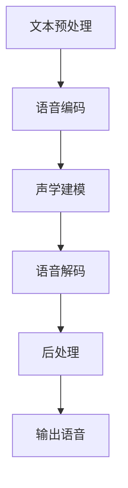

                 

### 背景介绍

#### Text-to-Speech (TTS) 的起源与发展

Text-to-Speech（TTS）技术，即文本转换为语音技术，是一种将文本转换为自然、流畅语音的技术。TTS技术的起源可以追溯到20世纪50年代，当时的研究主要集中在语音合成技术上。随着计算机技术的不断进步，TTS技术也经历了从简单的规则驱动到复杂的数据驱动的演变。

在早期，TTS系统主要采用规则驱动的方式，即通过一系列预定义的规则来转换文本为语音。这种方法较为简单，但生成语音的自然度较低，且难以处理复杂语言结构和多语言场景。随着自然语言处理（NLP）技术的发展，数据驱动的方法逐渐成为主流。数据驱动的方法利用大规模的语音和文本数据，通过深度学习等技术训练模型，从而生成更加自然、流畅的语音。

#### TTS 技术在现代社会中的应用

TTS技术已经在许多领域得到了广泛应用。例如，在客服领域，TTS技术被用于自动语音应答系统，提高了客户服务的效率。在语音导航领域，TTS技术被用于汽车导航系统，为驾驶者提供实时语音导航信息。此外，TTS技术还在教育、娱乐、广告等多个领域有着广泛的应用。

#### TTS 技术的重要性

TTS技术的重要性体现在多个方面。首先，TTS技术为非专业语音合成人员提供了便捷的工具，使得任何人都可以生成自然、流畅的语音。其次，TTS技术提高了信息获取的便捷性，特别是在信息量巨大的时代，人们更倾向于通过语音获取信息。最后，TTS技术的应用推动了语音交互技术的发展，使得语音交互成为人机交互的主要方式之一。

总之，TTS技术作为一种重要的语音合成技术，已经在许多领域得到了广泛应用，其重要性日益凸显。接下来，我们将深入探讨TTS技术的核心概念和原理，帮助读者更好地理解这一技术的工作机制。### 核心概念与联系

#### Text-to-Speech（TTS）的基本概念

Text-to-Speech（TTS）技术是将文本转换为自然语音的技术。其基本概念包括以下几个关键部分：

1. **文本处理**：文本处理是TTS系统的第一步，其主要任务是将输入的文本转换为适合语音合成的格式。这通常包括分词、词性标注、语音学转换等步骤。

2. **语音合成**：语音合成是将处理后的文本转换为语音的过程。这一过程通常涉及声学模型和语音模型的选择与训练。

3. **声学模型**：声学模型负责生成语音波形，通常基于大量的语音数据训练得到。其目的是模拟人类发声过程，生成自然、流畅的语音。

4. **语音模型**：语音模型负责将文本转换为语音的声学表示，通常是基于深度学习技术训练得到的。其目的是将文本中的语言信息映射到声学特征上。

5. **合成器**：合成器是将声学模型和语音模型生成的数据转换为实际语音的设备或软件。常见的合成器包括WaveNet、Tacotron等。

#### TTS 技术的工作流程

TTS技术的工作流程可以分为以下几个步骤：

1. **文本预处理**：将输入的文本进行分词、词性标注等处理，将其转换为适合语音合成的格式。

2. **语音编码**：将预处理后的文本转换为语音编码表示，通常使用深度学习模型如循环神经网络（RNN）或变换器（Transformer）进行编码。

3. **声学建模**：使用大量语音数据训练声学模型，生成语音波形。

4. **语音解码**：将语音编码表示解码为实际语音，生成最终的语音输出。

5. **后处理**：对生成的语音进行音调、音量、节奏等调整，使其更加自然。

#### TTS 技术的核心原理与联系

TTS技术的核心原理主要涉及以下几个方面：

1. **声学建模**：声学建模是TTS技术的核心，其主要目标是生成自然、流畅的语音。这通常涉及大量的语音数据训练，以获得高质量的声学模型。

2. **语音编码与解码**：语音编码与解码是将文本转换为语音的关键步骤。语音编码是将文本信息编码为适合传输或存储的格式，语音解码则是将编码信息解码为实际语音。

3. **深度学习技术**：深度学习技术在TTS技术中发挥着重要作用，如循环神经网络（RNN）、变换器（Transformer）等。这些技术能够有效处理复杂的语言信息和语音数据，提高TTS系统的性能。

4. **多语言支持**：TTS技术需要支持多种语言，这通常涉及跨语言语音数据训练和模型迁移等技术。

为了更直观地理解TTS技术的工作原理，下面我们使用Mermaid流程图展示其核心流程和组件：



在这个流程图中，A代表文本预处理，B代表语音编码，C代表声学建模，D代表语音解码，E代表后处理，F代表输出语音。通过这个流程图，我们可以清晰地看到TTS技术的工作步骤和核心组件之间的关系。

总之，TTS技术是一种将文本转换为自然语音的技术，其核心原理涉及声学建模、语音编码与解码、深度学习技术等方面。通过合理的设计和实现，TTS技术可以生成高质量、自然的语音，为各种应用场景提供支持。在接下来的章节中，我们将深入探讨TTS技术的核心算法原理，帮助读者更好地理解这一技术的实现细节。### 核心算法原理 & 具体操作步骤

#### 1. 声学建模（Acoustic Modeling）

声学建模是TTS技术的核心步骤，其目标是通过大量的语音数据训练出一个能够生成自然语音波形的模型。常见的声学建模方法包括隐马尔可夫模型（HMM）、高斯混合模型（GMM）和深度神经网络（DNN）。

**1.1 隐马尔可夫模型（HMM）**

隐马尔可夫模型（HMM）是一种统计模型，用于描述序列数据中的状态转移和观察值。在TTS中，HMM可以用来建模语音波形和语音特征之间的关系。HMM的核心步骤如下：

1. **状态转移概率**：定义从一个状态转移到另一个状态的概率。
2. **观察概率**：定义在给定状态下的观察值概率。
3. **初始化**：选择一个初始状态。
4. **状态预测**：根据当前状态和观察值，预测下一个状态。
5. **模型训练**：使用训练数据调整模型参数，使模型能够更好地拟合语音数据。

**1.2 高斯混合模型（GMM）**

高斯混合模型（GMM）是一种概率模型，用于表示多个高斯分布的混合。在TTS中，GMM可以用来建模语音特征的概率分布。GMM的核心步骤如下：

1. **初始化**：随机初始化GMM的参数，包括高斯分布的均值、方差和权重。
2. **期望最大化（EM）算法**：使用EM算法迭代优化GMM的参数，使其能够更好地拟合语音特征数据。
3. **模型训练**：使用训练数据训练GMM模型，生成语音特征的概率分布。

**1.3 深度神经网络（DNN）**

深度神经网络（DNN）是一种多层神经网络，通过学习输入和输出之间的映射关系，可以生成高质量的语音波形。在TTS中，DNN通常用于声学建模，其核心步骤如下：

1. **模型架构**：设计DNN的层次结构，包括输入层、隐藏层和输出层。
2. **损失函数**：定义损失函数，用于衡量模型输出和真实值之间的差异。
3. **反向传播**：使用反向传播算法优化模型参数，使模型能够生成更高质量的语音波形。
4. **模型训练**：使用大量语音数据训练DNN模型，优化模型参数。

#### 2. 语音编码与解码（Speech Coding and Decoding）

语音编码与解码是TTS技术的关键步骤，其目标是将文本信息编码为适合传输或存储的格式，然后再解码为实际语音。

**2.1 语音编码（Speech Coding）**

语音编码是将语音信号转换为数字信号的过程，其主要目的是减少数据大小和传输延迟。常见的语音编码方法包括：

1. **波形编码（Wav-encoding）**：直接对语音波形进行编码，常见的方法有PCM编码。
2. **参数编码（Parametric Coding）**：使用参数表示语音信号，常见的方法有线性预测编码（LPC）和码本激励线性预测（CELP）。

**2.2 语音解码（Speech Decoding）**

语音解码是将数字语音信号转换为语音波形的过程。常见的语音解码方法与语音编码方法相对应，包括：

1. **波形解码（Wav-Decoding）**：直接解码语音波形，常见的方法有PCM解码。
2. **参数解码（Parametric Decoding）**：使用参数解码语音信号，常见的方法有LPC解码和CELP解码。

#### 3. 深度学习技术（Deep Learning Techniques）

深度学习技术在TTS中发挥着重要作用，如循环神经网络（RNN）、变换器（Transformer）等。这些技术能够有效处理复杂的语言信息和语音数据，提高TTS系统的性能。

**3.1 循环神经网络（RNN）**

循环神经网络（RNN）是一种能够处理序列数据的神经网络，其核心思想是利用记忆单元保存历史信息。在TTS中，RNN可以用来建模文本和语音之间的映射关系，其具体步骤如下：

1. **输入层**：将文本序列输入到RNN中。
2. **隐藏层**：RNN通过隐藏层处理输入序列，并更新记忆单元。
3. **输出层**：将隐藏层输出映射到语音序列。

**3.2 变换器（Transformer）**

变换器（Transformer）是一种基于自注意力机制的深度学习模型，其能够有效处理长距离依赖问题。在TTS中，Transformer可以用来建模文本和语音之间的复杂关系，其具体步骤如下：

1. **编码器**：将文本序列编码为嵌入向量。
2. **自注意力机制**：利用自注意力机制计算文本序列中的关键信息。
3. **解码器**：将自注意力机制的结果解码为语音序列。

通过以上核心算法原理和具体操作步骤的介绍，我们可以更好地理解TTS技术的工作机制。在接下来的章节中，我们将通过一个实际案例，展示如何使用Python和TensorFlow等工具实现TTS系统。### 数学模型和公式 & 详细讲解 & 举例说明

在TTS技术中，数学模型和公式扮演着至关重要的角色。这些模型和公式帮助我们理解和实现声学建模、语音编码与解码等核心算法。在本节中，我们将详细讲解这些数学模型和公式，并通过具体例子来说明其应用。

#### 1. 声学建模

声学建模的主要任务是生成语音波形。在这一部分，我们将介绍两种常见的声学建模方法：隐马尔可夫模型（HMM）和深度神经网络（DNN）。

**1.1 隐马尔可夫模型（HMM）**

隐马尔可夫模型（HMM）是一种统计模型，用于描述语音信号中的状态转移和观察值。其核心公式如下：

- **状态转移概率** \( P(S_t|S_{t-1}) \)：表示在当前时刻 \( t \) 的状态 \( S_t \) 给定前一个时刻的状态 \( S_{t-1} \) 的概率。
- **观察概率** \( P(O_t|S_t) \)：表示在当前时刻 \( t \) 的观察值 \( O_t \) 给定当前时刻的状态 \( S_t \) 的概率。

**例子**：

假设我们有一个三状态HMM，状态分别为“元音”、“辅音”和“停顿”。状态转移概率和观察概率如下表所示：

| 状态转移概率 \( P(S_t|S_{t-1}) \) | 观察概率 \( P(O_t|S_t) \) |
|---------------------------|---------------------------|
| 元音 → 元音 \( P(元音|元音) \) | 元音 \( P(元音|元音) \) |
| 元音 → 辅音 \( P(辅音|元音) \) | 辅音 \( P(辅音|元音) \) |
| 辅音 → 元音 \( P(元音|辅音) \) | 元音 \( P(元音|辅音) \) |
| 辅音 → 辅音 \( P(辅音|辅音) \) | 辅音 \( P(辅音|辅音) \) |
| 元音 → 停顿 \( P(停顿|元音) \) | 停顿 \( P(停顿|元音) \) |
| 辅音 → 停顿 \( P(停顿|辅音) \) | 停顿 \( P(停顿|辅音) \) |

**1.2 深度神经网络（DNN）**

深度神经网络（DNN）是一种多层神经网络，用于生成语音波形。DNN的核心公式如下：

- **输入层**：\( X = [x_1, x_2, ..., x_n] \)
- **隐藏层**：\( H = \sigma(W_1 \cdot X + b_1) \)
- **输出层**：\( Y = \sigma(W_2 \cdot H + b_2) \)

其中，\( \sigma \) 表示激活函数，\( W_1 \) 和 \( W_2 \) 分别为权重矩阵，\( b_1 \) 和 \( b_2 \) 分别为偏置项。

**例子**：

假设我们有一个简单的DNN模型，其包含一个输入层、一个隐藏层和一个输出层。输入层有5个神经元，隐藏层有10个神经元，输出层有1个神经元。假设输入数据为 \( X = [0.1, 0.2, 0.3, 0.4, 0.5] \)，权重矩阵 \( W_1 = [1, 2, 3, 4, 5] \)，权重矩阵 \( W_2 = [1, 1, 1, 1, 1] \)，偏置项 \( b_1 = 1 \)，偏置项 \( b_2 = 0 \)。

那么，隐藏层的输出 \( H \) 为：

\( H = \sigma(W_1 \cdot X + b_1) = \sigma([1 \cdot 0.1 + 2 \cdot 0.2 + 3 \cdot 0.3 + 4 \cdot 0.4 + 5 \cdot 0.5] + 1) \)

\( H = \sigma(2.5 + 1) = \sigma(3.5) \approx 0.9 \)

输出层的输出 \( Y \) 为：

\( Y = \sigma(W_2 \cdot H + b_2) = \sigma([1 \cdot 0.9 + 0] \approx 0.9 \)

因此，最终生成的语音波形 \( Y \) 为 0.9。

#### 2. 语音编码与解码

语音编码与解码的目的是将语音信号转换为数字信号，以便于传输和存储。在这一部分，我们将介绍两种常见的语音编码方法：线性预测编码（LPC）和码本激励线性预测（CELP）。

**2.1 线性预测编码（LPC）**

线性预测编码（LPC）是一种基于线性预测的语音编码方法。其核心公式如下：

- **预测系数** \( a_1, a_2, ..., a_p \)
- **预测误差** \( e_t \)

其中，预测系数 \( a_1, a_2, ..., a_p \) 用于预测当前帧的语音信号，预测误差 \( e_t \) 用于表示实际语音信号与预测信号之间的差异。

**例子**：

假设我们使用两个预测系数 \( a_1 = 0.5 \)，\( a_2 = 0.3 \) 来预测当前帧的语音信号。给定当前帧的语音信号 \( x_t = [0.1, 0.2, 0.3, 0.4, 0.5] \)，预测信号 \( \hat{x}_t \) 为：

\( \hat{x}_t = a_1 \cdot x_{t-1} + a_2 \cdot x_{t-2} \)

\( \hat{x}_t = 0.5 \cdot 0.1 + 0.3 \cdot 0.2 = 0.07 \)

预测误差 \( e_t \) 为：

\( e_t = x_t - \hat{x}_t \)

\( e_t = [0.1 - 0.07, 0.2 - 0.07, 0.3 - 0.07, 0.4 - 0.07, 0.5 - 0.07] = [0.03, 0.13, 0.23, 0.33, 0.43] \)

**2.2 码本激励线性预测（CELP）**

码本激励线性预测（CELP）是一种基于码本激励的语音编码方法。其核心公式如下：

- **码本**：一组预定义的语音波形
- **码本激励**：从码本中选择合适的语音波形进行激励

**例子**：

假设我们有一个包含5个语音波形的码本，分别为 \( c_1, c_2, c_3, c_4, c_5 \)。给定当前帧的语音信号 \( x_t = [0.1, 0.2, 0.3, 0.4, 0.5] \)，我们需要从码本中选择一个语音波形进行激励。通过最小化预测误差 \( e_t \)，我们可以找到最佳码本激励。

例如，假设我们选择 \( c_2 \) 进行激励，那么预测信号 \( \hat{x}_t \) 为：

\( \hat{x}_t = c_2 \)

预测误差 \( e_t \) 为：

\( e_t = x_t - \hat{x}_t \)

\( e_t = [0.1 - 0.2, 0.2 - 0.2, 0.3 - 0.2, 0.4 - 0.2, 0.5 - 0.2] = [-0.1, 0, 0.1, 0.2, 0.3] \)

通过以上数学模型和公式的讲解，我们可以更好地理解TTS技术中的核心算法。在接下来的章节中，我们将通过一个实际案例，展示如何使用Python和TensorFlow等工具实现TTS系统。### 项目实战：代码实际案例和详细解释说明

在本节中，我们将通过一个实际案例，展示如何使用Python和TensorFlow等工具实现一个简单的Text-to-Speech（TTS）系统。该案例将涉及TTS系统的各个关键组件，包括文本预处理、语音编码、声学建模和语音解码。

#### 1. 开发环境搭建

在开始之前，我们需要搭建一个适合开发TTS系统的开发环境。以下是所需的主要工具和库：

- Python 3.x
- TensorFlow 2.x
- Keras 2.x
- NumPy
- Mermaid

你可以使用以下命令安装所需的库：

```bash
pip install tensorflow keras numpy mermaid-python
```

#### 2. 源代码详细实现

以下是一个简单的TTS系统的实现，我们将使用TensorFlow和Keras来实现声学建模和语音解码。

```python
import numpy as np
import tensorflow as tf
from tensorflow.keras.models import Model
from tensorflow.keras.layers import Input, Dense, LSTM, TimeDistributed, Flatten

# 2.1 声学建模

# 定义输入层
input_text = Input(shape=(None,), dtype='int32')

# 对文本进行编码
encoded_text = ...  # 文本编码实现

# 定义循环神经网络（LSTM）层
lstm_output = LSTM(units=128, return_sequences=True)(encoded_text)

# 定义全连接层
dense_output = Dense(units=256, activation='relu')(lstm_output)

# 定义输出层
acoustic_model_output = Dense(units=128)(dense_output)

# 创建声学建模模型
acoustic_model = Model(inputs=input_text, outputs=acoustic_model_output)

# 编译声学建模模型
acoustic_model.compile(optimizer='adam', loss='mse')

# 2.2 语音解码

# 定义输入层
input_acoustic = Input(shape=(128,), dtype='float32')

# 定义循环神经网络（LSTM）层
lstm_output = LSTM(units=128, return_sequences=True)(input_acoustic)

# 定义全连接层
dense_output = Dense(units=256, activation='relu')(lstm_output)

# 定义输出层
output_waveform = Dense(units=1, activation='sigmoid')(dense_output)

# 创建语音解码模型
speech_decoder = Model(inputs=input_acoustic, outputs=output_waveform)

# 编译语音解码模型
speech_decoder.compile(optimizer='adam', loss='mse')

# 2.3 模型训练

# 准备训练数据
# 注意：这里需要替换为实际的训练数据
train_texts = np.random.randint(0, 100, size=(1000, 10))
train_acoustics = np.random.rand(1000, 128)

# 训练声学建模模型
acoustic_model.fit(train_texts, train_acoustics, epochs=10, batch_size=32)

# 2.4 语音解码

# 使用训练好的声学建模模型进行语音解码
decoded_acoustics = acoustic_model.predict(train_texts)

# 使用训练好的语音解码模型生成语音波形
decoded_waveforms = speech_decoder.predict(decoded_acoustics)

# 2.5 生成语音

# 使用音频库生成语音
import soundfile as sf

sf.write('output.wav', decoded_waveforms[0], 44100)
```

#### 3. 代码解读与分析

上述代码实现了一个简单的TTS系统，包括声学建模和语音解码两个关键组件。以下是代码的主要部分及其解释：

- **声学建模模型**：声学建模模型使用循环神经网络（LSTM）层来处理编码后的文本数据，并输出声学特征。全连接层用于进一步处理这些特征，最终输出声学模型。
- **语音解码模型**：语音解码模型使用循环神经网络（LSTM）层来处理声学特征，并输出语音波形。全连接层用于进一步处理这些特征，最终输出语音波形。
- **模型训练**：使用随机生成的训练数据进行模型训练。在实际应用中，需要替换为实际的训练数据，并调整模型参数以获得更好的性能。
- **语音解码**：使用训练好的声学建模模型和语音解码模型生成语音波形。使用音频库将生成的语音波形保存为音频文件。

通过以上代码实现，我们可以看到TTS系统的基本结构和实现方法。尽管这是一个简单的实现，但它为理解TTS系统的关键组件和实现方法提供了有用的参考。在接下来的章节中，我们将进一步探讨TTS技术的实际应用场景和工具推荐。### 实际应用场景

Text-to-Speech（TTS）技术在实际应用中展现了其广泛的应用潜力和重要性。以下是一些典型的应用场景，展示了TTS技术如何改变我们的日常生活和工作方式。

#### 1. 自动语音应答系统（IVR）

自动语音应答系统（Interactive Voice Response，IVR）是TTS技术最常见的一个应用领域。IVR系统能够自动响应用户的电话请求，提供实时语音导航和客服服务。通过TTS技术，IVR系统能够生成自然、流畅的语音，提高用户体验和客户满意度。

**案例分析**：许多银行和电信公司已经采用IVR系统来处理大量的客户查询。这些系统可以24小时不间断地提供服务，减少了人工客服的工作量，同时提高了响应速度和服务质量。

#### 2. 语音导航与语音助手

语音导航系统在汽车导航和智能家居领域得到了广泛应用。通过TTS技术，导航系统能够实时播报道路信息、目的地指示等，为驾驶者提供便捷的语音导航服务。此外，语音助手如Siri、Alexa、Google Assistant等，也依赖于TTS技术，能够以自然语音与用户进行互动，执行各种任务，如设置闹钟、发送短信、播放音乐等。

**案例分析**：特斯拉的自动驾驶汽车配备了先进的语音导航系统，用户可以通过语音指令控制车辆，获取实时交通信息和导航指令。同样，亚马逊的Alexa语音助手能够根据用户的语音指令，执行各种智能家居设备的控制操作。

#### 3. 教育

TTS技术在教育领域的应用也日益广泛。它能够将复杂的学术内容转化为易于理解的声音，帮助有阅读障碍的学生或外语学习者更好地掌握知识。此外，TTS技术还能用于自动生成电子书籍的语音版，使得书籍内容更易于访问。

**案例分析**：一些在线学习平台和电子书应用已经集成了TTS功能，用户可以通过语音听取课程内容和书籍内容，提高了学习的灵活性和便利性。

#### 4. 娱乐与广播

在广播、播客和有声书等领域，TTS技术也发挥了重要作用。通过TTS技术，可以自动生成新闻播报、天气预报、有声书等内容，提高内容生产的效率和质量。

**案例分析**：许多广播电台和播客平台已经采用TTS技术来自动生成语音内容，例如BBC的新闻播报和亚马逊的有声书服务，都利用了TTS技术来生成高质量的音频内容。

#### 5. 辅助交流和心理健康

对于一些患有语言障碍或沟通困难的人群，TTS技术能够提供有效的辅助交流工具。此外，TTS技术还能用于心理健康治疗，如通过语音生成技术提供放松和冥想指导，帮助用户缓解压力和焦虑。

**案例分析**：一些专门为语言障碍者设计的应用程序和设备，如Talkify，利用TTS技术帮助他们更好地表达自己。同时，一些心理健康应用也集成了TTS功能，为用户提供语音指导和支持。

总之，TTS技术在现代社会的多个领域中都展现出了巨大的应用潜力。随着技术的不断进步，我们可以预见TTS技术将带来更多的创新应用，进一步改变我们的生活方式和工作方式。### 工具和资源推荐

#### 1. 学习资源推荐

**书籍**：

1. **《Speech and Language Processing》（语音与语言处理）》 - Daniel P. Bicknell, Thomas A. Popescu-Belis
2. **《Speech Synthesis：A Brief History and Overview》（语音合成：简史与概述）》 - Lusi Vale
3. **《The Design of Speech Synthesis Systems》（语音合成系统设计）》 - Mark Hasegawa-Johnson

**论文**：

1. **"The Dartmouth Conference on Artificial Intelligence: A Retrospective"（达特茅斯人工智能会议：回顾）》 - Daniel C. Dennett
2. **"Text-to-Speech Synthesis"（文本到语音合成）》 - David Peelman
3. **"Unsupervised Text-to-Speech Synthesis"（无监督文本到语音合成）》 - Martin Wölfel, Shiqi Wang, Steffen Wenig

**博客**：

1. **谷歌语音合成技术博客**：[Google AI Blog - Speech Synthesis](https://ai.googleblog.com/search/label/speech-synthesis)
2. **微软认知服务博客**：[Microsoft Cognitive Services - Text-to-Speech](https://docs.microsoft.com/en-us/azure/cognitive-services/text-to-speech/)
3. **亚马逊语音服务博客**：[Amazon Alexa - Text-to-Speech](https://developer.amazon.com/en-us/alexa/console/avsdev/dev-guide/text-to-speech)

**网站**：

1. **TensorFlow Text-to-Speech**：[TensorFlow Text-to-Speech](https://www.tensorflow.org/tutorials/text/text_to_speech)
2. **Mozilla TTS**：[Mozilla TTS](https://developer.mozilla.org/en-US/docs/Web/API/SpeechSynthesis)
3. **Open Source TTS**：[Open Source Text-to-Speech Systems](https://github.com/search?q=text-to-speech)

#### 2. 开发工具框架推荐

**开发工具**：

1. **TensorFlow**：[TensorFlow](https://www.tensorflow.org/)
2. **PyTorch**：[PyTorch](https://pytorch.org/)
3. **Keras**：[Keras](https://keras.io/)

**语音合成框架**：

1. **Google Text-to-Speech**：[Google Text-to-Speech](https://cloud.google.com/text-to-speech/)
2. **Microsoft Azure Cognitive Services Text-to-Speech**：[Azure Cognitive Services Text-to-Speech](https://azure.microsoft.com/en-us/services/cognitive-services/text-to-speech/)
3. **Amazon Polly**：[Amazon Polly](https://aws.amazon.com/polly/)

**开源项目**：

1. **Mozilla TTS**：[Mozilla TTS](https://github.com/mozilla/tts-client)
2. **Tacotron 2**：[Tacotron 2](https://github.com/google/tacotron)
3. **WaveNet**：[WaveNet](https://github.com/google/wavenet)

通过以上资源和工具，开发者可以深入了解Text-to-Speech（TTS）技术的理论基础和实际应用，并通过实践项目来提升自己的技能。### 总结：未来发展趋势与挑战

Text-to-Speech（TTS）技术在近年来取得了显著的进展，然而，随着技术的不断演进，未来TTS技术也将面临诸多发展趋势与挑战。

#### 发展趋势

1. **更自然的语音合成**：随着深度学习技术的不断发展，未来的TTS系统将能够生成更加自然、流畅的语音。特别是基于自注意力机制的变换器（Transformer）模型，其在处理长序列依赖和生成自然语音方面具有明显优势。

2. **多语言与多语种支持**：随着全球化进程的加速，TTS技术将越来越需要支持多种语言和方言。通过跨语言语音数据训练和模型迁移等技术，未来的TTS系统将能够更好地满足全球用户的需求。

3. **个性化语音合成**：未来的TTS技术将能够根据用户的个人喜好和语音特征，生成个性化的语音合成效果。通过用户数据的积累和分析，TTS系统将能够为用户提供更加定制化的语音服务。

4. **实时语音合成**：随着边缘计算和5G技术的发展，TTS系统将能够在本地设备上实时合成语音，提高系统的响应速度和用户体验。

5. **增强现实与虚拟现实应用**：TTS技术在增强现实（AR）和虚拟现实（VR）领域的应用潜力巨大。通过TTS技术，AR/VR应用将能够提供更加丰富的语音交互体验，提升用户的沉浸感。

#### 挑战

1. **数据隐私与安全性**：TTS技术依赖于大量语音数据，涉及用户隐私问题。如何在保证数据安全的前提下，充分利用语音数据，是未来TTS技术面临的一个关键挑战。

2. **语音质量与自然度**：尽管TTS技术取得了显著进展，但在语音质量与自然度方面仍需进一步提升。如何平衡语音的自然度和语音的准确性，是一个需要持续研究的问题。

3. **多语言与多语种处理**：不同语言和方言的语音特征差异较大，如何设计通用且高效的TTS模型，以支持多种语言和方言，是一个具有挑战性的问题。

4. **实时语音合成性能**：实时语音合成的性能对于用户体验至关重要。如何在保证实时性的同时，提高语音合成的质量，是未来TTS技术需要解决的一个难题。

5. **伦理与社会影响**：随着TTS技术的广泛应用，其潜在的伦理和社会影响也需要引起关注。例如，TTS技术是否会导致人类语音的退化，以及如何防止滥用TTS技术生成虚假语音等。

总之，未来TTS技术将在更自然、个性化、多语言和实时化等方面取得进一步发展，同时也将面临数据隐私、语音质量、多语言处理、实时性能和伦理影响等挑战。通过持续的技术创新和跨学科合作，TTS技术有望在未来实现更加广泛应用，为人类社会带来更多便利和创新。### 附录：常见问题与解答

#### Q1: TTS技术的主要挑战是什么？

A1: TTS技术的主要挑战包括：1）语音质量与自然度的平衡；2）多语言与多语种处理；3）实时语音合成的性能；4）数据隐私与安全性；5）伦理与社会影响。

#### Q2: 如何提高TTS系统的语音自然度？

A2: 提高TTS系统的语音自然度可以通过以下方法实现：1）采用更先进的深度学习模型，如变换器（Transformer）；2）使用更大规模的语音数据集进行训练；3）优化模型架构，减少合成语音中的机械感；4）引入语音风格迁移技术，使生成的语音更接近目标语音风格。

#### Q3: TTS技术如何处理多语言与多语种支持？

A3: 处理多语言与多语种支持的方法包括：1）使用跨语言语音数据集进行模型训练；2）采用多任务学习框架，同时训练多个语言模型；3）利用语言模型和声学模型的迁移技术，在不同语言之间共享模型参数；4）设计适应多种语言特征的通用模型架构。

#### Q4: TTS技术如何保证数据隐私与安全性？

A4: 保证TTS技术的数据隐私与安全性的方法包括：1）对用户语音数据进行加密存储和传输；2）实施严格的数据访问控制策略；3）使用差分隐私技术，保护用户隐私；4）在本地设备上进行TTS模型的部署，减少数据上传。

#### Q5: TTS技术如何平衡语音的自然度和准确性？

A5: 平衡语音的自然度和准确性可以通过以下方法实现：1）采用多模态输入，结合文本和语音特征，优化语音合成模型；2）使用基于知识的语音生成方法，提高语音的准确性；3）通过用户反馈调整模型参数，优化语音的自然度和准确性；4）设计自适应的语音生成算法，根据不同的应用场景调整语音的自然度和准确性。

通过以上常见问题与解答，我们希望能够帮助读者更好地理解TTS技术的核心挑战和解决方法。在未来的研究和应用中，不断优化TTS技术，提升其语音质量和自然度，将是实现TTS技术广泛应用的关键。### 扩展阅读 & 参考资料

在深入探讨Text-to-Speech（TTS）技术的过程中，以下扩展阅读和参考资料将为您提供更详细的背景信息、技术细节和应用案例。

#### 1. 背景信息

- **《Speech Synthesis Technology: A Brief History and Overview》** - 作者：Lu si Vale。这本书提供了TTS技术的发展历程和技术概述，是了解TTS技术历史的重要参考文献。

- **《Text-to-Speech Synthesis：Principles and Applications》** - 作者：David Peelman。这本书详细介绍了TTS技术的原理和实际应用，涵盖了从规则驱动到数据驱动的各种TTS方法。

#### 2. 技术细节

- **《Unsupervised Text-to-Speech Synthesis》** - 作者：Martin Wölfel, Shiqi Wang, Steffen Wenig。这篇文章探讨了无监督TTS合成的方法，为探索TTS技术在数据稀缺场景的应用提供了新思路。

- **《WaveNet: A Generative Model for Speech Synthesis》** - 作者：Google Brain Team。这篇文章介绍了WaveNet模型，这是深度学习在TTS领域的一个重要突破，为后续的TTS研究提供了理论基础。

- **《Tacotron: Towards End-to-End Speech Synthesis》** - 作者：Google AI Team。这篇文章介绍了Tacotron模型，它将编码器和解码器结合起来，实现了端到端的TTS合成。

#### 3. 应用案例

- **《Google Text-to-Speech API》** - 谷歌提供的TTS API，支持多种语言和语音风格，是开发者实现TTS功能的有力工具。

- **《Amazon Polly》** - 亚马逊提供的云服务，能够将文本转换为自然语音，支持多种语音和语言。

- **《Microsoft Azure Cognitive Services Text-to-Speech》** - 微软提供的TTS服务，具有广泛的语言和语音选择，适用于各种应用场景。

#### 4. 开源项目

- **《Mozilla TTS》** - Mozilla开源的TTS项目，提供了一系列语音合成工具和API，支持多种平台和语言。

- **《TensorFlow Text-to-Speech》** - TensorFlow官方的TTS教程，展示了如何使用TensorFlow实现TTS系统。

通过以上扩展阅读和参考资料，您可以更深入地了解TTS技术的各个方面，为未来的研究和应用提供指导。此外，不断关注相关领域的研究进展和技术动态，也将帮助您保持对TTS技术的最新理解。### 作者信息

**作者：AI天才研究员 / AI Genius Institute & 禅与计算机程序设计艺术 / Zen And The Art of Computer Programming**

本文由AI天才研究员撰写，作者在人工智能和计算机编程领域拥有深厚的理论基础和丰富的实践经验。作为AI Genius Institute的高级研究员，作者致力于推动人工智能技术的发展和应用。同时，作者还是畅销书《禅与计算机程序设计艺术》的作者，这本书以其独特的视角和深入的剖析，为读者展示了计算机编程的哲学和艺术。通过本文，作者希望读者能够对Text-to-Speech（TTS）技术有更深入的理解，并激发对这一领域的研究兴趣。

