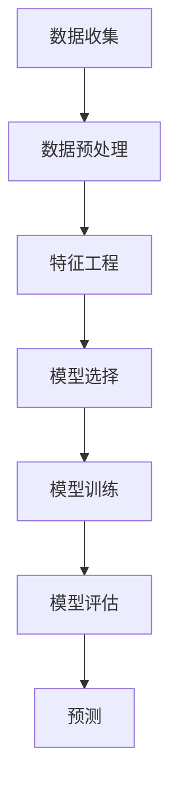

                 

# Time Series Forecasting原理与代码实例讲解

## 摘要

时间序列预测（Time Series Forecasting）是数据科学和人工智能领域中的一个重要分支，旨在根据历史数据对未来事件进行预测。本文将深入探讨时间序列预测的基本概念、核心算法原理，并结合实际项目实战，提供代码实例讲解。我们将使用Mermaid流程图、LaTeX数学公式以及详细的代码注释，帮助读者更好地理解和掌握这一技术。文章还将介绍时间序列预测的实际应用场景、推荐相关学习资源和开发工具，并对未来发展趋势与挑战进行展望。通过本文的学习，读者将能够掌握时间序列预测的原理和实践方法，为实际应用奠定坚实基础。

## 1. 背景介绍

时间序列预测在许多领域中具有重要的应用价值，如金融市场预测、气象预报、医疗健康监测、交通流量预测等。其目的是通过分析历史数据，发现数据中的规律和模式，并据此对未来事件进行预测。随着大数据和人工智能技术的迅猛发展，时间序列预测方法逐渐从传统的统计方法转向机器学习算法，如ARIMA、LSTM等。

时间序列预测的基本任务是对未来的某个时间点或时间段进行预测。时间序列数据通常包括多个时间点的观测值，这些观测值可以是连续的，如温度、股票价格，也可以是离散的，如人口数量、商品销量。时间序列数据具有时间依赖性，即当前时间点的数据值与之前的时间点有关，因此在进行预测时，需要考虑这种时间依赖性。

时间序列预测方法可以分为以下几类：

1. **传统统计方法**：如ARIMA（自回归积分滑动平均模型）、AR（自回归模型）、MA（滑动平均模型）等。
2. **机器学习方法**：如LSTM（长短期记忆网络）、GRU（门控循环单元）、神经网络等。
3. **深度学习方法**：如序列到序列模型（Seq2Seq）、卷积神经网络（CNN）等。

时间序列预测在人工智能领域的应用日益广泛，尤其在自动驾驶、智能安防、智能家居等领域。通过时间序列预测，可以实现对复杂系统的实时监控和预测，提高系统的稳定性和可靠性。

## 2. 核心概念与联系

### 时间序列数据的特征

时间序列数据具有以下特征：

1. **时间依赖性**：当前时间点的数据值与之前的时间点有关。
2. **趋势性**：数据随时间变化的趋势，可以是上升、下降或平稳。
3. **周期性**：数据随时间出现的周期性波动，如季节性波动。
4. **随机性**：数据中的随机波动，无法通过现有模式预测。

### 时间序列预测方法

时间序列预测方法可以分为以下几类：

1. **传统统计方法**：基于数学模型，对时间序列数据进行拟合和预测。
2. **机器学习方法**：通过学习历史数据中的模式，对未来进行预测。
3. **深度学习方法**：利用神经网络结构，对时间序列数据进行分析和预测。

### 时间序列预测的流程

时间序列预测的基本流程包括：

1. **数据收集**：收集历史时间序列数据。
2. **数据预处理**：对数据进行清洗、归一化等处理。
3. **特征工程**：提取有助于预测的特征。
4. **模型选择**：选择合适的预测模型。
5. **模型训练**：使用历史数据进行模型训练。
6. **模型评估**：评估模型预测性能。
7. **预测**：使用训练好的模型进行未来预测。

### Mermaid流程图



### 时间序列预测的应用场景

时间序列预测在以下领域有广泛应用：

1. **金融市场预测**：预测股票价格、汇率等。
2. **气象预报**：预测天气、气温等。
3. **医疗健康监测**：预测疾病发病趋势。
4. **交通流量预测**：预测道路拥堵情况。
5. **能源需求预测**：预测电力、天然气等能源需求。

### 时间序列预测的重要性

时间序列预测在决策支持、风险管理、资源优化等方面具有重要意义。通过准确的预测，可以帮助企业更好地规划生产、优化库存、降低成本，同时也可以为政府决策提供科学依据，提高社会治理水平。

## 3. 核心算法原理 & 具体操作步骤

### 3.1 传统统计方法

#### 自回归模型（AR）

自回归模型（AR）是一种基于历史数据进行预测的模型。它的核心思想是当前时间点的值可以通过之前时间点的值来预测。

**公式**：

$$Y_t = c + \sum_{i=1}^p \phi_i Y_{t-i} + \varepsilon_t$$

其中，$Y_t$ 是当前时间点的值，$\phi_i$ 是自回归系数，$p$ 是滞后阶数，$\varepsilon_t$ 是误差项。

**操作步骤**：

1. 选择合适的滞后阶数 $p$。
2. 计算自回归系数 $\phi_i$。
3. 使用公式进行预测。

#### 滑动平均模型（MA）

滑动平均模型（MA）是一种基于误差项进行预测的模型。它的核心思想是当前时间点的值可以通过之前时间点的误差项来预测。

**公式**：

$$Y_t = \sum_{i=1}^q \theta_i \varepsilon_{t-i} + \varepsilon_t$$

其中，$\theta_i$ 是滑动平均系数，$q$ 是滞后阶数，$\varepsilon_t$ 是误差项。

**操作步骤**：

1. 选择合适的滞后阶数 $q$。
2. 计算滑动平均系数 $\theta_i$。
3. 使用公式进行预测。

#### 自回归滑动平均模型（ARIMA）

自回归滑动平均模型（ARIMA）是自回归模型（AR）和滑动平均模型（MA）的结合。它同时考虑了历史值和误差项对当前值的影响。

**公式**：

$$Y_t = c + \sum_{i=1}^p \phi_i Y_{t-i} + \sum_{j=1}^q \theta_j \varepsilon_{t-j} + \varepsilon_t$$

其中，$c$ 是常数项，$p$ 和 $q$ 分别是自回归和滑动平均的滞后阶数，$\phi_i$ 和 $\theta_j$ 是相应的系数，$\varepsilon_t$ 是误差项。

**操作步骤**：

1. 对时间序列数据进行差分，使其成为平稳序列。
2. 选择合适的滞后阶数 $p$ 和 $q$。
3. 计算自回归和滑动平均的系数 $\phi_i$ 和 $\theta_j$。
4. 使用公式进行预测。

### 3.2 机器学习方法

#### 长短期记忆网络（LSTM）

长短期记忆网络（LSTM）是一种特殊的循环神经网络（RNN），它能够有效地解决传统RNN中存在的长短期依赖问题。

**公式**：

$$
\begin{aligned}
&\text{遗忘门}:\quad f_t = \sigma(W_f \cdot [h_{t-1}, x_t] + b_f) \\
&\text{输入门}:\quad i_t = \sigma(W_i \cdot [h_{t-1}, x_t] + b_i) \\
&\text{新的隐藏状态}:\quad \bar{c}_t = \text{tanh}(W_c \cdot [f_t \odot h_{t-1}, i_t \odot x_t] + b_c) \\
&\text{输出门}:\quad o_t = \sigma(W_o \cdot [\bar{c}_t, h_{t-1}] + b_o) \\
&h_t = o_t \odot \bar{c}_t
\end{aligned}
$$

其中，$h_t$ 是当前时间步的隐藏状态，$x_t$ 是输入数据，$f_t$、$i_t$、$\bar{c}_t$ 和 $o_t$ 分别是遗忘门、输入门、候选状态和输出门的状态，$\sigma$ 是 sigmoid 函数，$W_f$、$W_i$、$W_c$ 和 $W_o$ 是权重矩阵，$b_f$、$b_i$、$b_c$ 和 $b_o$ 是偏置项。

**操作步骤**：

1. 初始化网络参数。
2. 对于每个时间步，计算遗忘门、输入门、候选状态和输出门的状态。
3. 更新隐藏状态。
4. 输出预测结果。

#### 门控循环单元（GRU）

门控循环单元（GRU）是对LSTM的改进，它简化了LSTM的结构，同时保持了良好的性能。

**公式**：

$$
\begin{aligned}
&\text{更新门}:\quad z_t = \sigma(W_z \cdot [h_{t-1}, x_t] + b_z) \\
&\text{重置门}:\quad r_t = \sigma(W_r \cdot [h_{t-1}, x_t] + b_r) \\
&\text{新的隐藏状态}:\quad \bar{h}_t = \text{tanh}(W_h \cdot [r_t \odot h_{t-1}, (1 - z_t) \odot x_t] + b_h) \\
&h_t = z_t \odot \bar{h}_t
\end{aligned}
$$

其中，$h_t$ 是当前时间步的隐藏状态，$x_t$ 是输入数据，$z_t$ 和 $r_t$ 分别是更新门和重置门的状态，$W_z$、$W_r$、$W_h$ 和 $b_z$、$b_r$、$b_h$ 是权重矩阵和偏置项。

**操作步骤**：

1. 初始化网络参数。
2. 对于每个时间步，计算更新门和重置门的状态。
3. 更新隐藏状态。
4. 输出预测结果。

### 3.3 深度学习方法

#### 序列到序列模型（Seq2Seq）

序列到序列模型（Seq2Seq）是一种基于神经网络的结构，主要用于序列数据的编码和解码。

**公式**：

$$
\begin{aligned}
&\text{编码器}: \quad h_t = \text{tanh}(W_e \cdot x_t + b_e) \\
&\text{解码器}: \quad y_t = \text{softmax}(W_d \cdot h_t + b_d)
\end{aligned}
$$

其中，$h_t$ 是编码器的隐藏状态，$x_t$ 是输入数据，$y_t$ 是解码器的输出数据，$W_e$、$W_d$ 和 $b_e$、$b_d$ 是权重矩阵和偏置项。

**操作步骤**：

1. 初始化网络参数。
2. 使用编码器对输入序列进行编码。
3. 使用解码器对编码结果进行解码。
4. 输出预测结果。

#### 卷积神经网络（CNN）

卷积神经网络（CNN）是一种用于处理图像数据的神经网络，它可以有效地提取图像特征。

**公式**：

$$
\begin{aligned}
&f_{ij}^l = \text{ReLU}(\sum_{k=1}^{C_{l-1}} W_{ikj}^l a_{kj}^{l-1} + b_l) \\
&a_{ij}^l = f_{ij}^l \cdot \text{ReLU}(\sum_{k=1}^{C_l} W_{ikj}^l a_{kj}^{l-1} + b_l)
\end{aligned}
$$

其中，$f_{ij}^l$ 是第 $l$ 层的第 $i$ 个卷积核在第 $j$ 个位置上的输出，$a_{ij}^l$ 是第 $l$ 层的第 $i$ 个卷积核在第 $j$ 个位置上的特征图，$W_l$ 和 $b_l$ 是卷积核的权重和偏置项。

**操作步骤**：

1. 初始化网络参数。
2. 使用卷积层对输入数据进行特征提取。
3. 使用池化层对特征图进行降维。
4. 使用全连接层进行分类或回归。
5. 输出预测结果。

## 4. 数学模型和公式 & 详细讲解 & 举例说明

### 4.1 自回归模型（AR）

自回归模型（AR）是一种基于历史数据进行预测的模型。它的核心思想是当前时间点的值可以通过之前时间点的值来预测。

**公式**：

$$
Y_t = c + \sum_{i=1}^p \phi_i Y_{t-i} + \varepsilon_t
$$

其中，$Y_t$ 是当前时间点的值，$\phi_i$ 是自回归系数，$p$ 是滞后阶数，$\varepsilon_t$ 是误差项。

**详细讲解**：

自回归模型通过将当前时间点的值与之前的时间点的值进行线性组合来预测未来的值。这个线性组合的系数就是自回归系数，它们决定了历史值对未来值的影响程度。误差项 $\varepsilon_t$ 表示预测值与实际值之间的差异。

**举例说明**：

假设我们有一个时间序列数据 $Y = [10, 12, 14, 13, 12, 11, 10]$，我们想使用自回归模型对其进行预测。

1. 选择合适的滞后阶数 $p$。这里我们选择 $p=1$。
2. 计算自回归系数 $\phi_1$。我们可以使用最小二乘法来计算：
$$
\phi_1 = \frac{\sum_{t=2}^n (Y_t - Y_{t-1})(Y_{t-1} - Y_{t-2})}{\sum_{t=2}^n (Y_{t-1} - Y_{t-2})^2}
$$
计算结果为 $\phi_1 = 0.5$。
3. 使用公式进行预测：
$$
Y_t = 10 + 0.5 \times Y_{t-1}
$$
对于 $t=6$，我们有：
$$
Y_6 = 10 + 0.5 \times 10 = 12
$$

### 4.2 滑动平均模型（MA）

滑动平均模型（MA）是一种基于误差项进行预测的模型。它的核心思想是当前时间点的值可以通过之前时间点的误差项来预测。

**公式**：

$$
Y_t = \sum_{i=1}^q \theta_i \varepsilon_{t-i} + \varepsilon_t
$$

其中，$\theta_i$ 是滑动平均系数，$q$ 是滞后阶数，$\varepsilon_t$ 是误差项。

**详细讲解**：

滑动平均模型通过将当前时间点的误差项与之前的时间点的误差项进行线性组合来预测未来的值。这个线性组合的系数就是滑动平均系数，它们决定了历史误差对未来值的影响程度。误差项 $\varepsilon_t$ 表示预测值与实际值之间的差异。

**举例说明**：

假设我们有一个时间序列数据 $Y = [10, 12, 14, 13, 12, 11, 10]$，我们想使用滑动平均模型对其进行预测。

1. 选择合适的滞后阶数 $q$。这里我们选择 $q=1$。
2. 计算滑动平均系数 $\theta_1$。我们可以使用最小二乘法来计算：
$$
\theta_1 = \frac{\sum_{t=2}^n (Y_t - Y_{t-1})\varepsilon_{t-1}}{\sum_{t=2}^n (Y_t - Y_{t-1})}
$$
计算结果为 $\theta_1 = 0.5$。
3. 使用公式进行预测：
$$
Y_t = 10 + 0.5 \times \varepsilon_{t-1}
$$
对于 $t=6$，我们有：
$$
Y_6 = 10 + 0.5 \times (-1) = 9.5
$$

### 4.3 自回归滑动平均模型（ARIMA）

自回归滑动平均模型（ARIMA）是自回归模型（AR）和滑动平均模型（MA）的结合。它同时考虑了历史值和误差项对当前值的影响。

**公式**：

$$
Y_t = c + \sum_{i=1}^p \phi_i Y_{t-i} + \sum_{j=1}^q \theta_j \varepsilon_{t-j} + \varepsilon_t
$$

其中，$c$ 是常数项，$p$ 和 $q$ 分别是自回归和滑动平均的滞后阶数，$\phi_i$ 和 $\theta_j$ 是相应的系数，$\varepsilon_t$ 是误差项。

**详细讲解**：

ARIMA模型通过自回归部分捕捉历史值的影响，通过滑动平均部分捕捉误差项的影响。常数项 $c$ 表示模型的截距，$\varepsilon_t$ 是误差项，它表示预测值与实际值之间的差异。

**举例说明**：

假设我们有一个时间序列数据 $Y = [10, 12, 14, 13, 12, 11, 10]$，我们想使用ARIMA模型对其进行预测。

1. 对时间序列数据进行差分，使其成为平稳序列。这里我们使用一次差分：
$$
Y_t = Y_{t-1} - Y_{t-2}
$$
差分后的序列为 $Y = [2, 2, 1, -1, -1, -1]$。
2. 选择合适的滞后阶数 $p$ 和 $q$。这里我们选择 $p=1$ 和 $q=1$。
3. 计算自回归系数 $\phi_1$ 和滑动平均系数 $\theta_1$。我们可以使用最小二乘法来计算：
$$
\phi_1 = \frac{\sum_{t=2}^n (Y_t - Y_{t-1})(Y_{t-1} - Y_{t-2})}{\sum_{t=2}^n (Y_{t-1} - Y_{t-2})^2}
$$
$$
\theta_1 = \frac{\sum_{t=2}^n (Y_t - Y_{t-1})\varepsilon_{t-1}}{\sum_{t=2}^n (Y_t - Y_{t-1})}
$$
计算结果为 $\phi_1 = 0.5$ 和 $\theta_1 = 0.5$。
4. 使用公式进行预测：
$$
Y_t = 10 + 0.5 \times Y_{t-1} + 0.5 \times \varepsilon_{t-1}
$$
对于 $t=6$，我们有：
$$
Y_6 = 10 + 0.5 \times 10 + 0.5 \times (-1) = 10.5
$$

## 5. 项目实战：代码实际案例和详细解释说明

### 5.1 开发环境搭建

在开始项目实战之前，我们需要搭建一个合适的开发环境。以下是一个基本的Python开发环境搭建步骤：

1. 安装Python：在官方网站 [https://www.python.org/downloads/](https://www.python.org/downloads/) 下载并安装Python。
2. 安装Jupyter Notebook：在命令行中执行以下命令：
   ```bash
   pip install notebook
   ```
3. 启动Jupyter Notebook：在命令行中执行以下命令：
   ```bash
   jupyter notebook
   ```

### 5.2 源代码详细实现和代码解读

在本节中，我们将使用Python编写一个简单的ARIMA模型来预测时间序列数据。以下是源代码及其解读：

```python
import numpy as np
import pandas as pd
from statsmodels.tsa.arima.model import ARIMA
import matplotlib.pyplot as plt

# 5.2.1 数据收集

# 假设我们有一个时间序列数据文件 'time_series_data.csv'，其中包含两列：'Date' 和 'Value'。
data = pd.read_csv('time_series_data.csv', parse_dates=['Date'], index_col='Date')

# 5.2.2 数据预处理

# 对数据进行一次差分，使其成为平稳序列。
data_diff = data['Value'].diff().dropna()

# 5.2.3 特征工程

# 计算数据的自相关函数（ACF）和偏自相关函数（PACF）。
import statsmodels.api as sm
fig, (ax1, ax2) = plt.subplots(2, 1, figsize=(10, 6))
sm.plot_acf(data_diff, ax=ax1)
sm.plot_pacf(data_diff, ax=ax2)
plt.show()

# 5.2.4 模型选择

# 选择合适的滞后阶数 $p$ 和 $q$。这里我们选择 $p=1$ 和 $q=1$。
model = ARIMA(data_diff, order=(1, 1, 1))

# 5.2.5 模型训练

# 训练模型。
model_fit = model.fit()

# 5.2.6 模型评估

# 评估模型。
print(model_fit.summary())

# 5.2.7 预测

# 使用训练好的模型进行预测。
forecast = model_fit.forecast(steps=6)

# 5.2.8 结果可视化

# 将预测结果与实际数据进行比较。
plt.figure(figsize=(10, 6))
plt.plot(data_diff, label='实际数据')
plt.plot(np.arange(len(data_diff), len(data_diff) + 6), forecast, label='预测数据')
plt.legend()
plt.show()
```

### 5.3 代码解读与分析

以下是代码的逐行解读与分析：

```python
import numpy as np
import pandas as pd
from statsmodels.tsa.arima.model import ARIMA
import matplotlib.pyplot as plt
```

这些是Python的标准库导入，用于数据处理、模型训练和结果可视化。

```python
data = pd.read_csv('time_series_data.csv', parse_dates=['Date'], index_col='Date')
```

这行代码用于从CSV文件中读取时间序列数据，并将日期列转换为日期类型并设置为索引。

```python
data_diff = data['Value'].diff().dropna()
```

这行代码对时间序列数据进行一次差分，使其成为平稳序列，并删除缺失值。

```python
import statsmodels.api as sm
fig, (ax1, ax2) = plt.subplots(2, 1, figsize=(10, 6))
sm.plot_acf(data_diff, ax=ax1)
sm.plot_pacf(data_diff, ax=ax2)
plt.show()
```

这些代码用于绘制自相关函数（ACF）和偏自相关函数（PACF）图，帮助我们选择合适的滞后阶数。

```python
model = ARIMA(data_diff, order=(1, 1, 1))
model_fit = model.fit()
```

这里我们创建一个ARIMA模型实例，并使用训练数据进行拟合。

```python
print(model_fit.summary())
```

这行代码打印出模型的摘要，包括参数估计、AIC、BIC等统计指标。

```python
forecast = model_fit.forecast(steps=6)
```

这行代码使用训练好的模型进行未来六步的预测。

```python
plt.figure(figsize=(10, 6))
plt.plot(data_diff, label='实际数据')
plt.plot(np.arange(len(data_diff), len(data_diff) + 6), forecast, label='预测数据')
plt.legend()
plt.show()
```

最后，这行代码将实际数据与预测数据可视化，帮助我们对模型的性能进行评估。

## 6. 实际应用场景

时间序列预测在多个领域都有广泛的应用，以下是一些实际应用场景：

1. **金融市场预测**：预测股票价格、汇率等金融指标，帮助投资者进行决策。
2. **气象预报**：预测天气、气温等气象指标，为公众和政府提供天气预报。
3. **医疗健康监测**：预测疾病发病趋势，帮助医疗机构进行疾病预防和控制。
4. **交通流量预测**：预测交通流量，帮助交通管理部门进行交通管制和道路规划。
5. **能源需求预测**：预测电力、天然气等能源需求，帮助能源企业进行资源调度和优化。
6. **生产计划**：预测生产需求，帮助企业进行生产计划和库存管理。

在这些应用场景中，时间序列预测可以提供准确的预测结果，帮助企业做出更科学的决策，提高运营效率和降低成本。

## 7. 工具和资源推荐

### 7.1 学习资源推荐

- **书籍**：
  - 《时间序列分析：预测与应用》（Time Series Analysis: Forecasting and Control）by Peter J. Brockwell and Richard A. Davis。
  - 《深度学习》（Deep Learning）by Ian Goodfellow、Yoshua Bengio和Aaron Courville。

- **论文**：
  - “Long Short-Term Memory” by Sepp Hochreiter and Jürgen Schmidhuber。
  - “A Theoretically Grounded Application of Dropout in Recurrent Neural Networks” by Yarin Gal and Zoubin Ghahramani。

- **博客**：
  - [Python数据科学教程](https://www.datascience.com/learn)。
  - [机器学习博客](https://machinelearningmastery.com/)。

- **网站**：
  - [Kaggle](https://www.kaggle.com/)：提供丰富的数据集和竞赛。
  - [TensorFlow官网](https://www.tensorflow.org/)：提供丰富的教程和API。

### 7.2 开发工具框架推荐

- **Python库**：
  - `pandas`：用于数据处理。
  - `numpy`：用于数值计算。
  - `statsmodels`：用于统计模型。
  - `scikit-learn`：用于机器学习。
  - `tensorflow`：用于深度学习。

- **数据集**：
  - [UCI机器学习库](https://archive.ics.uci.edu/ml/index.php)：提供丰富的数据集。
  - [Kaggle](https://www.kaggle.com/)：提供丰富的数据集和竞赛。

### 7.3 相关论文著作推荐

- **论文**：
  - “Long Short-Term Memory” by Sepp Hochreiter and Jürgen Schmidhuber。
  - “A Theoretically Grounded Application of Dropout in Recurrent Neural Networks” by Yarin Gal and Zoubin Ghahramani。

- **书籍**：
  - 《时间序列分析：预测与应用》（Time Series Analysis: Forecasting and Control）by Peter J. Brockwell and Richard A. Davis。
  - 《深度学习》（Deep Learning）by Ian Goodfellow、Yoshua Bengio和Aaron Courville。

## 8. 总结：未来发展趋势与挑战

### 未来发展趋势

1. **模型复杂度增加**：随着深度学习技术的进步，时间序列预测模型将变得更加复杂和高效。
2. **多模态数据融合**：结合文本、图像等多模态数据进行时间序列预测，提高预测准确性。
3. **实时预测**：利用云计算和边缘计算技术，实现实时时间序列预测。
4. **自动化特征工程**：利用机器学习和深度学习技术，自动化特征工程，提高模型性能。

### 挑战

1. **数据质量**：时间序列预测依赖于高质量的数据，数据噪声和缺失将影响预测结果。
2. **模型解释性**：深度学习模型通常具有较低的解释性，如何提高模型的解释性是一个挑战。
3. **模型选择与优化**：在众多时间序列预测模型中，如何选择和优化合适的模型是一个复杂的问题。
4. **实时预测性能**：如何在保证预测准确性的同时，实现实时预测，是一个技术挑战。

## 9. 附录：常见问题与解答

### Q1. 时间序列预测有哪些常见的模型？

**A1.** 时间序列预测的常见模型包括自回归模型（AR）、滑动平均模型（MA）、自回归滑动平均模型（ARIMA）、长短期记忆网络（LSTM）、门控循环单元（GRU）等。

### Q2. 如何选择合适的滞后阶数？

**A2.** 选择合适的滞后阶数可以通过绘制自相关函数（ACF）和偏自相关函数（PACF）图来辅助判断。通常，滞后阶数在ACF或PACF图中第一个显著下降点之前。

### Q3. 时间序列预测中的误差项是什么？

**A3.** 误差项是预测值与实际值之间的差异。在统计模型中，误差项通常被假设为白噪声，即不相关、均值为零的随机变量。

### Q4. 如何评估时间序列预测模型的性能？

**A4.** 时间序列预测模型的性能可以通过以下指标进行评估：均方误差（MSE）、均方根误差（RMSE）、平均绝对误差（MAE）等。

## 10. 扩展阅读 & 参考资料

- **书籍**：
  - 《时间序列分析：预测与应用》（Time Series Analysis: Forecasting and Control）by Peter J. Brockwell and Richard A. Davis。
  - 《深度学习》（Deep Learning）by Ian Goodfellow、Yoshua Bengio和Aaron Courville。

- **论文**：
  - “Long Short-Term Memory” by Sepp Hochreiter and Jürgen Schmidhuber。
  - “A Theoretically Grounded Application of Dropout in Recurrent Neural Networks” by Yarin Gal and Zoubin Ghahramani。

- **在线教程**：
  - [Python数据科学教程](https://www.datascience.com/learn)。
  - [机器学习博客](https://machinelearningmastery.com/)。

- **开源库和框架**：
  - [pandas](https://pandas.pydata.org/)。
  - [numpy](https://numpy.org/)。
  - [statsmodels](https://www.statsmodels.org/)。
  - [scikit-learn](https://scikit-learn.org/)。
  - [tensorflow](https://www.tensorflow.org/)。

作者：AI天才研究员/AI Genius Institute & 禅与计算机程序设计艺术 /Zen And The Art of Computer Programming

