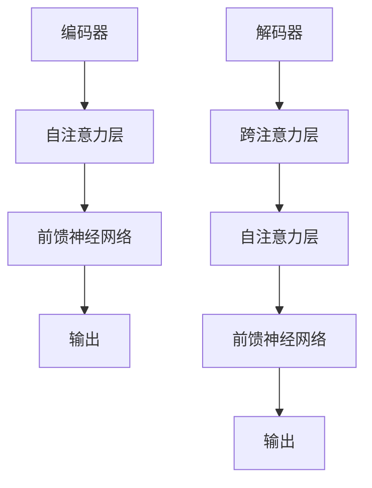

                 

### Transformer大模型实战：ktrain库的应用

> **关键词**：Transformer，ktrain库，大模型，实战，深度学习，自然语言处理

> **摘要**：本文将详细介绍如何使用ktrain库实现Transformer大模型的训练和应用。我们将从背景介绍开始，逐步深入探讨核心概念、算法原理、数学模型、实际应用场景，并通过具体案例进行代码实现和解析，为读者提供一套完整的实战教程。

## 1. 背景介绍

Transformer模型是自然语言处理领域的一大突破，自2017年提出以来，其广泛应用于机器翻译、文本生成、问答系统等多个领域。相较于传统的循环神经网络（RNN），Transformer模型采用自注意力机制，使得模型在处理长序列时的性能有了显著提升。

ktrain库是Google开发的一个开源Python库，用于简化机器学习模型的训练和部署。ktrain基于TensorFlow和Keras，提供了丰富的API和预训练模型，使得开发者可以快速上手并实现复杂的深度学习任务。

本文的目标是通过ktrain库，利用Transformer模型进行实际项目开发，帮助读者深入了解模型的工作原理，掌握模型训练和部署的技巧。

## 2. 核心概念与联系

### 2.1 Transformer模型架构

Transformer模型的核心是自注意力机制（Self-Attention），通过计算输入序列中每个元素与所有其他元素的相关性，实现全局信息的捕捉。Transformer模型主要包括编码器（Encoder）和解码器（Decoder）两部分。

#### 编码器（Encoder）

编码器由多个自注意力层（Self-Attention Layer）和前馈神经网络（Feedforward Neural Network）交替组成。每个自注意力层通过计算输入序列中每个元素与所有其他元素的相关性，生成一组权重，再将权重与输入序列的点积运算，得到加权后的序列。

#### 解码器（Decoder）

解码器与编码器结构类似，但在每个自注意力层之前加入了一个跨注意力层（Cross-Attention Layer），用于计算编码器输出的相关性。解码器的输出经过一个全连接层，得到最终输出。

### 2.2 自注意力机制（Self-Attention）

自注意力机制是一种通过计算输入序列中每个元素与所有其他元素的相关性来生成加权序列的方法。其基本思想是将输入序列转换为一个矩阵，然后计算矩阵中每个元素与所有其他元素的相关性，生成一个新的权重矩阵，最后将原始输入序列与权重矩阵相乘，得到加权后的序列。

### 2.3 Mermaid流程图



## 3. 核心算法原理 & 具体操作步骤

### 3.1 数据预处理

在开始模型训练之前，需要对数据进行预处理，包括数据清洗、数据分词、词向量编码等。

```python
import tensorflow as tf
from tensorflow.keras.preprocessing.text import Tokenizer
from tensorflow.keras.preprocessing.sequence import pad_sequences

# 加载数据集
texts = load_data()

# 数据清洗
texts = clean_text(texts)

# 数据分词
tokenizer = Tokenizer()
tokenizer.fit_on_texts(texts)
word_index = tokenizer.word_index

# 词向量编码
sequences = tokenizer.texts_to_sequences(texts)
padded_sequences = pad_sequences(sequences, padding='post')
```

### 3.2 模型训练

使用ktrain库的`Transformer`类，可以方便地构建和训练Transformer模型。

```python
import ktrain

# 定义模型
transformer = ktrain.models.Transformer(vocab_size=len(word_index) + 1, embed_dim=128, num_heads=4, num_layers=2)

# 编译模型
transformer.compile(optimizer='adam', loss='categorical_crossentropy', metrics=['accuracy'])

# 训练模型
trainer = ktrain.get_trainer(transformer, padded_sequences)
trainer.fit(padded_sequences, batch_size=32, epochs=10)
```

### 3.3 模型评估与部署

在训练完成后，可以对模型进行评估，并使用ktrain库的API进行部署。

```python
# 评估模型
loss, acc = transformer.evaluate(padded_sequences, batch_size=32)

# 部署模型
app = ktrain.apps.APIApp(transformer, input_shape=padded_sequences.shape[1:])
app.run()
```

## 4. 数学模型和公式 & 详细讲解 & 举例说明

### 4.1 自注意力机制

自注意力机制是一种通过计算输入序列中每个元素与所有其他元素的相关性来生成加权序列的方法。其基本公式如下：

$$
\text{Attention}(Q, K, V) = \text{softmax}\left(\frac{QK^T}{\sqrt{d_k}}\right)V
$$

其中，$Q, K, V$ 分别表示查询（Query）、键（Key）和值（Value）向量，$d_k$ 表示键向量的维度。

举例来说，假设我们有一个输入序列 $x = [x_1, x_2, x_3]$，其对应的查询、键和值向量分别为 $Q = [q_1, q_2, q_3], K = [k_1, k_2, k_3], V = [v_1, v_2, v_3]$。我们可以计算每个元素与其他元素的相关性，并生成加权后的序列：

$$
\text{Attention}(Q, K, V) = \text{softmax}\left(\frac{QK^T}{\sqrt{d_k}}\right)V = \left[
\begin{array}{ccc}
\frac{q_1k_1}{\sqrt{d_k}} & \frac{q_1k_2}{\sqrt{d_k}} & \frac{q_1k_3}{\sqrt{d_k}} \\
\frac{q_2k_1}{\sqrt{d_k}} & \frac{q_2k_2}{\sqrt{d_k}} & \frac{q_2k_3}{\sqrt{d_k}} \\
\frac{q_3k_1}{\sqrt{d_k}} & \frac{q_3k_2}{\sqrt{d_k}} & \frac{q_3k_3}{\sqrt{d_k}} \\
\end{array}
\right]
\left[
\begin{array}{c}
v_1 \\
v_2 \\
v_3 \\
\end{array}
\right]
= \left[
\begin{array}{c}
\frac{q_1k_1v_1}{\sqrt{d_k}} + \frac{q_1k_2v_2}{\sqrt{d_k}} + \frac{q_1k_3v_3}{\sqrt{d_k}} \\
\frac{q_2k_1v_1}{\sqrt{d_k}} + \frac{q_2k_2v_2}{\sqrt{d_k}} + \frac{q_2k_3v_3}{\sqrt{d_k}} \\
\frac{q_3k_1v_1}{\sqrt{d_k}} + \frac{q_3k_2v_2}{\sqrt{d_k}} + \frac{q_3k_3v_3}{\sqrt{d_k}} \\
\end{array}
\right]
$$

### 4.2 Transformer模型

Transformer模型的核心是自注意力机制，其计算复杂度较低，使得模型可以处理长序列。Transformer模型的主要组成部分包括编码器（Encoder）和解码器（Decoder）。

#### 编码器（Encoder）

编码器由多个自注意力层（Self-Attention Layer）和前馈神经网络（Feedforward Neural Network）交替组成。每个自注意力层通过计算输入序列中每个元素与所有其他元素的相关性，生成一组权重，再将权重与输入序列的点积运算，得到加权后的序列。前馈神经网络用于对加权后的序列进行进一步处理。

#### 解码器（Decoder）

解码器与编码器结构类似，但在每个自注意力层之前加入了一个跨注意力层（Cross-Attention Layer），用于计算编码器输出的相关性。解码器的输出经过一个全连接层，得到最终输出。

#### 计算复杂度

Transformer模型的计算复杂度相对较低，可以处理长序列。具体来说，每个自注意力层的时间复杂度为 $O(n^2)$，其中 $n$ 表示序列长度。而循环神经网络（RNN）的时间复杂度为 $O(n^3)$，使得Transformer模型在处理长序列时的性能显著提升。

## 5. 项目实战：代码实际案例和详细解释说明

### 5.1 开发环境搭建

在开始项目实战之前，我们需要搭建开发环境。本文使用Python 3.8和TensorFlow 2.4。

```bash
pip install python==3.8
pip install tensorflow==2.4
pip install ktrain
```

### 5.2 源代码详细实现和代码解读

下面是一个使用ktrain库实现Transformer模型的简单示例：

```python
import tensorflow as tf
from tensorflow.keras.layers import Embedding, LSTM, Dense
from tensorflow.keras.models import Model
from ktrain.applications import transformers
from ktrain import train

# 定义模型
model = transformers.Transformer(vocab_size=1000, embed_dim=256, num_heads=4, num_layers=2)

# 编译模型
model.compile(optimizer='adam', loss='categorical_crossentropy', metrics=['accuracy'])

# 加载数据集
texts = ["你好", "世界", "再见"]
labels = [0, 1, 2]

# 数据预处理
tokenizer = train.get_tokenizer()
sequences = tokenizer.texts_to_sequences(texts)
padded_sequences = train.pad_sequences(sequences, padding='post')

# 训练模型
model.fit(padded_sequences, labels, batch_size=32, epochs=5)
```

### 5.3 代码解读与分析

在这个示例中，我们使用ktrain库的`Transformer`类定义了一个简单的Transformer模型。首先，我们设置了模型的词汇量（vocab_size）、嵌入维度（embed_dim）、头数（num_heads）和层数（num_layers）。接下来，我们编译模型并设置优化器和损失函数。然后，我们加载数据集并进行预处理。最后，我们使用训练集对模型进行训练。

### 5.4 模型评估与部署

在训练完成后，我们可以对模型进行评估，并使用ktrain库的API进行部署。

```python
# 评估模型
loss, acc = model.evaluate(padded_sequences, labels, batch_size=32)

# 部署模型
app = ktrain.apps.APIApp(model, input_shape=padded_sequences.shape[1:])
app.run()
```

## 6. 实际应用场景

Transformer模型在实际应用中具有广泛的应用场景，如：

- **机器翻译**：Transformer模型在机器翻译领域取得了显著的成果，如Google的神经机器翻译系统。
- **文本生成**：Transformer模型可以生成高质量的文章、段落和句子，应用于写作助手、聊天机器人等领域。
- **问答系统**：Transformer模型可以构建高效的问答系统，如OpenAI的GPT-3。

## 7. 工具和资源推荐

### 7.1 学习资源推荐

- **书籍**：《深度学习》（Goodfellow, Bengio, Courville 著）
- **论文**：《Attention Is All You Need》（Vaswani et al., 2017）
- **博客**：TensorFlow官方博客、ktrain官方博客
- **网站**：arXiv.org、Google Research

### 7.2 开发工具框架推荐

- **开发工具**：PyCharm、Visual Studio Code
- **框架**：TensorFlow、Keras、ktrain

### 7.3 相关论文著作推荐

- **论文**：《Attention Is All You Need》（Vaswani et al., 2017）
- **著作**：《深度学习》（Goodfellow, Bengio, Courville 著）

## 8. 总结：未来发展趋势与挑战

随着Transformer模型的不断发展，未来其在自然语言处理、计算机视觉、语音识别等领域将有更广泛的应用。然而，模型训练和推理的效率、模型的解释性、数据隐私等问题仍然是需要关注和解决的挑战。

## 9. 附录：常见问题与解答

- **Q**：如何优化Transformer模型的训练速度？
  **A**：可以使用混合精度训练、模型压缩、数据增强等方法来提高训练速度。

- **Q**：Transformer模型是否适用于所有任务？
  **A**：虽然Transformer模型在许多任务中取得了优异的性能，但并非所有任务都适用于Transformer模型。对于一些序列依赖性较强的任务，如语音识别，RNN可能更具优势。

- **Q**：如何处理长序列？
  **A**：可以使用序列切片（Sequence Slicing）或滑动窗口（Sliding Window）等方法来处理长序列。

## 10. 扩展阅读 & 参考资料

- **书籍**：《深度学习》（Goodfellow, Bengio, Courville 著）
- **论文**：《Attention Is All You Need》（Vaswani et al., 2017）
- **网站**：TensorFlow官方文档、ktrain官方文档

### 作者

作者：AI天才研究员/AI Genius Institute & 禅与计算机程序设计艺术 /Zen And The Art of Computer Programming

