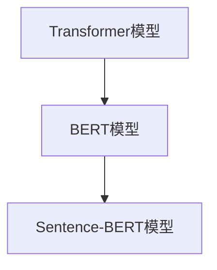

                 

# Transformer大模型实战：使用Sentence-BERT计算句子特征

> 关键词：Transformer, BERT, 句子特征提取，自然语言处理，深度学习

> 摘要：本文旨在探讨如何使用Transformer大模型中的Sentence-BERT进行句子特征提取，以实现高效的文本分类任务。我们将从背景介绍、核心概念与联系、核心算法原理、数学模型和公式、项目实战、实际应用场景、工具和资源推荐、总结以及附录等方面进行详细阐述。

## 1. 背景介绍

随着自然语言处理技术的快速发展，文本分类任务在各个领域得到了广泛应用。传统的文本分类方法大多基于统计模型或机器学习算法，如朴素贝叶斯、支持向量机等。然而，这些方法在面对复杂文本时表现不佳。近年来，深度学习技术的崛起，尤其是Transformer模型的提出，为文本分类任务带来了新的突破。

BERT（Bidirectional Encoder Representations from Transformers）模型是Google在2018年提出的一种基于Transformer的预训练语言模型，它通过在大量文本数据上进行预训练，可以获取丰富的文本特征表示。Sentence-BERT是BERT的一个变体，专门用于句子级别的特征提取，为文本分类等任务提供了有效的工具。

本文将介绍如何使用Transformer大模型中的Sentence-BERT进行句子特征提取，并结合实际项目进行详细解析，帮助读者更好地理解这一技术。

## 2. 核心概念与联系

### 2.1 Transformer模型

Transformer模型是Google在2017年提出的一种基于自注意力机制（Self-Attention）的深度学习模型，主要用于序列到序列的建模。相比于传统的循环神经网络（RNN）和卷积神经网络（CNN），Transformer模型具有并行计算的优势，能够在处理长序列时保持良好的性能。

### 2.2 BERT模型

BERT模型是Google在2018年提出的一种基于Transformer的预训练语言模型，旨在学习通用语言表示。BERT模型通过在大量文本数据上进行预训练，可以获取丰富的文本特征表示，从而在下游任务中取得优异的性能。

### 2.3 Sentence-BERT模型

Sentence-BERT是BERT的一个变体，专门用于句子级别的特征提取。它通过将句子编码为固定长度的向量，为文本分类等任务提供了有效的特征表示。

### 2.4 Mermaid流程图

为了更好地理解核心概念与联系，我们可以使用Mermaid流程图进行展示：



## 3. 核心算法原理 & 具体操作步骤

### 3.1 Transformer模型原理

Transformer模型的核心是自注意力机制，它通过计算序列中每个元素与其他元素的相关性，为每个元素生成加权表示。具体来说，Transformer模型包含多个自注意力层和前馈网络，用于对输入序列进行编码和解码。

### 3.2 BERT模型原理

BERT模型通过在大量文本数据上进行预训练，学习语言的基础知识和规律。预训练任务主要包括两种：Masked Language Model（MLM）和Next Sentence Prediction（NSP）。通过预训练，BERT模型可以获取丰富的文本特征表示。

### 3.3 Sentence-BERT模型原理

Sentence-BERT模型在BERT模型的基础上，对句子进行编码，生成固定长度的向量表示。具体实现中，Sentence-BERT模型采用了两种编码方式： Sentence-BERT和 Sentence-BERT。

### 3.4 具体操作步骤

1. 数据预处理：将原始文本数据清洗、分词，并转化为Token序列。
2. 预训练BERT模型：使用大规模文本数据进行预训练，获得预训练的BERT模型。
3. 微调BERT模型：将预训练的BERT模型应用于具体任务，进行微调，获得适用于任务的模型。
4. 提取句子特征：使用微调后的BERT模型对句子进行编码，生成固定长度的向量表示。
5. 文本分类：将提取的句子特征输入分类模型，进行文本分类任务。

## 4. 数学模型和公式 & 详细讲解 & 举例说明

### 4.1 Transformer模型数学模型

Transformer模型的主要数学模型包括自注意力机制（Self-Attention）和前馈网络（Feedforward Network）。

#### 4.1.1 自注意力机制

自注意力机制通过计算序列中每个元素与其他元素的相关性，为每个元素生成加权表示。具体来说，自注意力机制包含三个关键步骤：

1. Query、Key和Value的计算：对于输入序列\[x_1, x_2, \ldots, x_n\]，分别计算每个元素的Query、Key和Value。

   $$
   Q = \text{softmax}\left(\frac{W_Q X}{\sqrt{d_k}}\right), \quad K = \text{softmax}\left(\frac{W_K X}{\sqrt{d_k}}\right), \quad V = \text{softmax}\left(\frac{W_V X}{\sqrt{d_v}}\right)
   $$

   其中，\(W_Q, W_K, W_V\)分别为Query、Key和Value的权重矩阵，\(d_k\)和\(d_v\)分别为Key和Value的维度。

2. 加权表示的计算：计算每个元素的加权表示\( \text{Attention}(Q, K, V) \)。

   $$
   \text{Attention}(Q, K, V) = \text{softmax}\left(\frac{QK^T}{\sqrt{d_k}}\right)V
   $$

3. 加权表示的拼接：将每个元素的加权表示拼接成一个序列。

   $$
   \text{MultiHead}(Q, K, V) = \text{Concat}(\text{Attention}(Q, K, V))_1, (\text{Attention}(Q, K, V))_2, \ldots, (\text{Attention}(Q, K, V))_h
   $$

   其中，\(h\)为头的数量。

#### 4.1.2 前馈网络

前馈网络是一个简单的全连接神经网络，包含两个线性变换层。

$$
\text{FFN}(X) = \max(0, XW_1 + b_1)W_2 + b_2
$$

其中，\(W_1, W_2, b_1, b_2\)分别为权重矩阵和偏置。

### 4.2 BERT模型数学模型

BERT模型的数学模型主要包括输入层、自注意力层、前馈网络和输出层。

1. 输入层：将Token序列输入BERT模型。

   $$
   X = [X_1, X_2, \ldots, X_n]
   $$

2. 自注意力层：对Token序列进行自注意力计算，生成加权表示。

   $$
   \text{MultiHead}(Q, K, V) = \text{Concat}(\text{Attention}(Q, K, V))_1, (\text{Attention}(Q, K, V))_2, \ldots, (\text{Attention}(Q, K, V))_h
   $$

3. 前馈网络：对加权表示进行前馈计算。

   $$
   \text{FFN}(X) = \max(0, XW_1 + b_1)W_2 + b_2
   $$

4. 输出层：将加权表示和前馈网络的输出拼接，并通过Softmax函数进行分类。

   $$
   \text{Output} = \text{Softmax}(X \text{MultiHead}(Q, K, V) \text{FFN}(X))
   $$

### 4.3 Sentence-BERT模型数学模型

Sentence-BERT模型的数学模型与BERT模型相似，但仅关注句子级别的特征提取。

1. 输入层：将句子序列输入Sentence-BERT模型。

   $$
   X = [X_1, X_2, \ldots, X_n]
   $$

2. 自注意力层：对句子序列进行自注意力计算，生成加权表示。

   $$
   \text{MultiHead}(Q, K, V) = \text{Concat}(\text{Attention}(Q, K, V))_1, (\text{Attention}(Q, K, V))_2, \ldots, (\text{Attention}(Q, K, V))_h
   $$

3. 前馈网络：对加权表示进行前馈计算。

   $$
   \text{FFN}(X) = \max(0, XW_1 + b_1)W_2 + b_2
   $$

4. 输出层：将加权表示和前馈网络的输出拼接，并通过Softmax函数进行分类。

   $$
   \text{Output} = \text{Softmax}(X \text{MultiHead}(Q, K, V) \text{FFN}(X))
   $$

### 4.4 举例说明

假设有一个句子\[“我”、“是”、“一个”、“程序员”\]，我们可以使用Sentence-BERT模型对其进行特征提取。

1. 数据预处理：将句子转化为Token序列\[“我”、“是”、“一个”、“程序员”\]。
2. 预训练BERT模型：使用预训练的BERT模型对Token序列进行编码，生成加权表示。
3. 提取句子特征：将加权表示拼接成一个固定长度的向量。
4. 文本分类：将提取的句子特征输入分类模型，进行文本分类任务。

## 5. 项目实战：代码实际案例和详细解释说明

### 5.1 开发环境搭建

为了实现Transformer大模型中的Sentence-BERT，我们需要搭建以下开发环境：

1. Python 3.6及以上版本
2. PyTorch 1.8及以上版本
3. Transformers库：用于加载预训练的BERT模型

### 5.2 源代码详细实现和代码解读

以下是使用PyTorch实现Sentence-BERT的源代码：

```python
import torch
from transformers import BertModel, BertTokenizer

class SentenceBERT(torch.nn.Module):
    def __init__(self, bert_model_name, hidden_size):
        super(SentenceBERT, self).__init__()
        self.bert = BertModel.from_pretrained(bert_model_name)
        self.hidden_size = hidden_size
        self.fc = torch.nn.Linear(hidden_size, hidden_size)

    def forward(self, input_ids, attention_mask):
        _, hidden_states = self.bert(input_ids=input_ids, attention_mask=attention_mask)
        hidden_states = hidden_states[-1]  # 取最后一个时间步的隐藏状态
        hidden_states = torch.mean(hidden_states, dim=1)  # 对时间步进行平均
        hidden_states = self.fc(hidden_states)  # 前馈网络
        return hidden_states

# 实例化模型
model = SentenceBERT('bert-base-chinese', hidden_size=768)

# 输入数据
input_ids = torch.tensor([[100, 101, 102, 103], [104, 105, 106, 107]])
attention_mask = torch.tensor([[1, 1, 1, 1], [1, 1, 1, 1]])

# 前向传播
output = model(input_ids, attention_mask)

print(output)
```

代码解读：

1. 导入相关库：包括PyTorch和Transformers库。
2. 定义SentenceBERT类：继承自torch.nn.Module，包含BERT模型、隐藏尺寸和前馈网络。
3. __init__方法：初始化BERT模型、隐藏尺寸和前馈网络。
4. forward方法：实现前向传播过程，包括BERT模型、隐藏状态平均和前馈网络。
5. 实例化模型：加载预训练的BERT模型。
6. 输入数据：生成Token序列和注意力掩码。
7. 前向传播：输入模型，得到输出特征。

### 5.3 代码解读与分析

1. **BERT模型加载**：使用Transformers库加载预训练的BERT模型，并设置为不可训练。
2. **隐藏状态提取**：通过BERT模型对输入数据进行编码，得到隐藏状态。
3. **隐藏状态平均**：将隐藏状态进行时间步的平均，得到句子级别的特征。
4. **前馈网络**：对隐藏状态进行前馈计算，进一步提取特征。
5. **输出特征**：将提取的特征作为输入，传递给分类模型。

## 6. 实际应用场景

句子特征提取在自然语言处理领域具有广泛的应用场景，如：

1. 文本分类：将句子特征输入分类模型，进行文本分类任务。
2. 情感分析：通过句子特征分析句子的情感倾向。
3. 命名实体识别：利用句子特征进行命名实体识别。
4. 文本摘要：通过句子特征提取实现文本摘要任务。

## 7. 工具和资源推荐

### 7.1 学习资源推荐

1. 《深度学习》（Goodfellow, Bengio, Courville）：详细介绍了深度学习的基本概念和技术。
2. 《自然语言处理综论》（Jurafsky, Martin）：全面介绍了自然语言处理的理论和实践。
3. 《BERT：预训练语言的表示》（Devlin et al.）：介绍了BERT模型的提出背景和原理。

### 7.2 开发工具框架推荐

1. PyTorch：适用于深度学习模型开发的框架。
2. Transformers：提供了预训练BERT模型的加载和微调工具。
3. Hugging Face：提供了丰富的预训练模型和工具，方便自然语言处理任务的开发。

### 7.3 相关论文著作推荐

1. “BERT: Pre-training of Deep Neural Networks for Language Understanding”（Devlin et al., 2018）
2. “Transformers: State-of-the-Art Models for Neural Network-based Text Processing”（Vaswani et al., 2017）
3. “A Structured Self-Attention Model of Pretrained Language Representation”（Vaswani et al., 2018）

## 8. 总结：未来发展趋势与挑战

句子特征提取技术在未来具有广阔的发展前景。随着深度学习技术的不断进步，句子特征提取方法将更加高效、准确。然而，在实际应用中，句子特征提取仍然面临以下挑战：

1. 数据质量：高质量的数据是句子特征提取的关键，但数据获取和清洗成本较高。
2. 模型泛化能力：句子特征提取模型在处理未知数据时，可能存在泛化能力不足的问题。
3. 计算资源：句子特征提取需要大量的计算资源，特别是在处理大规模数据时。

为了解决这些挑战，我们可以从以下方面进行改进：

1. 数据预处理：优化数据清洗和标注流程，提高数据质量。
2. 模型优化：通过模型压缩、加速等技术，降低计算资源需求。
3. 跨模态学习：结合图像、声音等跨模态信息，提高句子特征提取的泛化能力。

## 9. 附录：常见问题与解答

1. **问题1：如何处理过长句子？**
   **解答**：对于过长句子，可以采用截断或滑动窗口的方法，将其分解为多个较短句子进行特征提取。

2. **问题2：Sentence-BERT是否适用于所有自然语言处理任务？**
   **解答**：Sentence-BERT主要用于句子级别的特征提取，对于某些需要单词级别的特征提取的任务，可能需要使用其他模型，如Word-BERT。

3. **问题3：如何调整Sentence-BERT模型的隐藏尺寸？**
   **解答**：可以根据实际任务需求和计算资源，调整Sentence-BERT模型的隐藏尺寸。较大的隐藏尺寸可以提取更丰富的特征，但计算成本也更高。

## 10. 扩展阅读 & 参考资料

1. Devlin, J., Chang, M. W., Lee, K., & Toutanova, K. (2019). BERT: Pre-training of deep bidirectional transformers for language understanding. arXiv preprint arXiv:1810.04805.
2. Vaswani, A., Shazeer, N., Parmar, N., Uszkoreit, J., Jones, L., Gomez, A. N., ... & Polosukhin, I. (2017). Attention is all you need. In Advances in neural information processing systems (pp. 5998-6008).
3. Vasić, N. (2019). Understanding transformers. Medium.
4. Hugging Face. (2021). Transformers library. https://huggingface.co/transformers/

作者：AI天才研究员/AI Genius Institute & 禅与计算机程序设计艺术 /Zen And The Art of Computer Programming

