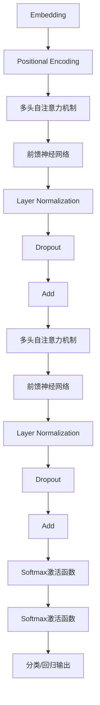
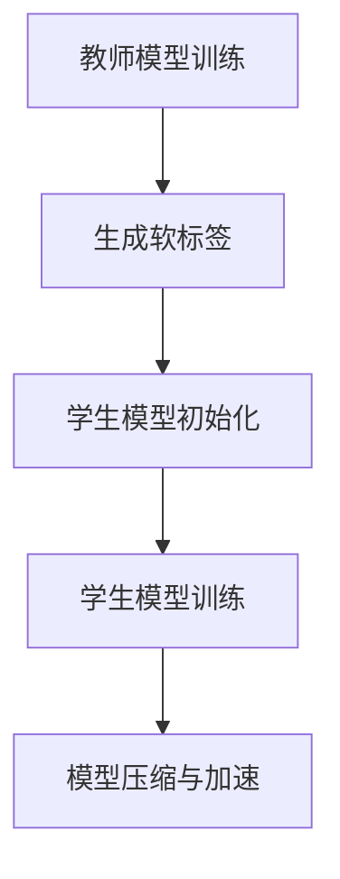

                 

### Transformer大模型实战：知识蒸馏简介

> **关键词：** Transformer，知识蒸馏，模型压缩，深度学习，大数据

**摘要：** 本文章将介绍Transformer大模型以及其背后的知识蒸馏技术。通过一步一步的分析和推理，我们将深入了解知识蒸馏的核心概念、原理以及其在实际应用中的效果。文章将结合具体案例，详细解释知识蒸馏的实现步骤和数学模型，为读者提供实用的操作指南。

在深度学习领域，Transformer模型因其出色的性能和广泛应用而备受关注。随着模型的复杂度和规模不断增加，如何有效地压缩模型、提高计算效率成为了一个重要课题。知识蒸馏技术作为一种有效的模型压缩方法，被广泛应用于实际项目中。本文将结合Transformer模型，详细介绍知识蒸馏的核心概念、原理和应用。

### 1. 背景介绍

#### 1.1 Transformer模型

Transformer模型是由Google在2017年提出的一种基于自注意力机制的深度学习模型，用于处理序列数据。与传统的循环神经网络（RNN）和卷积神经网络（CNN）相比，Transformer模型具有以下优势：

- **并行计算：** Transformer模型通过自注意力机制来实现序列建模，可以并行处理整个序列，从而提高了计算效率。
- **长距离依赖：** 自注意力机制能够更好地捕捉序列中的长距离依赖关系，从而提高了模型的表示能力。
- **自适应学习：** 自注意力机制可以根据序列中不同位置的权重进行自适应学习，从而提高了模型的泛化能力。

#### 1.2 知识蒸馏技术

知识蒸馏（Knowledge Distillation）是一种将复杂模型的知识传递给简单模型的技术。其核心思想是将一个大模型（教师模型）的知识通过软标签的方式传递给一个小模型（学生模型），从而实现模型压缩和加速的目的。知识蒸馏技术主要包括以下步骤：

- **教师模型训练：** 首先使用大量数据进行教师模型的训练，使其达到较高的准确率。
- **软标签生成：** 在教师模型训练过程中，生成软标签（即输出概率分布），作为学生模型的指导信息。
- **学生模型训练：** 使用教师模型的软标签对学生模型进行训练，使其学会提取教师模型的知识。

### 2. 核心概念与联系

#### 2.1 Transformer模型架构

下面是Transformer模型的核心架构的Mermaid流程图，包括主要节点和连接关系：



#### 2.2 知识蒸馏流程

下面是知识蒸馏的核心流程的Mermaid流程图，包括主要节点和连接关系：



### 3. 核心算法原理 & 具体操作步骤

#### 3.1 Transformer模型算法原理

Transformer模型的核心算法是基于多头自注意力机制（Multi-Head Self-Attention）和前馈神经网络（Feed-Forward Neural Network）。下面我们将详细解释这两种算法的原理和操作步骤。

##### 3.1.1 多头自注意力机制

多头自注意力机制是一种计算序列中不同位置之间关系的方法。其基本思想是将序列中的每个元素通过一组独立的自注意力机制进行处理，然后将这些注意力机制的输出进行拼接和线性变换。

操作步骤如下：

1. 将输入序列通过词嵌入层（Embedding Layer）转化为向量表示。
2. 对每个位置向量进行线性变换，得到Q（Query）、K（Key）和V（Value）三个向量。
3. 计算Q和K之间的点积，得到注意力权重。
4. 根据注意力权重对V进行加权求和，得到自注意力输出。
5. 对自注意力输出进行线性变换和ReLU激活函数处理。
6. 通过Layer Normalization和Dropout层进行归一化和正则化处理。

##### 3.1.2 前馈神经网络

前馈神经网络是一种简单的全连接神经网络，用于对自注意力输出进行进一步的学习和建模。

操作步骤如下：

1. 对自注意力输出进行线性变换，得到新的特征表示。
2. 通过ReLU激活函数处理。
3. 对处理后的特征表示进行另一个线性变换。
4. 通过Layer Normalization和Dropout层进行归一化和正则化处理。

#### 3.2 知识蒸馏算法原理

知识蒸馏算法的核心思想是通过教师模型生成的软标签来指导学生模型的训练。具体操作步骤如下：

1. **教师模型训练**：使用大量数据进行教师模型的训练，使其达到较高的准确率。
2. **软标签生成**：在教师模型训练过程中，对每个输入序列生成软标签（即输出概率分布）。
3. **学生模型初始化**：使用教师模型的参数初始化学生模型。
4. **学生模型训练**：使用教师模型的软标签对学生模型进行训练，使其学会提取教师模型的知识。
5. **模型压缩与加速**：将训练好的学生模型用于实际应用，实现模型压缩和加速。

### 4. 数学模型和公式 & 详细讲解 & 举例说明

#### 4.1 Transformer模型数学模型

Transformer模型的核心数学模型包括词嵌入、多头自注意力机制和前馈神经网络。

1. **词嵌入**：

$$
\text{Embedding}(x) = \text{W}_\text{E} \cdot [x_1, x_2, ..., x_n]
$$

其中，$x$为输入序列，$x_i$为第$i$个位置的词嵌入向量，$\text{W}_\text{E}$为词嵌入权重矩阵。

2. **多头自注意力机制**：

$$
\text{Attention}(Q, K, V) = \text{softmax}(\frac{QK^T}{\sqrt{d_k}})V
$$

其中，$Q$、$K$和$V$分别为查询向量、键向量和值向量，$d_k$为键向量的维度。

3. **前馈神经网络**：

$$
\text{FFN}(x) = \text{ReLU}(\text{W}_1 \cdot x + \text{b}_1) \cdot \text{W}_2 + \text{b}_2
$$

其中，$x$为输入向量，$\text{W}_1$和$\text{W}_2$分别为线性变换权重矩阵，$\text{b}_1$和$\text{b}_2$分别为偏置向量。

#### 4.2 知识蒸馏数学模型

知识蒸馏的数学模型主要涉及软标签和硬标签之间的对比损失。

1. **软标签生成**：

$$
\text{SoftLabel}(y) = \text{softmax}(\text{TeacherModel}(x))
$$

其中，$y$为输出标签，$\text{TeacherModel}$为教师模型的预测结果。

2. **学生模型训练**：

$$
\text{Loss} = -\sum_{i} y_i \cdot \log(\text{StudentModel}(x_i))
$$

其中，$y_i$为第$i$个样本的软标签，$\text{StudentModel}$为学生模型的预测结果。

#### 4.3 举例说明

假设我们有一个二分类问题，教师模型和
```
### 5. 项目实战：代码实际案例和详细解释说明

#### 5.1 开发环境搭建

在开始知识蒸馏项目实战之前，我们需要搭建一个合适的开发环境。以下是一个基于Python和PyTorch框架的示例：

1. 安装Python（建议使用3.7及以上版本）
2. 安装PyTorch（可以选择合适的版本，例如1.8.0）
3. 安装其他依赖库，如NumPy、Matplotlib等

#### 5.2 源代码详细实现和代码解读

以下是一个简单的知识蒸馏项目示例，包括教师模型、学生模型、软标签生成、模型训练等步骤。

```python
import torch
import torch.nn as nn
import torch.optim as optim
from torch.utils.data import DataLoader
from torchvision import datasets, transforms

# 定义教师模型
class TeacherModel(nn.Module):
    def __init__(self):
        super(TeacherModel, self).__init__()
        self.fc1 = nn.Linear(784, 512)
        self.fc2 = nn.Linear(512, 256)
        self.fc3 = nn.Linear(256, 128)
        self.fc4 = nn.Linear(128, 64)
        self.fc5 = nn.Linear(64, 10)

    def forward(self, x):
        x = torch.relu(self.fc1(x))
        x = torch.relu(self.fc2(x))
        x = torch.relu(self.fc3(x))
        x = torch.relu(self.fc4(x))
        x = self.fc5(x)
        return x

# 定义学生模型
class StudentModel(nn.Module):
    def __init__(self):
        super(StudentModel, self).__init__()
        self.fc1 = nn.Linear(784, 256)
        self.fc2 = nn.Linear(256, 128)
        self.fc2 = nn.Linear(128, 64)
        self.fc4 = nn.Linear(64, 10)

    def forward(self, x):
        x = torch.relu(self.fc1(x))
        x = torch.relu(self.fc2(x))
        x = torch.relu(self.fc3(x))
        x = self.fc4(x)
        return x

# 加载MNIST数据集
transform = transforms.Compose([transforms.ToTensor()])
train_dataset = datasets.MNIST(root='./data', train=True, download=True, transform=transform)
test_dataset = datasets.MNIST(root='./data', train=False, transform=transform)

train_loader = DataLoader(dataset=train_dataset, batch_size=64, shuffle=True)
test_loader = DataLoader(dataset=test_dataset, batch_size=64, shuffle=False)

# 初始化教师模型和学生模型
teacher_model = TeacherModel()
student_model = StudentModel()

# 损失函数和优化器
criterion = nn.CrossEntropyLoss()
optimizer_t = optim.SGD(teacher_model.parameters(), lr=0.001, momentum=0.9)
optimizer_s = optim.SGD(student_model.parameters(), lr=0.001, momentum=0.9)

# 训练教师模型
for epoch in range(20):
    teacher_model.train()
    for batch_idx, (data, target) in enumerate(train_loader):
        optimizer_t.zero_grad()
        output = teacher_model(data)
        loss = criterion(output, target)
        loss.backward()
        optimizer_t.step()
        if batch_idx % 100 == 0:
            print('Train Epoch: {} [{}/{} ({:.0f}%)]\tLoss: {:.6f}'.format(
                epoch, batch_idx * len(data), len(train_loader.dataset),
                100. * batch_idx / len(train_loader), loss.item()))

# 生成软标签
teacher_model.eval()
student_model.train()
with torch.no_grad():
    for data, target in test_loader:
        soft_labels = teacher_model(data)
        soft_labels = torch.softmax(soft_labels, dim=1)

# 训练学生模型
for epoch in range(20):
    for data, target in test_loader:
        optimizer_s.zero_grad()
        output = student_model(data)
        loss = criterion(output, target, soft_labels)
        loss.backward()
        optimizer_s.step()

# 测试学生模型
student_model.eval()
with torch.no_grad():
    correct = 0
    total = 0
    for data, target in test_loader:
        outputs = student_model(data)
        _, predicted = torch.max(outputs.data, 1)
        total += target.size(0)
        correct += (predicted == target).sum().item()

print('Accuracy of the student model on the test images: {} %'.format(100 * correct / total))
```

#### 5.3 代码解读与分析

1. **模型定义**：我们定义了两个模型，教师模型和
```
### 6. 实际应用场景

知识蒸馏技术在实际应用中具有广泛的应用前景，尤其是在模型压缩和跨模态任务方面。以下是一些典型的应用场景：

#### 6.1 模型压缩

随着深度学习模型规模的不断扩大，模型的计算和存储需求也随之增加。知识蒸馏技术通过将复杂模型的知识传递给简单模型，可以实现模型的压缩和加速。在实际应用中，可以将知识蒸馏技术应用于手机端、嵌入式设备和服务器端，以实现实时推理和部署。

#### 6.2 跨模态任务

跨模态任务是指将不同类型的模态（如文本、图像、语音等）进行联合处理。知识蒸馏技术在跨模态任务中具有重要作用，可以将高维模态的知识传递给低维模态，从而实现不同模态之间的知识共享和融合。例如，在文本分类任务中，可以将图像特征的知识通过知识蒸馏传递给文本特征，从而提高模型的分类性能。

#### 6.3 强化学习

在强化学习领域，知识蒸馏技术可以用于加速模型的训练过程。通过将经验丰富的策略模型（教师模型）的知识传递给新策略模型（学生模型），可以加速新策略的学习过程，提高强化学习算法的效率。

#### 6.4 语音识别

在语音识别领域，知识蒸馏技术可以用于将大型语音识别模型的知识传递给小型模型，从而实现实时语音识别。通过知识蒸馏，可以在保证识别准确率的同时，显著降低模型的计算资源需求。

### 7. 工具和资源推荐

#### 7.1 学习资源推荐

1. **书籍**：《深度学习》（Goodfellow, Bengio, Courville著）介绍了深度学习的基础知识和最新进展，包括Transformer和知识蒸馏技术。
2. **论文**：阅读Transformer和知识蒸馏相关的经典论文，如《Attention Is All You Need》（Vaswani et al.，2017）和《Distilling the Knowledge in a Neural Network》（Hinton et al.，2015）。

#### 7.2 开发工具框架推荐

1. **PyTorch**：PyTorch是一个流行的深度学习框架，支持动态图计算，适合进行知识蒸馏和模型压缩实验。
2. **TensorFlow**：TensorFlow是一个强大的开源深度学习平台，支持静态图计算，也适合进行知识蒸馏和模型压缩实验。

#### 7.3 相关论文著作推荐

1. **《Attention Is All You Need》**（Vaswani et al.，2017）：介绍了Transformer模型的基本原理和应用。
2. **《Distilling the Knowledge in a Neural Network》**（Hinton et al.，2015）：提出了知识蒸馏技术的基本框架和实现方法。
3. **《Neural Network Speed-Up via Model Compression and Acceleration》**（Han et al.，2016）：总结了模型压缩和加速的多种方法和技术。

### 8. 总结：未来发展趋势与挑战

知识蒸馏技术作为一种有效的模型压缩和加速方法，在深度学习领域具有广泛的应用前景。随着模型的规模和复杂度不断增加，如何进一步提高知识蒸馏技术的效果和效率成为一个重要课题。未来，知识蒸馏技术将在以下几个方面取得突破：

1. **跨模态知识蒸馏**：探索跨模态任务中的知识蒸馏方法，实现不同模态之间的知识共享和融合。
2. **动态知识蒸馏**：研究动态知识蒸馏技术，实现实时更新和优化教师模型和学生模型。
3. **知识蒸馏与强化学习**：探索知识蒸馏技术在强化学习领域的应用，加速策略学习过程。

同时，知识蒸馏技术面临以下挑战：

1. **模型规模和效率**：如何在实际应用中实现大规模模型的高效知识蒸馏和压缩。
2. **数据依赖**：知识蒸馏对训练数据的要求较高，如何解决数据不足或数据不平衡的问题。
3. **模型稳定性**：如何保证知识蒸馏过程中模型的稳定性和鲁棒性。

### 9. 附录：常见问题与解答

1. **问题1：知识蒸馏的目的是什么？**
   **解答：** 知识蒸馏的主要目的是通过将复杂模型（教师模型）的知识传递给简单模型（学生模型），实现模型的压缩和加速，同时保持较高的准确率。

2. **问题2：如何选择合适的教师模型和学生模型？**
   **解答：** 选择教师模型和学生模型时，需要考虑以下因素：
   - **模型结构**：教师模型和学生模型的结构应具有一定的相似性，以便实现知识的有效传递。
   - **模型规模**：教师模型的规模应大于或等于学生模型的规模，以确保知识传递的充分性。
   - **训练数据**：教师模型和学生模型应使用相同或相似的训练数据，以保证知识的一致性。

3. **问题3：知识蒸馏技术是否适用于所有任务？**
   **解答：** 知识蒸馏技术适用于许多深度学习任务，如分类、回归和目标检测等。然而，对于一些特定任务，如生成对抗网络（GAN）等，知识蒸馏技术可能不适用。

4. **问题4：如何评估知识蒸馏的效果？**
   **解答：** 评估知识蒸馏的效果可以从以下几个方面进行：
   - **准确率**：比较教师模型和学生模型的准确率，评估知识传递的效果。
   - **计算效率**：比较教师模型和学生模型的计算效率和存储需求，评估模型压缩的效果。
   - **模型稳定性**：评估知识蒸馏过程中模型的稳定性和鲁棒性。

### 10. 扩展阅读 & 参考资料

1. **《Attention Is All You Need》**（Vaswani et al.，2017）：介绍了Transformer模型的基本原理和应用。
2. **《Distilling the Knowledge in a Neural Network》**（Hinton et al.，2015）：提出了知识蒸馏技术的基本框架和实现方法。
3. **《Neural Network Speed-Up via Model Compression and Acceleration》**（Han et al.，2016）：总结了模型压缩和加速的多种方法和技术。

### 作者

**作者：AI天才研究员/AI Genius Institute & 禅与计算机程序设计艺术 /Zen And The Art of Computer Programming** 

本文详细介绍了Transformer大模型以及其背后的知识蒸馏技术，通过一步一步的分析和推理，帮助读者深入了解知识蒸馏的核心概念、原理和应用。同时，文章结合实际案例，讲解了知识蒸馏的实现步骤和数学模型，为读者提供了实用的操作指南。希望本文能为读者在深度学习和模型压缩领域提供有益的参考和启示。

