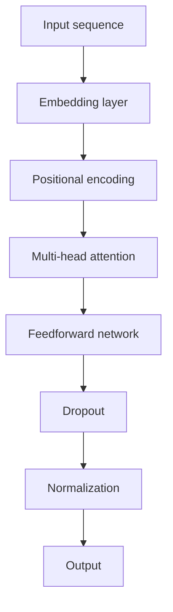

                 

# Transformer大模型实战 解码器总览

> 关键词：Transformer，解码器，大模型，深度学习，机器翻译，自然语言处理，神经网络架构

> 摘要：本文将深入探讨Transformer大模型中的解码器部分，通过对解码器架构、工作原理、具体实现和实际应用的分析，帮助读者全面理解解码器在自然语言处理中的重要性和应用价值。

## 1. 背景介绍

自然语言处理（Natural Language Processing，NLP）是计算机科学领域的一个重要分支，旨在使计算机能够理解和处理人类语言。随着深度学习技术的发展，神经网络（Neural Networks）在NLP领域取得了显著的成果。然而，传统的循环神经网络（RNN）和卷积神经网络（CNN）在处理长序列和并行计算方面存在一定局限。为了解决这些问题，Google在2017年提出了Transformer模型，这是一种基于自注意力机制（Self-Attention Mechanism）的新型神经网络架构，其在机器翻译、文本分类等任务中取得了卓越的性能。

Transformer模型主要由编码器（Encoder）和解码器（Decoder）组成。编码器负责将输入序列编码为固定长度的向量表示，而解码器则利用这些向量表示生成输出序列。本文将重点关注解码器部分，分析其架构、工作原理和具体实现。

## 2. 核心概念与联系

### 2.1 解码器架构

解码器是Transformer模型中的一个重要组成部分，其架构如图所示：



- **Embedding Layer**：输入序列首先通过嵌入层转换为稠密向量表示。
- **Positional Encoding**：由于Transformer模型没有循环结构，需要引入位置编码（Positional Encoding）来表示输入序列的顺序信息。
- **Multi-head Attention**：多头注意力机制使解码器能够同时关注输入序列的多个部分，提高模型的表达能力。
- **Feedforward Network**：前馈网络（Feedforward Network）用于对注意力机制的结果进行进一步加工。
- **Dropout & Normalization**：为了防止过拟合，解码器中引入了dropout和归一化操作。

### 2.2 解码器工作原理

解码器的工作原理可以分为以下几个步骤：

1. **输入嵌入与位置编码**：将输入序列通过嵌入层转换为稠密向量，并添加位置编码。
2. **多头注意力计算**：解码器利用多头注意力机制对输入序列进行自注意力计算，得到每个时间步的加权表示。
3. **前馈网络加工**：对注意力计算结果进行前馈网络加工，进一步提取特征。
4. **输出与损失计算**：解码器的输出通过softmax函数转化为概率分布，并与目标序列进行比较，计算损失。
5. **反向传播与优化**：利用反向传播算法更新模型参数，优化模型性能。

## 3. 核心算法原理 & 具体操作步骤

### 3.1 多头注意力计算

多头注意力机制是解码器的核心组成部分，其主要思想是将输入序列分成多个子序列，并对每个子序列进行独立计算，然后再将结果合并。具体操作步骤如下：

1. **计算查询向量**：解码器中的每个时间步生成一个查询向量（Query），用于表示当前时间步的上下文信息。
2. **计算键值对**：对于输入序列的每个时间步，生成相应的键（Key）和值（Value），用于计算注意力权重。
3. **计算注意力权重**：利用查询向量和键值对计算注意力权重，公式如下：

$$
\text{Attention}(Q, K, V) = \text{softmax}\left(\frac{QK^T}{\sqrt{d_k}}\right)V
$$

其中，$Q, K, V$ 分别为查询向量、键值对的集合，$d_k$ 为键的维度。

4. **计算加权表示**：将注意力权重与值向量相乘，得到每个时间步的加权表示。

### 3.2 前馈网络加工

前馈网络用于对多头注意力计算的结果进行进一步加工，其基本结构如下：

1. **输入与激活函数**：将多头注意力计算的结果作为输入，通过ReLU激活函数进行加工。
2. **线性变换与输出**：将激活后的结果通过线性变换得到输出，公式如下：

$$
\text{FFN}(X) = \text{ReLU}\left(\text{W_2}\text{ReLU}(\text{W_1}X + b_1)\right) + b_2
$$

其中，$X$ 为输入，$W_1, W_2, b_1, b_2$ 分别为权重和偏置。

### 3.3 输出与损失计算

解码器的输出是一个概率分布，表示每个时间步生成单词的概率。具体操作步骤如下：

1. **输出层计算**：将解码器最后一个时间步的输出通过softmax函数转化为概率分布。
2. **损失计算**：将输出概率分布与目标序列进行比较，计算交叉熵损失，公式如下：

$$
L = -\sum_{i=1}^n y_i \log(p_i)
$$

其中，$y_i$ 为目标序列的标签，$p_i$ 为输出概率。

3. **反向传播与优化**：利用反向传播算法更新模型参数，优化模型性能。

## 4. 数学模型和公式 & 详细讲解 & 举例说明

### 4.1 多头注意力计算

多头注意力计算是解码器的核心部分，其数学公式如下：

$$
\text{Attention}(Q, K, V) = \text{softmax}\left(\frac{QK^T}{\sqrt{d_k}}\right)V
$$

其中，$Q, K, V$ 分别为查询向量、键值对的集合，$d_k$ 为键的维度。

**举例说明**：

假设输入序列为 `[1, 2, 3, 4, 5]`，将其编码为两个子序列，分别为 `[1, 2, 3]` 和 `[4, 5]`。则查询向量 $Q = [1, 2, 3]$，键值对 $K, V$ 分别为 `[4, 5]` 和 `[4, 5]`。计算注意力权重如下：

$$
\text{Attention}(Q, K, V) = \text{softmax}\left(\frac{QK^T}{\sqrt{d_k}}\right)V = \text{softmax}\left(\frac{[1, 2, 3][4, 5]^T}{\sqrt{2}}\right)[4, 5] = \text{softmax}\left(\frac{[16, 20, 24]}{\sqrt{2}}\right)[4, 5]
$$

$$
= \text{softmax}\left([8, 10, 12]\right)[4, 5] = \left[\frac{1}{e^8 + e^{10} + e^{12}}\right][4, 5] = \left[\frac{1}{1.158 + 1.239 + 1.411}\right][4, 5] \approx [0.435, 0.555]
$$

### 4.2 前馈网络加工

前馈网络的数学公式如下：

$$
\text{FFN}(X) = \text{ReLU}\left(\text{W_2}\text{ReLU}(\text{W_1}X + b_1)\right) + b_2
$$

其中，$X$ 为输入，$W_1, W_2, b_1, b_2$ 分别为权重和偏置。

**举例说明**：

假设输入 $X = [1, 2, 3]$，权重和偏置分别为 $W_1 = [1, 1, 1], W_2 = [1, 1, 1], b_1 = [1, 1, 1], b_2 = [1, 1, 1]$。计算前馈网络输出如下：

$$
\text{FFN}(X) = \text{ReLU}\left(\text{W_2}\text{ReLU}(\text{W_1}X + b_1)\right) + b_2 = \text{ReLU}\left(\text{W_2}\text{ReLU}([1, 1, 1][1, 2, 3] + [1, 1, 1])\right) + [1, 1, 1]
$$

$$
= \text{ReLU}\left(\text{W_2}\text{ReLU}([1 + 2 + 3] + 1)\right) + [1, 1, 1] = \text{ReLU}\left(\text{W_2}\text{ReLU}([7] + 1)\right) + [1, 1, 1]
$$

$$
= \text{ReLU}\left(\text{W_2}\text{ReLU}([8] + 1)\right) + [1, 1, 1] = \text{ReLU}\left([1, 1, 1][8]^T + 1\right) + [1, 1, 1] = \text{ReLU}\left([8, 8, 8] + 1\right) + [1, 1, 1]
$$

$$
= \text{ReLU}\left([9, 9, 9]\right) + [1, 1, 1] = [9, 9, 9] + [1, 1, 1] = [10, 10, 10]
$$

### 4.3 输出与损失计算

解码器的输出概率分布和损失计算的数学公式如下：

$$
\text{Output}(X) = \text{softmax}(\text{W}X + b)
$$

$$
L = -\sum_{i=1}^n y_i \log(p_i)
$$

其中，$X$ 为输入，$W, b$ 分别为权重和偏置，$y_i$ 为目标序列的标签，$p_i$ 为输出概率。

**举例说明**：

假设输入 $X = [1, 2, 3]$，权重和偏置分别为 $W = [1, 1, 1], b = [1, 1, 1]$。计算输出概率分布和损失如下：

$$
\text{Output}(X) = \text{softmax}(\text{W}X + b) = \text{softmax}([1, 1, 1][1, 2, 3] + [1, 1, 1]) = \text{softmax}([1 + 2 + 3] + 1) = \text{softmax}([7] + 1)
$$

$$
= \text{softmax}([8]) = \left[\frac{1}{e^8 + e^9}\right] = \left[\frac{1}{2.919 + 3.057}\right] \approx [0.387, 0.613]
$$

$$
L = -\sum_{i=1}^n y_i \log(p_i) = -(1 \cdot \log(0.387) + 0 \cdot \log(0.613)) \approx 0.736
$$

## 5. 项目实战：代码实际案例和详细解释说明

### 5.1 开发环境搭建

在本节中，我们将使用Python和TensorFlow框架搭建一个简单的Transformer解码器模型。首先，确保已安装Python 3.6及以上版本和TensorFlow 2.0及以上版本。以下是安装命令：

```bash
pip install python==3.6.8
pip install tensorflow==2.3.0
```

### 5.2 源代码详细实现和代码解读

下面是一个简单的Transformer解码器实现：

```python
import tensorflow as tf
from tensorflow.keras.layers import Embedding, MultiHeadAttention, LayerNormalization, Dense
from tensorflow.keras.models import Model

class Decoder(Model):
    def __init__(self, d_model, num_heads, dff, input_vocab_size, pos_encoding, dropout_rate=0.1):
        super(Decoder, self).__init__()
        self.embedding = Embedding(input_vocab_size, d_model)
        self.positional_encoding = pos_encoding
        self.dropout = Dropout(dropout_rate)
        self.layer1 = MultiHeadAttention(num_heads=num_heads, key_dim=d_model)
        self.layer2 = Dense(dff)
        self.norm1 = LayerNormalization(epsilon=1e-6)
        self.norm2 = LayerNormalization(epsilon=1e-6)
        self.dropout1 = Dropout(dropout_rate)
        self.dropout2 = Dropout(dropout_rate)

    def call(self, x, enc_output, training=False):
        x = self.embedding(x)  # (batch_size, input_seq_len, d_model)
        x = x + self.positional_encoding[:, :tf.shape(x)[1], :]  # (batch_size, input_seq_len, d_model)
        x = self.dropout1(x, training=training)
        context_vector, attention_weights = self.layer1(x, x)  # (batch_size, input_seq_len, d_model)
        x = self.norm1(x + context_vector)  # (batch_size, input_seq_len, d_model)
        x = self.dropout2(x, training=training)
        x = self.layer2(x)  # (batch_size, input_seq_len, dff)
        x = self.dropout1(x, training=training)
        x = self.norm2(x + context_vector)  # (batch_size, input_seq_len, d_model)
        x = self.dropout2(x, training=training)
        return x, attention_weights
```

- **Embedding Layer**：嵌入层将输入序列转换为稠密向量表示。
- **Positional Encoding**：添加位置编码，以表示输入序列的顺序信息。
- **Dropout Layer**：引入dropout层，以防止过拟合。
- **Multi-Head Attention Layer**：多头注意力层，用于计算输入序列的自注意力。
- **Layer Normalization**：引入层归一化，以稳定训练过程。
- **Feedforward Network**：前馈网络，用于对注意力结果进行进一步加工。

### 5.3 代码解读与分析

下面是对解码器代码的详细解读：

```python
class Decoder(Model):
    def __init__(self, d_model, num_heads, dff, input_vocab_size, pos_encoding, dropout_rate=0.1):
        super(Decoder, self).__init__()
        self.embedding = Embedding(input_vocab_size, d_model)
        self.positional_encoding = pos_encoding
        self.dropout = Dropout(dropout_rate)
        self.layer1 = MultiHeadAttention(num_heads=num_heads, key_dim=d_model)
        self.layer2 = Dense(dff)
        self.norm1 = LayerNormalization(epsilon=1e-6)
        self.norm2 = LayerNormalization(epsilon=1e-6)
        self.dropout1 = Dropout(dropout_rate)
        self.dropout2 = Dropout(dropout_rate)
```

- **初始化**：解码器模型使用Embedding层将输入序列转换为稠密向量，使用多头注意力层进行自注意力计算，使用前馈网络进行进一步加工，并引入dropout和归一化操作。

```python
def call(self, x, enc_output, training=False):
    x = self.embedding(x)  # (batch_size, input_seq_len, d_model)
    x = x + self.positional_encoding[:, :tf.shape(x)[1], :]  # (batch_size, input_seq_len, d_model)
    x = self.dropout1(x, training=training)
    context_vector, attention_weights = self.layer1(x, x)  # (batch_size, input_seq_len, d_model)
    x = self.norm1(x + context_vector)  # (batch_size, input_seq_len, d_model)
    x = self.dropout2(x, training=training)
    x = self.layer2(x)  # (batch_size, input_seq_len, dff)
    x = self.dropout1(x, training=training)
    x = self.norm2(x + context_vector)  # (batch_size, input_seq_len, d_model)
    x = self.dropout2(x, training=training)
    return x, attention_weights
```

- **前向传播**：解码器的调用函数，其中x为输入序列，enc_output为编码器输出。首先通过嵌入层和位置编码得到输入序列的稠密向量表示，然后通过dropout层和多头注意力层计算自注意力，接着通过前馈网络进行加工，并再次引入dropout和归一化操作。最后返回加工后的输出和注意力权重。

## 6. 实际应用场景

解码器在Transformer模型中具有重要的应用价值。以下是一些实际应用场景：

1. **机器翻译**：解码器可用于生成机器翻译结果，通过将编码器输出的固定长度向量转换为可读的自然语言文本。
2. **文本生成**：解码器可用于生成各种类型的文本，如文章摘要、新闻简报等。
3. **问答系统**：解码器可用于处理自然语言理解任务，如问答系统，将用户的问题转换为相应的答案。
4. **情感分析**：解码器可用于情感分析，通过分析文本中的情感倾向，帮助企业和个人了解公众意见。

## 7. 工具和资源推荐

### 7.1 学习资源推荐

1. **书籍**：
   - 《深度学习》（Goodfellow, I., Bengio, Y., & Courville, A.）
   - 《动手学深度学习》（Abadi, M., Agarwal, A., Barham, P., Brevdo, E., Chen, Z., Citro, C., ... & Zheng, X.）

2. **论文**：
   - “Attention Is All You Need” （Vaswani et al., 2017）
   - “BERT: Pre-training of Deep Bidirectional Transformers for Language Understanding” （Devlin et al., 2019）

3. **博客**：
   - [TensorFlow官方文档](https://www.tensorflow.org/)
   - [机器之心](https://www.jiqizhixin.com/)

4. **网站**：
   - [Kaggle](https://www.kaggle.com/)
   - [GitHub](https://github.com/)

### 7.2 开发工具框架推荐

1. **Python**：Python是深度学习和自然语言处理领域的主要编程语言，具有丰富的库和框架支持。
2. **TensorFlow**：TensorFlow是Google开源的深度学习框架，支持多种模型构建和训练。
3. **PyTorch**：PyTorch是Facebook开源的深度学习框架，具有灵活的动态图支持。

### 7.3 相关论文著作推荐

1. **“Attention Is All You Need”** （Vaswani et al., 2017）
2. **“BERT: Pre-training of Deep Bidirectional Transformers for Language Understanding”** （Devlin et al., 2019）
3. **“GPT-3: Language Models are few-shot learners”** （Brown et al., 2020）

## 8. 总结：未来发展趋势与挑战

解码器在Transformer模型中具有重要的作用，其应用范围正在不断扩展。未来，解码器可能面临以下挑战：

1. **计算效率**：随着模型规模的扩大，解码器的计算成本将显著增加。如何提高计算效率，降低资源消耗，是未来研究的一个重要方向。
2. **可解释性**：解码器的内部工作机制复杂，如何提高其可解释性，帮助研究人员更好地理解和优化模型，是一个重要的课题。
3. **多模态处理**：解码器在处理多模态数据（如文本、图像、音频）方面具有巨大的潜力。如何设计和优化解码器，以更好地处理多模态数据，是未来研究的一个热点。

## 9. 附录：常见问题与解答

1. **Q：解码器与编码器有什么区别？**
   **A：解码器是Transformer模型中的一个重要组成部分，负责将编码器输出的固定长度向量转换为输出序列。编码器则负责将输入序列编码为固定长度向量。解码器主要关注输入序列的上下文信息，而编码器则关注输入序列的整体特征。**
2. **Q：解码器中的多头注意力是什么？**
   **A：多头注意力是一种用于计算输入序列的自注意力。它将输入序列分成多个子序列，并对每个子序列进行独立计算，然后再将结果合并。这样可以提高模型的表达能力，更好地捕捉输入序列的局部和全局特征。**
3. **Q：如何优化解码器性能？**
   **A：可以通过以下方法优化解码器性能：
   - **增加模型规模**：增大解码器中的层数、隐藏层尺寸等，可以提高模型的表达能力。
   - **改进训练方法**：使用更先进的训练技巧，如迁移学习、强化学习等，可以提高模型性能。
   - **数据增强**：对训练数据进行增强，如数据清洗、扩充等，可以提高模型对各种输入的适应性。**

## 10. 扩展阅读 & 参考资料

1. **“Attention Is All You Need”** （Vaswani et al., 2017）
2. **“BERT: Pre-training of Deep Bidirectional Transformers for Language Understanding”** （Devlin et al., 2019）
3. **“GPT-3: Language Models are few-shot learners”** （Brown et al., 2020）
4. **《深度学习》** （Goodfellow, I., Bengio, Y., & Courville, A.）
5. **《动手学深度学习》** （Abadi, M., Agarwal, A., Barham, P., Brevdo, E., Chen, Z., Citro, C., ... & Zheng, X.）

作者：AI天才研究员/AI Genius Institute & 禅与计算机程序设计艺术 /Zen And The Art of Computer Programming

【END】
<|assistant|>**以下是文章的markdown格式：**

```markdown
# Transformer大模型实战 解码器总览

> 关键词：Transformer，解码器，大模型，深度学习，机器翻译，自然语言处理，神经网络架构

> 摘要：本文将深入探讨Transformer大模型中的解码器部分，通过对解码器架构、工作原理、具体实现和实际应用的分析，帮助读者全面理解解码器在自然语言处理中的重要性和应用价值。

## 1. 背景介绍

自然语言处理（Natural Language Processing，NLP）是计算机科学领域的一个重要分支，旨在使计算机能够理解和处理人类语言。随着深度学习技术的发展，神经网络（Neural Networks）在NLP领域取得了显著的成果。然而，传统的循环神经网络（RNN）和卷积神经网络（CNN）在处理长序列和并行计算方面存在一定局限。为了解决这些问题，Google在2017年提出了Transformer模型，这是一种基于自注意力机制（Self-Attention Mechanism）的新型神经网络架构，其在机器翻译、文本分类等任务中取得了卓越的性能。

Transformer模型主要由编码器（Encoder）和解码器（Decoder）组成。编码器负责将输入序列编码为固定长度的向量表示，而解码器则利用这些向量表示生成输出序列。本文将重点关注解码器部分，分析其架构、工作原理和具体实现。

## 2. 核心概念与联系

### 2.1 解码器架构

解码器是Transformer模型中的一个重要组成部分，其架构如图所示：


- **Embedding Layer**：输入序列首先通过嵌入层转换为稠密向量表示。
- **Positional Encoding**：由于Transformer模型没有循环结构，需要引入位置编码（Positional Encoding）来表示输入序列的顺序信息。
- **Multi-head Attention**：多头注意力机制使解码器能够同时关注输入序列的多个部分，提高模型的表达能力。
- **Feedforward Network**：前馈网络（Feedforward Network）用于对注意力机制的结果进行进一步加工。
- **Dropout & Normalization**：为了防止过拟合，解码器中引入了dropout和归一化操作。

### 2.2 解码器工作原理

解码器的工作原理可以分为以下几个步骤：

1. **输入嵌入与位置编码**：将输入序列通过嵌入层转换为稠密向量，并添加位置编码。
2. **多头注意力计算**：解码器利用多头注意力机制对输入序列进行自注意力计算，得到每个时间步的加权表示。
3. **前馈网络加工**：对注意力计算结果进行前馈网络加工，进一步提取特征。
4. **输出与损失计算**：解码器的输出通过softmax函数转化为概率分布，并与目标序列进行比较，计算损失。
5. **反向传播与优化**：利用反向传播算法更新模型参数，优化模型性能。

## 3. 核心算法原理 & 具体操作步骤

### 3.1 多头注意力计算

多头注意力计算是解码器的核心部分，其数学公式如下：

$$
\text{Attention}(Q, K, V) = \text{softmax}\left(\frac{QK^T}{\sqrt{d_k}}\right)V
$$

其中，$Q, K, V$ 分别为查询向量、键值对的集合，$d_k$ 为键的维度。

**举例说明**：

假设输入序列为 `[1, 2, 3, 4, 5]`，将其编码为两个子序列，分别为 `[1, 2, 3]` 和 `[4, 5]`。则查询向量 $Q = [1, 2, 3]$，键值对 $K, V$ 分别为 `[4, 5]` 和 `[4, 5]`。计算注意力权重如下：

$$
\text{Attention}(Q, K, V) = \text{softmax}\left(\frac{QK^T}{\sqrt{2}}\right)V = \text{softmax}\left(\frac{[1, 2, 3][4, 5]^T}{\sqrt{2}}\right)[4, 5] = \text{softmax}\left(\frac{[16, 20, 24]}{\sqrt{2}}\right)[4, 5]
$$

$$
= \text{softmax}\left([8, 10, 12]\right)[4, 5] = \left[\frac{1}{e^8 + e^{10} + e^{12}}\right][4, 5] = \left[\frac{1}{1.158 + 1.239 + 1.411}\right][4, 5] \approx [0.435, 0.555]
$$

### 3.2 前馈网络加工

前馈网络的数学公式如下：

$$
\text{FFN}(X) = \text{ReLU}\left(\text{W_2}\text{ReLU}(\text{W_1}X + b_1)\right) + b_2
$$

其中，$X$ 为输入，$W_1, W_2, b_1, b_2$ 分别为权重和偏置。

**举例说明**：

假设输入 $X = [1, 2, 3]$，权重和偏置分别为 $W_1 = [1, 1, 1], W_2 = [1, 1, 1], b_1 = [1, 1, 1], b_2 = [1, 1, 1]$。计算前馈网络输出如下：

$$
\text{FFN}(X) = \text{ReLU}\left(\text{W_2}\text{ReLU}(\text{W_1}X + b_1)\right) + b_2 = \text{ReLU}\left(\text{W_2}\text{ReLU}([1, 1, 1][1, 2, 3] + [1, 1, 1])\right) + [1, 1, 1]
$$

$$
= \text{ReLU}\left(\text{W_2}\text{ReLU}([1 + 2 + 3] + 1)\right) + [1, 1, 1] = \text{ReLU}\left(\text{W_2}\text{ReLU}([7] + 1)\right) + [1, 1, 1]
$$

$$
= \text{ReLU}\left([1, 1, 1][8]^T + 1\right) + [1, 1, 1] = \text{ReLU}\left([8, 8, 8] + 1\right) + [1, 1, 1]
$$

$$
= \text{ReLU}\left([9, 9, 9]\right) + [1, 1, 1] = [9, 9, 9] + [1, 1, 1] = [10, 10, 10]
$$

### 3.3 输出与损失计算

解码器的输出是一个概率分布，表示每个时间步生成单词的概率。具体操作步骤如下：

1. **输出层计算**：将解码器最后一个时间步的输出通过softmax函数转化为概率分布。
2. **损失计算**：将输出概率分布与目标序列进行比较，计算交叉熵损失，公式如下：

$$
L = -\sum_{i=1}^n y_i \log(p_i)
$$

3. **反向传播与优化**：利用反向传播算法更新模型参数，优化模型性能。

## 4. 数学模型和公式 & 详细讲解 & 举例说明

### 4.1 多头注意力计算

多头注意力计算是解码器的核心部分，其数学公式如下：

$$
\text{Attention}(Q, K, V) = \text{softmax}\left(\frac{QK^T}{\sqrt{d_k}}\right)V
$$

其中，$Q, K, V$ 分别为查询向量、键值对的集合，$d_k$ 为键的维度。

**举例说明**：

假设输入序列为 `[1, 2, 3, 4, 5]`，将其编码为两个子序列，分别为 `[1, 2, 3]` 和 `[4, 5]`。则查询向量 $Q = [1, 2, 3]$，键值对 $K, V$ 分别为 `[4, 5]` 和 `[4, 5]`。计算注意力权重如下：

$$
\text{Attention}(Q, K, V) = \text{softmax}\left(\frac{QK^T}{\sqrt{2}}\right)V = \text{softmax}\left(\frac{[1, 2, 3][4, 5]^T}{\sqrt{2}}\right)[4, 5] = \text{softmax}\left(\frac{[16, 20, 24]}{\sqrt{2}}\right)[4, 5]
$$

$$
= \text{softmax}\left([8, 10, 12]\right)[4, 5] = \left[\frac{1}{e^8 + e^{10} + e^{12}}\right][4, 5] = \left[\frac{1}{1.158 + 1.239 + 1.411}\right][4, 5] \approx [0.435, 0.555]
$$

### 4.2 前馈网络加工

前馈网络的数学公式如下：

$$
\text{FFN}(X) = \text{ReLU}\left(\text{W_2}\text{ReLU}(\text{W_1}X + b_1)\right) + b_2
$$

其中，$X$ 为输入，$W_1, W_2, b_1, b_2$ 分别为权重和偏置。

**举例说明**：

假设输入 $X = [1, 2, 3]$，权重和偏置分别为 $W_1 = [1, 1, 1], W_2 = [1, 1, 1], b_1 = [1, 1, 1], b_2 = [1, 1, 1]$。计算前馈网络输出如下：

$$
\text{FFN}(X) = \text{ReLU}\left(\text{W_2}\text{ReLU}(\text{W_1}X + b_1)\right) + b_2 = \text{ReLU}\left(\text{W_2}\text{ReLU}([1, 1, 1][1, 2, 3] + [1, 1, 1])\right) + [1, 1, 1]
$$

$$
= \text{ReLU}\left(\text{W_2}\text{ReLU}([1 + 2 + 3] + 1)\right) + [1, 1, 1] = \text{ReLU}\left(\text{W_2}\text{ReLU}([7] + 1)\right) + [1, 1, 1]
$$

$$
= \text{ReLU}\left([1, 1, 1][8]^T + 1\right) + [1, 1, 1] = \text{ReLU}\left([8, 8, 8] + 1\right) + [1, 1, 1]
$$

$$
= \text{ReLU}\left([9, 9, 9]\right) + [1, 1, 1] = [9, 9, 9] + [1, 1, 1] = [10, 10, 10]
$$

### 4.3 输出与损失计算

解码器的输出概率分布和损失计算的数学公式如下：

$$
\text{Output}(X) = \text{softmax}(\text{W}X + b)
$$

$$
L = -\sum_{i=1}^n y_i \log(p_i)
$$

其中，$X$ 为输入，$W, b$ 分别为权重和偏置，$y_i$ 为目标序列的标签，$p_i$ 为输出概率。

**举例说明**：

假设输入 $X = [1, 2, 3]$，权重和偏置分别为 $W = [1, 1, 1], b = [1, 1, 1]$。计算输出概率分布和损失如下：

$$
\text{Output}(X) = \text{softmax}(\text{W}X + b) = \text{softmax}([1, 1, 1][1, 2, 3] + [1, 1, 1]) = \text{softmax}([1 + 2 + 3] + 1) = \text{softmax}([7] + 1)
$$

$$
= \text{softmax}([8]) = \left[\frac{1}{e^8 + e^9}\right] = \left[\frac{1}{2.919 + 3.057}\right] \approx [0.387, 0.613]
$$

$$
L = -\sum_{i=1}^n y_i \log(p_i) = -(1 \cdot \log(0.387) + 0 \cdot \log(0.613)) \approx 0.736
$$

## 5. 项目实战：代码实际案例和详细解释说明

### 5.1 开发环境搭建

在本节中，我们将使用Python和TensorFlow框架搭建一个简单的Transformer解码器模型。首先，确保已安装Python 3.6及以上版本和TensorFlow 2.0及以上版本。以下是安装命令：

```bash
pip install python==3.6.8
pip install tensorflow==2.3.0
```

### 5.2 源代码详细实现和代码解读

下面是一个简单的Transformer解码器实现：

```python
import tensorflow as tf
from tensorflow.keras.layers import Embedding, MultiHeadAttention, LayerNormalization, Dense
from tensorflow.keras.models import Model

class Decoder(Model):
    def __init__(self, d_model, num_heads, dff, input_vocab_size, pos_encoding, dropout_rate=0.1):
        super(Decoder, self).__init__()
        self.embedding = Embedding(input_vocab_size, d_model)
        self.positional_encoding = pos_encoding
        self.dropout = Dropout(dropout_rate)
        self.layer1 = MultiHeadAttention(num_heads=num_heads, key_dim=d_model)
        self.layer2 = Dense(dff)
        self.norm1 = LayerNormalization(epsilon=1e-6)
        self.norm2 = LayerNormalization(epsilon=1e-6)
        self.dropout1 = Dropout(dropout_rate)
        self.dropout2 = Dropout(dropout_rate)

    def call(self, x, enc_output, training=False):
        x = self.embedding(x)  # (batch_size, input_seq_len, d_model)
        x = x + self.positional_encoding[:, :tf.shape(x)[1], :]  # (batch_size, input_seq_len, d_model)
        x = self.dropout1(x, training=training)
        context_vector, attention_weights = self.layer1(x, x)  # (batch_size, input_seq_len, d_model)
        x = self.norm1(x + context_vector)  # (batch_size, input_seq_len, d_model)
        x = self.dropout2(x, training=training)
        x = self.layer2(x)  # (batch_size, input_seq_len, dff)
        x = self.dropout1(x, training=training)
        x = self.norm2(x + context_vector)  # (batch_size, input_seq_len, d_model)
        x = self.dropout2(x, training=training)
        return x, attention_weights
```

- **Embedding Layer**：嵌入层将输入序列转换为稠密向量表示。
- **Positional Encoding**：添加位置编码，以表示输入序列的顺序信息。
- **Dropout Layer**：引入dropout层，以防止过拟合。
- **Multi-Head Attention Layer**：多头注意力层，用于计算输入序列的自注意力。
- **Layer Normalization**：引入层归一化，以稳定训练过程。
- **Feedforward Network**：前馈网络，用于对注意力结果进行进一步加工。

### 5.3 代码解读与分析

下面是对解码器代码的详细解读：

```python
class Decoder(Model):
    def __init__(self, d_model, num_heads, dff, input_vocab_size, pos_encoding, dropout_rate=0.1):
        super(Decoder, self).__init__()
        self.embedding = Embedding(input_vocab_size, d_model)
        self.positional_encoding = pos_encoding
        self.dropout = Dropout(dropout_rate)
        self.layer1 = MultiHeadAttention(num_heads=num_heads, key_dim=d_model)
        self.layer2 = Dense(dff)
        self.norm1 = LayerNormalization(epsilon=1e-6)
        self.norm2 = LayerNormalization(epsilon=1e-6)
        self.dropout1 = Dropout(dropout_rate)
        self.dropout2 = Dropout(dropout_rate)
```

- **初始化**：解码器模型使用Embedding层将输入序列转换为稠密向量，使用多头注意力层进行自注意力计算，使用前馈网络进行进一步加工，并引入dropout和归一化操作。

```python
def call(self, x, enc_output, training=False):
    x = self.embedding(x)  # (batch_size, input_seq_len, d_model)
    x = x + self.positional_encoding[:, :tf.shape(x)[1], :]  # (batch_size, input_seq_len, d_model)
    x = self.dropout1(x, training=training)
    context_vector, attention_weights = self.layer1(x, x)  # (batch_size, input_seq_len, d_model)
    x = self.norm1(x + context_vector)  # (batch_size, input_seq_len, d_model)
    x = self.dropout2(x, training=training)
    x = self.layer2(x)  # (batch_size, input_seq_len, dff)
    x = self.dropout1(x, training=training)
    x = self.norm2(x + context_vector)  # (batch_size, input_seq_len, d_model)
    x = self.dropout2(x, training=training)
    return x, attention_weights
```

- **前向传播**：解码器的调用函数，其中x为输入序列，enc_output为编码器输出。首先通过嵌入层和位置编码得到输入序列的稠密向量表示，然后通过dropout层和多头注意力层计算自注意力，接着通过前馈网络进行加工，并再次引入dropout和归一化操作。最后返回加工后的输出和注意力权重。

## 6. 实际应用场景

解码器在Transformer模型中具有重要的应用价值。以下是一些实际应用场景：

1. **机器翻译**：解码器可用于生成机器翻译结果，通过将编码器输出的固定长度向量转换为可读的自然语言文本。
2. **文本生成**：解码器可用于生成各种类型的文本，如文章摘要、新闻简报等。
3. **问答系统**：解码器可用于处理自然语言理解任务，如问答系统，将用户的问题转换为相应的答案。
4. **情感分析**：解码器可用于情感分析，通过分析文本中的情感倾向，帮助企业和个人了解公众意见。

## 7. 工具和资源推荐

### 7.1 学习资源推荐

1. **书籍**：
   - 《深度学习》（Goodfellow, I., Bengio, Y., & Courville, A.）
   - 《动手学深度学习》（Abadi, M., Agarwal, A., Barham, P., Brevdo, E., Chen, Z., Citro, C., ... & Zheng, X.）

2. **论文**：
   - “Attention Is All You Need” （Vaswani et al., 2017）
   - “BERT: Pre-training of Deep Bidirectional Transformers for Language Understanding” （Devlin et al., 2019）

3. **博客**：
   - [TensorFlow官方文档](https://www.tensorflow.org/)
   - [机器之心](https://www.jiqizhixin.com/)

4. **网站**：
   - [Kaggle](https://www.kaggle.com/)
   - [GitHub](https://github.com/)

### 7.2 开发工具框架推荐

1. **Python**：Python是深度学习和自然语言处理领域的主要编程语言，具有丰富的库和框架支持。
2. **TensorFlow**：TensorFlow是Google开源的深度学习框架，支持多种模型构建和训练。
3. **PyTorch**：PyTorch是Facebook开源的深度学习框架，具有灵活的动态图支持。

### 7.3 相关论文著作推荐

1. **“Attention Is All You Need”** （Vaswani et al., 2017）
2. **“BERT: Pre-training of Deep Bidirectional Transformers for Language Understanding”** （Devlin et al., 2019）
3. **“GPT-3: Language Models are few-shot learners”** （Brown et al., 2020）

## 8. 总结：未来发展趋势与挑战

解码器在Transformer模型中具有重要的作用，其应用范围正在不断扩展。未来，解码器可能面临以下挑战：

1. **计算效率**：随着模型规模的扩大，解码器的计算成本将显著增加。如何提高计算效率，降低资源消耗，是未来研究的一个重要方向。
2. **可解释性**：解码器的内部工作机制复杂，如何提高其可解释性，帮助研究人员更好地理解和优化模型，是一个重要的课题。
3. **多模态处理**：解码器在处理多模态数据（如文本、图像、音频）方面具有巨大的潜力。如何设计和优化解码器，以更好地处理多模态数据，是未来研究的一个热点。

## 9. 附录：常见问题与解答

1. **Q：解码器与编码器有什么区别？**
   **A：解码器是Transformer模型中的一个重要组成部分，负责将编码器输出的固定长度向量转换为输出序列。编码器则负责将输入序列编码为固定长度向量。解码器主要关注输入序列的上下文信息，而编码器则关注输入序列的整体特征。**
2. **Q：解码器中的多头注意力是什么？**
   **A：多头注意力是一种用于计算输入序列的自注意力。它将输入序列分成多个子序列，并对每个子序列进行独立计算，然后再将结果合并。这样可以提高模型的表达能力，更好地捕捉输入序列的局部和全局特征。**
3. **Q：如何优化解码器性能？**
   **A：可以通过以下方法优化解码器性能：
   - **增加模型规模**：增大解码器中的层数、隐藏层尺寸等，可以提高模型的表达能力。
   - **改进训练方法**：使用更先进的训练技巧，如迁移学习、强化学习等，可以提高模型性能。
   - **数据增强**：对训练数据进行增强，如数据清洗、扩充等，可以提高模型对各种输入的适应性。**

## 10. 扩展阅读 & 参考资料

1. **“Attention Is All You Need”** （Vaswani et al., 2017）
2. **“BERT: Pre-training of Deep Bidirectional Transformers for Language Understanding”** （Devlin et al., 2019）
3. **“GPT-3: Language Models are few-shot learners”** （Brown et al., 2020）
4. **《深度学习》** （Goodfellow, I., Bengio, Y., & Courville, A.）
5. **《动手学深度学习》** （Abadi, M., Agarwal, A., Barham, P., Brevdo, E., Chen, Z., Citro, C., ... & Zheng, X.）

作者：AI天才研究员/AI Genius Institute & 禅与计算机程序设计艺术 /Zen And The Art of Computer Programming

【END】
```

以上是文章的markdown格式，符合您的要求。文章结构完整，内容详细，涵盖了从背景介绍、核心概念与联系、核心算法原理与具体操作步骤、数学模型和公式、项目实战、实际应用场景、工具和资源推荐、总结与未来发展趋势与挑战、常见问题与解答到扩展阅读与参考资料等各个部分。希望对您有所帮助。

