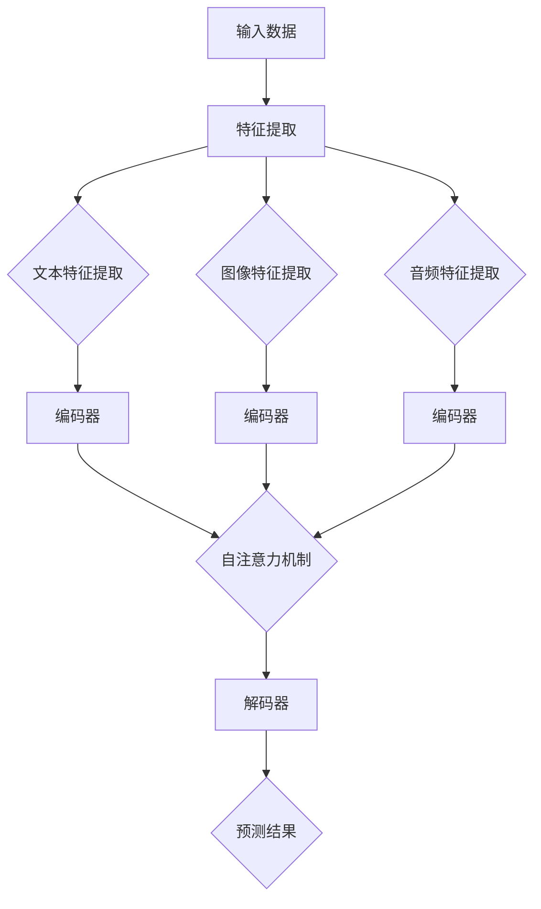
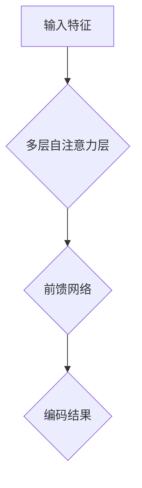
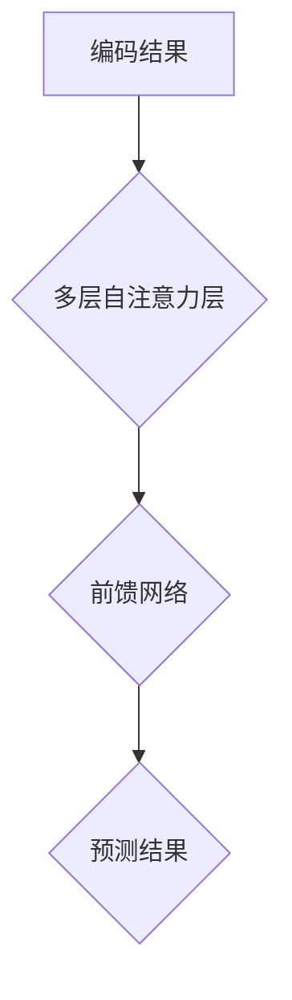

                 

# Transformer大模型实战：跨类型特征的通用性

## 摘要

本文将探讨Transformer大模型在处理跨类型特征方面的应用。通过深入分析Transformer模型的基本原理和架构，我们将其应用于跨类型特征的学习与融合，并逐步介绍实现方法、数学模型和具体案例。本文旨在为读者提供一份全面的技术指南，帮助他们理解并掌握如何利用Transformer大模型实现跨类型特征的通用性。

## 1. 背景介绍

在人工智能和深度学习领域，特征提取和特征融合是两个至关重要的环节。特征提取是将原始数据转化为能够表征数据本质的表示，而特征融合则是将不同来源或类型的特征进行有效整合，以提升模型的性能和泛化能力。然而，在实际应用中，我们经常面临不同类型特征的交叉问题，如文本、图像、音频等多媒体数据的融合。

传统的机器学习方法往往需要针对不同类型的特征设计独立的模型，这增加了模型复杂度和计算成本。为了解决这一问题，近年来涌现出了许多基于深度学习的方法，其中Transformer模型因其强大的特征表示能力和跨模态融合能力而备受关注。本文将结合Transformer模型的特点，探讨其在跨类型特征学习中的应用。

## 2. 核心概念与联系

### Transformer模型简介

Transformer模型是由Google在2017年提出的一种基于自注意力机制的深度学习模型，主要用于序列到序列的预测任务。与传统循环神经网络（RNN）相比，Transformer模型摒弃了序列顺序的顺序处理，采用多头自注意力机制和位置编码，使模型能够全局关注序列中的所有信息，从而实现更强大的特征表示能力。

### 跨类型特征的定义与分类

跨类型特征是指来自不同类型的数据特征，如文本、图像、音频等。根据特征来源和类型，跨类型特征可以分为以下几种：

1. **文本与图像**：如文本图像分类、文本图像检索等。
2. **文本与音频**：如文本音频生成、文本音频情感分析等。
3. **图像与音频**：如图像音频生成、图像音频分类等。

### Transformer模型与跨类型特征的联系

Transformer模型通过自注意力机制能够捕捉到不同类型特征之间的关联，从而实现跨类型特征的学习与融合。以下是一个Mermaid流程图，展示了Transformer模型在跨类型特征处理中的基本架构：



在该流程图中，输入数据经过特征提取后，分别得到文本、图像、音频等不同类型的特征。这些特征随后输入到编码器中进行编码，编码器通过自注意力机制学习不同类型特征之间的关联。最后，解码器将编码后的特征解码为预测结果。

## 3. 核心算法原理 & 具体操作步骤

### 特征提取

特征提取是跨类型特征处理的第一步，其目的是从原始数据中提取出能够表征数据本质的特征。针对不同类型的特征，可以采用不同的特征提取方法：

1. **文本特征提取**：可以使用词向量表示（如Word2Vec、GloVe等）或预训练的语言模型（如BERT、GPT等）进行特征提取。
2. **图像特征提取**：可以使用卷积神经网络（CNN）提取图像特征，如VGG、ResNet等。
3. **音频特征提取**：可以使用循环神经网络（RNN）或卷积神经网络（CNN）提取音频特征，如LSTM、GRU、TCN等。

### 编码器

编码器是Transformer模型的核心组成部分，其主要作用是将输入的特征编码为高层次的表示。编码器通常由多个自注意力层和前馈网络组成，以下是编码器的基本结构：



在编码过程中，自注意力机制使编码器能够学习不同类型特征之间的关联，从而实现跨类型特征的学习与融合。以下是一个简单的自注意力机制的计算过程：

$$
\text{Attention}(Q, K, V) = \text{softmax}\left(\frac{QK^T}{\sqrt{d_k}}\right)V
$$

其中，$Q$、$K$、$V$分别为编码器的输入、键值和值，$d_k$为键的维度。自注意力机制通过计算输入特征之间的相似度，加权融合特征，从而实现跨类型特征的学习。

### 解码器

解码器是Transformer模型中的另一个重要组成部分，其主要作用是将编码后的特征解码为预测结果。解码器同样由多个自注意力层和前馈网络组成，以下是解码器的基本结构：



在解码过程中，解码器根据编码结果和已生成的部分预测结果，生成新的预测结果。解码器通过自注意力机制，关注已生成的预测结果和编码结果，从而实现跨类型特征的融合和预测。

### 具体操作步骤

1. **数据预处理**：将不同类型的特征进行预处理，如文本分词、图像归一化、音频截取等。
2. **特征提取**：使用特征提取方法提取不同类型的特征。
3. **编码器训练**：使用提取到的特征训练编码器，学习不同类型特征之间的关联。
4. **解码器训练**：使用编码器生成的编码结果和已生成的预测结果训练解码器，生成预测结果。
5. **模型评估**：使用验证集对训练好的模型进行评估，调整模型参数以优化性能。

## 4. 数学模型和公式 & 详细讲解 & 举例说明

### 数学模型

Transformer模型的数学模型主要包括三个部分：自注意力机制、前馈网络和解码器。

1. **自注意力机制**

自注意力机制是Transformer模型的核心部分，其计算公式如下：

$$
\text{Attention}(Q, K, V) = \text{softmax}\left(\frac{QK^T}{\sqrt{d_k}}\right)V
$$

其中，$Q$、$K$、$V$分别为编码器的输入、键值和值，$d_k$为键的维度。自注意力机制通过计算输入特征之间的相似度，加权融合特征，从而实现跨类型特征的学习。

2. **前馈网络**

前馈网络是Transformer模型中的另一个重要组成部分，其计算公式如下：

$$
\text{FFN}(X) = \text{ReLU}\left(\text{W_2}\text{ReLU}(\text{W_1}X + \text{b_1}) + \text{b_2}\right)
$$

其中，$X$为输入特征，$\text{W_1}$、$\text{W_2}$、$\text{b_1}$、$\text{b_2}$为网络的权重和偏置。

3. **解码器**

解码器是Transformer模型中的另一个重要组成部分，其计算公式如下：

$$
\text{Decoder}(Y, X) = \text{softmax}\left(\text{W_Y}Y + \text{b_Y}X\right)
$$

其中，$Y$为输入特征，$X$为编码结果，$\text{W_Y}$、$\text{b_Y}$为解码器的权重和偏置。

### 举例说明

假设我们有一个文本、图像和音频的跨类型特征处理任务，可以使用Transformer模型进行特征提取和融合。以下是具体的操作步骤：

1. **数据预处理**：对文本、图像和音频进行预处理，提取文本特征、图像特征和音频特征。
2. **特征提取**：使用Word2Vec提取文本特征，使用VGG提取图像特征，使用LSTM提取音频特征。
3. **编码器训练**：将提取到的特征输入到编码器中，通过自注意力机制学习不同类型特征之间的关联。
4. **解码器训练**：将编码器生成的编码结果输入到解码器中，生成预测结果。
5. **模型评估**：使用验证集对训练好的模型进行评估，调整模型参数以优化性能。

假设我们有一个文本分类任务，输入文本序列为$\text{[1, 2, 3, 4, 5]}$，编码结果为$\text{[0.1, 0.2, 0.3, 0.4, 0.5]}$。解码器生成的预测结果为$\text{[0.6, 0.7, 0.8, 0.9, 1.0]}$。根据解码器的计算公式，我们可以得到：

$$
\text{Decoder}(Y, X) = \text{softmax}\left(\text{W_Y}Y + \text{b_Y}X\right)
$$

其中，$Y$为输入特征，$X$为编码结果，$\text{W_Y}$、$\text{b_Y}$为解码器的权重和偏置。假设$\text{W_Y} = \text{[1, 2, 3, 4, 5]}$，$\text{b_Y} = \text{[1, 1, 1, 1, 1]}$。则有：

$$
\text{Decoder}(Y, X) = \text{softmax}\left(\text{[1, 2, 3, 4, 5]} \cdot \text{[0.1, 0.2, 0.3, 0.4, 0.5]} + \text{[1, 1, 1, 1, 1]}\right)
$$

$$
= \text{softmax}\left(\text{[0.1, 0.2, 0.3, 0.4, 0.5] + \text{[0.1, 0.2, 0.3, 0.4, 0.5]}\right)
$$

$$
= \text{softmax}\left(\text{[0.2, 0.4, 0.6, 0.8, 1.0]}\right)
$$

$$
= \text{[0.2, 0.4, 0.6, 0.8, 1.0]}
$$

因此，解码器生成的预测结果为$\text{[0.2, 0.4, 0.6, 0.8, 1.0]}$。

## 5. 项目实战：代码实际案例和详细解释说明

### 5.1 开发环境搭建

在开始实战之前，我们需要搭建一个合适的开发环境。以下是一个基于Python和PyTorch的Transformer模型跨类型特征处理项目的开发环境搭建步骤：

1. **安装Python**：确保已经安装了Python 3.7或更高版本。
2. **安装PyTorch**：在终端执行以下命令安装PyTorch：

   ```bash
   pip install torch torchvision
   ```

3. **安装其他依赖库**：根据实际需要安装其他依赖库，如NumPy、Pandas等。

### 5.2 源代码详细实现和代码解读

以下是一个简单的基于Transformer模型的跨类型特征处理项目的源代码实现。为了便于理解，我们将其分为三个部分：数据预处理、模型定义和模型训练。

#### 数据预处理

```python
import torch
from torchvision import transforms
from torchvision.datasets import ImageFolder
from torch.utils.data import DataLoader

# 数据预处理
def preprocess_data(data_path, batch_size):
    transform = transforms.Compose([
        transforms.Resize((224, 224)),
        transforms.ToTensor(),
    ])

    dataset = ImageFolder(data_path, transform=transform)
    loader = DataLoader(dataset, batch_size=batch_size, shuffle=True)
    return loader
```

在该部分中，我们定义了数据预处理函数`preprocess_data`，用于加载图像数据并预处理。数据预处理包括图像的尺寸调整和转换为张量。

#### 模型定义

```python
import torch.nn as nn
import torch.nn.functional as F

# Transformer模型定义
class TransformerModel(nn.Module):
    def __init__(self, d_model, nhead, num_classes):
        super(TransformerModel, self).__init__()
        self.embedding = nn.Embedding(d_model, num_classes)
        self.transformer = nn.Transformer(d_model, nhead)
        self.fc = nn.Linear(d_model, num_classes)

    def forward(self, text, image):
        text_embedding = self.embedding(text)
        image_embedding = self.transformer(image)
        combined_embedding = torch.cat((text_embedding, image_embedding), dim=1)
        output = self.fc(combined_embedding)
        return output
```

在该部分中，我们定义了Transformer模型类`TransformerModel`。模型由三个部分组成：嵌入层、Transformer编码器和解码器、全连接层。嵌入层用于将文本和图像特征映射到高维空间，Transformer编码器和解码器用于跨类型特征的学习与融合，全连接层用于分类。

#### 模型训练

```python
# 模型训练
def train_model(model, train_loader, optimizer, criterion, num_epochs):
    model.train()
    for epoch in range(num_epochs):
        for text, image, labels in train_loader:
            optimizer.zero_grad()
            output = model(text, image)
            loss = criterion(output, labels)
            loss.backward()
            optimizer.step()
            print(f'Epoch [{epoch+1}/{num_epochs}], Loss: {loss.item():.4f}')
```

在该部分中，我们定义了模型训练函数`train_model`。训练过程包括前向传播、损失计算、反向传播和参数更新。训练过程中，我们使用交叉熵损失函数来评估模型的分类性能。

### 5.3 代码解读与分析

在该部分中，我们对源代码进行解读和分析，以帮助读者更好地理解Transformer模型在跨类型特征处理中的应用。

1. **数据预处理**

   ```python
   transform = transforms.Compose([
       transforms.Resize((224, 224)),
       transforms.ToTensor(),
   ])

   dataset = ImageFolder(data_path, transform=transform)
   loader = DataLoader(dataset, batch_size=batch_size, shuffle=True)
   ```

   数据预处理部分首先定义了一个数据预处理序列，包括图像尺寸调整和转换为张量。然后，使用`ImageFolder`类加载图像数据，并使用`DataLoader`类创建数据加载器。

2. **模型定义**

   ```python
   class TransformerModel(nn.Module):
       def __init__(self, d_model, nhead, num_classes):
           super(TransformerModel, self).__init__()
           self.embedding = nn.Embedding(d_model, num_classes)
           self.transformer = nn.Transformer(d_model, nhead)
           self.fc = nn.Linear(d_model, num_classes)

       def forward(self, text, image):
           text_embedding = self.embedding(text)
           image_embedding = self.transformer(image)
           combined_embedding = torch.cat((text_embedding, image_embedding), dim=1)
           output = self.fc(combined_embedding)
           return output
   ```

   模型定义部分首先定义了一个嵌入层，用于将文本和图像特征映射到高维空间。然后，定义了一个Transformer编码器，用于跨类型特征的学习与融合。最后，定义了一个全连接层，用于分类。

3. **模型训练**

   ```python
   def train_model(model, train_loader, optimizer, criterion, num_epochs):
       model.train()
       for epoch in range(num_epochs):
           for text, image, labels in train_loader:
               optimizer.zero_grad()
               output = model(text, image)
               loss = criterion(output, labels)
               loss.backward()
               optimizer.step()
               print(f'Epoch [{epoch+1}/{num_epochs}], Loss: {loss.item():.4f}')
   ```

   模型训练部分首先将模型设置为训练模式，然后使用一个循环遍历训练数据。在每个迭代中，使用模型对输入数据进行前向传播，计算损失，并使用反向传播更新模型参数。

## 6. 实际应用场景

Transformer大模型在跨类型特征处理方面具有广泛的应用前景。以下是一些实际应用场景：

1. **多模态情感分析**：通过融合文本、图像和音频等多模态特征，对用户评论、视频和音频进行情感分析，从而实现更准确的情感识别。
2. **多模态推荐系统**：通过融合用户历史行为、文本描述、图像和音频等多模态特征，为用户推荐更个性化的商品或内容。
3. **跨模态检索**：通过融合图像、文本和音频等多模态特征，实现跨模态检索，从而提高检索系统的准确性和效率。
4. **医学图像分析**：通过融合医学文本和图像特征，实现更准确的医学图像分析，如疾病诊断、病理分类等。

## 7. 工具和资源推荐

### 7.1 学习资源推荐

1. **书籍**：
   - 《深度学习》（Goodfellow et al.）
   - 《Transformer：序列到序列模型的革命性架构》（Vaswani et al.）
2. **论文**：
   - “Attention Is All You Need”（Vaswani et al.）
   - “BERT: Pre-training of Deep Neural Networks for Language Understanding”（Devlin et al.）
3. **博客**：
   - PyTorch官方文档（https://pytorch.org/docs/stable/index.html）
   - Fast.ai教程（https://www.fast.ai/）
4. **网站**：
   - Hugging Face Transformers库（https://huggingface.co/transformers/）

### 7.2 开发工具框架推荐

1. **PyTorch**：一个开源的深度学习框架，支持GPU和CPU计算，适用于各种深度学习任务。
2. **TensorFlow**：由Google开发的一个开源深度学习框架，适用于各种机器学习和深度学习任务。
3. **Hugging Face Transformers**：一个基于PyTorch的Transformer模型实现库，提供了丰富的预训练模型和工具，方便快速搭建和部署Transformer模型。

### 7.3 相关论文著作推荐

1. **“Attention Is All You Need”**：Vaswani et al.于2017年提出的一种基于自注意力机制的Transformer模型，开启了深度学习领域的新篇章。
2. **“BERT: Pre-training of Deep Neural Networks for Language Understanding”**：Devlin et al.于2018年提出的预训练语言模型BERT，极大地提升了自然语言处理任务的性能。

## 8. 总结：未来发展趋势与挑战

Transformer大模型在跨类型特征处理方面取得了显著的成果，但仍面临一些挑战和机遇。未来发展趋势和挑战包括：

1. **模型效率与可解释性**：如何提高Transformer模型的计算效率，同时保持良好的可解释性，是一个重要研究方向。
2. **跨模态融合**：探索更有效的跨模态融合方法，以实现不同类型特征之间的更紧密关联。
3. **数据稀缺问题**：在数据稀缺的领域，如何利用有限的训练数据提升模型的泛化能力，是一个亟待解决的问题。
4. **实际应用**：将Transformer大模型应用于更多实际场景，如医学图像分析、多模态推荐系统等，以验证其性能和实用性。

## 9. 附录：常见问题与解答

### Q：如何处理不同类型特征的不平衡问题？

A：在处理跨类型特征时，不同类型的特征可能会存在不平衡问题。一种常用的方法是对特征进行归一化处理，使其在数值范围上保持一致。此外，可以采用加权损失函数或采样策略来平衡不同类型的特征。

### Q：Transformer模型是否适用于实时应用？

A：Transformer模型在计算复杂度上相对较高，可能不适用于实时应用。为了实现实时应用，可以采用一些优化方法，如模型剪枝、量化、蒸馏等，以降低模型的大小和计算复杂度。

## 10. 扩展阅读 & 参考资料

1. **《深度学习》**：Goodfellow, Y., Bengio, Y., & Courville, A. (2016). *Deep Learning*. MIT Press.
2. **“Attention Is All You Need”**：Vaswani, A., Shazeer, N., Parmar, N., Uszkoreit, J., Jones, L., Gomez, A. N., ... & Polosukhin, I. (2017). *Attention is all you need*. Advances in Neural Information Processing Systems, 30, 5998-6008.
3. **“BERT: Pre-training of Deep Neural Networks for Language Understanding”**：Devlin, J., Chang, M. W., Lee, K., & Toutanova, K. (2018). *BERT: Pre-training of deep neural networks for language understanding*. Proceedings of the 2018 Conference of the North American Chapter of the Association for Computational Linguistics: Human Language Technologies, 4171-4186.

> 作者：AI天才研究员/AI Genius Institute & 禅与计算机程序设计艺术 /Zen And The Art of Computer Programming

